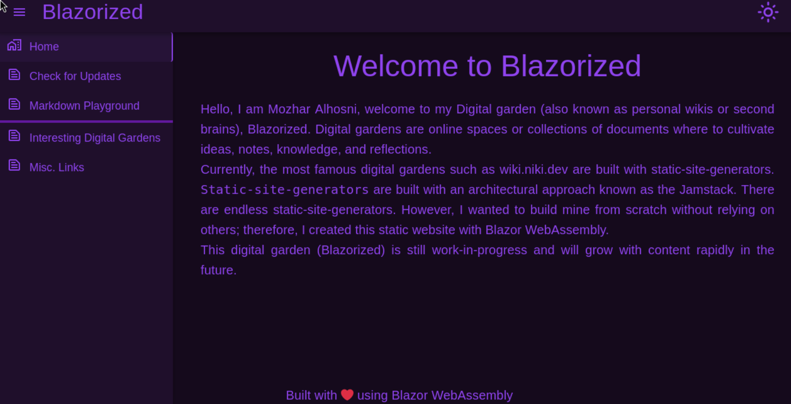
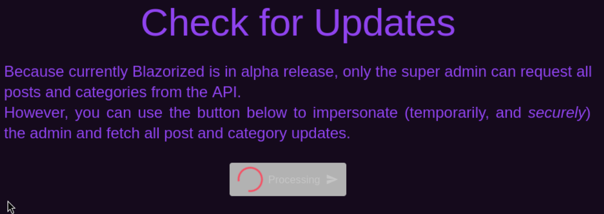
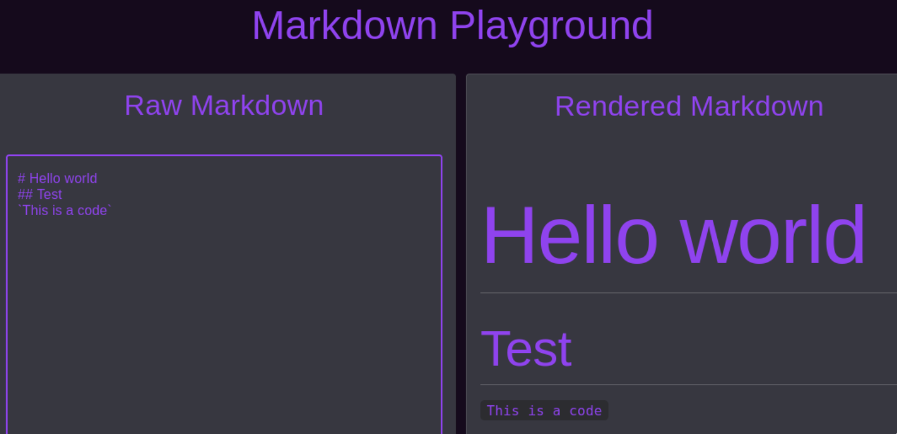
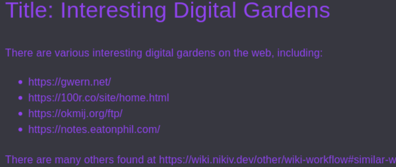
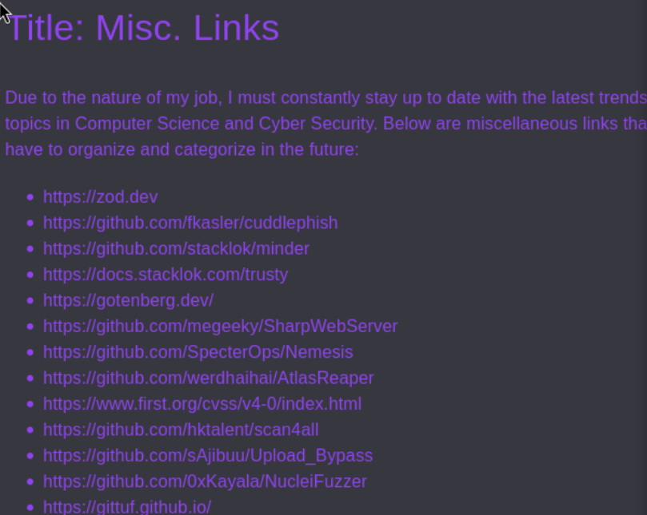
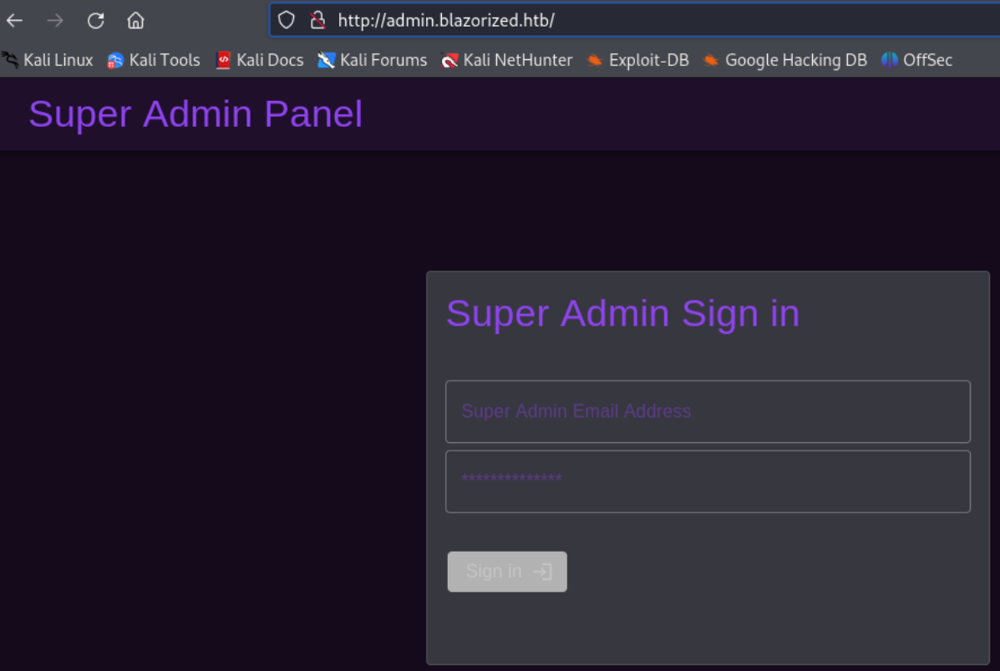

- Machine : https://app.hackthebox.com/machines/Blazorized
- Reference : https://0xdf.gitlab.io/2024/11/09/htb-blazorized.html
- Solved : 2024.00.00. (Thu) (Takes 0days)

## Summary
---


### Key Techniques:


---

# Reconnaissance

### Port Scanning

```bash
┌──(kali㉿kali)-[~/htb]
└─$ ./port-scan.sh 10.10.11.22
Performing quick port scan on 10.10.11.22...
Found open ports: 53,80,88,135,139,389,445,464,593,636,1433,3268,3269,3413,5985,7347,9389,14055,15588,28745,31740,41670,47001,49664,49665,49666,49667,49673,49674,49675,49678,49691,49707,49776
Performing detailed scan on 10.10.11.22...
Starting Nmap 7.94SVN ( https://nmap.org ) at 2025-01-10 12:37 EST
Nmap scan report for 10.10.11.22
Host is up (0.13s latency).

PORT      STATE  SERVICE       VERSION
53/tcp    open   domain        Simple DNS Plus
80/tcp    open   http          Microsoft IIS httpd 10.0
|_http-title: Did not follow redirect to http://blazorized.htb
|_http-server-header: Microsoft-IIS/10.0
88/tcp    open   kerberos-sec  Microsoft Windows Kerberos (server time: 2025-01-10 17:37:40Z)
135/tcp   open   msrpc         Microsoft Windows RPC
139/tcp   open   netbios-ssn   Microsoft Windows netbios-ssn
389/tcp   open   ldap          Microsoft Windows Active Directory LDAP (Domain: blazorized.htb0., Site: Default-First-Site-Name)
445/tcp   open   microsoft-ds?
464/tcp   open   kpasswd5?
593/tcp   open   ncacn_http    Microsoft Windows RPC over HTTP 1.0
636/tcp   open   tcpwrapped
1433/tcp  open   ms-sql-s      Microsoft SQL Server 2022 16.00.1115.00; RC0+
| ms-sql-ntlm-info: 
|   10.10.11.22\BLAZORIZED: 
|     Target_Name: BLAZORIZED
|     NetBIOS_Domain_Name: BLAZORIZED
|     NetBIOS_Computer_Name: DC1
|     DNS_Domain_Name: blazorized.htb
|     DNS_Computer_Name: DC1.blazorized.htb
|     DNS_Tree_Name: blazorized.htb
|_    Product_Version: 10.0.17763
|_ssl-date: 2025-01-10T17:38:46+00:00; -1s from scanner time.
| ms-sql-info: 
|   10.10.11.22\BLAZORIZED: 
|     Instance name: BLAZORIZED
|     Version: 
|       name: Microsoft SQL Server 2022 RC0+
|       number: 16.00.1115.00
|       Product: Microsoft SQL Server 2022
|       Service pack level: RC0
|       Post-SP patches applied: true
|     TCP port: 1433
|_    Clustered: false
| ssl-cert: Subject: commonName=SSL_Self_Signed_Fallback
| Not valid before: 2025-01-10T17:34:27
|_Not valid after:  2055-01-10T17:34:27
3268/tcp  open   ldap          Microsoft Windows Active Directory LDAP (Domain: blazorized.htb0., Site: Default-First-Site-Name)
3269/tcp  open   tcpwrapped
5985/tcp  open   http          Microsoft HTTPAPI httpd 2.0 (SSDP/UPnP)
|_http-server-header: Microsoft-HTTPAPI/2.0
|_http-title: Not Found
9389/tcp  open   mc-nmf        .NET Message Framing
47001/tcp open   http          Microsoft HTTPAPI httpd 2.0 (SSDP/UPnP)
|_http-title: Not Found
|_http-server-header: Microsoft-HTTPAPI/2.0
49664/tcp open   msrpc         Microsoft Windows RPC
49665/tcp open   msrpc         Microsoft Windows RPC
49666/tcp open   msrpc         Microsoft Windows RPC
49667/tcp open   msrpc         Microsoft Windows RPC
49673/tcp open   msrpc         Microsoft Windows RPC
49674/tcp open   ncacn_http    Microsoft Windows RPC over HTTP 1.0
49675/tcp open   msrpc         Microsoft Windows RPC
49678/tcp open   msrpc         Microsoft Windows RPC
49691/tcp open   msrpc         Microsoft Windows RPC
49707/tcp open   msrpc         Microsoft Windows RPC
49776/tcp open   ms-sql-s      Microsoft SQL Server 2022 16.00.1115.00; RC0+
|_ssl-date: 2025-01-10T17:38:46+00:00; -1s from scanner time.
| ssl-cert: Subject: commonName=SSL_Self_Signed_Fallback
| Not valid before: 2025-01-10T17:34:27
|_Not valid after:  2055-01-10T17:34:27
| ms-sql-ntlm-info: 
|   10.10.11.22:49776: 
|     Target_Name: BLAZORIZED
|     NetBIOS_Domain_Name: BLAZORIZED
|     NetBIOS_Computer_Name: DC1
|     DNS_Domain_Name: blazorized.htb
|     DNS_Computer_Name: DC1.blazorized.htb
|     DNS_Tree_Name: blazorized.htb
|_    Product_Version: 10.0.17763
| ms-sql-info: 
|   10.10.11.22:49776: 
|     Version: 
|       name: Microsoft SQL Server 2022 RC0+
|       number: 16.00.1115.00
|       Product: Microsoft SQL Server 2022
|       Service pack level: RC0
|       Post-SP patches applied: true
|_    TCP port: 49776
Service Info: Host: DC1; OS: Windows; CPE: cpe:/o:microsoft:windows

Host script results:
| smb2-security-mode: 
|   3:1:1: 
|_    Message signing enabled and required
| smb2-time: 
|   date: 2025-01-10T17:38:41
|_  start_date: N/A

Service detection performed. Please report any incorrect results at https://nmap.org/submit/ .
Nmap done: 1 IP address (1 host up) scanned in 77.41 seconds
```

- http(80) : Needs to register the domain `blazorized.htb` to `/etc/hosts`.
- dns(53) : Needs to query and try zone transfer.
- smb(139,445) : Not sure if it allows guest login?
- ldap(389) : Try `ldapsearch`?
- mssql(1433) : `xp_cmdshell` maybe after gaining credential.
- kerberos(88) : Maybe useful after obtaining some users.
- winrm(5985) : Useful to spawning a shell after gaining credential.

### http(80)



It looks like a personal web page.

```bash
┌──(kali㉿kali)-[~/htb]
└─$ nikto -h http://blazorized.htb
- Nikto v2.5.0
---------------------------------------------------------------------------
+ Target IP:          10.10.11.22
+ Target Hostname:    blazorized.htb
+ Target Port:        80
+ Start Time:         2025-01-10 12:44:47 (GMT-5)
---------------------------------------------------------------------------
+ Server: Microsoft-IIS/10.0
+ /: The anti-clickjacking X-Frame-Options header is not present. See: https://developer.mozilla.org/en-US/docs/Web/HTTP/Headers/X-Frame-Options
+ /: The X-Content-Type-Options header is not set. This could allow the user agent to render the content of the site in a different fashion to the MIME type. See: https://www.netsparker.com/web-vulnerability-scanner/vulnerabilities/missing-content-type-header/
+ No CGI Directories found (use '-C all' to force check all possible dirs)
+ OPTIONS: Allowed HTTP Methods: OPTIONS, TRACE, GET, HEAD, POST .
+ OPTIONS: Public HTTP Methods: OPTIONS, TRACE, GET, HEAD, POST .


 
┌──(kali㉿kali)-[~/htb]
└─$ gobuster dir -u http://blazorized.htb -w /usr/share/wordlists/dirbuster/directory-list-2.3-medium.txt --exclude-length 1542
===============================================================
Gobuster v3.6
by OJ Reeves (@TheColonial) & Christian Mehlmauer (@firefart)
===============================================================
[+] Url:                     http://blazorized.htb
[+] Method:                  GET
[+] Threads:                 10
[+] Wordlist:                /usr/share/wordlists/dirbuster/directory-list-2.3-medium.txt
[+] Negative Status codes:   404
[+] Exclude Length:          1542
[+] User Agent:              gobuster/3.6
[+] Timeout:                 10s
===============================================================
Starting gobuster in directory enumeration mode
===============================================================
Progress: 12501 / 220561 (5.67%)^C
[!] Keyboard interrupt detected, terminating.
Progress: 12511 / 220561 (5.67%)
===============================================================
Finished
===============================================================
```

`gobuster` and `nikto` couldn't find anything useful.

It seems that the site has many functions. Let's check all these.

**Check for Updates** :



I expected this function to trigger some web request.
However, after taking some time, it triggers 2 requests;

```makefile
OPTIONS /posts HTTP/1.1
Host: api.blazorized.htb
User-Agent: Mozilla/5.0 (X11; Linux aarch64; rv:109.0) Gecko/20100101 Firefox/115.0
Accept: */*
Accept-Language: en-US,en;q=0.5
Accept-Encoding: gzip, deflate, br
Access-Control-Request-Method: GET
Access-Control-Request-Headers: authorization
Referer: http://blazorized.htb/
Origin: http://blazorized.htb
Connection: keep-alive


OPTIONS /categories HTTP/1.1
Host: api.blazorized.htb
User-Agent: Mozilla/5.0 (X11; Linux aarch64; rv:109.0) Gecko/20100101 Firefox/115.0
Accept: */*
Accept-Language: en-US,en;q=0.5
Accept-Encoding: gzip, deflate, br
Access-Control-Request-Method: GET
Access-Control-Request-Headers: authorization
Referer: http://blazorized.htb/
Origin: http://blazorized.htb
Connection: keep-alive
```

Then, it returns "Failed to update Blazorized's content" message.
On the requests' `Host:` field, I found out that it's using `api.blazorized.htb`.
Let's add this to `/etc/hosts` as well.

After adding this on `/etc/hosts`, it returns "Successfully Updated Blazorized's Content!"
After update, I found out that there are more menu on the tab added.


```yaml
HTTP/1.1 204 No Content
Server: Microsoft-IIS/10.0
Access-Control-Allow-Origin: *
Access-Control-Allow-Headers: authorization
Access-Control-Allow-Methods: GET
Date: Fri, 10 Jan 2025 17:58:09 GMT
```

The response implies that the server is running on IIS.

I think it'd be better to fuzz subdomains using `ffuf`.

 ```bash
┌──(kali㉿kali)-[~/htb]
└─$ ffuf -w /usr/share/seclists/Discovery/DNS/namelist.txt:FUZZ -u http://blazorized.htb/ -H 'Host:FUZZ.blazorized.htb' -fs 144 -s
admin
```

It additionally found `admin`. Let's also add this to `/etc/hosts`.

**Markdown Playground** : 



It's taking user input and interpret it as a markdown syntax.
I found `MudBlazor` in its source code;

```html
<link href="_content/MudBlazor/MudBlazor.min.css" rel="stylesheet" />
<link href="_content/MudBlazor.Markdown/MudBlazor.Markdown.min.css" rel="stylesheet" />
<link href="Blazorized.DigitalGarden.styles.css" rel="stylesheet"/>
```

I googled it to check if there's any vulnerability, but there was nothing.

**Interesting Digital Gardens** :



It shows several web URLs of "Digital Garden".

```makefile
GET /posts/09ebf3a0-2cd4-4677-b746-033113ec2009 HTTP/1.1
Host: api.blazorized.htb
User-Agent: Mozilla/5.0 (X11; Linux aarch64; rv:109.0) Gecko/20100101 Firefox/115.0
Accept: */*
Accept-Language: en-US,en;q=0.5
Accept-Encoding: gzip, deflate, br
Referer: http://blazorized.htb/
Origin: http://blazorized.htb
Connection: keep-alive
```

The request for this page is using `api.blazorized.htb` and `GET` to `/posts/09ebf3a0-2cd4-4677-b746-033113ec2009`.
I think the `09ebf3a0-2cd4-4677-b746-033113ec2009` is somewhat encrypted(or hashsed) representation of the post.

**Misc. Links** :



```makefile
GET /posts/baac3b95-c972-4b8b-a158-88c483267b5d HTTP/1.1
Host: api.blazorized.htb
User-Agent: Mozilla/5.0 (X11; Linux aarch64; rv:109.0) Gecko/20100101 Firefox/115.0
Accept: */*
Accept-Language: en-US,en;q=0.5
Accept-Encoding: gzip, deflate, br
Referer: http://blazorized.htb/
Origin: http://blazorized.htb
Connection: keep-alive
```

It's almost the same as "Interesting Digital Gardens" page.

Lastly, let's visit `admin.blazorized.htb`.



It shows a login page for "Super Admin".
I think I can do many powerful things with this..?

> It's out of scope of CPTS... Let's visit it later...