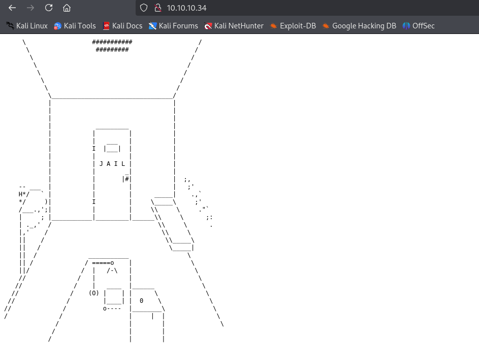
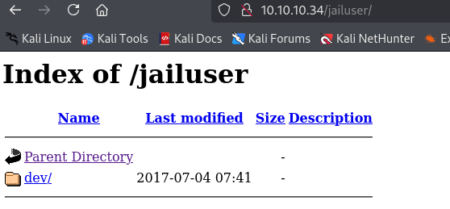
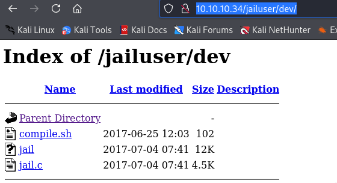

- Machine : https://app.hackthebox.com/machines/Jail
- Reference : https://0xdf.gitlab.io/2022/05/23/htb-jail.html
- Solved : 2025.3.7. (Fri) (Takes 0days)

## Summary
---


### Key Techniques:


---

# Reconnaissance

### Port Scanning

```bash
┌──(kali㉿kali)-[~/htb/jail]
└─$ /opt/custom-scripts/port-scan.sh 10.10.10.34
Performing quick port scan on 10.10.10.34...
Found open ports: 22,80,111,2049,7411,20048
Performing detailed scan on 10.10.10.34...
Starting Nmap 7.94SVN ( https://nmap.org ) at 2025-03-06 20:36 MST
Nmap scan report for 10.10.10.34
Host is up (0.13s latency).

PORT      STATE SERVICE    VERSION
22/tcp    open  ssh        OpenSSH 6.6.1 (protocol 2.0)
| ssh-hostkey: 
|   2048 cd:ec:19:7c:da:dc:16:e2:a3:9d:42:f3:18:4b:e6:4d (RSA)
|   256 af:94:9f:2f:21:d0:e0:1d:ae:8e:7f:1d:7b:d7:42:ef (ECDSA)
|_  256 6b:f8:dc:27:4f:1c:89:67:a4:67:c5:ed:07:53:af:97 (ED25519)
80/tcp    open  http       Apache httpd 2.4.6 ((CentOS))
|_http-server-header: Apache/2.4.6 (CentOS)
| http-methods: 
|_  Potentially risky methods: TRACE
|_http-title: Site doesn't have a title (text/html; charset=UTF-8).
111/tcp   open  rpcbind    2-4 (RPC #100000)
| rpcinfo: 
|   program version    port/proto  service
|   100003  3,4         2049/tcp   nfs
|   100003  3,4         2049/tcp6  nfs
|   100003  3,4         2049/udp   nfs
|   100003  3,4         2049/udp6  nfs
|   100021  1,3,4      34111/tcp   nlockmgr
|   100021  1,3,4      39068/tcp6  nlockmgr
|   100021  1,3,4      48386/udp   nlockmgr
|   100021  1,3,4      55940/udp6  nlockmgr
|   100227  3           2049/tcp   nfs_acl
|   100227  3           2049/tcp6  nfs_acl
|   100227  3           2049/udp   nfs_acl
|_  100227  3           2049/udp6  nfs_acl
2049/tcp  open  nfs        3-4 (RPC #100003)
7411/tcp  open  daqstream?
| fingerprint-strings: 
|   DNSStatusRequestTCP, DNSVersionBindReqTCP, FourOhFourRequest, GenericLines, GetRequest, HTTPOptions, Help, JavaRMI, Kerberos, LANDesk-RC, LDAPBindReq, LDAPSearchReq, LPDString, NCP, NULL, NotesRPC, RPCCheck, RTSPRequest, SIPOptions, SMBProgNeg, SSLSessionReq, TLSSessionReq, TerminalServer, TerminalServerCookie, WMSRequest, X11Probe, afp, giop, ms-sql-s, oracle-tns: 
|_    OK Ready. Send USER command.
20048/tcp open  mountd     1-3 (RPC #100005)
1 service unrecognized despite returning data. If you know the service/version, please submit the following fingerprint at https://nmap.org/cgi-bin/submit.cgi?n

Service detection performed. Please report any incorrect results at https://nmap.org/submit/ .
Nmap done: 1 IP address (1 host up) scanned in 173.53 seconds
```

### http(80)



It's text based drawing of "Jail".

```markdown
┌──(kali㉿kali)-[~/htb/jail]
└─$ gobuster dir -u http://10.10.10.34 -w /usr/share/wordlists/dirbuster/directory-list-2.3-medium.txt -t 50          
===============================================================
Gobuster v3.6
by OJ Reeves (@TheColonial) & Christian Mehlmauer (@firefart)
===============================================================
[+] Url:                     http://10.10.10.34
[+] Method:                  GET
[+] Threads:                 50
[+] Wordlist:                /usr/share/wordlists/dirbuster/directory-list-2.3-medium.txt
[+] Negative Status codes:   404
[+] User Agent:              gobuster/3.6
[+] Timeout:                 10s
===============================================================
Starting gobuster in directory enumeration mode
===============================================================
/jailuser             (Status: 301) [Size: 236] [--> http://10.10.10.34/jailuser/]
```

Gobuster has found one page.



It's a directory listing page.



There are some files in it, let's download them all.

> There's a compatibility issue with arm64 Kali.
> Let's visit this later.


# Shell as `user`

### Whatever


# Shell as `user2`

### Whatever


# Shell as `admin`

### Whatever
