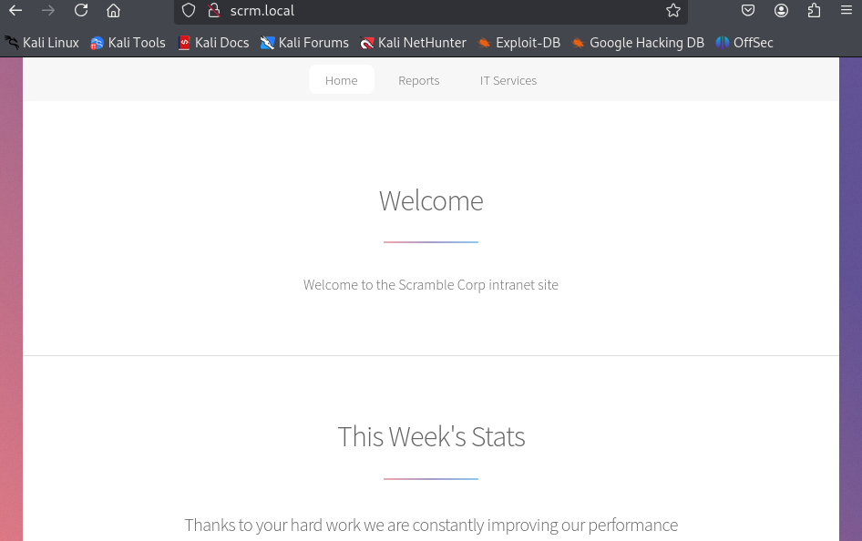
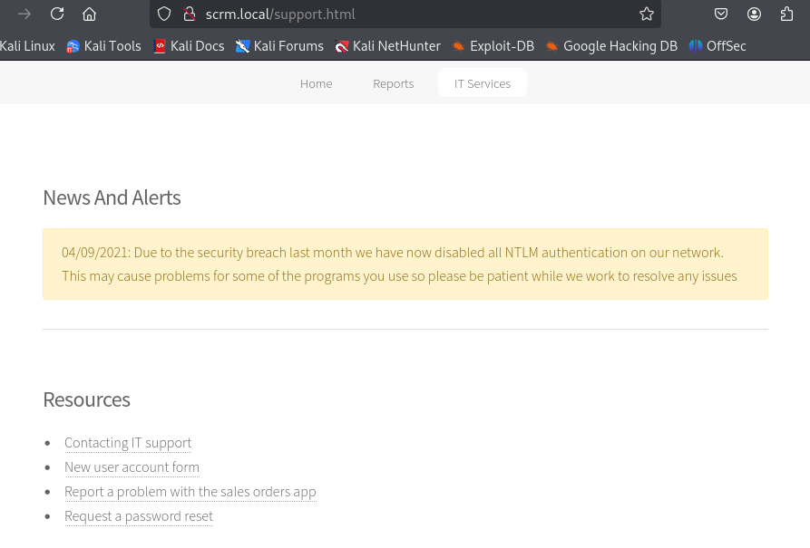
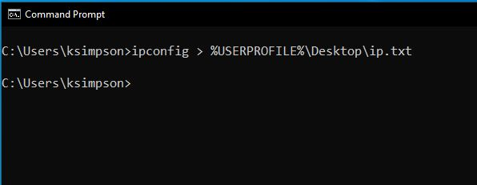
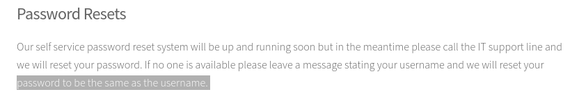

- Machine : https://app.hackthebox.com/machines/scrambled
- Reference : https://0xdf.gitlab.io/2022/10/01/htb-scrambled.html
- Solved : 2025.3.17. (Mon) (Takes 2days)

## Summary
---


### Key Techniques:


---

# Reconnaissance

### Port Scanning

```bash
┌──(kali㉿kali)-[~/htb/scrambled]
└─$ /opt/custom-scripts/port-scan.sh 10.10.11.168
[*] Performing quick TCP port scan on 10.10.11.168...
[*] Performing quick UDP port scan on 10.10.11.168 (top 1000 UDP ports)...
[+] Found open TCP ports: 53,80,88,135,139,389,445,464,593,636,1433,3268,3269,4411,5985,9389,49667,49673,49674,49700,49705
[*] Performing detailed TCP scan on 10.10.11.168...
Starting Nmap 7.94SVN ( https://nmap.org ) at 2025-03-16 10:54 MDT
Nmap scan report for 10.10.11.168
Host is up (0.13s latency).

Bug in ms-sql-ntlm-info: no string output.
PORT      STATE SERVICE       VERSION
53/tcp    open  domain?
80/tcp    open  http          Microsoft IIS httpd 10.0
| http-methods: 
|_  Potentially risky methods: TRACE
|_http-title: Scramble Corp Intranet
|_http-server-header: Microsoft-IIS/10.0
88/tcp    open  kerberos-sec  Microsoft Windows Kerberos (server time: 2025-03-16 16:54:08Z)
135/tcp   open  msrpc         Microsoft Windows RPC
139/tcp   open  netbios-ssn   Microsoft Windows netbios-ssn
389/tcp   open  ldap          Microsoft Windows Active Directory LDAP (Domain: scrm.local0., Site: Default-First-Site-Name)
|_ssl-date: 2025-03-16T16:57:18+00:00; 0s from scanner time.
| ssl-cert: Subject: 
| Subject Alternative Name: DNS:DC1.scrm.local
| Not valid before: 2024-09-04T11:14:45
|_Not valid after:  2121-06-08T22:39:53
445/tcp   open  microsoft-ds?
464/tcp   open  kpasswd5?
593/tcp   open  ncacn_http    Microsoft Windows RPC over HTTP 1.0
636/tcp   open  ssl/ldap      Microsoft Windows Active Directory LDAP (Domain: scrm.local0., Site: Default-First-Site-Name)
|_ssl-date: 2025-03-16T16:57:17+00:00; -1s from scanner time.
| ssl-cert: Subject: 
| Subject Alternative Name: DNS:DC1.scrm.local
| Not valid before: 2024-09-04T11:14:45
|_Not valid after:  2121-06-08T22:39:53
1433/tcp  open  ms-sql-s      Microsoft SQL Server 2019 15.00.2000.00; RTM
| ms-sql-info: 
|   10.10.11.168:1433: 
|     Version: 
|       name: Microsoft SQL Server 2019 RTM
|       number: 15.00.2000.00
|       Product: Microsoft SQL Server 2019
|       Service pack level: RTM
|       Post-SP patches applied: false
|_    TCP port: 1433
|_ssl-date: 2025-03-16T16:57:18+00:00; 0s from scanner time.
| ssl-cert: Subject: commonName=SSL_Self_Signed_Fallback
| Not valid before: 2025-03-16T16:49:57
|_Not valid after:  2055-03-16T16:49:57
3268/tcp  open  ldap          Microsoft Windows Active Directory LDAP (Domain: scrm.local0., Site: Default-First-Site-Name)
|_ssl-date: 2025-03-16T16:57:18+00:00; 0s from scanner time.
| ssl-cert: Subject: 
| Subject Alternative Name: DNS:DC1.scrm.local
| Not valid before: 2024-09-04T11:14:45
|_Not valid after:  2121-06-08T22:39:53
3269/tcp  open  ssl/ldap      Microsoft Windows Active Directory LDAP (Domain: scrm.local0., Site: Default-First-Site-Name)
|_ssl-date: 2025-03-16T16:57:17+00:00; -1s from scanner time.
| ssl-cert: Subject: 
| Subject Alternative Name: DNS:DC1.scrm.local
| Not valid before: 2024-09-04T11:14:45
|_Not valid after:  2121-06-08T22:39:53
4411/tcp  open  found?
| fingerprint-strings: 
|   DNSStatusRequestTCP, DNSVersionBindReqTCP, GenericLines, JavaRMI, Kerberos, LANDesk-RC, LDAPBindReq, LDAPSearchReq, NCP, NULL, NotesRPC, RPCCheck, SMBProgNeg, SSLSessionReq, TLSSessionReq, TerminalServer, TerminalServerCookie, WMSRequest, X11Probe, afp, giop, ms-sql-s, oracle-tns: 
|     SCRAMBLECORP_ORDERS_V1.0.3;
|   FourOhFourRequest, GetRequest, HTTPOptions, Help, LPDString, RTSPRequest, SIPOptions: 
|     SCRAMBLECORP_ORDERS_V1.0.3;
|_    ERROR_UNKNOWN_COMMAND;
5985/tcp  open  http          Microsoft HTTPAPI httpd 2.0 (SSDP/UPnP)
|_http-title: Not Found
|_http-server-header: Microsoft-HTTPAPI/2.0
9389/tcp  open  mc-nmf        .NET Message Framing
```

### dns(53)

```
┌──(kali㉿kali)-[~/htb/scrambled]
└─$ dig axfr @10.10.11.168 scrm.local                                    

; <<>> DiG 9.20.2-1-Debian <<>> axfr @10.10.11.168 scrm.local
; (1 server found)
;; global options: +cmd
; Transfer failed.


┌──(kali㉿kali)-[~/htb/scrambled]
└─$ dig any @10.10.11.168 scrm.local

; <<>> DiG 9.20.2-1-Debian <<>> any @10.10.11.168 scrm.local
; (1 server found)
;; global options: +cmd
;; Got answer:
;; WARNING: .local is reserved for Multicast DNS
;; You are currently testing what happens when an mDNS query is leaked to DNS
;; ->>HEADER<<- opcode: QUERY, status: NOERROR, id: 23371
;; flags: qr aa rd ra; QUERY: 1, ANSWER: 4, AUTHORITY: 0, ADDITIONAL: 3

;; OPT PSEUDOSECTION:
; EDNS: version: 0, flags:; udp: 4000
;; QUESTION SECTION:
;scrm.local.                    IN      ANY

;; ANSWER SECTION:
scrm.local.             600     IN      A       10.10.11.168
scrm.local.             3600    IN      NS      dc1.scrm.local.
scrm.local.             3600    IN      SOA     dc1.scrm.local. hostmaster.scrm.local. 147 900 600 86400 3600
scrm.local.             600     IN      AAAA    dead:beef::1ea:9b00:5807:fc5f

;; ADDITIONAL SECTION:
dc1.scrm.local.         3600    IN      A       10.10.11.168
dc1.scrm.local.         3600    IN      AAAA    dead:beef::1ea:9b00:5807:fc5f

;; Query time: 124 msec
;; SERVER: 10.10.11.168#53(10.10.11.168) (TCP)
;; WHEN: Sun Mar 16 11:41:06 MDT 2025
;; MSG SIZE  rcvd: 192
```

### http(80)





There's a comment that NTLM authentication is disabled due to the security breach.

There are several sub pages listed on "Resources".
Among them, `/supportrequest.html` page contains username : `ksimpson`



Also there's an important comment on `/passwords.html`.



Given that information, I can guess that `ksimpson`'s password might also be reset to `ksimpson`.
Let's test it using `crackmapexec`.

> NTLM limitation setting
> Need to visit later


# Shell as `user`

### Whatever


# Shell as `user2`

### Whatever


# Shell as `admin`

### Whatever
