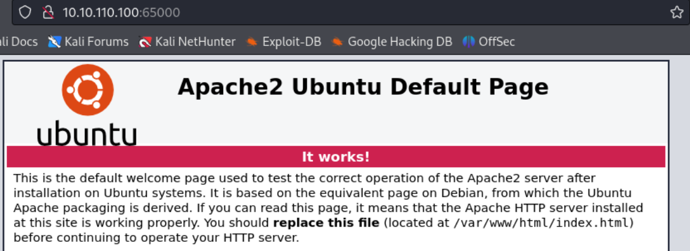
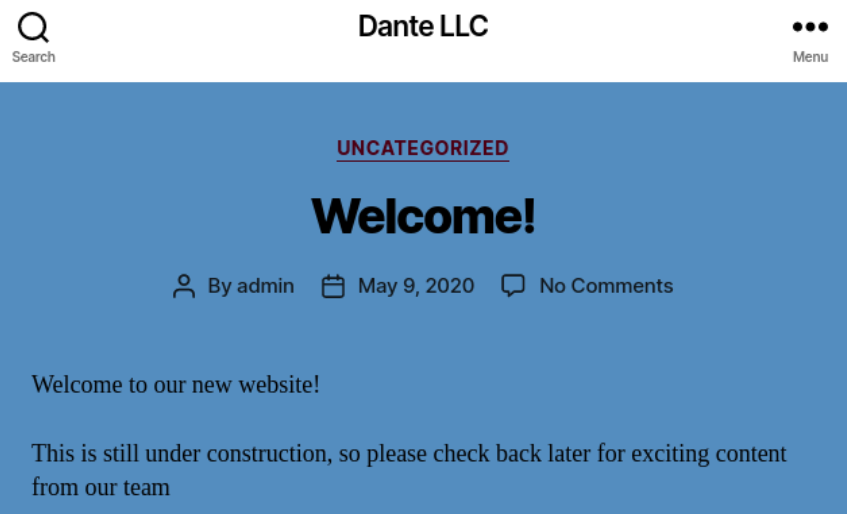

### Ping Sweep

```bash
┌──(kali㉿kali)-[~/htb]
└─$ for i in {1..254}; do (ping -c 1 10.10.110.${i} | grep "bytes from" | grep -v "Unreachable" &); done;
64 bytes from 10.10.110.2: icmp_seq=1 ttl=64 time=126 ms
64 bytes from 10.10.110.100: icmp_seq=1 ttl=62 time=134 ms
```

Since the host on `10.10.110.2` is firewall, there's a single target on `10.10.110.100`.

### Port Scanning

```bash
┌──(kali㉿kali)-[~/htb]
└─$ ./port-scan.sh 10.10.110.100
Performing quick port scan on 10.10.110.100...
Found open ports: 21,22,65000
Performing detailed scan on 10.10.110.100...
Starting Nmap 7.94SVN ( https://nmap.org ) at 2025-01-03 15:53 EST
Nmap scan report for 10.10.110.100
Host is up (0.13s latency).

PORT      STATE SERVICE VERSION
21/tcp    open  ftp     vsftpd 3.0.3
| ftp-anon: Anonymous FTP login allowed (FTP code 230)
|_Can't get directory listing: PASV IP 172.16.1.100 is not the same as 10.10.110.100
| ftp-syst: 
|   STAT: 
| FTP server status:
|      Connected to ::ffff:10.10.14.16
|      Logged in as ftp
|      TYPE: ASCII
|      No session bandwidth limit
|      Session timeout in seconds is 300
|      Control connection is plain text
|      Data connections will be plain text
|      At session startup, client count was 1
|      vsFTPd 3.0.3 - secure, fast, stable
|_End of status
22/tcp    open  ssh     OpenSSH 8.2p1 Ubuntu 4 (Ubuntu Linux; protocol 2.0)
| ssh-hostkey: 
|   3072 8f:a2:ff:cf:4e:3e:aa:2b:c2:6f:f4:5a:2a:d9:e9:da (RSA)
|   256 07:83:8e:b6:f7:e6:72:e9:65:db:42:fd:ed:d6:93:ee (ECDSA)
|_  256 13:45:c5:ca:db:a6:b4:ae:9c:09:7d:21:cd:9d:74:f4 (ED25519)
65000/tcp open  http    Apache httpd 2.4.41 ((Ubuntu))
| http-robots.txt: 2 disallowed entries 
|_/wordpress DANTE{Y0u_Cant_G3t_at_m3_br0!}
|_http-server-header: Apache/2.4.41 (Ubuntu)
|_http-title: Apache2 Ubuntu Default Page: It works
Service Info: OSs: Unix, Linux; CPE: cpe:/o:linux:linux_kernel

Service detection performed. Please report any incorrect results at https://nmap.org/submit/ .
Nmap done: 1 IP address (1 host up) scanned in 17.84 seconds
```

- 3 ports are open : ftp(21), ssh(22), http(65000)
- Here I got the first flag : `DANTE{Y0u_Cant_G3t_at_m3_br0!}`

### ftp(21)

```vbnet
┌──(kali㉿kali)-[~/htb]
└─$ ftp anonymous@10.10.110.100
Connected to 10.10.110.100.
220 (vsFTPd 3.0.3)
331 Please specify the password.
Password: 
230 Login successful.
Remote system type is UNIX.
Using binary mode to transfer files.
ftp> binary
200 Switching to Binary mode.
ftp> ls -al
200 EPRT command successful. Consider using EPSV.
150 Here comes the directory listing.
drwxr-xr-x    3 0        134          4096 Apr 14  2021 .
drwxr-xr-x    3 0        134          4096 Apr 14  2021 ..
drwxr-xr-x    4 0        0            4096 Apr 14  2021 Transfer
226 Directory send OK.
ftp> cd Transfer
250 Directory successfully changed.
ftp> ls
200 EPRT command successful. Consider using EPSV.
150 Here comes the directory listing.
drwxr-xr-x    2 0        0            4096 Apr 14  2021 Incoming
drwxr-xr-x    2 0        0            4096 Aug 04  2020 Outgoing
226 Directory send OK.
ftp> cd Incoming
250 Directory successfully changed.
ftp> ls
200 EPRT command successful. Consider using EPSV.
150 Here comes the directory listing.
-rw-r--r--    1 0        0             310 Aug 04  2020 todo.txt
226 Directory send OK.
ftp> get todo.txt
local: todo.txt remote: todo.txt
200 EPRT command successful. Consider using EPSV.
150 Opening BINARY mode data connection for todo.txt (310 bytes).
100% |******************************|   310        3.35 MiB/s    00:00 ETA
226 Transfer complete.
```

It allows anonymous login. It took a while but when I succeeded directory listing, I could find `transfer` directory which has `Incoming`, and `Outgoing` these two directories.
There's a only single file existing named `todo.txt` in `Incoming` directory.
Given the two directories, I think there might be a process connecting `Incoming` and `Outgoing` directories.

Let's read `todo.txt` first.

```vbnet
┌──(kali㉿kali)-[~/htb]
└─$ cat todo.txt
- Finalize Wordpress permission changes - PENDING
- Update links to to utilize DNS Name prior to changing to port 80 - PENDING
- Remove LFI vuln from the other site - PENDING
- Reset James' password to something more secure - PENDING
- Harden the system prior to the Junior Pen Tester assessment - IN PROGRESS
```

It seems that the file is kind of an order message to development team, or internal todo list for the development team. It provides some useful information about the target server.
- There are some misconfigurations in wordpress permission.
- There might be an internal link which gives us a hint for the domain name.
- There is a server on port 80 which is not exposed.
- Local File Inclusion vulnerability is identified in some web service.
- There's a user for James of which password is weak, and crackable.
Given all this valuable information

### http(65000)



It's a Apache's default page.

Let's fuzz the sub pages using `gobuster`.

```bash
┌──(kali㉿kali)-[~/htb]
└─$ gobuster dir -u http://10.10.110.100:65000 -w /usr/share/wordlists/dirbuster/directory-list-2.3-medium.txt 
===============================================================
Gobuster v3.6
by OJ Reeves (@TheColonial) & Christian Mehlmauer (@firefart)
===============================================================
[+] Url:                     http://10.10.110.100:65000
[+] Method:                  GET
[+] Threads:                 10
[+] Wordlist:                /usr/share/wordlists/dirbuster/directory-list-2.3-medium.txt
[+] Negative Status codes:   404
[+] User Agent:              gobuster/3.6
[+] Timeout:                 10s
===============================================================
Starting gobuster in directory enumeration mode
===============================================================
/wordpress            (Status: 301) [Size: 327] [--> http://10.10.110.100:65000/wordpress/]                                                           
/server-status        (Status: 403) [Size: 281]
Progress: 220560 / 220561 (100.00%)
===============================================================
Finished
===============================================================
```

The only page `/wordpress` implies that the server is running on Wordpress.
Let's visit this page.



It looks like a company's web page.

On "Meet The Team" menu, it shows several employees : Kevin, Balthazar, AJ, Nathan