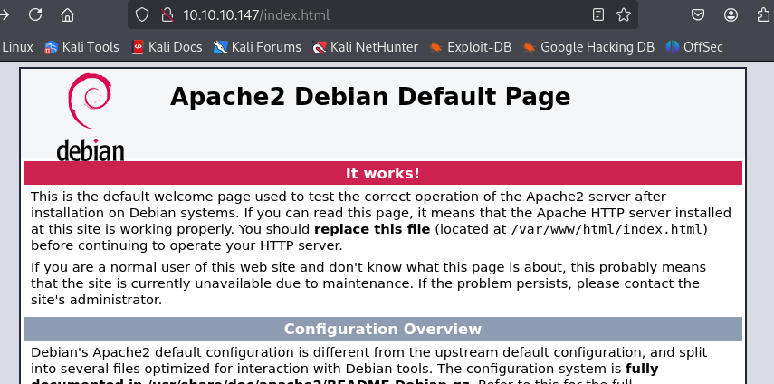

- Machine : https://app.hackthebox.com/machines/safe
- Reference : https://0xdf.gitlab.io/2019/10/26/htb-safe.html
- Solved : 2025.00.00. (Thu) (Takes 0days)

## Summary
---


### Key Techniques:


---

# Reconnaissance

### Port Scanning

```bash
┌──(kali㉿kali)-[~/htb/safe]
└─$ /opt/custom-scripts/port-scan.sh 10.10.10.147
Performing quick port scan on 10.10.10.147...
Found open ports: 22,80,1337
Performing detailed scan on 10.10.10.147...
Starting Nmap 7.94SVN ( https://nmap.org ) at 2025-03-10 02:21 MDT
Nmap scan report for 10.10.10.147
Host is up (0.12s latency).

PORT     STATE SERVICE VERSION
22/tcp   open  ssh     OpenSSH 7.4p1 Debian 10+deb9u6 (protocol 2.0)
| ssh-hostkey: 
|   2048 6d:7c:81:3d:6a:3d:f9:5f:2e:1f:6a:97:e5:00:ba:de (RSA)
|   256 99:7e:1e:22:76:72:da:3c:c9:61:7d:74:d7:80:33:d2 (ECDSA)
|_  256 6a:6b:c3:8e:4b:28:f7:60:85:b1:62:ff:54:bc:d8:d6 (ED25519)
80/tcp   open  http    Apache httpd 2.4.25 ((Debian))
|_http-title: Apache2 Debian Default Page: It works
|_http-server-header: Apache/2.4.25 (Debian)
1337/tcp open  waste?
| fingerprint-strings: 
|   DNSStatusRequestTCP: 
|     04:22:15 up 6 min, 0 users, load average: 0.03, 0.06, 0.03
|   DNSVersionBindReqTCP: 
|     04:22:10 up 6 min, 0 users, load average: 0.04, 0.06, 0.03
|   GenericLines: 
|     04:21:57 up 5 min, 0 users, load average: 0.04, 0.06, 0.03
|     What do you want me to echo back?
|   GetRequest: 
|     04:22:04 up 6 min, 0 users, load average: 0.04, 0.06, 0.03
|     What do you want me to echo back? GET / HTTP/1.0
|   HTTPOptions: 
|     04:22:04 up 6 min, 0 users, load average: 0.04, 0.06, 0.03
|     What do you want me to echo back? OPTIONS / HTTP/1.0
|   Help: 
|     04:22:20 up 6 min, 0 users, load average: 0.03, 0.06, 0.03
|     What do you want me to echo back? HELP
|   NULL: 
|     04:21:57 up 5 min, 0 users, load average: 0.04, 0.06, 0.03
|   RPCCheck: 
|     04:22:04 up 6 min, 0 users, load average: 0.04, 0.06, 0.03
|   RTSPRequest: 
|     04:22:04 up 6 min, 0 users, load average: 0.04, 0.06, 0.03
|     What do you want me to echo back? OPTIONS / RTSP/1.0
|   SSLSessionReq, TerminalServerCookie: 
|     04:22:20 up 6 min, 0 users, load average: 0.03, 0.06, 0.03
|     What do you want me to echo back?
|   TLSSessionReq: 
|     04:22:21 up 6 min, 0 users, load average: 0.03, 0.06, 0.03
|_    What do you want me to echo back?
1 service unrecognized despite returning data. If you know the service/version, please submit the following fingerprint at https://nmap.org/cgi-bin/submit.cgi?
Service Info: OS: Linux; CPE: cpe:/o:linux:linux_kernel

Service detection performed. Please report any incorrect results at https://nmap.org/submit/ .
Nmap done: 1 IP address (1 host up) scanned in 97.02 seconds
```

### http(80)



It's a default apache page.

```bash
┌──(kali㉿kali)-[~/htb/safe]
└─$ gobuster dir -u http://10.10.10.147 -w /usr/share/wordlists/dirbuster/directory-list-2.3-medium.txt
===============================================================
Gobuster v3.6
by OJ Reeves (@TheColonial) & Christian Mehlmauer (@firefart)
===============================================================
[+] Url:                     http://10.10.10.147
[+] Method:                  GET
[+] Threads:                 10
[+] Wordlist:                /usr/share/wordlists/dirbuster/directory-list-2.3-medium.txt
[+] Negative Status codes:   404
[+] User Agent:              gobuster/3.6
[+] Timeout:                 10s
===============================================================
Starting gobuster in directory enumeration mode
===============================================================
/manual               (Status: 301) [Size: 313] [--> http://10.10.10.147/manual/]
Progress: 37114 / 220561 (16.83%)^C
[!] Keyboard interrupt detected, terminating.
Progress: 37115 / 220561 (16.83%)
===============================================================
Finished
===============================================================
```

There was nothing useful found from `gobuster` fuzzing.
I enumerated for a while, and found out that there is a comment on apache default page.

```html
<!DOCTYPE html PUBLIC "-//W3C//DTD XHTML 1.0 Transitional//EN" "http://www.w3.org/TR/xhtml1/DTD/xhtml1-transitional.dtd">
<html xmlns="http://www.w3.org/1999/xhtml">
<!-- 'myapp' can be downloaded to analyze from here
     its running on port 1337 -->
  <head>
    <meta http-equiv="Content-Type" content="text/html; charset=UTF-8" />
    <title>Apache2 Debian Default Page: It works</title>
    <style type="text/css" media="screen">
  * {
    margin: 0px 0px 0px 0px;
    padding: 0px 0px 0px 0px;
  }
```

It's mentioning that `myapp` can be downloaded, and it's running on port 1337.
It seems that `myapp` is an application or binary which is serviced on port 1337.

Let's download the binary.

```bash
┌──(kali㉿kali)-[~/htb/safe]
└─$ wget http://10.10.10.147/myapp
--2025-03-10 03:18:07--  http://10.10.10.147/myapp
Connecting to 10.10.10.147:80... connected.
HTTP request sent, awaiting response... 200 OK
Length: 16592 (16K)
Saving to: ‘myapp.1’

myapp                 100%[============================>]  16.20K  --.-KB/s    in 0.1s    

2025-03-10 03:18:07 (132 KB/s) - ‘myapp’ saved [16592/16592]
```

### tcp(1337)

I can `nc` to this port, and get the output of `uptime`, and then when I enter something, it echo’s back to me (in a kind of busted way):

```bash
┌──(kali㉿kali)-[~/htb/safe]
└─$ nc 10.10.10.147 1337                      
 05:32:03 up  1:16,  0 users,  load average: 0.00, 0.00, 0.00
ls

What do you want me to echo back? ls
```

I played around with this for a bit, looking for different types of command injections, entering things like:

```bash
┌──(kali㉿kali)-[~/htb/safe]
└─$ nc 10.10.10.147 1337
 05:32:57 up  1:16,  0 users,  load average: 0.00, 0.00, 0.00
hi; ping -c 1 10.10.14.6

What do you want me to echo back? hi; ping -c 1 10.10.14.6


┌──(kali㉿kali)-[~/htb/safe]
└─$ nc 10.10.10.147 1337
 05:33:05 up  1:17,  0 users,  load average: 0.00, 0.00, 0.00
`ping -c 1 10.10.14.6`

What do you want me to echo back? `ping -c 1 10.10.14.6`


┌──(kali㉿kali)-[~/htb/safe]
└─$ nc 10.10.10.147 1337
 05:33:13 up  1:17,  0 users,  load average: 0.00, 0.00, 0.00
$(ping -c 1 10.10.14.6)

What do you want me to echo back? $(ping -c 1 10.10.14.6)


┌──(kali㉿kali)-[~/htb/safe]
└─$ nc 10.10.10.147 1337
05:33:21 up  1:17,  0 users,  load average: 0.00, 0.00, 0.00
echo test

What do you want me to echo back? echo test
```

None returned anything interesting other than just that same string coming back at me.

I did notice that if I sent 100 “A”s into it, the echo worked, but with 200, it crashed:

```bash
┌──(kali㉿kali)-[~/htb/safe]
└─$ python -c 'print("A"*100)' | nc 10.10.10.147 1337
 05:35:01 up  1:18,  0 users,  load average: 0.00, 0.00, 0.00

What do you want me to echo back? AAAAAAAAAAAAAAAAAAAAAAAAAAAAAAAAAAAAAAAAAAAAAAAAAAAAAAAAAAAAAAAAAAAAAAAAAAAAAAAAAAAAAAAAAAAAAAAAAAAA


┌──(kali㉿kali)-[~/htb/safe]
└─$ python -c 'print("A"*200)' | nc 10.10.10.147 1337
 05:35:07 up  1:19,  0 users,  load average: 0.00, 0.00, 0.00
```

> Cannot move forward since I'm using ARM64 mac for now..
> Let's try this later.
